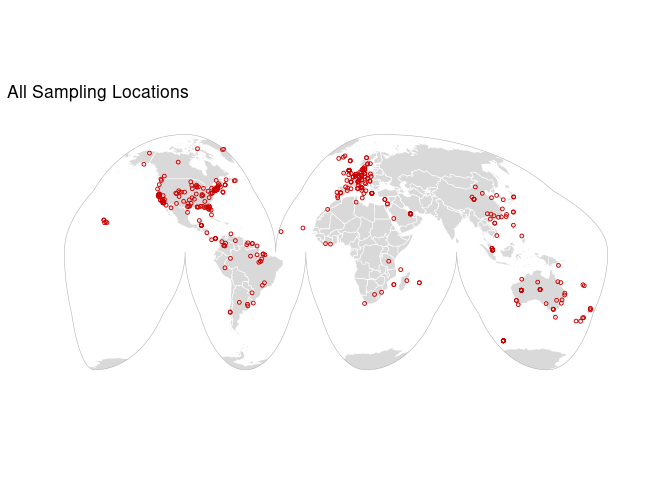
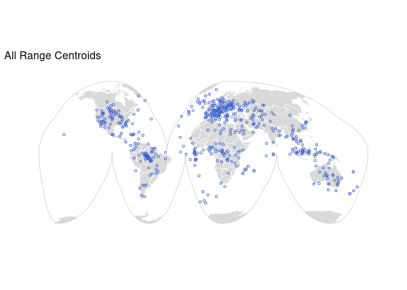

\##Sampling Map

\##Range Centroid Map

\##Heatmap of Distributions

\##Individual Species Maps

### Ovis aries

**Taxon:** Mammals   **Geo Location:** China   **Flags:** Vague
Location; Domesticated;  

### Acomys minous

**Taxon:** Mammals   **Geo Location:** Greece   **Flags:** Outside
Range; Vague Location;  

### Aplidium turbinatum

**Taxon:** Invertebrates   **Geo Location:** United Kingdom  
**Flags:** Vague Location;  

### Ascidia mentula

**Taxon:** Invertebrates   **Geo Location:** United Kingdom  
**Flags:** Vague Location;  

### Ascidiella aspersa

**Taxon:** Invertebrates   **Geo Location:** United Kingdom  
**Flags:** Vague Location;  

### Astatotilapia calliptera

**Taxon:** Fishes   **Geo Location:** United Kingdom   **Flags:**
Outside Range; Vague Location;  

### Aulonocara stuartgranti

**Taxon:** Fishes   **Geo Location:** United Kingdom   **Flags:**
Outside Range; Vague Location;  

### Balearica regulorum gibbericeps

**Taxon:** Birds   **Geo Location:** Denmark: Copenhagen Zoo  
**Flags:** Zoo/Museum;  

### Blennius ocellaris

**Taxon:** Fishes   **Geo Location:** United Kingdom   **Flags:**
Outside Range; Vague Location;  

### Bombina variegata

**Taxon:** Amphibians   **Geo Location:** Poland   **Flags:**
Outside Range; Vague Location;  

### Borostomias antarcticus

**Taxon:** Fishes   **Geo Location:** Southern Ocean   **Flags:**
Outside Range; Vague Location;  

### Bos taurus

**Taxon:** Mammals   **Geo Location:** NA   **Flags:**
Domesticated;  

### Calonectris borealis

**Taxon:** Birds   **Geo Location:** Spain   **Flags:** Outside
Range; Vague Location;  

### Canis lupus orion

**Taxon:** Mammals   **Geo Location:** Greenland   **Flags:**
Vague Location; Domesticated;  

### Capra hircus

**Taxon:** Mammals   **Geo Location:** China: Inner Mongolia  
**Flags:** Domesticated;  

### Carettochelys insculpta

**Taxon:** Reptiles   **Geo Location:** China: Xiong County, Hebei
Province   **Flags:** Outside Range; Vague Location;  

### Clavelina lepadiformis

**Taxon:** Invertebrates   **Geo Location:** United Kingdom  
**Flags:** Vague Location;  

### Corella eumyota

**Taxon:** Invertebrates   **Geo Location:** United Kingdom  
**Flags:** Vague Location;  

### Danio rerio

**Taxon:** Fishes   **Geo Location:** United Kingdom   **Flags:**
Vague Location; Missing Range;  

### Echiichthys vipera

**Taxon:** Fishes   **Geo Location:** United Kingdom   **Flags:**
Vague Location;  

### Electrophorus electricus

**Taxon:** Fishes   **Geo Location:** China   **Flags:** Outside
Range; Vague Location; Missing Range;  

### Epinephelus lanceolatus

**Taxon:** Fishes   **Geo Location:** China   **Flags:** Outside
Range; Vague Location;  

### Eutrigla gurnardus

**Taxon:** Fishes   **Geo Location:** United Kingdom   **Flags:**
Vague Location;  

### Gallus gallus

**Taxon:** Birds   **Geo Location:** USA:Fayetteville, Arkansas  
**Flags:** Outside Range; Domesticated;  

### Grus grus

**Taxon:** Birds   **Geo Location:** United Kingdom   **Flags:**
Outside Range; Vague Location;  

### Gymnoscopelus microlampas

**Taxon:** Fishes   **Geo Location:** Southern Ocean   **Flags:**
Outside Range; Vague Location;  

### Haliaeetus albicilla

**Taxon:** Birds   **Geo Location:** Iceland   **Flags:** Outside
Range; Vague Location;  

### Hyperoodon ampullatus

**Taxon:** Mammals   **Geo Location:** Canada   **Flags:** Outside
Range; Vague Location;  

### Hyperoplus immaculatus

**Taxon:** Fishes   **Geo Location:** United Kingdom   **Flags:**
Vague Location;  

### Melanostigma gelatinosum

**Taxon:** Fishes   **Geo Location:** Southern Ocean   **Flags:**
Vague Location;  

### Mesoplodon bidens

**Taxon:** Mammals   **Geo Location:** Sweden   **Flags:** Outside
Range; Vague Location;  

### Mesoplodon mirus

**Taxon:** Mammals   **Geo Location:** United Kingdom   **Flags:**
Outside Range; Vague Location;  

### Micromesistius poutassou

**Taxon:** Fishes   **Geo Location:** Atlantic Ocean   **Flags:**
Vague Location;  

### Myxine glutinosa

**Taxon:** Fishes   **Geo Location:** Sweden   **Flags:** Outside
Range; Vague Location;  

### Nansenia antarctica

**Taxon:** Fishes   **Geo Location:** Southern Ocean   **Flags:**
Vague Location;  

### Neogale vison

**Taxon:** Mammals   **Geo Location:** United Kingdom   **Flags:**
Outside Range; Vague Location;  

### Netta rufina

**Taxon:** Birds   **Geo Location:** United Kingdom   **Flags:**
Outside Range; Vague Location; Missing Range;  

### Notolepis coatsi

**Taxon:** Fishes   **Geo Location:** Southern Ocean   **Flags:**
Vague Location;  

### Notothenia rossii

**Taxon:** Fishes   **Geo Location:** Southern Ocean   **Flags:**
Vague Location;  

### Oryctolagus cuniculus

**Taxon:** Mammals   **Geo Location:** United Kingdom   **Flags:**
Outside Range; Vague Location;  

### Pagrus pagrus

**Taxon:** Fishes   **Geo Location:** United Kingdom   **Flags:**
Outside Range; Vague Location;  

### Pelophylax lessonae

**Taxon:** Amphibians   **Geo Location:** United Kingdom  
**Flags:** Outside Range; Vague Location;  

### Phalacrocorax carbo

**Taxon:** Birds   **Geo Location:** Japan   **Flags:** Outside
Range; Vague Location;  

### Phascolarctos cinereus

**Taxon:** Mammals   **Geo Location:** Australia   **Flags:**
Outside Range; Vague Location;  

### Pholis gunnellus

**Taxon:** Fishes   **Geo Location:** United Kingdom   **Flags:**
Vague Location; Missing Range;  

### Pipistrellus hanaki

**Taxon:** Mammals   **Geo Location:** Greece   **Flags:** Outside
Range; Vague Location; Missing Range;  

### Platalea leucorodia

**Taxon:** Birds   **Geo Location:** United Kingdom   **Flags:**
Outside Range; Vague Location;  

### Podarcis bocagei

**Taxon:** Reptiles   **Geo Location:** Portugal   **Flags:**
Outside Range; Vague Location;  

### Podarcis cretensis

**Taxon:** Reptiles   **Geo Location:** Greece   **Flags:**
Outside Range; Vague Location;  

### Podarcis filfolensis

**Taxon:** Reptiles   **Geo Location:** Malta   **Flags:** Outside
Range; Vague Location;  

### Podarcis liolepis

**Taxon:** Reptiles   **Geo Location:** Spain   **Flags:** Outside
Range; Vague Location;  

### Podarcis pityusensis

**Taxon:** Reptiles   **Geo Location:** Spain   **Flags:** Outside
Range; Vague Location; Missing Range;  

### Podarcis tiliguerta

**Taxon:** Reptiles   **Geo Location:** Italy   **Flags:** Outside
Range; Vague Location; Missing Range;  

### Podarcis vaucheri

**Taxon:** Reptiles   **Geo Location:** Morocco   **Flags:**
Outside Range; Vague Location;  

### Polymixia cf. hollisterae

**Taxon:** Fishes   **Geo Location:** Australia: Indian Ocean
Territories, Christmas Island   **Flags:** Vague Location;  

### Poromitra crassiceps

**Taxon:** Fishes   **Geo Location:** Southern Ocean   **Flags:**
Outside Range; Vague Location;  

### Protomyctophum parallelum

**Taxon:** Fishes   **Geo Location:** Southern Ocean   **Flags:**
Outside Range; Vague Location; Missing Range;  

### Rhamphochromis chilingali

**Taxon:** Fishes   **Geo Location:** United Kingdom   **Flags:**
Vague Location;  

### Solea solea

**Taxon:** Fishes   **Geo Location:** Belgium   **Flags:** Outside
Range; Vague Location;  

### Spermophilus citellus

**Taxon:** Mammals   **Geo Location:** Greece   **Flags:** Outside
Range; Vague Location;  

### Stenella coeruleoalba

**Taxon:** Mammals   **Geo Location:** United Kingdom   **Flags:**
Outside Range; Vague Location;  

### Styela clava

**Taxon:** Invertebrates   **Geo Location:** United Kingdom  
**Flags:** Vague Location;  

### Telmatherina bonti

**Taxon:** Fishes   **Geo Location:** Germany   **Flags:** Outside
Range; Vague Location;  

### Tetrao urogallus

**Taxon:** Birds   **Geo Location:** United Kingdom   **Flags:**
Outside Range; Vague Location;  

### Thalia democratica

**Taxon:** Invertebrates   **Geo Location:** France   **Flags:**
Vague Location;  

### Thunnus albacares

**Taxon:** Fishes   **Geo Location:** Australia   **Flags:**
Outside Range; Vague Location;  

### Thunnus maccoyii

**Taxon:** Fishes   **Geo Location:** Australia   **Flags:**
Outside Range; Vague Location;  

### Thunnus thynnus

**Taxon:** Fishes   **Geo Location:** Italy   **Flags:** Outside
Range; Vague Location;  

### Trididemnum clinides

**Taxon:** Invertebrates   **Geo Location:** Japan   **Flags:**
Vague Location;  

### Zosterops lateralis

**Taxon:** Birds   **Geo Location:** Australia   **Flags:**
Outside Range; Vague Location; Missing Range;  

### Abramis brama

**Taxon:** Fishes   **Geo Location:** United Kingdom   **Flags:**
Vague Location; Missing Range;  

### Accipiter gentilis

**Taxon:** Birds   **Geo Location:** United Kingdom   **Flags:**
Vague Location;  

### Acridotheres tristis

**Taxon:** Birds   **Geo Location:** Israel: Tel Aviv   **Flags:**
Outside Range;  

### Amia calva

**Taxon:** Fishes   **Geo Location:** USA: Vacherie, Louisiana  
**Flags:**  

### Ammodytes marinus

**Taxon:** Fishes   **Geo Location:** Faroe Islands   **Flags:**
 

### Anableps anableps

**Taxon:** Fishes   **Geo Location:** Germany: Wilhelma Zoo,
Stuttgart   **Flags:** Zoo/Museum;  

### Anas acuta

**Taxon:** Birds   **Geo Location:** United Kingdom   **Flags:**
Vague Location;  

### Anas platyrhynchos

**Taxon:** Birds   **Geo Location:** United Kingdom   **Flags:**
Vague Location;  

### Anser anser

**Taxon:** Birds   **Geo Location:** United Kingdom   **Flags:**
Vague Location; Missing Range;  

### Anser brachyrhynchus

**Taxon:** Birds   **Geo Location:** United Kingdom   **Flags:**
Vague Location;  

### Antennarius maculatus

**Taxon:** Fishes   **Geo Location:** Netherlands: Dejong Marinelife,
Rotterdam   **Flags:** Outside Range; Missing Range;  

### Antrozous pallidus

**Taxon:** Mammals   **Geo Location:** USA:Elephant Mountain,
Brewster County, Texas   **Flags:** Outside Range; Missing Range;
 

### Apodemus sylvaticus

**Taxon:** Mammals   **Geo Location:** United Kingdom   **Flags:**
Vague Location; Missing Range;  

### Apteryx mantelli

**Taxon:** Birds   **Geo Location:** USA: Smithsonian’s National Zoo
& Conservation Biology Institute, Front Royal, VA   **Flags:**
Zoo/Museum;  

### Ara ararauna

**Taxon:** Birds   **Geo Location:** USA: Dripping Springs, Texas
  **Flags:** Outside Range;  

### Archocentrus centrarchus

**Taxon:** Fishes   **Geo Location:** Nicaragua   **Flags:**
Outside Range;  

### Argentina silus

**Taxon:** Fishes   **Geo Location:** Faroe Islands   **Flags:**
 

### Arripis georgiana

**Taxon:** Fishes   **Geo Location:** Australia: Western Australia,
Middle Island   **Flags:**  

### Arvicanthis niloticus

**Taxon:** Mammals   **Geo Location:** USA: Santa Barbara  
**Flags:** Outside Range;  

### Asterias rubens

**Taxon:** Invertebrates   **Geo Location:** NA   **Flags:**  

### Athene noctua

**Taxon:** Birds   **Geo Location:** United Kingdom   **Flags:**
Vague Location;  

### Aythya ferina

**Taxon:** Birds   **Geo Location:** United Kingdom   **Flags:**
Vague Location;  

### Aythya marila

**Taxon:** Birds   **Geo Location:** United Kingdom   **Flags:**
Vague Location;  

### Balaenoptera acutorostrata

**Taxon:** Mammals   **Geo Location:** United Kingdom   **Flags:**
Vague Location;  

### Balaenoptera borealis

**Taxon:** Mammals   **Geo Location:** United Kingdom   **Flags:**
Vague Location;  

### Balaenoptera physalus

**Taxon:** Mammals   **Geo Location:** United Kingdom   **Flags:**
Vague Location;  

### Balaenoptera ricei

**Taxon:** Mammals   **Geo Location:** USA: Gulf of Mexico,
Sandestin, Florida   **Flags:** Outside Range;  

### Balanoglossus misakiensis

**Taxon:** Invertebrates   **Geo Location:** China: Qingdao  
**Flags:**  

### Barbatula barbatula

**Taxon:** Fishes   **Geo Location:** United Kingdom   **Flags:**
Vague Location;  

### Barbus barbus

**Taxon:** Fishes   **Geo Location:** United Kingdom   **Flags:**
Vague Location; Missing Range;  

### Branchiostoma belcheri

**Taxon:** Invertebrates   **Geo Location:** NA   **Flags:**  

### Branchiostoma floridae

**Taxon:** Invertebrates   **Geo Location:** NA   **Flags:**  

### Branchiostoma lanceolatum

**Taxon:** Invertebrates   **Geo Location:** Italy   **Flags:**
 

### Branta canadensis

**Taxon:** Birds   **Geo Location:** United Kingdom   **Flags:**
Vague Location;  

### Bucephala clangula

**Taxon:** Birds   **Geo Location:** United Kingdom   **Flags:**
Vague Location;  

### Bucorvus abyssinicus

**Taxon:** Birds   **Geo Location:** Denmark: Copenhagen Zoo  
**Flags:** Zoo/Museum;  

### Bufo bufo

**Taxon:** Amphibians   **Geo Location:** United Kingdom  
**Flags:** Vague Location;  

### Buteo buteo

**Taxon:** Birds   **Geo Location:** United Kingdom   **Flags:**
Vague Location;  

### Caesio teres

**Taxon:** Fishes   **Geo Location:** Australia: Indian Ocean
Territories, Christmas Island   **Flags:** Vague Location; Missing
Range;  

### Callithrix jacchus

**Taxon:** Mammals   **Geo Location:** USA: Pittsburgh  
**Flags:** Outside Range;  

### Caloenas nicobarica

**Taxon:** Birds   **Geo Location:** USA: Bronx Zoo, New York  
**Flags:** Zoo/Museum;  

### Calypte anna

**Taxon:** Birds   **Geo Location:** USA   **Flags:** Outside
Range;  

### Candoia aspera

**Taxon:** Reptiles   **Geo Location:** USA: Ophidian Research
Colony, at University of Texas at Tyler   **Flags:** Outside Range;
 

### Canis lupus baileyi

**Taxon:** Mammals   **Geo Location:** USA: Eureka, Missouri  
**Flags:** Domesticated;  

### Canis lupus familiaris

**Taxon:** Mammals   **Geo Location:** NA   **Flags:**
Domesticated;  

### Caprimulgus europaeus

**Taxon:** Birds   **Geo Location:** Italy   **Flags:** Vague
Location;  

### Carassius carassius

**Taxon:** Fishes   **Geo Location:** United Kingdom   **Flags:**
Vague Location;  

### Cariama cristata

**Taxon:** Birds   **Geo Location:** Denmark: Copenhagen Zoo  
**Flags:** Zoo/Museum;  

### Centroberyx gerrardi

**Taxon:** Fishes   **Geo Location:** Australia: Western Australia,
Middle Island   **Flags:**  

### Cervus elaphus

**Taxon:** Mammals   **Geo Location:** United Kingdom   **Flags:**
Vague Location; Missing Range;  

### Cetorhinus maximus

**Taxon:** Fishes   **Geo Location:** United Kingdom   **Flags:**
Vague Location;  

### Chelon labrosus

**Taxon:** Fishes   **Geo Location:** United Kingdom   **Flags:**
Vague Location;  

### Chionomys nivalis

**Taxon:** Mammals   **Geo Location:** Slovenia   **Flags:** Vague
Location;  

### Choerodon schoenleinii

**Taxon:** Fishes   **Geo Location:** China: Hainan   **Flags:**
 

### Choloepus didactylus

**Taxon:** Mammals   **Geo Location:** Germany: Tierpark, Berlin  
**Flags:** Outside Range;  

### Chroicocephalus ridibundus

**Taxon:** Birds   **Geo Location:** United Kingdom   **Flags:**
Vague Location;  

### Cinclus cinclus

**Taxon:** Birds   **Geo Location:** United Kingdom   **Flags:**
Vague Location; Missing Range;  

### Clangula hyemalis

**Taxon:** Birds   **Geo Location:** United Kingdom   **Flags:**
Vague Location;  

### Clarias gariepinus

**Taxon:** Fishes   **Geo Location:** Germany: Rostock  
**Flags:** Outside Range;  

### Colius striatus

**Taxon:** Birds   **Geo Location:** Denmark: Copenhagen Zoo  
**Flags:** Zoo/Museum;  

### Coloeus monedula

**Taxon:** Birds   **Geo Location:** United Kingdom   **Flags:**
Vague Location;  

### Columba livia

**Taxon:** Birds   **Geo Location:** USA: Davis, CA   **Flags:**
Outside Range;  

### Conger conger

**Taxon:** Fishes   **Geo Location:** United Kingdom   **Flags:**
Vague Location;  

### Coregonus lavaretus

**Taxon:** Fishes   **Geo Location:** United Kingdom   **Flags:**
Vague Location; Missing Range;  

### Corvus hawaiiensis

**Taxon:** Birds   **Geo Location:** USA: University of Hawaii at
Manoa   **Flags:** Outside Range;  

### Cristiceps australis

**Taxon:** Fishes   **Geo Location:** Australia: Western Australia,
Daw Island   **Flags:** Outside Range;  

### Cyclopterus lumpus

**Taxon:** Fishes   **Geo Location:** Canada: Atlantic Ocean  
**Flags:**  

### Cyclura pinguis

**Taxon:** Reptiles   **Geo Location:** USA: San Diego Zoo, San Diego
  **Flags:** Zoo/Museum;  

### Cygnus columbianus

**Taxon:** Birds   **Geo Location:** United Kingdom   **Flags:**
Vague Location;  

### Dama dama

**Taxon:** Mammals   **Geo Location:** Denmark   **Flags:** Vague
Location;  

### Dasyurus maculatus

**Taxon:** Mammals   **Geo Location:** missing   **Flags:**
Outside Range;  

### Delphinus delphis

**Taxon:** Mammals   **Geo Location:** United Kingdom   **Flags:**
Vague Location;  

### Dendropsophus ebraccatus

**Taxon:** Amphibians   **Geo Location:** USA: Vassar College,
Poughkeepsie, New York   **Flags:** Outside Range;  

### Dibamus smithi

**Taxon:** Reptiles   **Geo Location:** Viet Nam: Binh Thuan  
**Flags:** Outside Range; Missing Range;  

### Dromaius novaehollandiae

**Taxon:** Birds   **Geo Location:** USA: Bronx Zoo, New York  
**Flags:** Zoo/Museum;  

### Electrona antarctica

**Taxon:** Fishes   **Geo Location:** Southern Ocean   **Flags:**
Vague Location;  

### Elephas maximus indicus

**Taxon:** Mammals   **Geo Location:** USA: San Diego Zoo  
**Flags:** Zoo/Museum;  

### Emys orbicularis

**Taxon:** Reptiles   **Geo Location:** Italy: Reserve Naturale Monte
Rufeno   **Flags:**  

### Engystomops pustulosus

**Taxon:** Amphibians   **Geo Location:** USA: Stockton, California
  **Flags:** Outside Range;  

### Enoplosus armatus

**Taxon:** Fishes   **Geo Location:** Australia: Western Australia,
Middle Island   **Flags:** Outside Range;  

### Epinephelus rankini

**Taxon:** Fishes   **Geo Location:** Australia: Western Australia,
Muirion Islands   **Flags:** Outside Range; Missing Range;  

### Eptesicus nilssonii

**Taxon:** Mammals   **Geo Location:** Norway   **Flags:** Vague
Location;  

### Erinaceus europaeus

**Taxon:** Mammals   **Geo Location:** United Kingdom   **Flags:**
Vague Location;  

### Eudromia elegans

**Taxon:** Birds   **Geo Location:** Denmark: Copenhagen, Copenhagen
Zoo   **Flags:** Zoo/Museum;  

### Falco biarmicus

**Taxon:** Birds   **Geo Location:** Qatar:Doha   **Flags:**
Outside Range;  

### Falco punctatus

**Taxon:** Birds   **Geo Location:** Mauritius   **Flags:** Vague
Location;  

### Falco rusticolus

**Taxon:** Birds   **Geo Location:** Qatar   **Flags:** Outside
Range;  

### Fringilla coelebs

**Taxon:** Birds   **Geo Location:** United Kingdom   **Flags:**
Vague Location;  

### Fundulus diaphanus

**Taxon:** Fishes   **Geo Location:** Canada: St. John’s,
Newfoundland and Labrador   **Flags:**  

### Furcifer pardalis

**Taxon:** Reptiles   **Geo Location:** China: Beijing  
**Flags:** Outside Range;  

### Gadus morhua

**Taxon:** Fishes   **Geo Location:** NA   **Flags:**  

### Gallinula chloropus

**Taxon:** Birds   **Geo Location:** United Kingdom   **Flags:**
Vague Location;  

### Gasterosteus aculeatus

**Taxon:** Fishes   **Geo Location:** United Kingdom   **Flags:**
Vague Location;  

### Gavia stellata

**Taxon:** Birds   **Geo Location:** Greenland   **Flags:**
Outside Range;  

### Gavialis gangeticus

**Taxon:** Reptiles   **Geo Location:** USA: San Diego Zoo, San Diego
  **Flags:** Zoo/Museum;  

### Globicephala melas

**Taxon:** Mammals   **Geo Location:** United Kingdom   **Flags:**
Vague Location;  

### Gobio gobio

**Taxon:** Fishes   **Geo Location:** United Kingdom   **Flags:**
Vague Location;  

### Gobius niger

**Taxon:** Fishes   **Geo Location:** United Kingdom   **Flags:**
Vague Location;  

### Gopherus evgoodei

**Taxon:** Reptiles   **Geo Location:** Mexico: Sonora  
**Flags:** Outside Range;  

### Gopherus flavomarginatus

**Taxon:** Reptiles   **Geo Location:** USA: Raton, New Mexico  
**Flags:** Outside Range; Missing Range;  

### Grampus griseus

**Taxon:** Mammals   **Geo Location:** United Kingdom   **Flags:**
Vague Location;  

### Gulosus aristotelis

**Taxon:** Birds   **Geo Location:** United Kingdom   **Flags:**
Vague Location;  

### Gymnoscopelus braueri

**Taxon:** Fishes   **Geo Location:** Southern Ocean   **Flags:**
Vague Location;  

### Halichoerus grypus

**Taxon:** Mammals   **Geo Location:** United Kingdom   **Flags:**
Vague Location;  

### Hemiscyllium ocellatum

**Taxon:** Fishes   **Geo Location:** Australia: Clayton, Melbourne,
Victoria   **Flags:** Outside Range;  

### Heptranchias perlo

**Taxon:** Fishes   **Geo Location:** Japan: Okinawa Island  
**Flags:** Outside Range; Missing Range;  

### Heterohyrax brucei

**Taxon:** Mammals   **Geo Location:** Germany: Opel Zoo, Kronberg im
Taunus   **Flags:** Zoo/Museum;  

### Hippopotamus amphibius

**Taxon:** Mammals   **Geo Location:** USA: San Diego Zoo, San Diego
  **Flags:** Zoo/Museum;  

### Hirundo rustica

**Taxon:** Birds   **Geo Location:** Italy   **Flags:** Vague
Location;  

### Homo sapiens

**Taxon:** Mammals   **Geo Location:** NA   **Flags:**  

### Hyperolius riggenbachi

**Taxon:** Amphibians   **Geo Location:** USA: San Francisco,
California   **Flags:** Outside Range;  

### Jaculus jaculus

**Taxon:** Mammals   **Geo Location:** USA: San Diego   **Flags:**
Outside Range;  

### Labrus bergylta

**Taxon:** Fishes   **Geo Location:** United Kingdom   **Flags:**
Vague Location;  

### Labrus mixtus

**Taxon:** Fishes   **Geo Location:** United Kingdom   **Flags:**
Vague Location;  

### Lagenorhynchus acutus

**Taxon:** Mammals   **Geo Location:** United Kingdom   **Flags:**
Vague Location;  

### Lagenorhynchus albirostris

**Taxon:** Mammals   **Geo Location:** United Kingdom   **Flags:**
Vague Location;  

### Lampetra fluviatilis

**Taxon:** Fishes   **Geo Location:** United Kingdom   **Flags:**
Vague Location;  

### Lampris incognitus

**Taxon:** Fishes   **Geo Location:** USA: Pacific, San Diego Coast
  **Flags:**  

### Larus argentatus

**Taxon:** Birds   **Geo Location:** Norway   **Flags:** Vague
Location;  

### Larus fuscus

**Taxon:** Birds   **Geo Location:** United Kingdom   **Flags:**
Vague Location;  

### Larus michahellis

**Taxon:** Birds   **Geo Location:** Switzerland   **Flags:**
Vague Location;  

### Lateolabrax maculatus

**Taxon:** Fishes   **Geo Location:** China   **Flags:** Vague
Location;  

### Lathamus discolor

**Taxon:** Birds   **Geo Location:** Australia: North Bruny, Tasmania
  **Flags:** Outside Range;  

### Latimeria chalumnae

**Taxon:** Fishes   **Geo Location:** Comoros: Grande Comore Island,
Africa   **Flags:**  

### Lemur catta

**Taxon:** Mammals   **Geo Location:** Denmark: Copenhagen Zoo  
**Flags:** Zoo/Museum;  

### Lepidogalaxias salamandroides

**Taxon:** Fishes   **Geo Location:** Australia: Western Australia
  **Flags:** Outside Range; Missing Range;  

### Leptosomus discolor

**Taxon:** Birds   **Geo Location:** Germany: Walsrode Bird Park  
**Flags:** Outside Range;  

### Lethrinus nebulosus

**Taxon:** Fishes   **Geo Location:** Australia: Western Australia,
SW of Barrow Island   **Flags:** Outside Range;  

### Leuciscus leuciscus

**Taxon:** Fishes   **Geo Location:** United Kingdom   **Flags:**
Vague Location;  

### Liasis olivaceus

**Taxon:** Reptiles   **Geo Location:** Australia: Perth Zoo,
Australia   **Flags:** Zoo/Museum;  

### Limanda limanda

**Taxon:** Fishes   **Geo Location:** United Kingdom   **Flags:**
Vague Location;  

### Lipophrys pholis

**Taxon:** Fishes   **Geo Location:** United Kingdom   **Flags:**
Vague Location;  

### Lissotriton helveticus

**Taxon:** Amphibians   **Geo Location:** United Kingdom  
**Flags:** Vague Location;  

### Lissotriton vulgaris

**Taxon:** Amphibians   **Geo Location:** United Kingdom  
**Flags:** Vague Location; Missing Range;  

### Loxodonta africana

**Taxon:** Mammals   **Geo Location:** USA: Louisville Zoo, Kentucky
  **Flags:** Zoo/Museum;  

### Lycaon pictus

**Taxon:** Mammals   **Geo Location:** Denmark: Ree Park  
**Flags:** Outside Range; Missing Range;  

### Lycodopsis pacificus

**Taxon:** Fishes   **Geo Location:** USA: Monterey Bay, California
  **Flags:**  

### Lynx canadensis

**Taxon:** Mammals   **Geo Location:** USA: Aroostook County, Maine
  **Flags:** Outside Range;  

### Macaca nemestrina

**Taxon:** Mammals   **Geo Location:** USA: Seattle, Washington  
**Flags:** Outside Range;  

### Macrotis lagotis

**Taxon:** Mammals   **Geo Location:** Australia:Perth Zoo  
**Flags:** Zoo/Museum;  

### Manis pentadactyla

**Taxon:** Mammals   **Geo Location:** Taiwan: Taipei Zoo, China  
**Flags:** Zoo/Museum;  

### Martes martes

**Taxon:** Mammals   **Geo Location:** United Kingdom   **Flags:**
Vague Location;  

### Megaderma spasma

**Taxon:** Mammals   **Geo Location:** missing   **Flags:**
Outside Range;  

### Meles meles

**Taxon:** Mammals   **Geo Location:** United Kingdom   **Flags:**
Vague Location;  

### Melopsittacus undulatus

**Taxon:** Birds   **Geo Location:** USA: New Mexico State University
  **Flags:** Outside Range;  

### Merops nubicus

**Taxon:** Birds   **Geo Location:** Denmark: Copenhagen Zoo  
**Flags:** Zoo/Museum;  

### Microchirus variegatus

**Taxon:** Fishes   **Geo Location:** United Kingdom   **Flags:**
Vague Location;  

### Micromys minutus

**Taxon:** Mammals   **Geo Location:** United Kingdom   **Flags:**
Vague Location;  

### Microstomus kitt

**Taxon:** Fishes   **Geo Location:** United Kingdom   **Flags:**
Vague Location;  

### Miniopterus schreibersii

**Taxon:** Mammals   **Geo Location:** Cyprus   **Flags:** Vague
Location;  

### Mixophyes fleayi

**Taxon:** Amphibians   **Geo Location:** Australia: New South Wales
  **Flags:** Outside Range;  

### Molossus alvarezi

**Taxon:** Mammals   **Geo Location:** Belize: Orange Walk District,
Lamanai   **Flags:** Outside Range;  

### Monodelphis domestica

**Taxon:** Mammals   **Geo Location:** USA: Davis, California  
**Flags:** Outside Range;  

### Mops condylurus

**Taxon:** Mammals   **Geo Location:** Cote d’Ivoire: Bregbo Village
  **Flags:** Outside Range;  

### Morus bassanus

**Taxon:** Birds   **Geo Location:** Germany: Leibniz Institute for
Zoo and Wildlife Research, Berlin   **Flags:** Zoo/Museum;  

### Muntiacus reevesi

**Taxon:** Mammals   **Geo Location:** United Kingdom   **Flags:**
Vague Location;  

### Mus musculus

**Taxon:** Mammals   **Geo Location:** United Kingdom   **Flags:**
Vague Location;  

### Muscardinus avellanarius

**Taxon:** Mammals   **Geo Location:** Germany   **Flags:** Vague
Location;  

### Mustela nivalis vulgaris

**Taxon:** Mammals   **Geo Location:** United Kingdom   **Flags:**
Vague Location;  

### Mustelus asterias

**Taxon:** Fishes   **Geo Location:** United Kingdom   **Flags:**
Vague Location;  

### Myotis daubentonii

**Taxon:** Mammals   **Geo Location:** Switzerland   **Flags:**
Vague Location;  

### Myotis emarginatus

**Taxon:** Mammals   **Geo Location:** France   **Flags:** Vague
Location;  

### Myotis mystacinus

**Taxon:** Mammals   **Geo Location:** United Kingdom   **Flags:**
Vague Location;  

### Myotis nattereri

**Taxon:** Mammals   **Geo Location:** France   **Flags:** Vague
Location;  

### Myuchelys georgesi

**Taxon:** Reptiles   **Geo Location:** Australia:NSW, Bellingen
River   **Flags:**  

### Nannobrachium achirus

**Taxon:** Fishes   **Geo Location:** Southern Ocean   **Flags:**
Vague Location;  

### Natator depressus

**Taxon:** Reptiles   **Geo Location:** Australia: Cable Beach,
Western Australia   **Flags:**  

### Natrix helvetica

**Taxon:** Reptiles   **Geo Location:** United Kingdom  
**Flags:** Vague Location;  

### Neofelis nebulosa

**Taxon:** Mammals   **Geo Location:** USA: Smithsonian National
Zoological Park   **Flags:** Zoo/Museum;  

### Neosynchiropus ocellatus

**Taxon:** Fishes   **Geo Location:** Denmark: National Aquarium
Denmark   **Flags:** Zoo/Museum;  

### Nesoenas mayeri

**Taxon:** Birds   **Geo Location:** United Kingdom   **Flags:**
Vague Location;  

### Notoryctes typhlops

**Taxon:** Mammals   **Geo Location:** Australia:Northern
Territory,Waite Creek area   **Flags:** Vague Location;  

### Numenius arquata

**Taxon:** Birds   **Geo Location:** Ireland   **Flags:** Vague
Location;  

### Nyctalus leisleri

**Taxon:** Mammals   **Geo Location:** United Kingdom   **Flags:**
Vague Location;  

### Nycticebus coucang

**Taxon:** Mammals   **Geo Location:** USA: San Diego Zoo, San Diego
  **Flags:** Zoo/Museum;  

### Orcinus orca

**Taxon:** Mammals   **Geo Location:** Netherlands   **Flags:**
Vague Location; Missing Range;  

### Osmerus eperlanus

**Taxon:** Fishes   **Geo Location:** United Kingdom   **Flags:**
Vague Location;  

### Pangasianodon hypophthalmus

**Taxon:** Fishes   **Geo Location:** Germany: Frankfurt  
**Flags:** Outside Range;  

### Pangshura tecta

**Taxon:** Reptiles   **Geo Location:** USA: Bronx, New York  
**Flags:** Outside Range;  

### Patagioenas fasciata

**Taxon:** Birds   **Geo Location:** USA: Massapequa, NY  
**Flags:** Outside Range;  

### Pelecanus crispus

**Taxon:** Birds   **Geo Location:** Denmark: Copenhagen Zoo  
**Flags:** Zoo/Museum;  

### Pempheris klunzingeri

**Taxon:** Fishes   **Geo Location:** Australia: Western Australia,
New Year Island   **Flags:**  

### Periophthalmus magnuspinnatus

**Taxon:** Fishes   **Geo Location:** South Korea: Yellow Sea;
JF4H+5P Ganghwa-gun, Incheon   **Flags:** Outside Range; Missing
Range;  

### Phocoena phocoena

**Taxon:** Mammals   **Geo Location:** United Kingdom   **Flags:**
Vague Location;  

### Phocoena sinus

**Taxon:** Mammals   **Geo Location:** Mexico: San Felipe, Baja
California   **Flags:** Outside Range;  

### Phoenicopterus ruber

**Taxon:** Birds   **Geo Location:** Denmark: Copenhagen Zoo  
**Flags:** Zoo/Museum;  

### Pholidichthys leucotaenia

**Taxon:** Fishes   **Geo Location:** Singapore   **Flags:**
Outside Range;  

### Phoxinus phoxinus

**Taxon:** Fishes   **Geo Location:** United Kingdom   **Flags:**
Vague Location;  

### Phyllostomus discolor

**Taxon:** Mammals   **Geo Location:** Germany:Munich, Collected from
captive colony, LMU   **Flags:** Outside Range;  

### Pipistrellus nathusii

**Taxon:** Mammals   **Geo Location:** Switzerland   **Flags:**
Vague Location;  

### Pipistrellus pygmaeus

**Taxon:** Mammals   **Geo Location:** Switzerland   **Flags:**
Vague Location;  

### Platichthys flesus

**Taxon:** Fishes   **Geo Location:** United Kingdom   **Flags:**
Vague Location;  

### Plecotus auritus

**Taxon:** Mammals   **Geo Location:** United Kingdom   **Flags:**
Vague Location;  

### Pleuronectes platessa

**Taxon:** Fishes   **Geo Location:** United Kingdom   **Flags:**
Vague Location; Missing Range;  

### Podarcis erhardii

**Taxon:** Reptiles   **Geo Location:** Greece   **Flags:** Vague
Location;  

### Podarcis gaigeae

**Taxon:** Reptiles   **Geo Location:** Greece   **Flags:** Vague
Location;  

### Podarcis melisellensis

**Taxon:** Reptiles   **Geo Location:** Croatia   **Flags:** Vague
Location;  

### Podarcis muralis

**Taxon:** Reptiles   **Geo Location:** Italy   **Flags:** Vague
Location;  

### Podarcis siculus

**Taxon:** Reptiles   **Geo Location:** Italy   **Flags:** Vague
Location;  

### Podocnemis expansa

**Taxon:** Reptiles   **Geo Location:** Brazil:Para, Parauapebas  
**Flags:** Missing Range;  

### Pollachius pollachius

**Taxon:** Fishes   **Geo Location:** United Kingdom   **Flags:**
Vague Location;  

### Polymixia lowei

**Taxon:** Fishes   **Geo Location:** Atlantic Ocean   **Flags:**
Outside Range;  

### Pristipomoides typus

**Taxon:** Fishes   **Geo Location:** Australia: Western Australia,
SW of Barrow Island   **Flags:** Outside Range;  

### Protomyctophum bolini

**Taxon:** Fishes   **Geo Location:** Southern Ocean   **Flags:**
Vague Location;  

### Psittacula echo

**Taxon:** Birds   **Geo Location:** Mauritius   **Flags:** Vague
Location;  

### Pungitius pungitius

**Taxon:** Fishes   **Geo Location:** United Kingdom   **Flags:**
Vague Location;  

### Pygocentrus nattereri

**Taxon:** Fishes   **Geo Location:** Netherlands: Dejong Marinelife,
Rotterdam   **Flags:** Outside Range;  

### Raja brachyura

**Taxon:** Fishes   **Geo Location:** United Kingdom   **Flags:**
Vague Location;  

### Rana temporaria

**Taxon:** Amphibians   **Geo Location:** United Kingdom  
**Flags:** Vague Location;  

### Ranitomeya imitator

**Taxon:** Amphibians   **Geo Location:** USA: Stanford University,
Palo Alto   **Flags:** Outside Range;  

### Rattus norvegicus

**Taxon:** Mammals   **Geo Location:** USA: Wisconsin, Milwaukee,
Medical College of Wisconsin   **Flags:** Outside Range;  

### Rhea pennata

**Taxon:** Birds   **Geo Location:** USA: San Diego Zoo  
**Flags:** Zoo/Museum;  

### Rhinogobio nasutus

**Taxon:** Fishes   **Geo Location:** China:Baiyin   **Flags:**
 

### Rhinolophus hipposideros

**Taxon:** Mammals   **Geo Location:** Cyprus   **Flags:** Vague
Location;  

### Rhinolophus yonghoiseni

**Taxon:** Mammals   **Geo Location:** Malaysia: Nature Education and
Research Centre, Endau Rompin National Park   **Flags:**  

### Rhinopoma microphyllum

**Taxon:** Mammals   **Geo Location:** Israel: Northern Israel  
**Flags:** Outside Range;  

### Rhynchocyon petersi

**Taxon:** Mammals   **Geo Location:** USA: Bronx, New York  
**Flags:** Outside Range;  

### Rhynochetos jubatus

**Taxon:** Birds   **Geo Location:** New Caledonia: Parc Zoologique
Et Forestier Michel Corbasson   **Flags:** Zoo/Museum;  

### Rousettus aegyptiacus

**Taxon:** Mammals   **Geo Location:** USA: Berkeley (captive colony)
  **Flags:** Outside Range;  

### Rutilus rutilus

**Taxon:** Fishes   **Geo Location:** United Kingdom   **Flags:**
Vague Location; Missing Range;  

### Saimiri boliviensis

**Taxon:** Mammals   **Geo Location:** USA: Bastrop, Texas  
**Flags:** Outside Range;  

### Sarcophilus harrisii

**Taxon:** Mammals   **Geo Location:** missing   **Flags:**
Outside Range;  

### Sardina pilchardus

**Taxon:** Fishes   **Geo Location:** United Kingdom   **Flags:**
Vague Location;  

### Scardinius erythrophthalmus

**Taxon:** Fishes   **Geo Location:** United Kingdom   **Flags:**
Vague Location;  

### Scomber scombrus

**Taxon:** Fishes   **Geo Location:** United Kingdom   **Flags:**
Vague Location;  

### Scophthalmus maximus

**Taxon:** Fishes   **Geo Location:** United Kingdom   **Flags:**
Vague Location;  

### Sebastes fasciatus

**Taxon:** Fishes   **Geo Location:** Canada: Gulf of St. Lawrence
  **Flags:**  

### Sebastes umbrosus

**Taxon:** Fishes   **Geo Location:** USA: California coast  
**Flags:**  

### Silurus aristotelis

**Taxon:** Fishes   **Geo Location:** Greece   **Flags:** Vague
Location;  

### Spheniscus humboldti

**Taxon:** Birds   **Geo Location:** Denmark: Copenhagen  
**Flags:** Outside Range;  

### Spinachia spinachia

**Taxon:** Fishes   **Geo Location:** Denmark: Oresund Aquarium  
**Flags:** Zoo/Museum;  

### Sprattus sprattus

**Taxon:** Fishes   **Geo Location:** United Kingdom   **Flags:**
Vague Location;  

### Squalius cephalus

**Taxon:** Fishes   **Geo Location:** United Kingdom   **Flags:**
Vague Location;  

### Streptopelia decaocto

**Taxon:** Birds   **Geo Location:** United Kingdom   **Flags:**
Vague Location;  

### Strigops habroptilus

**Taxon:** Birds   **Geo Location:** New Zealand: Anchor Island  
**Flags:** Outside Range;  

### Suncus etruscus

**Taxon:** Mammals   **Geo Location:** USA: Madison, Wisconsin  
**Flags:** Outside Range; Missing Range;  

### Sus scrofa

**Taxon:** Mammals   **Geo Location:** China:Hainan   **Flags:**
Domesticated;  

### Symphodus melops

**Taxon:** Fishes   **Geo Location:** United Kingdom   **Flags:**
Vague Location;  

### Symphorus nematophorus

**Taxon:** Fishes   **Geo Location:** Australia: Western Australia,
SW of Barrow Island   **Flags:** Outside Range;  

### Synchiropus picturatus

**Taxon:** Fishes   **Geo Location:** Denmark: National Aquarium
Denmark   **Flags:** Zoo/Museum;  

### Taeniopygia guttata

**Taxon:** Birds   **Geo Location:** USA: Millbrook, New York  
**Flags:** Outside Range;  

### Talpa europaea

**Taxon:** Mammals   **Geo Location:** United Kingdom   **Flags:**
Vague Location;  

### Tapirus indicus

**Taxon:** Mammals   **Geo Location:** USA: San Diego Zoo, San Diego
  **Flags:** Zoo/Museum;  

### Tauraco erythrolophus

**Taxon:** Birds   **Geo Location:** Denmark: Copenhagen Zoo  
**Flags:** Zoo/Museum;  

### Taurulus bubalis

**Taxon:** Fishes   **Geo Location:** United Kingdom   **Flags:**
Vague Location;  

### Thamnophis elegans

**Taxon:** Reptiles   **Geo Location:** USA: Born in Anne Bronikowsk
lab at ISU; MOM, 2012; Eagle Lake; PAP   **Flags:** Outside Range;
 

### Toxotes jaculatrix

**Taxon:** Fishes   **Geo Location:** Singapore   **Flags:**
Outside Range;  

### Trachurus trachurus

**Taxon:** Fishes   **Geo Location:** United Kingdom   **Flags:**
Vague Location;  

### Trichosurus vulpecula

**Taxon:** Mammals   **Geo Location:** New Zealand: Sandymount, Otago
Peninsula (Trap 21)   **Flags:** Outside Range;  

### Triturus cristatus

**Taxon:** Amphibians   **Geo Location:** United Kingdom  
**Flags:** Vague Location; Missing Range;  

### Vanellus vanellus

**Taxon:** Birds   **Geo Location:** United Kingdom   **Flags:**
Vague Location;  

### Vespertilio murinus

**Taxon:** Mammals   **Geo Location:** Belgium   **Flags:** Vague
Location;  

### Vipera berus

**Taxon:** Reptiles   **Geo Location:** United Kingdom  
**Flags:** Vague Location;  

### Vipera ursinii

**Taxon:** Reptiles   **Geo Location:** Hungary   **Flags:** Vague
Location;  

### Vulpes vulpes

**Taxon:** Mammals   **Geo Location:** United Kingdom   **Flags:**
Vague Location;  

### Xenentodon cancila

**Taxon:** Fishes   **Geo Location:** Netherlands: Dejong Marinelife,
Rotterdam   **Flags:** Outside Range;  

### Xenopus petersii

**Taxon:** Amphibians   **Geo Location:** USA: Xenopus Express,
Brooksville, Florida   **Flags:** Outside Range;  

### Zeus faber

**Taxon:** Fishes   **Geo Location:** United Kingdom   **Flags:**
Vague Location;  

### Zootoca vivipara

**Taxon:** Reptiles   **Geo Location:** United Kingdom  
**Flags:** Vague Location;  

### Acanthisitta chloris

**Taxon:** Birds   **Geo Location:** New Zealand   **Flags:**  

### Acanthopagrus latus

**Taxon:** Fishes   **Geo Location:** NA   **Flags:**  

### Acanthopagrus schlegelii

**Taxon:** Fishes   **Geo Location:** China: Huizhou, Guangdong
Provincial Fishery Test Center   **Flags:**  

### Acipenser ruthenus

**Taxon:** Fishes   **Geo Location:** NA   **Flags:**  

### Acomys russatus

**Taxon:** Mammals   **Geo Location:** NA   **Flags:**  

### Aegotheles albertisi

**Taxon:** Birds   **Geo Location:** Papua New Guinea: Northern
Province   **Flags:**  

### Agelaius phoeniceus

**Taxon:** Birds   **Geo Location:** USA:Hidalgo County, Texas  
**Flags:**  

### Alca Torda

**Taxon:** Birds   **Geo Location:** Denmark: Graesholm Island  
**Flags:**  

### Alligator mississippiensis

**Taxon:** Reptiles   **Geo Location:** USA: Delacriox, Louisiana
  **Flags:**  

### Alosa sapidissima

**Taxon:** Fishes   **Geo Location:** USA: St. Johns River, Florida
  **Flags:**  

### Amazona ochrocephala

**Taxon:** Birds   **Geo Location:** Colombia: Yarumal, Antioquia
  **Flags:**  

### Amblyopsis spelaea

**Taxon:** Fishes   **Geo Location:** USA: Mammoth Cave, Kentucky
  **Flags:**  

### Amblyraja radiata

**Taxon:** Fishes   **Geo Location:** USA:Gulf of Main  
**Flags:**  

### Ambystoma mexicanum x Ambystoma tigrinum

**Taxon:** Amphibians   **Geo Location:** USA: Kentucky, University
of Kentucky   **Flags:**  

### Ammodramus caudacutus

**Taxon:** Birds   **Geo Location:** USA: Barn Island Wildlife
Management Area, Connecticut   **Flags:**  

### Ammospiza maritima

**Taxon:** Birds   **Geo Location:** USA: Barn Island Wildlife
Management Area in Stonington, Connecticut   **Flags:**  

### Ammospiza nelsoni

**Taxon:** Birds   **Geo Location:** USA: Mendall Marsh, Waldo
County, Maine   **Flags:**  

### Anabas testudineus

**Taxon:** Fishes   **Geo Location:** NA   **Flags:**  

### Anguilla anguilla

**Taxon:** Fishes   **Geo Location:** Czech Republic: Elbe River  
**Flags:**  

### Anniella stebbinsi

**Taxon:** Reptiles   **Geo Location:** USA:San Felipe Valley, San
Diego County, California   **Flags:** Missing Range;  

### Anolis sagrei

**Taxon:** Reptiles   **Geo Location:** USA: Palm Coast, Florida  
**Flags:**  

### Anomaloglossus baeobatrachus

**Taxon:** Amphibians   **Geo Location:** French Guiana  
**Flags:**  

### Anser cygnoides

**Taxon:** Birds   **Geo Location:** China: Taizhou   **Flags:**
Missing Range;  

### Aplochiton taeniatus

**Taxon:** Fishes   **Geo Location:** Chile: Santo Domingo River,
Valdivia, Los Rios district   **Flags:**  

### Apus apus

**Taxon:** Birds   **Geo Location:** Germany:Tutzing   **Flags:**
Missing Range;  

### Aquila chrysaetos

**Taxon:** Birds   **Geo Location:** NA   **Flags:**  

### Artibeus intermedius

**Taxon:** Mammals   **Geo Location:** Belize: Orange Walk District,
Lamanai   **Flags:**  

### Artibeus lituratus

**Taxon:** Mammals   **Geo Location:** Belize: Orange Walk District,
Lamanai   **Flags:**  

### Arvicola amphibius

**Taxon:** Mammals   **Geo Location:** NA   **Flags:**  

### Ascaphus truei

**Taxon:** Amphibians   **Geo Location:** USA: Polk County, Oregon
  **Flags:**  

### Aselliscus stoliczkanus

**Taxon:** Mammals   **Geo Location:** China: Shuipu Village, Yuping
Town   **Flags:**  

### Aspidoscelis tigris stejnegeri

**Taxon:** Reptiles   **Geo Location:** USA: Wild Colt Place, Jamul,
San Diego County, California   **Flags:**  

### Astyanax mexicanus

**Taxon:** Fishes   **Geo Location:** NA   **Flags:**  

### Aulostomus maculatus

**Taxon:** Fishes   **Geo Location:** Curacao   **Flags:** Missing
Range;  

### Aythya fuligula

**Taxon:** Birds   **Geo Location:** Sweden   **Flags:**  

### Balaenoptera musculus

**Taxon:** Mammals   **Geo Location:** Pacific Ocean: Santa Barbara
  **Flags:** Missing Range;  

### Betta splendens

**Taxon:** Fishes   **Geo Location:** NA   **Flags:**  

### Bombina bombina

**Taxon:** Amphibians   **Geo Location:** Poland: Ksiaz Wielki  
**Flags:**  

### Bradypodion pumilum

**Taxon:** Reptiles   **Geo Location:** South Africa: Western Cape
Province   **Flags:**  

### Callospermophilus lateralis

**Taxon:** Mammals   **Geo Location:** USA: Rustic, Colorado  
**Flags:**  

### Camelus dromedarius

**Taxon:** Mammals   **Geo Location:** Qatar: Mr. Shabat bin Saqar
Al-Muraikhi camel breeding farm   **Flags:**  

### Carcharodon carcharias

**Taxon:** Fishes   **Geo Location:** USA   **Flags:**  

### Caretta caretta

**Taxon:** Reptiles   **Geo Location:** USA: San Diego, California
  **Flags:**  

### Castor canadensis

**Taxon:** Mammals   **Geo Location:** USA: Saint Peter, Minnesota
  **Flags:**  

### Catharus ustulatus

**Taxon:** Birds   **Geo Location:** Canada: Kamloops   **Flags:**
 

### Chaetodon trifascialis

**Taxon:** Fishes   **Geo Location:** Saudi Arabia: Red Sea  
**Flags:**  

### Chanos chanos

**Taxon:** Fishes   **Geo Location:** NA   **Flags:**  

### Chelmon rostratus

**Taxon:** Fishes   **Geo Location:** Singapore   **Flags:**  

### Chelonia mydas

**Taxon:** Reptiles   **Geo Location:** Israel: Mediterranean Sea
  **Flags:**  

### Chiroxiphia lanceolata

**Taxon:** Birds   **Geo Location:** Panama: Isla Boca Btava  
**Flags:**  

### Chlamydotis macqueenii

**Taxon:** Birds   **Geo Location:** Qatar: Rawdat Al Faras Houbara
Breeding Center   **Flags:** Missing Range;  

### Ciconia maguari

**Taxon:** Birds   **Geo Location:** Argentina: Estancia El Tala,
near Puerto Constanza   **Flags:**  

### Coilia mystus

**Taxon:** Fishes   **Geo Location:** China: Shantou   **Flags:**
 

### Corvus moneduloides

**Taxon:** Birds   **Geo Location:** New Caledonia: near Bourail  
**Flags:**  

### Corynorhinus townsendii

**Taxon:** Mammals   **Geo Location:** USA:California, Inyo County
  **Flags:**  

### Cottoperca gobio

**Taxon:** Fishes   **Geo Location:** NA   **Flags:**  

### Coturnix chinensis

**Taxon:** Birds   **Geo Location:** USA: Palo Alto, California  
**Flags:**  

### Ctenodactylus gundi

**Taxon:** Mammals   **Geo Location:** Tunisia   **Flags:**  

### Cuculus canorus

**Taxon:** Birds   **Geo Location:** Czech Republic: Hodonin  
**Flags:**  

### Cyanocitta cristata

**Taxon:** Birds   **Geo Location:** USA: The Rockefeller University
Field Research Center, Millbrook, New York   **Flags:**  

### Cygnus olor

**Taxon:** Birds   **Geo Location:** Germany: Mainau   **Flags:**
 

### Cynocephalus volans

**Taxon:** Mammals   **Geo Location:** Philippines: Leyte Province,
Leyte Island, Baybay   **Flags:**  

### Cyprinella venusta

**Taxon:** Fishes   **Geo Location:** USA: Stonewall, Oklahoma  
**Flags:**  

### Dasypus novemcinctus

**Taxon:** Mammals   **Geo Location:** USA: Central Arkansas  
**Flags:**  

### Denticeps clupeoides

**Taxon:** Fishes   **Geo Location:** NA   **Flags:**  

### Dermochelys coriacea

**Taxon:** Reptiles   **Geo Location:** USA: Half Moon Bay,
California   **Flags:**  

### Desmodus rotundus

**Taxon:** Mammals   **Geo Location:** Suriname: Sabajo, Para  
**Flags:** Missing Range;  

### Diceros bicornis minor

**Taxon:** Mammals   **Geo Location:** USA   **Flags:**  

### Diretmus argenteus

**Taxon:** Fishes   **Geo Location:** Atlantic Ocean   **Flags:**
 

### Discoglossus pictus

**Taxon:** Amphibians   **Geo Location:** Spain: Girona province,
Pals   **Flags:**  

### Dixiphia pipra

**Taxon:** Birds   **Geo Location:** Peru   **Flags:**  

### Doryrhina cyclops

**Taxon:** Mammals   **Geo Location:** Cote d’Ivoire: Parc National
De Tai, Institute d’Ecologie Tropical   **Flags:**  

### Dromiciops gliroides

**Taxon:** Mammals   **Geo Location:** Chile: San Martin, comuna de
Valdivia, Region de los Rios   **Flags:**  

### Dryobates pubescens

**Taxon:** Birds   **Geo Location:** USA: North Carolina  
**Flags:**  

### Dugong dugon

**Taxon:** Mammals   **Geo Location:** Australia: Moreton Bay,
Queensland   **Flags:**  

### Echeneis naucrates

**Taxon:** Fishes   **Geo Location:** NA   **Flags:**  

### Eleutherodactylus coqui

**Taxon:** Amphibians   **Geo Location:** USA: Hawaii   **Flags:**
 

### Elgaria multicarinata webbii

**Taxon:** Reptiles   **Geo Location:** USA: Chapel of the Valley
Mortuary, CA   **Flags:**  

### Eptesicus fuscus

**Taxon:** Mammals   **Geo Location:** USA: Silver Falls Park -
Crosbyton, TX   **Flags:** Missing Range;  

### Equus caballus

**Taxon:** Mammals   **Geo Location:** Qatar: Al Shaqab Equestrian
Center   **Flags:**  

### Erethizon dorsatum

**Taxon:** Mammals   **Geo Location:** USA: Northern Minnesota (exact
location missing data)   **Flags:**  

### Eretmochelys imbricata

**Taxon:** Reptiles   **Geo Location:** USA: Hawai’i Island, Hawai’i
  **Flags:**  

### Erithacus rubecula

**Taxon:** Birds   **Geo Location:** NA   **Flags:**  

### Erpetoichthys calabaricus

**Taxon:** Fishes   **Geo Location:** NA   **Flags:**  

### Erythrolamprus reginae

**Taxon:** Reptiles   **Geo Location:** Colombia: Leticia, Amazonas,
Reserva Natural Tanimboca   **Flags:**  

### Eschrichtius robustus

**Taxon:** Mammals   **Geo Location:** USA: North Pacific Ocean, near
Crescent City, California   **Flags:**  

### Esox lucius

**Taxon:** Fishes   **Geo Location:** Czech Republic: Jihlava River,
Danube basin   **Flags:**  

### Eubalaena glacialis

**Taxon:** Mammals   **Geo Location:** USA: Amelia Island, Florida
  **Flags:**  

### Eublepharis macularius

**Taxon:** Reptiles   **Geo Location:** NA   **Flags:**  

### Euleptes europaea

**Taxon:** Reptiles   **Geo Location:** France: Corsica  
**Flags:**  

### Falco cherrug

**Taxon:** Birds   **Geo Location:** Qatar:Doha   **Flags:**  

### Falco naumanni

**Taxon:** Birds   **Geo Location:** Italy: Matera   **Flags:**
 

### Falco peregrinus

**Taxon:** Birds   **Geo Location:** Qatar:Doha   **Flags:**  

### Gastrophryne carolinensis

**Taxon:** Amphibians   **Geo Location:** USA: Atlanta, Georgia  
**Flags:**  

### Geothlypis trichas

**Taxon:** Birds   **Geo Location:** USA: Wisconsin   **Flags:**
 

### Geotrypetes seraphini

**Taxon:** Amphibians   **Geo Location:** NA   **Flags:**  

### Girardinichthys multiradiatus

**Taxon:** Fishes   **Geo Location:** NA   **Flags:**  

### Glossophaga mutica

**Taxon:** Mammals   **Geo Location:** Belize: Orange Walk District,
Lamanai   **Flags:**  

### Gorilla gorilla

**Taxon:** Mammals   **Geo Location:** NA   **Flags:**  

### Gouania willdenowi

**Taxon:** Fishes   **Geo Location:** NA   **Flags:**  

### Grus americana

**Taxon:** Birds   **Geo Location:** USA: Baraboo, Wisconsin  
**Flags:**  

### Guaruba guaruba

**Taxon:** Birds   **Geo Location:** Brazil:Para, Jacunda  
**Flags:**  

### Gypaetus barbatus

**Taxon:** Birds   **Geo Location:** Spain: Ainsa   **Flags:**
 

### Haemorhous mexicanus

**Taxon:** Birds   **Geo Location:** USA: UC Davis, California  
**Flags:**  

### Harpia harpyja

**Taxon:** Birds   **Geo Location:** Brazil: Sao Jose do Laguinho / /
Gleba Vila Amazonia in the municipality of Parintins   **Flags:**
 

### Heliangelus exortis

**Taxon:** Birds   **Geo Location:** Colombia: Parque Verde Y Agua,
Fusagasuga, Cundinamarca   **Flags:**  

### Hemiprocne comata

**Taxon:** Birds   **Geo Location:** Philippines: Cagayan, Luzon
Island (Barrio Via Sitio Hot Springs Baggao Mun.)   **Flags:**
Missing Range;  

### Heterodontus francisci

**Taxon:** Fishes   **Geo Location:** USA: Port of Long Beach,
California   **Flags:**  

### Hippoglossus hippoglossus

**Taxon:** Fishes   **Geo Location:** Canada: Atlantic Ocean  
**Flags:**  

### Hipposideros larvatus

**Taxon:** Mammals   **Geo Location:** China: Guilin City, Guangxi
Province   **Flags:**  

### Hoplias malabaricus

**Taxon:** Fishes   **Geo Location:** Brazil: Represa do Rio
Monjolinho - Sao Carlos, State of Sao Paulo   **Flags:** Missing
Range;  

### Hydrolagus colliei

**Taxon:** Fishes   **Geo Location:** USA: San Juan Island,
Washington   **Flags:**  

### Hyla sarda

**Taxon:** Amphibians   **Geo Location:** France: Corsica,
Ghisonaccia   **Flags:**  

### Hypanus sabinus

**Taxon:** Fishes   **Geo Location:** USA: Gulf of Mexico, near St
Vincent Island, Florida   **Flags:**  

### Inia geoffrensis

**Taxon:** Mammals   **Geo Location:** Venezuela: Rio Apure  
**Flags:**  

### Kogia breviceps

**Taxon:** Mammals   **Geo Location:** USA: La Jolla, CA  
**Flags:**  

### Lacerta agilis

**Taxon:** Reptiles   **Geo Location:** Sweden: Halland  
**Flags:**  

### Lagopus muta

**Taxon:** Birds   **Geo Location:** Iceland: Husavik, NE  
**Flags:**  

### Lepidochelys kempii

**Taxon:** Reptiles   **Geo Location:** USA: Quincy, Massachusetts
  **Flags:**  

### Lepidochelys olivacea

**Taxon:** Reptiles   **Geo Location:** USA: San Diego, California
  **Flags:**  

### Lepisosteus oculatus

**Taxon:** Fishes   **Geo Location:** USA: Vacherie, Louisiana  
**Flags:**  

### Leptodactylus fuscus

**Taxon:** Amphibians   **Geo Location:** Colombia: Bogota  
**Flags:**  

### Lonchura striata domestica

**Taxon:** Birds   **Geo Location:** USA: Millbrook, New York  
**Flags:**  

### Lutra lutra

**Taxon:** Mammals   **Geo Location:** NA   **Flags:**  

### Lycocorax pyrrhopterus

**Taxon:** Birds   **Geo Location:** NA   **Flags:**  

### Macaca fascicularis

**Taxon:** Mammals   **Geo Location:** not collected   **Flags:**
 

### Macrochelys suwanniensis

**Taxon:** Reptiles   **Geo Location:** USA: Suwannee River,
Branford, Florida   **Flags:**  

### Macropus eugenii

**Taxon:** Mammals   **Geo Location:** New Zealand: Waimangu thermal
area   **Flags:**  

### Malaclemys terrapin

**Taxon:** Reptiles   **Geo Location:** USA: Alabama   **Flags:**
 

### Mantella aurantiaca

**Taxon:** Amphibians   **Geo Location:** Madagascar   **Flags:**
 

### Marmota flaviventris

**Taxon:** Mammals   **Geo Location:** USA: Gunnison County, Colorado
  **Flags:**  

### Mastacembelus armatus

**Taxon:** Fishes   **Geo Location:** NA   **Flags:**  

### Megalops cyprinoides

**Taxon:** Fishes   **Geo Location:** Singapore   **Flags:**
Missing Range;  

### Megaptera novaeangliae

**Taxon:** Mammals   **Geo Location:** USA: Kai, Hawaii  
**Flags:**  

### Melanotaenia boesemani

**Taxon:** Fishes   **Geo Location:** Singapore   **Flags:**  

### Melospiza georgiana

**Taxon:** Birds   **Geo Location:** USA: Durham, New Hampshire  
**Flags:**  

### Melospiza melodia

**Taxon:** Birds   **Geo Location:** USA: Maquoit Bay, in Brunswick,
Maine   **Flags:** Missing Range;  

### Menidia menidia

**Taxon:** Fishes   **Geo Location:** USA: Connecticut, Mumford Cove,
CT (N 41.32, W 72.02)   **Flags:**  

### Mergus octosetaceus

**Taxon:** Birds   **Geo Location:** Brazil: Serra da Canastra
National Park, Minas Gerais   **Flags:**  

### Mesoplodon densirostris

**Taxon:** Mammals   **Geo Location:** USA: Florida, Melbourne Beach
  **Flags:**  

### Microcaecilia unicolor

**Taxon:** Amphibians   **Geo Location:** NA   **Flags:**  

### Micropterus salmoides

**Taxon:** Fishes   **Geo Location:** NA   **Flags:**  

### Microtus pennsylvanicus

**Taxon:** Mammals   **Geo Location:** USA: Ithaca, New York  
**Flags:** Missing Range;  

### Mobula birostris

**Taxon:** Fishes   **Geo Location:** USA: Marineland, Florida  
**Flags:**  

### Molossus molossus

**Taxon:** Mammals   **Geo Location:** Panama: Gamboa   **Flags:**
 

### Molossus nigricans

**Taxon:** Mammals   **Geo Location:** Belize: Orange Walk District,
Lamanai   **Flags:**  

### Monodon monocero

**Taxon:** Mammals   **Geo Location:** Canada: Milne Inlet, Baffin
Island, Nunavut   **Flags:**  

### Morphnus guianensis

**Taxon:** Birds   **Geo Location:** Brazil:Para, Capitao Poco  
**Flags:**  

### Mustela erminea

**Taxon:** Mammals   **Geo Location:** New Zealand: Coromandel  
**Flags:**  

### Mustela lutreola

**Taxon:** Mammals   **Geo Location:** Germany   **Flags:**  

### Myotis myotis

**Taxon:** Mammals   **Geo Location:** France: Limerzel  
**Flags:**  

### Myripristis murdjan

**Taxon:** Fishes   **Geo Location:** NA   **Flags:**  

### Narcine bancroftii

**Taxon:** Fishes   **Geo Location:** USA: Apalachee Bay near
Panacea, Florida   **Flags:**  

### Neoarius graeffei

**Taxon:** Fishes   **Geo Location:** Australia: Ayr   **Flags:**
 

### Notolabrus celidotus

**Taxon:** Fishes   **Geo Location:** New Zealand: Tauranga  
**Flags:**  

### Nyctibius grandis

**Taxon:** Birds   **Geo Location:** Guyana: St. Cuthbert’s Mission
Road, Linden Highway   **Flags:**  

### Ochotona princeps

**Taxon:** Mammals   **Geo Location:** USA: Grand Mesa, Colorado  
**Flags:**  

### Odontesthes bonariensis

**Taxon:** Fishes   **Geo Location:** Argentina: Universidad Nacional
de Mar del Plata, Mar de Plata   **Flags:**  

### Oenanthe melanoleuca

**Taxon:** Birds   **Geo Location:** NA   **Flags:**  

### Onychomys torridus

**Taxon:** Mammals   **Geo Location:** NA   **Flags:**  

### Opisthocomus hoazin

**Taxon:** Birds   **Geo Location:** Colombia: Reserva Barcelona de
la Universidad de los Llanos, Municipio de Villavicencio, Departamento
del Meta, Colombia   **Flags:**  

### Ornithorhynchus anatinus

**Taxon:** Mammals   **Geo Location:** NA   **Flags:**  

### Osmerus mordax

**Taxon:** Fishes   **Geo Location:** Canada: Placentia Bay
Newfoundland   **Flags:**  

### Ovis canadensis

**Taxon:** Mammals   **Geo Location:** NA   **Flags:**  

### Pan paniscus

**Taxon:** Mammals   **Geo Location:** NA   **Flags:**  

### Pan troglodytes

**Taxon:** Mammals   **Geo Location:** NA   **Flags:**  

### Panthera onca

**Taxon:** Mammals   **Geo Location:** Brazil:Para, Ourilandia do
Norte   **Flags:**  

### Parambassis ranga

**Taxon:** Fishes   **Geo Location:** NA   **Flags:**  

### Passer domesticus

**Taxon:** Birds   **Geo Location:** Faroe Islands: Islandsvegur 4,
Torshavn   **Flags:**  

### Passerculus sandwichensis

**Taxon:** Birds   **Geo Location:** USA: Durham, New Hampshire  
**Flags:**  

### Pelobates fuscus

**Taxon:** Amphibians   **Geo Location:** Hungary: Kunpeszer  
**Flags:** Missing Range;  

### Pelodytes ibericus

**Taxon:** Amphibians   **Geo Location:** Spain: Isla Mayor, Seville
province   **Flags:** Missing Range;  

### Peromyscus maniculatus

**Taxon:** Mammals   **Geo Location:** USA:California, Kern County,
Cameron Creek, Tehachapi Mts.   **Flags:**  

### Petromyzon marinus

**Taxon:** Fishes   **Geo Location:** USA: Great Lakes Fisheries
Commission   **Flags:**  

### Phaethon aethereus

**Taxon:** Birds   **Geo Location:** Cape Verde   **Flags:**  

### Phaethornis superciliosus

**Taxon:** Birds   **Geo Location:** Brazil: Gunma Ecological Park
  **Flags:**  

### Pipistrellus kuhlii

**Taxon:** Mammals   **Geo Location:** Italy: Bergamo   **Flags:**
 

### Pipistrellus pipistrellus

**Taxon:** Mammals   **Geo Location:** NA   **Flags:**  

### Pleurodeles waltl

**Taxon:** Amphibians   **Geo Location:** NA   **Flags:**  

### Pluvialis apricaria

**Taxon:** Birds   **Geo Location:** Iceland: Keflavik Naval Air
Station   **Flags:**  

### Podarcis raffonei

**Taxon:** Reptiles   **Geo Location:** Italy: Stromboli Island  
**Flags:**  

### Podargus strigoides

**Taxon:** Birds   **Geo Location:** Australia: Taratonga zoo  
**Flags:**  

### Poecile atricapillus

**Taxon:** Birds   **Geo Location:** USA: Rockefeller University
Field Research Center, Millbrook, New York   **Flags:**  

### Pogoniulus pusillus

**Taxon:** Birds   **Geo Location:** Eswatini   **Flags:**  

### Pongo abelii

**Taxon:** Mammals   **Geo Location:** NA   **Flags:**  

### Pongo pygmaeus

**Taxon:** Mammals   **Geo Location:** NA   **Flags:**  

### Porphyrio hochstetteri

**Taxon:** Birds   **Geo Location:** New Zealand: Burwood  
**Flags:**  

### Pristiophorus japonicus

**Taxon:** Fishes   **Geo Location:** Japan: Okinawa   **Flags:**
 

### Pristis pectinata

**Taxon:** Fishes   **Geo Location:** USA: Tennessee Reef, Florida
  **Flags:**  

### Protopterus annectens

**Taxon:** Fishes   **Geo Location:** NA   **Flags:**  

### Pseudophryne corroboree

**Taxon:** Amphibians   **Geo Location:** Australia: Melbourne  
**Flags:**  

### Pseudorca crassidens

**Taxon:** Mammals   **Geo Location:** USA: Kona, Hawai’i  
**Flags:**  

### Pterocles gutturalis

**Taxon:** Birds   **Geo Location:** Tanzania   **Flags:**  

### Rhinatrema bivittatum

**Taxon:** Amphibians   **Geo Location:** NA   **Flags:**  

### Rhineura floridana

**Taxon:** Reptiles   **Geo Location:** USA: Gainsville, Florida  
**Flags:** Missing Range;  

### Rhinolophus affinis

**Taxon:** Mammals   **Geo Location:** China: Shiwandashan National
Reserve   **Flags:**  

### Rhinolophus ferrumequinum

**Taxon:** Mammals   **Geo Location:** United Kingdom: Woodchester
Mansion, Gloucestershire   **Flags:**  

### Rhinolophus perniger lanosus

**Taxon:** Mammals   **Geo Location:** China: Shuipu Village, Yuping
Town   **Flags:**  

### Rhinolophus trifoliatus

**Taxon:** Mammals   **Geo Location:** Malaysia: Nature Education and
Research Centre, Endau Rompin National Park   **Flags:**  

### Rhinophrynus dorsalis

**Taxon:** Amphibians   **Geo Location:** Mexico: Tetiz, Yucatan  
**Flags:**  

### Rhynchonycteris naso

**Taxon:** Mammals   **Geo Location:** Panama: Gamboa   **Flags:**
 

### Rissa tridactyla

**Taxon:** Birds   **Geo Location:** USA: Middleton Island, Alaska
  **Flags:**  

### Saccopteryx bilineata

**Taxon:** Mammals   **Geo Location:** Suriname: Sabajo  
**Flags:**  

### Saccopteryx leptura

**Taxon:** Mammals   **Geo Location:** Panama: Gamboa Approx  
**Flags:**  

### Salarias fasciatus

**Taxon:** Fishes   **Geo Location:** NA   **Flags:**  

### Salminus brasiliensis

**Taxon:** Fishes   **Geo Location:** Argentina: Rio de la Plata,
Buenos Aires   **Flags:**  

### Salmo trutta

**Taxon:** Fishes   **Geo Location:** NA   **Flags:**  

### Salvelinus alpinus

**Taxon:** Fishes   **Geo Location:** Canada: Charlevoix,
Grands-Jardins National Park, Mont du Lac des Cygnes, Quebec  
**Flags:**  

### Sarcoramphus papa

**Taxon:** Birds   **Geo Location:** Brazil: Parauapebas, Para  
**Flags:**  

### Scatophagus argus

**Taxon:** Fishes   **Geo Location:** Singapore   **Flags:**  

### Sciurus carolinensis

**Taxon:** Mammals   **Geo Location:** NA   **Flags:**  

### Sciurus vulgaris

**Taxon:** Mammals   **Geo Location:** NA   **Flags:**  

### Scleropages formosus

**Taxon:** Fishes   **Geo Location:** NA   **Flags:**  

### Scomber japonicus

**Taxon:** Fishes   **Geo Location:** South Korea: Gyeongsangnam,
near Dara National Park   **Flags:**  

### Scyliorhinus canicula

**Taxon:** Fishes   **Geo Location:** NA   **Flags:**  

### Shinisaurus crocodilurus

**Taxon:** Reptiles   **Geo Location:** China: Hezhou, Guangxi
province   **Flags:**  

### Sminthopsis crassicaudata

**Taxon:** Mammals   **Geo Location:** Australia: Melbourne  
**Flags:**  

### Sorex araneus

**Taxon:** Mammals   **Geo Location:** Germany: Radolfzell, Max
Planck Institute of Animal Behavior   **Flags:**  

### Sparus aurata

**Taxon:** Fishes   **Geo Location:** NA   **Flags:** Missing
Range;  

### Spea bombifrons

**Taxon:** Amphibians   **Geo Location:** USA: Anton, Colorado  
**Flags:**  

### Sphaeramia orbicularis

**Taxon:** Fishes   **Geo Location:** NA   **Flags:**  

### Stegostoma tigrinum

**Taxon:** Fishes   **Geo Location:** Australia: Northern coast  
**Flags:**  

### Sterna hirundo

**Taxon:** Birds   **Geo Location:** Germany: Wilhelmshaven, Lower
Saxonia   **Flags:**  

### Sternotherus odoratus

**Taxon:** Reptiles   **Geo Location:** Canada: Peterborough, Ontario
  **Flags:**  

### Streptopelia turtur

**Taxon:** Birds   **Geo Location:** NA   **Flags:**  

### Strix aluco

**Taxon:** Birds   **Geo Location:** Spain: San Sebastian  
**Flags:**  

### Struthio camelus australis

**Taxon:** Birds   **Geo Location:** USA: New York, NY  
**Flags:**  

### Sylvia atricapilla

**Taxon:** Birds   **Geo Location:** Spain: Tarifa   **Flags:**
 

### Sylvia borin

**Taxon:** Birds   **Geo Location:** Italy: Ponza Island  
**Flags:**  

### Symphalangus syndactylus

**Taxon:** Mammals   **Geo Location:** NA   **Flags:**  

### Syngnathus acus

**Taxon:** Fishes   **Geo Location:** NA   **Flags:**  

### Syngnathus typhle

**Taxon:** Fishes   **Geo Location:** Denmark: Koge   **Flags:**
Missing Range;  

### Tachyglossus aculeatus

**Taxon:** Mammals   **Geo Location:** Australia: Upper Barnard
River, New South Wales   **Flags:**  

### Tadarida brasiliensis

**Taxon:** Mammals   **Geo Location:** USA: Texas A&M campus in the
city of College Station, Brazos County, Texas   **Flags:**  

### Takifugu rubripes

**Taxon:** Fishes   **Geo Location:** NA   **Flags:**  

### Tamandua tetradactyla

**Taxon:** Mammals   **Geo Location:** Guyana   **Flags:**  

### Tautogolabrus adspersus

**Taxon:** Fishes   **Geo Location:** Canada: Alderney Landing,
Halifax   **Flags:**  

### Thalassophryne amazonica

**Taxon:** Fishes   **Geo Location:** NA   **Flags:**  

### Theristicus caerulescens

**Taxon:** Birds   **Geo Location:** Uruguay: Rocha   **Flags:**
 

### Thomomys bottae

**Taxon:** Mammals   **Geo Location:** USA: San Bernardino County
Specific Locality, Harvard, California   **Flags:**  

### Tiliqua scincoides

**Taxon:** Reptiles   **Geo Location:** Australia: South Australia,
near Adelaide   **Flags:**  

### Trichechus inunguis

**Taxon:** Mammals   **Geo Location:** Brazil:Para, Porto de Moz  
**Flags:**  

### Trichomycterus rosablanca

**Taxon:** Fishes   **Geo Location:** Colombia: Andes Mountains,
Santander   **Flags:**  

### Trogon surrucura

**Taxon:** Birds   **Geo Location:** Argentina: Posadas, Misiones
  **Flags:**  

### Tupaia tana

**Taxon:** Mammals   **Geo Location:** NA   **Flags:**  

### Tursiops truncatus

**Taxon:** Mammals   **Geo Location:** USA: Baltimore, Maryland  
**Flags:**  

### Urocitellus parryii

**Taxon:** Mammals   **Geo Location:** USA: Pump Station No. 4 Area,
Alaska   **Flags:**  

### Vidua chalybeata

**Taxon:** Birds   **Geo Location:** South Africa   **Flags:**
 

### Vipera latastei

**Taxon:** Reptiles   **Geo Location:** Spain: Beceite  
**Flags:**  

### Willisornis vidua

**Taxon:** Birds   **Geo Location:** Brazil:Para, Santa Barbara do
Para   **Flags:**  

### Zalophus californianus

**Taxon:** Mammals   **Geo Location:** USA:California   **Flags:**
 

### Zonotrichia albicollis

**Taxon:** Birds   **Geo Location:** USA: Rockefeller Field Center,
New York   **Flags:**  

