## Sampling Map

## Range Centroid Map

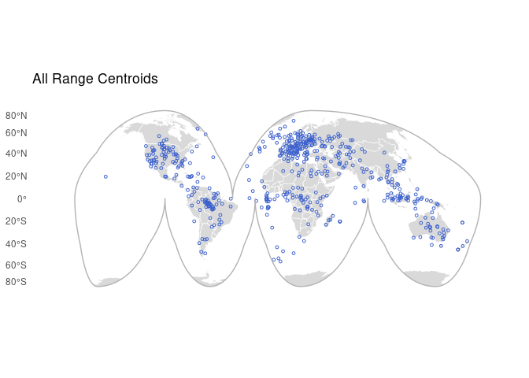

## Heatmap of Distributions

## Individual Species Maps

### Asterias rubens

**Common Name:** common starfish\
**Biosample:** SAMEA994741\
**Assembly Accession:** GCA_902459465.3\
**Taxon:** Invertebrates\
**Priority:** 1\
**Flags:** Missing sampling coords · Missing range raster

### Branchiostoma belcheri

**Common Name:** belcher’s lancelet\
**Biosample:** SAMN13907882\
**Assembly Accession:** GCA_019207075.1\
**Taxon:** Invertebrates\
**Priority:** 1\
**Flags:** Missing sampling coords · Missing range raster

### Branchiostoma floridae

**Common Name:** Florida amphioxus\
**Biosample:** SAMN13896449\
**Assembly Accession:** GCA_015852565.1\
**Taxon:** Invertebrates\
**Priority:** 1\
**Flags:** Missing sampling coords · Missing range raster

### Gadus morhua

**Common Name:** Atlantic cod\
**Biosample:** SAMEA5574046\
**Assembly Accession:** GCA_902167405.1\
**Taxon:** Fishes\
**Priority:** 1\
**Flags:** Missing sampling coords · Missing range raster

### Acanthopagrus latus

**Common Name:** yellowfin sea bream\
**Biosample:** SAMN16236878\
**Assembly Accession:** GCA_904848185.1\
**Taxon:** Fishes\
**Priority:** 2\
**Flags:** Missing sampling coords

### Acipenser ruthenus

**Common Name:** sterlet\
**Biosample:** SAMEA5572864\
**Assembly Accession:** GCA_902713425.2\
**Taxon:** Fishes\
**Priority:** 2\
**Flags:** Missing sampling coords

### Acomys russatus

**Common Name:** golden spiny mouse\
**Biosample:** SAMEA104026431\
**Assembly Accession:** GCA_903995435.1\
**Taxon:** Mammals\
**Priority:** 2\
**Flags:** Missing sampling coords

### Anabas testudineus

**Common Name:** climbing perch\
**Biosample:** SAMEA104026376\
**Assembly Accession:** GCA_900324465.3\
**Taxon:** Fishes\
**Priority:** 2\
**Flags:** Missing sampling coords

### Aquila chrysaetos

**Common Name:** European golden eagle\
**Biosample:** SAMEA994725\
**Assembly Accession:** GCA_900496995.4\
**Taxon:** Birds\
**Priority:** 2\
**Flags:** Missing sampling coords

### Arvicola amphibius

**Common Name:** European water vole\
**Biosample:** SAMEA994740\
**Assembly Accession:** GCA_903992535.2\
**Taxon:** Mammals\
**Priority:** 2\
**Flags:** Missing sampling coords

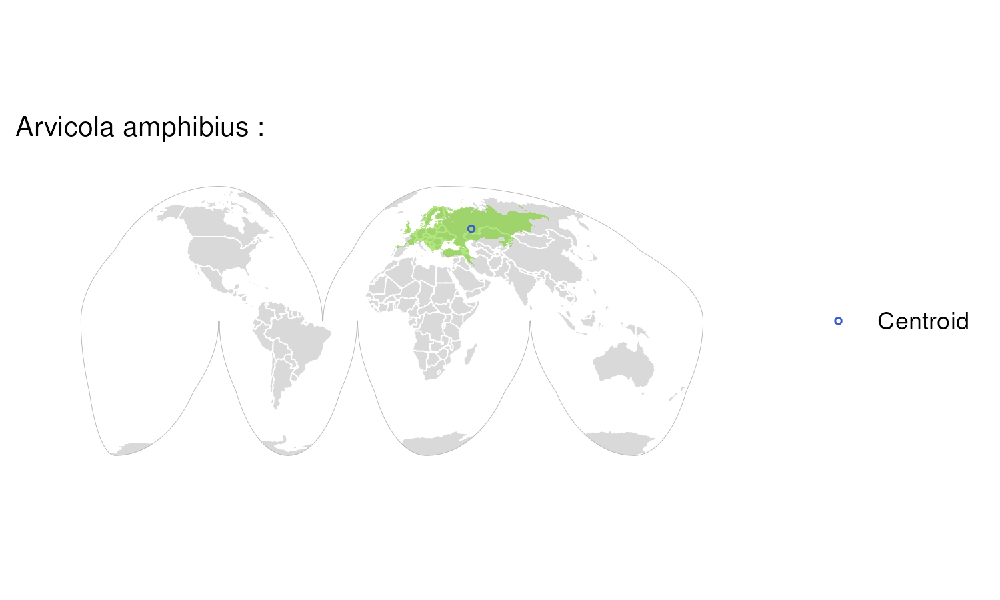

### Astyanax mexicanus

**Common Name:** Mexican tetra\
**Biosample:** SAMN25965548\
**Assembly Accession:** GCA_023375975.1\
**Taxon:** Fishes\
**Priority:** 2\
**Flags:** Missing sampling coords

### Betta splendens

**Common Name:** Siamese fighting fish\
**Biosample:** SAMEA104381735\
**Assembly Accession:** GCA_900634795.4\
**Taxon:** Fishes\
**Priority:** 2\
**Flags:** Missing sampling coords

### Chanos chanos

**Common Name:** milkfish\
**Biosample:** SAMEA5159473\
**Assembly Accession:** GCA_902362185.1\
**Taxon:** Fishes\
**Priority:** 2\
**Flags:** Missing sampling coords

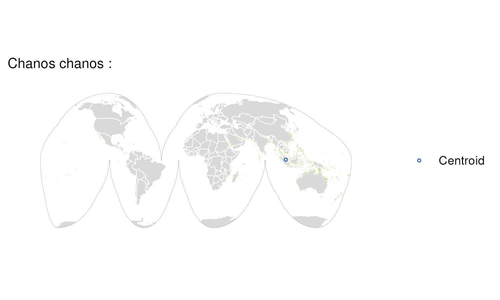

### Cottoperca gobio

**Common Name:** channel bull blenny\
**Biosample:** SAMEA104242975\
**Assembly Accession:** GCA_900634415.1\
**Taxon:** Fishes\
**Priority:** 2\
**Flags:** Missing sampling coords

### Denticeps clupeoides

**Common Name:** denticle herring\
**Biosample:** SAMEA104129917\
**Assembly Accession:** GCA_900700375.2\
**Taxon:** Fishes\
**Priority:** 2\
**Flags:** Missing sampling coords

### Echeneis naucrates

**Common Name:** live sharksucker\
**Biosample:** SAMEA4966390\
**Assembly Accession:** GCA_900963305.2\
**Taxon:** Fishes\
**Priority:** 2\
**Flags:** Missing sampling coords

### Erithacus rubecula

**Common Name:** European robin\
**Biosample:** SAMEA4760689\
**Assembly Accession:** GCA_903797595.2\
**Taxon:** Birds\
**Priority:** 2\
**Flags:** Missing sampling coords

### Erpetoichthys calabaricus

**Common Name:** reedfish\
**Biosample:** SAMEA104026374\
**Assembly Accession:** GCA_900747795.4\
**Taxon:** Fishes\
**Priority:** 2\
**Flags:** Missing sampling coords

### Eublepharis macularius

**Common Name:** leopard gecko\
**Biosample:** SAMN31016422\
**Assembly Accession:** GCA_028583425.1\
**Taxon:** Reptiles\
**Priority:** 2\
**Flags:** Missing sampling coords

### Geotrypetes seraphini

**Common Name:** Gaboon caecilian\
**Biosample:** SAMEA104387963\
**Assembly Accession:** GCA_902459505.2\
**Taxon:** Amphibians\
**Priority:** 2\
**Flags:** Missing sampling coords

### Girardinichthys multiradiatus

**Common Name:** darkedged splitfin\
**Biosample:** SAMN22242658\
**Assembly Accession:** GCA_021462225.2\
**Taxon:** Fishes\
**Priority:** 2\
**Flags:** Missing sampling coords

### Gorilla gorilla

**Common Name:** gorilla\
**Biosample:** SAMN04003007\
**Assembly Accession:** GCA_029281585.3\
**Taxon:** Mammals\
**Priority:** 2\
**Flags:** Missing sampling coords

### Gouania willdenowi

**Common Name:** blunt-snouted clingfish\
**Biosample:** SAMEA104026382\
**Assembly Accession:** GCA_900634775.2\
**Taxon:** Fishes\
**Priority:** 2\
**Flags:** Missing sampling coords

### Lutra lutra

**Common Name:** Eurasian otter\
**Biosample:** SAMEA994731\
**Assembly Accession:** GCA_902655055.2\
**Taxon:** Mammals\
**Priority:** 2\
**Flags:** Missing sampling coords

### Lycocorax pyrrhopterus

**Common Name:** paradise crow\
**Biosample:** SAMN15881065\
**Assembly Accession:** GCA_014706295.1\
**Taxon:** Birds\
**Priority:** 2\
**Flags:** Missing sampling coords

### Mastacembelus armatus

**Common Name:** zig-zag eel\
**Biosample:** SAMEA104026378\
**Assembly Accession:** GCA_900324485.3\
**Taxon:** Fishes\
**Priority:** 2\
**Flags:** Missing sampling coords

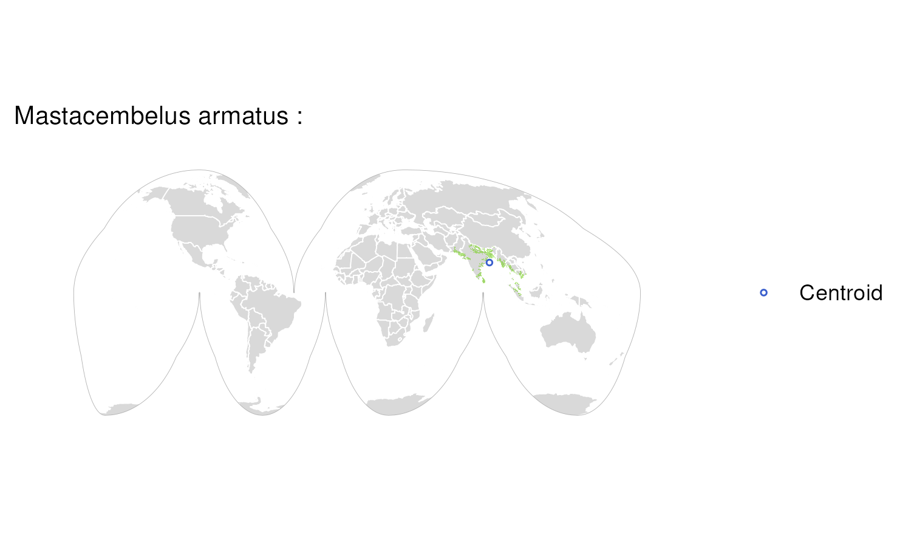

### Microcaecilia unicolor

**Common Name:** tiny cayenne caecilian\
**Biosample:** SAMEA104387962\
**Assembly Accession:** GCA_901765095.2\
**Taxon:** Amphibians\
**Priority:** 2\
**Flags:** Missing sampling coords

### Micropterus salmoides

**Common Name:** large-mouth bass\
**Biosample:** SAMN15783178\
**Assembly Accession:** GCA_019677235.1\
**Taxon:** Fishes\
**Priority:** 2\
**Flags:** Missing sampling coords

### Myripristis murdjan

**Common Name:** pinecone soldierfish\
**Biosample:** SAMEA4872133\
**Assembly Accession:** GCA_902150065.1\
**Taxon:** Fishes\
**Priority:** 2\
**Flags:** Missing sampling coords

### Oenanthe melanoleuca

**Common Name:** eastern black-eared wheatear\
**Biosample:** SAMN33408179\
**Assembly Accession:** GCA_029582105.1\
**Taxon:** Birds\
**Priority:** 2\
**Flags:** Missing sampling coords

### Onychomys torridus

**Common Name:** Southern grasshopper mouse\
**Biosample:** SAMEA104026389\
**Assembly Accession:** GCA_903995425.1\
**Taxon:** Mammals\
**Priority:** 2\
**Flags:** Missing sampling coords

### Ornithorhynchus anatinus

**Common Name:** platypus\
**Biosample:** SAMN08537700\
**Assembly Accession:** GCA_004115215.4\
**Taxon:** Mammals\
**Priority:** 2\
**Flags:** Missing sampling coords

### Pan paniscus

**Common Name:** bonobo\
**Biosample:** SAMN13935689\
**Assembly Accession:** GCA_029289425.3\
**Taxon:** Mammals\
**Priority:** 2\
**Flags:** Missing sampling coords

### Pan troglodytes

**Common Name:** chimpanzee\
**Biosample:** SAMN30216104\
**Assembly Accession:** GCA_028858775.2\
**Taxon:** Mammals\
**Priority:** 2\
**Flags:** Missing sampling coords

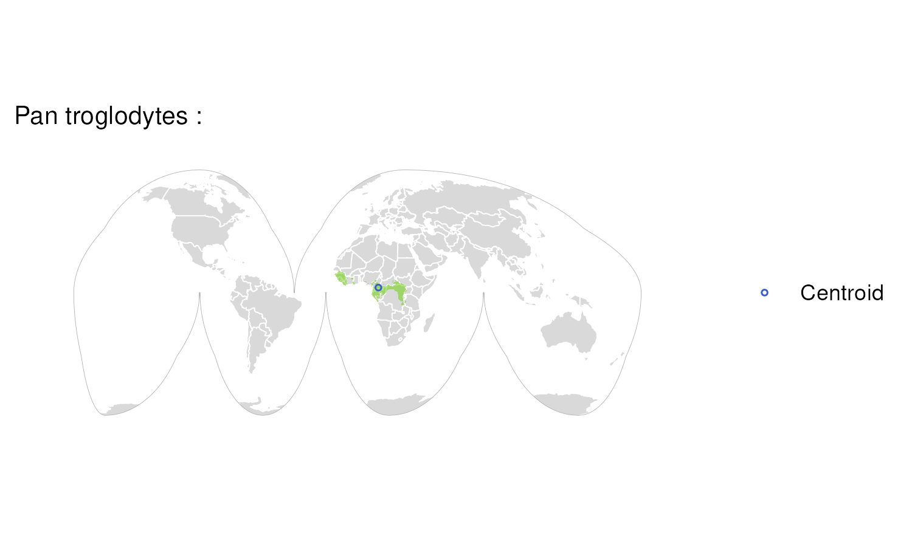

### Parambassis ranga

**Common Name:** Indian glassy fish\
**Biosample:** SAMEA4675621\
**Assembly Accession:** GCA_900634625.2\
**Taxon:** Fishes\
**Priority:** 2\
**Flags:** Missing sampling coords

### Pipistrellus pipistrellus

**Common Name:** common pipistrelle\
**Biosample:** SAMEA994724\
**Assembly Accession:** GCA_903992545.1\
**Taxon:** Mammals\
**Priority:** 2\
**Flags:** Missing sampling coords

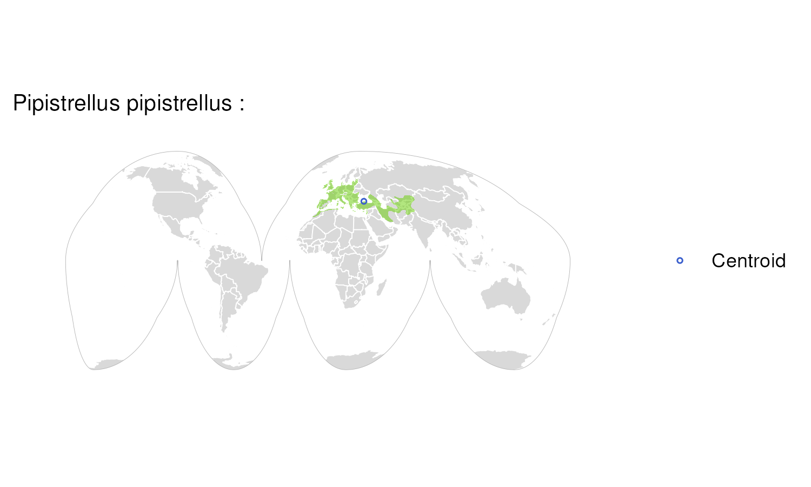

### Pleurodeles waltl

**Common Name:** Iberian ribbed newt\
**Biosample:** SAMN28911188\
**Assembly Accession:** GCA_026652325.1\
**Taxon:** Amphibians\
**Priority:** 2\
**Flags:** Missing sampling coords

### Pongo abelii

**Common Name:** Sumatran orangutan\
**Biosample:** SAMN10521808\
**Assembly Accession:** GCA_028885655.2\
**Taxon:** Mammals\
**Priority:** 2\
**Flags:** Missing sampling coords

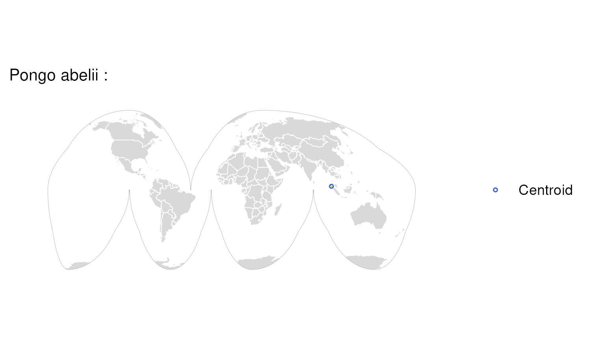

### Pongo pygmaeus

**Common Name:** Bornean orangutan\
**Biosample:** SAMN10521809\
**Assembly Accession:** GCA_028885625.2\
**Taxon:** Mammals\
**Priority:** 2\
**Flags:** Missing sampling coords

### Protopterus annectens

**Common Name:** West African lungfish\
**Biosample:** SAMN26533844\
**Assembly Accession:** GCA_040939525.1\
**Taxon:** Fishes\
**Priority:** 2\
**Flags:** Missing sampling coords

### Rhinatrema bivittatum

**Common Name:** two-lined caecilian\
**Biosample:** SAMEA104387956\
**Assembly Accession:** GCA_901001135.2\
**Taxon:** Amphibians\
**Priority:** 2\
**Flags:** Missing sampling coords

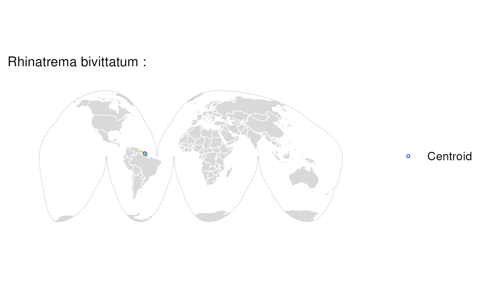

### Salarias fasciatus

**Common Name:** jewelled blenny\
**Biosample:** SAMEA4966329\
**Assembly Accession:** GCA_902148845.1\
**Taxon:** Fishes\
**Priority:** 2\
**Flags:** Missing sampling coords

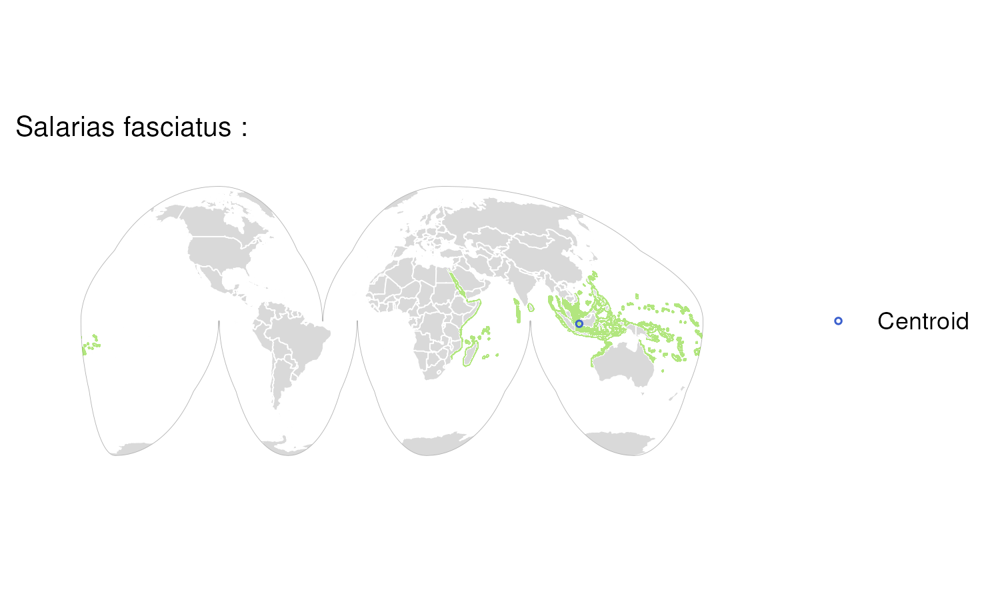

### Salmo trutta

**Common Name:** brown trout\
**Biosample:** SAMEA994732\
**Assembly Accession:** GCA_901001165.2\
**Taxon:** Fishes\
**Priority:** 2\
**Flags:** Missing sampling coords

### Sciurus carolinensis

**Common Name:** grey squirrel\
**Biosample:** SAMEA994726\
**Assembly Accession:** GCA_902686445.2\
**Taxon:** Mammals\
**Priority:** 2\
**Flags:** Missing sampling coords

### Sciurus vulgaris

**Common Name:** Eurasian red squirrel\
**Biosample:** SAMEA994733\
**Assembly Accession:** GCA_902686455.2\
**Taxon:** Mammals\
**Priority:** 2\
**Flags:** Missing sampling coords

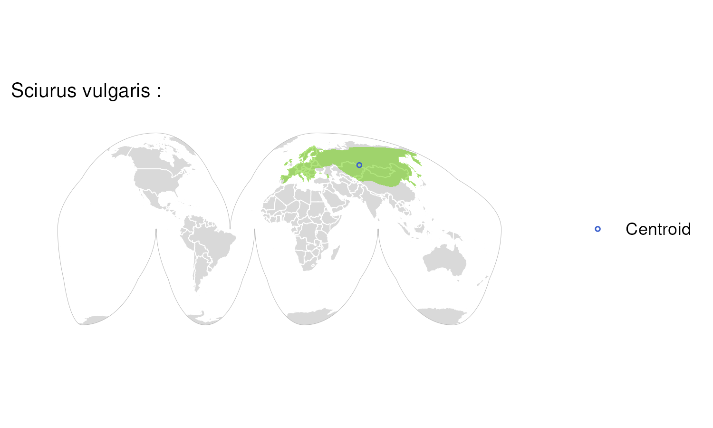

### Scleropages formosus

**Common Name:** golden arowana\
**Biosample:** SAMEA4872123\
**Assembly Accession:** GCA_900964775.1\
**Taxon:** Fishes\
**Priority:** 2\
**Flags:** Missing sampling coords

### Scyliorhinus canicula

**Common Name:** small-spotted catshark\
**Biosample:** SAMEA994730\
**Assembly Accession:** GCA_902713615.2\
**Taxon:** Fishes\
**Priority:** 2\
**Flags:** Missing sampling coords

### Sparus aurata

**Common Name:** gilthead seabream\
**Biosample:** SAMEA104384835\
**Assembly Accession:** GCA_900880675.2\
**Taxon:** Fishes\
**Priority:** 2\
**Flags:** Missing sampling coords

### Sphaeramia orbicularis

**Common Name:** orbiculate cardinalfish\
**Biosample:** SAMEA4966328\
**Assembly Accession:** GCA_902148855.1\
**Taxon:** Fishes\
**Priority:** 2\
**Flags:** Missing sampling coords

### Streptopelia turtur

**Common Name:** European turtle dove\
**Biosample:** SAMEA994735\
**Assembly Accession:** GCA_901699155.2\
**Taxon:** Birds\
**Priority:** 2\
**Flags:** Missing sampling coords

### Symphalangus syndactylus

**Common Name:** siamang gibbon\
**Biosample:** SAMN30216103\
**Assembly Accession:** GCA_028878055.3\
**Taxon:** Mammals\
**Priority:** 2\
**Flags:** Missing sampling coords

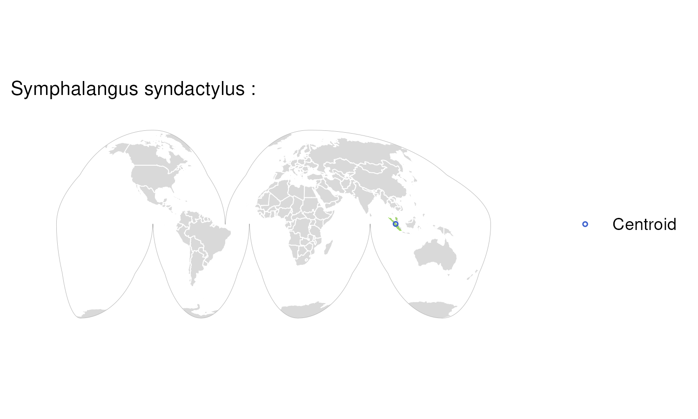

### Syngnathus acus

**Common Name:** greater pipefish\
**Biosample:** SAMEA104381750\
**Assembly Accession:** GCA_901709675.2\
**Taxon:** Fishes\
**Priority:** 2\
**Flags:** Missing sampling coords

### Takifugu rubripes

**Common Name:** Japanese puffer (torafugu)\
**Biosample:** SAMEA104384834\
**Assembly Accession:** GCA_901000725.3\
**Taxon:** Fishes\
**Priority:** 2\
**Flags:** Missing sampling coords

### Thalassophryne amazonica

**Common Name:** prehistoric monster fish\
**Biosample:** SAMEA104129913\
**Assembly Accession:** GCA_902500255.1\
**Taxon:** Fishes\
**Priority:** 2\
**Flags:** Missing sampling coords

### Tupaia tana

**Common Name:** large treeshrew\
**Biosample:** SAMN07678117\
**Assembly Accession:** GCA_026018925.1\
**Taxon:** Mammals\
**Priority:** 2\
**Flags:** Missing sampling coords

### Electrophorus electricus

**Common Name:** electric eel\
**Biosample:** SAMN42883346\
**Assembly Accession:** GCA_041902795.1\
**Taxon:** Fishes\
**Priority:** 3\
**Flags:** Outside range · Vague location

**Biosample provider:** —\
**Collected by:** —\
**Biosample comments:** —\
**Location:** China

### Epinephelus lanceolatus

**Common Name:** giant grouper\
**Biosample:** SAMN41784231\
**Assembly Accession:** GCA_041903045.1\
**Taxon:** Fishes\
**Priority:** 3\
**Flags:** Outside range · Vague location

**Biosample provider:** —\
**Collected by:** —\
**Biosample comments:** —\
**Location:** China

### Lateolabrax maculatus

**Common Name:** Chinese sea bass\
**Biosample:** SAMN36708487\
**Assembly Accession:** GCA_031216445.1\
**Taxon:** Fishes\
**Priority:** 3\
**Flags:** Outside range · Vague location

**Biosample provider:** —\
**Collected by:** —\
**Biosample comments:** —\
**Location:** China

### Phascolarctos cinereus

**Common Name:** koala\
**Biosample:** SAMN06198159\
**Assembly Accession:** GCA_003287225.2\
**Taxon:** Mammals\
**Priority:** 3\
**Flags:** Outside range · Vague location

**Biosample provider:** Australia Zoo Wildlife Hospital\
**Collected by:** Australia Zoo Wildlife Hospital\
**Biosample comments:** Female Koala sample (Bilbo) for PacBio genome assembly.\
**Location:** Australia

### Acridotheres tristis

**Common Name:** common myna\
**Biosample:** SAMN28454388\
**Assembly Accession:** GCA_027559615.1\
**Taxon:** Birds\
**Priority:** 4\
**Flags:** Outside range

**Biosample provider:** Tel Aviv University & Steinhardt, Museum of Natural History\
**Collected by:** Tali Magory Cohen\
**Biosample comments:** The common myna or Indian myna (Acridotheres tristis), sometimes spelled mynah, is a bird in the family Sturnidae, native to Asia. It is an omnivorous open woodland bird with a strong territorial instinct, and has adapted extremely well to urban environments. (from Wikipedia entry). This sample was procured by Tali Magory Cohen near Tel Aviv University, Israel, and used to generate a high-quality reference genome for the Vertebrate Genomes Project (VGP). The project was coordinated by M. Thomas P. Gilbert of the University of Copenhagen. Sequencing and genome assembly were conducted at the Vertebrate Genomes Lab (VGL) at the Rockefeller University, led by Olivier Fedrigo and Erich D. Jarvis.\
**Location:** Israel: Tel Aviv

### Ambystoma mexicanum x Ambystoma tigrinum

**Common Name:** axolotl\
**Biosample:** SAMN43142723\
**Assembly Accession:** GCA_040938575.1\
**Taxon:** Amphibians\
**Priority:** 4\
**Flags:** Outside range

**Biosample provider:** —\
**Collected by:** —\
**Biosample comments:** —\
**Location:** USA: Kentucky, University of Kentucky

### Anser brachyrhynchus

**Common Name:** pink-footed goose\
**Biosample:** SAMEA112468040\
**Assembly Accession:** GCA_964034855.1\
**Taxon:** Birds\
**Priority:** 4\
**Flags:** Outside range

**Biosample provider:** —\
**Collected by:** MICHELLE O’BRIEN\
**Biosample comments:** —\
**Location:** England\|Gloucester\|Newgounds

### Antennarius maculatus

**Common Name:** warty frogfish\
**Biosample:** SAMN12623626\
**Assembly Accession:** GCA_013358685.1\
**Taxon:** Fishes\
**Priority:** 4\
**Flags:** Outside range

**Biosample provider:** University of Konstanz (Dejong Marinelife, Rotterdam)\
**Collected by:** Andreas Kaut, Joost Woltering\
**Biosample comments:** The Warty frogfish (Antennarius maculatus) is found in rocky and coral reefs in tropical waters of the Indo-Pacific. Their skin is covered with many wart-like protuberances, giving is characteristic name. They can change color to match their environment, within several weeks. This sample was collected by Martin Reichard, procured by Axel Meyer, sequencing supported by Gene Myers, in collaboration with Richard Durbin, to generate a high-quality reference genome as part of the G10K-VGP and Fish VGP projects.\
**Location:** Netherlands: Dejong Marinelife, Rotterdam

### Ara ararauna

**Common Name:** blue-and-gold macaw\
**Biosample:** SAMN33059336\
**Assembly Accession:** GCA_028858755.1\
**Taxon:** Birds\
**Priority:** 4\
**Flags:** Outside range

**Biosample provider:** Texas A&M’s Schubot Exotic Bird Health Center\
**Collected by:** Sharman Hoppes, DVM\
**Biosample comments:** The blue-and-gold macaw (Ara ararauna), also known as the blue-and-yellow macaw, is a large South American parrot with mostly blue top parts and light orange underparts, with gradient hues of green on top of its head. It is a member of the large group of neotropical parrots known as macaws. This sample is from a male at the Texas A&M’s Schubot Exotic Bird Health Center, born in Hill Country Aviaries in Dripping Springs, Texas, collected by Sharman Hoppes, coordinated by Janice Boyd (deceased) and Taylor Hains at the University of Chicago, and used to generate a high-quality reference genome for the Vertebrate Genomes Project (VGP). Sequencing and genome assembly were conducted at the Vertebrate Genomes Lab (VGL) at the Rockefeller University, led by Olivier Fedrigo and Erich D. Jarvis.\
**Location:** USA: Dripping Springs, Texas

### Archocentrus centrarchus

**Common Name:** flier cichlid\
**Biosample:** SAMN09948522\
**Assembly Accession:** GCA_007364275.2\
**Taxon:** Fishes\
**Priority:** 4\
**Flags:** Outside range

**Biosample provider:** Sylke Winkler and Gene Myers, Max Planck Institute, Dresden, Germany\
**Collected by:** Axel Meyer, Andreas Kautt, Paolo Franchini\
**Biosample comments:** The data from this BioSample are currently under a G10K-VGP publication embargo until removed from this description, following the G10K data use policy at the following URL: <https://genome10k.soe.ucsc.edu/about/data_use_policy>. The flier cichlid is a fish that is used in studies of trait evolution. It is native to Central America. This sample is being used for the G10K-VGP Project. The sample was collected by Axel Myers group in Nicaragua and sequenced by Gene Myers’ group at the Max Plank Institute of Molecular Cell Biology and Genetics (MPI-CBG) and by Olivier Fedrigo’s group at the Rockefeller University Vertebrate Genome lab.\
**Location:** Nicaragua

### Arvicanthis niloticus

**Common Name:** Nile rat\
**Biosample:** SAMN12611849\
**Assembly Accession:** GCA_011762505.3\
**Taxon:** Mammals\
**Priority:** 4\
**Flags:** Outside range

**Biosample provider:** University of California Santa Barbara; Morgridge Institute for Research\
**Collected by:** Huishi Toh\
**Biosample comments:** Arvicanthis Niloticus, commonly known as the Nile rat or African grass rat, is a valuable model organism used in various areas of research including behavioral neuroscience, nutrition science, ophthalmology and evolutionary biology. Native to Northern Africa, this diurnal rodent has a diet primarily of leaves and stems, supplemented with insects, seeds, and fruits. However, when maintained in a laboratory environment with a rodent chow diet that has high caloric content relative to its native diet, both sexes rapidly develop diet-induced diabetes. By mimicking the disease etiology, the Nile rat provides an important animal model to study the causality of type 2 diabetes and is a suitable pre-clinical model. These samples were collected from a male and his parents in a laboratory colony of Huishi Toh and James Thomson at University of California, Santa Barbara, and used to generate chromosomal level reference assembly as part of the G10K-VGP project.\
**Location:** USA: Santa Barbara

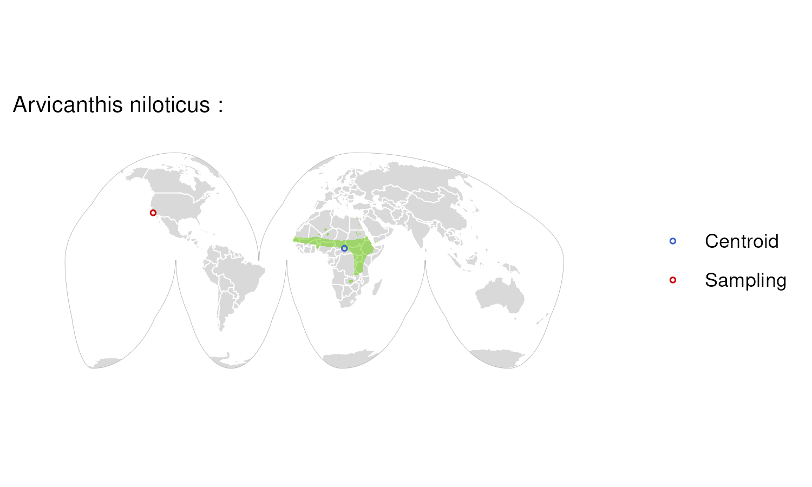

### Astatotilapia calliptera

**Common Name:** Eastern happy\
**Biosample:** SAMEA112818850\
**Assembly Accession:** GCA_964374335.1\
**Taxon:** Fishes\
**Priority:** 4\
**Flags:** Outside range

**Biosample provider:** —\
**Collected by:** BETTINA FISCHER\
**Biosample comments:** —\
**Location:** CAMBRIDGE UNIVERSITY \| AQUARIA FACILITY

### Aulonocara stuartgranti

**Common Name:** flavescent peacock cichlid\
**Biosample:** SAMEA112818851\
**Assembly Accession:** GCA_965226115.1\
**Taxon:** Fishes\
**Priority:** 4\
**Flags:** Outside range

**Biosample provider:** —\
**Collected by:** BETTINA FISCHER\
**Biosample comments:** —\
**Location:** CAMBRIDGE UNIVERSITY \| AQUARIA FACILITY

### Callithrix jacchus

**Common Name:** common marmoset\
**Biosample:** SAMN47004743\
**Assembly Accession:** GCA_049354715.1\
**Taxon:** Mammals\
**Priority:** 4\
**Flags:** Outside range

**Biosample provider:** —\
**Collected by:** —\
**Biosample comments:** —\
**Location:** USA: Pittsburgh

### Calypte anna

**Common Name:** Anna’s hummingbird\
**Biosample:** SAMN02265252\
**Assembly Accession:** GCA_003957555.2\
**Taxon:** Birds\
**Priority:** 4\
**Flags:** Outside range

**Biosample provider:** —\
**Collected by:** —\
**Biosample comments:** —\
**Location:** USA

### Camelus dromedarius

**Common Name:** Dromedary camel\
**Biosample:** SAMN39296380\
**Assembly Accession:** GCA_036321535.1\
**Taxon:** Mammals\
**Priority:** 4\
**Flags:** Outside range

**Biosample provider:** —\
**Collected by:** Rasheed Hashim, Farooq Omar Al-Ajli\
**Biosample comments:** The Arabian camel (Camelus dromedarius ) is a one-humped camel species found in the Middle East and North Africa. It is remarkable for its adaptations to arid environments and has been integral to human societies in these regions. This sample (mCamDro1) is from a male bred at Mr. Shabat bin Saqar Al-Muraikhi camel breeding farm, in Qatar. Samples were also obtained from parents (father mCamDro2 and mother mCamDro3). These samples were collected and coordinated by Farooq Omar Al-Ajli (Katara Biodiversity Genomes Program), to create trio-based high-quality assemblies of the maternal and paternal haplotypes for the Vertebrate Genomes Project (VGP) and Qatar Biodiversity Genomes Project (QBGP). Sequencing was done at the Vertebrate Genomes Lab (VGL) at Rockefeller University, led by Olivier Fedrigo and Erich D. Jarvis. Genome assembly was conducted at Sidra Medicine by Farooq Omar Al-Ajli and Khalid A. Fakhro in collaboration with VGL.\
**Location:** Qatar: Mr. Shabat bin Saqar Al-Muraikhi camel breeding farm

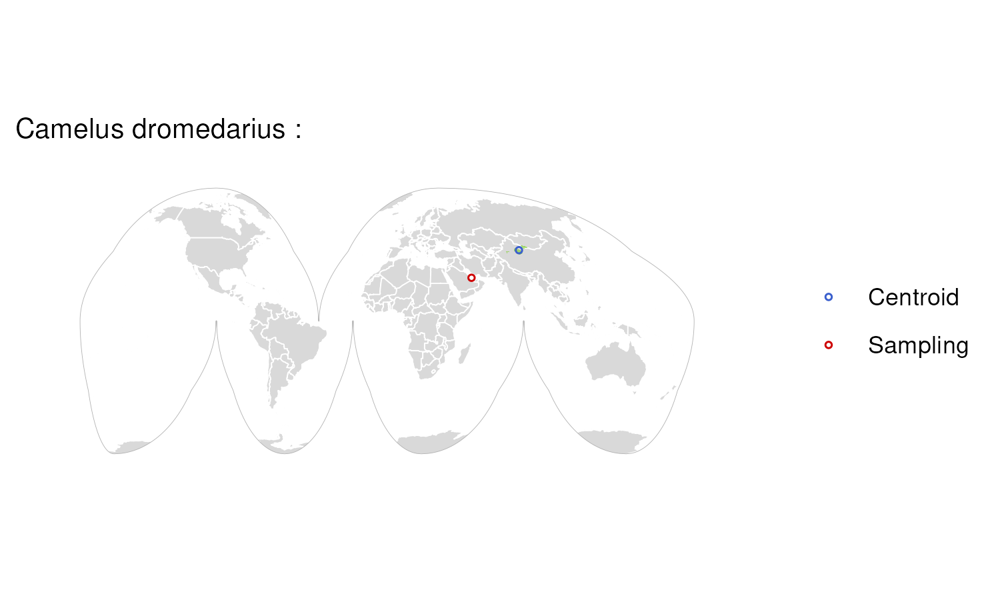

### Candoia aspera

**Common Name:** viper boa\
**Biosample:** SAMN37159891\
**Assembly Accession:** GCA_035149785.1\
**Taxon:** Reptiles\
**Priority:** 4\
**Flags:** Outside range

**Biosample provider:** Anne Bronikowski: Iowa State University\
**Collected by:** —\
**Biosample comments:** Candoia aspera (viper boa, also called Papuan ground boa) is a species of snake in the family Boidae found in New Guinea (in the Papua province of Indonesia and in Papua New Guinea). It is a terrestrial species, living in the undergrowth and smaller than some other members of the Boidae family (modified from Wikipedia source). This sample is from a female bred in captivity at the Ophidian Research Colony, at the University of Texas at Tyler, coordinated and processed by Anne Bronikowski of Iowa State University, and used to generate a high-quality reference genome for the Vertebrate Genomes Project (VGP). Sequencing and genome assembly were conducted at the Vertebrate Genomes Lab (VGL) at the Rockefeller University, led by Olivier Fedrigo and Erich D. Jarvis.\
**Location:** USA: Ophidian Research Colony, at University of Texas at Tyler

### Carettochelys insculpta

**Common Name:** pig-nosed turtle\
**Biosample:** SAMN38222597\
**Assembly Accession:** GCA_033958435.1\
**Taxon:** Reptiles\
**Priority:** 4\
**Flags:** Outside range

**Biosample provider:** —\
**Collected by:** —\
**Biosample comments:** —\
**Location:** China: Xiong County, Hebei Province

### Choloepus didactylus

**Common Name:** Linnaeus’s two-toed sloth\
**Biosample:** SAMN12612024\
**Assembly Accession:** GCA_015220235.1\
**Taxon:** Mammals\
**Priority:** 4\
**Flags:** Outside range

**Biosample provider:** Leibniz Institute for Zoo and Wildlife, Berlin, Germany\
**Collected by:** Gudrun Wibbelt\
**Biosample comments:** Choloepus didactylus, commonly known as Linnaeus’s two-toed sloth, is a native species from South America. Extant sloths are represented by only two genera, Choloepus and Bradypus, and present the slowest metabolism among all mammals. This sample was collected from a Tierpark Berlin male specimen known as Lama Su by researchers from the Leibniz Institute for Zoo and Wildlife Research, and is being used to generate the first chromosome level genome of a sloth for the G10K-VGP Project. This genome is also the first Pilosa and Xenarthra representative of Phase 1 of the VGP Ordinal Project.\
**Location:** Germany: Tierpark, Berlin

### Clarias gariepinus

**Common Name:** North African catfish\
**Biosample:** SAMN27021044\
**Assembly Accession:** GCA_024256435.1\
**Taxon:** Fishes\
**Priority:** 4\
**Flags:** Outside range

**Biosample provider:** —\
**Collected by:** —\
**Biosample comments:** Genome assemblies of Clarias gariepinus, including diploid-collapsed (i.e., primary) and haplotype-resolved (i.e., phased) assemblies.\
**Location:** Germany: Rostock

### Columba livia

**Common Name:** rock dove\
**Biosample:** SAMN38891892\
**Assembly Accession:** GCA_036013475.2\
**Taxon:** Birds\
**Priority:** 4\
**Flags:** Outside range

**Biosample provider:** Feanix Biotechnologies Inc: Thomas Bishop; University of Pennsylvania: Wojciech Panek\
**Collected by:** —\
**Biosample comments:** The rock pigeon is a member of the bird family Columbidae (doves and pigeons). It’s a fairly large pigeon with pale gray overall with two bold black wingbars and iridescent purple and green on neck. This species has wild and feral populations throughout the world. True wild birds nest on cliffs and in caves from western Europe to central Asia. Feral varieties are common in cities and farmland, often in large flocks. This sample is from a breed of domestic pigeon (Columba livia domestica) which includes about 1,000 different breeds and descends from the wild rock dove species. It was sampled in Davis, California by Thomas Bishop and Wojciech Panek, and coordinated by Matthew Biegler and Erich D. Jarvis to generate a high-quality reference genome for the Vertebrate Genomes Project (VGP). Sequencing and genome assembly were conducted at the Vertebrate Genomes Lab (VGL) at the Rockefeller University, led by Erich D. Jarvis, Jennifer Balacco, Giulio Formenti. Assembly and curation was performed by Simona Secomandi.\
**Location:** USA: Davis, CA

### Coregonus lavaretus

**Common Name:** common whitefish\
**Biosample:** SAMEA111528661\
**Assembly Accession:** GCA_964263955.1\
**Taxon:** Fishes\
**Priority:** 4\
**Flags:** Outside range

**Biosample provider:** —\
**Collected by:** JP Koene\|CE Adams\
**Biosample comments:** —\
**Location:** Scotland \| Loch Lomond \| RossPoint

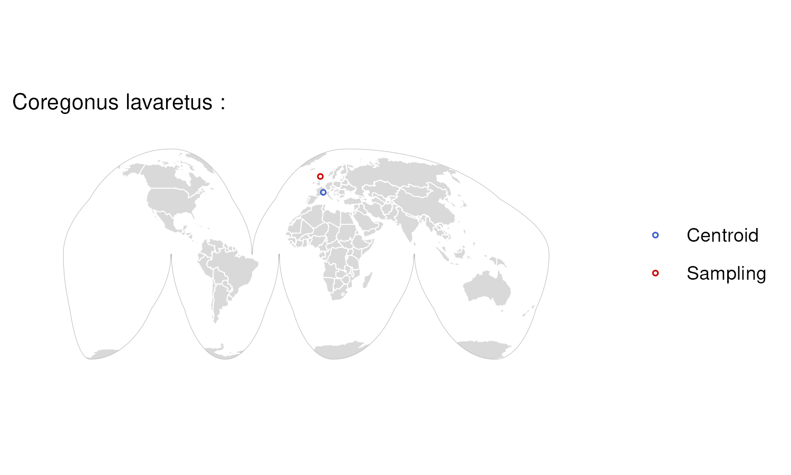

### Corvus hawaiiensis

**Common Name:** Hawaiian crow\
**Biosample:** SAMN22550278\
**Assembly Accession:** GCA_020740725.1\
**Taxon:** Birds\
**Priority:** 4\
**Flags:** Outside range

**Biosample provider:** University of Hawaii\
**Collected by:** Bryce Masuda\
**Biosample comments:** The Hawaiian crow (Corvus hawaiiensis) is a crow species endemic to Hawaii and only lives in Hawaii. It has a strong flying ability and is know to be resourceful. It is currently extinct in the wild, with about 100 animals from breeding in captivity. This blood sample was collected by Bryce Masuda, from a female, at the University of Hawaii, Manoa in 2020. It was used to generate a high-quality reference for the Vertebrate Genomes Project (VGP) and conservation research. Sequencing and genome assembly were conducted at the Vertebrate Genomes Lab (VGL) at the Rockefeller University, led by Olivier Fedrigo and Erich D. Jarvis, and the project coordinated and supported by Stefanie Grosser and Bruce Robertson at the University of Otago, New Zealand, as well as by Jolene Sutton, Erin Datlof, Oliver Ryder, and Catherine Grueber.\
**Location:** USA: University of Hawaii at Manoa

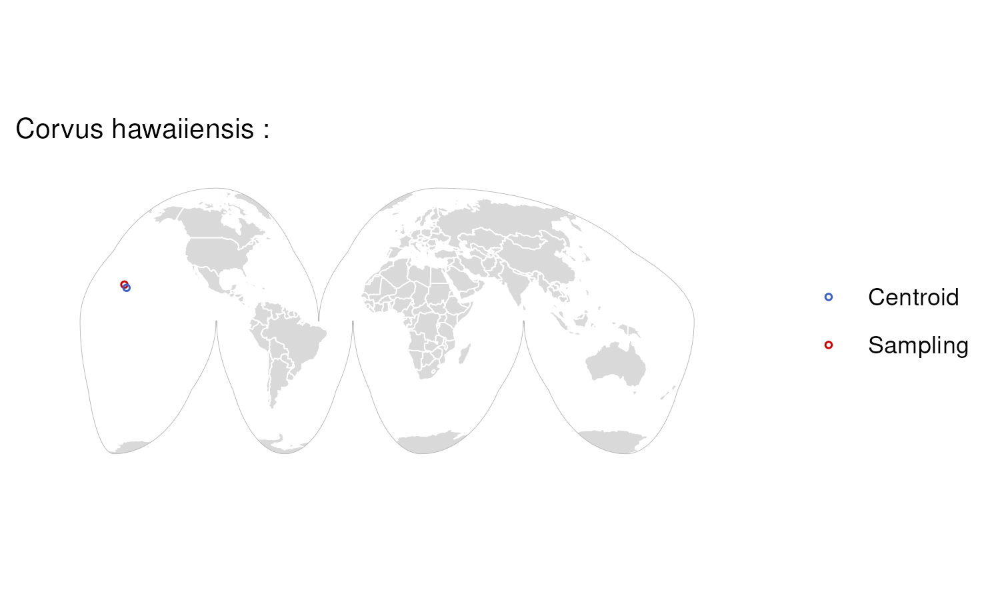

### Coturnix chinensis

**Common Name:** king quail\
**Biosample:** SAMN41253798\
**Assembly Accession:** GCA_039878825.1\
**Taxon:** Birds\
**Priority:** 4\
**Flags:** Outside range

**Biosample provider:** Stanford University: David Ramirez\
**Collected by:** David Ramirez\
**Biosample comments:** The blue-breasted quail (Coturnix chinensis), also known as the Asian blue quail, Chinese painted quail, or Chung-Chi, is a species of Old World quail in the family Phasianidae. This species is the smallest “true quail”, ranging in the wild from southern China, South and Southeast Asia to Oceania, south to southeastern Australia, with 9 different subspecies (modified from Wikipedia entry). A recent revised taxonomic species name is Excalfactoria chinensis. This sample of a male individual was sourced and collected from a laboratory colony at Stanford University by Jessica Nowicki, Dave Ramirez, and Lauren O’Connell to generate a high-quality reference genome for a neuroscience project and the Vertebrate Genomes Project (VGP). Sequencing and genome assembly were conducted at the Vertebrate Genome Lab (VGL) at the Rockefeller University, led by Erich D. Jarvis, Giulio Formenti, and Jennifer Balacco.\
**Location:** USA: Palo Alto, California

### Dasyurus maculatus

**Common Name:** tiger quoll\
**Biosample:** SAMN47326980\
**Assembly Accession:** GCA_048593285.1\
**Taxon:** Mammals\
**Priority:** 4\
**Flags:** Outside range

**Biosample provider:** San Diego Zoo\
**Collected by:** —\
**Biosample comments:** —\
**Location:** missing

### Dendropsophus ebraccatus

**Common Name:** hourglass treefrog\
**Biosample:** SAMN32145295\
**Assembly Accession:** GCA_027789765.1\
**Taxon:** Amphibians\
**Priority:** 4\
**Flags:** Outside range

**Biosample provider:** Justin Touchon, Vassar College\
**Collected by:** Justin Touchon, Erich Jarvis\
**Biosample comments:** The hourglass treefrog (Dendropsophus ebraccatus) name refers to its hourglass shape. The hourglass treefrog is found throughout Central America. It has plasticity in reproduction, laying eggs in water under some conditions and laying eggs on land under others. This female is from a trio of samples, with the parents (mother aDenEbr4 and father aDenEbr5) collected in Gamboa, Panama, and the child (aDenEbr1) breed in captivity at Vassar College in Poughkeepsie, New York, done and coordinated by Justin Touchon, to create a high-quality reference genome for both maternal and paternal haplotypes of aDenEbr1. Genome sequencing and assembly was coordinated by Erich D. Jarvis and Olivier Fedrigo at the Rockefeller University Vertebrate Genome Lab, and as part of the Vertebrate Genomes Project (VGP).\
**Location:** USA: Vassar College, Poughkeepsie, New York

### Dibamus smithi

**Common Name:** Smith’s blind skink\
**Biosample:** SAMN44704469\
**Assembly Accession:** GCA_046126795.1\
**Taxon:** Reptiles\
**Priority:** 4\
**Flags:** Outside range

**Biosample provider:** Institute of Tropical Biology Collection of Zoology: Nguyen Ngoc Sang\
**Collected by:** Nguyen Ngoc Sang, Le Van Manh\
**Biosample comments:** Smith’s blind skink (Dibamus smithi) is a species of legless lizard in the family Dibamidae endemic to Vietnam (from Wikipedia entry). This sample of a male individual found in Binh Thuan, Vietnam, was procured by Nguyen Ngoc Sang of the Institute of Tropical Biology at the Vietnam Academy of Science and Technology, and coordinated by Robert Murphy of the University of Toronto, to generate a high-quality reference genome for the Vertebrate Genomes Project (VGP). Sequencing and genome assembly were conducted at the Vertebrate Genome Lab (VGL) at the Rockefeller University, led by Erich D. Jarvis, Giulio Formenti, and Jennifer Balacco.\
**Location:** Viet Nam: Binh Thuan

### Diceros bicornis minor

**Common Name:** Southern black rhinoceros\
**Biosample:** SAMN22047685\
**Assembly Accession:** GCA_020826845.1\
**Taxon:** Mammals\
**Priority:** 4\
**Flags:** Outside range

**Biosample provider:** Smithsonian Conservation Biology Institute\
**Collected by:** Budhan Pukazhenthi\
**Biosample comments:** The Southern black rhinoceros is a subspecies of the black rhinoceros, native to southern parts of Africa. As of 2021 it is considered critically endangered. This trio of samples was collected to create a high-quality reference genome for two haplotypes. The female (mDicBic1) called Mupani who the reference genome was generated, was born in the Fossil Rim Wildlife Center in Texas. Her mother Coco (mDicBic2) and father (mDicBic3), originally from Zimbabwe. Sample collection was conducted by Budhan Pukazhenthi, in coordination with Klaus-Peter Koepfli. Blood from these samples were used to create high-quality reference genome assemblies of each haplotype, coordinated by Erich Jarvis and Olivier Fedrigo, at the Rockefeller University Vertebrate Genome Lab, as part of the Vertebrate Genomes Project (VGP). The data from these BioSamples are currently under a G10K-VGP publication embargo until removed from this description, following the G10K data use policy at the following URL: <https://genome10k.soe.ucsc.edu/about/data_use_policy>.\
**Location:** USA

### Engystomops pustulosus

**Common Name:** tungara frog\
**Biosample:** SAMN42463661\
**Assembly Accession:** GCA_040894005.1\
**Taxon:** Amphibians\
**Priority:** 4\
**Flags:** Outside range

**Biosample provider:** University of the Pacific: Marcos Gridi-Papp\
**Collected by:** Marcos Gridi-Papp\
**Biosample comments:** The Tungara frog (Engystomops pustulosus) is a species in the Leptodactylidae family. It is a small nocturnal terrestrial frog found in Mexico, Central America, and the northeastern regions of South America. The tungara frog exhibits interesting behavior in male/female interactions. Male vocalizations are critical in female mate choice, and females often prefer males who give complex mating calls at a lower frequency rather than simple calls at a higher frequency (from Wikipedia entry). This sample of a female individual (aEngPut4/MGP-1488.2) is part of a trio assembly (mother aEngPut2/MGP-1444.1, father aEngPut3/MGP-1452.1), with Hi-C sequence data from the sister offspring aEngPut1/MGP-1488.1 used for scaffolding. The individuals were bred in captivity and procured by Marcos Gridi-Papp to generate a high-quality reference genome for the Vertebrate Genomes Project (VGP). Sequencing and genome assembly were conducted at the Vertebrate Genome Lab (VGL) at the Rockefeller University, led by Erich D. Jarvis, Giulio Formenti, and Jennifer Balacco.\
**Location:** USA: Stockton, California

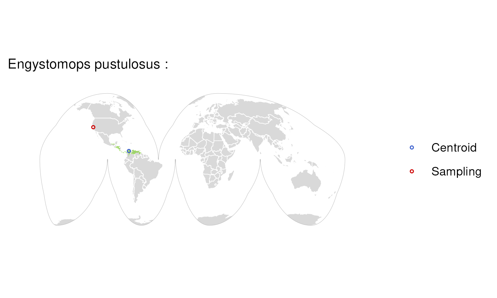

### Eptesicus fuscus

**Common Name:** big brown bat\
**Biosample:** SAMN30608903\
**Assembly Accession:** GCA_027574615.1\
**Taxon:** Mammals\
**Priority:** 4\
**Flags:** Outside range

**Biosample provider:** —\
**Collected by:** David Ray\
**Biosample comments:** —\
**Location:** USA: Silver Falls Park - Crosbyton, TX

### Equus caballus

**Common Name:** Arabian horse\
**Biosample:** SAMN39296386\
**Assembly Accession:** GCA_036426135.1\
**Taxon:** Mammals\
**Priority:** 4\
**Flags:** Outside range

**Biosample provider:** Qatar Biodiversity Genomes Project: Farooq Omar Al-Ajli\
**Collected by:** Tatiana Vinardell, Farooq Omar Al-Ajli\
**Biosample comments:** The domesticated horse (Equus caballus) is a one-toed, hoofed mammal, and one of the most iconic species distinguished by its unique history, diverse breeds, and significant role in human society. This sample (mEquCab1) is from a male Arabian horse bred at Al Shaqab Equestrian Center, in Qatar. Samples were also obtained from the parents (mother mEquCab3 and father mEquCab2). These samples were collected by Tatiana Vinardell, and coordinated and provided by Farooq Omar Al-Ajli (Katara Biodiversity Genomes Program), to create trio-based high-quality assemblies of the maternal and paternal haplotypes for the Vertebrate Genomes Project (VGP) and Qatar Biodiversity Genomes Project (QBGP). Sequencing was done at the Vertebrate Genomes Lab (VGL) at Rockefeller University, led by Olivier Fedrigo and Erich D. Jarvis. Genome assembly was conducted at Sidra Medicine by Farooq Omar Al-Ajli and Khalid A. Fakhro in collaboration with VGL.\
**Location:** Qatar: Al Shaqab Equestrian Center

### Falco biarmicus

**Common Name:** Lanner falcon\
**Biosample:** SAMN28688289\
**Assembly Accession:** GCA_023638135.1\
**Taxon:** Birds\
**Priority:** 4\
**Flags:** Outside range

**Biosample provider:** Farooq Omar Al-Ajli, Qatar Falcon Genome Project\
**Collected by:** Farooq Omar Al-Ajli, Souq Waqif Falcon Hospital\
**Biosample comments:** The lanner falcon (Falco biarmicus) is a medium-sized species of falcons. Its breeding range includes Africa, Asia and Europe, and it is a member of the hierofalcon complex. This sample was procured by Farooq Omar Al-Ajli and used to generate a high-quality reference genome in a collaboration between Qatar Falcon Genome Project (QFGP) and the Vertebrate Genomes Project (VGP). The project was coordinated by Farooq Al-Ajli as a part of large conservation study (Qatar Falcon Genome Project), and funded by KATARA Cultural Village and Al-Gannas Qatari Society, Qatar. Sequencing and genome assembly were conducted at the Vertebrate Genomes Lab (VGL) by Farooq Omar Al-Ajli at the Rockefeller University, led by Olivier Fedrigo and Erich D. Jarvis. The raw data and assembly are currently under a G10K-VGP publication embargo until removed from this description, following the G10K data use policy at the following URL: <https://genome10k.soe.ucsc.edu/data-use-policies/>\
**Location:** Qatar:Doha

### Falco rusticolus

**Common Name:** gyrfalcon\
**Biosample:** SAMN12629496\
**Assembly Accession:** GCA_015220075.1\
**Taxon:** Birds\
**Priority:** 4\
**Flags:** Outside range

**Biosample provider:** Farooq Al-Ajli, Qatar Falcon Genome Project, Al-Gannas Qatari Society\
**Collected by:** Farooq Al-Ajli, Souq Waqif Falcon Hospital\
**Biosample comments:** —\
**Location:** Qatar

### Furcifer pardalis

**Common Name:** panther chameleon\
**Biosample:** SAMN35298317\
**Assembly Accession:** GCA_030440675.1\
**Taxon:** Reptiles\
**Priority:** 4\
**Flags:** Outside range

**Biosample provider:** Hongxin Xie\
**Collected by:** —\
**Biosample comments:** —\
**Location:** China: Beijing

### Gavia stellata

**Common Name:** red-throated Loon\
**Biosample:** SAMN37096312\
**Assembly Accession:** GCA_030936135.1\
**Taxon:** Birds\
**Priority:** 4\
**Flags:** Outside range

**Biosample provider:** Tom Gilbert: University of Copenhagen\
**Collected by:** Mikkel Sinding\
**Biosample comments:** The red-throated loon (North America) or red-throated diver (Britain and Ireland) (Gavia stellata) is a migratory aquatic bird found in the northern hemisphere. The most widely distributed member of the loon or diver family, it breeds primarily in Arctic regions, and winters in northern coastal waters (from Wikipedia entry). This sample is from a male in Greenland, collected by Mikkel Sinding, coordinated by Tom Gilbert, and used to generate a high-quality reference genome for the Vertebrate Genomes Project (VGP). Sequencing and genome assembly were conducted at the Vertebrate Genomes Lab (VGL) at the Rockefeller University, led by Olivier Fedrigo and Erich D. Jarvis.\
**Location:** Greenland

### Gopherus evgoodei

**Common Name:** Goode’s Thornscrub Tortoise\
**Biosample:** SAMN03496275\
**Assembly Accession:** GCA_007399415.1\
**Taxon:** Reptiles\
**Priority:** 4\
**Flags:** Outside range

**Biosample provider:** —\
**Collected by:** T. Edwards\
**Biosample comments:** Sinaloan lineage of desert tortoise used for transcriptome assembly - Wild tortoise, part of A. Karl radio telemetry study. Located near Alamos, Sonora Mexico in Tropical Deciduous Forest\
**Location:** Mexico: Sonora

### Gopherus flavomarginatus

**Common Name:** Mexican gopher tortoise\
**Biosample:** SAMN24199108\
**Assembly Accession:** GCA_025201925.1\
**Taxon:** Reptiles\
**Priority:** 4\
**Flags:** Outside range

**Biosample provider:** University of Arizona\
**Collected by:** Taylor Edwards\
**Biosample comments:** The Mexican gopher tortoise is the largest tortoises in North America. They inhabit the Mexican states Chihuahua, Coahulia and Durango, but are primarily found in Chihuahuan Desert. This genome was supported by Robert Murphey and Taylor Edwards. Sequencing and assembly were conducted at the Vertebrate Genomes Lab (VGL) at The Rockefeller University, led by Olivier Fedrigo and Erich D. Jarvis, as part of the Vertebrate Genomes Project (VGP). The genome was assembled by Arang Rhie.\
**Location:** USA: Raton, New Mexico

### Grus grus

**Common Name:** Eurasian crane\
**Biosample:** SAMEA113398837\
**Assembly Accession:** GCA_964106855.1\
**Taxon:** Birds\
**Priority:** 4\
**Flags:** Outside range

**Biosample provider:** —\
**Collected by:** MICHELLE O’BRIEN\
**Biosample comments:** —\
**Location:** England\|Gloucester\|Newgounds

### Hemiscyllium ocellatum

**Common Name:** epaulette shark\
**Biosample:** SAMN22550098\
**Assembly Accession:** GCA_020745735.1\
**Taxon:** Fishes\
**Priority:** 4\
**Flags:** Outside range

**Biosample provider:** ARMI Monash University\
**Collected by:** Frank Tulenko\
**Biosample comments:** The epaulette shark (Hemiscyllium ocellatum) species of longtailed carpet shark, found in shallow, tropical waters off of Australia and New Guinea. The common name comes from the large, white-margined black spot behind each pectoral fin, reminiscent of military epaulettes. they are nocturnal and walk with their fins (from Wikipedia entries). This juvenile male is from trio of samples (parents) breed and collected to create a high-quality reference genome for both maternal and paternal haplotypes. The juvenile was bred in captivity. Breeding and sample collection was conducted by Frank Tulenko, in coordination with Gavin Naylor, Peter Currie, and Olivier Fedrigo. Spleen from the male was used to create high-quality reference genome assemblies of each haplotype. Genome sequencing and assembly was coordinated by Erich D. Jarvis, and Olivier Fedrigo at the Rockefeller University Vertebrate Genome Lab, and Shawn Burgess, Jim Mullikin, and Adam Phillippy at NIH, as part of the Vertebrate Genomes Project (VGP).\
**Location:** Australia: Clayton, Melbourne, Victoria

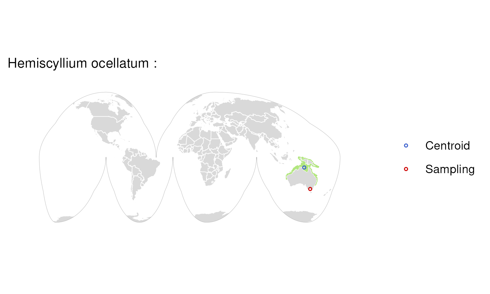

### Heptranchias perlo

**Common Name:** sharpnose sevengill shark\
**Biosample:** SAMN38891902\
**Assembly Accession:** GCA_035084215.1\
**Taxon:** Fishes\
**Priority:** 4\
**Flags:** Outside range

**Biosample provider:** University of Florida: Gavin Naylor\
**Collected by:** —\
**Biosample comments:** The sharpnose sevengill shark (Heptranchias perlo) is a species of shark in the family Hexanchidae, and the only living species in the genus Heptranchias. The sharpnose sevengill shark is uncommon, but widely distributed in the tropical and temperate regions of all oceans except for the northeastern Pacific Ocean. (from Wikipedia entry). This sample of a female individual found in Okinawa Island, Japan, was procured by Gavin Naylor to generate a high-quality reference genome for the Vertebrate Genomes Project (VGP). Sequencing and genome assembly were conducted at the Vertebrate Genomes Lab (VGL) at the Rockefeller University, led by Erich D. Jarvis, Giulio Formenti, and Jennifer Balacco.\
**Location:** Japan: Okinawa Island

### Hyperolius riggenbachi

**Common Name:** Riggenbach’s reed frog\
**Biosample:** SAMN42123895\
**Assembly Accession:** GCA_040937935.1\
**Taxon:** Amphibians\
**Priority:** 4\
**Flags:** Outside range

**Biosample provider:** California Academy of Sciences\
**Collected by:** —\
**Biosample comments:** Riggenbach’s reed frog (Hyperolius riggenbachi) is a species of frog in the family Hyperoliidae. It is found on Bamenda Highlands and the Adamawa Plateau, western and central Cameroon, and Mambilla and Obudu Plateaus of eastern Nigeria. Its natural habitats are wetlands and small wooded watercourses in montane grassland. This species is very common within its small range, but is threatened by habitat loss caused by agricultural activities, wood collection, and human settlement. This sample of a male individual captive born at the California Academy of Sciences was procured by Athena Lam to generate a high-quality reference genome for the Vertebrate Genomes Project (VGP). Sequencing and genome assembly were conducted at the Vertebrate Genome Lab (VGL) at the Rockefeller University, led by Erich D. Jarvis, Giulio Formenti, and Jennifer Balacco.\
**Location:** USA: San Francisco, California

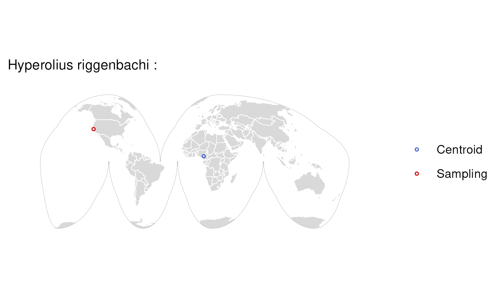

### Jaculus jaculus

**Common Name:** Lesser Egyptian jerboa\
**Biosample:** SAMN20391724\
**Assembly Accession:** GCA_020740685.1\
**Taxon:** Mammals\
**Priority:** 4\
**Flags:** Outside range

**Biosample provider:** —\
**Collected by:** Kimberly Cooper\
**Biosample comments:** The lesser jerboa (Jaculus jaculus) is a small nocturnal rodent of Africa and the Middle East. Its diet consists mainly of seeds and grasses. It is sometimes likened to a tiny kangaroo due to its incredibly large hind legs, and hopping form of locomotion (from Wikipedia). This sample was collected from an adult male by Kimberly Cooper at the University of California, San Diego USA, and used to generate a high-quality trio-based reference genome assembly for the Vertebrate Genomes Project (VGP). The parent samples are named mJacJac2 (mother) and mJacJac3 (father). Sequencing and genome assembly were conducted at the by Gene Myers’ group at Max Planck Institute, Dresden, and coordinated by Olivier Fedrigo and Erich D. Jarvis at the Rockefeller University.\
**Location:** USA: San Diego

### Lacerta agilis

**Common Name:** sand lizard\
**Biosample:** SAMN12629509\
**Assembly Accession:** GCA_009819535.1\
**Taxon:** Reptiles\
**Priority:** 4\
**Flags:** Outside range

**Biosample provider:** University of Gothenburg\
**Collected by:** Mette Lillie, Mats Olsson\
**Biosample comments:** —\
**Location:** Sweden: Halland

### Leptosomus discolor

**Common Name:** cuckoo-roller\
**Biosample:** SAMN37284216\
**Assembly Accession:** GCA_034619465.1\
**Taxon:** Birds\
**Priority:** 4\
**Flags:** Outside range

**Biosample provider:** University of Copenhagen\
**Collected by:** Andreas Frei\
**Biosample comments:** The cuckoo-roller (Leptosomus discolor) is the only bird in the order Leptosomiformes. Despite its name, the Cuckoo-roller does not share close evolutionary origins with cuckoos or rollers at all. It is a medium-large bird, inhabiting forests and woodlands in Madagascar and the Comoro Islands (modified from Wikipedia). This sample is from a male in captivity in Walsrode Bird Park, Germany, sampled by Andreas Frie, and coordinated by Tom Gilbert and Erich Jarvis to generate a high-quality reference genome for the Vertebrate Genomes Project (VGP). Sequencing and genome assembly were conducted at the Vertebrate Genomes Lab (VGL) at the Rockefeller University, led by Olivier Fedrigo and Erich D. Jarvis. This sample was used for a previous genome assembly for the Avian Phylogenomics project published in 2014 (GCF_000691785.1).\
**Location:** Germany: Walsrode Bird Park

### Lethrinus nebulosus

**Common Name:** spangled emperor\
**Biosample:** SAMN40589648\
**Assembly Accession:** GCA_045362495.1\
**Taxon:** Fishes\
**Priority:** 4\
**Flags:** Outside range

**Biosample provider:** —\
**Collected by:** —\
**Biosample comments:** —\
**Location:** Australia: Western Australia, SW of Barrow Island

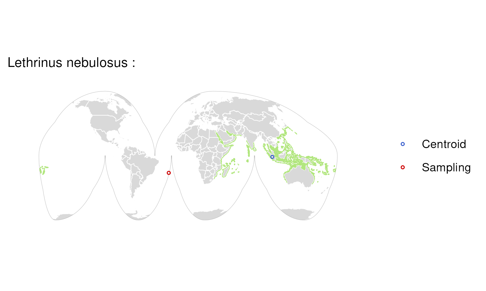

### Lonchura striata domestica

**Common Name:** Bengalese finch\
**Biosample:** SAMN44779081\
**Assembly Accession:** GCA_046129695.1\
**Taxon:** Birds\
**Priority:** 4\
**Flags:** Outside range

**Biosample provider:** The Rockefeller University: Matthew Biegler\
**Collected by:** Matthew Biegler\
**Biosample comments:** The Bengalese finch (Lonchura striata domestica) is a domesticated subspecies of finch. It became a popular cage and trade bird after appearing in European zoos in the 1860s through being imported from Japan, though it was domesticated in China. Coloration and behavior were modified through centuries of selection in Asia, then later in Europe and North America. Another aspect of the Bengalese finch that evolved throughout the centuries is song production. Extensive research has been done and continues to be done on the different ways Bengalese finch songs are produced, how they are processed in the brain, what characteristics of the songs are preferred by females, and how their songs compare to the also commonly studied zebra finch (from Wikipedia entry). This sample of a male individual was procured by Matthew Biegler at the Rockefeller University Field Research Center in Millbrook, New York, for a vocal learning study and to generate a high-quality reference genome for the Vertebrate Genomes Project (VGP). Sequencing and genome assembly were conducted at the Vertebrate Genome Lab (VGL) at the Rockefeller University, led by Erich D. Jarvis, Giulio Formenti, and Jennifer Balacco.\
**Location:** USA: Millbrook, New York

### Lycaon pictus

**Common Name:** African hunting dog\
**Biosample:** SAMN36939365\
**Assembly Accession:** GCA_040955705.1\
**Taxon:** Mammals\
**Priority:** 4\
**Flags:** Outside range

**Biosample provider:** Julia Stagegaard\
**Collected by:** —\
**Biosample comments:** —\
**Location:** Denmark: Ree Park

### Lynx canadensis

**Common Name:** Canada lynx\
**Biosample:** SAMN09948483\
**Assembly Accession:** GCA_007474595.2\
**Taxon:** Mammals\
**Priority:** 4\
**Flags:** Outside range

**Biosample provider:** Tanya Lama, Univ Amherst, MA\
**Collected by:** Tanya Lama\
**Biosample comments:** The raw data of this submission are currently under a G10K-VGP publication embargo until removed from this description, following the G10K data use policy at the following URL: <https://genome10k.soe.ucsc.edu/about/data_use_policy> The Canada lynx is a north American cat species, and has been a model species to in conservation studies to prevent mammal species extinction. It is native to Canada, Alaska, and northern United States. This sample is being used as part of the G10K Vertebrate Genomes Project. The sample was collected by Tanya Lama of the University of Massachusetts Amherst, and the genome from it supported by her and Warren Johnson of the Smithsonian Institute.\
**Location:** USA: Aroostook County, Maine

### Macaca nemestrina

**Common Name:** pig-tailed macaque\
**Biosample:** SAMN41827875\
**Assembly Accession:** GCA_043159975.1\
**Taxon:** Mammals\
**Priority:** 4\
**Flags:** Outside range

**Biosample provider:** Allen Institute for Brain Science: Rebecca Hodge\
**Collected by:** Washington National Primate Research Center (WaNPRC) at the University of Washington\
**Biosample comments:** The southern pig-tailed macaque (Macaca nemestrina) is a medium-sized macaque that lives in Sundaland, southern Thailand, Malaysia, and Indonesia. This macaque has buff-brown fur, with a darker dorsal area and lighter ventral area. Its common name refers to the short tail held semi-erect, resembling the tail of a pig (from Wikipedia entry). This sample is from a male individual bred at the Washington National Primate Research Center (WaNPRC) at the University of Washington in Seattle. The sample was procured by Rebecca Hodge and coordinated by Trygve Bakken, Ed Lein, and Rebecca Hodge at the Allen Institute for Brain Science to generate a high-quality reference genome for an Allen Institute motor cortex project and for the Vertebrate Genomes Project (VGP). Sequencing and genome assembly were conducted at the Vertebrate Genome Lab (VGL) at the Rockefeller University, led by Erich D. Jarvis, Giulio Formenti, and Jennifer Balacco.\
**Location:** USA: Seattle, Washington

### Macropus eugenii

**Common Name:** Tammar wallaby\
**Biosample:** SAMN28408687\
**Assembly Accession:** GCA_028372415.2\
**Taxon:** Mammals\
**Priority:** 4\
**Flags:** Outside range

**Biosample provider:** Manaaki Whenua Landcare Research\
**Collected by:** Andrew Veale\
**Biosample comments:** The tammar wallaby (Notamacropus eugenii) is a small macropod marsupial native to South and Western Australia. It is the best-studied marsupial in terms of its reproduction and development and it is a model organism for these studies. Tammar wallabies were established in Aotearoa (New Zealand) from the 1870s, and in this introduced range they are now agricultural and ecological pests. This sample is from a male in New Zealand, culled as part of pest management in the Waimangu thermal area, a scenic reserve managed by the New Zealand Department of Conservation. The sample was procured by Andrew Veale and used to generate a high-quality reference genome for the Vertebrate Genomes Project (VGP). Sequencing and genome assembly were conducted at the Vertebrate Genomes Lab (VGL) at the Rockefeller University, led by Olivier Fedrigo and Erich D. Jarvis.\
**Location:** New Zealand: Waimangu thermal area

### Mantella aurantiaca

**Common Name:** golden mantella\
**Biosample:** SAMN46714743\
**Assembly Accession:** GCA_048565345.1\
**Taxon:** Amphibians\
**Priority:** 4\
**Flags:** Outside range

**Biosample provider:** Cynthia Steiner, San Diego Zoo Wildlife Alliance\
**Collected by:** San Diego Zoo\
**Biosample comments:** The golden mantella (Mantella aurantiaca) is a small, terrestrial frog endemic to Madagascar. It has an extremely restricted distribution in three distinct areas centered on the town of Moramanga - Beparasy and Ambohibary Communes, Torotorofotsy Wetland northwest of Andasibe, and in the area of Ambakoana. Mantella aurantiaca is one of Madagascar’s most threatened amphibian species due to its limited distribution in an area under tremendous anthropogenic pressure (from Wikipedia entry). This sample of a female individual found in Madagascar was procured by Cynthia Steiner of the San Diego Zoo to generate a high-quality reference genome for the Vertebrate Genomes Project (VGP). Sequencing and genome assembly were conducted at the Vertebrate Genome Lab (VGL) at the Rockefeller University, led by Erich D. Jarvis, Giulio Formenti, and Jennifer Balacco.\
**Location:** Madagascar

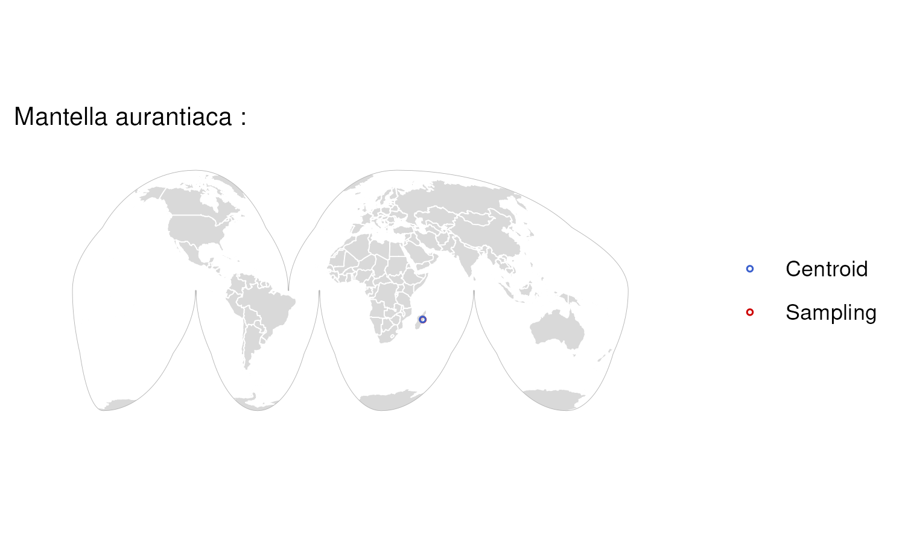

### Megaderma spasma

**Common Name:** Lesser false vampire bat\
**Biosample:** SAMN33550865\
**Assembly Accession:** GCA_043880595.1\
**Taxon:** Mammals\
**Priority:** 4\
**Flags:** Outside range

**Biosample provider:** Eger, JL, Lim, BK, Mitchell, L\
**Collected by:** Eger, JL, Lim, BK, Mitchell, L\
**Biosample comments:** —\
**Location:** missing

### Melanotaenia boesemani

**Common Name:** Boeseman’s rainbowfish\
**Biosample:** SAMN12623618\
**Assembly Accession:** GCA_017639745.1\
**Taxon:** Fishes\
**Priority:** 4\
**Flags:** Outside range

**Biosample provider:** Institue of Molecular and Cell Biology\
**Collected by:** Byrappa Venkatesh\
**Biosample comments:** The Boesmans rainbowfish (Melanotaenia boesemani) is currently an endangered species of fish found in lakes and tributaries, in a moutanous region of the West Papua, Indonesia. They can adjust their colors, and are kept in aquarium. This sample was collected by Byrappa Venkatesh, supported by Gene Myers, in collaboration with Richard Durbin, and used to generate a high-quality reference genome as part of the G10K-VGP and Fish VGP projects.\
**Location:** Singapore

### Melopsittacus undulatus

**Common Name:** budgerigar\
**Biosample:** SAMN12623090\
**Assembly Accession:** GCA_012275295.1\
**Taxon:** Birds\
**Priority:** 4\
**Flags:** Outside range

**Biosample provider:** New Mexico State University\
**Collected by:** Timothy Wright, Justin Apodaca\
**Biosample comments:** The budgerigar, also called the Australian Parakeet (Melopsittacus undulatus), is the most widely used parrot species for studying the neurobiology of vocal learning. It was the first parrot species where the vocal learning brain pathways was discovered, and found to uniquely have a core song learning system surrounded by a shell learning system, with the core similar to songbirds and hummingbirds (also vocal learners) and the shell unique to parrots. The brain pathways have convergent changes in gene regulation shared with human speech brain pathways. This sample was collected as part of a trio of samples (daughter in this case), by Timothy Wright and Justin Apodaca, supported by Erich D. Jarvis, and used to generate a high-quality reference genome of he daughter as part of the G10K-VGP Project and G10K Project.\
**Location:** USA: New Mexico State University

### Mesoplodon bidens

**Common Name:** Sowerby’s beaked whale\
**Biosample:** SAMEA112165298\
**Assembly Accession:** GCA_964165515.1\
**Taxon:** Mammals\
**Priority:** 4\
**Flags:** Outside range

**Biosample provider:** —\
**Collected by:** Anna Roos\
**Biosample comments:** —\
**Location:** Oeckeroe

### Mesoplodon mirus

**Common Name:** True’s beaked whale\
**Biosample:** SAMEA115358965\
**Assembly Accession:** GCA_964341445.1\
**Taxon:** Mammals\
**Priority:** 4\
**Flags:** Outside range

**Biosample provider:** —\
**Collected by:** Nick Davison\
**Biosample comments:** —\
**Location:** Scotland \| Western Isles \| Isle of Lewis \| Brager

### Molossus alvarezi

**Common Name:** Alvarez’s mastiff bat\
**Biosample:** SAMN40002245\
**Assembly Accession:** GCA_037157525.1\
**Taxon:** Mammals\
**Priority:** 4\
**Flags:** Outside range

**Biosample provider:** Bat1K, St. Andrews University: Sonja Vernes\
**Collected by:** Nancy Simmons\
**Biosample comments:** Alvarez’s mastiff bat (Molossus alvarezi) is a species of bat in the family Molossidae, native to the Yucatan Peninsula. It lives within a relative homogenous environment within perennial forests, low forests, and a band of xeric vegetation (from Wikipedia entry). This sample of a female individual found in Lamanai, Orange Walk District, Belize, was procured by Nancy Simmons and Sonja Vernes to generate a high-quality reference genome for the Bat Biology Foundation and the Bat1K project. Sequencing was conducted at Paratus Sciences and genome assembly was conducted at the Vertebrate Genome Lab (VGL) at the Rockefeller University, led by Erich D. Jarvis, Giulio Formenti, and Jennifer Balacco.\
**Location:** Belize: Orange Walk District, Lamanai

### Monodelphis domestica

**Common Name:** gray short-tailed opossum\
**Biosample:** SAMN31801966\
**Assembly Accession:** GCA_027887165.1\
**Taxon:** Mammals\
**Priority:** 4\
**Flags:** Outside range

**Biosample provider:** University of California, Davis\
**Collected by:** Leah Krubitzer, Rebecca Hodge\
**Biosample comments:** The gray short-tailed opossum (Monodelphis domestica) is a small marsupial that inhabits parts of South America. However, it does not have a true pouch. It is a research model as it breeds relatively easily in the laboratory, and neonates can be readily accessed. This sample is from a captive bred colony, procured and collected by Leah Krubitzer at the University of California Davis and Rebecca Hodge at the Allen Institute for Brain Science, and used to generate a high-quality reference for the Vertebrate Genomes Project (VGP). Sequencing and genome assembly were conducted at the Vertebrate Genomes Lab (VGL) at the Rockefeller University, lead by Olivier Fedrigo and Erich D. Jarvis, with support from Ed Lien and Trygve Bakken at the Allen Institute for Brain Science.\
**Location:** USA: Davis, California

### Mops condylurus

**Common Name:** Angolan free-tailed bat\
**Biosample:** SAMN33550911\
**Assembly Accession:** GCA_043748645.1\
**Taxon:** Mammals\
**Priority:** 4\
**Flags:** Outside range

**Biosample provider:** Riesle-Sbarbaro S.A; Kurth A\
**Collected by:** Riesle-Sbarbaro S.A; Kurth A\
**Biosample comments:** —\
**Location:** Cote d’Ivoire: Bregbo Village

### Myotis mystacinus

**Common Name:** whiskered bat\
**Biosample:** SAMEA114250307\
**Assembly Accession:** GCA_964094495.2\
**Taxon:** Mammals\
**Priority:** 4\
**Flags:** Outside range

**Biosample provider:** —\
**Collected by:** HAZEL RYAN\
**Biosample comments:** —\
**Location:** England\|East Grisntead\|Halsford Croft

### Neogale vison

**Common Name:** American mink\
**Biosample:** SAMEA112468126\
**Assembly Accession:** GCA_964106545.1\
**Taxon:** Mammals\
**Priority:** 4\
**Flags:** Outside range

**Biosample provider:** —\
**Collected by:** MICHELLE O’BRIEN\
**Biosample comments:** —\
**Location:** England\|Arundel\|Mill Road

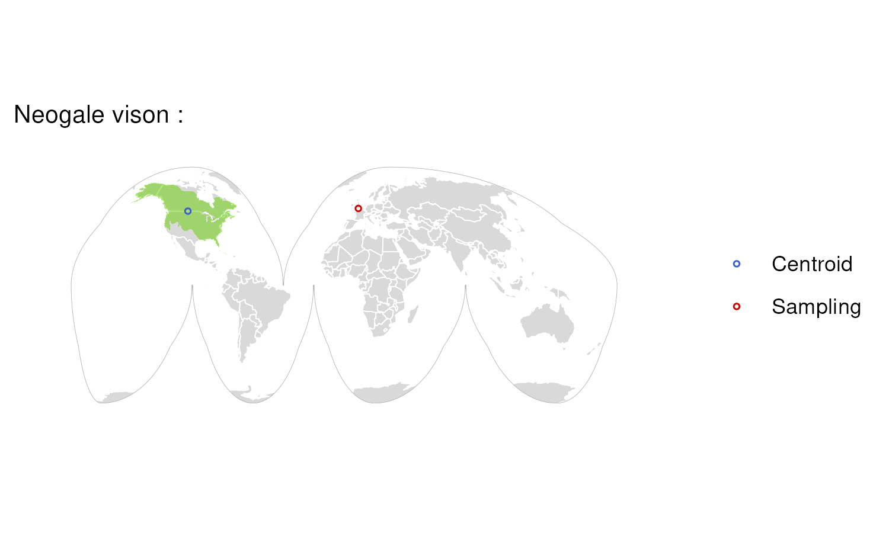

### Nesoenas mayeri

**Common Name:** pink pigeon\
**Biosample:** SAMEA12922160\
**Assembly Accession:** GCA_963082525.1\
**Taxon:** Birds\
**Priority:** 4\
**Flags:** Outside range

**Biosample provider:** —\
**Collected by:** Harriet Whitford\
**Biosample comments:** —\
**Location:** United Kingdom

### Netta rufina

**Common Name:** red-crested pochard\
**Biosample:** SAMEA112468124\
**Assembly Accession:** GCA_964035555.1\
**Taxon:** Birds\
**Priority:** 4\
**Flags:** Outside range

**Biosample provider:** —\
**Collected by:** MICHELLE O’BRIEN\
**Biosample comments:** —\
**Location:** Llenelli\|Llwynhendy

### Notoryctes typhlops

**Common Name:** Southern marsupial mole\
**Biosample:** SAMN45131536\
**Assembly Accession:** GCA_048126345.1\
**Taxon:** Mammals\
**Priority:** 4\
**Flags:** Outside range

**Biosample provider:** Australian Biological Tissue Collection (ABTC)\
**Collected by:** —\
**Biosample comments:** —\
**Location:** Australia:Northern Territory,Waite Creek area

### Oryctolagus cuniculus

**Common Name:** European rabbit\
**Biosample:** SAMEA112468037\
**Assembly Accession:** GCA_964237555.1\
**Taxon:** Mammals\
**Priority:** 4\
**Flags:** Outside range

**Biosample provider:** —\
**Collected by:** MICHELLE O’BRIEN\
**Biosample comments:** —\
**Location:** England\|Gloucester\|Newgounds

### Pangasianodon hypophthalmus

**Common Name:** striped catfish\
**Biosample:** SAMN32348883\
**Assembly Accession:** GCA_027358585.1\
**Taxon:** Fishes\
**Priority:** 4\
**Flags:** Outside range

**Biosample provider:** Axel Meyer, University of Konstanz\
**Collected by:** Joost Woltering\
**Biosample comments:** The striped catfish (Pangasianodon hypophthalmus) is a species of shark catfish (family Pangasiidae) native to the rivers of Southeast Asia. It has some morphological features that make it look like a shark. It is heavily cultivated as a food source, and endangered of extinction in the wild. This sample is from an animal collected by Joost Woltering and Axel Meyer from a fish market in Frankfurt, Germany, and likely from a breeding agriculture source. The sample was used to generate a high-quality reference genome for the Vertebrate Genomes Project (VGP). Sequencing was conducted at the the Max Planck Dresden Genome Center in Germany, conducted and coordinated by Gene Myers, Sylke Winkler, and Thomas Brown.\
**Location:** Germany: Frankfurt

### Pangshura tecta

**Common Name:** Indian roofed turtle\
**Biosample:** SAMN43277916\
**Assembly Accession:** GCA_045781085.1\
**Taxon:** Reptiles\
**Priority:** 4\
**Flags:** Outside range

**Biosample provider:** Wildlife Conservation Society\
**Collected by:** Wildlife Conservation Society\
**Biosample comments:** The Indian roofed turtle (Pangshura tecta) is a species of turtle in the family Geoemydidae. It can be distinguished by the distinct “roof” at the topmost part of the shell. It is found in the major rivers of South Asia. It is a common pet in the Indian Subcontinent (from Wikipedia entry). This sample was collected from a male individual at the Bronx Zoo in New York City. The sample was coordinated by the Wildlife Conservation Society to generate a high-quality reference genome for the Vertebrate Genomes Project (VGP). Sequencing and genome assembly were conducted at the Vertebrate Genome Lab (VGL) at the Rockefeller University, led by Erich D. Jarvis, Giulio Formenti, and Jennifer Balacco.\
**Location:** USA: Bronx, New York

### Patagioenas fasciata

**Common Name:** band-tailed pigeon\
**Biosample:** SAMN40018840\
**Assembly Accession:** GCA_037038585.2\
**Taxon:** Birds\
**Priority:** 4\
**Flags:** Outside range

**Biosample provider:** Erich Jarvis\
**Collected by:** Marine Reynaldo\
**Biosample comments:** The Band-tailed Pigeon (Patagioenas fasciata) is a member of the bird family Columbidae (doves and pigeons). It is a medium-sized species native to the Americas, with a breeding range extending from the west coast of the United States down to Mexico and Peru. The band-tailed pigeon is the closest living relative to the extinct passenger pigeon. This sample is from an individual of the subspecies P. f. monilis bred in captivity. It was sampled in Massapequa (NY) by Marine Reynaldo, coordinated by Ben Novak and Erich D. Jarvis, and supported by Revive & Restore to generate a high-quality reference genome for the Vertebrate Genomes Project (VGP). Sequencing and genome assembly were conducted at the Vertebrate Genomes Lab (VGL) at the Rockefeller University, led by Erich D. Jarvis, Jennifer Balacco, and Giulio Formenti. Assembly and curation were performed by Simona Secomandi.\
**Location:** USA: Massapequa, NY

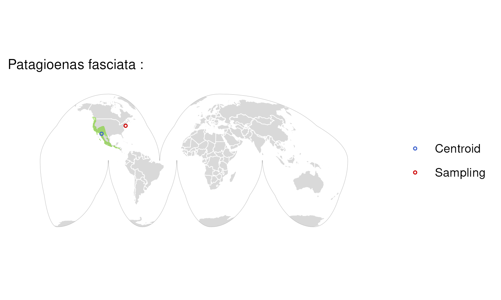

### Pelophylax lessonae

**Common Name:** pool frog\
**Biosample:** SAMEA112468029\
**Assembly Accession:** GCA_965119305.1\
**Taxon:** Amphibians\
**Priority:** 4\
**Flags:** Outside range

**Biosample provider:** —\
**Collected by:** MICHELLE O’BRIEN\
**Biosample comments:** —\
**Location:** England\|Gloucester\|Newgounds

### Pholidichthys leucotaenia

**Common Name:** convict blenny\
**Biosample:** SAMN12623617\
**Assembly Accession:** GCA_020510985.1\
**Taxon:** Fishes\
**Priority:** 4\
**Flags:** Outside range

**Biosample provider:** Institue of Molecular and Cell Biology\
**Collected by:** Byrappa Venkatesh\
**Biosample comments:** The convict blenny (Pholidichthys leucotaenia) lives in the west-central Pacific, and is a small eel shaped fish. Their colors change throughout life. They resemble blennys and gobies, but this may be convergent as genetic analyses indicates that they are not closely related. This sample was collected by Byrappa Venkatesh, supported by Gene Myers, in collaboration with Richard Durbin, and used to generate a high-quality reference genome as part of the G10K-VGP and Fish VGP projects.\
**Location:** Singapore

### Phyllostomus discolor

**Common Name:** pale spear-nosed bat\
**Biosample:** SAMN09948786\
**Assembly Accession:** GCA_004126475.3\
**Taxon:** Mammals\
**Priority:** 4\
**Flags:** Outside range

**Biosample provider:** —\
**Collected by:** Pedro Rodenas-Cuadrado, Uwe Firzlaff, Sonja Vernes\
**Biosample comments:** The data from this biosample are currently under a G10K-VGP publication embargo until removed from this description, following the G10K data use policy at the following URL: <https://genome10k.soe.ucsc.edu/about/data_use_policy> The pale spear-nose bat is a large bat, has the ability of vocal learning, and is being used to study this trait as a mammalian model of human speech acquisition. It is native to Central and South America. The sample was collected by the lab of Sonja Vernes and sequenced at the Rockefeller University Vertebrate Genomes lab.\
**Location:** Germany:Munich, Collected from captive colony, LMU

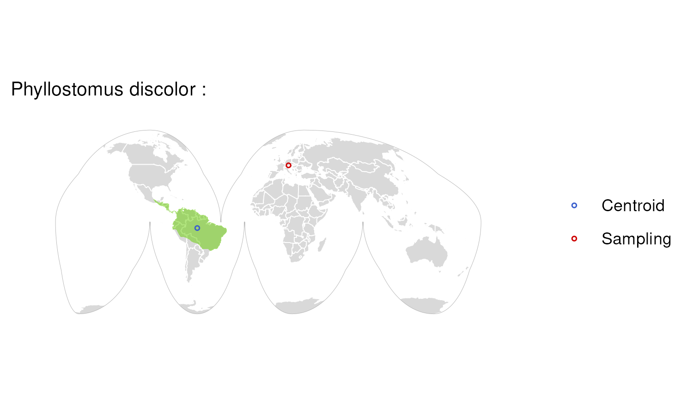

### Platalea leucorodia

**Common Name:** Eurasian spoonbill\
**Biosample:** SAMEA112468120\
**Assembly Accession:** GCA_965183815.1\
**Taxon:** Birds\
**Priority:** 4\
**Flags:** Outside range

**Biosample provider:** —\
**Collected by:** MICHELLE O’BRIEN\
**Biosample comments:** —\
**Location:** England\|Gloucester\|Newgounds

### Podarcis raffonei

**Common Name:** Aeolian wall lizard\
**Biosample:** SAMN28455423\
**Assembly Accession:** GCA_027172205.1\
**Taxon:** Reptiles\
**Priority:** 4\
**Flags:** Outside range

**Biosample provider:** University of Florence\
**Collected by:** Claudio Ciofi\
**Biosample comments:** The Aeolian wall lizard (Podarcis raffonei), also known commonly as Raffone’s wall lizard, is a species of lizard in the family Lacertidae. The species is endemic to Italy (from Wikipedia entry). This sample was procured by Claudio Ciofi and used to generate a high-quality reference genome for the Vertebrate Genomes Project (VGP) and the European Reference Genome Atlas (ERGA). The project was coordinated by Claudio Ciofi of the University of Florence, Firenze, Italy. Sequencing and genome assembly were conducted at the Vertebrate Genomes Lab (VGL) at the Rockefeller University, led by Olivier Fedrigo and Erich D. Jarvis.\
**Location:** Italy: Stromboli Island

### Polymixia lowei

**Common Name:** beardfish\
**Biosample:** SAMN45134564\
**Assembly Accession:** GCA_047511565.1\
**Taxon:** Fishes\
**Priority:** 4\
**Flags:** Outside range

**Biosample provider:** Yale Peabody Museum: Thomas Near\
**Collected by:** Gregory Watkins-Colwell\
**Biosample comments:** The beardfish (Polymixia lowei) is a species of the genus Polymixia, the only extant genus of the order Polymixiiformes and family Polymixiidae. Polymixia contains 10 species, all of which live in deepwater marine environments. They are found in tropical and subtropical waters of the Atlantic, Indian and western Pacific Oceans (from Wikipedia entry). This sample of a male individual was collected by Gregory Watkins-Colwell in the North Atlantic Ocean, and coordinated by Thomas Near to generate a high-quality reference genome for the Vertebrate Genomes Project (VGP). Sequencing and genome assembly were conducted at the Vertebrate Genome Lab (VGL) at the Rockefeller University, led by Erich D. Jarvis, Giulio Formenti, and Jennifer Balacco.\
**Location:** Atlantic Ocean

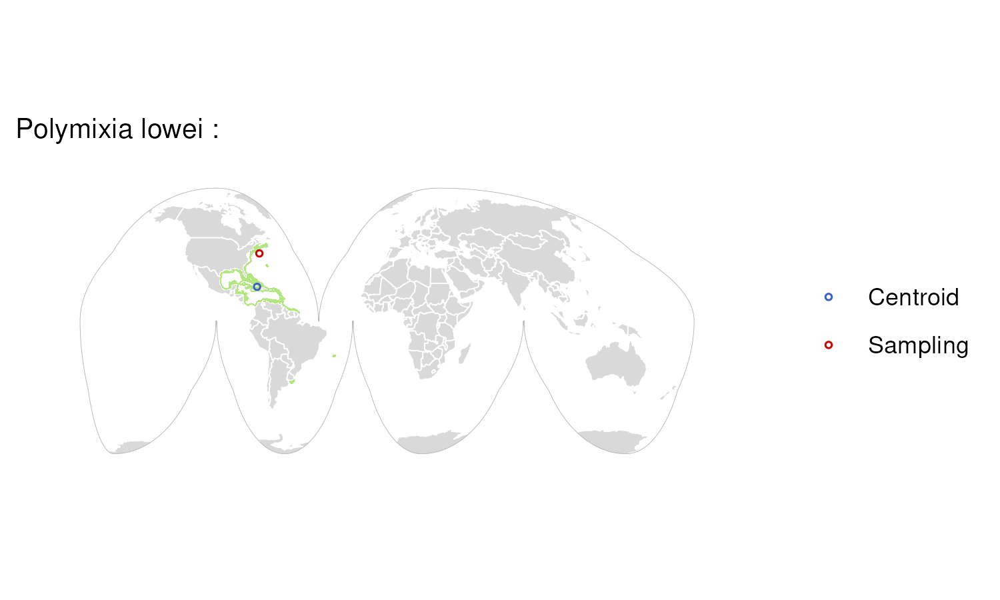

### Poromitra crassiceps

**Common Name:** crested bigscale\
**Biosample:** SAMEA8748810\
**Assembly Accession:** GCA_964638095.1\
**Taxon:** Fishes\
**Priority:** 4\
**Flags:** Outside range

**Biosample provider:** —\
**Collected by:** ILIANA BISTA\
**Biosample comments:** —\
**Location:** Southern Ocean

### Porphyrio hochstetteri

**Common Name:** takahe\
**Biosample:** SAMN22550412\
**Assembly Accession:** GCA_020800305.1\
**Taxon:** Birds\
**Priority:** 4\
**Flags:** Outside range

**Biosample provider:** Burwood Takahe Breeding Centre, New Zealand\
**Collected by:** Glen Greaves\
**Biosample comments:** The takahe (Porphyrio hochstetteri) is a flightless bird indigenous to New Zealand, and the largest living member of the rail family. Due to over hunting, they were once thought extinct by the late1890s, until 50 years later a small isolated population was found. The is now an active breeding program for their conservation. This juvenile female is from trio of samples (parents) breed and collected to create a high-quality reference genome for both maternal and paternal haplotypes. The juvenile was bred in captivity. Sample collection was conducted by Glen Greaves, in a projected coordinated and supported by Lara Urban, Andrew Digby, Daryl Eason, Deidre Vercoe, and Takahe Recovery Programme. Blood from the female was used to create high-quality reference genome assemblies of each haplotype. Genome sequencing and assembly was coordinated by Erich D. Jarvis and Olivier Fedrigo at the Rockefeller University Vertebrate Genome Lab, and as part of the Vertebrate Genomes Project (VGP) and for conservation research.\
**Location:** New Zealand: Burwood

### Pseudophryne corroboree

**Common Name:** Southern corroboree frog\
**Biosample:** SAMN32631236\
**Assembly Accession:** GCA_028390025.1\
**Taxon:** Amphibians\
**Priority:** 4\
**Flags:** Outside range

**Biosample provider:** The University of Melbourne\
**Collected by:** Lee Berger\
**Biosample comments:** Corroboree frogs comprise two species native to the Southern Tablelands of Australia: Southern corroboree frog (Pseudophryne corroboree; this sample) and the Northern corroboree frog (Pseudophryne pengilleyi). Both species are small, poisonous ground-dwelling frogs, and are unique among frogs in that they produce their own poison rather than obtain it from their food source as is the case in every other poisonous frog species (from Wikipedia entry). The species are critically endangered of becoming extinct. This sample is from a male, bred in captivity, in Melbourne, Australia, as part of the conservation program. This sample was collected by Lee Berger, and the project coordinated by him, Andrew Crawford, Lee Skerratt, Tiffany Kosch, and others, to generate a high-quality reference genome for the Vertebrate Genomes Project (VGP). Sequencing and genome assembly were conducted at the Vertebrate Genomes Lab (VGL) at the Rockefeller University led by Olivier Fedrigo and Erich D. Jarvis.\
**Location:** Australia: Melbourne

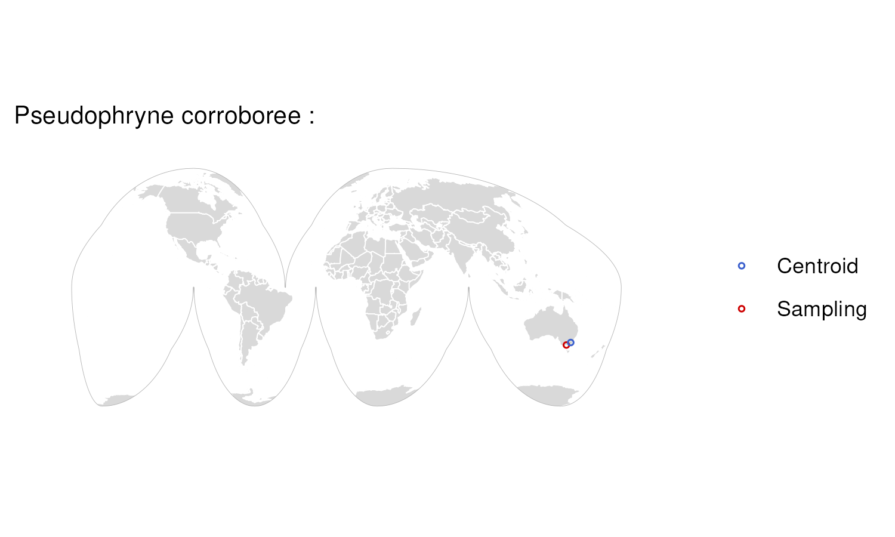

### Pygocentrus nattereri

**Common Name:** red-bellied piranha\
**Biosample:** SAMN12623623\
**Assembly Accession:** GCA_015220715.1\
**Taxon:** Fishes\
**Priority:** 4\
**Flags:** Outside range

**Biosample provider:** University of Konstanz\
**Collected by:** Nidal Karagic\
**Biosample comments:** The Red-bellied piranha (Pygocentrus nattereri) is a freshwater fish found in South America, including the Amazon. They are famous for their ferocious predator eating behavior that they do in groups when there is starvation, but this is not very common. They communicate acoustically using sonic muscles, usually during aggressive behaviors. This sample was collected by Nidal Karagic, procured by Axel Meyer, sequencing supported by Gene Myers, in collaboration with Richard Durbin, to generate a high-quality reference genome as part of the G10K-VGP and Fish VGP projects.\
**Location:** Netherlands: Dejong Marinelife, Rotterdam

### Ranitomeya imitator

**Common Name:** mimic poison frog\
**Biosample:** SAMN32907850\
**Assembly Accession:** GCA_032444005.1\
**Taxon:** Amphibians\
**Priority:** 4\
**Flags:** Outside range

**Biosample provider:** Lauren O’Connell, Stanford University\
**Collected by:** Dave Ramirez and Billie Goolsby, Stanford University\
**Biosample comments:** The mimic poison frog (Ranitomeya imitator; formerly Dendrobates imitator) is a species of poison frog found in the north-central region of eastern Peru. It is one of the best known poison frogs for its color variation and monogamous mating system (from Wikipedia entry). This sample is from a male bred in captivity in the USA, collected and coordinated by Lauren O’Connell, Dave Ramirez, and Billie Goolsby at Standard University, and used to generate a high-quality reference genome for a project on hypothalamus evolution in collaboration with Liqun Leo and Yunming Wu. The group is also contributing this genome to the Vertebrate Genomes Project (VGP). Sequencing and genome assembly were conducted by Dovetail Genomics in Santa Cruz, California, and further curated at the Vertebrate Genome Lab (VGL) led by Olivier Fedrigo and Erich D. Jarvis at the Rockefeller University.\
**Location:** USA: Stanford University, Palo Alto

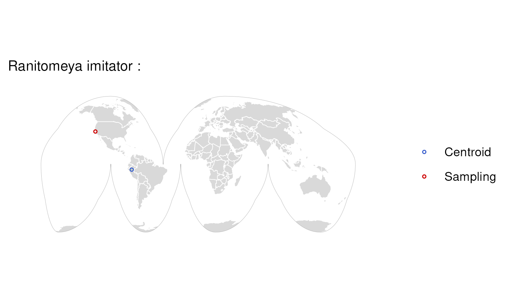

### Rhinolophus perniger lanosus

**Common Name:** Northern woolly horseshoe bat\
**Biosample:** SAMN33438666\
**Assembly Accession:** GCA_043748575.1\
**Taxon:** Mammals\
**Priority:** 4\
**Flags:** Outside range

**Biosample provider:** Lim, BK; Eger, JL\
**Collected by:** Lim, BK; Eger, JL\
**Biosample comments:** —\
**Location:** China: Shuipu Village, Yuping Town

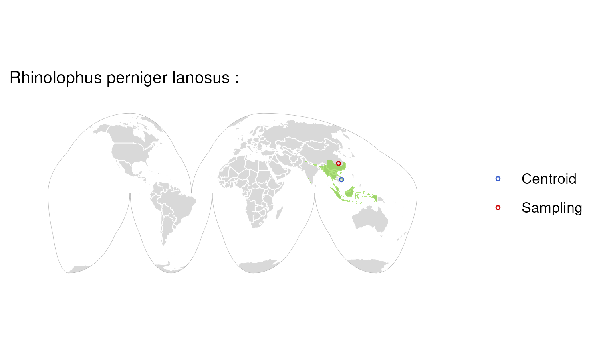

### Rhynchocyon petersi

**Common Name:** black and rufous elephant shrew\
**Biosample:** SAMN43274963\
**Assembly Accession:** GCA_043290085.1\
**Taxon:** Mammals\
**Priority:** 4\
**Flags:** Outside range

**Biosample provider:** Wildlife Conservation Society\
**Collected by:** Wildlife Conservation Society\
**Biosample comments:** The black and rufous elephant shrew (Rhynchocyon petersi) is one of the 17 species of elephant shrew found only in Africa. It is native to the lowland montane and dense forests of Kenya and Tanzania. Like other members of the genus Rhynchocyon, it is a relatively large species, with adults averaging about 28 cm (11 in) in length and 450-700 g (16-25 oz) in weight (from Wikipedia entry). This sample of a male individual was collected by the Wildlife Conservation Society at the Bronx Zoo in New York City, and used to generate a high-quality reference genome for the Vertebrate Genomes Project (VGP). The specimen was captive born at the Bronx Zoo to captive born specimens (dam originated at Omaha Zoo in Nebraska, sire from Brookfield Zoo in Chicago). Sequencing and genome assembly were conducted at the Vertebrate Genome Lab (VGL) at the Rockefeller University, led by Erich D. Jarvis, Giulio Formenti, and Jennifer Balacco.\
**Location:** USA: Bronx, New York

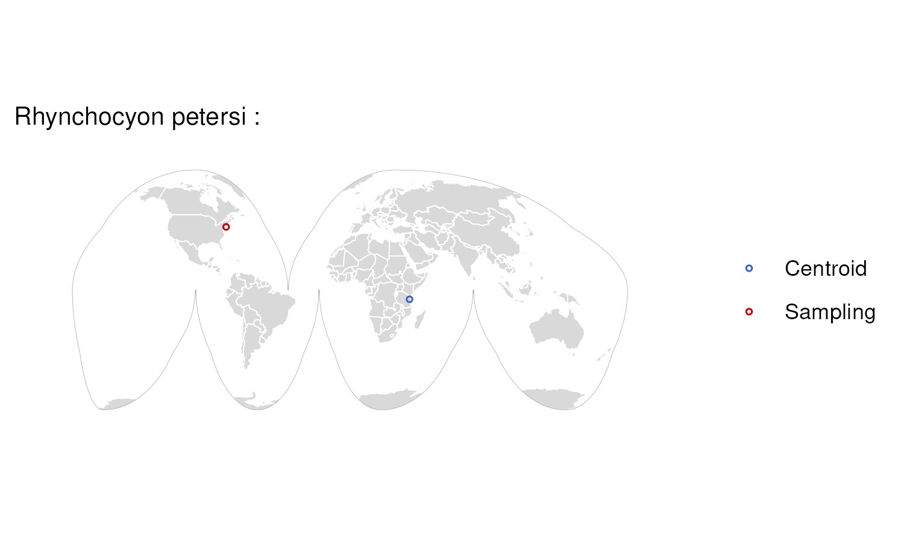

### Rousettus aegyptiacus

**Common Name:** Egyptian fruit bat\
**Biosample:** SAMN14734550\
**Assembly Accession:** GCA_014176215.1\
**Taxon:** Mammals\
**Priority:** 4\
**Flags:** Outside range

**Biosample provider:** Sonja Vernes, Max Planck Institute for Psycholinguistics, Wundtlaan 1, 6525 XD Nijmegen, The Netherlands\
**Collected by:** Sonja Vernes\
**Biosample comments:** Rousettus aegyptiacus (Egyptian fruit bat) is a bat species in the family of Pteropodidae. Its distribution covers Africa, the Middle East, the Mediterranean, and the Indian subcontinent. The sample was collected by Sonja Vernes from a captive colony in Berkeley, USA. This sample is being used to generate chromosomal level reference assembly as part of the Bat1K Project.\
**Location:** USA: Berkeley (captive colony)

### Saimiri boliviensis

**Common Name:** Bolivian squirrel monkey\
**Biosample:** SAMN46760316\
**Assembly Accession:** GCA_048565385.1\
**Taxon:** Mammals\
**Priority:** 4\
**Flags:** Outside range

**Biosample provider:** Allen Institute for Brain Science: Rebecca Hodge\
**Collected by:** University of North Carolina, Chapel Hill, Gregory K. Wilkerson\
**Biosample comments:** The Bolivian squirrel monkey (Saimiri boliviensis) is a species of New-World monkey native to the upper Amazon basin in Bolivia, western Brazil and eastern Peru. They are primarily tree-dwelling and are found in both native and plantation forests as well as some farmed areas near running water (from Wikipedia entry). This sample from a male adult was collected by Gregory K. Wilkerson from a captive breeding colony at the University of Texas, MD Anderson Cancer Center, Keeling Center for Comparative Medicine in Bastrop, Texas. The sample was coordinated by Trygve Bakken, Rebecca Hodge, and Ed Lein at the Allen Institute for Brain Science to generate a high-quality reference genome for an Allen Institute motor cortex project and for the Vertebrate Genomes Project (VGP). Sequencing and genome assembly were conducted at the Vertebrate Genome Lab (VGL) at the Rockefeller University, led by Erich D. Jarvis, Giulio Formenti, and Jennifer Balacco.\
**Location:** USA: Bastrop, Texas

### Sarcophilus harrisii

**Common Name:** Tasmanian devil\
**Biosample:** SAMN47327921\
**Assembly Accession:** GCA_048593225.1\
**Taxon:** Mammals\
**Priority:** 4\
**Flags:** Outside range

**Biosample provider:** San Diego Zoo\
**Collected by:** —\
**Biosample comments:** —\
**Location:** missing

### Silurus aristotelis

**Common Name:** Aristotle’s catfish\
**Biosample:** SAMEA12595289\
**Assembly Accession:** GCA_946808225.1\
**Taxon:** Fishes\
**Priority:** 4\
**Flags:** Outside range

**Biosample provider:** —\
**Collected by:** Ioannis Leonardos\
**Biosample comments:** —\
**Location:** Ioannina Lake

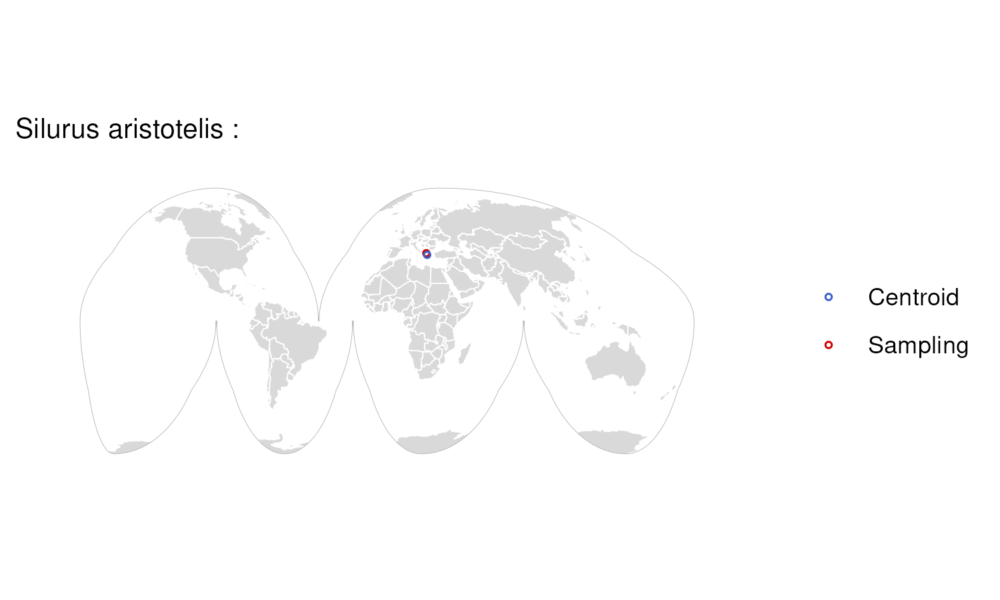

### Spermophilus citellus

**Common Name:** European ground squirrel\
**Biosample:** SAMEA10332752\
**Assembly Accession:** GCA_964194105.1\
**Taxon:** Mammals\
**Priority:** 4\
**Flags:** Outside range

**Biosample provider:** —\
**Collected by:** ANASTASIA DIAKOU \| DIONISIOS YOULATOS \| DIMITRA LIDA RAMMOU\
**Biosample comments:** —\
**Location:** THESSALONIKI

### Spheniscus humboldti

**Common Name:** Humboldt penguin\
**Biosample:** SAMN28408465\
**Assembly Accession:** GCA_027474245.1\
**Taxon:** Birds\
**Priority:** 4\
**Flags:** Outside range

**Biosample provider:** Copenhagen Zoo\
**Collected by:** Mads Bertelsen\
**Biosample comments:** The Humboldt penguin (Spheniscus humboldti) is a medium-sized penguin. It resides in South America, with its range containing mainly most of coastal Peru (from Wikipedia entry). This sample from a female in the Copenhagen Zoo, in Denmark. The sample was procured by Mads Bertelsen and used to generate a high-quality reference genome for the Vertebrate Genomes Project (VGP). Sequencing and genome assembly were conducted at the Vertebrate Genomes Lab (VGL) at the Rockefeller University, led by Olivier Fedrigo and Erich D. Jarvis, with funding support from Tom Gilbert and Jarvis.\
**Location:** Denmark: Copenhagen

### Struthio camelus australis

**Common Name:** common ostrich\
**Biosample:** SAMN42123890\
**Assembly Accession:** GCA_040807025.1\
**Taxon:** Birds\
**Priority:** 4\
**Flags:** Outside range

**Biosample provider:** The Rockefeller University\
**Collected by:** Anna Keyte, Matthew Biegler\
**Biosample comments:** The common ostrich (Struthio camelus), or simply ostrich, is a species of flightless bird native to certain large areas of Africa. It is one of two extant species of ostriches, the only living members of the genus Struthio in the ratite order of birds. The North African ostrich (Struthio camelus camelus) is the nominate subspecies of the common ostrich from West and North Africa. It has the largest average size among the subspecies of ostriches, making it the largest living bird (from Wikipedia entries). The cells of this sample are embryonic fibroblasts derived from an HH28 embryo cultured up to 14 days in vitro. The embryo came from eggs shipped from Roaming Acres farm in Lafayette Township, New Jersey. The farm raises ostriches that are a non-pedigreed hybrid of the “blue-necked” Somali ostrich (Struthio molybdophanes) and the “red-necked” North African sub-species of the common ostrich (Struthio camelus camelus). The sample was procured by Anna Keyte and Matthew Biegler to generate a high-quality reference genome for the Vertebrate Genomes Project (VGP), and the cells were incubated at the Rockefeller University. Sequencing and genome assembly were conducted at the Vertebrate Genome Lab (VGL) at the Rockefeller University, led by Erich D. Jarvis, Giulio Formenti, and Jennifer Balacco.\
**Location:** USA: New York, NY

### Suncus etruscus

**Common Name:** Etruscan shrew\
**Biosample:** SAMN28420931\
**Assembly Accession:** GCA_024139225.1\
**Taxon:** Mammals\
**Priority:** 4\
**Flags:** Outside range

**Biosample provider:** Morgridge Institute for Research\
**Collected by:** Susanne Meyer, Jessica Antosiewicz-Bourget\
**Biosample comments:** The Etruscan shrew (Suncus etruscus), also known as white-toothed pygmy shrew, is the smallest known extant mammal by mass, weighing only about 1.8 g (0.063 oz) on average. They prefer warm and damp climates and are widely distributed in the belt between 10 and 30 degrees N latitude stretching from Europe and North Africa up to Malaysia (from Wikipedia entry). This sample is from a cell culture line generated by Jessica Antosiewicz-Bourget and Susanne Meyer, from lung fibroblast of an adult male, at the Morgridge Institute for Research, in Madison Wisconsin. The project was coordinated by Yury Bukhman and the sample used to generate a high-quality reference genome for the Vertebrate Genomes Project (VGP). Sequencing and genome assembly were conducted at the Vertebrate Genomes Lab (VGL) at the Rockefeller University, led by Olivier Fedrigo and Erich D. Jarvis.\
**Location:** USA: Madison, Wisconsin

### Symphorus nematophorus

**Common Name:** chinamanfish\
**Biosample:** SAMN41179601\
**Assembly Accession:** GCA_048128725.1\
**Taxon:** Fishes\
**Priority:** 4\
**Flags:** Outside range

**Biosample provider:** —\
**Collected by:** —\
**Biosample comments:** —\
**Location:** Australia: Western Australia, SW of Barrow Island

### Syngnathus typhle

**Common Name:** broad-nosed pipefish\
**Biosample:** SAMN36735486\
**Assembly Accession:** GCA_048301445.1\
**Taxon:** Fishes\
**Priority:** 4\
**Flags:** Outside range

**Biosample provider:** Peter Rask Moller,Josefin Stiller\
**Collected by:** —\
**Biosample comments:** —\
**Location:** Denmark: Koge

### Taeniopygia guttata

**Common Name:** zebra finch\
**Biosample:** SAMN47142318\
**Assembly Accession:** GCA_048771995.1\
**Taxon:** Birds\
**Priority:** 4\
**Flags:** Outside range

**Biosample provider:** The Rockefeller University: Gillian Durham\
**Collected by:** Gillian Durham\
**Biosample comments:** The zebra finch (Taeniopygia guttata), native to Australia, is one of the most studied birds in science, for its vocal learning abilities and as a representative songbird. This sample of a female individual is part of a trio (female offspring bTaeGut7, mother bTaeGut8, father bTaeGut9). It was procured by Gillian Durham and Matthew Biegler of the Rockefeller University Field Center to be used to generate a telomere-to-telomere (T2T) reference genome assembly for the Vertebrate Genomes Project (VGP), as well as for the vocal learning community. Sequencing and genome assembly were conducted at the Vertebrate Genome Lab (VGL) at the Rockefeller University, led by Erich D. Jarvis, Giulio Formenti, and Jennifer Balacco.\
**Location:** USA: Millbrook, New York

### Thamnophis elegans

**Common Name:** Western terrestrial garter snake\
**Biosample:** SAMN12629499\
**Assembly Accession:** GCA_009769535.1\
**Taxon:** Reptiles\
**Priority:** 4\
**Flags:** Outside range

**Biosample provider:** Iowa State University\
**Collected by:** Anne Bronikowski\
**Biosample comments:** —\
**Location:** USA: Born in Anne Bronikowsk lab at ISU; MOM, 2012; Eagle Lake; PAP

### Toxotes jaculatrix

**Common Name:** banded archerfish\
**Biosample:** SAMN18445299\
**Assembly Accession:** GCA_017976425.1\
**Taxon:** Fishes\
**Priority:** 4\
**Flags:** Outside range

**Biosample provider:** Institute of Molecular and Cell Biology, A\*STAR\
**Collected by:** Byrappa Venkatesh\
**Biosample comments:** The banded archerfish (Toxotes jaculatrix) is a perciform fish (incertae sedis in Carangimorphariae), found in Indo-Pacific and Oceanian waters, near river mouths. Its name is based on the method banded archerfish use to capture prey (from Wikipedia entry). These samples are from an adult collected by Byrappa Venkatesh in Singapore, to generate a high-quality reference for the Vertebrate Genomes Project (VGP). Sequencing and genome assembly were conducted at the Max Planck Institute in Dresden , lead by Gene Meyers, and coordinated with Richard Durbin and Erich D. Jarvis.\
**Location:** Singapore

### Trichomycterus rosablanca

**Common Name:** Rosablanca cavefish\
**Biosample:** SAMN32755940\
**Assembly Accession:** GCA_030014385.1\
**Taxon:** Fishes\
**Priority:** 4\
**Flags:** Outside range

**Biosample provider:** Universidad de los Andes\
**Collected by:** Mauricio Torres\
**Biosample comments:** Trichomycterus rosablanca is a new troglobitic catfish species from caves in southeastern Santander, Colombia. These caves are drained by the Carare River of the Magdalena River basin. The new species is characterized by the advanced condition in the typical troglomorphisms found in other congeneric cave-dwelling species, such as absence of eyes and pigmentation (written by Carlos DoNascimiento 2018, Biota Colombiana). This sample is from a male found in Andes caves in Santander, Colombia, collected by Mauricio Torres and coordinated by Daniel Cadena to generate a high-quality reference genome for the Vertebrate Genomes Project (VGP) and a Colombia Genomes Project. Sequencing and genome assembly were conducted at the Vertebrate Genomes Lab (VGL) at the Rockefeller University, led by Olivier Fedrigo and Erich D. Jarvis.\
**Location:** Colombia: Andes Mountains, Santander

### Trichosurus vulpecula

**Common Name:** common brushtail possum\
**Biosample:** SAMN12629507\
**Assembly Accession:** GCA_011100635.1\
**Taxon:** Mammals\
**Priority:** 4\
**Flags:** Outside range

**Biosample provider:** University of Otago\
**Collected by:** Tim Hore, Mel Laird, Sol Wogan\
**Biosample comments:** —\
**Location:** New Zealand: Sandymount, Otago Peninsula (Trap 21)

### Xenentodon cancila

**Common Name:** needlefish\
**Biosample:** SAMN12623622\
**Assembly Accession:** GCA_014839995.1\
**Taxon:** Fishes\
**Priority:** 4\
**Flags:** Outside range

**Biosample provider:** University of Konstanz\
**Collected by:** Andreas Kaut\
**Biosample comments:** The Needlefish (Xenentodon cancila) is a fresh water fish found in South and SouthEast Asia. It is large, but relatively long and thin fish, and thus its name. It is popular in aquarium for over 100 years. This sample was collected by Andreas Kaut, procured by Axel Meyer, sequencing supported by Gene Myers, in collaboration with Richard Durbin, to generate a high-quality reference genome as part of the G10K-VGP and Fish VGP projects.\
**Location:** Netherlands: Dejong Marinelife, Rotterdam

### Xenopus petersii

**Common Name:** Peter’s clawed frog\
**Biosample:** SAMN39187339\
**Assembly Accession:** GCA_038501925.1\
**Taxon:** Amphibians\
**Priority:** 4\
**Flags:** Outside range

**Biosample provider:** Columbia University: Darcy Kelley\
**Collected by:** Darcy Kelley\
**Biosample comments:** Peters’ clawed frog (Xenopus petersii) is in the Pipidae frog family found throughout parts of central and southern Africa. Its natural habitats are subtropical or tropical moist lowland forests (modified from Wikipedia entry). This sample is from a breeding colony at Xenopus Express, in Florida, with the original source population from the Congo. The sample (aXenPet1) and the parents (mother aXenPet2 and father aXenPet3) were collected by Darcy Kelley at Columbia University, and coordinated in collaboration with Andres Bendensky, Richard Harland, and Young Kwon, to be used to generate a high-quality reference genome for the Vertebrate Genomes Project (VGP). Sequencing and genome assembly were conducted at the Vertebrate Genomes Lab (VGL) at the Rockefeller University, led by Olivier Fedrigo and Erich D. Jarvis.\
**Location:** USA: Xenopus Express, Brooksville, Florida

### Dama dama

**Common Name:** fallow deer\
**Biosample:** SAMN36735489\
**Assembly Accession:** GCA_048126745.1\
**Taxon:** Mammals\
**Priority:** 5\
**Flags:** Vague location

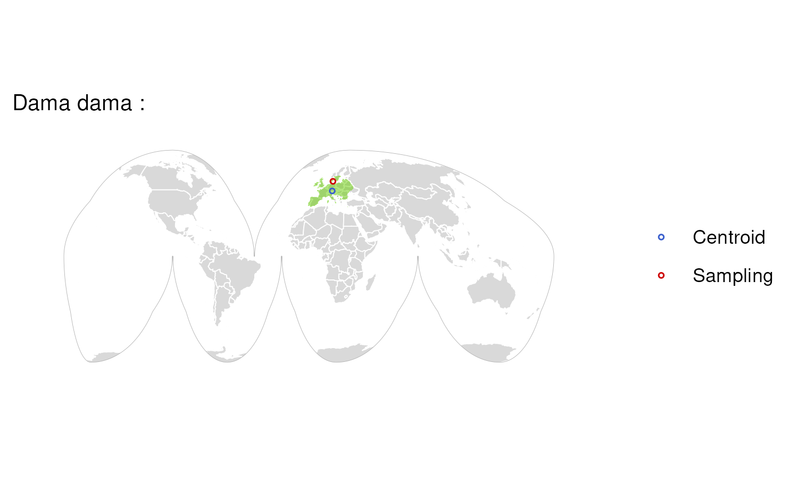

### Hirundo rustica

**Common Name:** barn swallow\
**Biosample:** SAMN14675488\
**Assembly Accession:** GCA_015227805.3\
**Taxon:** Birds\
**Priority:** 5\
**Flags:** Vague location

### Abramis brama

**Common Name:** common bream\
**Biosample:** SAMEA11296536\
**Assembly Accession:** GCA_963993115.1\
**Taxon:** Fishes\
**Priority:** 6\
**Flags:** —

### Acanthisitta chloris

**Common Name:** rifleman\
**Biosample:** SAMN16442762\
**Assembly Accession:** GCA_016904835.1\
**Taxon:** Birds\
**Priority:** 6\
**Flags:** —

### Acanthopagrus schlegelii

**Common Name:** black porgy\
**Biosample:** SAMN43087228\
**Assembly Accession:** GCA_041753875.1\
**Taxon:** Fishes\
**Priority:** 6\
**Flags:** —

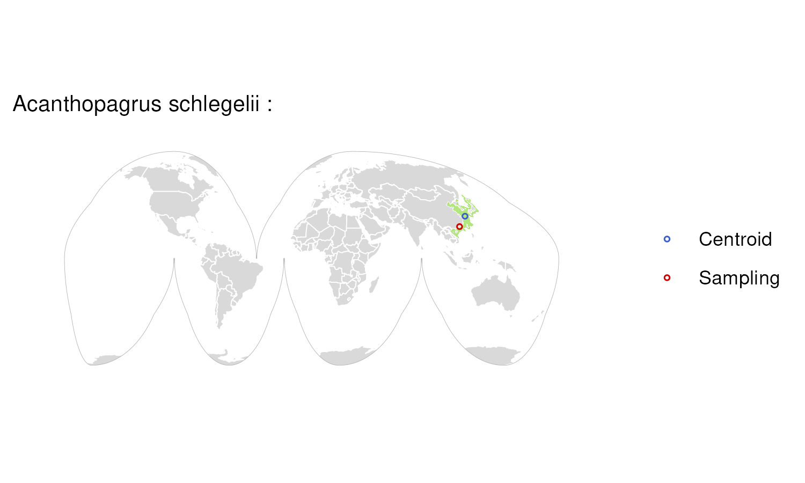

### Accipiter gentilis

**Common Name:** Northern goshawk\
**Biosample:** SAMEA8235650\
**Assembly Accession:** GCA_929443795.1\
**Taxon:** Birds\
**Priority:** 6\
**Flags:** —

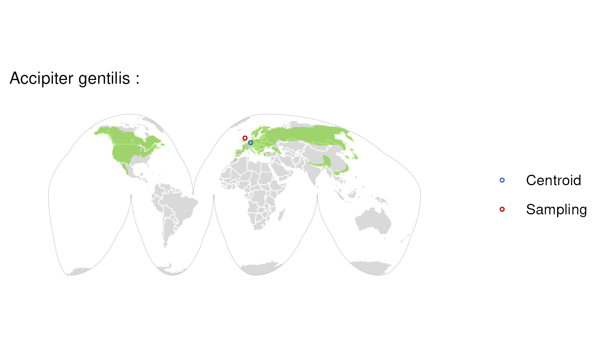

### Acomys minous

**Common Name:** Crete spiny mouse\
**Biosample:** SAMEA112751364\
**Assembly Accession:** GCA_964271855.1\
**Taxon:** Mammals\
**Priority:** 6\
**Flags:** —

### Aegotheles albertisi

**Common Name:** mountain owlet-nightjar\
**Biosample:** SAMN41085506\
**Assembly Accession:** GCA_039906565.1\
**Taxon:** Birds\
**Priority:** 6\
**Flags:** —

### Agelaius phoeniceus

**Common Name:** red-winged blackbird\
**Biosample:** SAMN19590559\
**Assembly Accession:** GCA_020745825.3\
**Taxon:** Birds\
**Priority:** 6\
**Flags:** —

### Alca Torda

**Common Name:** razorbill\
**Biosample:** SAMN12292087\
**Assembly Accession:** GCA_008658365.1\
**Taxon:** Birds\
**Priority:** 6\
**Flags:** —

### Alligator mississippiensis

**Common Name:** American alligator\
**Biosample:** SAMN37045233\
**Assembly Accession:** GCA_030867095.1\
**Taxon:** Reptiles\
**Priority:** 6\
**Flags:** —

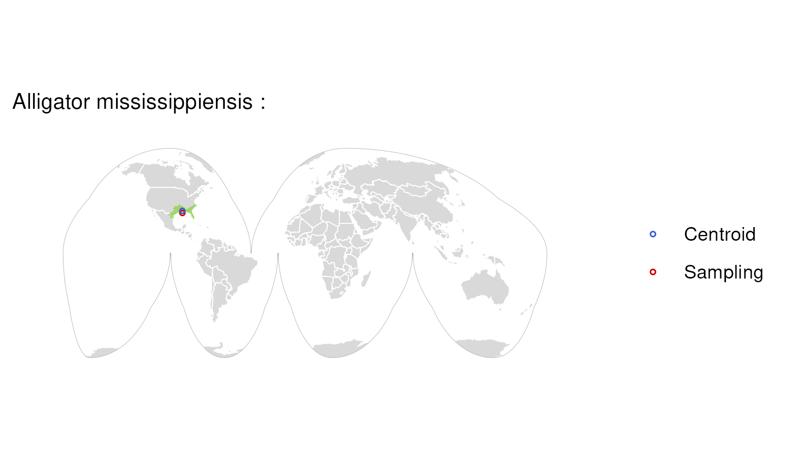

### Alosa sapidissima

**Common Name:** American shad\
**Biosample:** SAMN18857608\
**Assembly Accession:** GCA_018492685.1\
**Taxon:** Fishes\
**Priority:** 6\
**Flags:** —

### Amazona ochrocephala

**Common Name:** yellow-crowned amazon\
**Biosample:** SAMN41018448\
**Assembly Accession:** GCA_039720435.1\
**Taxon:** Birds\
**Priority:** 6\
**Flags:** —

### Amblyopsis spelaea

**Common Name:** Northern cavefish\
**Biosample:** SAMN45063415\
**Assembly Accession:** GCA_046255685.1\
**Taxon:** Fishes\
**Priority:** 6\
**Flags:** —

### Amblyraja radiata

**Common Name:** thorny skate\
**Biosample:** SAMN09948523\
**Assembly Accession:** GCA_010909765.2\
**Taxon:** Fishes\
**Priority:** 6\
**Flags:** —

### Amia calva

**Common Name:** bowfin\
**Biosample:** SAMN39643085\
**Assembly Accession:** GCA_036373705.1\
**Taxon:** Fishes\
**Priority:** 6\
**Flags:** Missing range raster

### Ammodramus caudacutus

**Common Name:** saltmarsh sparrow\
**Biosample:** SAMN28421630\
**Assembly Accession:** GCA_027887145.1\
**Taxon:** Birds\
**Priority:** 6\
**Flags:** —

### Ammodytes marinus

**Common Name:** lesseer sand eel\
**Biosample:** SAMEA110137622\
**Assembly Accession:** GCA_949987685.1\
**Taxon:** Fishes\
**Priority:** 6\
**Flags:** Missing range raster

### Ammospiza maritima

**Common Name:** seaside sparrow\
**Biosample:** SAMN39181024\
**Assembly Accession:** GCA_036010785.1\
**Taxon:** Birds\
**Priority:** 6\
**Flags:** —

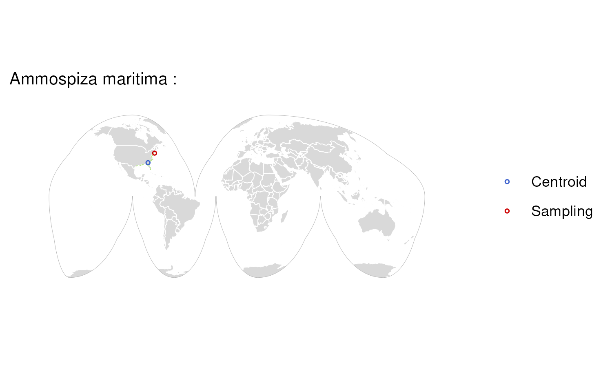

### Ammospiza nelsoni

**Common Name:** Nelson’s sparrow\
**Biosample:** SAMN28421656\
**Assembly Accession:** GCA_027579445.1\
**Taxon:** Birds\
**Priority:** 6\
**Flags:** —

### Anableps anableps

**Common Name:** largescale four-eyes\
**Biosample:** SAMN12623628\
**Assembly Accession:** GCA_014839685.1\
**Taxon:** Fishes\
**Priority:** 6\
**Flags:** Zoo/Aquarium sample

**Biosample provider:** University of Konstanz\
**Collected by:** Andreas Kaut\
**Biosample comments:** The Four-eyed fish (Anableps anableps) live in fresh water and found in Southern Mexico to Honduras. Their eyes are raised to the top of their head, and divided into two parts: to see above and below the water surface. Right-sided males only mate with left-sided females, and vice versa. This sample was collected by Andreas Kaut, procured by Axel Meyer, sequencing supported by Gene Myers, in collaboration with Richard Durbin, to generate a high-quality reference genome as part of the G10K-VGP and Fish VGP projects.\
**Location:** Germany: Wilhelma Zoo, Stuttgart

### Anas acuta

**Common Name:** northern pintail\
**Biosample:** SAMEA112468036\
**Assembly Accession:** GCA_963932015.1\
**Taxon:** Birds\
**Priority:** 6\
**Flags:** —

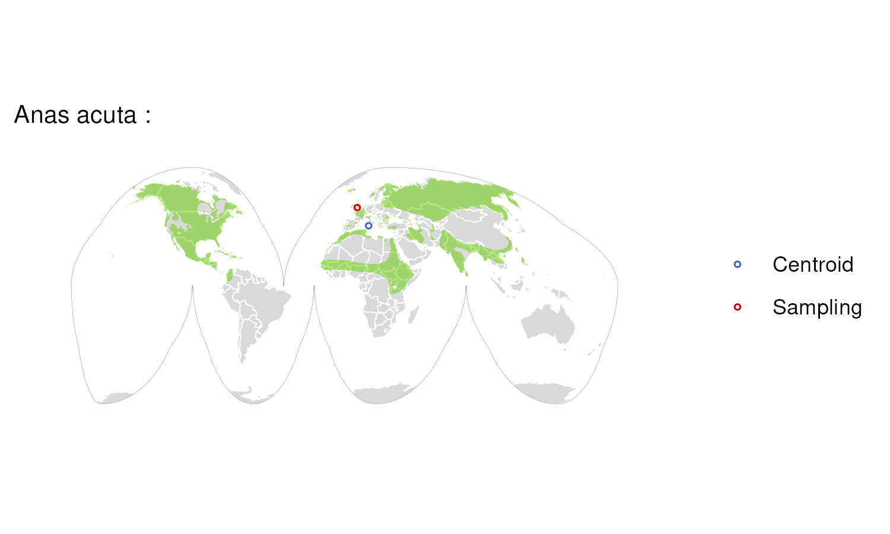

### Anas platyrhynchos

**Common Name:** mallard\
**Biosample:** SAMEA113398833\
**Assembly Accession:** GCA_964188345.1\
**Taxon:** Birds\
**Priority:** 6\
**Flags:** —

### Anguilla anguilla

**Common Name:** European eel\
**Biosample:** SAMN12623627\
**Assembly Accession:** GCA_013347855.1\
**Taxon:** Fishes\
**Priority:** 6\
**Flags:** —

### Anniella stebbinsi

**Common Name:** Southern California legless lizard\
**Biosample:** SAMN33386066\
**Assembly Accession:** GCA_029215775.1\
**Taxon:** Reptiles\
**Priority:** 6\
**Flags:** —

### Anolis sagrei

**Common Name:** brown anole\
**Biosample:** SAMN40144551\
**Assembly Accession:** GCA_037176765.1\
**Taxon:** Reptiles\
**Priority:** 6\
**Flags:** —

### Anomaloglossus baeobatrachus

**Common Name:** Edward’s Rocket Frog\
**Biosample:** SAMN46966667\
**Assembly Accession:** GCA_048569485.1\
**Taxon:** Amphibians\
**Priority:** 6\
**Flags:** —

### Anser anser

**Common Name:** domestic goose\
**Biosample:** SAMEA113398854\
**Assembly Accession:** GCA_964211835.1\
**Taxon:** Birds\
**Priority:** 6\
**Flags:** —

### Anser cygnoides

**Common Name:** swan goose\
**Biosample:** SAMN41386743\
**Assembly Accession:** GCA_040182565.1\
**Taxon:** Birds\
**Priority:** 6\
**Flags:** —

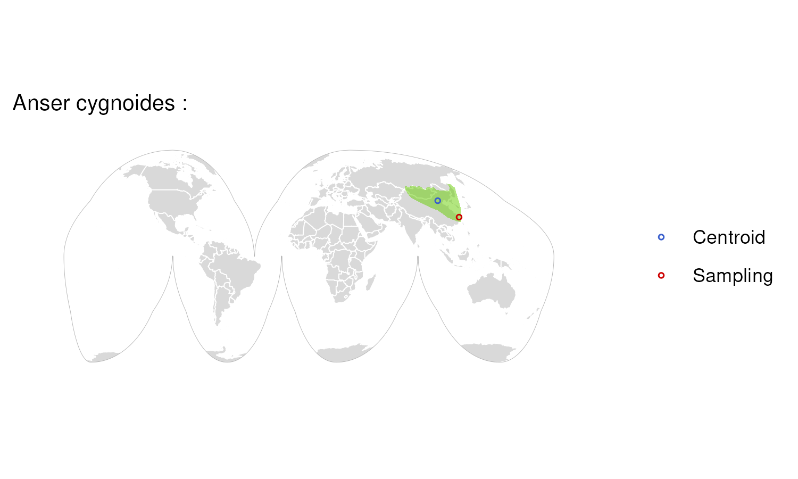

### Antrozous pallidus

**Common Name:** pallid bat\
**Biosample:** SAMN30225125\
**Assembly Accession:** GCA_027563665.1\
**Taxon:** Mammals\
**Priority:** 6\
**Flags:** —

### Aplidium turbinatum

**Common Name:** clonial sea squirt\
**Biosample:** SAMEA7536566\
**Assembly Accession:** GCA_918807975.1\
**Taxon:** Invertebrates\
**Priority:** 6\
**Flags:** Missing range raster

### Aplochiton taeniatus

**Common Name:** peladilla\
**Biosample:** SAMN12623621\
**Assembly Accession:** GCA_017639675.1\
**Taxon:** Fishes\
**Priority:** 6\
**Flags:** —

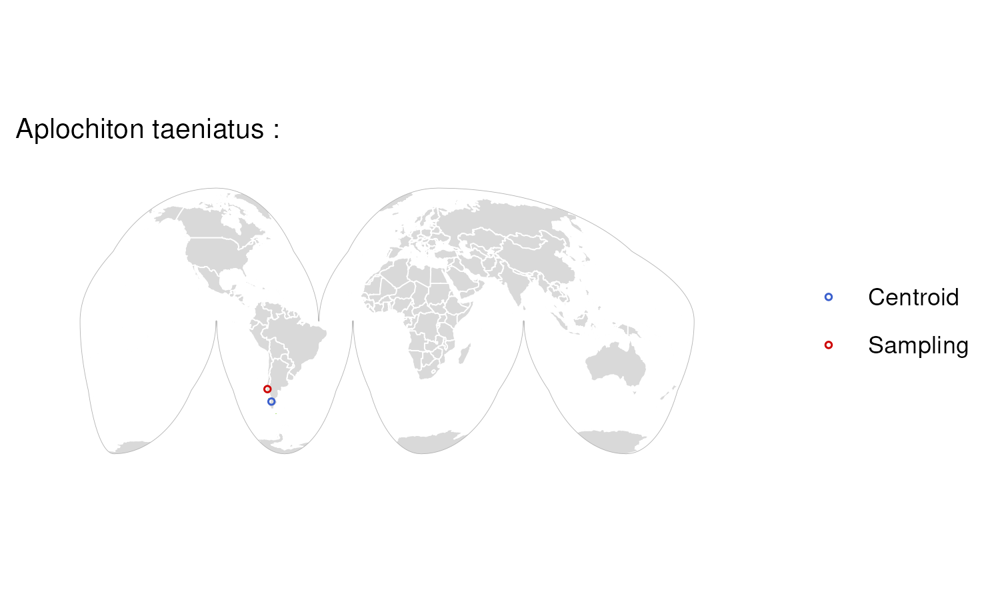

### Apodemus sylvaticus

**Common Name:** European woodmouse\
**Biosample:** SAMEA7702024\
**Assembly Accession:** GCA_947179515.1\
**Taxon:** Mammals\
**Priority:** 6\
**Flags:** —

### Apteryx mantelli

**Common Name:** North Island brown kiwi\
**Biosample:** SAMN39257886\
**Assembly Accession:** GCA_036417845.1\
**Taxon:** Birds\
**Priority:** 6\
**Flags:** Zoo/Aquarium sample

**Biosample provider:** Klaus-peter Koepfli: Smithsonian’s National Zoo & Conservation Biology Institute\
**Collected by:** Smithsonian Veterinary Staff: Don Neiffer, Kelly Helmick, Kristina Delaski, Christie Hicks, Julia Jones, Lisa Ware\
**Biosample comments:** The North Island brown kiwi (Apteryx mantelli) is a species of kiwi that is widespread in the northern two-thirds of the North Island of New Zealand. It is the most common kiwi. It holds the world’s record for laying the largest eggs relative to its body size (modified from Wikipedia entry). This sample of male was collected by the veterinary team at the Smithsonian’s National Zoo & Conservation Biology Institute, and coordinated by Klaus-Peter Koepfli to be used to generate a high-quality reference genome for the Vertebrate Genomes Project (VGP). Sequencing and genome assembly were conducted at the Vertebrate Genomes Lab (VGL) at the Rockefeller University, led by Erich D. Jarvis, Giulio Formenti, and Jennifer Balacco.\
**Location:** USA: Smithsonian’s National Zoo & Conservation Biology Institute, Front Royal, VA

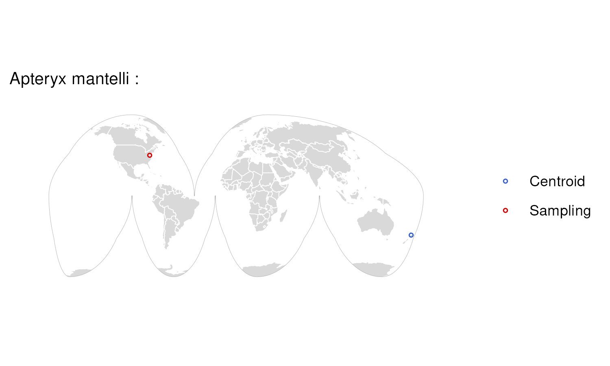

### Apus apus

**Common Name:** common swift\
**Biosample:** SAMN22785356\
**Assembly Accession:** GCA_020740795.1\
**Taxon:** Birds\
**Priority:** 6\
**Flags:** —

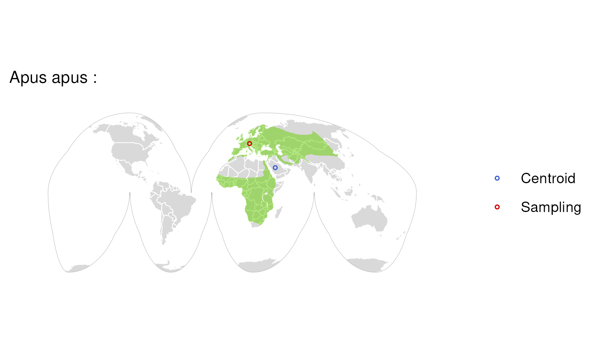

### Argentina silus

**Common Name:** greater argentine\
**Biosample:** SAMEA110137623\
**Assembly Accession:** GCA_951799395.1\
**Taxon:** Fishes\
**Priority:** 6\
**Flags:** Missing range raster

### Arripis georgiana

**Common Name:** Australian herring\
**Biosample:** SAMN40589644\
**Assembly Accession:** GCA_042242135.1\
**Taxon:** Fishes\
**Priority:** 6\
**Flags:** Missing range raster

### Artibeus intermedius

**Common Name:** intermediate fruit-eating bat\
**Biosample:** SAMN40002248\
**Assembly Accession:** GCA_038363145.1\
**Taxon:** Mammals\
**Priority:** 6\
**Flags:** —

### Ascaphus truei

**Common Name:** coastal tailed frog\
**Biosample:** SAMN41155128\
**Assembly Accession:** GCA_040206685.1\
**Taxon:** Amphibians\
**Priority:** 6\
**Flags:** —

### Ascidia mentula

**Common Name:** pink sea squirt\
**Biosample:** SAMEA8724667\
**Assembly Accession:** GCA_947561715.1\
**Taxon:** Invertebrates\
**Priority:** 6\
**Flags:** Missing range raster

### Ascidiella aspersa

**Common Name:** European sea squirt\
**Biosample:** SAMEA110449820\
**Assembly Accession:** GCA_963924565.1\
**Taxon:** Invertebrates\
**Priority:** 6\
**Flags:** Missing range raster

### Aselliscus stoliczkanus

**Common Name:** Stoliczka’s trident bat\
**Biosample:** SAMN33370315\
**Assembly Accession:** GCA_043727835.1\
**Taxon:** Mammals\
**Priority:** 6\
**Flags:** —

### Aspidoscelis tigris stejnegeri

**Common Name:** Western whiptail stejnegeri\
**Biosample:** SAMN25872408\
**Assembly Accession:** GCA_023333525.2\
**Taxon:** Reptiles\
**Priority:** 6\
**Flags:** —

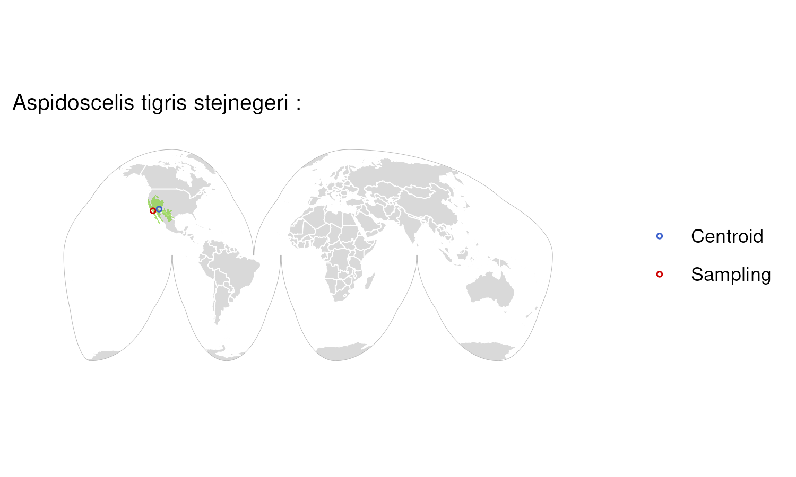

### Athene noctua

**Common Name:** little owl\
**Biosample:** SAMEA114594456\
**Assembly Accession:** GCA_965140245.1\
**Taxon:** Birds\
**Priority:** 6\
**Flags:** —

### Aulostomus maculatus

**Common Name:** West Atlantic trumpetfish\
**Biosample:** SAMN43082348\
**Assembly Accession:** GCA_048301465.1\
**Taxon:** Fishes\
**Priority:** 6\
**Flags:** —

### Aythya ferina

**Common Name:** common pochard\
**Biosample:** SAMEA112468034\
**Assembly Accession:** GCA_964211825.1\
**Taxon:** Birds\
**Priority:** 6\
**Flags:** —

### Aythya fuligula

**Common Name:** tufted duck\
**Biosample:** SAMN12621346\
**Assembly Accession:** GCA_009819795.1\
**Taxon:** Birds\
**Priority:** 6\
**Flags:** —

### Aythya marila

**Common Name:** greater scaup\
**Biosample:** SAMEA115433010\
**Assembly Accession:** GCA_965140915.1\
**Taxon:** Birds\
**Priority:** 6\
**Flags:** —

### Balaenoptera acutorostrata

**Common Name:** common minke whale\
**Biosample:** SAMEA111380540\
**Assembly Accession:** GCA_949987535.1\
**Taxon:** Mammals\
**Priority:** 6\
**Flags:** —

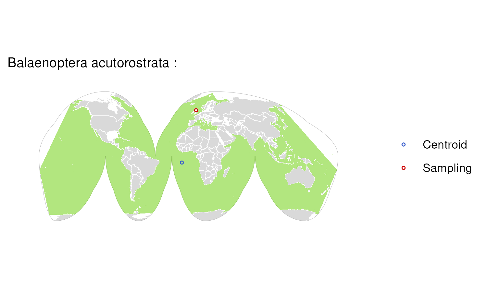

### Balaenoptera borealis

**Common Name:** sei whale\
**Biosample:** SAMEA114493134\
**Assembly Accession:** GCA_965194805.1\
**Taxon:** Mammals\
**Priority:** 6\
**Flags:** —

### Balaenoptera musculus

**Common Name:** blue whale\
**Biosample:** SAMN12287136\
**Assembly Accession:** GCA_009873245.3\
**Taxon:** Mammals\
**Priority:** 6\
**Flags:** —

### Balaenoptera physalus

**Common Name:** finback whale\
**Biosample:** SAMEA114493136\
**Assembly Accession:** GCA_965194825.1\
**Taxon:** Mammals\
**Priority:** 6\
**Flags:** —

### Balaenoptera ricei

**Common Name:** Rice’s whale\
**Biosample:** SAMN32629060\
**Assembly Accession:** GCA_028023285.1\
**Taxon:** Mammals\
**Priority:** 6\
**Flags:** —

### Balanoglossus misakiensis

**Common Name:** acorn worm\
**Biosample:** SAMN40579982\
**Assembly Accession:** GCA_040954625.2\
**Taxon:** Invertebrates\
**Priority:** 6\
**Flags:** Missing range raster

### Balearica regulorum gibbericeps

**Common Name:** grey crowned-crane\
**Biosample:** SAMN12615749\
**Assembly Accession:** GCA_011004875.1\
**Taxon:** Birds\
**Priority:** 6\
**Flags:** Missing range raster · Zoo/Aquarium sample

### Barbatula barbatula

**Common Name:** stone loach\
**Biosample:** SAMEA11296540\
**Assembly Accession:** GCA_947034865.1\
**Taxon:** Fishes\
**Priority:** 6\
**Flags:** —

### Barbus barbus

**Common Name:** barbel\
**Biosample:** SAMEA13335783\
**Assembly Accession:** GCA_936440315.1\
**Taxon:** Fishes\
**Priority:** 6\
**Flags:** —

### Blennius ocellaris

**Common Name:** butterfly blenny\
**Biosample:** SAMEA112788961\
**Assembly Accession:** GCA_963422515.1\
**Taxon:** Fishes\
**Priority:** 6\
**Flags:** —

### Bombina bombina

**Common Name:** European fire-bellied toad\
**Biosample:** SAMN32378350\
**Assembly Accession:** GCA_027579735.1\
**Taxon:** Amphibians\
**Priority:** 6\
**Flags:** —

### Bombina variegata

**Common Name:** yellow-bellied toad\
**Biosample:** SAMEA112651403\
**Assembly Accession:** GCA_964205295.1\
**Taxon:** Amphibians\
**Priority:** 6\
**Flags:** —

### Borostomias antarcticus

**Common Name:** large-eye snaggletooth\
**Biosample:** SAMEA8748812\
**Assembly Accession:** GCA_949987555.1\
**Taxon:** Fishes\
**Priority:** 6\
**Flags:** —

### Bradypodion pumilum

**Common Name:** Cape dwarf chameleon\
**Biosample:** SAMN35825189\
**Assembly Accession:** GCA_047715975.1\
**Taxon:** Reptiles\
**Priority:** 6\
**Flags:** —

### Branchiostoma lanceolatum

**Common Name:** European lancelet\
**Biosample:** SAMN38372375\
**Assembly Accession:** GCA_035083965.1\
**Taxon:** Invertebrates\
**Priority:** 6\
**Flags:** Missing range raster

### Branta canadensis

**Common Name:** Canada goose\
**Biosample:** SAMEA113398965\
**Assembly Accession:** GCA_965231335.1\
**Taxon:** Birds\
**Priority:** 6\
**Flags:** —

### Bucephala clangula

**Common Name:** common goldeneye\
**Biosample:** SAMEA112468123\
**Assembly Accession:** GCA_964059595.1\
**Taxon:** Birds\
**Priority:** 6\
**Flags:** —

### Bucorvus abyssinicus

**Common Name:** Abyssinian ground hornbill\
**Biosample:** SAMN12614799\
**Assembly Accession:** GCA_009769605.1\
**Taxon:** Birds\
**Priority:** 6\
**Flags:** Zoo/Aquarium sample

**Biosample provider:** Copenhagen Zoo, Denmark\
**Collected by:** Mads Bertelsen\
**Biosample comments:** The Abyssinian ground hornbill (Bucorvus abyssinicus) is found in the northern sub-Sahara Africa, in savanna and sub-desert scrub areas. It large beak that take three years to develop, and makes a deep booming uh-uh sounds, which some villages or people imitate and base songs off of. This sample was collected by Mads Bertelsen from a female that lived at the Copenhagen Zoo in Denmark, and procured by Tom Gilbert to generate a chromosome level reference assembly as part of the G10K-VGP and B10K Projects.\
**Location:** Denmark: Copenhagen Zoo

### Bufo bufo

**Common Name:** European toad\
**Biosample:** SAMEA7521636\
**Assembly Accession:** GCA_905171765.1\
**Taxon:** Amphibians\
**Priority:** 6\
**Flags:** —

### Buteo buteo

**Common Name:** common buzzard\
**Biosample:** SAMEA114594453\
**Assembly Accession:** GCA_964188355.1\
**Taxon:** Birds\
**Priority:** 6\
**Flags:** —

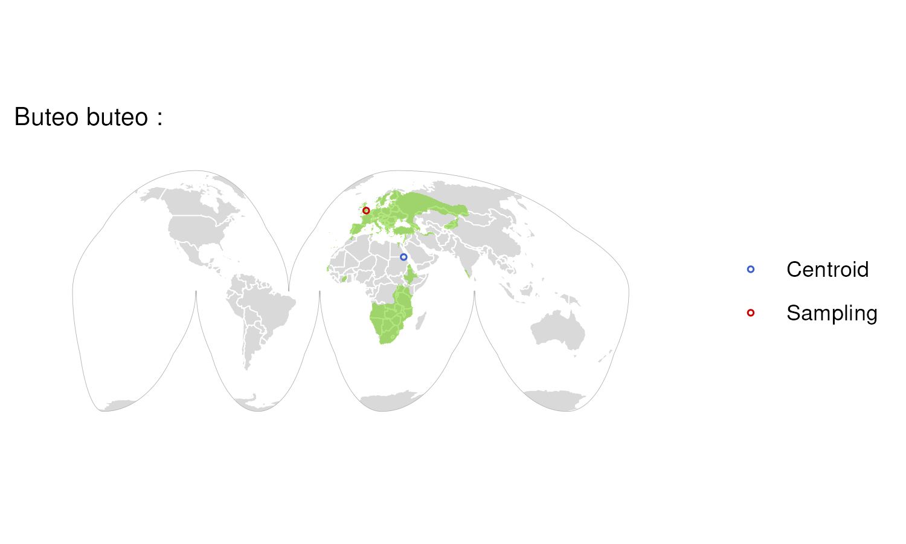

### Caesio teres

**Common Name:** yellow and blueback fusilier\
**Biosample:** SAMN41769331\
**Assembly Accession:** GCA_048129055.1\
**Taxon:** Fishes\
**Priority:** 6\
**Flags:** —

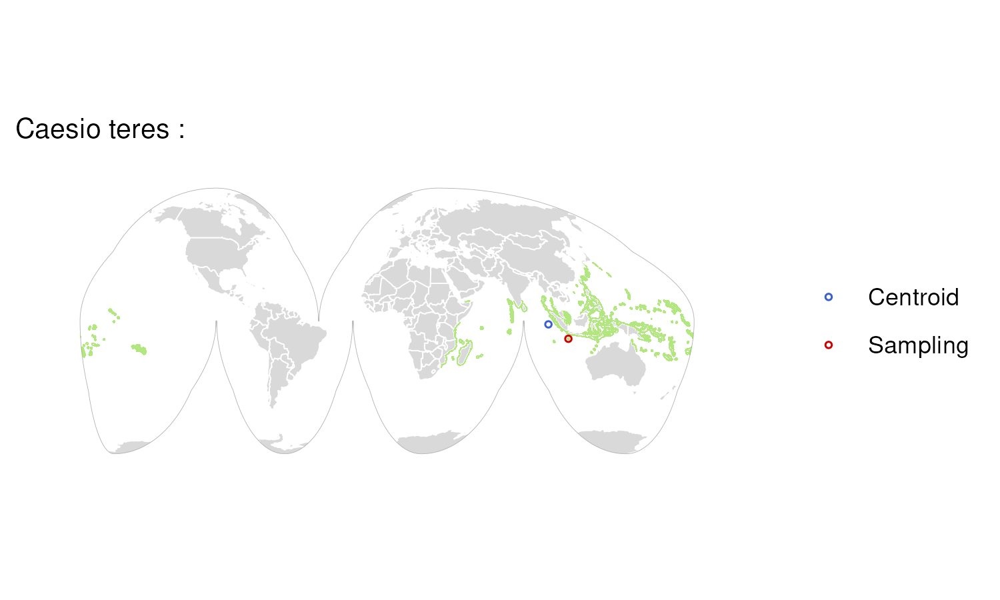

### Callospermophilus lateralis

**Common Name:** golden-mantled ground squirrel\
**Biosample:** SAMN47326584\
**Assembly Accession:** GCA_048772815.1\
**Taxon:** Mammals\
**Priority:** 6\
**Flags:** —

### Caloenas nicobarica

**Common Name:** Nicobar pigeon\
**Biosample:** SAMN39256628\
**Assembly Accession:** GCA_036013445.1\
**Taxon:** Birds\
**Priority:** 6\
**Flags:** Zoo/Aquarium sample

**Biosample provider:** Wildlife Conservation Society\
**Collected by:** Charles Alex\
**Biosample comments:** The Nicobar pigeon or Nicobar dove (Caloenas nicobarica) is a bird found on small islands and in coastal regions from the Andaman and Nicobar Islands, India, east through the Indonesian Archipelago, to the Solomons and Palau. It is the only living member of the genus Caloenas alongside and is the closest living relative of the extinct dodo bird (modified from Wikipedia entry). This sample is from a female collected by Charles Alex at the Bronx Zoo, coordinated by Beth Shapiro and Kathleen Horan, and supported by Colossal BioSciences, to be used to generate a high-quality reference genome for the Vertebrate Genomes Project (VGP) and Colossal’s de-extinction projects. Sequencing and genome assembly were conducted at the Vertebrate Genomes Lab (VGL) at the Rockefeller University, led by Erich D. Jarvis, Giulio Formenti, and Jennifer Balacco.\
**Location:** USA: Bronx Zoo, New York

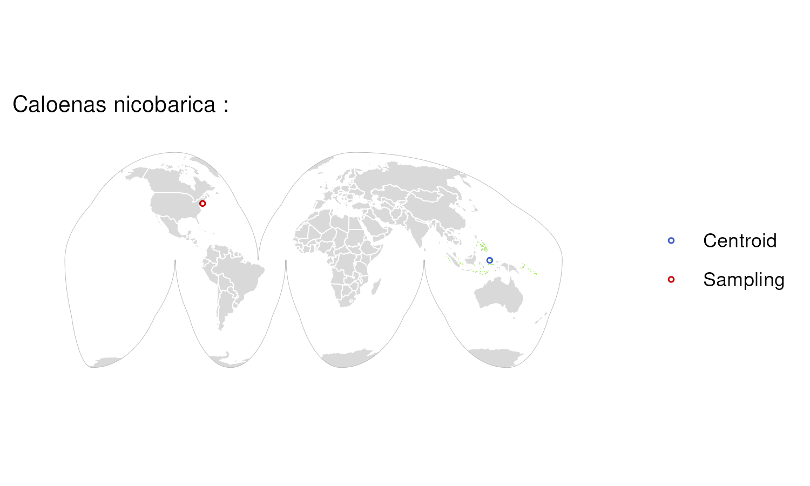

### Calonectris borealis

**Common Name:** Cory’s shearwater\
**Biosample:** SAMEA114294356\
**Assembly Accession:** GCA_964195595.2\
**Taxon:** Birds\
**Priority:** 6\
**Flags:** —

### Caprimulgus europaeus

**Common Name:** Eurasian nightjar\
**Biosample:** SAMEA7524394\
**Assembly Accession:** GCA_907165065.1\
**Taxon:** Birds\
**Priority:** 6\
**Flags:** —

### Carassius carassius

**Common Name:** common carp\
**Biosample:** SAMEA11296534\
**Assembly Accession:** GCA_963082965.1\
**Taxon:** Fishes\
**Priority:** 6\
**Flags:** —

### Carcharodon carcharias

**Common Name:** great white shark\
**Biosample:** SAMN12629504\
**Assembly Accession:** GCA_017639515.1\
**Taxon:** Fishes\
**Priority:** 6\
**Flags:** —

### Caretta caretta

**Common Name:** loggerhead sea turtle\
**Biosample:** SAMN46282778\
**Assembly Accession:** GCA_965140235.1\
**Taxon:** Reptiles\
**Priority:** 6\
**Flags:** —

### Cariama cristata

**Common Name:** red-legged seriema\
**Biosample:** SAMN12614807\
**Assembly Accession:** GCA_009819825.1\
**Taxon:** Birds\
**Priority:** 6\
**Flags:** Zoo/Aquarium sample

**Biosample provider:** Copenhagen Zoo, Denmark\
**Collected by:** Mads Bertelsen\
**Biosample comments:** The Red-legged Seriema (Cariama cristata) is a predatory terrestial bird in the Cariamidae family. It is found in the grasslands of Brazil, south of the Amazon to Uruguay and northern Argentina. The Red-legged Seriema has a song described to sound like a cross between a bark of a young dog and a clucking of turkeys (description from B10K Avian Phylgenomics Project <http://gigadb.org/dataset/101018>). This sample was collected by Mads Bertelsen from a female that lived at the Copenhagen Zoo in Denmark, originally in Holland, and was procured by Tom Gilbert to be used to generate a chromosome level reference assembly as part of the G10K-VGP and B10K Projects.\
**Location:** Denmark: Copenhagen Zoo

### Castor canadensis

**Common Name:** North American beaver\
**Biosample:** SAMN45812786\
**Assembly Accession:** GCA_047511655.1\
**Taxon:** Mammals\
**Priority:** 6\
**Flags:** —

### Catharus ustulatus

**Common Name:** Swainson’s thrush\
**Biosample:** SAMN12618602\
**Assembly Accession:** GCA_009819885.2\
**Taxon:** Birds\
**Priority:** 6\
**Flags:** —

### Centroberyx gerrardi

**Common Name:** bight redfish\
**Biosample:** SAMN41769328\
**Assembly Accession:** GCA_048128805.1\
**Taxon:** Fishes\
**Priority:** 6\
**Flags:** Missing range raster

### Cervus elaphus

**Common Name:** red deer\
**Biosample:** SAMEA7523520\
**Assembly Accession:** GCA_910594005.1\
**Taxon:** Mammals\
**Priority:** 6\
**Flags:** —

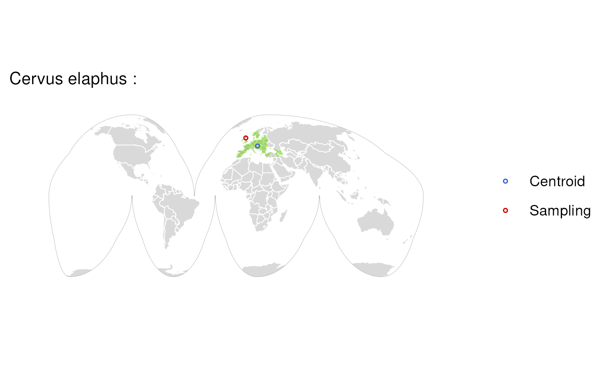

### Cetorhinus maximus

**Common Name:** basking shark\
**Biosample:** SAMEA113902670\
**Assembly Accession:** GCA_964194155.1\
**Taxon:** Fishes\
**Priority:** 6\
**Flags:** —

### Chaetodon trifascialis

**Common Name:** chevron butterflyfish\
**Biosample:** SAMN41253346\
**Assembly Accession:** GCA_039877785.1\
**Taxon:** Fishes\
**Priority:** 6\
**Flags:** —

### Chelmon rostratus

**Common Name:** copperband butterflyfish\
**Biosample:** SAMN12623620\
**Assembly Accession:** GCA_017976325.1\
**Taxon:** Fishes\
**Priority:** 6\
**Flags:** —

### Chelon labrosus

**Common Name:** thicklip grey mullet\
**Biosample:** SAMEA111562027\
**Assembly Accession:** GCA_963514085.1\
**Taxon:** Fishes\
**Priority:** 6\
**Flags:** —

### Chelonia mydas

**Common Name:** green sea turtle\
**Biosample:** SAMN12612360\
**Assembly Accession:** GCA_015237465.2\
**Taxon:** Reptiles\
**Priority:** 6\
**Flags:** —

### Chionomys nivalis

**Common Name:** European snow vole\
**Biosample:** SAMEA13217622\
**Assembly Accession:** GCA_950005125.1\
**Taxon:** Mammals\
**Priority:** 6\
**Flags:** —

### Chiroxiphia lanceolata

**Common Name:** lanced-tailed manakin\
**Biosample:** SAMN12620979\
**Assembly Accession:** GCA_009829145.1\
**Taxon:** Birds\
**Priority:** 6\
**Flags:** —

### Chlamydotis macqueenii

**Common Name:** MacQueen’s bustard\
**Biosample:** SAMN39296383\
**Assembly Accession:** GCA_036417535.1\
**Taxon:** Birds\
**Priority:** 6\
**Flags:** —

### Choerodon schoenleinii

**Common Name:** blackspot tuskfish\
**Biosample:** SAMN46014618\
**Assembly Accession:** GCA_047301625.1\
**Taxon:** Fishes\
**Priority:** 6\
**Flags:** Missing range raster

### Chroicocephalus ridibundus

**Common Name:** black-headed gull\
**Biosample:** SAMEA112468038\
**Assembly Accession:** GCA_963924245.1\
**Taxon:** Birds\
**Priority:** 6\
**Flags:** —

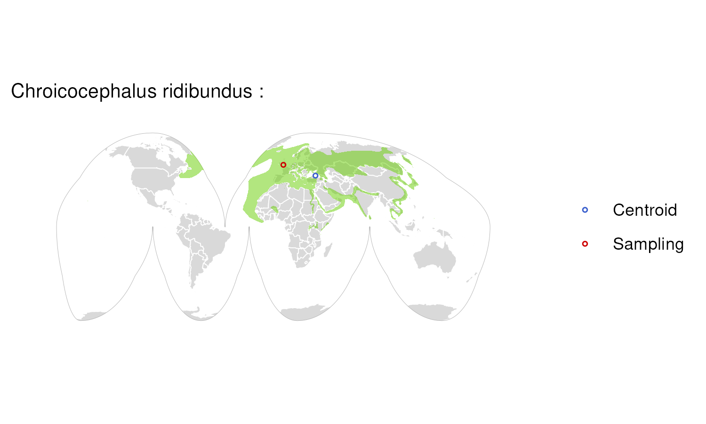

### Ciconia maguari

**Common Name:** Maguari stork\
**Biosample:** SAMN18353822\
**Assembly Accession:** GCA_017639555.1\
**Taxon:** Birds\
**Priority:** 6\
**Flags:** —

### Cinclus cinclus

**Common Name:** white-throated dipper\
**Biosample:** SAMEA9679959\
**Assembly Accession:** GCA_963662255.1\
**Taxon:** Birds\
**Priority:** 6\
**Flags:** —

### Clangula hyemalis

**Common Name:** long-tailed duck\
**Biosample:** SAMEA112468035\
**Assembly Accession:** GCA_963989345.1\
**Taxon:** Birds\
**Priority:** 6\
**Flags:** —

### Clavelina lepadiformis

**Common Name:** light-bulb sea squirt\
**Biosample:** SAMEA7536527\
**Assembly Accession:** GCA_947623445.1\
**Taxon:** Invertebrates\
**Priority:** 6\
**Flags:** Missing range raster

### Coilia mystus

**Common Name:** Osbeck’s grenadier anchovy\
**Biosample:** SAMN46980313\
**Assembly Accession:** GCA_048544225.1\
**Taxon:** Fishes\
**Priority:** 6\
**Flags:** —

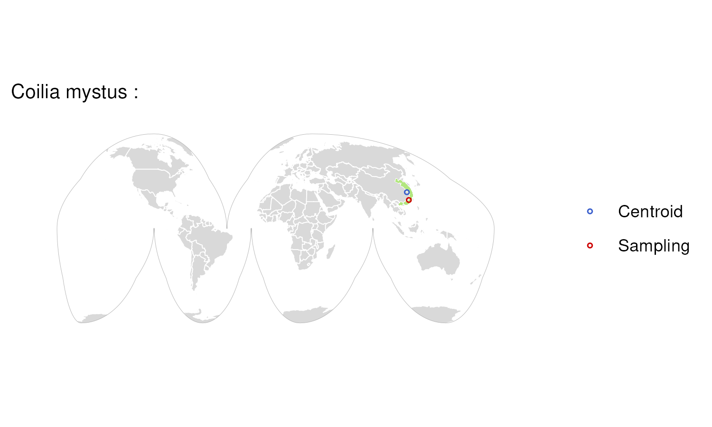

### Colius striatus

**Common Name:** speckled mousebird\
**Biosample:** SAMN33339572\
**Assembly Accession:** GCA_028858725.2\
**Taxon:** Birds\
**Priority:** 6\
**Flags:** Zoo/Aquarium sample

**Biosample provider:** University of Copenhagen, and Copenhagen Zoo\
**Collected by:** Mads Bertelsen\
**Biosample comments:** The speckled mousebird (Colius striatus) is the largest species of mousebird, as well as one of the most common. It is found throughout most of Central, Eastern and Southern Africa. They are conspicuously social birds, feeding together and engaging in mutual preening (from Wikipedia entry). This sample from a female in the Copenhagen Zoo, in Denmark, was procured by Mads Bertelsen, and coordinated by Tom Gilbert to be used to generate a high-quality reference genome for the Vertebrate Genomes Project (VGP). Sequencing and genome assembly were conducted at the Vertebrate Genomes Lab (VGL) at the Rockefeller University, led by Olivier Fedrigo and Erich D. Jarvis, with funding support from Tom Gilbert and Jarvis.\
**Location:** Denmark: Copenhagen Zoo

### Coloeus monedula

**Common Name:** Western jackdaw\
**Biosample:** SAMEA115433023\
**Assembly Accession:** GCA_965178545.1\
**Taxon:** Birds\
**Priority:** 6\
**Flags:** —

### Conger conger

**Common Name:** European conger\
**Biosample:** SAMEA12219431\
**Assembly Accession:** GCA_963514075.1\
**Taxon:** Fishes\
**Priority:** 6\
**Flags:** —

### Corella eumyota

**Common Name:** Orange-tipped sea squirt\
**Biosample:** SAMEA7536466\
**Assembly Accession:** GCA_963082875.1\
**Taxon:** Invertebrates\
**Priority:** 6\
**Flags:** Missing range raster

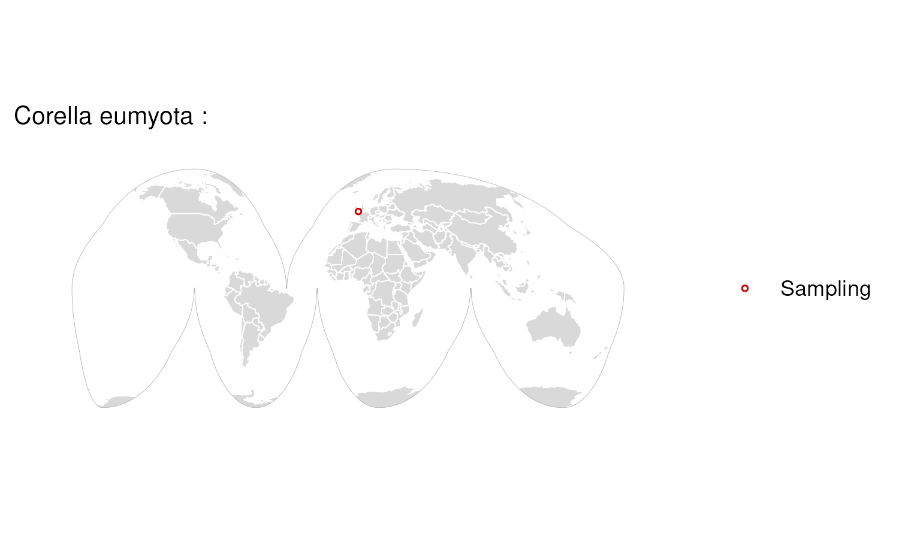

### Corvus moneduloides

**Common Name:** New Caledonian crow\
**Biosample:** SAMN12368441\
**Assembly Accession:** GCA_009650955.1\
**Taxon:** Birds\
**Priority:** 6\
**Flags:** —

### Corynorhinus townsendii

**Common Name:** Townsend’s big-eared bat\
**Biosample:** SAMN31536067\
**Assembly Accession:** GCA_026230055.1\
**Taxon:** Mammals\
**Priority:** 6\
**Flags:** —

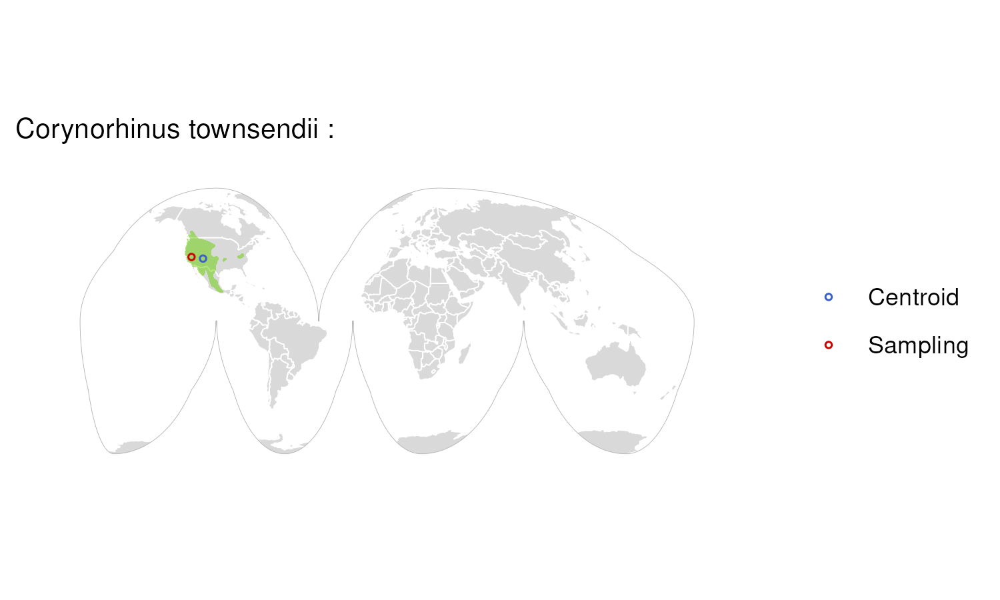

### Cristiceps australis

**Common Name:** crested weedfish\
**Biosample:** SAMN40589650\
**Assembly Accession:** GCA_049082185.1\
**Taxon:** Fishes\
**Priority:** 6\
**Flags:** —

### Ctenodactylus gundi

**Common Name:** common gundi\
**Biosample:** SAMN47326412\
**Assembly Accession:** GCA_048771875.1\
**Taxon:** Mammals\
**Priority:** 6\
**Flags:** —

### Cuculus canorus

**Common Name:** common cuckoo\
**Biosample:** SAMN12629508\
**Assembly Accession:** GCA_017976375.1\
**Taxon:** Birds\
**Priority:** 6\
**Flags:** —

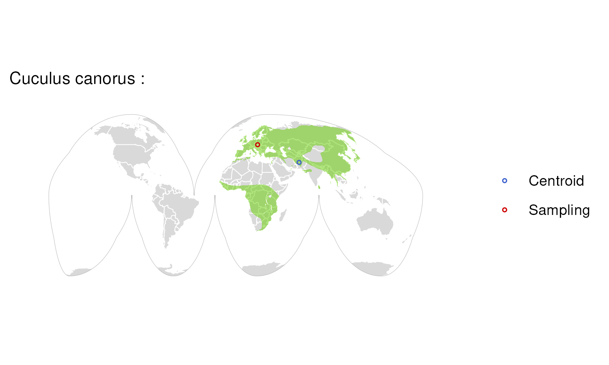

### Cyanocitta cristata

**Common Name:** blue jay\
**Biosample:** SAMN44574712\
**Assembly Accession:** GCA_046129655.1\
**Taxon:** Birds\
**Priority:** 6\
**Flags:** —

### Cyclopterus lumpus

**Common Name:** lumpfish\
**Biosample:** SAMN12629502\
**Assembly Accession:** GCA_009769545.1\
**Taxon:** Fishes\
**Priority:** 6\
**Flags:** Missing range raster

### Cyclura pinguis

**Common Name:** stout iguana\
**Biosample:** SAMN35151422\
**Assembly Accession:** GCA_030412105.1\
**Taxon:** Reptiles\
**Priority:** 6\
**Flags:** Zoo/Aquarium sample

**Biosample provider:** Oliver Ryder, San Diego Zoo Global\
**Collected by:** —\
**Biosample comments:** Stout iguana (Cyclura pinguis) is a critically endangered species of lizard of the genus Cyclura belonging to the family Iguanidae. The species can be found exclusively in Anegada and Guana islands of the British Virgin Islands. Historically, it inhabited the islands of Puerto Rico and Saint Thomas; however, the animal’s original range has been greatly diminished over prehistory (from Wikipedia). This sample was collected from an adult male born in the San Diego Zoo, coordinated by Oliver Ryder and Cynthia Steiner, and used to create at high-quality reference genome for the Vertebrate Genomes Project (VGP). Sequencing and genome assembly were conducted at the Vertebrate Genomes Lab (VGL) at the Rockefeller University, led by Olivier Fedrigo and Erich D. Jarvis, with funding support from HHMI.\
**Location:** USA: San Diego Zoo, San Diego

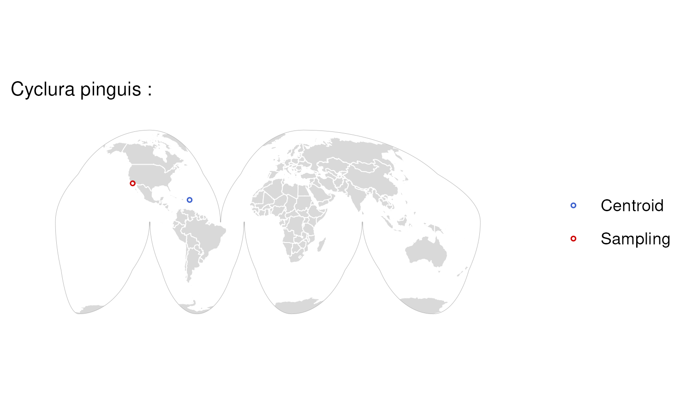

### Cygnus columbianus

**Common Name:** tundra swan\
**Biosample:** SAMEA112468031\
**Assembly Accession:** GCA_965151615.1\
**Taxon:** Birds\
**Priority:** 6\
**Flags:** —

### Cygnus olor

**Common Name:** mute swan\
**Biosample:** SAMN12621369\
**Assembly Accession:** GCA_009769625.2\
**Taxon:** Birds\
**Priority:** 6\
**Flags:** —

### Cynocephalus volans

**Common Name:** Philippine flying lemur\
**Biosample:** SAMN32206947\
**Assembly Accession:** GCA_027409185.1\
**Taxon:** Mammals\
**Priority:** 6\
**Flags:** —

### Cyprinella venusta

**Common Name:** blacktail shiner\
**Biosample:** SAMN40647018\
**Assembly Accession:** GCA_038024135.1\
**Taxon:** Fishes\
**Priority:** 6\
**Flags:** —

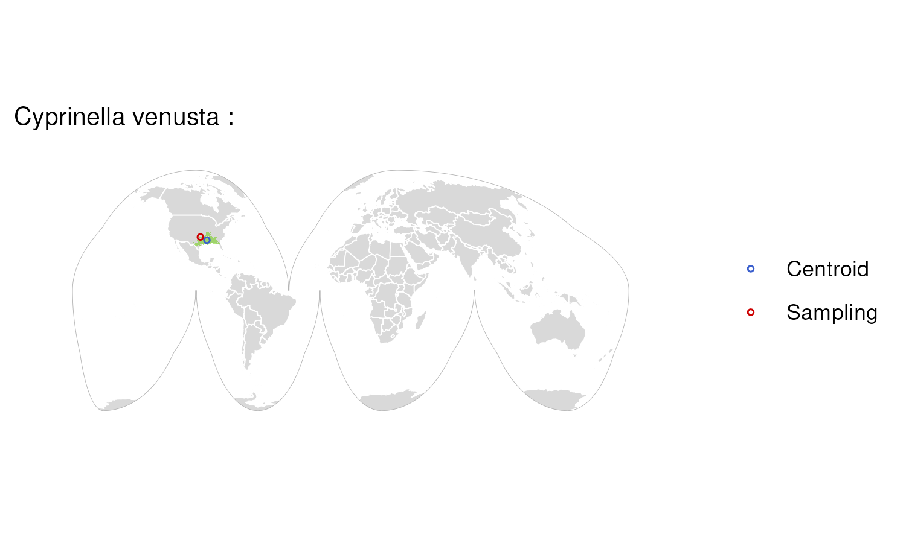

### Danio rerio

**Common Name:** zebrafish\
**Biosample:** SAMEA14088276\
**Assembly Accession:** GCA_944039275.1\
**Taxon:** Fishes\
**Priority:** 6\
**Flags:** Missing range raster

### Dasypus novemcinctus

**Common Name:** nine-banded armadillo\
**Biosample:** SAMN32738980\
**Assembly Accession:** GCA_030445035.2\
**Taxon:** Mammals\
**Priority:** 6\
**Flags:** —

### Delphinus delphis

**Common Name:** saddleback dolphin\
**Biosample:** SAMEA111380534\
**Assembly Accession:** GCA_949987515.2\
**Taxon:** Mammals\
**Priority:** 6\
**Flags:** —

### Dermochelys coriacea

**Common Name:** leatherback sea turtle\
**Biosample:** SAMN12629498\
**Assembly Accession:** GCA_009764565.4\
**Taxon:** Reptiles\
**Priority:** 6\
**Flags:** —

### Desmodus rotundus

**Common Name:** common vampire bat\
**Biosample:** SAMN24116476\
**Assembly Accession:** GCA_022682495.2\
**Taxon:** Mammals\
**Priority:** 6\
**Flags:** —

### Diretmus argenteus

**Common Name:** silver spinyfin\
**Biosample:** SAMN47248252\
**Assembly Accession:** GCA_048569125.1\
**Taxon:** Fishes\
**Priority:** 6\
**Flags:** —

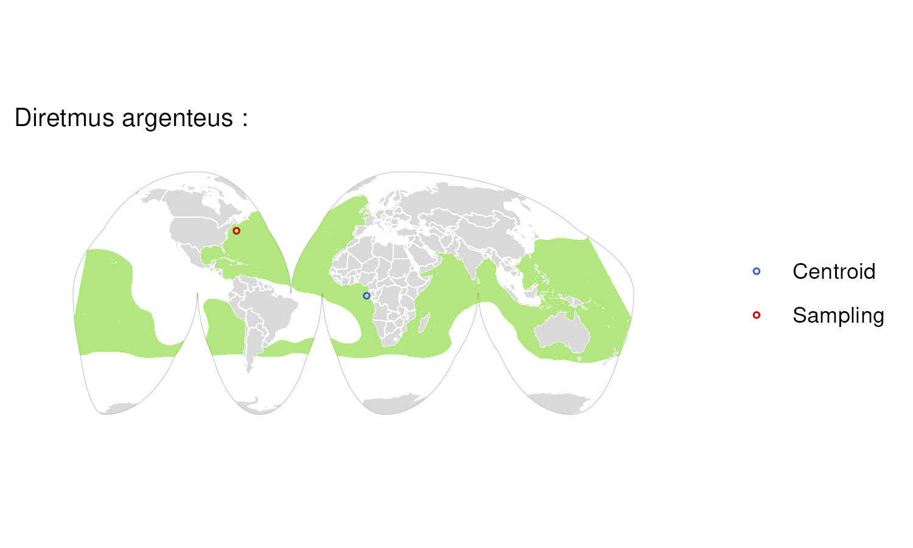

### Discoglossus pictus

**Common Name:** painted frog\
**Biosample:** SAMN32227109\
**Assembly Accession:** GCA_027410445.1\
**Taxon:** Amphibians\
**Priority:** 6\
**Flags:** —

### Dixiphia pipra

**Common Name:** white-crowned manakin\
**Biosample:** SAMN32739894\
**Assembly Accession:** GCA_036250125.1\
**Taxon:** Birds\
**Priority:** 6\
**Flags:** —

### Doryrhina cyclops

**Common Name:** Cyclops roundleaf bat\
**Biosample:** SAMN33372470\
**Assembly Accession:** GCA_043880285.1\
**Taxon:** Mammals\
**Priority:** 6\
**Flags:** —

### Dromaius novaehollandiae

**Common Name:** emu\
**Biosample:** SAMN39262816\
**Assembly Accession:** GCA_036370855.1\
**Taxon:** Birds\
**Priority:** 6\
**Flags:** Zoo/Aquarium sample

**Biosample provider:** World Conservation Society\
**Collected by:** Bronx Zoo Vetinarian Team\
**Biosample comments:** The emu (Dromaius novaehollandiae) is the second-tallest living bird after the ostrich, its ratite relative. It is endemic to Australia. They are soft-feathered, flightless, with long necks and legs, and can reach up to 1.9 metres (6 ft 3 in) in height (modified from Wikipedia entry). This sample of a female born in the Bronx Zoo, New York, and collected in collaboration with the World Conservation Society (WCS), coordinated by Susie Bartlett of the WCS and Erich Jarvis and Kathleen Horan of Rockefeller University, to be used to generate a high-quality reference genome assembly for the Vertebrate Genomes Project (VGP). Sequencing and genome assembly were conducted at the Vertebrate Genomes Lab (VGL) at the Rockefeller University, led by Erich D. Jarvis, Giulio Formenti, and Jennifer Balacco.\
**Location:** USA: Bronx Zoo, New York

### Dromiciops gliroides

**Common Name:** monito del montes\
**Biosample:** SAMN18857598\
**Assembly Accession:** GCA_019393635.1\
**Taxon:** Mammals\
**Priority:** 6\
**Flags:** —

### Dryobates pubescens

**Common Name:** downy woodpecker\
**Biosample:** SAMN12629497\
**Assembly Accession:** GCA_014839835.1\
**Taxon:** Birds\
**Priority:** 6\
**Flags:** —

### Dugong dugon

**Common Name:** dugong\
**Biosample:** SAMN33212336\
**Assembly Accession:** GCA_030035585.1\
**Taxon:** Mammals\
**Priority:** 6\
**Flags:** —

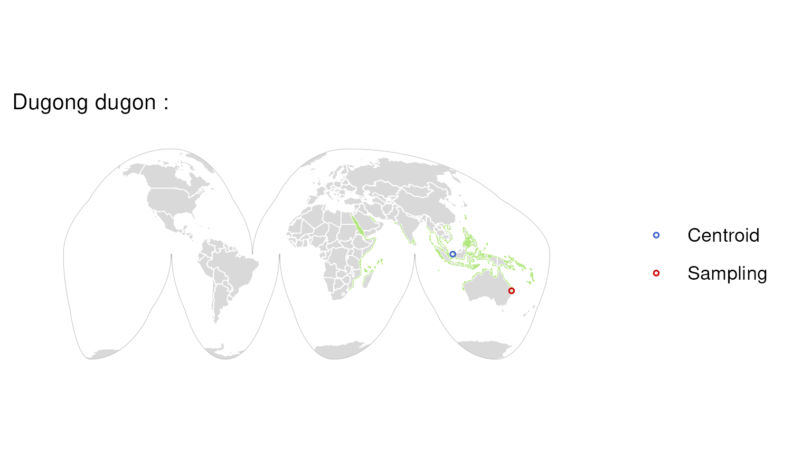

### Echiichthys vipera

**Common Name:** lesser weever\
**Biosample:** SAMEA112765695\
**Assembly Accession:** GCA_963691815.1\
**Taxon:** Fishes\
**Priority:** 6\
**Flags:** Missing range raster

### Electrona antarctica

**Common Name:** Antarctic lanternfish\
**Biosample:** SAMEA8748807\
**Assembly Accession:** GCA_951216825.1\
**Taxon:** Fishes\
**Priority:** 6\
**Flags:** —

### Elephas maximus indicus

**Common Name:** Asian elephant\
**Biosample:** SAMN29174328\
**Assembly Accession:** GCA_024166365.1\
**Taxon:** Mammals\
**Priority:** 6\
**Flags:** Zoo/Aquarium sample

**Biosample provider:** Frozen Zoo, San Diego Zoo\
**Collected by:** San Diego Zoo\
**Biosample comments:** The Indian elephant is one of the three subspecies of the Asian Elephant. It has been classified as Endangered on the IUCN realist since 1986 due to habitat loss and environmental degradation mainly caused by human activities. This assembly has been produced as part of the G10K-VGP Project, and supported by Virpi Lummaa (Professor, Ecology and Evolutionary Biology, university of Turku, Finland), Camila Mazzoni (group leader at the Leibniz Institute for Zoo and Wildlife Research, Berlin, Germany), and by Colossal Biosciences. Work was done in collaboration with Sara Ord, Eriona Hysolli, and Larissa Souza Arantes. Skin tissue was collected from a 50 years old adult male at the San Diego zoo, California (SB-218, and GAN \# 26734787; ZIMS/Species 360) and fibroblast cells were cultured by the Frozen Zoo. The sample was sequenced using the VGP 2.0 individual pipeline at the Rockefeller University Vertebrate Genome Lab, led by Olivier Fedrigo and Erich Jarvis. The primary haplotype contigs were generated from PacBio Hifi reads, scaffolded with Bionano optical maps, and Arima HiC reads. Genome was assembled by Diego De Panis. Manual curation of chromosomes and other genomic features was conducted by Nadolina Brajuka and led by Giulio Formenti. The raw data and assembly are currently under a G10K-VGP publication embargo until removed from this description, following the G10K data use policy at the following URL: <https://genome10k.soe.ucsc.edu/about/data_use_policy>\
**Location:** USA: San Diego Zoo

### Eleutherodactylus coqui

**Common Name:** coqui\
**Biosample:** SAMN39150572\
**Assembly Accession:** GCA_035609145.1\
**Taxon:** Amphibians\
**Priority:** 6\
**Flags:** —

### Elgaria multicarinata webbii

**Common Name:** Southern alligator lizard\
**Biosample:** SAMN25872353\
**Assembly Accession:** GCA_023053635.2\
**Taxon:** Reptiles\
**Priority:** 6\
**Flags:** —

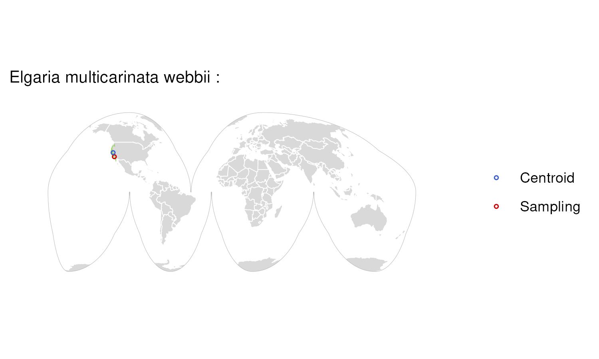

### Emys orbicularis

**Common Name:** European pond turtle\
**Biosample:** SAMN31805221\
**Assembly Accession:** GCA_028017835.1\
**Taxon:** Reptiles\
**Priority:** 6\
**Flags:** Missing range raster

### Enoplosus armatus

**Common Name:** old wife\
**Biosample:** SAMN40589647\
**Assembly Accession:** GCA_043641665.1\
**Taxon:** Fishes\
**Priority:** 6\
**Flags:** —

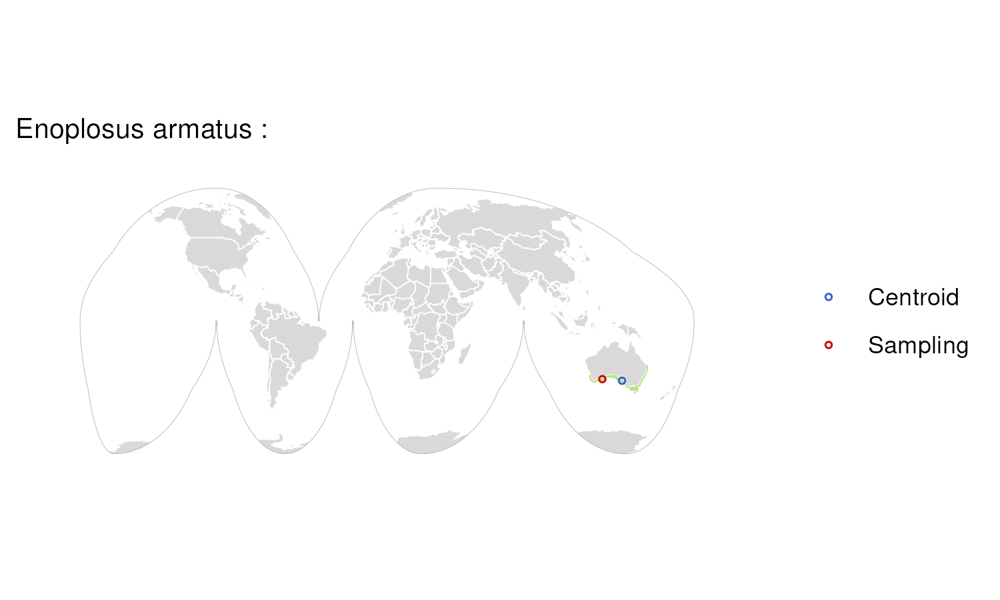

### Epinephelus rankini

**Common Name:** rankin cod\
**Biosample:** SAMN41769322\
**Assembly Accession:** GCA_048129235.1\
**Taxon:** Fishes\
**Priority:** 6\
**Flags:** —

### Eptesicus nilssonii

**Common Name:** northern bat\
**Biosample:** SAMEA14098186\
**Assembly Accession:** GCA_951640355.1\
**Taxon:** Mammals\
**Priority:** 6\
**Flags:** —

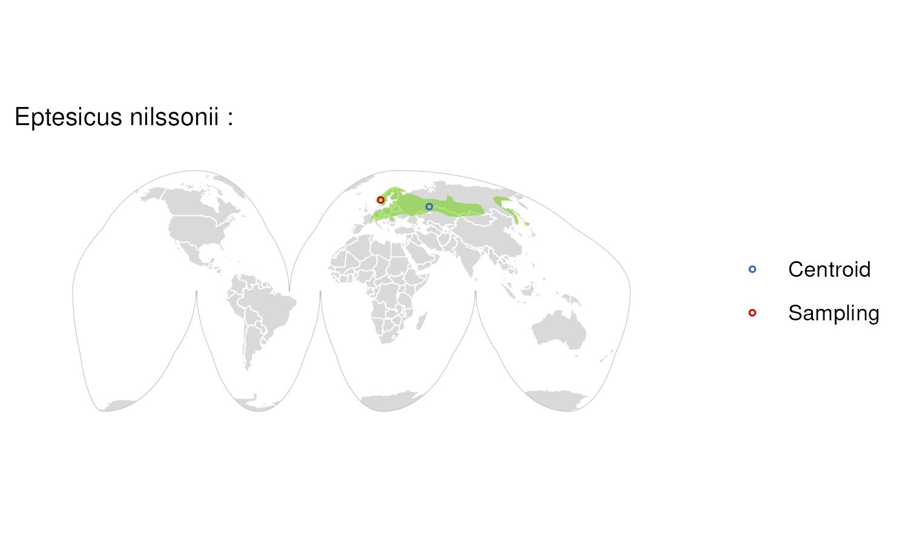

### Erethizon dorsatum

**Common Name:** North American porcupine\
**Biosample:** SAMN32359106\
**Assembly Accession:** GCA_028451465.1\
**Taxon:** Mammals\
**Priority:** 6\
**Flags:** —

### Eretmochelys imbricata

**Common Name:** Hawksbill sea turtle\
**Biosample:** SAMN46283036\
**Assembly Accession:** GCA_965152235.1\
**Taxon:** Reptiles\
**Priority:** 6\
**Flags:** —

### Erinaceus europaeus

**Common Name:** European hedgehog\
**Biosample:** SAMEA13207416\
**Assembly Accession:** GCA_950295315.1\
**Taxon:** Mammals\
**Priority:** 6\
**Flags:** —

### Erythrolamprus reginae

**Common Name:** royal ground snake\
**Biosample:** SAMN32631248\
**Assembly Accession:** GCA_031021105.1\
**Taxon:** Reptiles\
**Priority:** 6\
**Flags:** —

### Eschrichtius robustus

**Common Name:** gray whale\
**Biosample:** SAMN32629250\
**Assembly Accession:** GCA_028021215.1\
**Taxon:** Mammals\
**Priority:** 6\
**Flags:** —

### Esox lucius

**Common Name:** Northern pike\
**Biosample:** SAMN12623624\
**Assembly Accession:** GCA_011004845.1\
**Taxon:** Fishes\
**Priority:** 6\
**Flags:** —

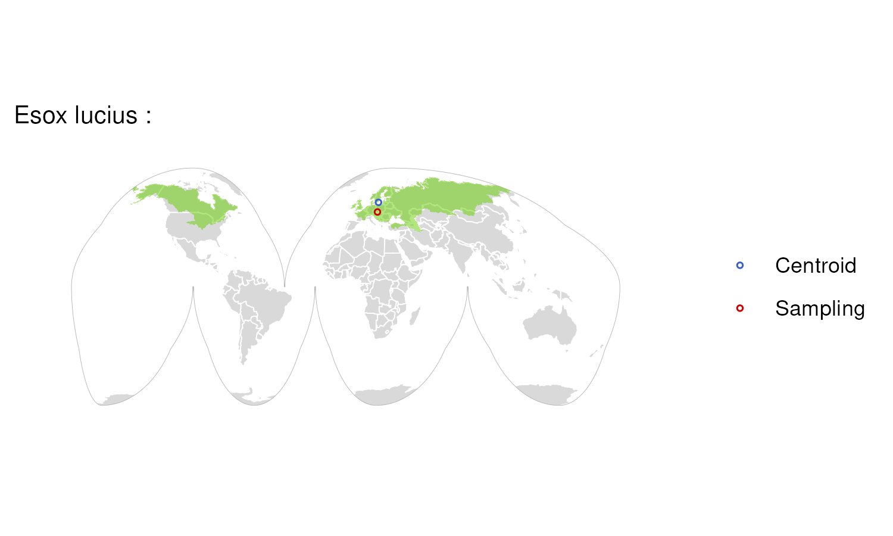

### Eubalaena glacialis

**Common Name:** North Atlantic right whale\
**Biosample:** SAMN32746534\
**Assembly Accession:** GCA_028564815.2\
**Taxon:** Mammals\
**Priority:** 6\
**Flags:** —

### Eudromia elegans

**Common Name:** elegant crested tinamou\
**Biosample:** SAMN46865137\
**Assembly Accession:** GCA_047922985.1\
**Taxon:** Birds\
**Priority:** 6\
**Flags:** Zoo/Aquarium sample

**Biosample provider:** Christina Hvilsom, Copenhagen Zoo\
**Collected by:** Juliana Andrea Berner, Copenhagen Zoo\
**Biosample comments:** —\
**Location:** Denmark: Copenhagen, Copenhagen Zoo

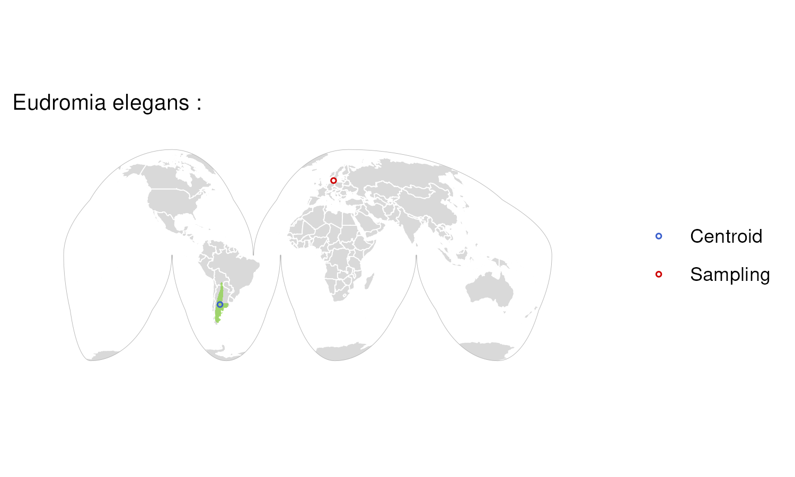

### Euleptes europaea

**Common Name:** European leaf-toed gecko\
**Biosample:** SAMN32622440\
**Assembly Accession:** GCA_029931775.1\
**Taxon:** Reptiles\
**Priority:** 6\
**Flags:** —

### Eutrigla gurnardus

**Common Name:** grey gurnard\
**Biosample:** SAMEA111562159\
**Assembly Accession:** GCA_963514095.1\
**Taxon:** Fishes\
**Priority:** 6\
**Flags:** Missing range raster

### Falco cherrug

**Common Name:** saker falcon\
**Biosample:** SAMN28688204\
**Assembly Accession:** GCA_023634085.1\
**Taxon:** Birds\
**Priority:** 6\
**Flags:** —

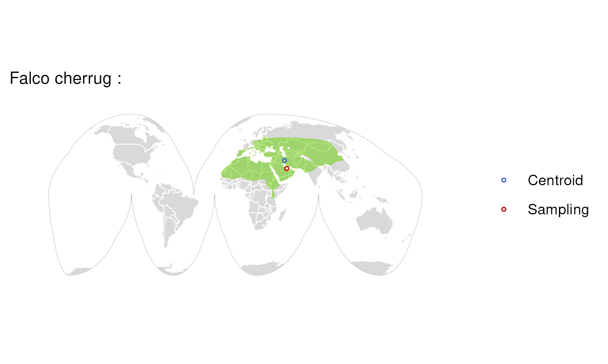

### Falco naumanni

**Common Name:** lesser kestrel\
**Biosample:** SAMN16870685\
**Assembly Accession:** GCA_017639655.1\
**Taxon:** Birds\
**Priority:** 6\
**Flags:** —

### Falco peregrinus

**Common Name:** peregrine falcon\
**Biosample:** SAMN28688290\
**Assembly Accession:** GCA_023634155.1\
**Taxon:** Birds\
**Priority:** 6\
**Flags:** —

### Falco punctatus

**Common Name:** Mauritius kestrel\
**Biosample:** SAMEA14356472\
**Assembly Accession:** GCA_963210335.1\
**Taxon:** Birds\
**Priority:** 6\
**Flags:** —

### Fringilla coelebs

**Common Name:** common chaffinch\
**Biosample:** SAMEA9359753\
**Assembly Accession:** GCA_963513975.1\
**Taxon:** Birds\
**Priority:** 6\
**Flags:** —

### Fundulus diaphanus

**Common Name:** banded killifish\
**Biosample:** SAMN39736529\
**Assembly Accession:** GCA_037039145.1\
**Taxon:** Fishes\
**Priority:** 6\
**Flags:** Missing range raster

### Gallinula chloropus

**Common Name:** common moorhen\
**Biosample:** SAMEA113398958\
**Assembly Accession:** GCA_964237585.1\
**Taxon:** Birds\
**Priority:** 6\
**Flags:** —

### Gasterosteus aculeatus

**Common Name:** three-spined stickleback\
**Biosample:** SAMEA11296546\
**Assembly Accession:** GCA_964276395.1\
**Taxon:** Fishes\
**Priority:** 6\
**Flags:** —

### Gastrophryne carolinensis

**Common Name:** Eastern narrow-mouthed toad\
**Biosample:** SAMN31805274\
**Assembly Accession:** GCA_027917425.1\
**Taxon:** Amphibians\
**Priority:** 6\
**Flags:** —

### Gavialis gangeticus

**Common Name:** Indian gharial\
**Biosample:** SAMN34116453\
**Assembly Accession:** GCA_030020295.1\
**Taxon:** Reptiles\
**Priority:** 6\
**Flags:** Zoo/Aquarium sample

**Biosample provider:** Oliver Ryder, San Diego Zoo, Frozen Zoo\
**Collected by:** San Diego Zoo\
**Biosample comments:** The gharial (Gavialis gangeticus) is a crocodilian in the Gavialidae family and among the longest of living crocodilians. Adult males have a distinct boss at the end of the snout, which resembles an earthenware pot known as a ghara, hence the name “gharial”. The gharial is well adapted to catching fish because of its long narrow snout and sharp interlocking teeth. (from Wikipedia entry). The gharial is endemic to India and is currently critically endangered. This sample was collected from an animal born in captivity at the San Diego Zoo, in California, USA, and coordinated and provided by Oliver Ryder, Marlys Houck, and Cynthia Steiner of the San Diego Frozen Zoo, to generate a high-quality reference genome for the Vertebrate Genomes Project (VGP). Sequencing and genome assembly were conducted at the Vertebrate Genomes Lab (VGL) at the Rockefeller University, led by Olivier Fedrigo and Erich D. Jarvis.\
**Location:** USA: San Diego Zoo, San Diego

### Geothlypis trichas

**Common Name:** common yellowthroat\
**Biosample:** SAMN12631222\
**Assembly Accession:** GCA_009764595.1\
**Taxon:** Birds\
**Priority:** 6\
**Flags:** —

### Globicephala melas

**Common Name:** long-finned pilot whale\
**Biosample:** SAMEA111380538\
**Assembly Accession:** GCA_963455315.2\
**Taxon:** Mammals\
**Priority:** 6\
**Flags:** —

### Glossophaga mutica

**Common Name:** Merriam’s long-tongued bat\
**Biosample:** SAMN40946060\
**Assembly Accession:** GCA_039655065.1\
**Taxon:** Mammals\
**Priority:** 6\
**Flags:** —

### Gobio gobio

**Common Name:** gudgeon\
**Biosample:** SAMEA11296538\
**Assembly Accession:** GCA_949357685.1\
**Taxon:** Fishes\
**Priority:** 6\
**Flags:** —

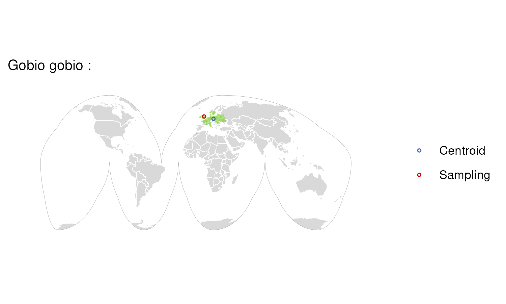

### Gobius niger

**Common Name:** black goby\
**Biosample:** SAMEA13854149\
**Assembly Accession:** GCA_951799975.1\
**Taxon:** Fishes\
**Priority:** 6\
**Flags:** —

### Grampus griseus

**Common Name:** Risso’s dolphin\
**Biosample:** SAMEA111380541\
**Assembly Accession:** GCA_964374135.1\
**Taxon:** Mammals\
**Priority:** 6\
**Flags:** —

### Grus americana

**Common Name:** whooping crane\
**Biosample:** SAMN32775697\
**Assembly Accession:** GCA_028858705.1\
**Taxon:** Birds\
**Priority:** 6\
**Flags:** —

### Guaruba guaruba

**Common Name:** golden parakeet\
**Biosample:** SAMN44514542\
**Assembly Accession:** GCA_045345405.1\
**Taxon:** Birds\
**Priority:** 6\
**Flags:** —

### Gulosus aristotelis

**Common Name:** European shag\
**Biosample:** SAMEA10059652\
**Assembly Accession:** GCA_949628215.1\
**Taxon:** Birds\
**Priority:** 6\
**Flags:** —

### Gymnoscopelus braueri

**Common Name:** Brauer’s lanternfish\
**Biosample:** SAMEA12815494\
**Assembly Accession:** GCA_963280865.1\
**Taxon:** Fishes\
**Priority:** 6\
**Flags:** —

### Gymnoscopelus microlampas

**Common Name:** minispotted lanternfish\
**Biosample:** SAMEA12815435\
**Assembly Accession:** GCA_963454915.1\
**Taxon:** Fishes\
**Priority:** 6\
**Flags:** —

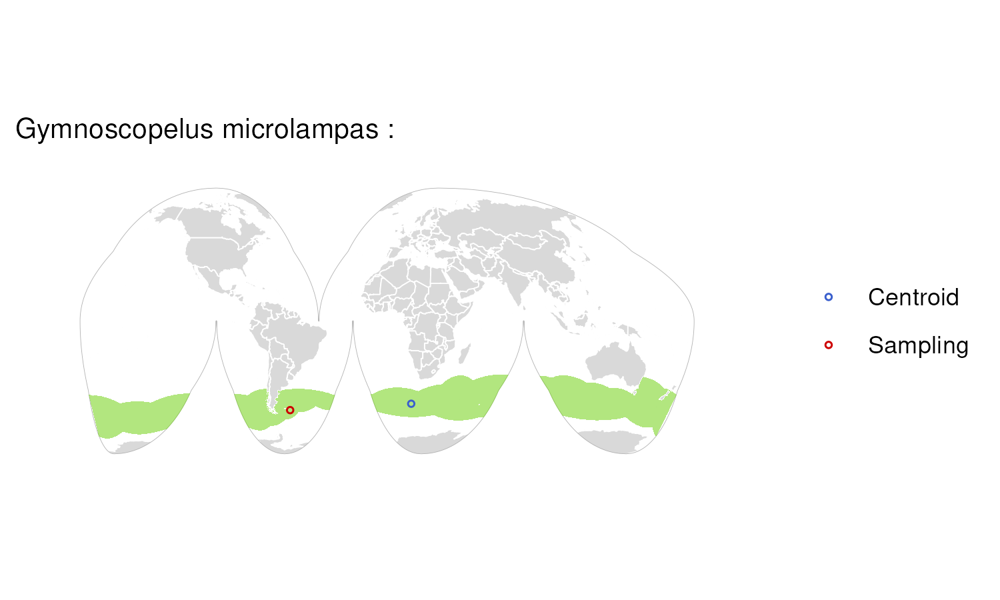

### Gypaetus barbatus

**Common Name:** bearded vulture\
**Biosample:** SAMN32256411\
**Assembly Accession:** GCA_028022735.1\
**Taxon:** Birds\
**Priority:** 6\
**Flags:** —

### Haemorhous mexicanus

**Common Name:** house finch\
**Biosample:** SAMN28453576\
**Assembly Accession:** GCA_027477595.1\
**Taxon:** Birds\
**Priority:** 6\
**Flags:** —

### Haliaeetus albicilla

**Common Name:** white-tailed eagle\
**Biosample:** SAMEA12857288\
**Assembly Accession:** GCA_947461875.1\
**Taxon:** Birds\
**Priority:** 6\
**Flags:** —

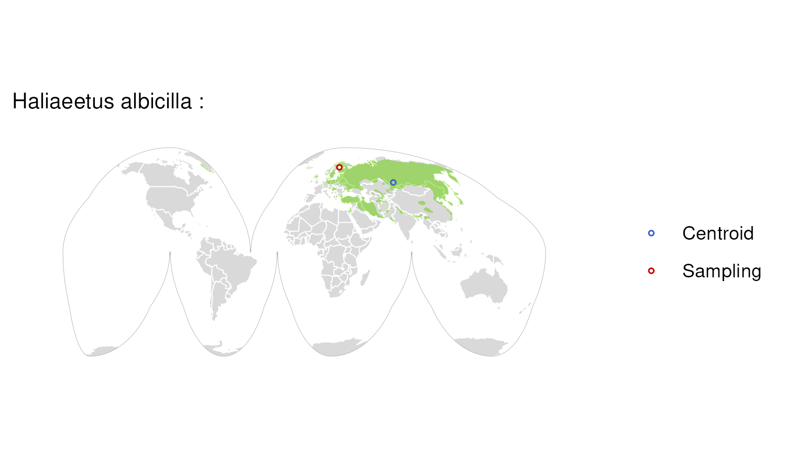

### Halichoerus grypus

**Common Name:** grey seal\
**Biosample:** SAMEA115427674\
**Assembly Accession:** GCA_964656455.1\
**Taxon:** Mammals\
**Priority:** 6\
**Flags:** —

### Harpia harpyja

**Common Name:** harpy eagle\
**Biosample:** SAMN31530492\
**Assembly Accession:** GCA_026419915.1\
**Taxon:** Birds\
**Priority:** 6\
**Flags:** —

### Heliangelus exortis

**Common Name:** tourmaline sunangel\
**Biosample:** SAMN37253778\
**Assembly Accession:** GCA_036169615.1\
**Taxon:** Birds\
**Priority:** 6\
**Flags:** —

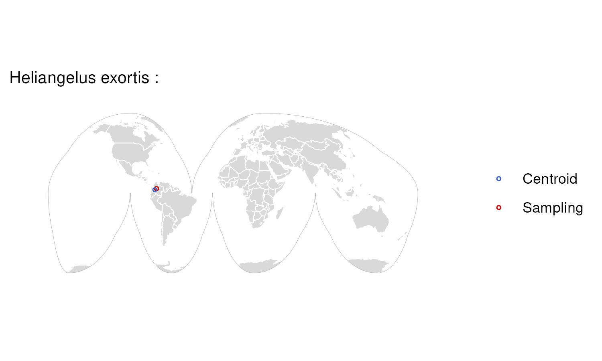

### Hemiprocne comata

**Common Name:** whiskered treeswift\
**Biosample:** SAMN22588383\
**Assembly Accession:** GCA_020745705.1\
**Taxon:** Birds\
**Priority:** 6\
**Flags:** —

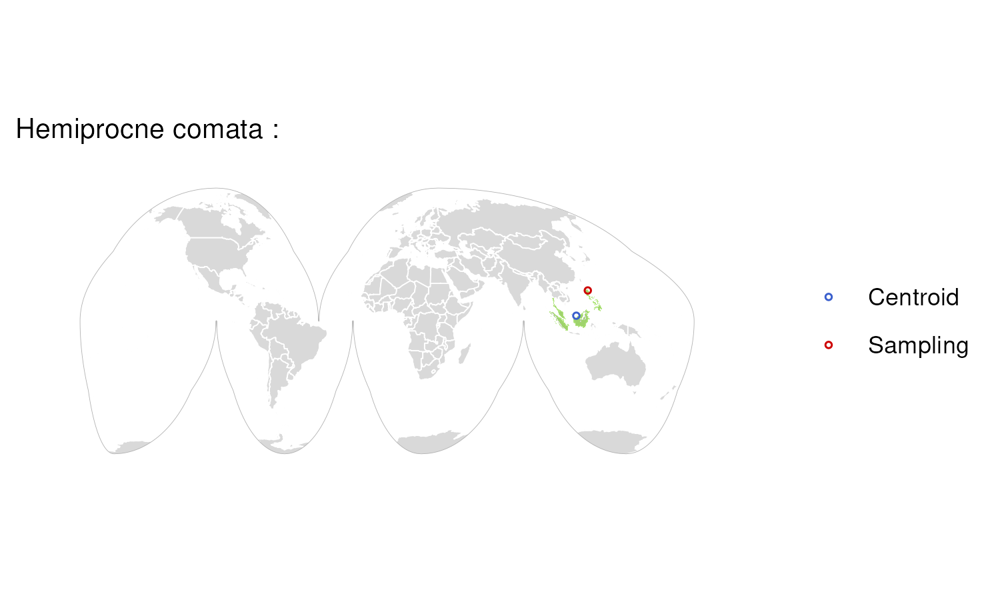

### Heterodontus francisci

**Common Name:** horn shark\
**Biosample:** SAMN39432692\
**Assembly Accession:** GCA_036365525.1\
**Taxon:** Fishes\
**Priority:** 6\
**Flags:** —

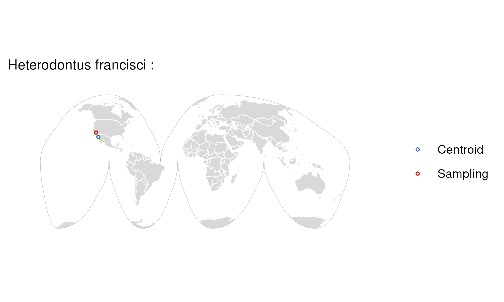

### Heterohyrax brucei

**Common Name:** yellow-spotted rock hyrax\
**Biosample:** SAMN33092455\
**Assembly Accession:** GCA_028571685.1\
**Taxon:** Mammals\
**Priority:** 6\
**Flags:** Zoo/Aquarium sample

**Biosample provider:** Gudrun Wibbelt, Leibniz Institute for Zoo and Wildlife Research\
**Collected by:** Opel-Zoo\
**Biosample comments:** The yellow-spotted rock hyrax (Heterohyrax brucei) is small, thickset, herbivorous mammals in the order Hyracoidea. Hyraxes means shrewmouse, derived from Greek. Hyraxes retain or have redeveloped a number of primitive mammalian characteristics, including poorly developed internal temperature regulation (modified from Wikipedia entry). This sample is from a male, bred in captivity, in Opel Zoo, Kronberg, Germany. This sample was collected by Gudrun Wibbelt, and the project coordinated by Camila Mazzoni, Sylke Winkler, Gene Myers, and Erich D. Jarvis to generate a high-quality reference genome for the Vertebrate Genomes Project (VGP). Sequencing and genome assembly were conducted at the Dresden Genome Center at the Max Planck Institute, led by Gene Myers and Sylke Winkler.\
**Location:** Germany: Opel Zoo, Kronberg im Taunus

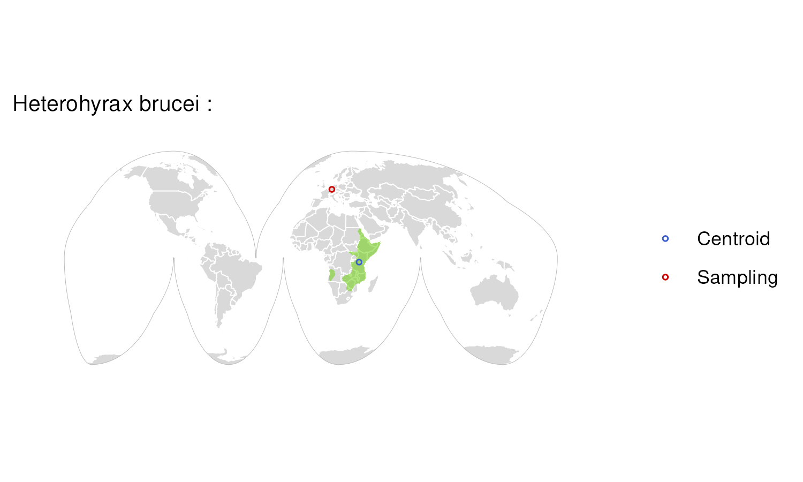

### Hippoglossus hippoglossus

**Common Name:** Atlantic halibut\
**Biosample:** SAMN12629501\
**Assembly Accession:** GCA_009819705.1\
**Taxon:** Fishes\
**Priority:** 6\
**Flags:** —

### Hippopotamus amphibius

**Common Name:** common hippopotamus\
**Biosample:** SAMN33342074\
**Assembly Accession:** GCA_030028045.1\
**Taxon:** Mammals\
**Priority:** 6\
**Flags:** Zoo/Aquarium sample

**Biosample provider:** Olivier Ryder and Cynthia Steiner, San Diego Zoo\
**Collected by:** —\
**Biosample comments:** The East African hippopotamus (Hippopotamus amphibius) or common hippopotamus is a large semiaquatic mammal native to sub-Saharan Africa. It is one of only two extant species in the family Hippopotamidae, the other being the pygmy hippopotamus (Choeropsis liberiensis or Hexaprotodon liberiensis). Its name comes from the ancient Greek for “river horse” (from Wikipedia entry). This sample from a female born in captivity at the San Diego Zoo, USA, procured by Oliver Ryder and Cynthia Steiner, and used to generate a high-quality reference genome for the Vertebrate Genomes Project (VGP). Sequencing and genome assembly were conducted at the Vertebrate Genomes Lab (VGL) at the Rockefeller University, led by Olivier Fedrigo and Erich D. Jarvis.\
**Location:** USA: San Diego Zoo, San Diego

### Hipposideros larvatus

**Common Name:** intermediate roundleaf bat\
**Biosample:** SAMN36277597\
**Assembly Accession:** GCA_031876335.1\
**Taxon:** Mammals\
**Priority:** 6\
**Flags:** —

### Hoplias malabaricus

**Common Name:** trahira\
**Biosample:** SAMN32740525\
**Assembly Accession:** GCA_029633855.2\
**Taxon:** Fishes\
**Priority:** 6\
**Flags:** —

### Hydrolagus colliei

**Common Name:** spotted ratfish\
**Biosample:** SAMN39156054\
**Assembly Accession:** GCA_035084275.1\
**Taxon:** Fishes\
**Priority:** 6\
**Flags:** —

### Hyla sarda

**Common Name:** Sardinian treefrog\
**Biosample:** SAMN32629340\
**Assembly Accession:** GCA_029499605.1\
**Taxon:** Amphibians\
**Priority:** 6\
**Flags:** —

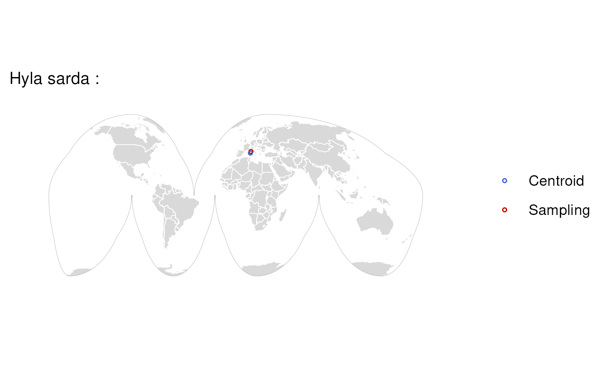

### Hypanus sabinus

**Common Name:** Atlantic stingray\
**Biosample:** SAMN32745077\
**Assembly Accession:** GCA_030144855.1\
**Taxon:** Fishes\
**Priority:** 6\
**Flags:** —

### Hyperoodon ampullatus

**Common Name:** North Atlantic bottlenose whale\
**Biosample:** SAMEA10839125\
**Assembly Accession:** GCA_949752795.1\
**Taxon:** Mammals\
**Priority:** 6\
**Flags:** —

### Hyperoplus immaculatus

**Common Name:** greater sand eel\
**Biosample:** SAMEA13854416\
**Assembly Accession:** GCA_949357725.1\
**Taxon:** Fishes\
**Priority:** 6\
**Flags:** Missing range raster

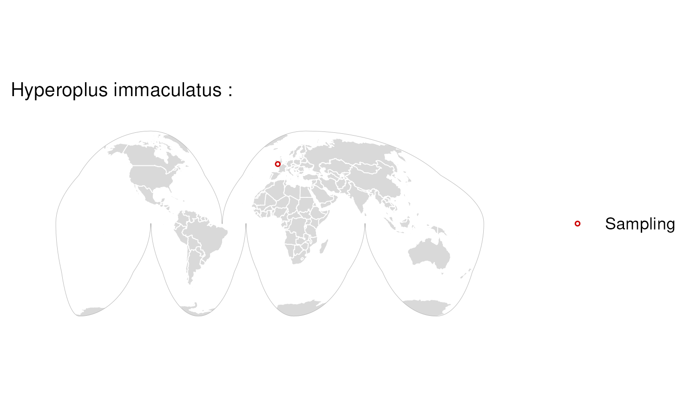

### Inia geoffrensis

**Common Name:** Amazon river dolphin\
**Biosample:** SAMN32797734\
**Assembly Accession:** GCA_036417435.1\
**Taxon:** Mammals\
**Priority:** 6\
**Flags:** —

### Kogia breviceps

**Common Name:** pygmy sperm whale\
**Biosample:** SAMN31719513\
**Assembly Accession:** GCA_026419965.1\
**Taxon:** Mammals\
**Priority:** 6\
**Flags:** —

### Labrus bergylta

**Common Name:** ballan wrasse\
**Biosample:** SAMEA111562158\
**Assembly Accession:** GCA_963930695.1\
**Taxon:** Fishes\
**Priority:** 6\
**Flags:** —

### Labrus mixtus

**Common Name:** cuckoo wrasse\
**Biosample:** SAMEA111562155\
**Assembly Accession:** GCA_963584025.1\
**Taxon:** Fishes\
**Priority:** 6\
**Flags:** —

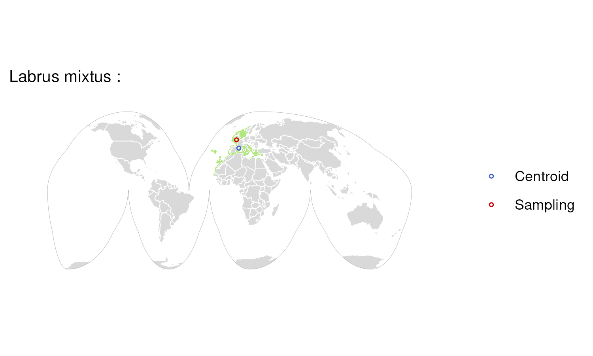

### Lagenorhynchus acutus

**Common Name:** Atlantic white-sided dolphin\
**Biosample:** SAMEA114493133\
**Assembly Accession:** GCA_964270905.1\
**Taxon:** Mammals\
**Priority:** 6\
**Flags:** —

### Lagenorhynchus albirostris

**Common Name:** white-beaked dolphin\
**Biosample:** SAMEA111380537\
**Assembly Accession:** GCA_949774975.1\
**Taxon:** Mammals\
**Priority:** 6\
**Flags:** —

### Lagopus muta

**Common Name:** rock ptarmigan\
**Biosample:** SAMN25144835\
**Assembly Accession:** GCA_023343835.1\
**Taxon:** Birds\
**Priority:** 6\
**Flags:** —

### Lampetra fluviatilis

**Common Name:** European river lamprey\
**Biosample:** SAMEA111528664\
**Assembly Accession:** GCA_964198595.1\
**Taxon:** Fishes\
**Priority:** 6\
**Flags:** —

### Lampris incognitus

**Common Name:** smalleye Pacific opah\
**Biosample:** SAMN34060140\
**Assembly Accession:** GCA_029633865.1\
**Taxon:** Fishes\
**Priority:** 6\
**Flags:** Missing range raster

### Larus argentatus

**Common Name:** herring gull\
**Biosample:** SAMEA115168456\
**Assembly Accession:** GCA_964417175.1\
**Taxon:** Birds\
**Priority:** 6\
**Flags:** —

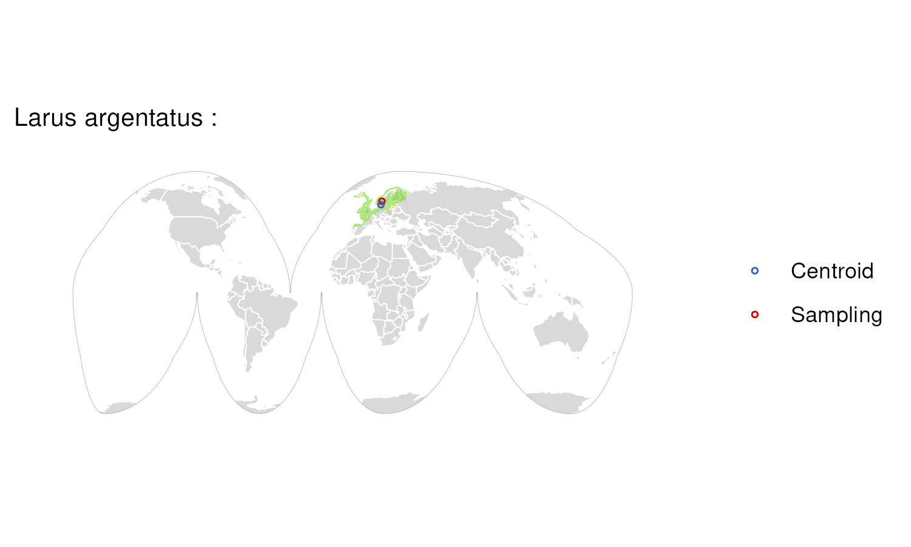

### Larus fuscus

**Common Name:** lesser black-backed gull\
**Biosample:** SAMEA112468039\
**Assembly Accession:** GCA_963932225.1\
**Taxon:** Birds\
**Priority:** 6\
**Flags:** —

### Larus michahellis

**Common Name:** yellow-legged gull\
**Biosample:** SAMEA114211328\
**Assembly Accession:** GCA_964199755.1\
**Taxon:** Birds\
**Priority:** 6\
**Flags:** —

### Lathamus discolor

**Common Name:** swift parrot\
**Biosample:** SAMN40289871\
**Assembly Accession:** GCA_037157495.1\
**Taxon:** Birds\
**Priority:** 6\
**Flags:** —

### Latimeria chalumnae

**Common Name:** African coelacanth\
**Biosample:** SAMN39710040\
**Assembly Accession:** GCA_037176945.1\
**Taxon:** Fishes\
**Priority:** 6\
**Flags:** Missing range raster

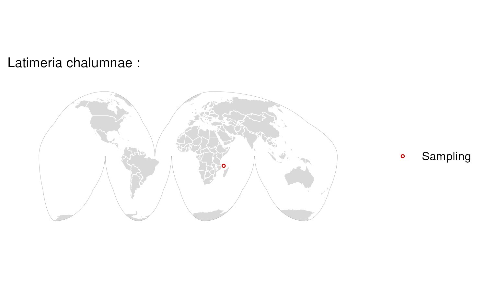

### Lemur catta

**Common Name:** ring-tailed lemur\
**Biosample:** SAMN12621102\
**Assembly Accession:** GCA_020740605.1\
**Taxon:** Mammals\
**Priority:** 6\
**Flags:** Zoo/Aquarium sample

**Biosample provider:** Copenhagen Zoo, Denmark\
**Collected by:** Mads Bertelsen\
**Biosample comments:** The ring-tailed lemur (Lemur cata) is primate that like other lemurs is endemic to Madagascar. It is recognized by the stripped black and white ring circles on its tail. They have been studied for the communication and cognitive abilities. They are the most popular lemurs in zoos worldwide. They are currently endangered in the wild (IUCN red list). This sample was collected by Mads Bertelsen from a male that lived at the Copenhagen Zoo in Denmark, procured by Tom Gilbert, and supported by Tomas Marques-Bonet at the Universitat Pompeu Fabra, Barcelona, for primate evolution investigations, to generate a chromosome level reference assembly as part of the G10K-VGP Project.\
**Location:** Denmark: Copenhagen Zoo

### Lepidochelys kempii

**Common Name:** Kemp’s ridley sea turtle\
**Biosample:** SAMN46282779\
**Assembly Accession:** GCA_965140285.1\
**Taxon:** Reptiles\
**Priority:** 6\
**Flags:** —

### Lepidochelys olivacea

**Common Name:** Pacific ridley\
**Biosample:** SAMN46283035\
**Assembly Accession:** GCA_965140295.1\
**Taxon:** Reptiles\
**Priority:** 6\
**Flags:** —

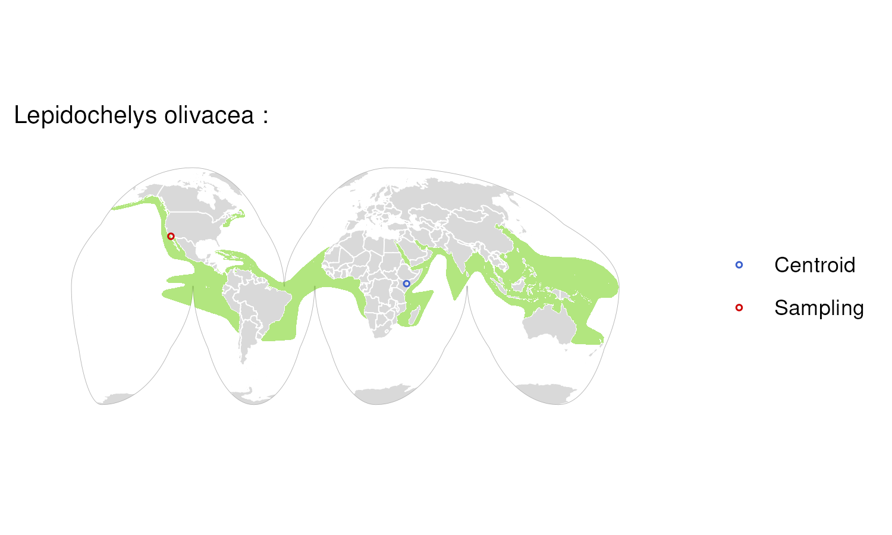

### Lepidogalaxias salamandroides

**Common Name:** salamanderfish\
**Biosample:** SAMN47481373\
**Assembly Accession:** GCA_049190665.1\
**Taxon:** Fishes\
**Priority:** 6\
**Flags:** —

### Lepisosteus oculatus

**Common Name:** spotted gar\
**Biosample:** SAMN41155427\
**Assembly Accession:** GCA_040954835.1\
**Taxon:** Fishes\
**Priority:** 6\
**Flags:** —

### Leptodactylus fuscus

**Common Name:** rufous frog\
**Biosample:** SAMN37055805\
**Assembly Accession:** GCA_031893055.1\
**Taxon:** Amphibians\
**Priority:** 6\
**Flags:** —

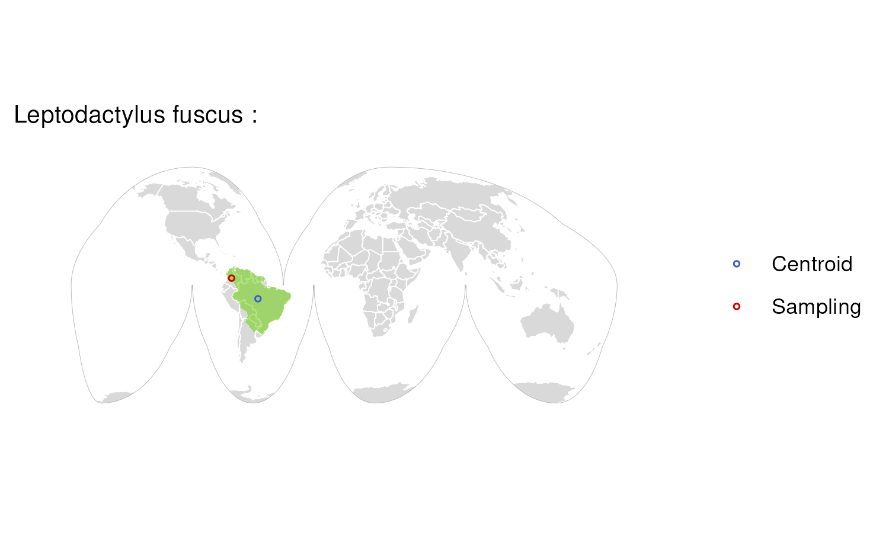

### Leuciscus leuciscus

**Common Name:** common dace\
**Biosample:** SAMEA11296544\
**Assembly Accession:** GCA_965113295.1\
**Taxon:** Fishes\
**Priority:** 6\
**Flags:** —

### Liasis olivaceus

**Common Name:** olive python\
**Biosample:** SAMN32739907\
**Assembly Accession:** GCA_030867105.1\
**Taxon:** Reptiles\
**Priority:** 6\
**Flags:** Zoo/Aquarium sample

**Biosample provider:** Morten Erik Allentoft, Curtin University, Perth, WA, Australia\
**Collected by:** Perth Zoo\
**Biosample comments:** The olive python (Liasis olivaceus) is a species of snake in the family Pythonidae, endemic to Australia. The olive python is often kept as a pet and is bred in captivity. It is technically an advanced-level species due to its size, habitat requirements, and strong feeding response, requiring a terrarium of a minimum of 2.4 metres (8 ft) long, by 1 metre (3 ft) high (from Wikipedia entry). Two subspecies are recognized: L. o. barroni and L. o. olivaceus. This sample is from a female barroni subspecies, in Perth Zoo, Australia, coordinated by Morten E. Allentoft at Curtin University, Perth, and used to generate a high-quality reference genome for the Vertebrate Genomes Project (VGP). Sequencing and genome assembly were conducted at the Vertebrate Genomes Lab (VGL) at the Rockefeller University, led by Olivier Fedrigo and Erich D. Jarvis.\
**Location:** Australia: Perth Zoo, Australia

### Limanda limanda

**Common Name:** common dab\
**Biosample:** SAMEA112765706\
**Assembly Accession:** GCA_963576545.1\
**Taxon:** Fishes\
**Priority:** 6\
**Flags:** —

### Lipophrys pholis

**Common Name:** shanny\
**Biosample:** SAMEA7522844\
**Assembly Accession:** GCA_963383615.1\
**Taxon:** Fishes\
**Priority:** 6\
**Flags:** —

### Lissotriton helveticus

**Common Name:** palmate newt\
**Biosample:** SAMEA110240860\
**Assembly Accession:** GCA_964261635.1\
**Taxon:** Amphibians\
**Priority:** 6\
**Flags:** —

### Lissotriton vulgaris

**Common Name:** common newt\
**Biosample:** SAMEA110240861\
**Assembly Accession:** GCA_964263255.1\
**Taxon:** Amphibians\
**Priority:** 6\
**Flags:** —

### Loxodonta africana

**Common Name:** African elephant\
**Biosample:** SAMN32756554\
**Assembly Accession:** GCA_030014295.1\
**Taxon:** Mammals\
**Priority:** 6\
**Flags:** Zoo/Aquarium sample

**Biosample provider:** Cells derived by Virginia Pearson, cultured by Austin Bow and Xochitl Ambriz Pena\
**Collected by:** Austin Bow\
**Biosample comments:** The African elephants (Loxodonta) are a genus comprising two living species, the African bush elephant (Loxodonta africana) and the smaller African forest elephant (Loxodonta cyclotis). Both are social herbivores with grey skin, but differ in the size and color of their tusks and in the shape and size of their ears and skulls. Both species are at heavy risk of extinction, where as of 2021, the bush elephant is endangered and the forest elephant is critically endangered according to the IUCN Red List (modified from Wikipedia entry). This sample of Loxodonta africana was collected from a male calf born in Louisville Kentucky Zoo, the endothelial cells derived from the umbilical cord by Virginia Pearson, cultured by Austin Bow and Xochitl Ambriz Pena, and coordinated by Eriona Hysolli, Austin Bow, Sara Ord, and Ben Lamm of Colossal Biosciences and Kathleen Horan of Rockefeller University. The cultured cells were used to create a high-quality reference genome for Colossal Biosciences mammoth project and the Vertebrate Genomes Project (VGP). Sequencing and genome assembly were conducted at the Vertebrate Genomes Lab (VGL) at the Rockefeller University, led by Olivier Fedrigo and Erich D. Jarvis.\
**Location:** USA: Louisville Zoo, Kentucky

### Lycodopsis pacificus

**Common Name:** blackbelly eelpout\
**Biosample:** SAMN32629383\
**Assembly Accession:** GCA_028022725.1\
**Taxon:** Fishes\
**Priority:** 6\
**Flags:** Missing range raster

### Macrochelys suwanniensis

**Common Name:** Suwannee snapping turtle\
**Biosample:** SAMN37052244\
**Assembly Accession:** GCA_033349115.1\
**Taxon:** Reptiles\
**Priority:** 6\
**Flags:** —

### Macrotis lagotis

**Common Name:** greater bilby\
**Biosample:** SAMN39300766\
**Assembly Accession:** GCA_037893015.1\
**Taxon:** Mammals\
**Priority:** 6\
**Flags:** Zoo/Aquarium sample

**Biosample provider:** —\
**Collected by:** —\
**Biosample comments:** —\
**Location:** Australia:Perth Zoo

### Malaclemys terrapin

**Common Name:** diamondback terrapin\
**Biosample:** SAMN31394215\
**Assembly Accession:** GCA_027887155.1\
**Taxon:** Reptiles\
**Priority:** 6\
**Flags:** —

### Manis pentadactyla

**Common Name:** Chinese pangolin\
**Biosample:** SAMN32757332\
**Assembly Accession:** GCA_030020395.1\
**Taxon:** Mammals\
**Priority:** 6\
**Flags:** Zoo/Aquarium sample

### Marmota flaviventris

**Common Name:** yellow bellied marmot\
**Biosample:** SAMN45932315\
**Assembly Accession:** GCA_047511675.1\
**Taxon:** Mammals\
**Priority:** 6\
**Flags:** —

### Martes martes

**Common Name:** European pine marten\
**Biosample:** SAMEA14268932\
**Assembly Accession:** GCA_963455335.1\
**Taxon:** Mammals\
**Priority:** 6\
**Flags:** —

### Megalops cyprinoides

**Common Name:** Indo-pacific tarpon\
**Biosample:** SAMN12623619\
**Assembly Accession:** GCA_013368585.1\
**Taxon:** Fishes\
**Priority:** 6\
**Flags:** —

### Megaptera novaeangliae

**Common Name:** humpback whale\
**Biosample:** SAMN41059645\
**Assembly Accession:** GCA_041834305.1\
**Taxon:** Mammals\
**Priority:** 6\
**Flags:** —

### Melanostigma gelatinosum

**Common Name:** limp eelpout\
**Biosample:** SAMEA12815492\
**Assembly Accession:** GCA_949748355.1\
**Taxon:** Fishes\
**Priority:** 6\
**Flags:** Missing range raster

### Meles meles

**Common Name:** European badger\
**Biosample:** SAMEA7524400\
**Assembly Accession:** GCA_922984935.2\
**Taxon:** Mammals\
**Priority:** 6\
**Flags:** —

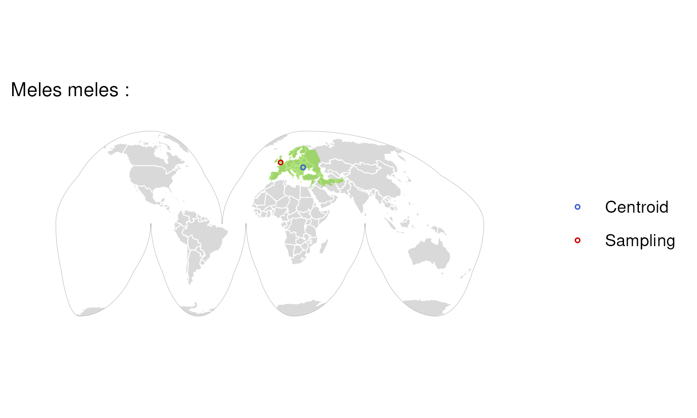

### Melospiza georgiana

**Common Name:** swamp sparrow\
**Biosample:** SAMN22787412\
**Assembly Accession:** GCA_028018845.1\
**Taxon:** Birds\
**Priority:** 6\
**Flags:** —

### Melospiza melodia

**Common Name:** song sparrow\
**Biosample:** SAMN35847297\
**Assembly Accession:** GCA_035770615.1\
**Taxon:** Birds\
**Priority:** 6\
**Flags:** —

### Menidia menidia

**Common Name:** Atlantic silverside\
**Biosample:** SAMN46987722\
**Assembly Accession:** GCA_048628825.1\
**Taxon:** Fishes\
**Priority:** 6\
**Flags:** —

### Mergus octosetaceus

**Common Name:** Brazilian merganser\
**Biosample:** SAMN39710078\
**Assembly Accession:** GCA_036873955.1\
**Taxon:** Birds\
**Priority:** 6\
**Flags:** —

### Merops nubicus

**Common Name:** carmine bee-eater\
**Biosample:** SAMN12621035\
**Assembly Accession:** GCA_009819595.1\
**Taxon:** Birds\
**Priority:** 6\
**Flags:** Zoo/Aquarium sample

**Biosample provider:** Copenhagen Zoo, Denmark\
**Collected by:** Mads Bertelsen\
**Biosample comments:** The Northern Carmine Bee-eater (Merops nubicus nubicus) is part of the bee-eater family, Meropidae, and is also known as the Nubian bee-eater. It is a brightly-coloured bird and feeds primarily on bees and other flying insects, such as grasshoppers and locusts (description from the Avian Phylogenomics Project <http://gigadb.org/dataset/101029>). This sample was collected by Mads Bertelsen from a female that lived at the Copenhagen Zoo in Denmark (same animal as in BioSample SAMN02338310) and was used to generate a chromosome level reference assembly as part of the G10K-VGP and B10K Projects.\
**Location:** Denmark: Copenhagen Zoo

### Mesoplodon densirostris

**Common Name:** Blainville’s beaked whale\
**Biosample:** SAMN29828597\
**Assembly Accession:** GCA_025265405.1\
**Taxon:** Mammals\
**Priority:** 6\
**Flags:** —

### Microchirus variegatus

**Common Name:** thickback sole\
**Biosample:** SAMEA12219470\
**Assembly Accession:** GCA_963457635.1\
**Taxon:** Fishes\
**Priority:** 6\
**Flags:** —

### Micromesistius poutassou

**Common Name:** blue whiting\
**Biosample:** SAMEA111457552\
**Assembly Accession:** GCA_964030765.1\
**Taxon:** Fishes\
**Priority:** 6\
**Flags:** Missing range raster

### Micromys minutus

**Common Name:** European harvest mouse\
**Biosample:** SAMEA112468042\
**Assembly Accession:** GCA_963924665.1\
**Taxon:** Mammals\
**Priority:** 6\
**Flags:** —

### Microstomus kitt

**Common Name:** lemon sole\
**Biosample:** SAMEA114298639\
**Assembly Accession:** GCA_964266715.1\
**Taxon:** Fishes\
**Priority:** 6\
**Flags:** —

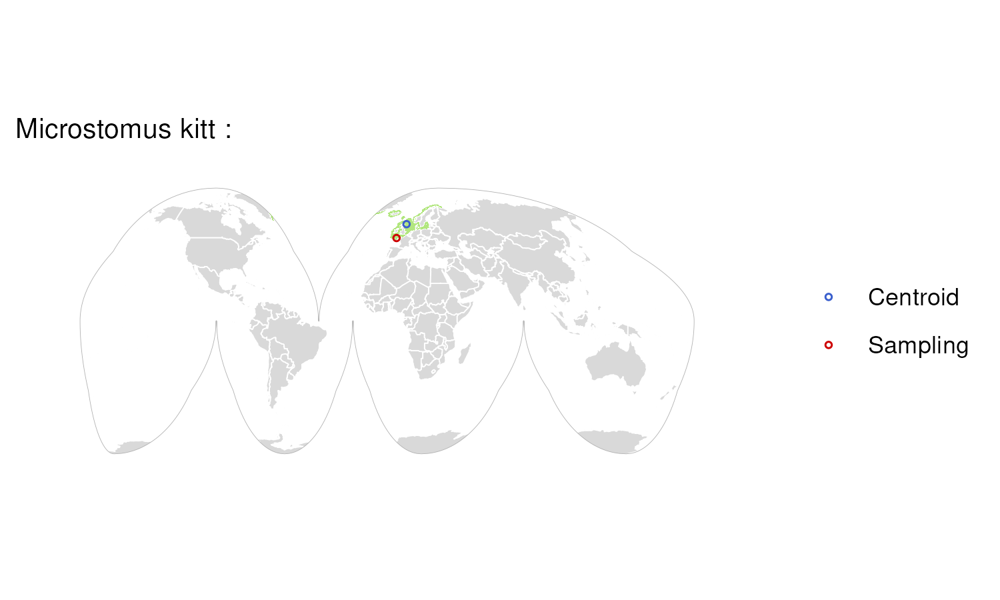

### Microtus pennsylvanicus

**Common Name:** Eastern meadow vole\
**Biosample:** SAMN39894136\
**Assembly Accession:** GCA_037038515.1\
**Taxon:** Mammals\
**Priority:** 6\
**Flags:** —

### Miniopterus schreibersii

**Common Name:** Schreibers’ long-fingered bat\
**Biosample:** SAMEA113980738\
**Assembly Accession:** GCA_964146895.2\
**Taxon:** Mammals\
**Priority:** 6\
**Flags:** —

### Mixophyes fleayi

**Common Name:** Fleay’s barred frog\
**Biosample:** SAMN39657083\
**Assembly Accession:** GCA_038048845.1\
**Taxon:** Amphibians\
**Priority:** 6\
**Flags:** —

### Mobula birostris

**Common Name:** Atlantic manta ray\
**Biosample:** SAMN32746370\
**Assembly Accession:** GCA_030028105.1\
**Taxon:** Fishes\
**Priority:** 6\
**Flags:** —

### Molossus molossus

**Common Name:** Pallas’s mastiff bat\
**Biosample:** SAMN14734448\
**Assembly Accession:** GCA_014108415.1\
**Taxon:** Mammals\
**Priority:** 6\
**Flags:** —

### Molossus nigricans

**Common Name:** Ebon mastiff bat\
**Biosample:** SAMN40002246\
**Assembly Accession:** GCA_039880945.1\
**Taxon:** Mammals\
**Priority:** 6\
**Flags:** —

### Monodon monocero

**Common Name:** narwhal\
**Biosample:** SAMN10872456\
**Assembly Accession:** GCA_005190385.3\
**Taxon:** Mammals\
**Priority:** 6\
**Flags:** —

### Morphnus guianensis

**Common Name:** crested eagle\
**Biosample:** SAMN44513986\
**Assembly Accession:** GCA_045345515.1\
**Taxon:** Birds\
**Priority:** 6\
**Flags:** —

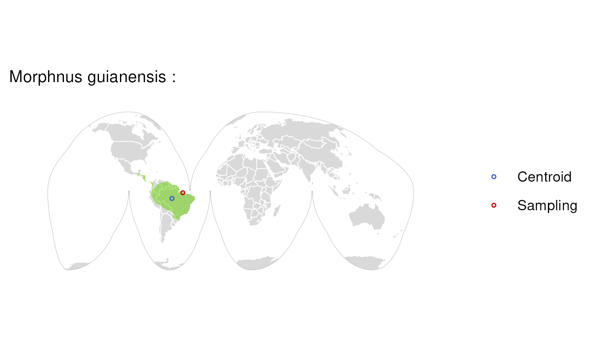

### Morus bassanus

**Common Name:** Northern gannet\
**Biosample:** SAMN37096299\
**Assembly Accession:** GCA_031468815.1\
**Taxon:** Birds\
**Priority:** 6\
**Flags:** Zoo/Aquarium sample

**Biosample provider:** Tom Gilbert: University of Copenhagen\
**Collected by:** Jorns Fickel\
**Biosample comments:** The northern gannet (Morus bassanus) is a seabird, the largest species of the gannet family, Sulidae. It is native to the coasts of the Atlantic Ocean, breeding in Western Europe and Northeastern North America. It is the largest seabird in the northern Atlantic. This sample is from a male care for at theLeibniz Institute for Zoo and Wildlife Research, collected by Jorns Fickel, coordinated by Tom Gilbert, and used to generate a high-quality reference genome for the Vertebrate Genomes Project (VGP). Sequencing and genome assembly were conducted at the Vertebrate Genomes Lab (VGL) at the Rockefeller University, led by Olivier Fedrigo and Erich D. Jarvis.\
**Location:** Germany: Leibniz Institute for Zoo and Wildlife Research, Berlin

### Muntiacus reevesi

**Common Name:** Reeves’ muntjac\
**Biosample:** SAMEA110690972\
**Assembly Accession:** GCA_963930625.1\
**Taxon:** Mammals\
**Priority:** 6\
**Flags:** —

### Mus musculus

**Common Name:** house mouse\
**Biosample:** SAMEA112251260\
**Assembly Accession:** GCA_949316315.1\
**Taxon:** Mammals\
**Priority:** 6\
**Flags:** —

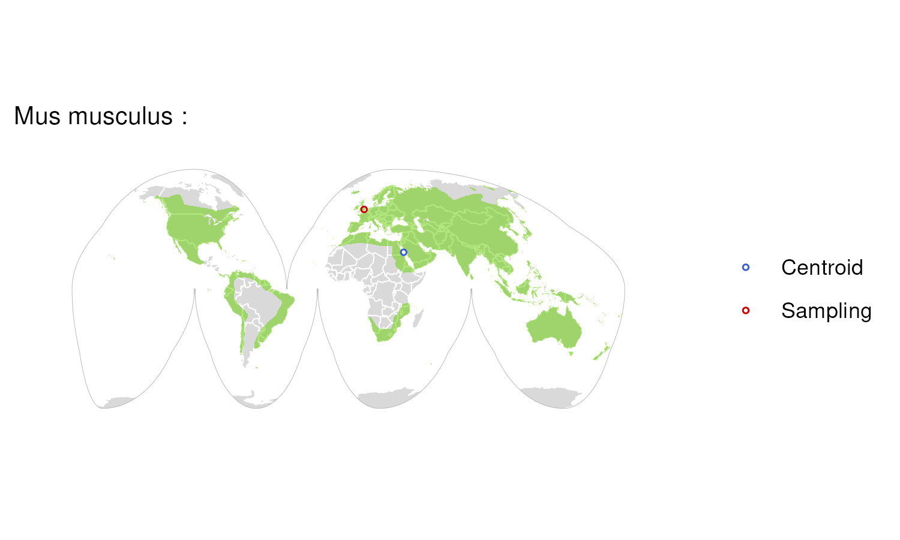

### Muscardinus avellanarius

**Common Name:** common dormouse\
**Biosample:** SAMEA110180654\
**Assembly Accession:** GCA_963383645.1\
**Taxon:** Mammals\
**Priority:** 6\
**Flags:** —

### Mustela erminea

**Common Name:** stout\
**Biosample:** SAMN12611999\
**Assembly Accession:** GCA_009829155.1\
**Taxon:** Mammals\
**Priority:** 6\
**Flags:** —

### Mustela lutreola

**Common Name:** European mink\
**Biosample:** SAMN35784236\
**Assembly Accession:** GCA_030435805.1\
**Taxon:** Mammals\
**Priority:** 6\
**Flags:** —

### Mustela nivalis vulgaris

**Common Name:** least weasel\
**Biosample:** SAMEA113398841\
**Assembly Accession:** GCA_964662115.1\
**Taxon:** Mammals\
**Priority:** 6\
**Flags:** —

### Mustelus asterias

**Common Name:** starry smooth-hound shark\
**Biosample:** SAMEA114298637\
**Assembly Accession:** GCA_964213995.1\
**Taxon:** Fishes\
**Priority:** 6\
**Flags:** —

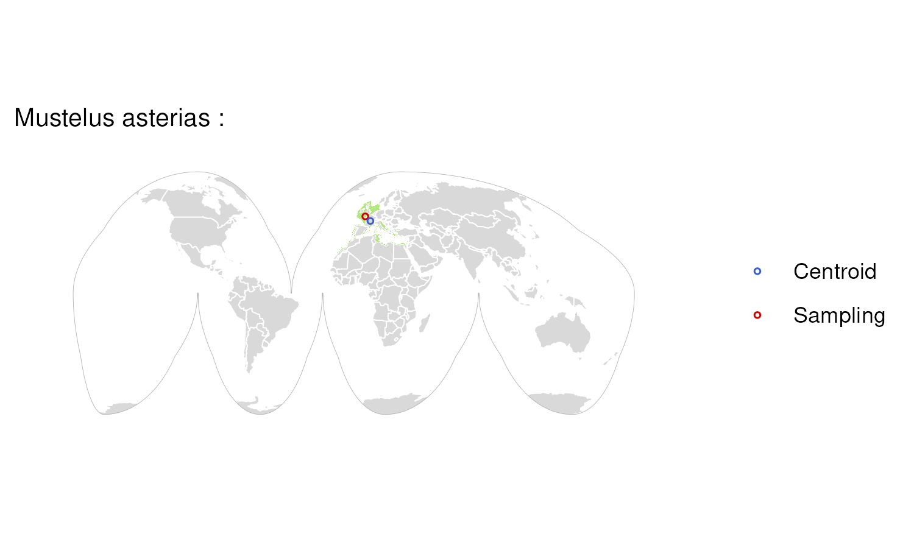

### Myotis daubentonii

**Common Name:** Daubenton’s bat\
**Biosample:** SAMEA9921455\
**Assembly Accession:** GCA_963259705.1\
**Taxon:** Mammals\
**Priority:** 6\
**Flags:** —

### Myotis emarginatus

**Common Name:** Geoffroy’s bat\
**Biosample:** SAMEA115534660\
**Assembly Accession:** GCA_965115925.1\
**Taxon:** Mammals\
**Priority:** 6\
**Flags:** Zoo/Aquarium sample

### Myotis myotis

**Common Name:** greater mouse-eared bat\
**Biosample:** SAMN14734277\
**Assembly Accession:** GCA_014108235.1\
**Taxon:** Mammals\
**Priority:** 6\
**Flags:** —

### Myotis nattereri

**Common Name:** Natterer’s bat\
**Biosample:** SAMEA114614248\
**Assembly Accession:** GCA_964212035.2\
**Taxon:** Mammals\
**Priority:** 6\
**Flags:** —

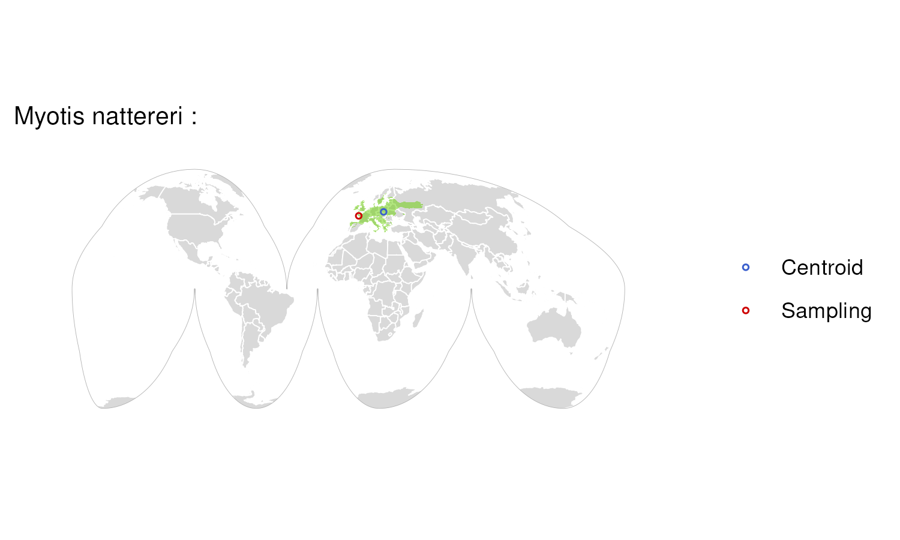

### Myuchelys georgesi

**Common Name:** Bellinger river turtle\
**Biosample:** SAMN36918804\
**Assembly Accession:** GCA_040894355.2\
**Taxon:** Reptiles\
**Priority:** 6\
**Flags:** Missing range raster

### Myxine glutinosa

**Common Name:** Atlantic hagfish\
**Biosample:** SAMEA12790223\
**Assembly Accession:** GCA_964187855.1\
**Taxon:** Fishes\
**Priority:** 6\
**Flags:** —

### Nannobrachium achirus

**Common Name:** Lantern fish\
**Biosample:** SAMEA12815432\
**Assembly Accession:** GCA_963921795.1\
**Taxon:** Fishes\
**Priority:** 6\
**Flags:** —

### Nansenia antarctica

**Common Name:** pencil smelt\
**Biosample:** SAMEA8748805\
**Assembly Accession:** GCA_963989245.1\
**Taxon:** Fishes\
**Priority:** 6\
**Flags:** Missing range raster

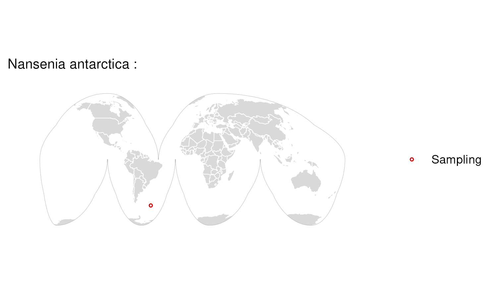

### Narcine bancroftii

**Common Name:** lesser electric ray\
**Biosample:** SAMN39325148\
**Assembly Accession:** GCA_036971445.1\
**Taxon:** Fishes\
**Priority:** 6\
**Flags:** —

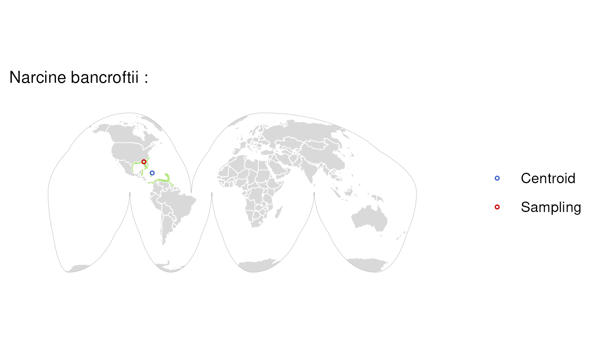

### Natator depressus

**Common Name:** Australian flatback sea turtle\
**Biosample:** SAMN46282745\
**Assembly Accession:** GCA_965152275.1\
**Taxon:** Reptiles\
**Priority:** 6\
**Flags:** Missing range raster

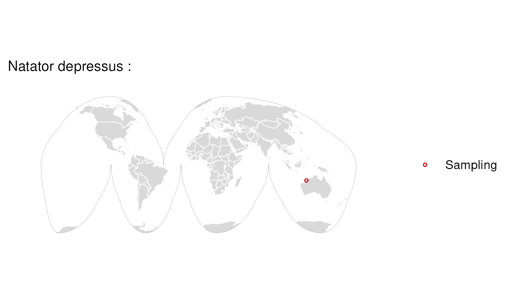

### Natrix helvetica

**Common Name:** barred grass snake\
**Biosample:** SAMEA114598156\
**Assembly Accession:** GCA_964273705.1\
**Taxon:** Reptiles\
**Priority:** 6\
**Flags:** —

### Neoarius graeffei

**Common Name:** blue salmon catfish\
**Biosample:** SAMN28453209\
**Assembly Accession:** GCA_027579695.1\
**Taxon:** Fishes\
**Priority:** 6\
**Flags:** —

### Neofelis nebulosa

**Common Name:** clouded leopard\
**Biosample:** SAMN31801981\
**Assembly Accession:** GCA_028018385.1\
**Taxon:** Mammals\
**Priority:** 6\
**Flags:** Zoo/Aquarium sample

**Biosample provider:** Smithsonian Conservation Biology Institute\
**Collected by:** SCBI Veterinary Staff, Klaus Koepfli\
**Biosample comments:** The clouded leopard (Neofelis nebulosa) is a cat that inhabite dense forests from the foothills of the Himalayas through mainland Southeast Asia into South China (from Wikipedia entry). This sample is from a male at the Smithsonian National Zoo, in Washington DC, collected and procured the Veterinary Staff and Klaus Koepfli, to generate a high-quality reference for the Vertebrate Genomes Project (VGP). Sequencing and genome assembly were conducted at the Vertebrate Genomes Lab (VGL) at the Rockefeller University, lead by Olivier Fedrigo and Erich D. Jarvis, with support from Jarvis for a COVID-19 research project.\
**Location:** USA: Smithsonian National Zoological Park

### Neosynchiropus ocellatus

**Common Name:** ocellated dragonet\
**Biosample:** SAMN43082349\
**Assembly Accession:** GCA_044231665.1\
**Taxon:** Fishes\
**Priority:** 6\
**Flags:** Zoo/Aquarium sample

**Biosample provider:** Josefin Stiller, University of Copenhagen\
**Collected by:** —\
**Biosample comments:** —\
**Location:** Denmark: National Aquarium Denmark

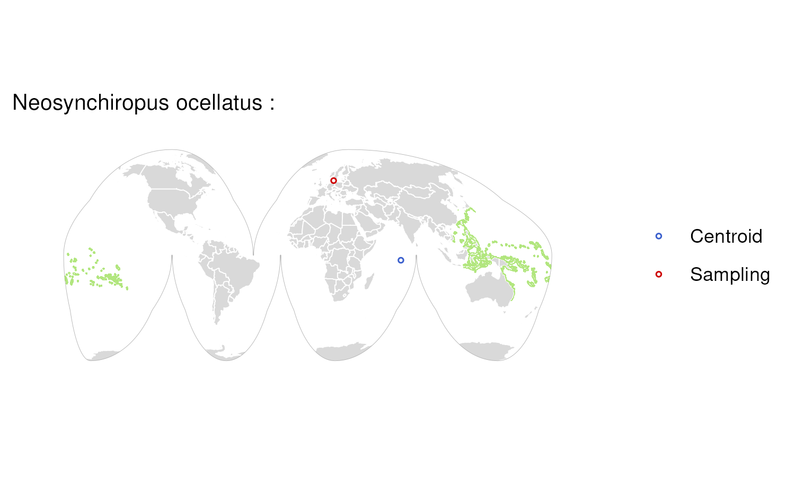

### Notolabrus celidotus

**Common Name:** New Zealand spotty wrasse\
**Biosample:** SAMN12623201\
**Assembly Accession:** GCA_009762535.1\
**Taxon:** Fishes\
**Priority:** 6\
**Flags:** —

### Notolepis coatsi

**Common Name:** Antarctic jonasfish\
**Biosample:** SAMEA8748806\
**Assembly Accession:** GCA_963971535.1\
**Taxon:** Fishes\
**Priority:** 6\
**Flags:** Missing range raster

### Notothenia rossii

**Common Name:** marbled rockcod\
**Biosample:** SAMEA12815441\
**Assembly Accession:** GCA_949606895.1\
**Taxon:** Fishes\
**Priority:** 6\
**Flags:** Missing range raster

### Numenius arquata

**Common Name:** Eurasian curlew\
**Biosample:** SAMEA112693994\
**Assembly Accession:** GCA_964106895.1\
**Taxon:** Birds\
**Priority:** 6\
**Flags:** —

### Nyctalus leisleri

**Common Name:** lesser noctule\
**Biosample:** SAMEA114250308\
**Assembly Accession:** GCA_964264875.2\
**Taxon:** Mammals\
**Priority:** 6\
**Flags:** —

### Nyctibius grandis

**Common Name:** great potoo\
**Biosample:** SAMN12622411\
**Assembly Accession:** GCA_013368605.1\
**Taxon:** Birds\
**Priority:** 6\
**Flags:** —

### Nycticebus coucang

**Common Name:** sunda slow loris\
**Biosample:** SAMN28408555\
**Assembly Accession:** GCA_027406575.1\
**Taxon:** Mammals\
**Priority:** 6\
**Flags:** Zoo/Aquarium sample

**Biosample provider:** Oliver Ryder, San Diego Zoo Global\
**Collected by:** San Diego Zoo\
**Biosample comments:** The slow loris (Nycticebus coucang) belongs to a group of nocturnal strepsirrhine primates that make up the genus Nycticebus. They are found in Southeast Asia and bordering areas, ranging from Bangladesh and Northeast India in the west to the Sulu Archipelago in the Philippines in the east, and from Yunnan province in China in the north to the island of Java in the south. This sample from a male born in the San Diego Zoo, California USA. The sample was procured by Oliver Ryder and used to generate a high-quality reference genome for the Vertebrate Genomes Project (VGP). Sequencing and genome assembly were conducted at the Vertebrate Genomes Lab (VGL) at the Rockefeller University, led by Olivier Fedrigo and Erich D. Jarvis.\
**Location:** USA: San Diego Zoo, San Diego

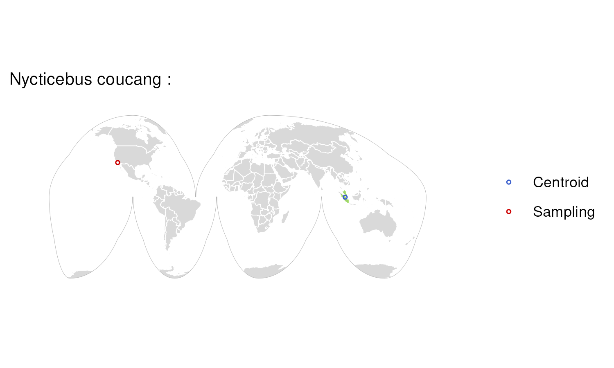

### Ochotona princeps

**Common Name:** American pika\
**Biosample:** SAMN35822658\
**Assembly Accession:** GCA_030435755.1\
**Taxon:** Mammals\
**Priority:** 6\
**Flags:** —

### Odontesthes bonariensis

**Common Name:** pejerrey\
**Biosample:** SAMN31802211\
**Assembly Accession:** GCA_027942865.1\
**Taxon:** Fishes\
**Priority:** 6\
**Flags:** —

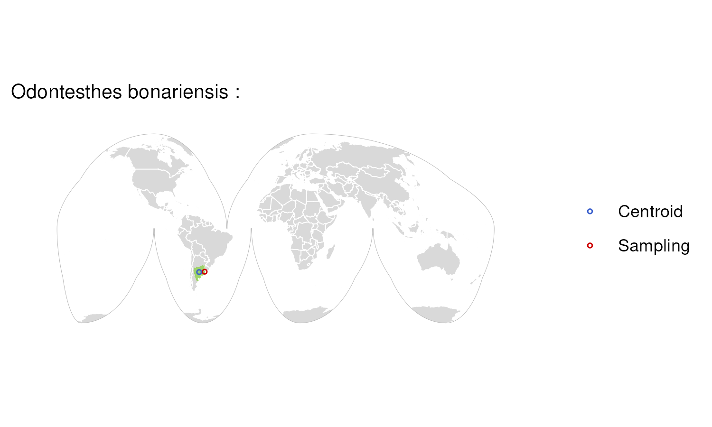

### Opisthocomus hoazin

**Common Name:** hoatzin\
**Biosample:** SAMN37055462\
**Assembly Accession:** GCA_030867145.1\
**Taxon:** Birds\
**Priority:** 6\
**Flags:** —

### Orcinus orca

**Common Name:** killer whale\
**Biosample:** SAMEA8800229\
**Assembly Accession:** GCA_937001465.1\
**Taxon:** Mammals\
**Priority:** 6\
**Flags:** —

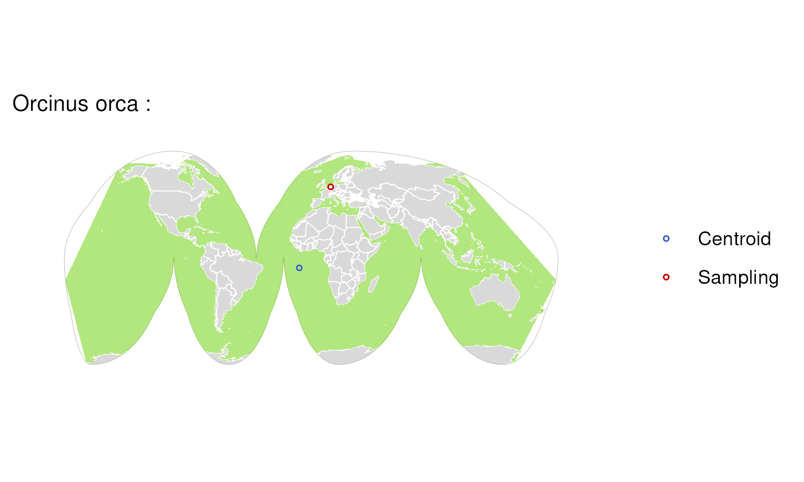

### Osmerus eperlanus

**Common Name:** European smelt\
**Biosample:** SAMEA14448128\
**Assembly Accession:** GCA_963692335.1\
**Taxon:** Fishes\
**Priority:** 6\
**Flags:** —

### Osmerus mordax

**Common Name:** rainbow smelt\
**Biosample:** SAMN40867348\
**Assembly Accession:** GCA_038355195.1\
**Taxon:** Fishes\
**Priority:** 6\
**Flags:** —

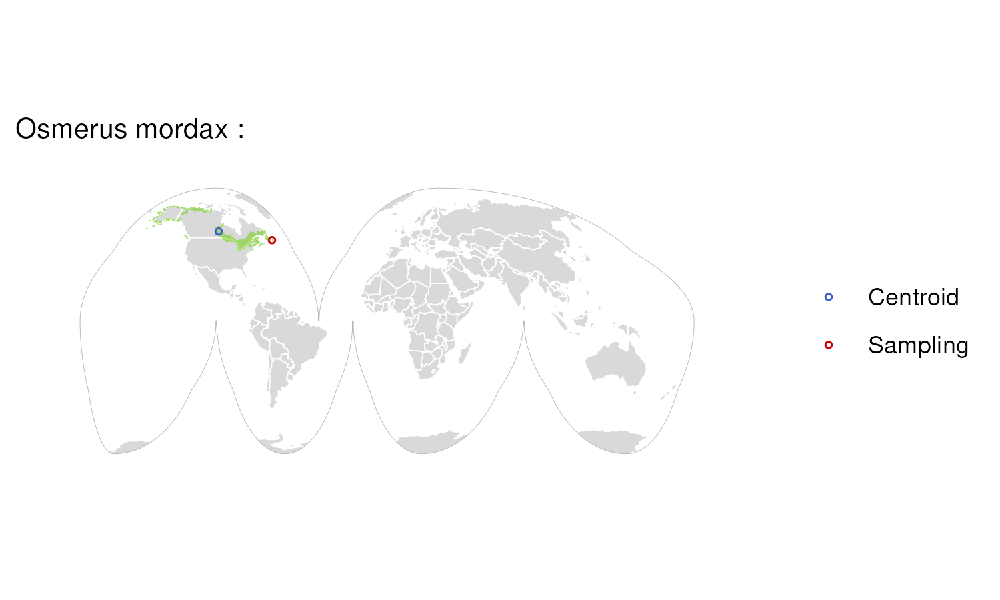

### Ovis canadensis

**Common Name:** bighorn sheep\
**Biosample:** SAMN42787568\
**Assembly Accession:** GCA_042477335.2\
**Taxon:** Mammals\
**Priority:** 6\
**Flags:** —

### Pagrus pagrus

**Common Name:** common seabream\
**Biosample:** SAMEA110450108\
**Assembly Accession:** GCA_965226575.1\
**Taxon:** Fishes\
**Priority:** 6\
**Flags:** —

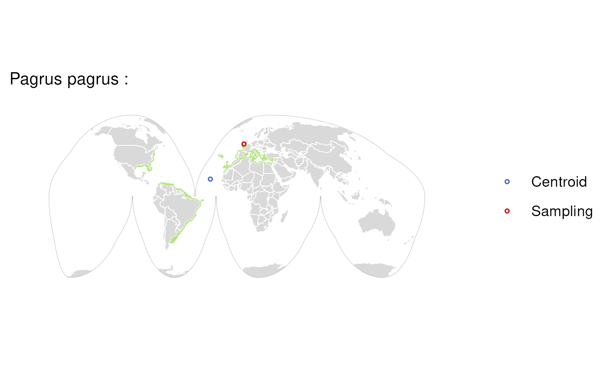

### Panthera onca

**Common Name:** jaguar\
**Biosample:** SAMN44524170\
**Assembly Accession:** GCA_046562885.1\
**Taxon:** Mammals\
**Priority:** 6\
**Flags:** —

### Passer domesticus

**Common Name:** house sparrow\
**Biosample:** SAMN39255856\
**Assembly Accession:** GCA_036417665.1\
**Taxon:** Birds\
**Priority:** 6\
**Flags:** —

### Passerculus sandwichensis

**Common Name:** Savannah sparrow\
**Biosample:** SAMN35784765\
**Assembly Accession:** GCA_031885435.1\
**Taxon:** Birds\
**Priority:** 6\
**Flags:** —

### Pelecanus crispus

**Common Name:** dalmatian pelican\
**Biosample:** SAMN35784560\
**Assembly Accession:** GCA_030463565.1\
**Taxon:** Birds\
**Priority:** 6\
**Flags:** Zoo/Aquarium sample

**Biosample provider:** Copenhagen Zoo\
**Collected by:** Mads Bertelsen\
**Biosample comments:** The Dalmatian pelican (Pelecanus crispus) is the largest member of the pelican family, and one of the world’s largest freshwater birds, with wingspans rivaling those of the great albatrosses. Their range spans much of Central Eurasia, from the Mediterranean in the West to the Taiwan Strait in the East, and from the Persian Gulf in the South to Siberia in the North (modified from Wikipedia entry). This sample from a female in the Copenhagen Zoo, in Denmark, was procured by Mads Bertelsen, and coordinated by Tom Gilbert and Erich Jarvis to be used to generate a high-quality reference genome for the Vertebrate Genomes Project (VGP). Sequencing and genome assembly were conducted at the Vertebrate Genomes Lab (VGL) at the Rockefeller University, led by Olivier Fedrigo and Erich D. Jarvis, with funding support from Gilbert and Jarvis.\
**Location:** Denmark: Copenhagen Zoo

### Pelobates fuscus

**Common Name:** common spadefoot toad\
**Biosample:** SAMN39244120\
**Assembly Accession:** GCA_036172605.1\
**Taxon:** Amphibians\
**Priority:** 6\
**Flags:** —

### Pelodytes ibericus

**Common Name:** Iberian parsley frog\
**Biosample:** SAMN37110875\
**Assembly Accession:** GCA_036172795.1\
**Taxon:** Amphibians\
**Priority:** 6\
**Flags:** —

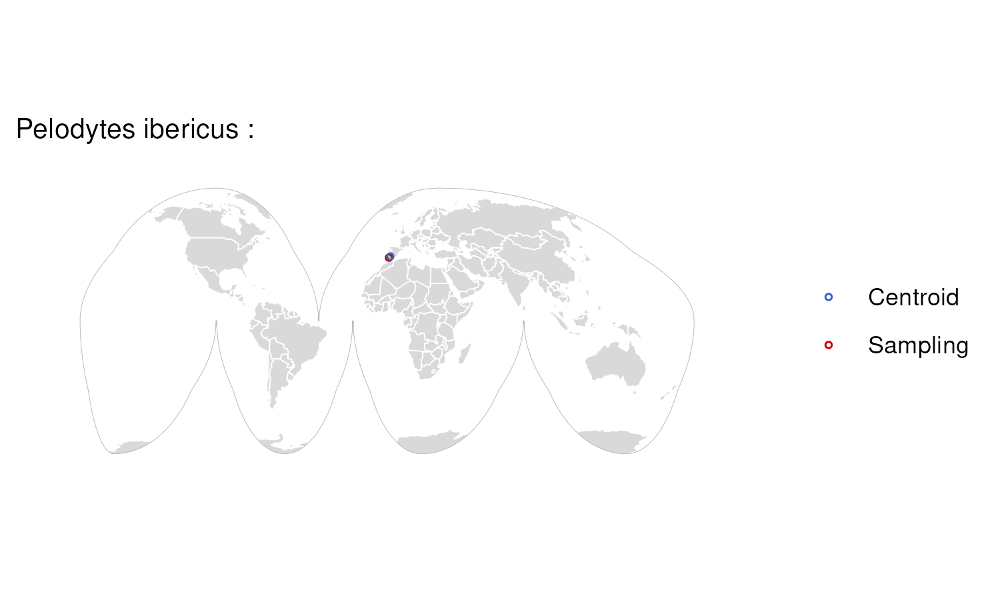

### Pempheris klunzingeri

**Common Name:** rough bullseye\
**Biosample:** SAMN40589649\
**Assembly Accession:** GCA_042242105.1\
**Taxon:** Fishes\
**Priority:** 6\
**Flags:** Missing range raster

### Periophthalmus magnuspinnatus

**Common Name:** Korean giant-fin mudskipper\
**Biosample:** SAMN12629500\
**Assembly Accession:** GCA_009829125.3\
**Taxon:** Fishes\
**Priority:** 6\
**Flags:** —

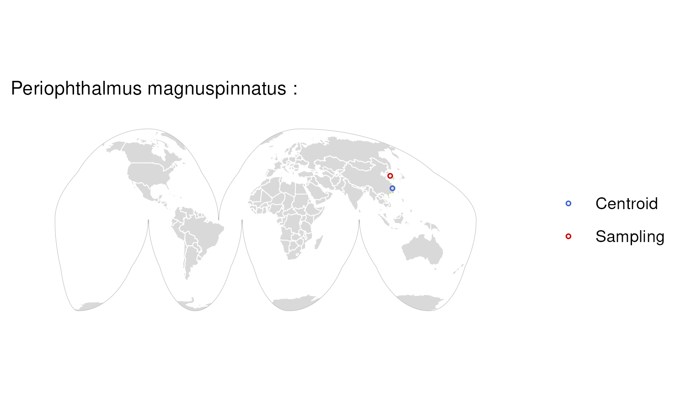

### Peromyscus maniculatus

**Common Name:** deer mouse\
**Biosample:** SAMN29044276\
**Assembly Accession:** GCA_026229955.1\
**Taxon:** Mammals\
**Priority:** 6\
**Flags:** —

### Petromyzon marinus

**Common Name:** sea lamprey\
**Biosample:** SAMN46926778\
**Assembly Accession:** GCA_048934315.1\
**Taxon:** Fishes\
**Priority:** 6\
**Flags:** —

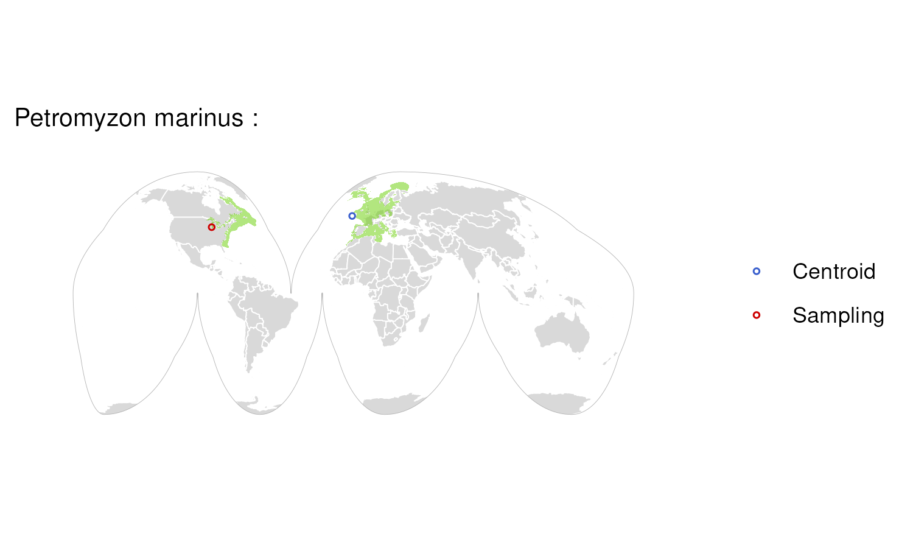

### Phaethon aethereus

**Common Name:** red-billed tropicbird\
**Biosample:** SAMEA8228673\
**Assembly Accession:** GCA_964289735.1\
**Taxon:** Birds\
**Priority:** 6\
**Flags:** —

### Phaethornis superciliosus

**Common Name:** long-tailed hermit\
**Biosample:** SAMN23532249\
**Assembly Accession:** GCA_023637945.2\
**Taxon:** Birds\
**Priority:** 6\
**Flags:** —

### Phalacrocorax carbo

**Common Name:** great cormorant\
**Biosample:** SAMEA8228692\
**Assembly Accession:** GCA_963921805.1\
**Taxon:** Birds\
**Priority:** 6\
**Flags:** —

### Phocoena phocoena

**Common Name:** harbor porpoise\
**Biosample:** SAMEA111380536\
**Assembly Accession:** GCA_963924675.1\
**Taxon:** Mammals\
**Priority:** 6\
**Flags:** —

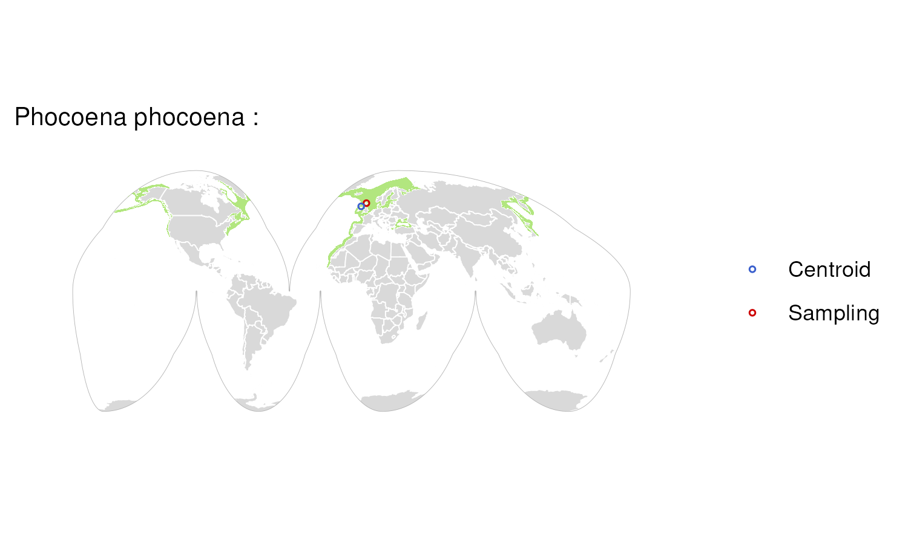

### Phocoena sinus

**Common Name:** vaquita\
**Biosample:** SAMN12325353\
**Assembly Accession:** GCA_008692025.1\
**Taxon:** Mammals\
**Priority:** 6\
**Flags:** —

### Phoenicopterus ruber

**Common Name:** American flamingo\
**Biosample:** SAMN12614931\
**Assembly Accession:** GCA_009819775.1\
**Taxon:** Birds\
**Priority:** 6\
**Flags:** Zoo/Aquarium sample

**Biosample provider:** Copenhagen Zoo, Denmark\
**Collected by:** Mads Bertelsen\
**Biosample comments:** The American Flamingo (Phoenicopterus ruber) is found throughout the Caribbean and is a non-migratory bird. It is a highly social bird that breeds in large colonies. Its characteristic pink-orange color is caused by carotenoid pigements in the food (shrimp, plankton, algae, and crustaceans) they eat. This sample was collected by Mads Bertelsen from a female (leg band GZG) that lived at the Copenhagen Zoo in Denmark, and procured by Tom Gilbert to generate a chromosome level reference assembly as part of the G10K-VGP and B10K Projects.\
**Location:** Denmark: Copenhagen Zoo

### Pholis gunnellus

**Common Name:** rock gunnel\
**Biosample:** SAMEA7522838\
**Assembly Accession:** GCA_910591455.2\
**Taxon:** Fishes\
**Priority:** 6\
**Flags:** Missing range raster

### Phoxinus phoxinus

**Common Name:** Eurasian minnow\
**Biosample:** SAMEA11296539\
**Assembly Accession:** GCA_949152265.1\
**Taxon:** Fishes\
**Priority:** 6\
**Flags:** —

### Pipistrellus hanaki

**Common Name:** Hanaki’s dwarf bat\
**Biosample:** SAMEA115799862\
**Assembly Accession:** GCA_964339955.1\
**Taxon:** Mammals\
**Priority:** 6\
**Flags:** —

### Pipistrellus kuhlii

**Common Name:** Kuhl’s pipistrelle\
**Biosample:** SAMN14734388\
**Assembly Accession:** GCA_014108245.1\
**Taxon:** Mammals\
**Priority:** 6\
**Flags:** —

### Pipistrellus nathusii

**Common Name:** Nathusius’s pipistrelle\
**Biosample:** SAMEA115534661\
**Assembly Accession:** GCA_964656225.1\
**Taxon:** Mammals\
**Priority:** 6\
**Flags:** Zoo/Aquarium sample

### Pipistrellus pygmaeus

**Common Name:** soprano pipistrelle\
**Biosample:** SAMEA9921456\
**Assembly Accession:** GCA_949987585.1\
**Taxon:** Mammals\
**Priority:** 6\
**Flags:** —

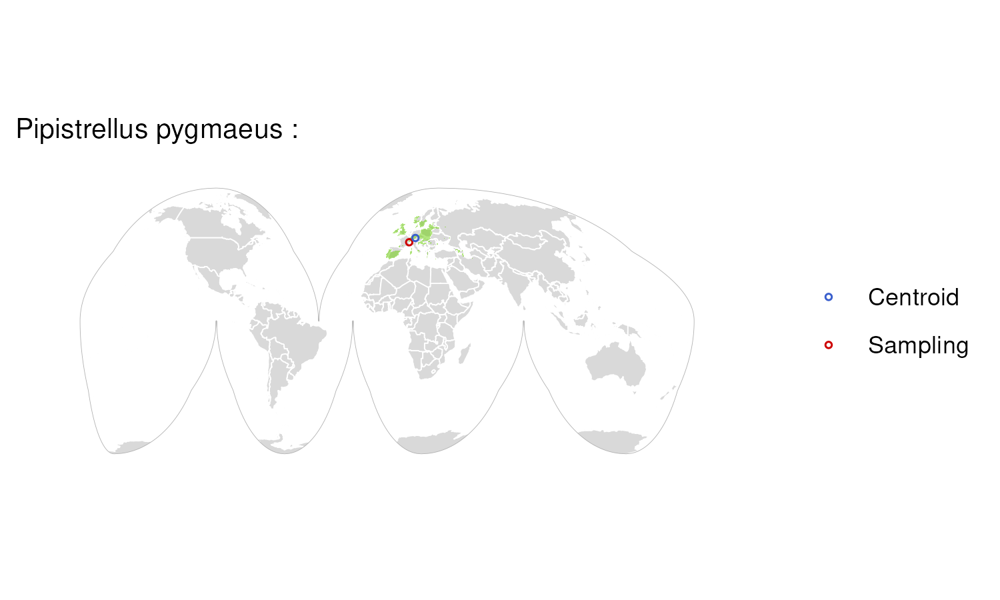

### Platichthys flesus

**Common Name:** European flounder\
**Biosample:** SAMEA110026475\
**Assembly Accession:** GCA_949316205.1\
**Taxon:** Fishes\
**Priority:** 6\
**Flags:** —

### Plecotus auritus

**Common Name:** brown big-eared bat\
**Biosample:** SAMEA110056142\
**Assembly Accession:** GCA_963455305.1\
**Taxon:** Mammals\
**Priority:** 6\
**Flags:** —

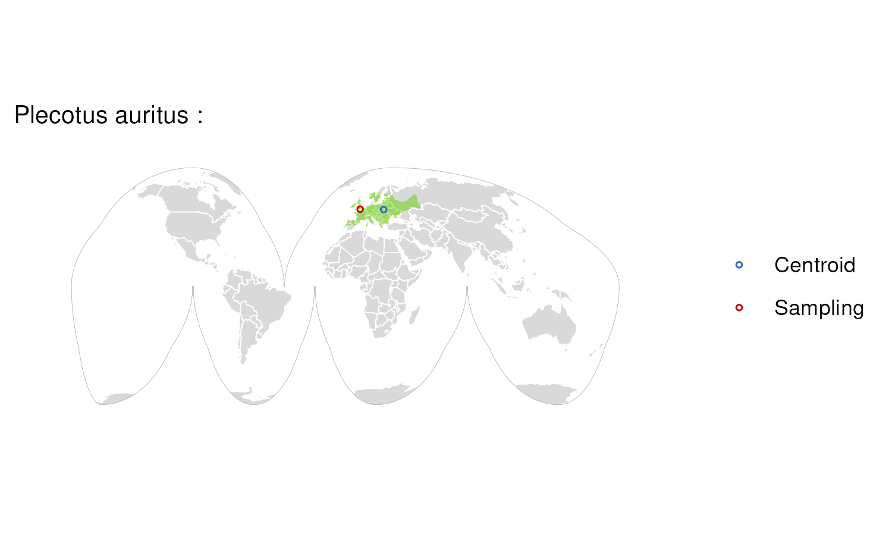

### Pleuronectes platessa

**Common Name:** European plaice\
**Biosample:** SAMEA13853390\
**Assembly Accession:** GCA_947347685.1\
**Taxon:** Fishes\
**Priority:** 6\
**Flags:** —

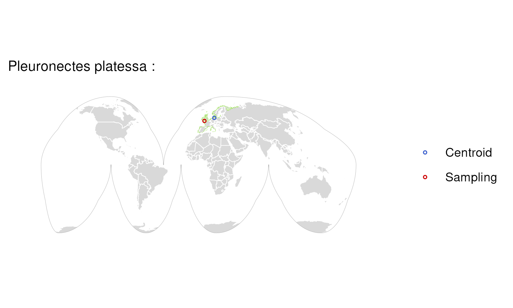

### Pluvialis apricaria

**Common Name:** European golden plover\
**Biosample:** SAMN18353970\
**Assembly Accession:** GCA_017639485.1\
**Taxon:** Birds\
**Priority:** 6\
**Flags:** —

### Podarcis bocagei

**Common Name:** Bocage’s wall lizard\
**Biosample:** SAMEA115336769\
**Assembly Accession:** GCA_964188305.1\
**Taxon:** Reptiles\
**Priority:** 6\
**Flags:** —

### Podarcis cretensis

**Common Name:** Cretan wall lizard\
**Biosample:** SAMEA12110019\
**Assembly Accession:** GCA_951804945.1\
**Taxon:** Reptiles\
**Priority:** 6\
**Flags:** —

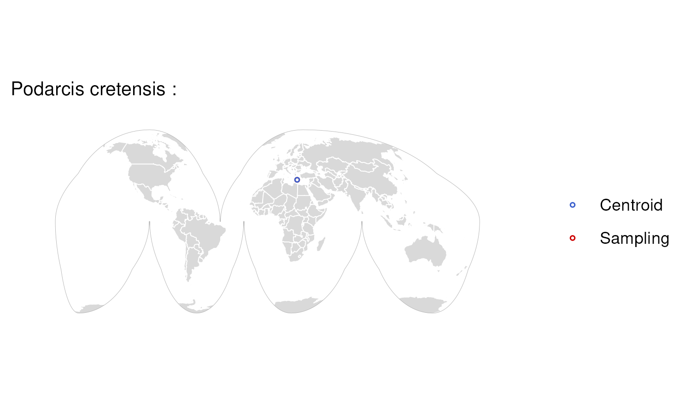

### Podarcis erhardii

**Common Name:** Aegean wall lizard\
**Biosample:** SAMEA115336771\
**Assembly Accession:** GCA_964252035.1\
**Taxon:** Reptiles\
**Priority:** 6\
**Flags:** —

### Podarcis filfolensis

**Common Name:** Filfola wall lizard\
**Biosample:** SAMEA113403362\
**Assembly Accession:** GCA_964270895.1\
**Taxon:** Reptiles\
**Priority:** 6\
**Flags:** —

### Podarcis gaigeae

**Common Name:** Skyros wall lizard\
**Biosample:** SAMEA114217796\
**Assembly Accession:** GCA_964106915.2\
**Taxon:** Reptiles\
**Priority:** 6\
**Flags:** —

### Podarcis liolepis

**Common Name:** Columbretes wall lizard\
**Biosample:** SAMEA114217798\
**Assembly Accession:** GCA_965112155.1\
**Taxon:** Reptiles\
**Priority:** 6\
**Flags:** —

### Podarcis melisellensis

**Common Name:** Dalmatian wall lizard\
**Biosample:** SAMEA115336775\
**Assembly Accession:** GCA_964234715.1\
**Taxon:** Reptiles\
**Priority:** 6\
**Flags:** —

### Podarcis muralis

**Common Name:** common wall lizard\
**Biosample:** SAMEA115336776\
**Assembly Accession:** GCA_964188315.1\
**Taxon:** Reptiles\
**Priority:** 6\
**Flags:** —

### Podarcis pityusensis

**Common Name:** Ibiza wall lizard\
**Biosample:** SAMEA114217797\
**Assembly Accession:** GCA_964106645.2\
**Taxon:** Reptiles\
**Priority:** 6\
**Flags:** —

### Podarcis siculus

**Common Name:** Italian wall lizard\
**Biosample:** SAMEA115336774\
**Assembly Accession:** GCA_964188175.1\
**Taxon:** Reptiles\
**Priority:** 6\
**Flags:** —

### Podarcis tiliguerta

**Common Name:** Tyrrhenian wall lizard\
**Biosample:** SAMEA114217799\
**Assembly Accession:** GCA_965153285.1\
**Taxon:** Reptiles\
**Priority:** 6\
**Flags:** —

### Podarcis vaucheri

**Common Name:** Andalusian wall lizard\
**Biosample:** SAMEA115336770\
**Assembly Accession:** GCA_965113315.1\
**Taxon:** Reptiles\
**Priority:** 6\
**Flags:** —

### Podargus strigoides

**Common Name:** tawny frogmouth\
**Biosample:** SAMN31801959\
**Assembly Accession:** GCA_028020825.1\
**Taxon:** Birds\
**Priority:** 6\
**Flags:** —

### Podocnemis expansa

**Common Name:** arrau turtle\
**Biosample:** SAMN44516642\
**Assembly Accession:** GCA_045364815.1\
**Taxon:** Reptiles\
**Priority:** 6\
**Flags:** Missing range raster

### Poecile atricapillus

**Common Name:** black-capped chickadee\
**Biosample:** SAMN35074507\
**Assembly Accession:** GCA_030490865.1\
**Taxon:** Birds\
**Priority:** 6\
**Flags:** —

### Pogoniulus pusillus

**Common Name:** red-fronted tinkerbird\
**Biosample:** SAMN15098508\
**Assembly Accession:** GCA_015220805.1\
**Taxon:** Birds\
**Priority:** 6\
**Flags:** —

### Pollachius pollachius

**Common Name:** European pollock\
**Biosample:** SAMEA111562038\
**Assembly Accession:** GCA_949987615.1\
**Taxon:** Fishes\
**Priority:** 6\
**Flags:** —

### Polymixia cf. hollisterae

**Common Name:** Bermuda beardfish\
**Biosample:** SAMN42899157\
**Assembly Accession:** GCA_048537225.1\
**Taxon:** Fishes\
**Priority:** 6\
**Flags:** Missing range raster

### Pristiophorus japonicus

**Common Name:** Japanese sawshark\
**Biosample:** SAMN44116980\
**Assembly Accession:** GCA_044704955.1\
**Taxon:** Fishes\
**Priority:** 6\
**Flags:** —

### Pristipomoides typus

**Common Name:** sharptooth jobfish\
**Biosample:** SAMN40589651\
**Assembly Accession:** GCA_045363895.1\
**Taxon:** Fishes\
**Priority:** 6\
**Flags:** —

### Pristis pectinata

**Common Name:** smalltooth sawfish\
**Biosample:** SAMN12629505\
**Assembly Accession:** GCA_009764475.2\
**Taxon:** Fishes\
**Priority:** 6\
**Flags:** —

### Protomyctophum bolini

**Common Name:** Bolin’s lanternfish\
**Biosample:** SAMEA12815434\
**Assembly Accession:** GCA_963924005.1\
**Taxon:** Fishes\
**Priority:** 6\
**Flags:** —

### Protomyctophum parallelum

**Common Name:** parallel lanternfish\
**Biosample:** SAMEA12815440\
**Assembly Accession:** GCA_964188405.1\
**Taxon:** Fishes\
**Priority:** 6\
**Flags:** —

### Pseudorca crassidens

**Common Name:** false killer whale\
**Biosample:** SAMN41253811\
**Assembly Accession:** GCA_039906515.1\
**Taxon:** Mammals\
**Priority:** 6\
**Flags:** —

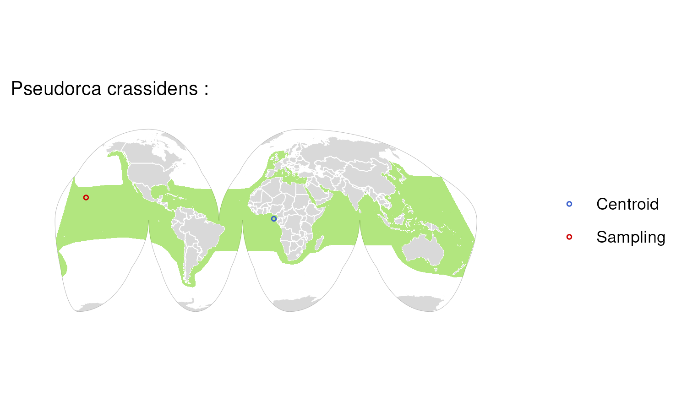

### Psittacula echo

**Common Name:** Mauritius parakeet\
**Biosample:** SAMEA12361725\
**Assembly Accession:** GCA_963264785.1\
**Taxon:** Birds\
**Priority:** 6\
**Flags:** —

### Pterocles gutturalis

**Common Name:** yellow-throated sandgrouse\
**Biosample:** SAMN12623217\
**Assembly Accession:** GCA_009769525.1\
**Taxon:** Birds\
**Priority:** 6\
**Flags:** —

### Pungitius pungitius

**Common Name:** ninespine stickleback\
**Biosample:** SAMEA11296545\
**Assembly Accession:** GCA_949316345.1\
**Taxon:** Fishes\
**Priority:** 6\
**Flags:** —

### Raja brachyura

**Common Name:** blonde ray\
**Biosample:** SAMEA110450105\
**Assembly Accession:** GCA_963514005.1\
**Taxon:** Fishes\
**Priority:** 6\
**Flags:** —

### Rana temporaria

**Common Name:** European common frog\
**Biosample:** SAMEA7521635\
**Assembly Accession:** GCA_905171775.1\
**Taxon:** Amphibians\
**Priority:** 6\
**Flags:** —

### Rattus norvegicus

**Common Name:** Norway rat\
**Biosample:** SAMN16261960\
**Assembly Accession:** GCA_015227675.2\
**Taxon:** Mammals\
**Priority:** 6\
**Flags:** —

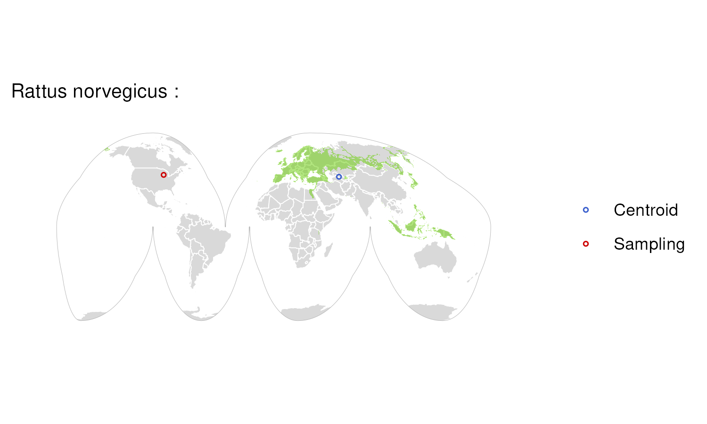

### Rhamphochromis chilingali

**Common Name:** Chilingali cichlid\
**Biosample:** SAMEA112818853\
**Assembly Accession:** GCA_963969265.1\
**Taxon:** Fishes\
**Priority:** 6\
**Flags:** Missing range raster

### Rhea pennata

**Common Name:** lesser rhea\
**Biosample:** SAMN32606345\
**Assembly Accession:** GCA_028389875.1\
**Taxon:** Birds\
**Priority:** 6\
**Flags:** Zoo/Aquarium sample

**Biosample provider:** Oliver Ryder, San Diego Zoo Global\
**Collected by:** San Diego Zoo\
**Biosample comments:** Darwin’s rhea or the lesser rhea (Pterocnemia pennata) is a large flightless bird, the smaller of the two extant species of rheas. It is found in the Altiplano and Patagonia in South America (Wikipedia entry). Two alternative scientific names have been used for this species, Pterocnemia pennata and Rhea pennata. This sample is from a male collected in San Diego Zoo, California, coordinated by Oliver Ryder, and used to generate a high-quality reference for the Vertebrate Genomes Project (VGP). Sequencing and genome assembly were conducted in the Vertebrate Genome Lab at the Rockefeller University, led by Olivier Fedrigo and Erich D. Jarvis.\
**Location:** USA: San Diego Zoo

### Rhineura floridana

**Common Name:** Florida worm lizard\
**Biosample:** SAMN34105704\
**Assembly Accession:** GCA_030035675.1\
**Taxon:** Reptiles\
**Priority:** 6\
**Flags:** —

### Rhinogobio nasutus

**Common Name:** Rhinogobio nasutus\
**Biosample:** SAMN45903276\
**Assembly Accession:** GCA_048301585.1\
**Taxon:** Fishes\
**Priority:** 6\
**Flags:** Missing range raster

### Rhinolophus affinis

**Common Name:** intermediate horseshoe bat\
**Biosample:** SAMN33388345\
**Assembly Accession:** GCA_043728065.1\
**Taxon:** Mammals\
**Priority:** 6\
**Flags:** —

### Rhinolophus ferrumequinum

**Common Name:** greater horseshoe bat\
**Biosample:** SAMN09948510\
**Assembly Accession:** GCA_004115265.3\
**Taxon:** Mammals\
**Priority:** 6\
**Flags:** —

### Rhinolophus hipposideros

**Common Name:** lesser horseshoe bat\
**Biosample:** SAMEA113980802\
**Assembly Accession:** GCA_964194185.1\
**Taxon:** Mammals\
**Priority:** 6\
**Flags:** —

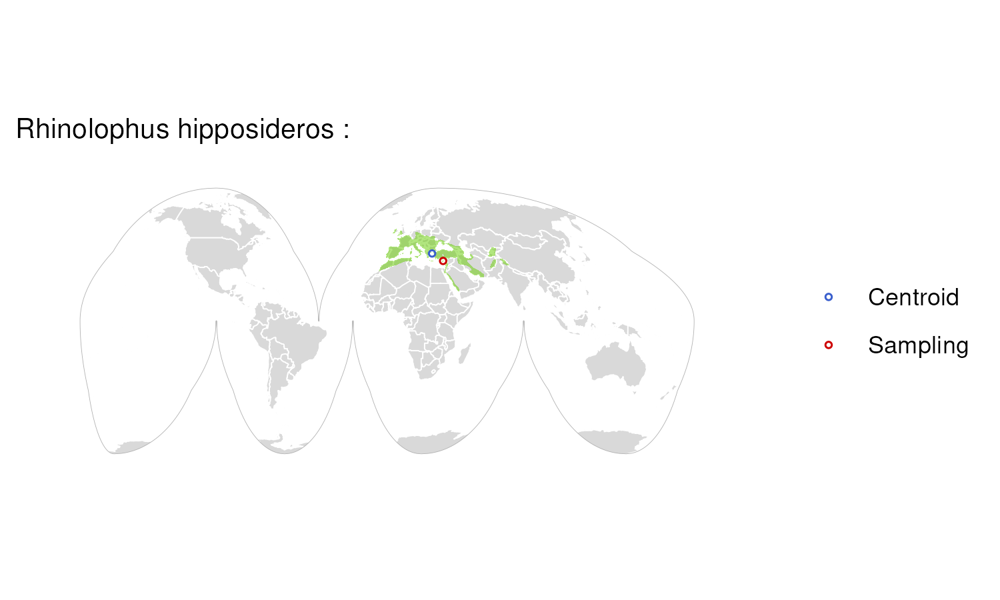

### Rhinolophus trifoliatus

**Common Name:** trefoil horseshoe bat\
**Biosample:** SAMN33421007\
**Assembly Accession:** GCA_043728145.1\
**Taxon:** Mammals\
**Priority:** 6\
**Flags:** —

### Rhinolophus yonghoiseni

**Common Name:** Yong hoi sen’s woolly horseshoe bat\
**Biosample:** SAMN33413875\
**Assembly Accession:** GCA_043880425.1\
**Taxon:** Mammals\
**Priority:** 6\
**Flags:** Missing range raster

### Rhinophrynus dorsalis

**Common Name:** Mexican burrowing toad\
**Biosample:** SAMN40302865\
**Assembly Accession:** GCA_037306005.1\
**Taxon:** Amphibians\
**Priority:** 6\
**Flags:** —

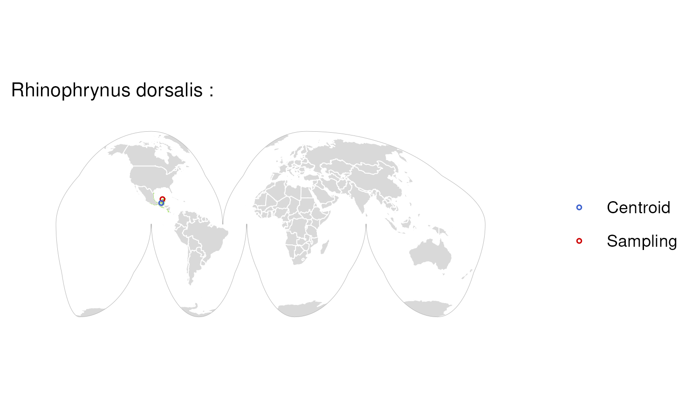

### Rhinopoma microphyllum

**Common Name:** Greater mouse-tailed bat\
**Biosample:** SAMN33421188\
**Assembly Accession:** GCA_043880545.1\
**Taxon:** Mammals\
**Priority:** 6\
**Flags:** —

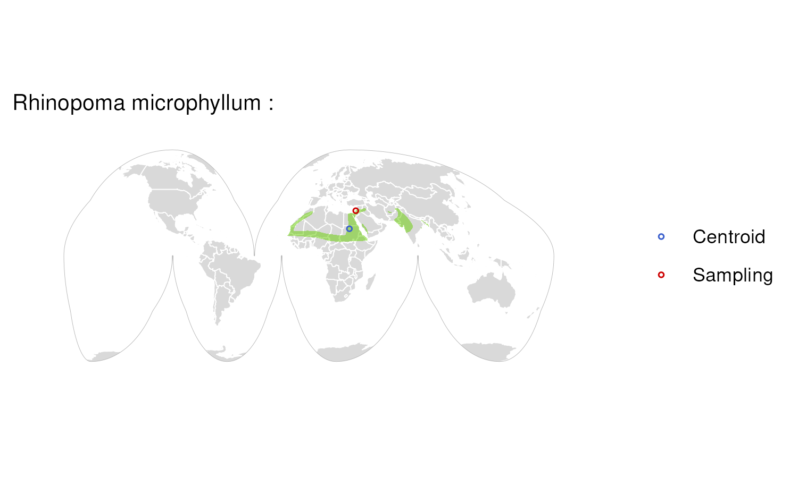

### Rhynchonycteris naso

**Common Name:** proboscis bat\
**Biosample:** SAMN39947078\
**Assembly Accession:** GCA_037038545.1\
**Taxon:** Mammals\
**Priority:** 6\
**Flags:** —

### Rhynochetos jubatus

**Common Name:** Kagu\
**Biosample:** SAMN31802033\
**Assembly Accession:** GCA_027574665.1\
**Taxon:** Birds\
**Priority:** 6\
**Flags:** Zoo/Aquarium sample

### Rissa tridactyla

**Common Name:** black-legged kittiwake\
**Biosample:** SAMN32104255\
**Assembly Accession:** GCA_028500815.1\
**Taxon:** Birds\
**Priority:** 6\
**Flags:** —

### Rutilus rutilus

**Common Name:** roach minnow\
**Biosample:** SAMEA11296543\
**Assembly Accession:** GCA_951802725.1\
**Taxon:** Fishes\
**Priority:** 6\
**Flags:** —

### Saccopteryx bilineata

**Common Name:** greater sac-winged bat\
**Biosample:** SAMN37288508\
**Assembly Accession:** GCA_036850765.1\
**Taxon:** Mammals\
**Priority:** 6\
**Flags:** —

### Saccopteryx leptura

**Common Name:** lesser sac-winged bat\
**Biosample:** SAMN37390139\
**Assembly Accession:** GCA_036850995.1\
**Taxon:** Mammals\
**Priority:** 6\
**Flags:** —

### Salminus brasiliensis

**Common Name:** golden dorado\
**Biosample:** SAMN35075251\
**Assembly Accession:** GCA_030463535.1\
**Taxon:** Fishes\
**Priority:** 6\
**Flags:** —

### Salvelinus alpinus

**Common Name:** Arctic char\
**Biosample:** SAMN36900063\
**Assembly Accession:** GCA_036784965.1\
**Taxon:** Fishes\
**Priority:** 6\
**Flags:** —

### Sarcoramphus papa

**Common Name:** king vulture\
**Biosample:** SAMN40647026\
**Assembly Accession:** GCA_037962945.1\
**Taxon:** Birds\
**Priority:** 6\
**Flags:** —

### Sardina pilchardus

**Common Name:** sardine\
**Biosample:** SAMEA111562172\
**Assembly Accession:** GCA_963854185.1\
**Taxon:** Fishes\
**Priority:** 6\
**Flags:** —

### Scardinius erythrophthalmus

**Common Name:** common rudd\
**Biosample:** SAMEA11296541\
**Assembly Accession:** GCA_964197995.1\
**Taxon:** Fishes\
**Priority:** 6\
**Flags:** —

### Scatophagus argus

**Common Name:** spotted scat\
**Biosample:** SAMN12623616\
**Assembly Accession:** GCA_020382885.1\
**Taxon:** Fishes\
**Priority:** 6\
**Flags:** —

### Scomber japonicus

**Common Name:** Pacific chub mackerel\
**Biosample:** SAMN32224830\
**Assembly Accession:** GCA_027409825.1\
**Taxon:** Fishes\
**Priority:** 6\
**Flags:** —

### Scomber scombrus

**Common Name:** Atlantic mackerel\
**Biosample:** SAMEA110450232\
**Assembly Accession:** GCA_963691925.1\
**Taxon:** Fishes\
**Priority:** 6\
**Flags:** —

### Scophthalmus maximus

**Common Name:** turbot\
**Biosample:** SAMEA110450106\
**Assembly Accession:** GCA_963854745.1\
**Taxon:** Fishes\
**Priority:** 6\
**Flags:** —

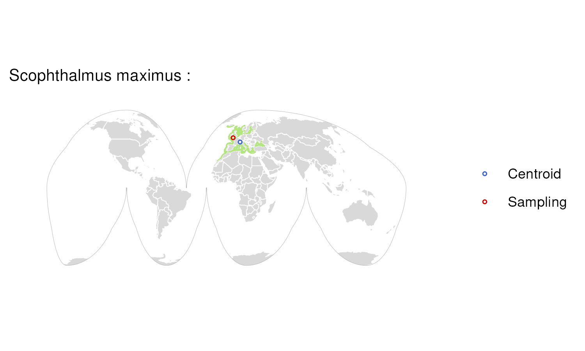

### Sebastes fasciatus

**Common Name:** Acadian redfish\
**Biosample:** SAMN43039489\
**Assembly Accession:** GCA_043250625.1\
**Taxon:** Fishes\
**Priority:** 6\
**Flags:** Missing range raster

### Sebastes umbrosus

**Common Name:** honeycomb rockfish\
**Biosample:** SAMN12629503\
**Assembly Accession:** GCA_015220745.1\
**Taxon:** Fishes\
**Priority:** 6\
**Flags:** Missing range raster

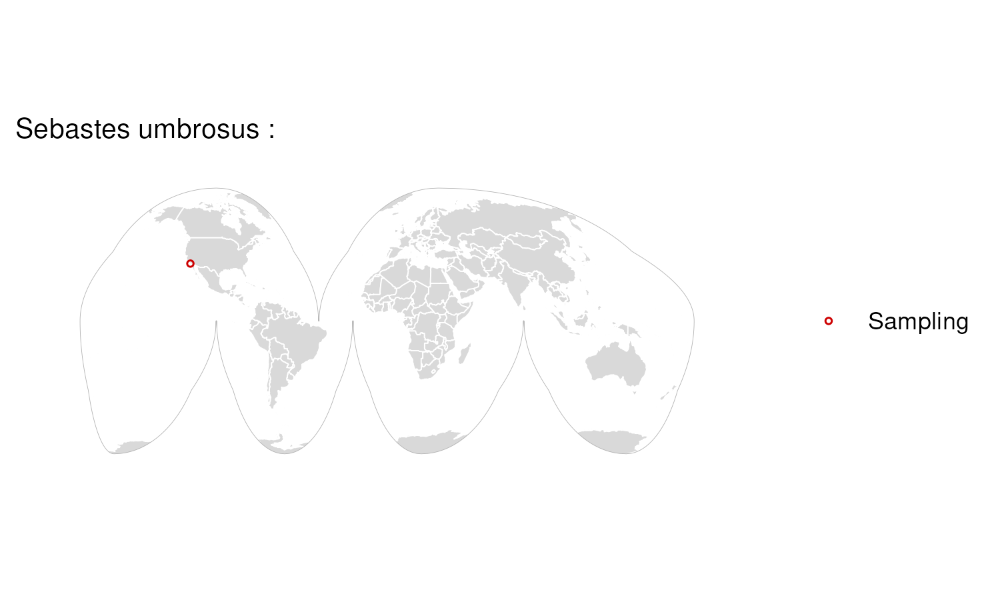

### Shinisaurus crocodilurus

**Common Name:** Chinese crocodile lizard\
**Biosample:** SAMN19072228\
**Assembly Accession:** GCA_021292165.1\
**Taxon:** Reptiles\
**Priority:** 6\
**Flags:** —

### Sminthopsis crassicaudata

**Common Name:** fat-tailed dunnart\
**Biosample:** SAMN47327922\
**Assembly Accession:** GCA_048593235.1\
**Taxon:** Mammals\
**Priority:** 6\
**Flags:** —

### Solea solea

**Common Name:** common sole\
**Biosample:** SAMEA10984647\
**Assembly Accession:** GCA_958295425.1\
**Taxon:** Fishes\
**Priority:** 6\
**Flags:** —

### Sorex araneus

**Common Name:** European shrew\
**Biosample:** SAMN32477717\
**Assembly Accession:** GCA_027595985.1\
**Taxon:** Mammals\
**Priority:** 6\
**Flags:** —

### Spea bombifrons

**Common Name:** plain spadefoot toad\
**Biosample:** SAMN28408467\
**Assembly Accession:** GCA_027358695.2\
**Taxon:** Amphibians\
**Priority:** 6\
**Flags:** —

### Spinachia spinachia

**Common Name:** sea stickleback\
**Biosample:** SAMN36735485\
**Assembly Accession:** GCA_048126635.1\
**Taxon:** Fishes\
**Priority:** 6\
**Flags:** Zoo/Aquarium sample

### Sprattus sprattus

**Common Name:** European sprat\
**Biosample:** SAMEA111562173\
**Assembly Accession:** GCA_963457725.1\
**Taxon:** Fishes\
**Priority:** 6\
**Flags:** —

### Squalius cephalus

**Common Name:** European chub\
**Biosample:** SAMEA11296547\
**Assembly Accession:** GCA_949319135.1\
**Taxon:** Fishes\
**Priority:** 6\
**Flags:** —

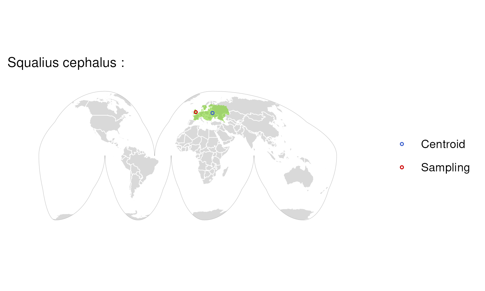

### Stegostoma tigrinum

**Common Name:** zebra shark\
**Biosample:** SAMN35823397\
**Assembly Accession:** GCA_030684315.1\
**Taxon:** Fishes\
**Priority:** 6\
**Flags:** —

### Stenella coeruleoalba

**Common Name:** striped dolphin\
**Biosample:** SAMEA111380539\
**Assembly Accession:** GCA_951394435.1\
**Taxon:** Mammals\
**Priority:** 6\
**Flags:** —

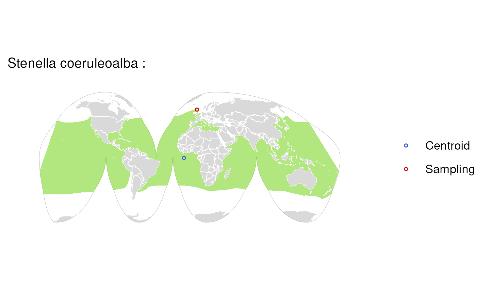

### Sterna hirundo

**Common Name:** common tern\
**Biosample:** SAMN12369541\
**Assembly Accession:** GCA_009819605.1\
**Taxon:** Birds\
**Priority:** 6\
**Flags:** —

### Sternotherus odoratus

**Common Name:** Eastern musk turtle\
**Biosample:** SAMN36942441\
**Assembly Accession:** GCA_032164245.1\
**Taxon:** Reptiles\
**Priority:** 6\
**Flags:** —

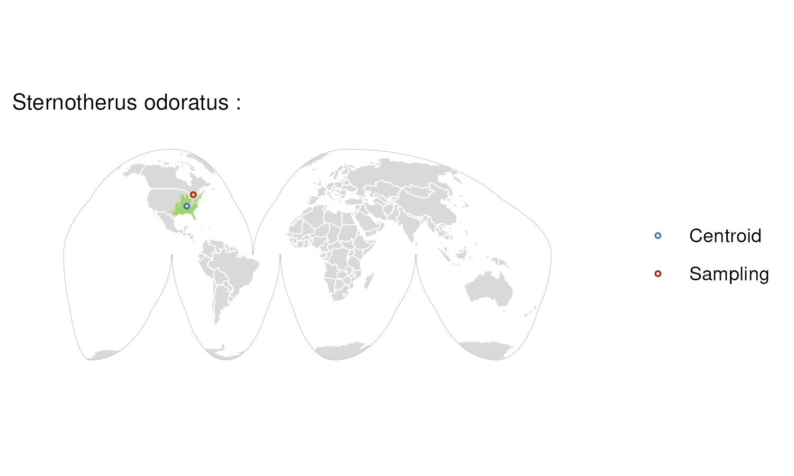

### Streptopelia decaocto

**Common Name:** Eurasian collared-dove\
**Biosample:** SAMEA113398962\
**Assembly Accession:** GCA_964273445.1\
**Taxon:** Birds\
**Priority:** 6\
**Flags:** —

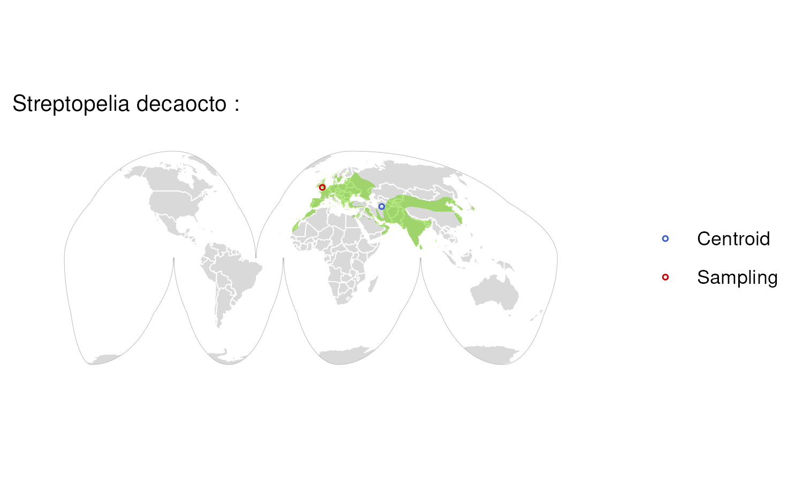

### Strigops habroptilus

**Common Name:** kakapo\
**Biosample:** SAMN09948751\
**Assembly Accession:** GCA_004027225.2\
**Taxon:** Birds\
**Priority:** 6\
**Flags:** —

### Strix aluco

**Common Name:** tawny owl\
**Biosample:** SAMN37055808\
**Assembly Accession:** GCA_031877795.1\
**Taxon:** Birds\
**Priority:** 6\
**Flags:** —

### Styela clava

**Common Name:** leathery sea squirt\
**Biosample:** SAMEA7536473\
**Assembly Accession:** GCA_964204865.1\
**Taxon:** Invertebrates\
**Priority:** 6\
**Flags:** Missing range raster

### Sylvia atricapilla

**Common Name:** European blackcap\
**Biosample:** SAMN12369542\
**Assembly Accession:** GCA_009819655.1\
**Taxon:** Birds\
**Priority:** 6\
**Flags:** —

### Sylvia borin

**Common Name:** garden warbler\
**Biosample:** SAMN12618613\
**Assembly Accession:** GCA_014839755.1\
**Taxon:** Birds\
**Priority:** 6\
**Flags:** —

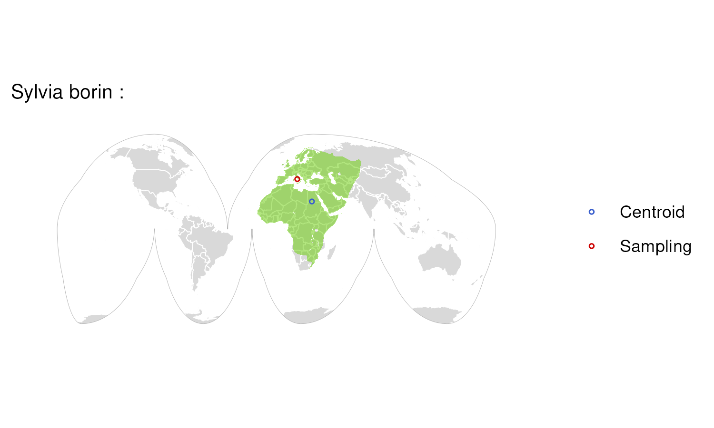

### Symphodus melops

**Common Name:** corkwing wrasse\
**Biosample:** SAMEA12219485\
**Assembly Accession:** GCA_947650265.1\
**Taxon:** Fishes\
**Priority:** 6\
**Flags:** —

### Synchiropus picturatus

**Common Name:** picturesque dragonet\
**Biosample:** SAMN43082350\
**Assembly Accession:** GCA_044231675.1\
**Taxon:** Fishes\
**Priority:** 6\
**Flags:** Zoo/Aquarium sample

**Biosample provider:** Josefin Stiller, University of Copenhagen\
**Collected by:** —\
**Biosample comments:** —\
**Location:** Denmark: National Aquarium Denmark

### Tachyglossus aculeatus

**Common Name:** short-beaked echidna\
**Biosample:** SAMN12634963\
**Assembly Accession:** GCA_015852505.1\
**Taxon:** Mammals\
**Priority:** 6\
**Flags:** —

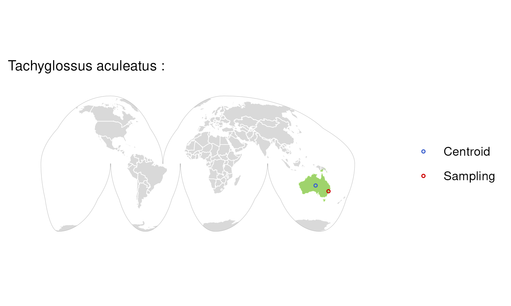

### Tadarida brasiliensis

**Common Name:** Brazilian free-tailed bat\
**Biosample:** SAMN35075070\
**Assembly Accession:** GCA_030848825.1\
**Taxon:** Mammals\
**Priority:** 6\
**Flags:** —

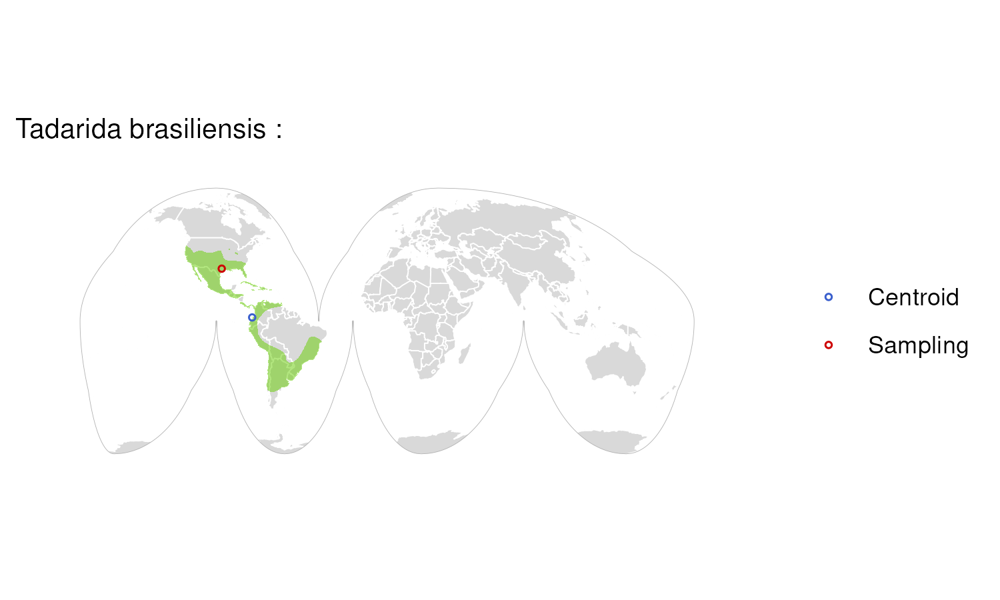

### Talpa europaea

**Common Name:** European mole\
**Biosample:** SAMEA112468127\
**Assembly Accession:** GCA_964194135.1\
**Taxon:** Mammals\
**Priority:** 6\
**Flags:** —

### Tamandua tetradactyla

**Common Name:** Southern tamandua\
**Biosample:** SAMN12612337\
**Assembly Accession:** GCA_023851605.1\
**Taxon:** Mammals\
**Priority:** 6\
**Flags:** —

### Tapirus indicus

**Common Name:** Malayan tapir\
**Biosample:** SAMN37096863\
**Assembly Accession:** GCA_031878705.1\
**Taxon:** Mammals\
**Priority:** 6\
**Flags:** Zoo/Aquarium sample

**Biosample provider:** —\
**Collected by:** Cynthia Steiner\
**Biosample comments:** The Malayan Tapir (Tapirus indicus) is the only living Tapir species outside of the Americas. It is native to Southeast Asia, from the Malay Peninsula to Sumatra. It is endangered since 2008, currently comprising fewer than 2,500 mature individuals (modified from Wikipedia entry). This sample is from a male born in the Philadelphia Zoo, USA, later transferred to the San Diego Zoo, where a blood sample was collected and supplied by Oliver Ryder and Cynthia Steiner to be used to generate a high-quality reference genome for the Vertebrate Genomes Project (VGP) and conservation research. Sequencing and genome assembly were conducted at the Vertebrate Genomes Lab (VGL) at the Rockefeller University, led by Olivier Fedrigo and Erich D. Jarvis.\
**Location:** USA: San Diego Zoo, San Diego

### Tauraco erythrolophus

**Common Name:** red-crested turaco\
**Biosample:** SAMN12621036\
**Assembly Accession:** GCA_009769465.1\
**Taxon:** Birds\
**Priority:** 6\
**Flags:** Zoo/Aquarium sample

**Biosample provider:** Copenhagen Zoo, Denmark\
**Collected by:** Mads Bertelsen\
**Biosample comments:** The Red-crested Turaco (Tauraco erythrolophus) is endemic to western Angola to Congo, Africa, and is the National bird of Angola. It has deep barking call that has been described to sound like a jungle monkey. It is named after its very colorful red crested feathers on its head. This sample was collected by Mads Bertelsen from a female that lived at the Copenhagen Zoo in Denmark and was used to generate a chromosome level reference assembly as part of the G10K-VGP and B10K Projects.\
**Location:** Denmark: Copenhagen Zoo

### Taurulus bubalis

**Common Name:** long-spined sea scorpion\
**Biosample:** SAMEA7522994\
**Assembly Accession:** GCA_910589615.1\
**Taxon:** Fishes\
**Priority:** 6\
**Flags:** —

### Tautogolabrus adspersus

**Common Name:** cunner\
**Biosample:** SAMN22589422\
**Assembly Accession:** GCA_020745685.1\
**Taxon:** Fishes\
**Priority:** 6\
**Flags:** —

### Telmatherina bonti

**Common Name:** telmatherina bonti\
**Biosample:** SAMEA8592627\
**Assembly Accession:** GCA_933228915.1\
**Taxon:** Fishes\
**Priority:** 6\
**Flags:** Zoo/Aquarium sample

**Biosample provider:** —\
**Collected by:** FABIAN HERDER\
**Biosample comments:** —\
**Location:** Bonn \| Zoological Research Museum Alexander Koenig Leibniz Institute for Animal Biodiversity

### Tetrao urogallus

**Common Name:** Western capercaillie\
**Biosample:** SAMEA9654429\
**Assembly Accession:** GCA_951394365.1\
**Taxon:** Birds\
**Priority:** 6\
**Flags:** —

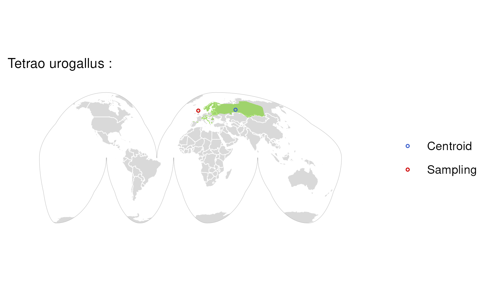

### Thalia democratica

**Common Name:** Thalia democratica\
**Biosample:** SAMEA111439782\
**Assembly Accession:** GCA_965202585.1\
**Taxon:** Invertebrates\
**Priority:** 6\
**Flags:** Missing range raster

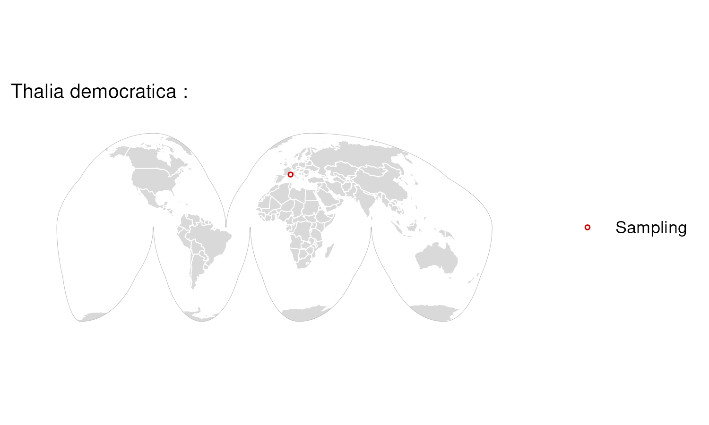

### Theristicus caerulescens

**Common Name:** plumbeous ibis\
**Biosample:** SAMN22550094\
**Assembly Accession:** GCA_020745775.1\
**Taxon:** Birds\
**Priority:** 6\
**Flags:** —

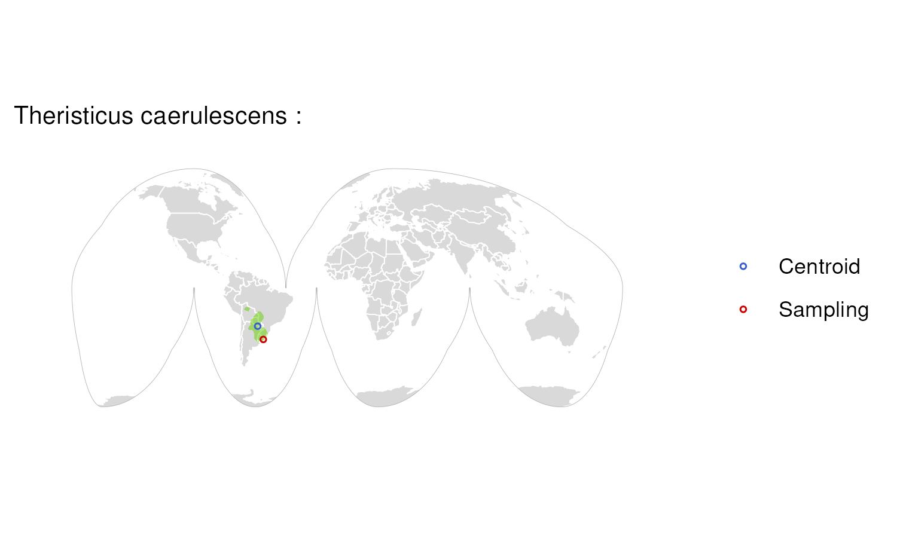

### Thomomys bottae

**Common Name:** Botta’s pocket gopher\
**Biosample:** SAMN37300244\
**Assembly Accession:** GCA_031878675.1\
**Taxon:** Mammals\
**Priority:** 6\
**Flags:** —

### Thunnus albacares

**Common Name:** yellowfin tuna\
**Biosample:** SAMEA8654749\
**Assembly Accession:** GCA_914725855.1\
**Taxon:** Fishes\
**Priority:** 6\
**Flags:** —

### Thunnus maccoyii

**Common Name:** southern bluefin tuna\
**Biosample:** SAMEA8654747\
**Assembly Accession:** GCA_910596095.1\
**Taxon:** Fishes\
**Priority:** 6\
**Flags:** —

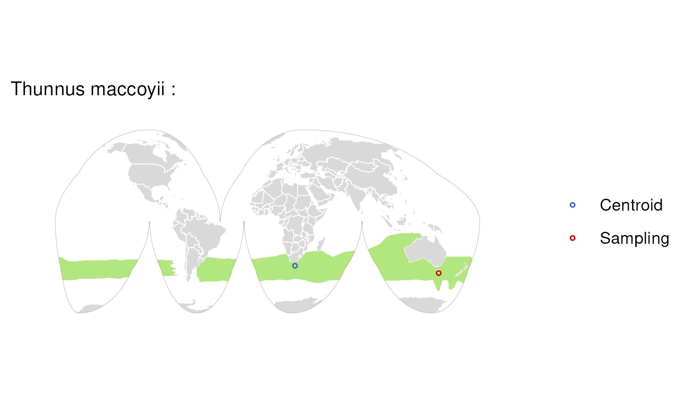

### Tiliqua scincoides

**Common Name:** blue-tongue skink\
**Biosample:** SAMN37319749\
**Assembly Accession:** GCA_035046505.1\
**Taxon:** Reptiles\
**Priority:** 6\
**Flags:** —

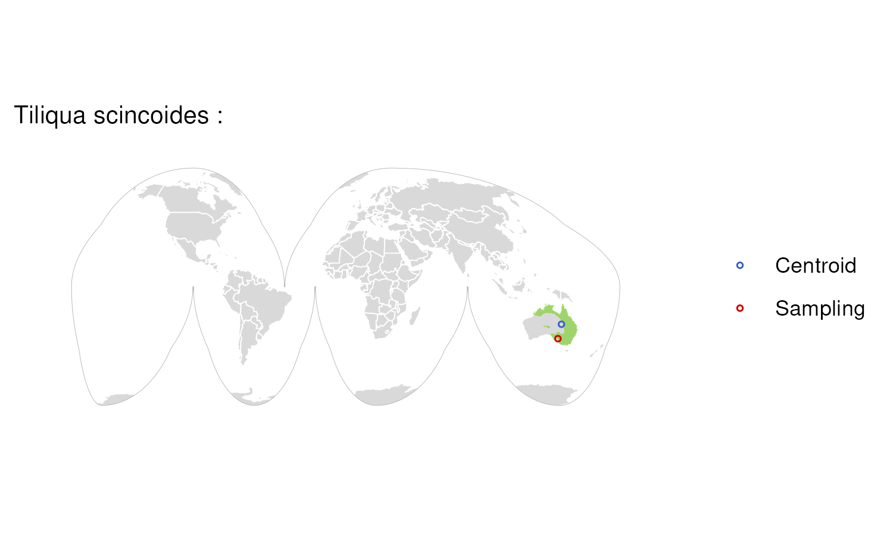

### Trachurus trachurus

**Common Name:** Atlantic horse mackerel\
**Biosample:** SAMEA7524396\
**Assembly Accession:** GCA_905171665.2\
**Taxon:** Fishes\
**Priority:** 6\
**Flags:** —

### Trichechus inunguis

**Common Name:** Amazon manatee\
**Biosample:** SAMN44524440\
**Assembly Accession:** GCA_046562895.1\
**Taxon:** Mammals\
**Priority:** 6\
**Flags:** —

### Trididemnum clinides

**Common Name:** Trididemnum clinides\
**Biosample:** SAMEA9873882\
**Assembly Accession:** GCA_963675345.1\
**Taxon:** Invertebrates\
**Priority:** 6\
**Flags:** Missing range raster

### Triturus cristatus

**Common Name:** warty newt\
**Biosample:** SAMEA112468129\
**Assembly Accession:** GCA_964204655.1\
**Taxon:** Amphibians\
**Priority:** 6\
**Flags:** —

### Trogon surrucura

**Common Name:** surucua trogon\
**Biosample:** SAMN22550082\
**Assembly Accession:** GCA_020746105.1\
**Taxon:** Birds\
**Priority:** 6\
**Flags:** —

### Tursiops truncatus

**Common Name:** bottlenose dolphin\
**Biosample:** SAMN12326775\
**Assembly Accession:** GCA_011762595.2\
**Taxon:** Mammals\
**Priority:** 6\
**Flags:** —

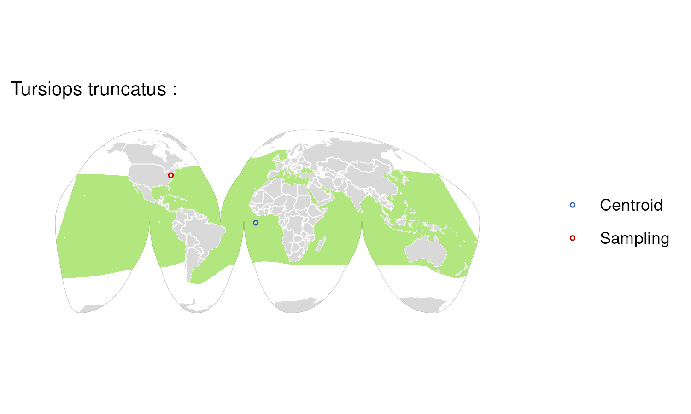

### Urocitellus parryii

**Common Name:** Arctic ground squirrel\
**Biosample:** SAMN44461866\
**Assembly Accession:** GCA_045843805.1\
**Taxon:** Mammals\
**Priority:** 6\
**Flags:** —

### Vanellus vanellus

**Common Name:** Northern Lapwing\
**Biosample:** SAMEA113398832\
**Assembly Accession:** GCA_965231255.1\
**Taxon:** Birds\
**Priority:** 6\
**Flags:** —

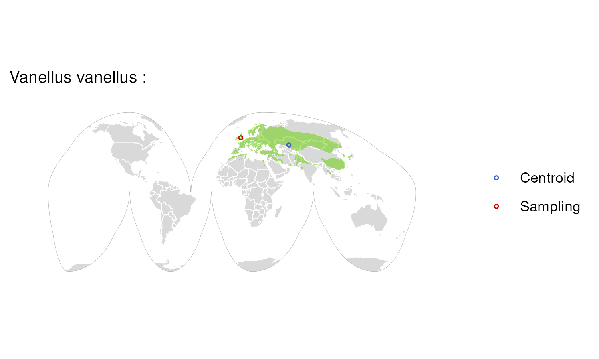

### Vespertilio murinus

**Common Name:** particolored bat\
**Biosample:** SAMEA112247422\
**Assembly Accession:** GCA_963924515.1\
**Taxon:** Mammals\
**Priority:** 6\
**Flags:** —

### Vidua chalybeata

**Common Name:** village indigobird\
**Biosample:** SAMN12254000\
**Assembly Accession:** GCA_026979565.1\
**Taxon:** Birds\
**Priority:** 6\
**Flags:** —

### Vipera berus

**Common Name:** adder\
**Biosample:** SAMEA114293681\
**Assembly Accession:** GCA_964194415.1\
**Taxon:** Reptiles\
**Priority:** 6\
**Flags:** —

### Vipera latastei

**Common Name:** snub-nosed viber\
**Biosample:** SAMN28408464\
**Assembly Accession:** GCA_024294585.1\
**Taxon:** Reptiles\
**Priority:** 6\
**Flags:** —

### Vipera ursinii

**Common Name:** Hungarian meadow viper\
**Biosample:** SAMEA12832258\
**Assembly Accession:** GCA_947247035.1\
**Taxon:** Reptiles\
**Priority:** 6\
**Flags:** Zoo/Aquarium sample

### Vulpes vulpes

**Common Name:** red fox\
**Biosample:** SAMEA113398840\
**Assembly Accession:** GCA_964106825.2\
**Taxon:** Mammals\
**Priority:** 6\
**Flags:** —

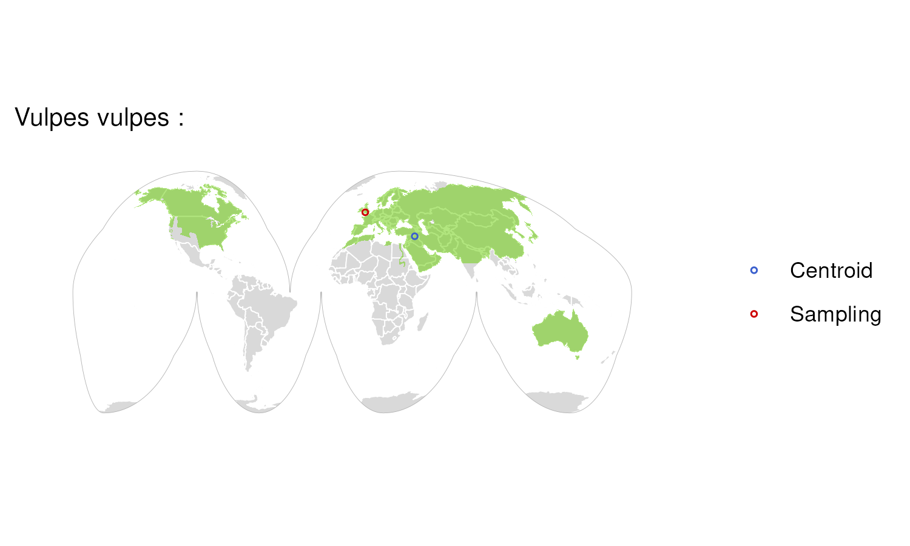

### Willisornis vidua

**Common Name:** Xingu scale-backed antbird\
**Biosample:** SAMN44516465\
**Assembly Accession:** GCA_045364795.1\
**Taxon:** Birds\
**Priority:** 6\
**Flags:** —

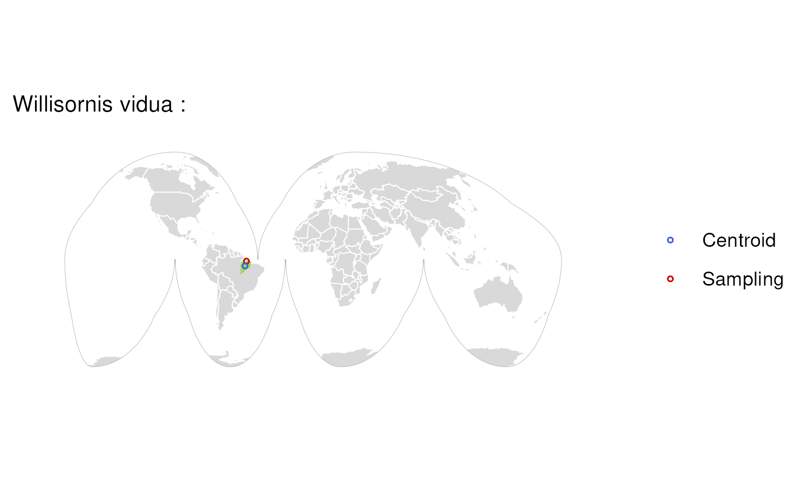

### Zalophus californianus

**Common Name:** California sea lion\
**Biosample:** SAMN12368149\
**Assembly Accession:** GCA_009762305.2\
**Taxon:** Mammals\
**Priority:** 6\
**Flags:** —

### Zeus faber

**Common Name:** John dory\
**Biosample:** SAMEA111562156\
**Assembly Accession:** GCA_960531495.1\
**Taxon:** Fishes\
**Priority:** 6\
**Flags:** —

### Zonotrichia albicollis

**Common Name:** white-throated sparrow\
**Biosample:** SAMN46390924\
**Assembly Accession:** GCA_047830755.1\
**Taxon:** Birds\
**Priority:** 6\
**Flags:** —

### Zootoca vivipara

**Common Name:** European common lizard\
**Biosample:** SAMEA111528662\
**Assembly Accession:** GCA_963506605.1\
**Taxon:** Reptiles\
**Priority:** 6\
**Flags:** —

### Zosterops lateralis

**Common Name:** silver-eye\
**Biosample:** SAMEA112953925\
**Assembly Accession:** GCA_965231275.1\
**Taxon:** Birds\
**Priority:** 6\
**Flags:** —

### Macaca fascicularis

**Common Name:** crab-eating macaque\
**Biosample:** SAMN38317298\
**Assembly Accession:** GCA_037993035.1\
**Taxon:** Mammals\
**Priority:** 7\
**Flags:** —

### Thunnus thynnus

**Common Name:** northern bluefin tuna\
**Biosample:** SAMEA111406335\
**Assembly Accession:** GCA_963924715.1\
**Taxon:** Fishes\
**Priority:** 7\
**Flags:** —

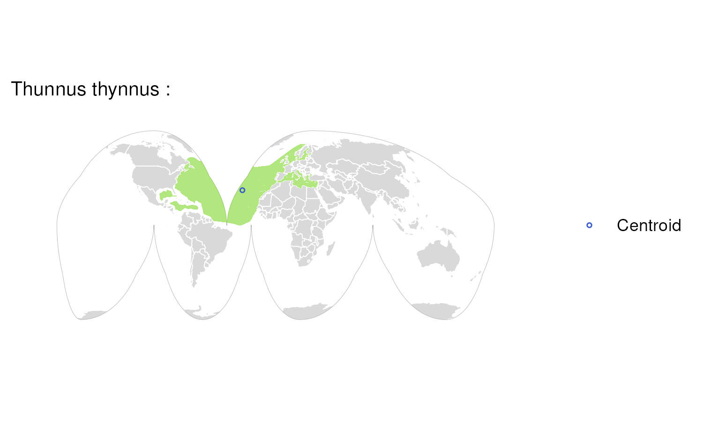
