## Sampling Map

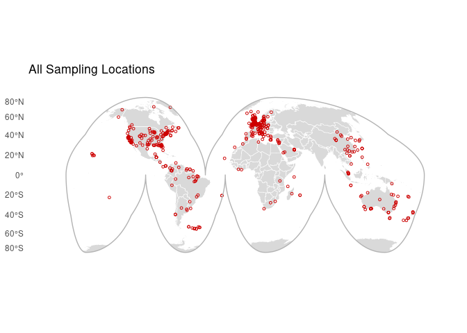

## Range Centroid Map

## Heatmap of Distributions

## Individual Species Maps

### Species: Asterias rubens

**Biosample:** SAMEA994741  
**Taxon:** Invertebrates  
**Priority:** 1  
**Flags:** Missing Range; Missing Sampling Location;  

### Species: Bos taurus

**Biosample:** SAMN08473802  
**Taxon:** Mammals  
**Priority:** 1  
**Flags:** Domesticated; Missing Range; Missing Sampling Location;  

### Species: Branchiostoma belcheri

**Biosample:** SAMN13907882  
**Taxon:** Invertebrates  
**Priority:** 1  
**Flags:** Missing Range; Missing Sampling Location;  

### Species: Branchiostoma floridae

**Biosample:** SAMN13896449  
**Taxon:** Invertebrates  
**Priority:** 1  
**Flags:** Missing Range; Missing Sampling Location;  

### Species: Gadus morhua

**Biosample:** SAMEA5574046  
**Taxon:** Fishes  
**Priority:** 1  
**Flags:** Missing Range; Missing Sampling Location;  

### Species: Homo sapiens

**Biosample:** SAMN03255769  
**Taxon:** Mammals  
**Priority:** 1  
**Flags:** Missing Range; Missing Sampling Location;  

### Species: Abramis brama

**Biosample:** SAMEA11296536  
**Taxon:** Fishes  
**Priority:** 2  
**Flags:** Vague Location;  

### Species: Accipiter gentilis

**Biosample:** SAMEA8235650  
**Taxon:** Birds  
**Priority:** 2  
**Flags:** Vague Location;  

### Species: Acomys minous

**Biosample:** SAMEA112751364  
**Taxon:** Mammals  
**Priority:** 2  
**Flags:** Outside Range; Vague Location;  

### Species: Acridotheres tristis

**Biosample:** SAMN28454388  
**Taxon:** Birds  
**Priority:** 2  
**Flags:** Outside Range;  

### Species: Anableps anableps

**Biosample:** SAMN12623628  
**Taxon:** Fishes  
**Priority:** 2  
**Flags:** Zoo Sample;  

### Species: Anas acuta

**Biosample:** SAMEA112468036  
**Taxon:** Birds  
**Priority:** 2  
**Flags:** Vague Location;  

### Species: Anas platyrhynchos

**Biosample:** SAMEA113398833  
**Taxon:** Birds  
**Priority:** 2  
**Flags:** Vague Location;  

### Species: Anser anser

**Biosample:** SAMEA113398854  
**Taxon:** Birds  
**Priority:** 2  
**Flags:** Vague Location;  

### Species: Anser brachyrhynchus

**Biosample:** SAMEA112468040  
**Taxon:** Birds  
**Priority:** 2  
**Flags:** Vague Location;  

### Species: Antennarius maculatus

**Biosample:** SAMN12623626  
**Taxon:** Fishes  
**Priority:** 2  
**Flags:** Outside Range;  

### Species: Antrozous pallidus

**Biosample:** SAMN30225125  
**Taxon:** Mammals  
**Priority:** 2  
**Flags:** Outside Range;  

### Species: Aplidium turbinatum

**Biosample:** SAMEA7536566  
**Taxon:** Invertebrates  
**Priority:** 2  
**Flags:** Vague Location; Missing Range;  

### Species: Apodemus sylvaticus

**Biosample:** SAMEA7702024  
**Taxon:** Mammals  
**Priority:** 2  
**Flags:** Vague Location;  

### Species: Apteryx mantelli

**Biosample:** SAMN39257886  
**Taxon:** Birds  
**Priority:** 2  
**Flags:** Zoo Sample;  

### Species: Ara ararauna

**Biosample:** SAMN33059336  
**Taxon:** Birds  
**Priority:** 2  
**Flags:** Outside Range;  

### Species: Archocentrus centrarchus

**Biosample:** SAMN09948522  
**Taxon:** Fishes  
**Priority:** 2  
**Flags:** Outside Range;  

### Species: Arvicanthis niloticus

**Biosample:** SAMN12611849  
**Taxon:** Mammals  
**Priority:** 2  
**Flags:** Outside Range;  

### Species: Ascidia mentula

**Biosample:** SAMEA8724667  
**Taxon:** Invertebrates  
**Priority:** 2  
**Flags:** Vague Location; Missing Range;  

### Species: Ascidiella aspersa

**Biosample:** SAMEA110449820  
**Taxon:** Invertebrates  
**Priority:** 2  
**Flags:** Vague Location; Missing Range;  

### Species: Astatotilapia calliptera

**Biosample:** SAMEA112818850  
**Taxon:** Fishes  
**Priority:** 2  
**Flags:** Outside Range; Vague Location;  

### Species: Athene noctua

**Biosample:** SAMEA114594456  
**Taxon:** Birds  
**Priority:** 2  
**Flags:** Vague Location;  

### Species: Aulonocara stuartgranti

**Biosample:** SAMEA112818851  
**Taxon:** Fishes  
**Priority:** 2  
**Flags:** Outside Range; Vague Location;  

### Species: Aythya ferina

**Biosample:** SAMEA112468034  
**Taxon:** Birds  
**Priority:** 2  
**Flags:** Vague Location;  

### Species: Aythya marila

**Biosample:** SAMEA115433010  
**Taxon:** Birds  
**Priority:** 2  
**Flags:** Vague Location;  

### Species: Balaenoptera acutorostrata

**Biosample:** SAMEA111380540  
**Taxon:** Mammals  
**Priority:** 2  
**Flags:** Vague Location;  

### Species: Balaenoptera borealis

**Biosample:** SAMEA114493134  
**Taxon:** Mammals  
**Priority:** 2  
**Flags:** Vague Location;  

### Species: Balaenoptera physalus

**Biosample:** SAMEA114493136  
**Taxon:** Mammals  
**Priority:** 2  
**Flags:** Vague Location;  

### Species: Balaenoptera ricei

**Biosample:** SAMN32629060  
**Taxon:** Mammals  
**Priority:** 2  
**Flags:** Outside Range;  

### Species: Balearica regulorum gibbericeps

**Biosample:** SAMN12615749  
**Taxon:** Birds  
**Priority:** 2  
**Flags:** Zoo Sample; Missing Range;  

### Species: Barbatula barbatula

**Biosample:** SAMEA11296540  
**Taxon:** Fishes  
**Priority:** 2  
**Flags:** Vague Location;  

### Species: Barbus barbus

**Biosample:** SAMEA13335783  
**Taxon:** Fishes  
**Priority:** 2  
**Flags:** Vague Location;  

### Species: Blennius ocellaris

**Biosample:** SAMEA112788961  
**Taxon:** Fishes  
**Priority:** 2  
**Flags:** Outside Range; Vague Location;  

### Species: Bombina variegata

**Biosample:** SAMEA112651403  
**Taxon:** Amphibians  
**Priority:** 2  
**Flags:** Outside Range; Vague Location;  

### Species: Borostomias antarcticus

**Biosample:** SAMEA8748812  
**Taxon:** Fishes  
**Priority:** 2  
**Flags:** Outside Range; Vague Location;  

### Species: Branta canadensis

**Biosample:** SAMEA113398965  
**Taxon:** Birds  
**Priority:** 2  
**Flags:** Vague Location;  

### Species: Bucephala clangula

**Biosample:** SAMEA112468123  
**Taxon:** Birds  
**Priority:** 2  
**Flags:** Vague Location;  

### Species: Bucorvus abyssinicus

**Biosample:** SAMN12614799  
**Taxon:** Birds  
**Priority:** 2  
**Flags:** Zoo Sample;  

### Species: Bufo bufo

**Biosample:** SAMEA7521636  
**Taxon:** Amphibians  
**Priority:** 2  
**Flags:** Vague Location;  

### Species: Buteo buteo

**Biosample:** SAMEA114594453  
**Taxon:** Birds  
**Priority:** 2  
**Flags:** Vague Location;  

### Species: Caesio teres

**Biosample:** SAMN41769331  
**Taxon:** Fishes  
**Priority:** 2  
**Flags:** Vague Location;  

### Species: Callithrix jacchus

**Biosample:** SAMN47004743  
**Taxon:** Mammals  
**Priority:** 2  
**Flags:** Outside Range;  

### Species: Caloenas nicobarica

**Biosample:** SAMN39256628  
**Taxon:** Birds  
**Priority:** 2  
**Flags:** Zoo Sample;  

### Species: Calonectris borealis

**Biosample:** SAMEA114294356  
**Taxon:** Birds  
**Priority:** 2  
**Flags:** Outside Range; Vague Location;  
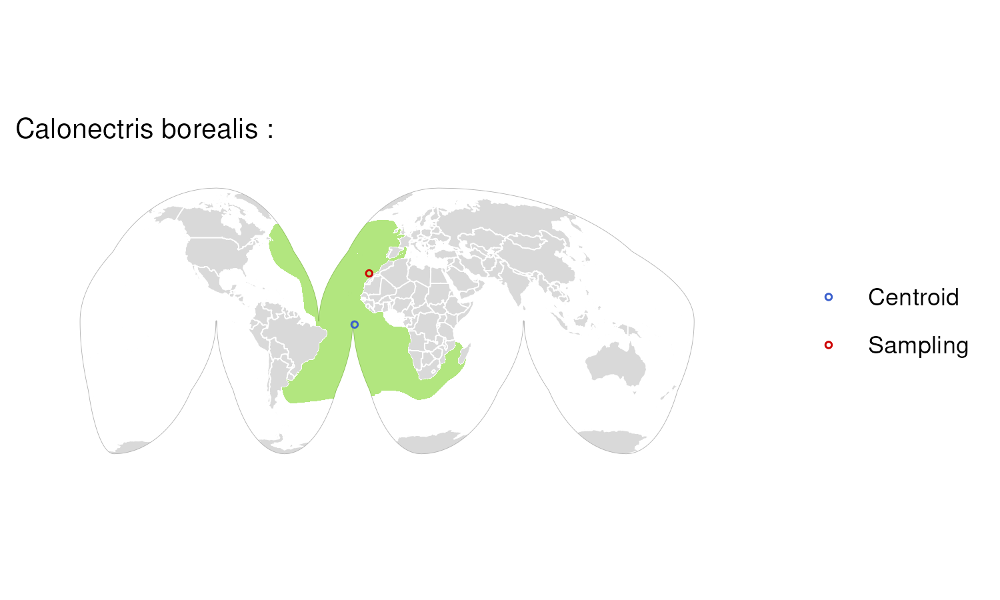

### Species: Calypte anna

**Biosample:** SAMN02265252  
**Taxon:** Birds  
**Priority:** 2  
**Flags:** Outside Range;  

### Species: Candoia aspera

**Biosample:** SAMN37159891  
**Taxon:** Reptiles  
**Priority:** 2  
**Flags:** Outside Range;  

### Species: Canis lupus baileyi

**Biosample:** SAMN46796784  
**Taxon:** Mammals  
**Priority:** 2  
**Flags:** Domesticated;  

### Species: Canis lupus orion

**Biosample:** SAMEA7532739  
**Taxon:** Mammals  
**Priority:** 2  
**Flags:** Vague Location; Domesticated;  

### Species: Capra hircus

**Biosample:** SAMN41386043  
**Taxon:** Mammals  
**Priority:** 2  
**Flags:** Domesticated; Missing Range;  

### Species: Caprimulgus europaeus

**Biosample:** SAMEA7524394  
**Taxon:** Birds  
**Priority:** 2  
**Flags:** Vague Location;  

### Species: Carassius carassius

**Biosample:** SAMEA11296534  
**Taxon:** Fishes  
**Priority:** 2  
**Flags:** Vague Location;  

### Species: Carettochelys insculpta

**Biosample:** SAMN38222597  
**Taxon:** Reptiles  
**Priority:** 2  
**Flags:** Outside Range; Vague Location;  

### Species: Cariama cristata

**Biosample:** SAMN12614807  
**Taxon:** Birds  
**Priority:** 2  
**Flags:** Zoo Sample;  

### Species: Cervus elaphus

**Biosample:** SAMEA7523520  
**Taxon:** Mammals  
**Priority:** 2  
**Flags:** Vague Location;  

### Species: Cetorhinus maximus

**Biosample:** SAMEA113902670  
**Taxon:** Fishes  
**Priority:** 2  
**Flags:** Vague Location;  

### Species: Chelon labrosus

**Biosample:** SAMEA111562027  
**Taxon:** Fishes  
**Priority:** 2  
**Flags:** Vague Location;  

### Species: Chionomys nivalis

**Biosample:** SAMEA13217622  
**Taxon:** Mammals  
**Priority:** 2  
**Flags:** Vague Location;  

### Species: Choloepus didactylus

**Biosample:** SAMN12612024  
**Taxon:** Mammals  
**Priority:** 2  
**Flags:** Outside Range;  

### Species: Chroicocephalus ridibundus

**Biosample:** SAMEA112468038  
**Taxon:** Birds  
**Priority:** 2  
**Flags:** Vague Location;  

### Species: Cinclus cinclus

**Biosample:** SAMEA9679959  
**Taxon:** Birds  
**Priority:** 2  
**Flags:** Vague Location;  

### Species: Clangula hyemalis

**Biosample:** SAMEA112468035  
**Taxon:** Birds  
**Priority:** 2  
**Flags:** Vague Location;  

### Species: Clarias gariepinus

**Biosample:** SAMN27021044  
**Taxon:** Fishes  
**Priority:** 2  
**Flags:** Outside Range;  

### Species: Clavelina lepadiformis

**Biosample:** SAMEA7536527  
**Taxon:** Invertebrates  
**Priority:** 2  
**Flags:** Vague Location; Missing Range;  

### Species: Colius striatus

**Biosample:** SAMN33339572  
**Taxon:** Birds  
**Priority:** 2  
**Flags:** Zoo Sample;  

### Species: Coloeus monedula

**Biosample:** SAMEA115433023  
**Taxon:** Birds  
**Priority:** 2  
**Flags:** Vague Location;  

### Species: Columba livia

**Biosample:** SAMN38891892  
**Taxon:** Birds  
**Priority:** 2  
**Flags:** Outside Range;  

### Species: Conger conger

**Biosample:** SAMEA12219431  
**Taxon:** Fishes  
**Priority:** 2  
**Flags:** Vague Location;  

### Species: Coregonus lavaretus

**Biosample:** SAMEA111528661  
**Taxon:** Fishes  
**Priority:** 2  
**Flags:** Vague Location;  

### Species: Corella eumyota

**Biosample:** SAMEA7536466  
**Taxon:** Invertebrates  
**Priority:** 2  
**Flags:** Vague Location; Missing Range;  

### Species: Corvus hawaiiensis

**Biosample:** SAMN22550278  
**Taxon:** Birds  
**Priority:** 2  
**Flags:** Outside Range;  

### Species: Cristiceps australis

**Biosample:** SAMN40589650  
**Taxon:** Fishes  
**Priority:** 2  
**Flags:** Outside Range;  

### Species: Cyclura pinguis

**Biosample:** SAMN35151422  
**Taxon:** Reptiles  
**Priority:** 2  
**Flags:** Zoo Sample;  

### Species: Cygnus columbianus

**Biosample:** SAMEA112468031  
**Taxon:** Birds  
**Priority:** 2  
**Flags:** Vague Location;  

### Species: Dama dama

**Biosample:** SAMN36735489  
**Taxon:** Mammals  
**Priority:** 2  
**Flags:** Vague Location;  

### Species: Danio rerio

**Biosample:** SAMEA14088276  
**Taxon:** Fishes  
**Priority:** 2  
**Flags:** Vague Location; Missing Range;  

### Species: Dasyurus maculatus

**Biosample:** SAMN47326980  
**Taxon:** Mammals  
**Priority:** 2  
**Flags:** Outside Range;  
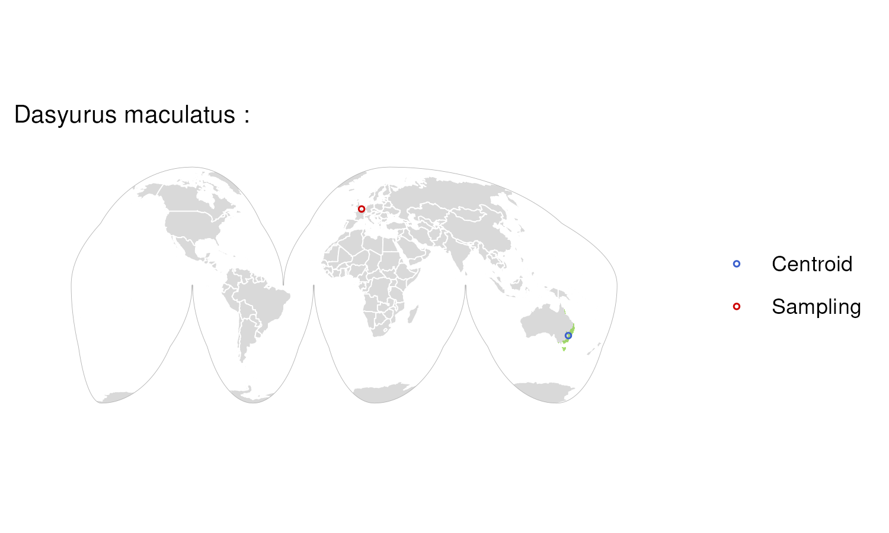

### Species: Delphinus delphis

**Biosample:** SAMEA111380534  
**Taxon:** Mammals  
**Priority:** 2  
**Flags:** Vague Location;  

### Species: Dendropsophus ebraccatus

**Biosample:** SAMN32145295  
**Taxon:** Amphibians  
**Priority:** 2  
**Flags:** Outside Range;  

### Species: Dibamus smithi

**Biosample:** SAMN44704469  
**Taxon:** Reptiles  
**Priority:** 2  
**Flags:** Outside Range;  

### Species: Dromaius novaehollandiae

**Biosample:** SAMN39262816  
**Taxon:** Birds  
**Priority:** 2  
**Flags:** Zoo Sample;  

### Species: Echiichthys vipera

**Biosample:** SAMEA112765695  
**Taxon:** Fishes  
**Priority:** 2  
**Flags:** Vague Location; Missing Range;  

### Species: Electrona antarctica

**Biosample:** SAMEA8748807  
**Taxon:** Fishes  
**Priority:** 2  
**Flags:** Vague Location;  

### Species: Electrophorus electricus

**Biosample:** SAMN42883346  
**Taxon:** Fishes  
**Priority:** 2  
**Flags:** Outside Range; Vague Location;  

### Species: Elephas maximus indicus

**Biosample:** SAMN29174328  
**Taxon:** Mammals  
**Priority:** 2  
**Flags:** Zoo Sample;  

### Species: Engystomops pustulosus

**Biosample:** SAMN42463661  
**Taxon:** Amphibians  
**Priority:** 2  
**Flags:** Outside Range;  

### Species: Enoplosus armatus

**Biosample:** SAMN40589647  
**Taxon:** Fishes  
**Priority:** 2  
**Flags:** Outside Range;  

### Species: Epinephelus lanceolatus

**Biosample:** SAMN41784231  
**Taxon:** Fishes  
**Priority:** 2  
**Flags:** Outside Range; Vague Location;  

### Species: Epinephelus rankini

**Biosample:** SAMN41769322  
**Taxon:** Fishes  
**Priority:** 2  
**Flags:** Outside Range;  

### Species: Eptesicus nilssonii

**Biosample:** SAMEA14098186  
**Taxon:** Mammals  
**Priority:** 2  
**Flags:** Vague Location;  

### Species: Erinaceus europaeus

**Biosample:** SAMEA13207416  
**Taxon:** Mammals  
**Priority:** 2  
**Flags:** Vague Location;  

### Species: Eudromia elegans

**Biosample:** SAMN46865137  
**Taxon:** Birds  
**Priority:** 2  
**Flags:** Zoo Sample;  

### Species: Eutrigla gurnardus

**Biosample:** SAMEA111562159  
**Taxon:** Fishes  
**Priority:** 2  
**Flags:** Vague Location; Missing Range;  

### Species: Falco biarmicus

**Biosample:** SAMN28688289  
**Taxon:** Birds  
**Priority:** 2  
**Flags:** Outside Range;  

### Species: Falco punctatus

**Biosample:** SAMEA14356472  
**Taxon:** Birds  
**Priority:** 2  
**Flags:** Vague Location;  

### Species: Falco rusticolus

**Biosample:** SAMN12629496  
**Taxon:** Birds  
**Priority:** 2  
**Flags:** Outside Range;  

### Species: Fringilla coelebs

**Biosample:** SAMEA9359753  
**Taxon:** Birds  
**Priority:** 2  
**Flags:** Vague Location;  

### Species: Furcifer pardalis

**Biosample:** SAMN35298317  
**Taxon:** Reptiles  
**Priority:** 2  
**Flags:** Outside Range;  

### Species: Gallinula chloropus

**Biosample:** SAMEA113398958  
**Taxon:** Birds  
**Priority:** 2  
**Flags:** Vague Location;  

### Species: Gallus gallus

**Biosample:** SAMN15960293  
**Taxon:** Birds  
**Priority:** 2  
**Flags:** Outside Range; Domesticated;  

### Species: Gasterosteus aculeatus

**Biosample:** SAMEA11296546  
**Taxon:** Fishes  
**Priority:** 2  
**Flags:** Vague Location;  

### Species: Gavia stellata

**Biosample:** SAMN37096312  
**Taxon:** Birds  
**Priority:** 2  
**Flags:** Outside Range;  

### Species: Gavialis gangeticus

**Biosample:** SAMN34116453  
**Taxon:** Reptiles  
**Priority:** 2  
**Flags:** Zoo Sample;  

### Species: Globicephala melas

**Biosample:** SAMEA111380538  
**Taxon:** Mammals  
**Priority:** 2  
**Flags:** Vague Location;  

### Species: Gobio gobio

**Biosample:** SAMEA11296538  
**Taxon:** Fishes  
**Priority:** 2  
**Flags:** Vague Location;  

### Species: Gobius niger

**Biosample:** SAMEA13854149  
**Taxon:** Fishes  
**Priority:** 2  
**Flags:** Vague Location;  

### Species: Gopherus evgoodei

**Biosample:** SAMN03496275  
**Taxon:** Reptiles  
**Priority:** 2  
**Flags:** Outside Range;  

### Species: Gopherus flavomarginatus

**Biosample:** SAMN24199108  
**Taxon:** Reptiles  
**Priority:** 2  
**Flags:** Outside Range;  

### Species: Grampus griseus

**Biosample:** SAMEA111380541  
**Taxon:** Mammals  
**Priority:** 2  
**Flags:** Vague Location;  

### Species: Grus grus

**Biosample:** SAMEA113398837  
**Taxon:** Birds  
**Priority:** 2  
**Flags:** Outside Range; Vague Location;  
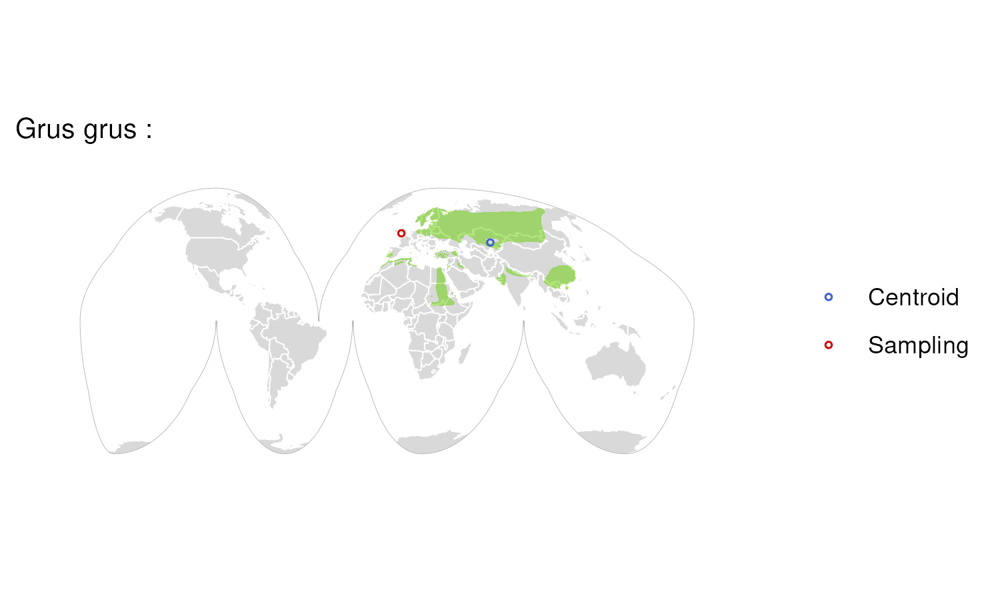

### Species: Gulosus aristotelis

**Biosample:** SAMEA10059652  
**Taxon:** Birds  
**Priority:** 2  
**Flags:** Vague Location;  

### Species: Gymnoscopelus braueri

**Biosample:** SAMEA12815494  
**Taxon:** Fishes  
**Priority:** 2  
**Flags:** Vague Location;  

### Species: Gymnoscopelus microlampas

**Biosample:** SAMEA12815435  
**Taxon:** Fishes  
**Priority:** 2  
**Flags:** Outside Range; Vague Location;  

### Species: Haliaeetus albicilla

**Biosample:** SAMEA12857288  
**Taxon:** Birds  
**Priority:** 2  
**Flags:** Outside Range; Vague Location;  

### Species: Halichoerus grypus

**Biosample:** SAMEA115427674  
**Taxon:** Mammals  
**Priority:** 2  
**Flags:** Vague Location;  

### Species: Hemiscyllium ocellatum

**Biosample:** SAMN22550098  
**Taxon:** Fishes  
**Priority:** 2  
**Flags:** Outside Range;  

### Species: Heptranchias perlo

**Biosample:** SAMN38891902  
**Taxon:** Fishes  
**Priority:** 2  
**Flags:** Outside Range;  

### Species: Heterohyrax brucei

**Biosample:** SAMN33092455  
**Taxon:** Mammals  
**Priority:** 2  
**Flags:** Zoo Sample;  

### Species: Hippopotamus amphibius

**Biosample:** SAMN33342074  
**Taxon:** Mammals  
**Priority:** 2  
**Flags:** Zoo Sample;  

### Species: Hirundo rustica

**Biosample:** SAMN14675488  
**Taxon:** Birds  
**Priority:** 2  
**Flags:** Vague Location;  

### Species: Hyperolius riggenbachi

**Biosample:** SAMN42123895  
**Taxon:** Amphibians  
**Priority:** 2  
**Flags:** Outside Range;  

### Species: Hyperoodon ampullatus

**Biosample:** SAMEA10839125  
**Taxon:** Mammals  
**Priority:** 2  
**Flags:** Outside Range; Vague Location;  

### Species: Hyperoplus immaculatus

**Biosample:** SAMEA13854416  
**Taxon:** Fishes  
**Priority:** 2  
**Flags:** Vague Location; Missing Range;  

### Species: Jaculus jaculus

**Biosample:** SAMN20391724  
**Taxon:** Mammals  
**Priority:** 2  
**Flags:** Outside Range;  

### Species: Labrus bergylta

**Biosample:** SAMEA111562158  
**Taxon:** Fishes  
**Priority:** 2  
**Flags:** Vague Location;  

### Species: Labrus mixtus

**Biosample:** SAMEA111562155  
**Taxon:** Fishes  
**Priority:** 2  
**Flags:** Vague Location;  

### Species: Lagenorhynchus acutus

**Biosample:** SAMEA114493133  
**Taxon:** Mammals  
**Priority:** 2  
**Flags:** Vague Location;  

### Species: Lagenorhynchus albirostris

**Biosample:** SAMEA111380537  
**Taxon:** Mammals  
**Priority:** 2  
**Flags:** Vague Location;  

### Species: Lampetra fluviatilis

**Biosample:** SAMEA111528664  
**Taxon:** Fishes  
**Priority:** 2  
**Flags:** Vague Location;  

### Species: Larus argentatus

**Biosample:** SAMEA115168456  
**Taxon:** Birds  
**Priority:** 2  
**Flags:** Vague Location;  

### Species: Larus fuscus

**Biosample:** SAMEA112468039  
**Taxon:** Birds  
**Priority:** 2  
**Flags:** Vague Location;  

### Species: Larus michahellis

**Biosample:** SAMEA114211328  
**Taxon:** Birds  
**Priority:** 2  
**Flags:** Vague Location;  

### Species: Lateolabrax maculatus

**Biosample:** SAMN36708487  
**Taxon:** Fishes  
**Priority:** 2  
**Flags:** Vague Location;  

### Species: Lathamus discolor

**Biosample:** SAMN40289871  
**Taxon:** Birds  
**Priority:** 2  
**Flags:** Outside Range;  

### Species: Lemur catta

**Biosample:** SAMN12621102  
**Taxon:** Mammals  
**Priority:** 2  
**Flags:** Zoo Sample;  

### Species: Lepidogalaxias salamandroides

**Biosample:** SAMN47481373  
**Taxon:** Fishes  
**Priority:** 2  
**Flags:** Outside Range;  

### Species: Leptosomus discolor

**Biosample:** SAMN37284216  
**Taxon:** Birds  
**Priority:** 2  
**Flags:** Outside Range;  

### Species: Lethrinus nebulosus

**Biosample:** SAMN40589648  
**Taxon:** Fishes  
**Priority:** 2  
**Flags:** Outside Range;  

### Species: Leuciscus leuciscus

**Biosample:** SAMEA11296544  
**Taxon:** Fishes  
**Priority:** 2  
**Flags:** Vague Location;  

### Species: Liasis olivaceus

**Biosample:** SAMN32739907  
**Taxon:** Reptiles  
**Priority:** 2  
**Flags:** Zoo Sample;  

### Species: Limanda limanda

**Biosample:** SAMEA112765706  
**Taxon:** Fishes  
**Priority:** 2  
**Flags:** Vague Location;  

### Species: Lipophrys pholis

**Biosample:** SAMEA7522844  
**Taxon:** Fishes  
**Priority:** 2  
**Flags:** Vague Location;  

### Species: Lissotriton helveticus

**Biosample:** SAMEA110240860  
**Taxon:** Amphibians  
**Priority:** 2  
**Flags:** Vague Location;  

### Species: Lissotriton vulgaris

**Biosample:** SAMEA110240861  
**Taxon:** Amphibians  
**Priority:** 2  
**Flags:** Vague Location;  

### Species: Loxodonta africana

**Biosample:** SAMN32756554  
**Taxon:** Mammals  
**Priority:** 2  
**Flags:** Zoo Sample;  

### Species: Lycaon pictus

**Biosample:** SAMN36939365  
**Taxon:** Mammals  
**Priority:** 2  
**Flags:** Outside Range;  

### Species: Lynx canadensis

**Biosample:** SAMN09948483  
**Taxon:** Mammals  
**Priority:** 2  
**Flags:** Outside Range;  
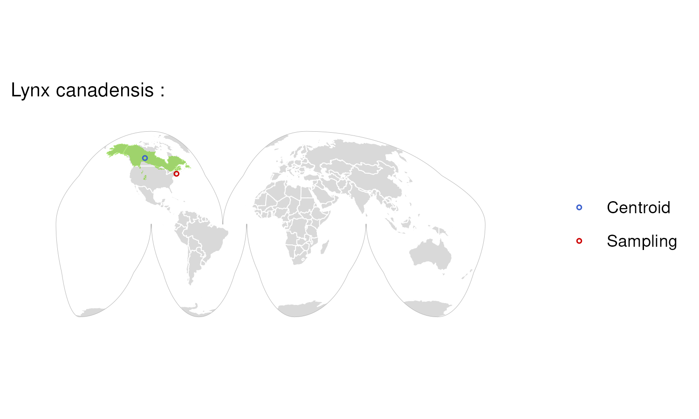

### Species: Macaca nemestrina

**Biosample:** SAMN41827875  
**Taxon:** Mammals  
**Priority:** 2  
**Flags:** Outside Range;  

### Species: Macrotis lagotis

**Biosample:** SAMN39300766  
**Taxon:** Mammals  
**Priority:** 2  
**Flags:** Zoo Sample;  

### Species: Manis pentadactyla

**Biosample:** SAMN32757332  
**Taxon:** Mammals  
**Priority:** 2  
**Flags:** Zoo Sample;  

### Species: Martes martes

**Biosample:** SAMEA14268932  
**Taxon:** Mammals  
**Priority:** 2  
**Flags:** Vague Location;  

### Species: Megaderma spasma

**Biosample:** SAMN33550865  
**Taxon:** Mammals  
**Priority:** 2  
**Flags:** Outside Range;  

### Species: Melanostigma gelatinosum

**Biosample:** SAMEA12815492  
**Taxon:** Fishes  
**Priority:** 2  
**Flags:** Vague Location; Missing Range;  

### Species: Meles meles

**Biosample:** SAMEA7524400  
**Taxon:** Mammals  
**Priority:** 2  
**Flags:** Vague Location;  

### Species: Melopsittacus undulatus

**Biosample:** SAMN12623090  
**Taxon:** Birds  
**Priority:** 2  
**Flags:** Outside Range;  

### Species: Merops nubicus

**Biosample:** SAMN12621035  
**Taxon:** Birds  
**Priority:** 2  
**Flags:** Zoo Sample;  

### Species: Mesoplodon bidens

**Biosample:** SAMEA112165298  
**Taxon:** Mammals  
**Priority:** 2  
**Flags:** Outside Range; Vague Location;  

### Species: Mesoplodon mirus

**Biosample:** SAMEA115358965  
**Taxon:** Mammals  
**Priority:** 2  
**Flags:** Outside Range; Vague Location;  

### Species: Microchirus variegatus

**Biosample:** SAMEA12219470  
**Taxon:** Fishes  
**Priority:** 2  
**Flags:** Vague Location;  

### Species: Micromesistius poutassou

**Biosample:** SAMEA111457552  
**Taxon:** Fishes  
**Priority:** 2  
**Flags:** Vague Location; Missing Range;  

### Species: Micromys minutus

**Biosample:** SAMEA112468042  
**Taxon:** Mammals  
**Priority:** 2  
**Flags:** Vague Location;  

### Species: Microstomus kitt

**Biosample:** SAMEA114298639  
**Taxon:** Fishes  
**Priority:** 2  
**Flags:** Vague Location;  

### Species: Miniopterus schreibersii

**Biosample:** SAMEA113980738  
**Taxon:** Mammals  
**Priority:** 2  
**Flags:** Vague Location;  

### Species: Mixophyes fleayi

**Biosample:** SAMN39657083  
**Taxon:** Amphibians  
**Priority:** 2  
**Flags:** Outside Range;  

### Species: Molossus alvarezi

**Biosample:** SAMN40002245  
**Taxon:** Mammals  
**Priority:** 2  
**Flags:** Outside Range;  

### Species: Monodelphis domestica

**Biosample:** SAMN31801966  
**Taxon:** Mammals  
**Priority:** 2  
**Flags:** Outside Range;  

### Species: Mops condylurus

**Biosample:** SAMN33550911  
**Taxon:** Mammals  
**Priority:** 2  
**Flags:** Outside Range;  

### Species: Morus bassanus

**Biosample:** SAMN37096299  
**Taxon:** Birds  
**Priority:** 2  
**Flags:** Zoo Sample;  

### Species: Muntiacus reevesi

**Biosample:** SAMEA110690972  
**Taxon:** Mammals  
**Priority:** 2  
**Flags:** Vague Location;  

### Species: Mus musculus

**Biosample:** SAMEA112251260  
**Taxon:** Mammals  
**Priority:** 2  
**Flags:** Vague Location;  

### Species: Muscardinus avellanarius

**Biosample:** SAMEA110180654  
**Taxon:** Mammals  
**Priority:** 2  
**Flags:** Vague Location;  

### Species: Mustela nivalis vulgaris

**Biosample:** SAMEA113398841  
**Taxon:** Mammals  
**Priority:** 2  
**Flags:** Vague Location;  

### Species: Mustelus asterias

**Biosample:** SAMEA114298637  
**Taxon:** Fishes  
**Priority:** 2  
**Flags:** Vague Location;  

### Species: Myotis daubentonii

**Biosample:** SAMEA9921455  
**Taxon:** Mammals  
**Priority:** 2  
**Flags:** Vague Location;  

### Species: Myotis emarginatus

**Biosample:** SAMEA115534660  
**Taxon:** Mammals  
**Priority:** 2  
**Flags:** Vague Location;  

### Species: Myotis mystacinus

**Biosample:** SAMEA114250307  
**Taxon:** Mammals  
**Priority:** 2  
**Flags:** Vague Location;  

### Species: Myotis nattereri

**Biosample:** SAMEA114614248  
**Taxon:** Mammals  
**Priority:** 2  
**Flags:** Vague Location;  

### Species: Myxine glutinosa

**Biosample:** SAMEA12790223  
**Taxon:** Fishes  
**Priority:** 2  
**Flags:** Outside Range; Vague Location;  

### Species: Nannobrachium achirus

**Biosample:** SAMEA12815432  
**Taxon:** Fishes  
**Priority:** 2  
**Flags:** Vague Location;  

### Species: Nansenia antarctica

**Biosample:** SAMEA8748805  
**Taxon:** Fishes  
**Priority:** 2  
**Flags:** Vague Location; Missing Range;  

### Species: Natrix helvetica

**Biosample:** SAMEA114598156  
**Taxon:** Reptiles  
**Priority:** 2  
**Flags:** Vague Location;  

### Species: Neofelis nebulosa

**Biosample:** SAMN31801981  
**Taxon:** Mammals  
**Priority:** 2  
**Flags:** Zoo Sample;  

### Species: Neogale vison

**Biosample:** SAMEA112468126  
**Taxon:** Mammals  
**Priority:** 2  
**Flags:** Outside Range; Vague Location;  

### Species: Neosynchiropus ocellatus

**Biosample:** SAMN43082349  
**Taxon:** Fishes  
**Priority:** 2  
**Flags:** Zoo Sample;  

### Species: Nesoenas mayeri

**Biosample:** SAMEA12922160  
**Taxon:** Birds  
**Priority:** 2  
**Flags:** Vague Location;  

### Species: Netta rufina

**Biosample:** SAMEA112468124  
**Taxon:** Birds  
**Priority:** 2  
**Flags:** Outside Range; Vague Location;  

### Species: Notolepis coatsi

**Biosample:** SAMEA8748806  
**Taxon:** Fishes  
**Priority:** 2  
**Flags:** Vague Location; Missing Range;  

### Species: Notoryctes typhlops

**Biosample:** SAMN45131536  
**Taxon:** Mammals  
**Priority:** 2  
**Flags:** Vague Location;  

### Species: Notothenia rossii

**Biosample:** SAMEA12815441  
**Taxon:** Fishes  
**Priority:** 2  
**Flags:** Vague Location; Missing Range;  

### Species: Numenius arquata

**Biosample:** SAMEA112693994  
**Taxon:** Birds  
**Priority:** 2  
**Flags:** Vague Location;  

### Species: Nyctalus leisleri

**Biosample:** SAMEA114250308  
**Taxon:** Mammals  
**Priority:** 2  
**Flags:** Vague Location;  

### Species: Nycticebus coucang

**Biosample:** SAMN28408555  
**Taxon:** Mammals  
**Priority:** 2  
**Flags:** Zoo Sample;  

### Species: Orcinus orca

**Biosample:** SAMEA8800229  
**Taxon:** Mammals  
**Priority:** 2  
**Flags:** Vague Location;  

### Species: Oryctolagus cuniculus

**Biosample:** SAMEA112468037  
**Taxon:** Mammals  
**Priority:** 2  
**Flags:** Outside Range; Vague Location;  

### Species: Osmerus eperlanus

**Biosample:** SAMEA14448128  
**Taxon:** Fishes  
**Priority:** 2  
**Flags:** Vague Location;  

### Species: Ovis aries

**Biosample:** SAMN38029123  
**Taxon:** Mammals  
**Priority:** 2  
**Flags:** Vague Location; Domesticated; Missing Range;  

### Species: Pagrus pagrus

**Biosample:** SAMEA110450108  
**Taxon:** Fishes  
**Priority:** 2  
**Flags:** Outside Range; Vague Location;  

### Species: Pangasianodon hypophthalmus

**Biosample:** SAMN32348883  
**Taxon:** Fishes  
**Priority:** 2  
**Flags:** Outside Range;  

### Species: Pangshura tecta

**Biosample:** SAMN43277916  
**Taxon:** Reptiles  
**Priority:** 2  
**Flags:** Outside Range;  

### Species: Patagioenas fasciata

**Biosample:** SAMN40018840  
**Taxon:** Birds  
**Priority:** 2  
**Flags:** Outside Range;  

### Species: Pelecanus crispus

**Biosample:** SAMN35784560  
**Taxon:** Birds  
**Priority:** 2  
**Flags:** Zoo Sample;  
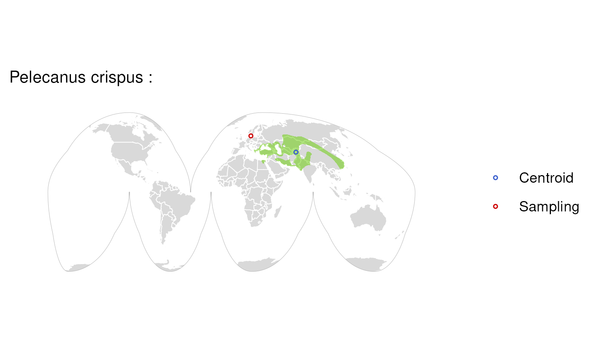

### Species: Pelophylax lessonae

**Biosample:** SAMEA112468029  
**Taxon:** Amphibians  
**Priority:** 2  
**Flags:** Outside Range; Vague Location;  

### Species: Periophthalmus magnuspinnatus

**Biosample:** SAMN12629500  
**Taxon:** Fishes  
**Priority:** 2  
**Flags:** Outside Range;  

### Species: Phalacrocorax carbo

**Biosample:** SAMEA8228692  
**Taxon:** Birds  
**Priority:** 2  
**Flags:** Outside Range; Vague Location;  

### Species: Phascolarctos cinereus

**Biosample:** SAMN06198159  
**Taxon:** Mammals  
**Priority:** 2  
**Flags:** Outside Range; Vague Location;  

### Species: Phocoena phocoena

**Biosample:** SAMEA111380536  
**Taxon:** Mammals  
**Priority:** 2  
**Flags:** Vague Location;  

### Species: Phocoena sinus

**Biosample:** SAMN12325353  
**Taxon:** Mammals  
**Priority:** 2  
**Flags:** Outside Range;  

### Species: Phoenicopterus ruber

**Biosample:** SAMN12614931  
**Taxon:** Birds  
**Priority:** 2  
**Flags:** Zoo Sample;  

### Species: Pholidichthys leucotaenia

**Biosample:** SAMN12623617  
**Taxon:** Fishes  
**Priority:** 2  
**Flags:** Outside Range;  

### Species: Pholis gunnellus

**Biosample:** SAMEA7522838  
**Taxon:** Fishes  
**Priority:** 2  
**Flags:** Vague Location; Missing Range;  

### Species: Phoxinus phoxinus

**Biosample:** SAMEA11296539  
**Taxon:** Fishes  
**Priority:** 2  
**Flags:** Vague Location;  

### Species: Phyllostomus discolor

**Biosample:** SAMN09948786  
**Taxon:** Mammals  
**Priority:** 2  
**Flags:** Outside Range;  

### Species: Pipistrellus hanaki

**Biosample:** SAMEA115799862  
**Taxon:** Mammals  
**Priority:** 2  
**Flags:** Outside Range; Vague Location;  

### Species: Pipistrellus nathusii

**Biosample:** SAMEA115534661  
**Taxon:** Mammals  
**Priority:** 2  
**Flags:** Vague Location;  

### Species: Pipistrellus pygmaeus

**Biosample:** SAMEA9921456  
**Taxon:** Mammals  
**Priority:** 2  
**Flags:** Vague Location;  

### Species: Platalea leucorodia

**Biosample:** SAMEA112468120  
**Taxon:** Birds  
**Priority:** 2  
**Flags:** Outside Range; Vague Location;  

### Species: Platichthys flesus

**Biosample:** SAMEA110026475  
**Taxon:** Fishes  
**Priority:** 2  
**Flags:** Vague Location;  

### Species: Plecotus auritus

**Biosample:** SAMEA110056142  
**Taxon:** Mammals  
**Priority:** 2  
**Flags:** Vague Location;  

### Species: Pleuronectes platessa

**Biosample:** SAMEA13853390  
**Taxon:** Fishes  
**Priority:** 2  
**Flags:** Vague Location;  

### Species: Podarcis bocagei

**Biosample:** SAMEA115336769  
**Taxon:** Reptiles  
**Priority:** 2  
**Flags:** Outside Range; Vague Location;  

### Species: Podarcis cretensis

**Biosample:** SAMEA12110019  
**Taxon:** Reptiles  
**Priority:** 2  
**Flags:** Outside Range; Vague Location;  

### Species: Podarcis erhardii

**Biosample:** SAMEA115336771  
**Taxon:** Reptiles  
**Priority:** 2  
**Flags:** Vague Location;  

### Species: Podarcis filfolensis

**Biosample:** SAMEA113403362  
**Taxon:** Reptiles  
**Priority:** 2  
**Flags:** Outside Range; Vague Location;  

### Species: Podarcis gaigeae

**Biosample:** SAMEA114217796  
**Taxon:** Reptiles  
**Priority:** 2  
**Flags:** Vague Location;  

### Species: Podarcis liolepis

**Biosample:** SAMEA114217798  
**Taxon:** Reptiles  
**Priority:** 2  
**Flags:** Outside Range; Vague Location;  

### Species: Podarcis melisellensis

**Biosample:** SAMEA115336775  
**Taxon:** Reptiles  
**Priority:** 2  
**Flags:** Vague Location;  

### Species: Podarcis muralis

**Biosample:** SAMEA115336776  
**Taxon:** Reptiles  
**Priority:** 2  
**Flags:** Vague Location;  

### Species: Podarcis pityusensis

**Biosample:** SAMEA114217797  
**Taxon:** Reptiles  
**Priority:** 2  
**Flags:** Outside Range; Vague Location;  

### Species: Podarcis siculus

**Biosample:** SAMEA115336774  
**Taxon:** Reptiles  
**Priority:** 2  
**Flags:** Vague Location;  

### Species: Podarcis tiliguerta

**Biosample:** SAMEA114217799  
**Taxon:** Reptiles  
**Priority:** 2  
**Flags:** Outside Range; Vague Location;  

### Species: Podarcis vaucheri

**Biosample:** SAMEA115336770  
**Taxon:** Reptiles  
**Priority:** 2  
**Flags:** Outside Range; Vague Location;  

### Species: Pollachius pollachius

**Biosample:** SAMEA111562038  
**Taxon:** Fishes  
**Priority:** 2  
**Flags:** Vague Location;  

### Species: Polymixia cf. hollisterae

**Biosample:** SAMN42899157  
**Taxon:** Fishes  
**Priority:** 2  
**Flags:** Vague Location; Missing Range;  

### Species: Polymixia lowei

**Biosample:** SAMN45134564  
**Taxon:** Fishes  
**Priority:** 2  
**Flags:** Outside Range;  

### Species: Poromitra crassiceps

**Biosample:** SAMEA8748810  
**Taxon:** Fishes  
**Priority:** 2  
**Flags:** Outside Range; Vague Location;  

### Species: Pristipomoides typus

**Biosample:** SAMN40589651  
**Taxon:** Fishes  
**Priority:** 2  
**Flags:** Outside Range;  

### Species: Protomyctophum bolini

**Biosample:** SAMEA12815434  
**Taxon:** Fishes  
**Priority:** 2  
**Flags:** Vague Location;  

### Species: Protomyctophum parallelum

**Biosample:** SAMEA12815440  
**Taxon:** Fishes  
**Priority:** 2  
**Flags:** Outside Range; Vague Location;  

### Species: Psittacula echo

**Biosample:** SAMEA12361725  
**Taxon:** Birds  
**Priority:** 2  
**Flags:** Vague Location;  

### Species: Pungitius pungitius

**Biosample:** SAMEA11296545  
**Taxon:** Fishes  
**Priority:** 2  
**Flags:** Vague Location;  

### Species: Pygocentrus nattereri

**Biosample:** SAMN12623623  
**Taxon:** Fishes  
**Priority:** 2  
**Flags:** Outside Range;  

### Species: Raja brachyura

**Biosample:** SAMEA110450105  
**Taxon:** Fishes  
**Priority:** 2  
**Flags:** Vague Location;  

### Species: Rana temporaria

**Biosample:** SAMEA7521635  
**Taxon:** Amphibians  
**Priority:** 2  
**Flags:** Vague Location;  

### Species: Ranitomeya imitator

**Biosample:** SAMN32907850  
**Taxon:** Amphibians  
**Priority:** 2  
**Flags:** Outside Range;  

### Species: Rattus norvegicus

**Biosample:** SAMN16261960  
**Taxon:** Mammals  
**Priority:** 2  
**Flags:** Outside Range;  

### Species: Rhamphochromis chilingali

**Biosample:** SAMEA112818853  
**Taxon:** Fishes  
**Priority:** 2  
**Flags:** Vague Location; Missing Range;  

### Species: Rhea pennata

**Biosample:** SAMN32606345  
**Taxon:** Birds  
**Priority:** 2  
**Flags:** Zoo Sample;  

### Species: Rhinolophus hipposideros

**Biosample:** SAMEA113980802  
**Taxon:** Mammals  
**Priority:** 2  
**Flags:** Vague Location;  

### Species: Rhinopoma microphyllum

**Biosample:** SAMN33421188  
**Taxon:** Mammals  
**Priority:** 2  
**Flags:** Outside Range;  

### Species: Rhynchocyon petersi

**Biosample:** SAMN43274963  
**Taxon:** Mammals  
**Priority:** 2  
**Flags:** Outside Range;  

### Species: Rhynochetos jubatus

**Biosample:** SAMN31802033  
**Taxon:** Birds  
**Priority:** 2  
**Flags:** Zoo Sample;  

### Species: Rousettus aegyptiacus

**Biosample:** SAMN14734550  
**Taxon:** Mammals  
**Priority:** 2  
**Flags:** Outside Range;  

### Species: Rutilus rutilus

**Biosample:** SAMEA11296543  
**Taxon:** Fishes  
**Priority:** 2  
**Flags:** Vague Location;  

### Species: Saimiri boliviensis

**Biosample:** SAMN46760316  
**Taxon:** Mammals  
**Priority:** 2  
**Flags:** Outside Range;  

### Species: Sarcophilus harrisii

**Biosample:** SAMN47327921  
**Taxon:** Mammals  
**Priority:** 2  
**Flags:** Outside Range;  

### Species: Sardina pilchardus

**Biosample:** SAMEA111562172  
**Taxon:** Fishes  
**Priority:** 2  
**Flags:** Vague Location;  

### Species: Scardinius erythrophthalmus

**Biosample:** SAMEA11296541  
**Taxon:** Fishes  
**Priority:** 2  
**Flags:** Vague Location;  

### Species: Scomber scombrus

**Biosample:** SAMEA110450232  
**Taxon:** Fishes  
**Priority:** 2  
**Flags:** Vague Location;  

### Species: Scophthalmus maximus

**Biosample:** SAMEA110450106  
**Taxon:** Fishes  
**Priority:** 2  
**Flags:** Vague Location;  

### Species: Silurus aristotelis

**Biosample:** SAMEA12595289  
**Taxon:** Fishes  
**Priority:** 2  
**Flags:** Vague Location;  

### Species: Solea solea

**Biosample:** SAMEA10984647  
**Taxon:** Fishes  
**Priority:** 2  
**Flags:** Outside Range; Vague Location;  

### Species: Spermophilus citellus

**Biosample:** SAMEA10332752  
**Taxon:** Mammals  
**Priority:** 2  
**Flags:** Outside Range; Vague Location;  

### Species: Spheniscus humboldti

**Biosample:** SAMN28408465  
**Taxon:** Birds  
**Priority:** 2  
**Flags:** Outside Range;  

### Species: Spinachia spinachia

**Biosample:** SAMN36735485  
**Taxon:** Fishes  
**Priority:** 2  
**Flags:** Zoo Sample;  

### Species: Sprattus sprattus

**Biosample:** SAMEA111562173  
**Taxon:** Fishes  
**Priority:** 2  
**Flags:** Vague Location;  

### Species: Squalius cephalus

**Biosample:** SAMEA11296547  
**Taxon:** Fishes  
**Priority:** 2  
**Flags:** Vague Location;  

### Species: Stenella coeruleoalba

**Biosample:** SAMEA111380539  
**Taxon:** Mammals  
**Priority:** 2  
**Flags:** Outside Range; Vague Location;  

### Species: Streptopelia decaocto

**Biosample:** SAMEA113398962  
**Taxon:** Birds  
**Priority:** 2  
**Flags:** Vague Location;  

### Species: Strigops habroptilus

**Biosample:** SAMN09948751  
**Taxon:** Birds  
**Priority:** 2  
**Flags:** Outside Range;  

### Species: Styela clava

**Biosample:** SAMEA7536473  
**Taxon:** Invertebrates  
**Priority:** 2  
**Flags:** Vague Location; Missing Range;  

### Species: Suncus etruscus

**Biosample:** SAMN28420931  
**Taxon:** Mammals  
**Priority:** 2  
**Flags:** Outside Range;  

### Species: Sus scrofa

**Biosample:** SAMN42780387  
**Taxon:** Mammals  
**Priority:** 2  
**Flags:** Domesticated;  

### Species: Symphodus melops

**Biosample:** SAMEA12219485  
**Taxon:** Fishes  
**Priority:** 2  
**Flags:** Vague Location;  

### Species: Symphorus nematophorus

**Biosample:** SAMN41179601  
**Taxon:** Fishes  
**Priority:** 2  
**Flags:** Outside Range;  

### Species: Synchiropus picturatus

**Biosample:** SAMN43082350  
**Taxon:** Fishes  
**Priority:** 2  
**Flags:** Zoo Sample;  

### Species: Taeniopygia guttata

**Biosample:** SAMN47142318  
**Taxon:** Birds  
**Priority:** 2  
**Flags:** Outside Range;  
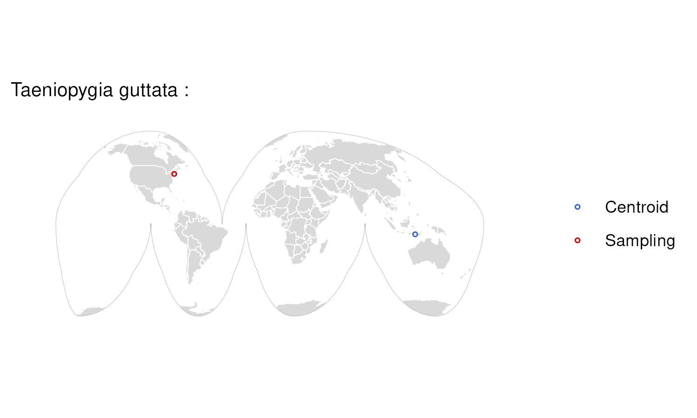

### Species: Talpa europaea

**Biosample:** SAMEA112468127  
**Taxon:** Mammals  
**Priority:** 2  
**Flags:** Vague Location;  

### Species: Tapirus indicus

**Biosample:** SAMN37096863  
**Taxon:** Mammals  
**Priority:** 2  
**Flags:** Zoo Sample;  

### Species: Tauraco erythrolophus

**Biosample:** SAMN12621036  
**Taxon:** Birds  
**Priority:** 2  
**Flags:** Zoo Sample;  

### Species: Taurulus bubalis

**Biosample:** SAMEA7522994  
**Taxon:** Fishes  
**Priority:** 2  
**Flags:** Vague Location;  

### Species: Telmatherina bonti

**Biosample:** SAMEA8592627  
**Taxon:** Fishes  
**Priority:** 2  
**Flags:** Outside Range; Vague Location;  

### Species: Tetrao urogallus

**Biosample:** SAMEA9654429  
**Taxon:** Birds  
**Priority:** 2  
**Flags:** Outside Range; Vague Location;  

### Species: Thalia democratica

**Biosample:** SAMEA111439782  
**Taxon:** Invertebrates  
**Priority:** 2  
**Flags:** Vague Location; Missing Range;  

### Species: Thamnophis elegans

**Biosample:** SAMN12629499  
**Taxon:** Reptiles  
**Priority:** 2  
**Flags:** Outside Range;  

### Species: Thunnus albacares

**Biosample:** SAMEA8654749  
**Taxon:** Fishes  
**Priority:** 2  
**Flags:** Outside Range; Vague Location;  

### Species: Thunnus maccoyii

**Biosample:** SAMEA8654747  
**Taxon:** Fishes  
**Priority:** 2  
**Flags:** Outside Range; Vague Location;  

### Species: Thunnus thynnus

**Biosample:** SAMEA111406335  
**Taxon:** Fishes  
**Priority:** 2  
**Flags:** Outside Range; Vague Location;  

### Species: Toxotes jaculatrix

**Biosample:** SAMN18445299  
**Taxon:** Fishes  
**Priority:** 2  
**Flags:** Outside Range;  

### Species: Trachurus trachurus

**Biosample:** SAMEA7524396  
**Taxon:** Fishes  
**Priority:** 2  
**Flags:** Vague Location;  

### Species: Trichosurus vulpecula

**Biosample:** SAMN12629507  
**Taxon:** Mammals  
**Priority:** 2  
**Flags:** Outside Range;  

### Species: Trididemnum clinides

**Biosample:** SAMEA9873882  
**Taxon:** Invertebrates  
**Priority:** 2  
**Flags:** Vague Location; Missing Range;  

### Species: Triturus cristatus

**Biosample:** SAMEA112468129  
**Taxon:** Amphibians  
**Priority:** 2  
**Flags:** Vague Location;  

### Species: Vanellus vanellus

**Biosample:** SAMEA113398832  
**Taxon:** Birds  
**Priority:** 2  
**Flags:** Vague Location;  

### Species: Vespertilio murinus

**Biosample:** SAMEA112247422  
**Taxon:** Mammals  
**Priority:** 2  
**Flags:** Vague Location;  

### Species: Vipera berus

**Biosample:** SAMEA114293681  
**Taxon:** Reptiles  
**Priority:** 2  
**Flags:** Vague Location;  

### Species: Vipera ursinii

**Biosample:** SAMEA12832258  
**Taxon:** Reptiles  
**Priority:** 2  
**Flags:** Vague Location;  

### Species: Vulpes vulpes

**Biosample:** SAMEA113398840  
**Taxon:** Mammals  
**Priority:** 2  
**Flags:** Vague Location;  

### Species: Xenentodon cancila

**Biosample:** SAMN12623622  
**Taxon:** Fishes  
**Priority:** 2  
**Flags:** Outside Range;  

### Species: Xenopus petersii

**Biosample:** SAMN39187339  
**Taxon:** Amphibians  
**Priority:** 2  
**Flags:** Outside Range;  

### Species: Zeus faber

**Biosample:** SAMEA111562156  
**Taxon:** Fishes  
**Priority:** 2  
**Flags:** Vague Location;  

### Species: Zootoca vivipara

**Biosample:** SAMEA111528662  
**Taxon:** Reptiles  
**Priority:** 2  
**Flags:** Vague Location;  

### Species: Zosterops lateralis

**Biosample:** SAMEA112953925  
**Taxon:** Birds  
**Priority:** 2  
**Flags:** Outside Range; Vague Location;  

### Species: Acanthopagrus latus

**Biosample:** SAMN16236878  
**Taxon:** Fishes  
**Priority:** 3  
**Flags:** Missing Sampling Location;  

### Species: Acipenser ruthenus

**Biosample:** SAMEA5572864  
**Taxon:** Fishes  
**Priority:** 3  
**Flags:** Missing Sampling Location;  

### Species: Acomys russatus

**Biosample:** SAMEA104026431  
**Taxon:** Mammals  
**Priority:** 3  
**Flags:** Missing Sampling Location;  

### Species: Anabas testudineus

**Biosample:** SAMEA104026376  
**Taxon:** Fishes  
**Priority:** 3  
**Flags:** Missing Sampling Location;  

### Species: Aquila chrysaetos

**Biosample:** SAMEA994725  
**Taxon:** Birds  
**Priority:** 3  
**Flags:** Missing Sampling Location;  

### Species: Arvicola amphibius

**Biosample:** SAMEA994740  
**Taxon:** Mammals  
**Priority:** 3  
**Flags:** Missing Sampling Location;  

### Species: Astyanax mexicanus

**Biosample:** SAMN25965548  
**Taxon:** Fishes  
**Priority:** 3  
**Flags:** Missing Sampling Location;  

### Species: Betta splendens

**Biosample:** SAMEA104381735  
**Taxon:** Fishes  
**Priority:** 3  
**Flags:** Missing Sampling Location;  

### Species: Canis lupus familiaris

**Biosample:** SAMN13230619  
**Taxon:** Mammals  
**Priority:** 3  
**Flags:** Domesticated; Missing Sampling Location;  

### Species: Chanos chanos

**Biosample:** SAMEA5159473  
**Taxon:** Fishes  
**Priority:** 3  
**Flags:** Missing Sampling Location;  

### Species: Cottoperca gobio

**Biosample:** SAMEA104242975  
**Taxon:** Fishes  
**Priority:** 3  
**Flags:** Missing Sampling Location;  

### Species: Denticeps clupeoides

**Biosample:** SAMEA104129917  
**Taxon:** Fishes  
**Priority:** 3  
**Flags:** Missing Sampling Location;  

### Species: Echeneis naucrates

**Biosample:** SAMEA4966390  
**Taxon:** Fishes  
**Priority:** 3  
**Flags:** Missing Sampling Location;  

### Species: Erithacus rubecula

**Biosample:** SAMEA4760689  
**Taxon:** Birds  
**Priority:** 3  
**Flags:** Missing Sampling Location;  

### Species: Erpetoichthys calabaricus

**Biosample:** SAMEA104026374  
**Taxon:** Fishes  
**Priority:** 3  
**Flags:** Missing Sampling Location;  

### Species: Eublepharis macularius

**Biosample:** SAMN31016422  
**Taxon:** Reptiles  
**Priority:** 3  
**Flags:** Missing Sampling Location;  

### Species: Geotrypetes seraphini

**Biosample:** SAMEA104387963  
**Taxon:** Amphibians  
**Priority:** 3  
**Flags:** Missing Sampling Location;  

### Species: Girardinichthys multiradiatus

**Biosample:** SAMN22242658  
**Taxon:** Fishes  
**Priority:** 3  
**Flags:** Missing Sampling Location;  

### Species: Gorilla gorilla

**Biosample:** SAMN04003007  
**Taxon:** Mammals  
**Priority:** 3  
**Flags:** Missing Sampling Location;  
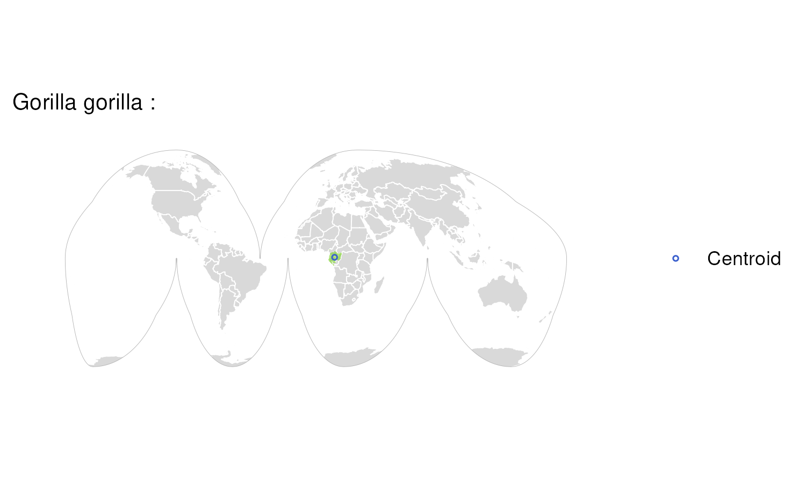

### Species: Gouania willdenowi

**Biosample:** SAMEA104026382  
**Taxon:** Fishes  
**Priority:** 3  
**Flags:** Missing Sampling Location;  

### Species: Lutra lutra

**Biosample:** SAMEA994731  
**Taxon:** Mammals  
**Priority:** 3  
**Flags:** Missing Sampling Location;  

### Species: Lycocorax pyrrhopterus

**Biosample:** SAMN15881065  
**Taxon:** Birds  
**Priority:** 3  
**Flags:** Missing Sampling Location;  
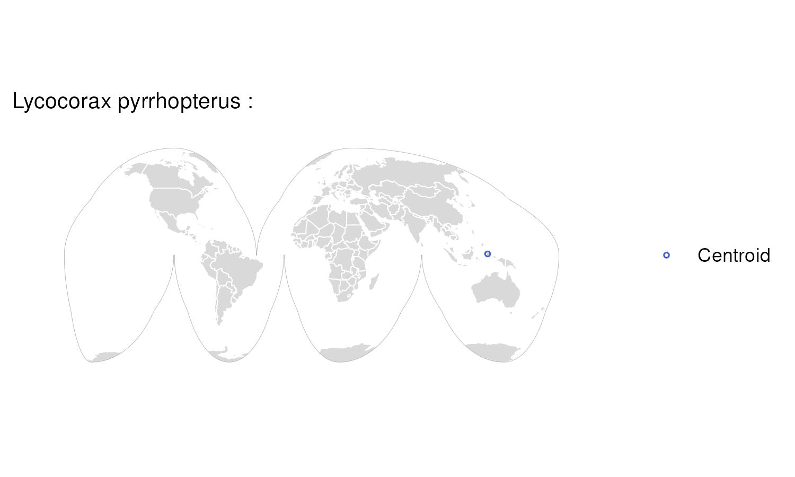

### Species: Mastacembelus armatus

**Biosample:** SAMEA104026378  
**Taxon:** Fishes  
**Priority:** 3  
**Flags:** Missing Sampling Location;  

### Species: Microcaecilia unicolor

**Biosample:** SAMEA104387962  
**Taxon:** Amphibians  
**Priority:** 3  
**Flags:** Missing Sampling Location;  

### Species: Micropterus salmoides

**Biosample:** SAMN15783178  
**Taxon:** Fishes  
**Priority:** 3  
**Flags:** Missing Sampling Location;  

### Species: Myripristis murdjan

**Biosample:** SAMEA4872133  
**Taxon:** Fishes  
**Priority:** 3  
**Flags:** Missing Sampling Location;  

### Species: Oenanthe melanoleuca

**Biosample:** SAMN33408179  
**Taxon:** Birds  
**Priority:** 3  
**Flags:** Missing Sampling Location;  

### Species: Onychomys torridus

**Biosample:** SAMEA104026389  
**Taxon:** Mammals  
**Priority:** 3  
**Flags:** Missing Sampling Location;  

### Species: Ornithorhynchus anatinus

**Biosample:** SAMN08537700  
**Taxon:** Mammals  
**Priority:** 3  
**Flags:** Missing Sampling Location;  

### Species: Ovis canadensis

**Biosample:** NA  
**Taxon:** Mammals  
**Priority:** 3  
**Flags:** Missing Sampling Location;  

### Species: Pan paniscus

**Biosample:** SAMN13935689  
**Taxon:** Mammals  
**Priority:** 3  
**Flags:** Missing Sampling Location;  

### Species: Pan troglodytes

**Biosample:** SAMN30216104  
**Taxon:** Mammals  
**Priority:** 3  
**Flags:** Missing Sampling Location;  

### Species: Parambassis ranga

**Biosample:** SAMEA4675621  
**Taxon:** Fishes  
**Priority:** 3  
**Flags:** Missing Sampling Location;  

### Species: Pipistrellus pipistrellus

**Biosample:** SAMEA994724  
**Taxon:** Mammals  
**Priority:** 3  
**Flags:** Missing Sampling Location;  

### Species: Pleurodeles waltl

**Biosample:** SAMN28911188  
**Taxon:** Amphibians  
**Priority:** 3  
**Flags:** Missing Sampling Location;  

### Species: Pongo abelii

**Biosample:** SAMN10521808  
**Taxon:** Mammals  
**Priority:** 3  
**Flags:** Missing Sampling Location;  

### Species: Pongo pygmaeus

**Biosample:** SAMN10521809  
**Taxon:** Mammals  
**Priority:** 3  
**Flags:** Missing Sampling Location;  

### Species: Protopterus annectens

**Biosample:** SAMN26533844  
**Taxon:** Fishes  
**Priority:** 3  
**Flags:** Missing Sampling Location;  
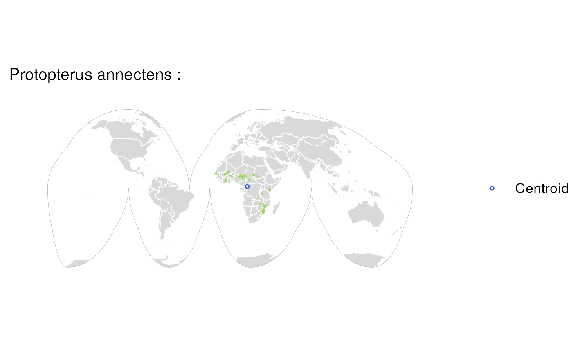

### Species: Rhinatrema bivittatum

**Biosample:** SAMEA104387956  
**Taxon:** Amphibians  
**Priority:** 3  
**Flags:** Missing Sampling Location;  

### Species: Salarias fasciatus

**Biosample:** SAMEA4966329  
**Taxon:** Fishes  
**Priority:** 3  
**Flags:** Missing Sampling Location;  

### Species: Salmo trutta

**Biosample:** SAMEA994732  
**Taxon:** Fishes  
**Priority:** 3  
**Flags:** Missing Sampling Location;  

### Species: Sciurus carolinensis

**Biosample:** SAMEA994726  
**Taxon:** Mammals  
**Priority:** 3  
**Flags:** Missing Sampling Location;  

### Species: Sciurus vulgaris

**Biosample:** SAMEA994733  
**Taxon:** Mammals  
**Priority:** 3  
**Flags:** Missing Sampling Location;  

### Species: Scleropages formosus

**Biosample:** SAMEA4872123  
**Taxon:** Fishes  
**Priority:** 3  
**Flags:** Missing Sampling Location;  

### Species: Scyliorhinus canicula

**Biosample:** SAMEA994730  
**Taxon:** Fishes  
**Priority:** 3  
**Flags:** Missing Sampling Location;  

### Species: Sparus aurata

**Biosample:** SAMEA104384835  
**Taxon:** Fishes  
**Priority:** 3  
**Flags:** Missing Sampling Location;  

### Species: Sphaeramia orbicularis

**Biosample:** SAMEA4966328  
**Taxon:** Fishes  
**Priority:** 3  
**Flags:** Missing Sampling Location;  

### Species: Streptopelia turtur

**Biosample:** SAMEA994735  
**Taxon:** Birds  
**Priority:** 3  
**Flags:** Missing Sampling Location;  

### Species: Symphalangus syndactylus

**Biosample:** SAMN30216103  
**Taxon:** Mammals  
**Priority:** 3  
**Flags:** Missing Sampling Location;  

### Species: Syngnathus acus

**Biosample:** SAMEA104381750  
**Taxon:** Fishes  
**Priority:** 3  
**Flags:** Missing Sampling Location;  

### Species: Takifugu rubripes

**Biosample:** SAMEA104384834  
**Taxon:** Fishes  
**Priority:** 3  
**Flags:** Missing Sampling Location;  

### Species: Thalassophryne amazonica

**Biosample:** SAMEA104129913  
**Taxon:** Fishes  
**Priority:** 3  
**Flags:** Missing Sampling Location;  

### Species: Tupaia tana

**Biosample:** SAMN07678117  
**Taxon:** Mammals  
**Priority:** 3  
**Flags:** Missing Sampling Location;  

### Species: Amia calva

**Biosample:** SAMN39643085  
**Taxon:** Fishes  
**Priority:** 4  
**Flags:** Missing Range;  

### Species: Ammodytes marinus

**Biosample:** SAMEA110137622  
**Taxon:** Fishes  
**Priority:** 4  
**Flags:** Missing Range;  

### Species: Argentina silus

**Biosample:** SAMEA110137623  
**Taxon:** Fishes  
**Priority:** 4  
**Flags:** Missing Range;  

### Species: Arripis georgiana

**Biosample:** SAMN40589644  
**Taxon:** Fishes  
**Priority:** 4  
**Flags:** Missing Range;  

### Species: Balanoglossus misakiensis

**Biosample:** SAMN40579982  
**Taxon:** Invertebrates  
**Priority:** 4  
**Flags:** Missing Range;  

### Species: Branchiostoma lanceolatum

**Biosample:** SAMN38372375  
**Taxon:** Invertebrates  
**Priority:** 4  
**Flags:** Missing Range;  

### Species: Centroberyx gerrardi

**Biosample:** SAMN41769328  
**Taxon:** Fishes  
**Priority:** 4  
**Flags:** Missing Range;  

### Species: Choerodon schoenleinii

**Biosample:** SAMN46014618  
**Taxon:** Fishes  
**Priority:** 4  
**Flags:** Missing Range;  

### Species: Cyclopterus lumpus

**Biosample:** SAMN12629502  
**Taxon:** Fishes  
**Priority:** 4  
**Flags:** Missing Range;  

### Species: Emys orbicularis

**Biosample:** SAMN31805221  
**Taxon:** Reptiles  
**Priority:** 4  
**Flags:** Missing Range;  

### Species: Fundulus diaphanus

**Biosample:** SAMN39736529  
**Taxon:** Fishes  
**Priority:** 4  
**Flags:** Missing Range;  

### Species: Lampris incognitus

**Biosample:** SAMN34060140  
**Taxon:** Fishes  
**Priority:** 4  
**Flags:** Missing Range;  

### Species: Latimeria chalumnae

**Biosample:** SAMN39710040  
**Taxon:** Fishes  
**Priority:** 4  
**Flags:** Missing Range;  

### Species: Lycodopsis pacificus

**Biosample:** SAMN32629383  
**Taxon:** Fishes  
**Priority:** 4  
**Flags:** Missing Range;  
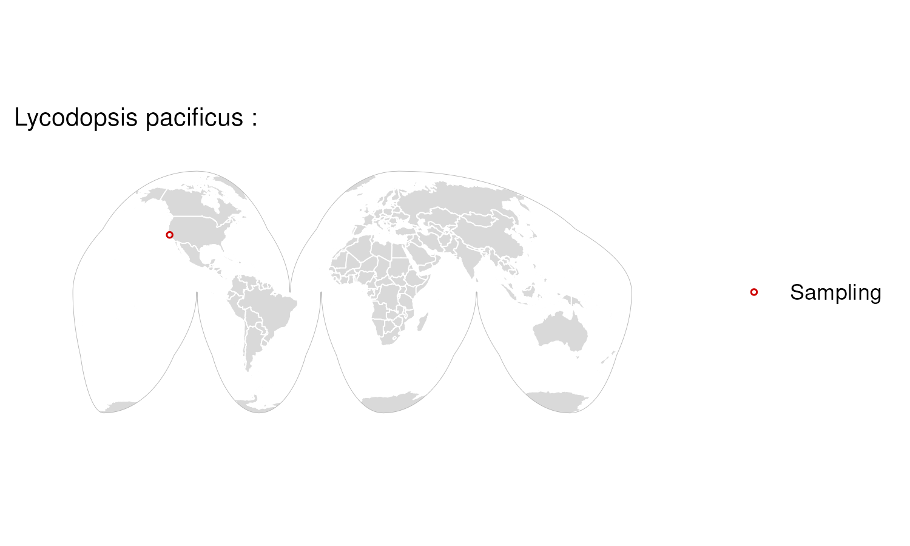

### Species: Myuchelys georgesi

**Biosample:** SAMN36918804  
**Taxon:** Reptiles  
**Priority:** 4  
**Flags:** Missing Range;  

### Species: Natator depressus

**Biosample:** SAMN46282745  
**Taxon:** Reptiles  
**Priority:** 4  
**Flags:** Missing Range;  

### Species: Pempheris klunzingeri

**Biosample:** SAMN40589649  
**Taxon:** Fishes  
**Priority:** 4  
**Flags:** Missing Range;  

### Species: Podocnemis expansa

**Biosample:** SAMN44516642  
**Taxon:** Reptiles  
**Priority:** 4  
**Flags:** Missing Range;  

### Species: Rhinogobio nasutus

**Biosample:** SAMN45903276  
**Taxon:** Fishes  
**Priority:** 4  
**Flags:** Missing Range;  

### Species: Rhinolophus yonghoiseni

**Biosample:** SAMN33413875  
**Taxon:** Mammals  
**Priority:** 4  
**Flags:** Missing Range;  

### Species: Sebastes fasciatus

**Biosample:** SAMN43039489  
**Taxon:** Fishes  
**Priority:** 4  
**Flags:** Missing Range;  

### Species: Sebastes umbrosus

**Biosample:** SAMN12629503  
**Taxon:** Fishes  
**Priority:** 4  
**Flags:** Missing Range;  

### Species: Acanthisitta chloris

**Biosample:** SAMN16442762  
**Taxon:** Birds  
**Priority:** 5  
**Flags:**  

### Species: Acanthopagrus schlegelii

**Biosample:** SAMN43087228  
**Taxon:** Fishes  
**Priority:** 5  
**Flags:**  

### Species: Aegotheles albertisi

**Biosample:** SAMN41085506  
**Taxon:** Birds  
**Priority:** 5  
**Flags:**  

### Species: Agelaius phoeniceus

**Biosample:** SAMN19590559  
**Taxon:** Birds  
**Priority:** 5  
**Flags:**  

### Species: Alca Torda

**Biosample:** SAMN12292087  
**Taxon:** Birds  
**Priority:** 5  
**Flags:**  

### Species: Alligator mississippiensis

**Biosample:** SAMN37045233  
**Taxon:** Reptiles  
**Priority:** 5  
**Flags:**  

### Species: Alosa sapidissima

**Biosample:** SAMN18857608  
**Taxon:** Fishes  
**Priority:** 5  
**Flags:**  

### Species: Amazona ochrocephala

**Biosample:** SAMN41018448  
**Taxon:** Birds  
**Priority:** 5  
**Flags:**  
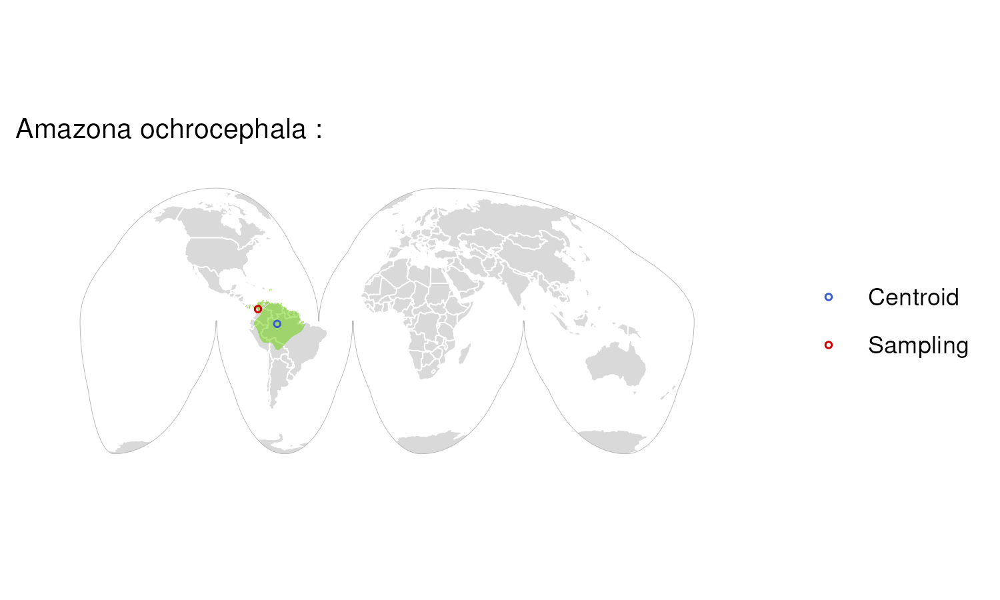

### Species: Amblyopsis spelaea

**Biosample:** SAMN45063415  
**Taxon:** Fishes  
**Priority:** 5  
**Flags:**  

### Species: Amblyraja radiata

**Biosample:** SAMN09948523  
**Taxon:** Fishes  
**Priority:** 5  
**Flags:**  

### Species: Ambystoma mexicanum x Ambystoma tigrinum

**Biosample:** SAMN43142723  
**Taxon:** Amphibians  
**Priority:** 5  
**Flags:**  

### Species: Ammodramus caudacutus

**Biosample:** SAMN28421630  
**Taxon:** Birds  
**Priority:** 5  
**Flags:**  

### Species: Ammospiza maritima

**Biosample:** SAMN39181024  
**Taxon:** Birds  
**Priority:** 5  
**Flags:**  

### Species: Ammospiza nelsoni

**Biosample:** SAMN28421656  
**Taxon:** Birds  
**Priority:** 5  
**Flags:**  

### Species: Anguilla anguilla

**Biosample:** SAMN12623627  
**Taxon:** Fishes  
**Priority:** 5  
**Flags:**  

### Species: Anniella stebbinsi

**Biosample:** SAMN33386066  
**Taxon:** Reptiles  
**Priority:** 5  
**Flags:**  

### Species: Anolis sagrei

**Biosample:** SAMN40144551  
**Taxon:** Reptiles  
**Priority:** 5  
**Flags:**  

### Species: Anomaloglossus baeobatrachus

**Biosample:** SAMN46966667  
**Taxon:** Amphibians  
**Priority:** 5  
**Flags:**  

### Species: Anser cygnoides

**Biosample:** SAMN41386743  
**Taxon:** Birds  
**Priority:** 5  
**Flags:**  

### Species: Aplochiton taeniatus

**Biosample:** SAMN12623621  
**Taxon:** Fishes  
**Priority:** 5  
**Flags:**  

### Species: Apus apus

**Biosample:** SAMN22785356  
**Taxon:** Birds  
**Priority:** 5  
**Flags:**  

### Species: Artibeus intermedius

**Biosample:** SAMN40002248  
**Taxon:** Mammals  
**Priority:** 5  
**Flags:**  

### Species: Artibeus lituratus

**Biosample:** SAMN40002247  
**Taxon:** Mammals  
**Priority:** 5  
**Flags:**  

### Species: Ascaphus truei

**Biosample:** SAMN41155128  
**Taxon:** Amphibians  
**Priority:** 5  
**Flags:**  

### Species: Aselliscus stoliczkanus

**Biosample:** SAMN33370315  
**Taxon:** Mammals  
**Priority:** 5  
**Flags:**  

### Species: Aspidoscelis tigris stejnegeri

**Biosample:** SAMN25872408  
**Taxon:** Reptiles  
**Priority:** 5  
**Flags:**  

### Species: Aulostomus maculatus

**Biosample:** SAMN43082348  
**Taxon:** Fishes  
**Priority:** 5  
**Flags:**  
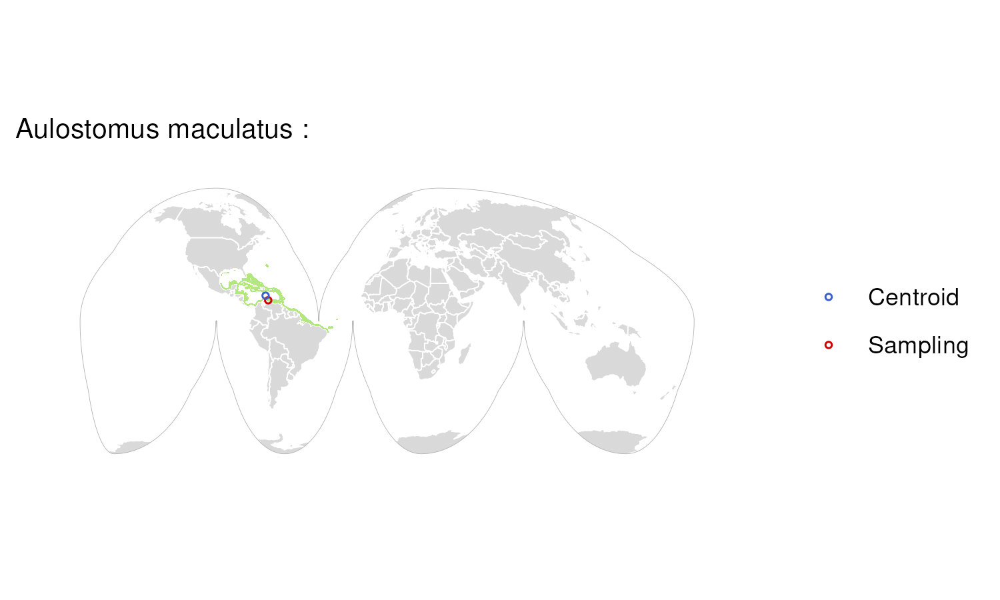

### Species: Aythya fuligula

**Biosample:** SAMN12621346  
**Taxon:** Birds  
**Priority:** 5  
**Flags:**  

### Species: Balaenoptera musculus

**Biosample:** SAMN12287136  
**Taxon:** Mammals  
**Priority:** 5  
**Flags:**  

### Species: Bombina bombina

**Biosample:** SAMN32378350  
**Taxon:** Amphibians  
**Priority:** 5  
**Flags:**  

### Species: Bradypodion pumilum

**Biosample:** SAMN35825189  
**Taxon:** Reptiles  
**Priority:** 5  
**Flags:**  

### Species: Callospermophilus lateralis

**Biosample:** SAMN47326584  
**Taxon:** Mammals  
**Priority:** 5  
**Flags:**  

### Species: Camelus dromedarius

**Biosample:** SAMN39296380  
**Taxon:** Mammals  
**Priority:** 5  
**Flags:**  

### Species: Carcharodon carcharias

**Biosample:** SAMN12629504  
**Taxon:** Fishes  
**Priority:** 5  
**Flags:**  

### Species: Caretta caretta

**Biosample:** SAMN46282778  
**Taxon:** Reptiles  
**Priority:** 5  
**Flags:**  

### Species: Castor canadensis

**Biosample:** SAMN45812786  
**Taxon:** Mammals  
**Priority:** 5  
**Flags:**  

### Species: Catharus ustulatus

**Biosample:** SAMN12618602  
**Taxon:** Birds  
**Priority:** 5  
**Flags:**  

### Species: Chaetodon trifascialis

**Biosample:** SAMN41253346  
**Taxon:** Fishes  
**Priority:** 5  
**Flags:**  

### Species: Chelmon rostratus

**Biosample:** SAMN12623620  
**Taxon:** Fishes  
**Priority:** 5  
**Flags:**  

### Species: Chelonia mydas

**Biosample:** SAMN12612360  
**Taxon:** Reptiles  
**Priority:** 5  
**Flags:**  

### Species: Chiroxiphia lanceolata

**Biosample:** SAMN12620979  
**Taxon:** Birds  
**Priority:** 5  
**Flags:**  

### Species: Chlamydotis macqueenii

**Biosample:** SAMN39296383  
**Taxon:** Birds  
**Priority:** 5  
**Flags:**  

### Species: Ciconia maguari

**Biosample:** SAMN18353822  
**Taxon:** Birds  
**Priority:** 5  
**Flags:**  

### Species: Coilia mystus

**Biosample:** SAMN46980313  
**Taxon:** Fishes  
**Priority:** 5  
**Flags:**  

### Species: Corvus moneduloides

**Biosample:** SAMN12368441  
**Taxon:** Birds  
**Priority:** 5  
**Flags:**  

### Species: Corynorhinus townsendii

**Biosample:** SAMN31536067  
**Taxon:** Mammals  
**Priority:** 5  
**Flags:**  

### Species: Coturnix chinensis

**Biosample:** SAMN41253798  
**Taxon:** Birds  
**Priority:** 5  
**Flags:**  

### Species: Ctenodactylus gundi

**Biosample:** SAMN47326412  
**Taxon:** Mammals  
**Priority:** 5  
**Flags:**  

### Species: Cuculus canorus

**Biosample:** SAMN12629508  
**Taxon:** Birds  
**Priority:** 5  
**Flags:**  

### Species: Cyanocitta cristata

**Biosample:** SAMN44574712  
**Taxon:** Birds  
**Priority:** 5  
**Flags:**  

### Species: Cygnus olor

**Biosample:** SAMN12621369  
**Taxon:** Birds  
**Priority:** 5  
**Flags:**  

### Species: Cynocephalus volans

**Biosample:** SAMN32206947  
**Taxon:** Mammals  
**Priority:** 5  
**Flags:**  

### Species: Cyprinella venusta

**Biosample:** SAMN40647018  
**Taxon:** Fishes  
**Priority:** 5  
**Flags:**  

### Species: Dasypus novemcinctus

**Biosample:** SAMN32738980  
**Taxon:** Mammals  
**Priority:** 5  
**Flags:**  

### Species: Dermochelys coriacea

**Biosample:** SAMN12629498  
**Taxon:** Reptiles  
**Priority:** 5  
**Flags:**  

### Species: Desmodus rotundus

**Biosample:** SAMN24116476  
**Taxon:** Mammals  
**Priority:** 5  
**Flags:**  

### Species: Diceros bicornis minor

**Biosample:** SAMN22047685  
**Taxon:** Mammals  
**Priority:** 5  
**Flags:**  

### Species: Diretmus argenteus

**Biosample:** SAMN47248252  
**Taxon:** Fishes  
**Priority:** 5  
**Flags:**  

### Species: Discoglossus pictus

**Biosample:** SAMN32227109  
**Taxon:** Amphibians  
**Priority:** 5  
**Flags:**  

### Species: Dixiphia pipra

**Biosample:** SAMN32739894  
**Taxon:** Birds  
**Priority:** 5  
**Flags:**  

### Species: Doryrhina cyclops

**Biosample:** SAMN33372470  
**Taxon:** Mammals  
**Priority:** 5  
**Flags:**  

### Species: Dromiciops gliroides

**Biosample:** SAMN18857598  
**Taxon:** Mammals  
**Priority:** 5  
**Flags:**  

### Species: Dryobates pubescens

**Biosample:** SAMN12629497  
**Taxon:** Birds  
**Priority:** 5  
**Flags:**  

### Species: Dugong dugon

**Biosample:** SAMN33212336  
**Taxon:** Mammals  
**Priority:** 5  
**Flags:**  

### Species: Eleutherodactylus coqui

**Biosample:** SAMN39150572  
**Taxon:** Amphibians  
**Priority:** 5  
**Flags:**  

### Species: Elgaria multicarinata webbii

**Biosample:** SAMN25872353  
**Taxon:** Reptiles  
**Priority:** 5  
**Flags:**  

### Species: Eptesicus fuscus

**Biosample:** SAMN30608903  
**Taxon:** Mammals  
**Priority:** 5  
**Flags:**  

### Species: Equus caballus

**Biosample:** SAMN39296386  
**Taxon:** Mammals  
**Priority:** 5  
**Flags:**  
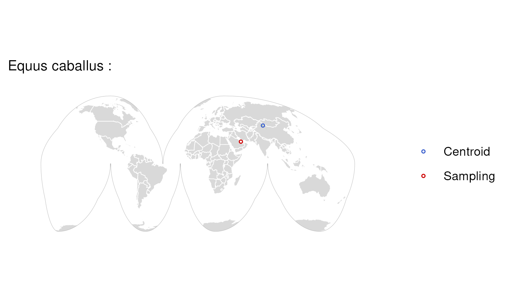

### Species: Erethizon dorsatum

**Biosample:** SAMN32359106  
**Taxon:** Mammals  
**Priority:** 5  
**Flags:**  

### Species: Eretmochelys imbricata

**Biosample:** SAMN46283036  
**Taxon:** Reptiles  
**Priority:** 5  
**Flags:**  

### Species: Erythrolamprus reginae

**Biosample:** SAMN32631248  
**Taxon:** Reptiles  
**Priority:** 5  
**Flags:**  

### Species: Eschrichtius robustus

**Biosample:** SAMN32629250  
**Taxon:** Mammals  
**Priority:** 5  
**Flags:**  

### Species: Esox lucius

**Biosample:** SAMN12623624  
**Taxon:** Fishes  
**Priority:** 5  
**Flags:**  

### Species: Eubalaena glacialis

**Biosample:** SAMN32746534  
**Taxon:** Mammals  
**Priority:** 5  
**Flags:**  

### Species: Euleptes europaea

**Biosample:** SAMN32622440  
**Taxon:** Reptiles  
**Priority:** 5  
**Flags:**  

### Species: Falco cherrug

**Biosample:** SAMN28688204  
**Taxon:** Birds  
**Priority:** 5  
**Flags:**  

### Species: Falco naumanni

**Biosample:** SAMN16870685  
**Taxon:** Birds  
**Priority:** 5  
**Flags:**  

### Species: Falco peregrinus

**Biosample:** SAMN28688290  
**Taxon:** Birds  
**Priority:** 5  
**Flags:**  

### Species: Gastrophryne carolinensis

**Biosample:** SAMN31805274  
**Taxon:** Amphibians  
**Priority:** 5  
**Flags:**  

### Species: Geothlypis trichas

**Biosample:** SAMN12631222  
**Taxon:** Birds  
**Priority:** 5  
**Flags:**  

### Species: Glossophaga mutica

**Biosample:** SAMN40946060  
**Taxon:** Mammals  
**Priority:** 5  
**Flags:**  

### Species: Grus americana

**Biosample:** SAMN32775697  
**Taxon:** Birds  
**Priority:** 5  
**Flags:**  

### Species: Guaruba guaruba

**Biosample:** SAMN44514542  
**Taxon:** Birds  
**Priority:** 5  
**Flags:**  

### Species: Gypaetus barbatus

**Biosample:** SAMN32256411  
**Taxon:** Birds  
**Priority:** 5  
**Flags:**  

### Species: Haemorhous mexicanus

**Biosample:** SAMN28453576  
**Taxon:** Birds  
**Priority:** 5  
**Flags:**  

### Species: Harpia harpyja

**Biosample:** SAMN31530492  
**Taxon:** Birds  
**Priority:** 5  
**Flags:**  

### Species: Heliangelus exortis

**Biosample:** SAMN37253778  
**Taxon:** Birds  
**Priority:** 5  
**Flags:**  

### Species: Hemiprocne comata

**Biosample:** SAMN22588383  
**Taxon:** Birds  
**Priority:** 5  
**Flags:**  

### Species: Heterodontus francisci

**Biosample:** SAMN39432692  
**Taxon:** Fishes  
**Priority:** 5  
**Flags:**  

### Species: Hippoglossus hippoglossus

**Biosample:** SAMN12629501  
**Taxon:** Fishes  
**Priority:** 5  
**Flags:**  

### Species: Hipposideros larvatus

**Biosample:** SAMN36277597  
**Taxon:** Mammals  
**Priority:** 5  
**Flags:**  

### Species: Hoplias malabaricus

**Biosample:** SAMN32740525  
**Taxon:** Fishes  
**Priority:** 5  
**Flags:**  

### Species: Hydrolagus colliei

**Biosample:** SAMN39156054  
**Taxon:** Fishes  
**Priority:** 5  
**Flags:**  

### Species: Hyla sarda

**Biosample:** SAMN32629340  
**Taxon:** Amphibians  
**Priority:** 5  
**Flags:**  

### Species: Hypanus sabinus

**Biosample:** SAMN32745077  
**Taxon:** Fishes  
**Priority:** 5  
**Flags:**  

### Species: Inia geoffrensis

**Biosample:** SAMN32797734  
**Taxon:** Mammals  
**Priority:** 5  
**Flags:**  

### Species: Kogia breviceps

**Biosample:** SAMN31719513  
**Taxon:** Mammals  
**Priority:** 5  
**Flags:**  

### Species: Lacerta agilis

**Biosample:** SAMN12629509  
**Taxon:** Reptiles  
**Priority:** 5  
**Flags:**  

### Species: Lagopus muta

**Biosample:** SAMN25144835  
**Taxon:** Birds  
**Priority:** 5  
**Flags:**  

### Species: Lepidochelys kempii

**Biosample:** SAMN46282779  
**Taxon:** Reptiles  
**Priority:** 5  
**Flags:**  
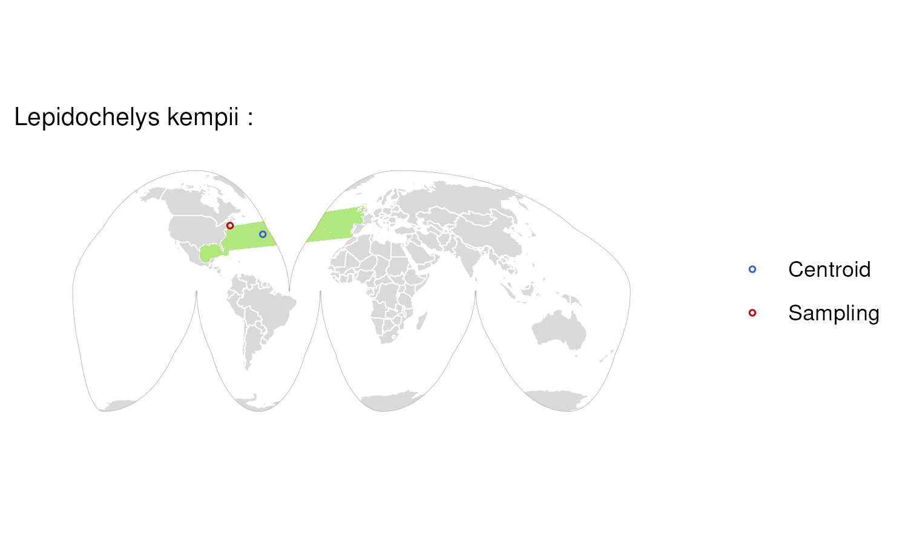

### Species: Lepidochelys olivacea

**Biosample:** SAMN46283035  
**Taxon:** Reptiles  
**Priority:** 5  
**Flags:**  

### Species: Lepisosteus oculatus

**Biosample:** SAMN41155427  
**Taxon:** Fishes  
**Priority:** 5  
**Flags:**  

### Species: Leptodactylus fuscus

**Biosample:** SAMN37055805  
**Taxon:** Amphibians  
**Priority:** 5  
**Flags:**  

### Species: Lonchura striata domestica

**Biosample:** SAMN44779081  
**Taxon:** Birds  
**Priority:** 5  
**Flags:**  

### Species: Macaca fascicularis

**Biosample:** SAMN38317298  
**Taxon:** Mammals  
**Priority:** 5  
**Flags:**  

### Species: Macrochelys suwanniensis

**Biosample:** SAMN37052244  
**Taxon:** Reptiles  
**Priority:** 5  
**Flags:**  

### Species: Macropus eugenii

**Biosample:** SAMN28408687  
**Taxon:** Mammals  
**Priority:** 5  
**Flags:**  

### Species: Malaclemys terrapin

**Biosample:** SAMN31394215  
**Taxon:** Reptiles  
**Priority:** 5  
**Flags:**  

### Species: Mantella aurantiaca

**Biosample:** SAMN46714743  
**Taxon:** Amphibians  
**Priority:** 5  
**Flags:**  

### Species: Marmota flaviventris

**Biosample:** SAMN45932315  
**Taxon:** Mammals  
**Priority:** 5  
**Flags:**  

### Species: Megalops cyprinoides

**Biosample:** SAMN12623619  
**Taxon:** Fishes  
**Priority:** 5  
**Flags:**  

### Species: Megaptera novaeangliae

**Biosample:** SAMN41059645  
**Taxon:** Mammals  
**Priority:** 5  
**Flags:**  

### Species: Melanotaenia boesemani

**Biosample:** SAMN12623618  
**Taxon:** Fishes  
**Priority:** 5  
**Flags:**  

### Species: Melospiza georgiana

**Biosample:** SAMN22787412  
**Taxon:** Birds  
**Priority:** 5  
**Flags:**  

### Species: Melospiza melodia

**Biosample:** SAMN35847297  
**Taxon:** Birds  
**Priority:** 5  
**Flags:**  

### Species: Menidia menidia

**Biosample:** SAMN46987722  
**Taxon:** Fishes  
**Priority:** 5  
**Flags:**  

### Species: Mergus octosetaceus

**Biosample:** SAMN39710078  
**Taxon:** Birds  
**Priority:** 5  
**Flags:**  

### Species: Mesoplodon densirostris

**Biosample:** SAMN29828597  
**Taxon:** Mammals  
**Priority:** 5  
**Flags:**  

### Species: Microtus pennsylvanicus

**Biosample:** SAMN39894136  
**Taxon:** Mammals  
**Priority:** 5  
**Flags:**  

### Species: Mobula birostris

**Biosample:** SAMN32746370  
**Taxon:** Fishes  
**Priority:** 5  
**Flags:**  

### Species: Molossus molossus

**Biosample:** SAMN14734448  
**Taxon:** Mammals  
**Priority:** 5  
**Flags:**  

### Species: Molossus nigricans

**Biosample:** SAMN40002246  
**Taxon:** Mammals  
**Priority:** 5  
**Flags:**  

### Species: Monodon monocero

**Biosample:** SAMN10872456  
**Taxon:** Mammals  
**Priority:** 5  
**Flags:**  

### Species: Morphnus guianensis

**Biosample:** SAMN44513986  
**Taxon:** Birds  
**Priority:** 5  
**Flags:**  

### Species: Mustela erminea

**Biosample:** SAMN12611999  
**Taxon:** Mammals  
**Priority:** 5  
**Flags:**  

### Species: Mustela lutreola

**Biosample:** SAMN35784236  
**Taxon:** Mammals  
**Priority:** 5  
**Flags:**  

### Species: Myotis myotis

**Biosample:** SAMN14734277  
**Taxon:** Mammals  
**Priority:** 5  
**Flags:**  

### Species: Narcine bancroftii

**Biosample:** SAMN39325148  
**Taxon:** Fishes  
**Priority:** 5  
**Flags:**  

### Species: Neoarius graeffei

**Biosample:** SAMN28453209  
**Taxon:** Fishes  
**Priority:** 5  
**Flags:**  

### Species: Notolabrus celidotus

**Biosample:** SAMN12623201  
**Taxon:** Fishes  
**Priority:** 5  
**Flags:**  

### Species: Nyctibius grandis

**Biosample:** SAMN12622411  
**Taxon:** Birds  
**Priority:** 5  
**Flags:**  

### Species: Ochotona princeps

**Biosample:** SAMN35822658  
**Taxon:** Mammals  
**Priority:** 5  
**Flags:**  

### Species: Odontesthes bonariensis

**Biosample:** SAMN31802211  
**Taxon:** Fishes  
**Priority:** 5  
**Flags:**  

### Species: Opisthocomus hoazin

**Biosample:** SAMN37055462  
**Taxon:** Birds  
**Priority:** 5  
**Flags:**  

### Species: Osmerus mordax

**Biosample:** SAMN40867348  
**Taxon:** Fishes  
**Priority:** 5  
**Flags:**  

### Species: Panthera onca

**Biosample:** SAMN44524170  
**Taxon:** Mammals  
**Priority:** 5  
**Flags:**  

### Species: Passer domesticus

**Biosample:** SAMN39255856  
**Taxon:** Birds  
**Priority:** 5  
**Flags:**  

### Species: Passerculus sandwichensis

**Biosample:** SAMN35784765  
**Taxon:** Birds  
**Priority:** 5  
**Flags:**  

### Species: Pelobates fuscus

**Biosample:** SAMN39244120  
**Taxon:** Amphibians  
**Priority:** 5  
**Flags:**  

### Species: Pelodytes ibericus

**Biosample:** SAMN37110875  
**Taxon:** Amphibians  
**Priority:** 5  
**Flags:**  

### Species: Peromyscus maniculatus

**Biosample:** SAMN29044276  
**Taxon:** Mammals  
**Priority:** 5  
**Flags:**  

### Species: Petromyzon marinus

**Biosample:** SAMN12629506  
**Taxon:** Fishes  
**Priority:** 5  
**Flags:**  

### Species: Phaethon aethereus

**Biosample:** SAMEA8228673  
**Taxon:** Birds  
**Priority:** 5  
**Flags:**  

### Species: Phaethornis superciliosus

**Biosample:** SAMN23532249  
**Taxon:** Birds  
**Priority:** 5  
**Flags:**  

### Species: Pipistrellus kuhlii

**Biosample:** SAMN14734388  
**Taxon:** Mammals  
**Priority:** 5  
**Flags:**  

### Species: Pluvialis apricaria

**Biosample:** SAMN18353970  
**Taxon:** Birds  
**Priority:** 5  
**Flags:**  

### Species: Podarcis raffonei

**Biosample:** SAMN28455423  
**Taxon:** Reptiles  
**Priority:** 5  
**Flags:**  

### Species: Podargus strigoides

**Biosample:** SAMN31801959  
**Taxon:** Birds  
**Priority:** 5  
**Flags:**  

### Species: Poecile atricapillus

**Biosample:** SAMN35074507  
**Taxon:** Birds  
**Priority:** 5  
**Flags:**  

### Species: Pogoniulus pusillus

**Biosample:** SAMN15098508  
**Taxon:** Birds  
**Priority:** 5  
**Flags:**  

### Species: Porphyrio hochstetteri

**Biosample:** SAMN22550412  
**Taxon:** Birds  
**Priority:** 5  
**Flags:**  

### Species: Pristiophorus japonicus

**Biosample:** SAMN44116980  
**Taxon:** Fishes  
**Priority:** 5  
**Flags:**  

### Species: Pristis pectinata

**Biosample:** SAMN12629505  
**Taxon:** Fishes  
**Priority:** 5  
**Flags:**  

### Species: Pseudophryne corroboree

**Biosample:** SAMN32631236  
**Taxon:** Amphibians  
**Priority:** 5  
**Flags:**  

### Species: Pseudorca crassidens

**Biosample:** SAMN41253811  
**Taxon:** Mammals  
**Priority:** 5  
**Flags:**  

### Species: Pterocles gutturalis

**Biosample:** SAMN12623217  
**Taxon:** Birds  
**Priority:** 5  
**Flags:**  

### Species: Rhineura floridana

**Biosample:** SAMN34105704  
**Taxon:** Reptiles  
**Priority:** 5  
**Flags:**  

### Species: Rhinolophus affinis

**Biosample:** SAMN33388345  
**Taxon:** Mammals  
**Priority:** 5  
**Flags:**  

### Species: Rhinolophus ferrumequinum

**Biosample:** SAMN09948510  
**Taxon:** Mammals  
**Priority:** 5  
**Flags:**  

### Species: Rhinolophus perniger lanosus

**Biosample:** SAMN33438666  
**Taxon:** Mammals  
**Priority:** 5  
**Flags:**  

### Species: Rhinolophus trifoliatus

**Biosample:** SAMN33421007  
**Taxon:** Mammals  
**Priority:** 5  
**Flags:**  

### Species: Rhinophrynus dorsalis

**Biosample:** SAMN40302865  
**Taxon:** Amphibians  
**Priority:** 5  
**Flags:**  

### Species: Rhynchonycteris naso

**Biosample:** SAMN39947078  
**Taxon:** Mammals  
**Priority:** 5  
**Flags:**  

### Species: Rissa tridactyla

**Biosample:** SAMN32104255  
**Taxon:** Birds  
**Priority:** 5  
**Flags:**  

### Species: Saccopteryx bilineata

**Biosample:** SAMN37288508  
**Taxon:** Mammals  
**Priority:** 5  
**Flags:**  

### Species: Saccopteryx leptura

**Biosample:** SAMN37390139  
**Taxon:** Mammals  
**Priority:** 5  
**Flags:**  

### Species: Salminus brasiliensis

**Biosample:** SAMN35075251  
**Taxon:** Fishes  
**Priority:** 5  
**Flags:**  

### Species: Salvelinus alpinus

**Biosample:** SAMN36900063  
**Taxon:** Fishes  
**Priority:** 5  
**Flags:**  

### Species: Sarcoramphus papa

**Biosample:** SAMN40647026  
**Taxon:** Birds  
**Priority:** 5  
**Flags:**  

### Species: Scatophagus argus

**Biosample:** SAMN12623616  
**Taxon:** Fishes  
**Priority:** 5  
**Flags:**  

### Species: Scomber japonicus

**Biosample:** SAMN32224830  
**Taxon:** Fishes  
**Priority:** 5  
**Flags:**  

### Species: Shinisaurus crocodilurus

**Biosample:** SAMN19072228  
**Taxon:** Reptiles  
**Priority:** 5  
**Flags:**  

### Species: Sminthopsis crassicaudata

**Biosample:** SAMN47327922  
**Taxon:** Mammals  
**Priority:** 5  
**Flags:**  

### Species: Sorex araneus

**Biosample:** SAMN32477717  
**Taxon:** Mammals  
**Priority:** 5  
**Flags:**  

### Species: Spea bombifrons

**Biosample:** SAMN28408467  
**Taxon:** Amphibians  
**Priority:** 5  
**Flags:**  

### Species: Stegostoma tigrinum

**Biosample:** SAMN35823397  
**Taxon:** Fishes  
**Priority:** 5  
**Flags:**  
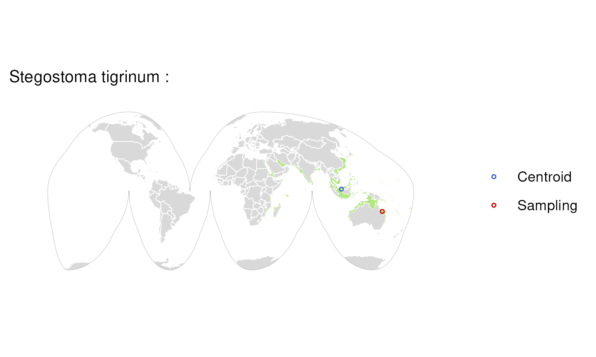

### Species: Sterna hirundo

**Biosample:** SAMN12369541  
**Taxon:** Birds  
**Priority:** 5  
**Flags:**  

### Species: Sternotherus odoratus

**Biosample:** SAMN36942441  
**Taxon:** Reptiles  
**Priority:** 5  
**Flags:**  

### Species: Strix aluco

**Biosample:** SAMN37055808  
**Taxon:** Birds  
**Priority:** 5  
**Flags:**  

### Species: Struthio camelus australis

**Biosample:** SAMN42123890  
**Taxon:** Birds  
**Priority:** 5  
**Flags:**  

### Species: Sylvia atricapilla

**Biosample:** SAMN12369542  
**Taxon:** Birds  
**Priority:** 5  
**Flags:**  

### Species: Sylvia borin

**Biosample:** SAMN12618613  
**Taxon:** Birds  
**Priority:** 5  
**Flags:**  

### Species: Syngnathus typhle

**Biosample:** SAMN36735486  
**Taxon:** Fishes  
**Priority:** 5  
**Flags:**  

### Species: Tachyglossus aculeatus

**Biosample:** SAMN12634963  
**Taxon:** Mammals  
**Priority:** 5  
**Flags:**  

### Species: Tadarida brasiliensis

**Biosample:** SAMN35075070  
**Taxon:** Mammals  
**Priority:** 5  
**Flags:**  

### Species: Tamandua tetradactyla

**Biosample:** SAMN12612337  
**Taxon:** Mammals  
**Priority:** 5  
**Flags:**  

### Species: Tautogolabrus adspersus

**Biosample:** SAMN22589422  
**Taxon:** Fishes  
**Priority:** 5  
**Flags:**  

### Species: Theristicus caerulescens

**Biosample:** SAMN22550094  
**Taxon:** Birds  
**Priority:** 5  
**Flags:**  

### Species: Thomomys bottae

**Biosample:** SAMN37300244  
**Taxon:** Mammals  
**Priority:** 5  
**Flags:**  

### Species: Tiliqua scincoides

**Biosample:** SAMN37319749  
**Taxon:** Reptiles  
**Priority:** 5  
**Flags:**  

### Species: Trichechus inunguis

**Biosample:** SAMN44524440  
**Taxon:** Mammals  
**Priority:** 5  
**Flags:**  

### Species: Trichomycterus rosablanca

**Biosample:** SAMN32755940  
**Taxon:** Fishes  
**Priority:** 5  
**Flags:**  

### Species: Trogon surrucura

**Biosample:** SAMN22550082  
**Taxon:** Birds  
**Priority:** 5  
**Flags:**  

### Species: Tursiops truncatus

**Biosample:** SAMN12326775  
**Taxon:** Mammals  
**Priority:** 5  
**Flags:**  

### Species: Urocitellus parryii

**Biosample:** SAMN44461866  
**Taxon:** Mammals  
**Priority:** 5  
**Flags:**  

### Species: Vidua chalybeata

**Biosample:** SAMN12254000  
**Taxon:** Birds  
**Priority:** 5  
**Flags:**  

### Species: Vipera latastei

**Biosample:** SAMN28408464  
**Taxon:** Reptiles  
**Priority:** 5  
**Flags:**  

### Species: Willisornis vidua

**Biosample:** SAMN44516465  
**Taxon:** Birds  
**Priority:** 5  
**Flags:**  

### Species: Zalophus californianus

**Biosample:** SAMN12368149  
**Taxon:** Mammals  
**Priority:** 5  
**Flags:**  

### Species: Zonotrichia albicollis

**Biosample:** SAMN46390924  
**Taxon:** Birds  
**Priority:** 5  
**Flags:**  

