## Sampling Map

## Range Centroid Map

## Heatmap of Distributions

## Individual Species Maps

Species: Ovis aries; Taxon: Mammals; Flags: Vague Location;
Domesticated; Missing Range;

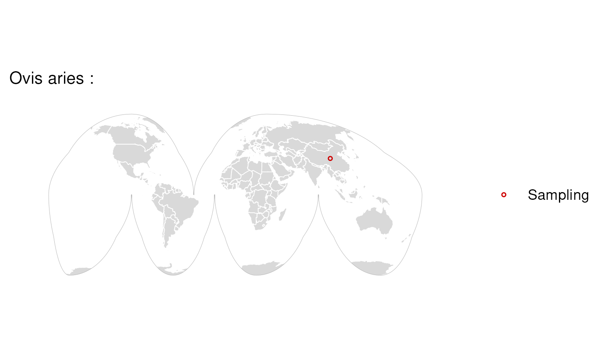

Species: Acomys minous; Taxon: Mammals; Flags: Outside Range; Vague
Location;

Species: Aplidium turbinatum; Taxon: Invertebrates; Flags: Vague
Location; Missing Range;

Species: Ascidia mentula; Taxon: Invertebrates; Flags: Vague Location;
Missing Range;

Species: Ascidiella aspersa; Taxon: Invertebrates; Flags: Vague
Location; Missing Range;

Species: Astatotilapia calliptera; Taxon: Fishes; Flags: Outside Range;
Vague Location;

Species: Aulonocara stuartgranti; Taxon: Fishes; Flags: Outside Range;
Vague Location;

Species: Balearica regulorum gibbericeps; Taxon: Birds; Flags: Zoo
Sample; Missing Range;

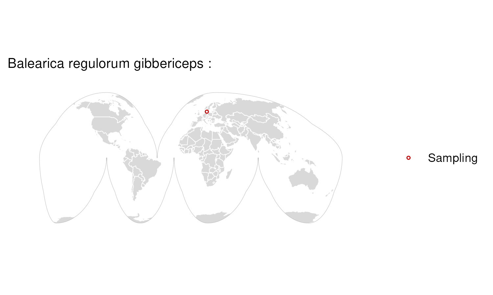

Species: Blennius ocellaris; Taxon: Fishes; Flags: Outside Range; Vague
Location;

Species: Bombina variegata; Taxon: Amphibians; Flags: Outside Range;
Vague Location;

Species: Borostomias antarcticus; Taxon: Fishes; Flags: Outside Range;
Vague Location;

Species: Bos taurus; Taxon: Mammals; Flags: Domesticated; Missing Range;

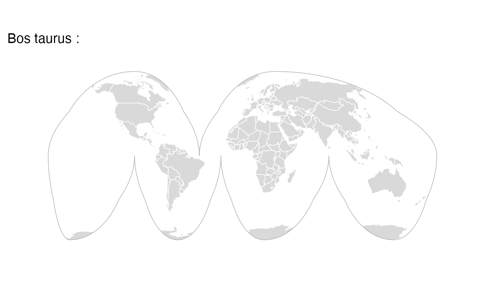

Species: Calonectris borealis; Taxon: Birds; Flags: Outside Range; Vague
Location;

Species: Canis lupus orion; Taxon: Mammals; Flags: Vague Location;
Domesticated;

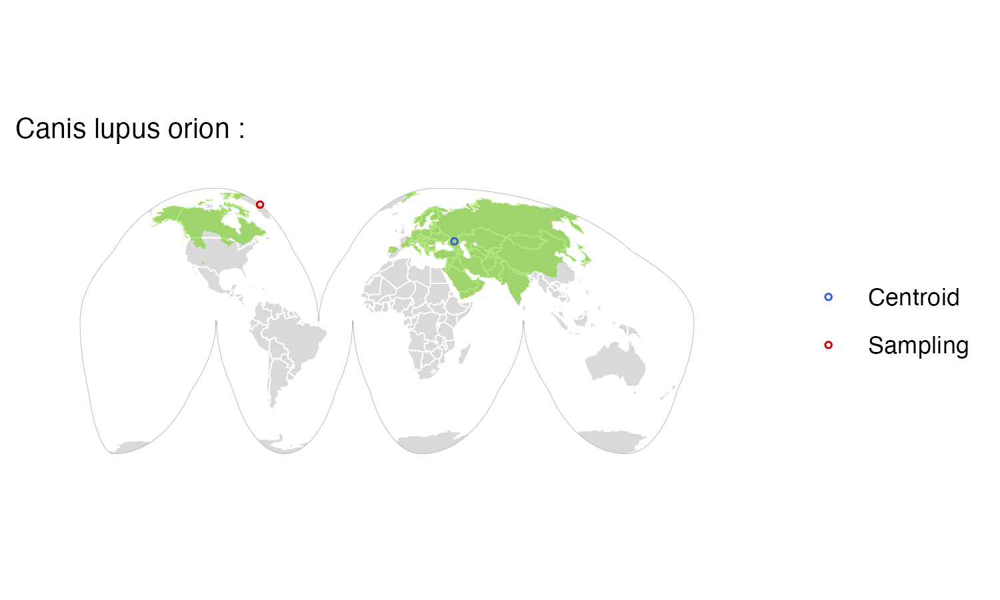

Species: Capra hircus; Taxon: Mammals; Flags: Domesticated; Missing
Range;

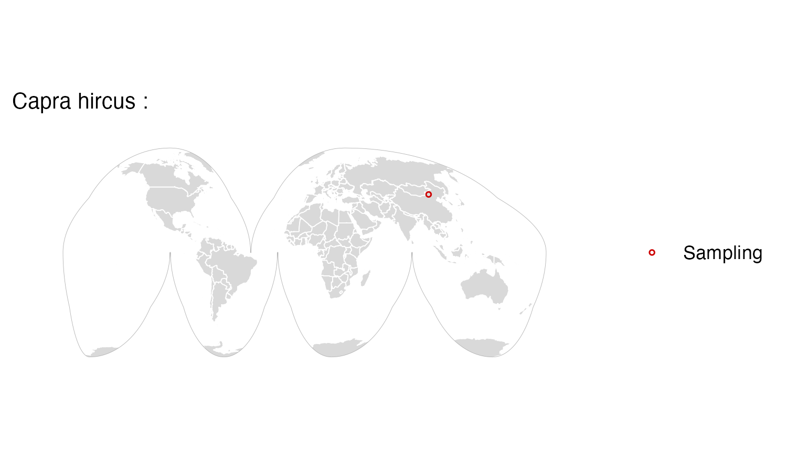

Species: Carettochelys insculpta; Taxon: Reptiles; Flags: Outside Range;
Vague Location;

Species: Clavelina lepadiformis; Taxon: Invertebrates; Flags: Vague
Location; Missing Range;

Species: Corella eumyota; Taxon: Invertebrates; Flags: Vague Location;
Missing Range;

Species: Danio rerio; Taxon: Fishes; Flags: Vague Location; Missing
Range;

Species: Echiichthys vipera; Taxon: Fishes; Flags: Vague Location;
Missing Range;

Species: Electrophorus electricus; Taxon: Fishes; Flags: Outside Range;
Vague Location;

Species: Epinephelus lanceolatus; Taxon: Fishes; Flags: Outside Range;
Vague Location;

Species: Eutrigla gurnardus; Taxon: Fishes; Flags: Vague Location;
Missing Range;

Species: Gallus gallus; Taxon: Birds; Flags: Outside Range;
Domesticated;

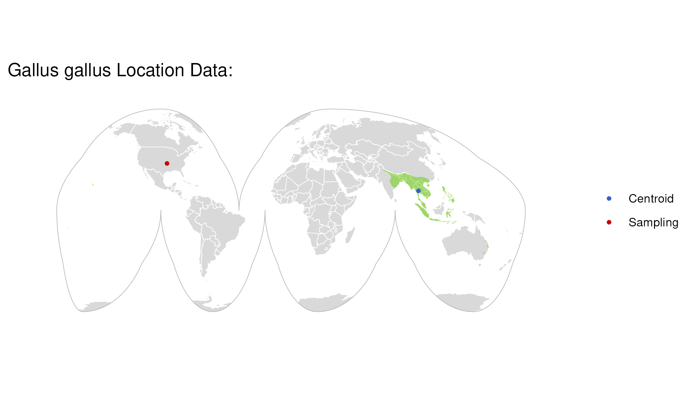

Species: Grus grus; Taxon: Birds; Flags: Outside Range; Vague Location;

Species: Gymnoscopelus microlampas; Taxon: Fishes; Flags: Outside Range;
Vague Location;

Species: Haliaeetus albicilla; Taxon: Birds; Flags: Outside Range; Vague
Location;

Species: Hyperoodon ampullatus; Taxon: Mammals; Flags: Outside Range;
Vague Location;

Species: Hyperoplus immaculatus; Taxon: Fishes; Flags: Vague Location;
Missing Range;

Species: Melanostigma gelatinosum; Taxon: Fishes; Flags: Vague Location;
Missing Range;

Species: Mesoplodon bidens; Taxon: Mammals; Flags: Outside Range; Vague
Location;

Species: Mesoplodon mirus; Taxon: Mammals; Flags: Outside Range; Vague
Location;

Species: Micromesistius poutassou; Taxon: Fishes; Flags: Vague Location;
Missing Range;

Species: Myxine glutinosa; Taxon: Fishes; Flags: Outside Range; Vague
Location;

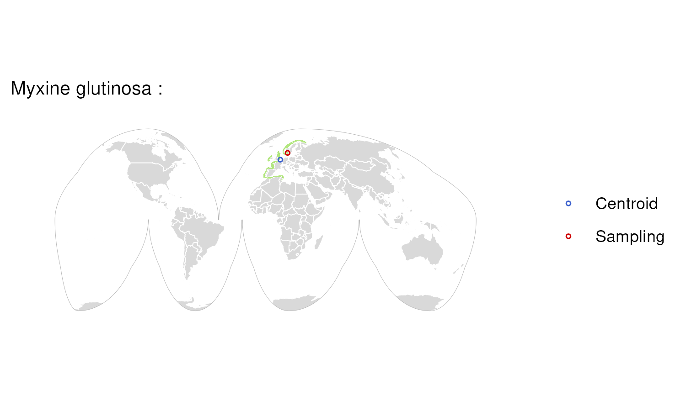

Species: Nansenia antarctica; Taxon: Fishes; Flags: Vague Location;
Missing Range;

Species: Neogale vison; Taxon: Mammals; Flags: Outside Range; Vague
Location;

Species: Netta rufina; Taxon: Birds; Flags: Outside Range; Vague
Location;

Species: Notolepis coatsi; Taxon: Fishes; Flags: Vague Location; Missing
Range;

Species: Notothenia rossii; Taxon: Fishes; Flags: Vague Location;
Missing Range;

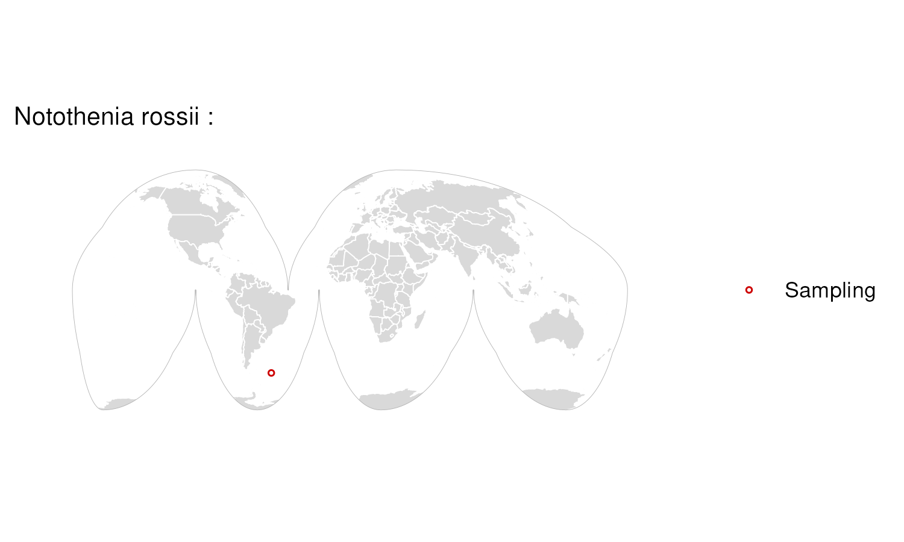

Species: Oryctolagus cuniculus; Taxon: Mammals; Flags: Outside Range;
Vague Location;

Species: Pagrus pagrus; Taxon: Fishes; Flags: Outside Range; Vague
Location;

Species: Pelophylax lessonae; Taxon: Amphibians; Flags: Outside Range;
Vague Location;

Species: Phalacrocorax carbo; Taxon: Birds; Flags: Outside Range; Vague
Location;

Species: Phascolarctos cinereus; Taxon: Mammals; Flags: Outside Range;
Vague Location;

Species: Pholis gunnellus; Taxon: Fishes; Flags: Vague Location; Missing
Range;

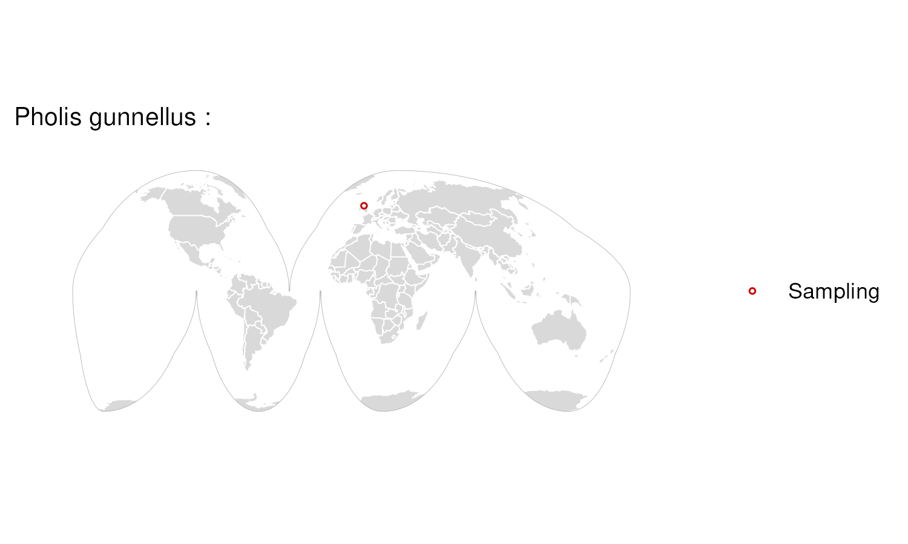

Species: Pipistrellus hanaki; Taxon: Mammals; Flags: Outside Range;
Vague Location;

Species: Platalea leucorodia; Taxon: Birds; Flags: Outside Range; Vague
Location;

Species: Podarcis bocagei; Taxon: Reptiles; Flags: Outside Range; Vague
Location;

Species: Podarcis cretensis; Taxon: Reptiles; Flags: Outside Range;
Vague Location;

Species: Podarcis filfolensis; Taxon: Reptiles; Flags: Outside Range;
Vague Location;

Species: Podarcis liolepis; Taxon: Reptiles; Flags: Outside Range; Vague
Location;

Species: Podarcis pityusensis; Taxon: Reptiles; Flags: Outside Range;
Vague Location;

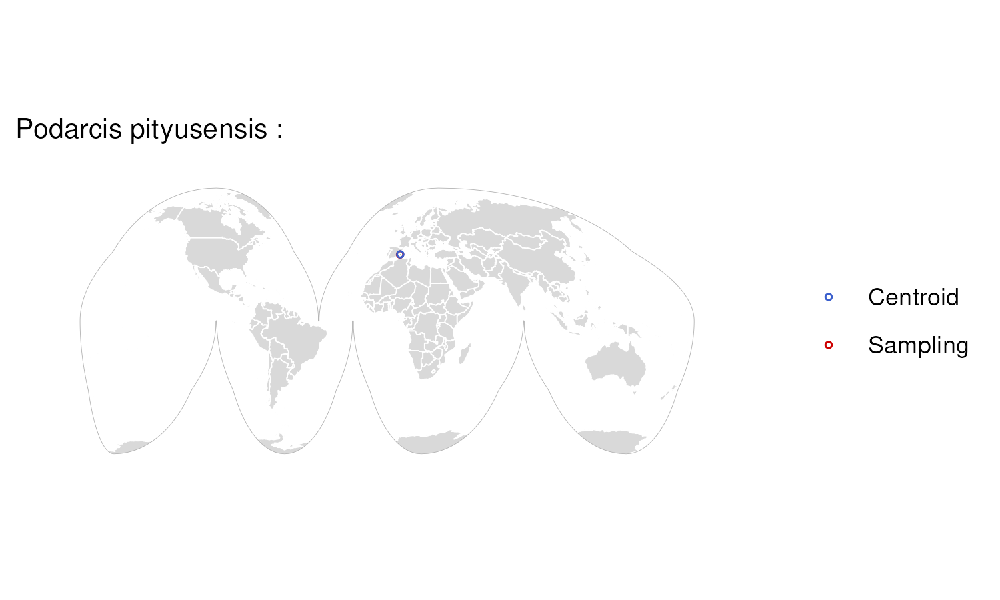

Species: Podarcis tiliguerta; Taxon: Reptiles; Flags: Outside Range;
Vague Location;

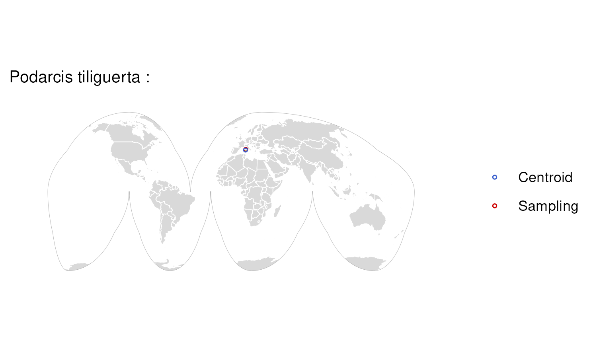

Species: Podarcis vaucheri; Taxon: Reptiles; Flags: Outside Range; Vague
Location;

Species: Poromitra crassiceps; Taxon: Fishes; Flags: Outside Range;
Vague Location;

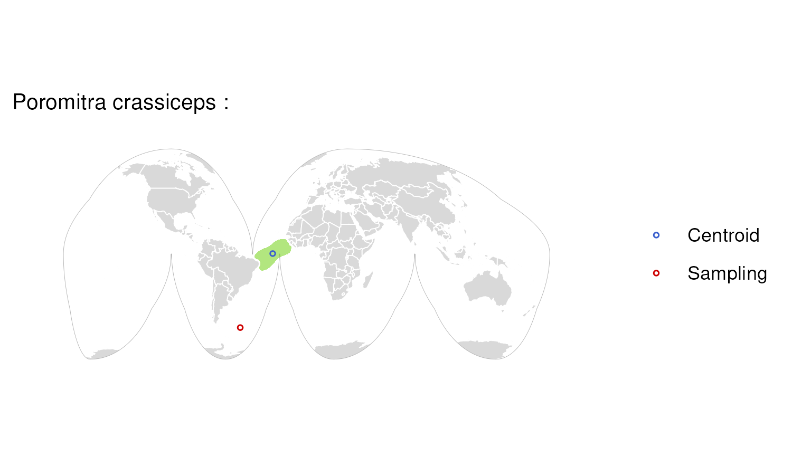

Species: Protomyctophum parallelum; Taxon: Fishes; Flags: Outside Range;
Vague Location;

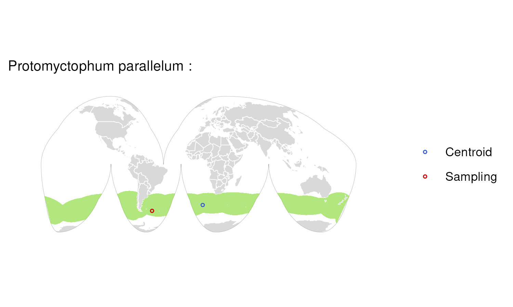

Species: Rhamphochromis chilingali; Taxon: Fishes; Flags: Vague
Location; Missing Range;

Species: Solea solea; Taxon: Fishes; Flags: Outside Range; Vague
Location;

Species: Spermophilus citellus; Taxon: Mammals; Flags: Outside Range;
Vague Location;

Species: Stenella coeruleoalba; Taxon: Mammals; Flags: Outside Range;
Vague Location;

Species: Styela clava; Taxon: Invertebrates; Flags: Vague Location;
Missing Range;

Species: Telmatherina bonti; Taxon: Fishes; Flags: Outside Range; Vague
Location;

Species: Tetrao urogallus; Taxon: Birds; Flags: Outside Range; Vague
Location;

Species: Thalia democratica; Taxon: Invertebrates; Flags: Vague
Location; Missing Range;

Species: Thunnus albacares; Taxon: Fishes; Flags: Outside Range; Vague
Location;

Species: Thunnus maccoyii; Taxon: Fishes; Flags: Outside Range; Vague
Location;

Species: Thunnus thynnus; Taxon: Fishes; Flags: Outside Range; Vague
Location;

Species: Trididemnum clinides; Taxon: Invertebrates; Flags: Vague
Location; Missing Range;

Species: Zosterops lateralis; Taxon: Birds; Flags: Outside Range; Vague
Location;

Species: Abramis brama; Taxon: Fishes; Flags: Vague Location;

Species: Accipiter gentilis; Taxon: Birds; Flags: Vague Location;

Species: Acridotheres tristis; Taxon: Birds; Flags: Outside Range;

Species: Amia calva; Taxon: Fishes; Flags: Missing Range;

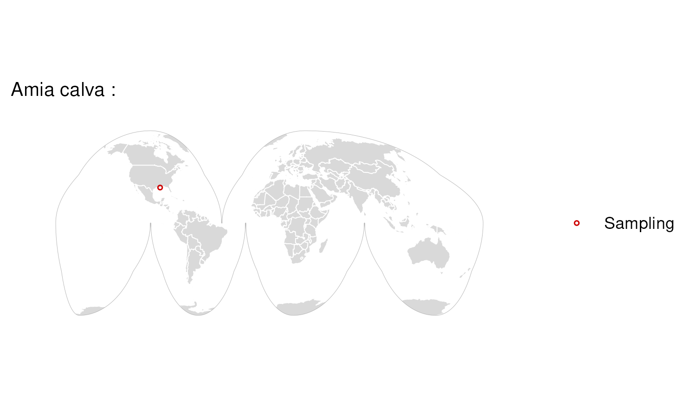

Species: Ammodytes marinus; Taxon: Fishes; Flags: Missing Range;

Species: Anableps anableps; Taxon: Fishes; Flags: Zoo Sample;

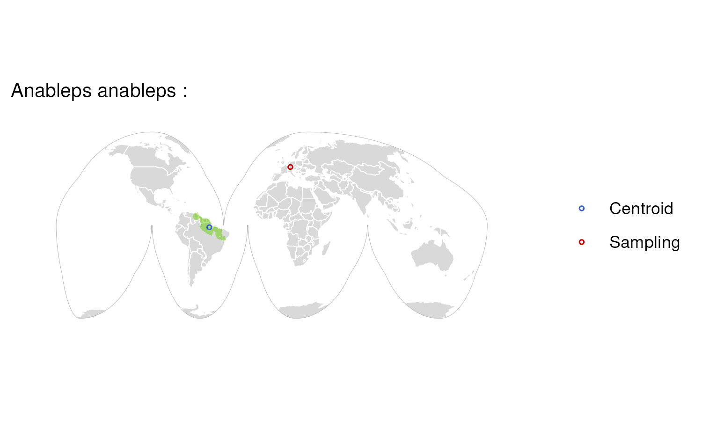

Species: Anas acuta; Taxon: Birds; Flags: Vague Location;

Species: Anas platyrhynchos; Taxon: Birds; Flags: Vague Location;

Species: Anser anser; Taxon: Birds; Flags: Vague Location;

Species: Anser brachyrhynchus; Taxon: Birds; Flags: Vague Location;

Species: Antennarius maculatus; Taxon: Fishes; Flags: Outside Range;

Species: Antrozous pallidus; Taxon: Mammals; Flags: Outside Range;

Species: Apodemus sylvaticus; Taxon: Mammals; Flags: Vague Location;

Species: Apteryx mantelli; Taxon: Birds; Flags: Zoo Sample;

Species: Ara ararauna; Taxon: Birds; Flags: Outside Range;

Species: Archocentrus centrarchus; Taxon: Fishes; Flags: Outside Range;

Species: Argentina silus; Taxon: Fishes; Flags: Missing Range;

Species: Arripis georgiana; Taxon: Fishes; Flags: Missing Range;

Species: Arvicanthis niloticus; Taxon: Mammals; Flags: Outside Range;

Species: Asterias rubens; Taxon: Invertebrates; Flags: Missing Range;

Species: Athene noctua; Taxon: Birds; Flags: Vague Location;

Species: Aythya ferina; Taxon: Birds; Flags: Vague Location;

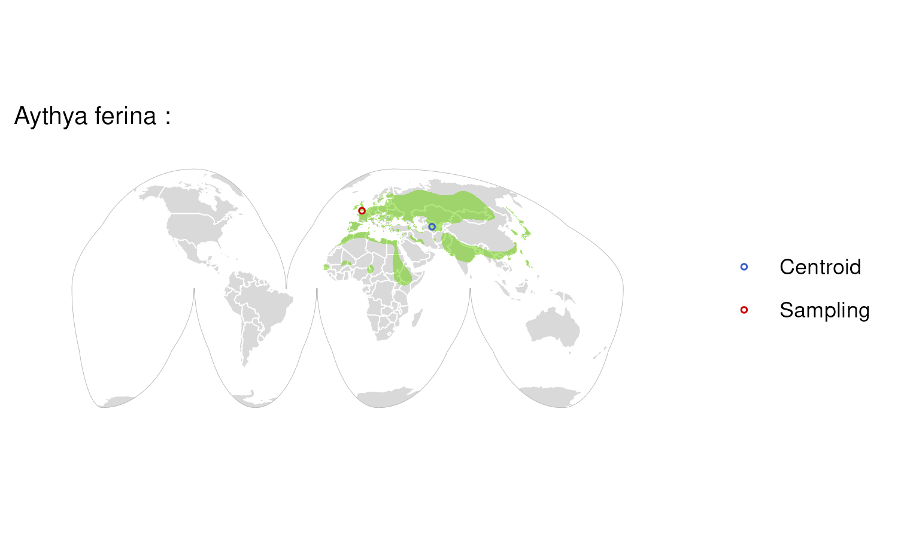

Species: Aythya marila; Taxon: Birds; Flags: Vague Location;

Species: Balaenoptera acutorostrata; Taxon: Mammals; Flags: Vague
Location;

Species: Balaenoptera borealis; Taxon: Mammals; Flags: Vague Location;

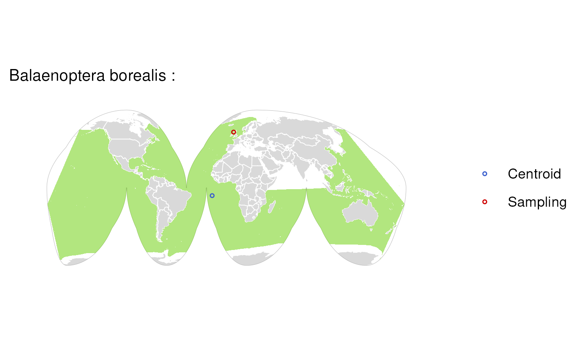

Species: Balaenoptera physalus; Taxon: Mammals; Flags: Vague Location;

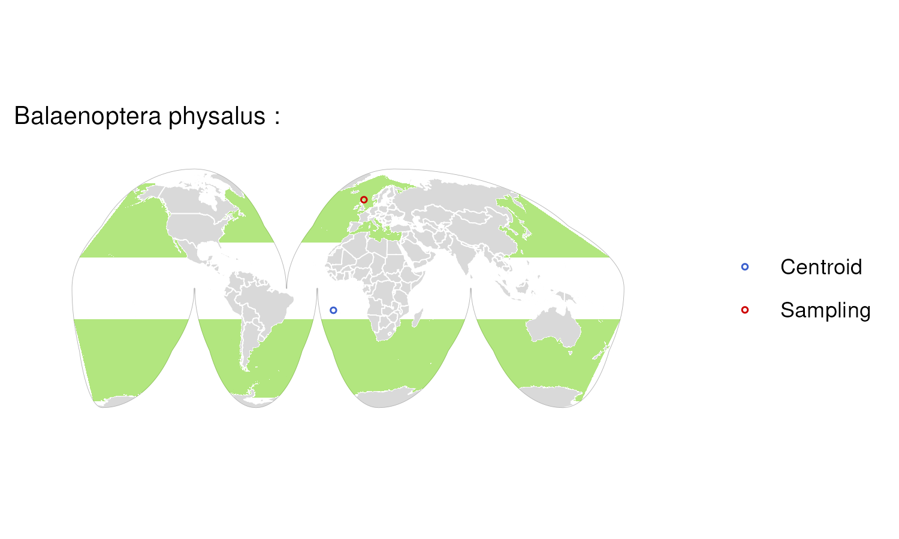

Species: Balaenoptera ricei; Taxon: Mammals; Flags: Outside Range;

Species: Balanoglossus misakiensis; Taxon: Invertebrates; Flags: Missing
Range;

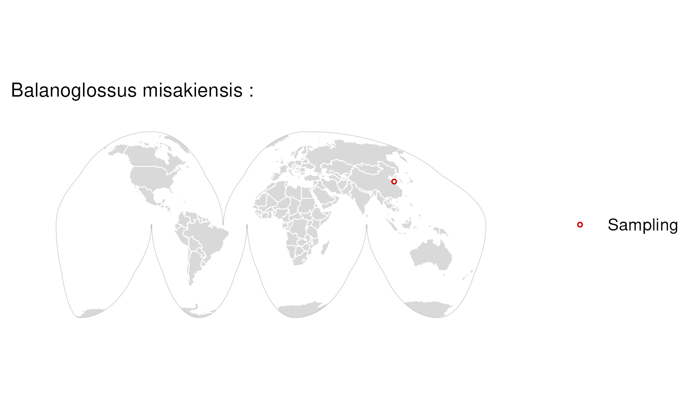

Species: Barbatula barbatula; Taxon: Fishes; Flags: Vague Location;

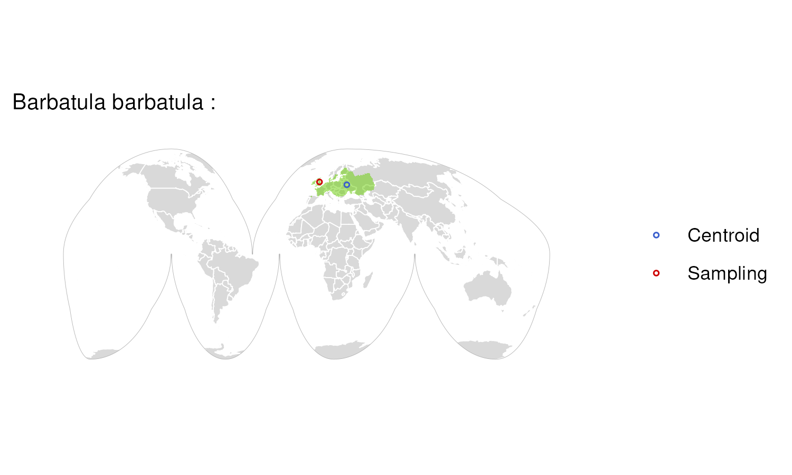

Species: Barbus barbus; Taxon: Fishes; Flags: Vague Location;

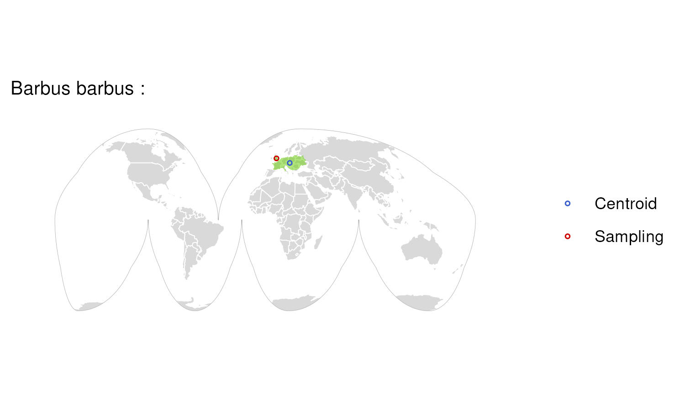

Species: Branchiostoma belcheri; Taxon: Invertebrates; Flags: Missing
Range;

Species: Branchiostoma floridae; Taxon: Invertebrates; Flags: Missing
Range;

Species: Branchiostoma lanceolatum; Taxon: Invertebrates; Flags: Missing
Range;

Species: Branta canadensis; Taxon: Birds; Flags: Vague Location;

Species: Bucephala clangula; Taxon: Birds; Flags: Vague Location;

Species: Bucorvus abyssinicus; Taxon: Birds; Flags: Zoo Sample;

Species: Bufo bufo; Taxon: Amphibians; Flags: Vague Location;

Species: Buteo buteo; Taxon: Birds; Flags: Vague Location;

Species: Caesio teres; Taxon: Fishes; Flags: Vague Location;

Species: Callithrix jacchus; Taxon: Mammals; Flags: Outside Range;

Species: Caloenas nicobarica; Taxon: Birds; Flags: Zoo Sample;

Species: Calypte anna; Taxon: Birds; Flags: Outside Range;

Species: Candoia aspera; Taxon: Reptiles; Flags: Outside Range;

Species: Canis lupus baileyi; Taxon: Mammals; Flags: Domesticated;

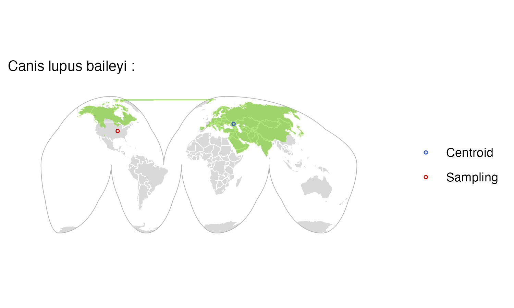

Species: Canis lupus familiaris; Taxon: Mammals; Flags: Domesticated;

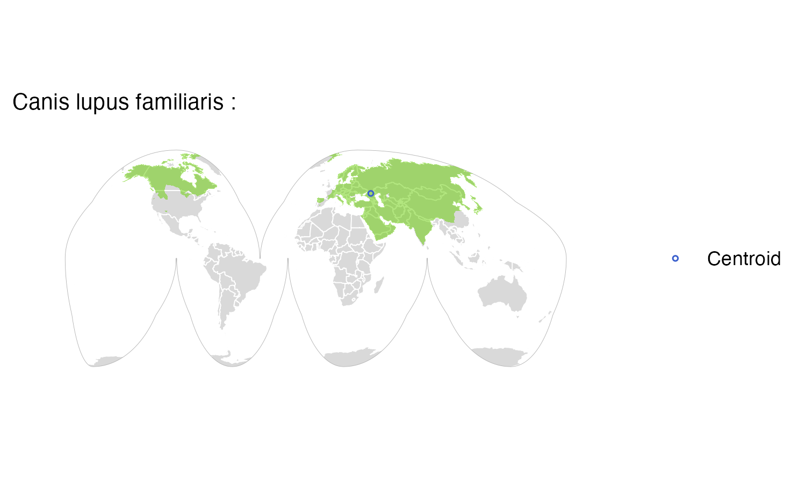

Species: Caprimulgus europaeus; Taxon: Birds; Flags: Vague Location;

Species: Carassius carassius; Taxon: Fishes; Flags: Vague Location;

Species: Cariama cristata; Taxon: Birds; Flags: Zoo Sample;

Species: Centroberyx gerrardi; Taxon: Fishes; Flags: Missing Range;

Species: Cervus elaphus; Taxon: Mammals; Flags: Vague Location;

Species: Cetorhinus maximus; Taxon: Fishes; Flags: Vague Location;

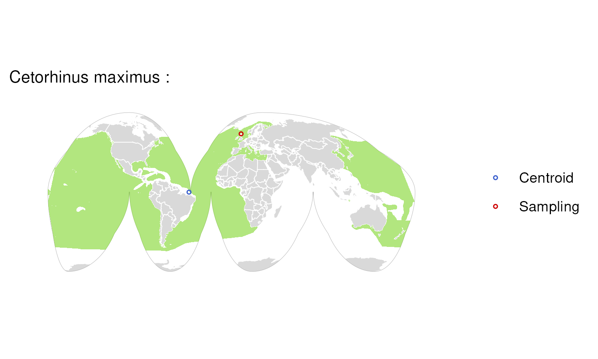

Species: Chelon labrosus; Taxon: Fishes; Flags: Vague Location;

Species: Chionomys nivalis; Taxon: Mammals; Flags: Vague Location;

Species: Choerodon schoenleinii; Taxon: Fishes; Flags: Missing Range;

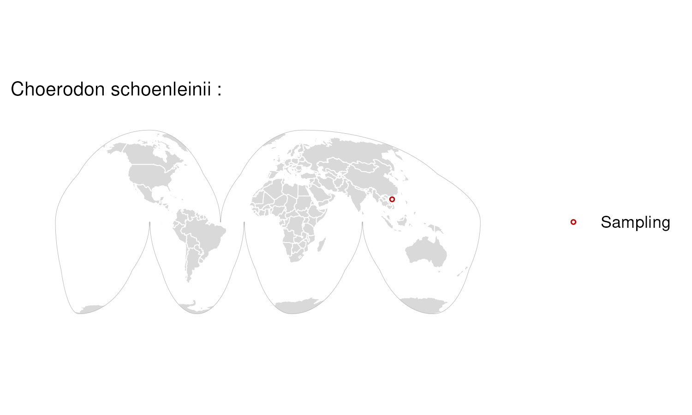

Species: Choloepus didactylus; Taxon: Mammals; Flags: Outside Range;

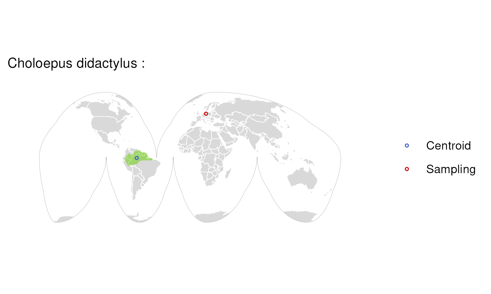

Species: Chroicocephalus ridibundus; Taxon: Birds; Flags: Vague
Location;

Species: Cinclus cinclus; Taxon: Birds; Flags: Vague Location;

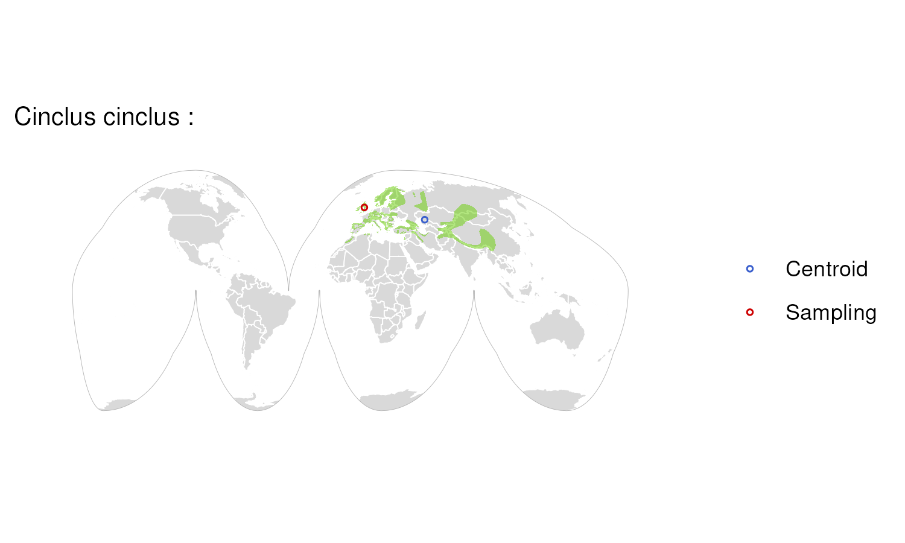

Species: Clangula hyemalis; Taxon: Birds; Flags: Vague Location;

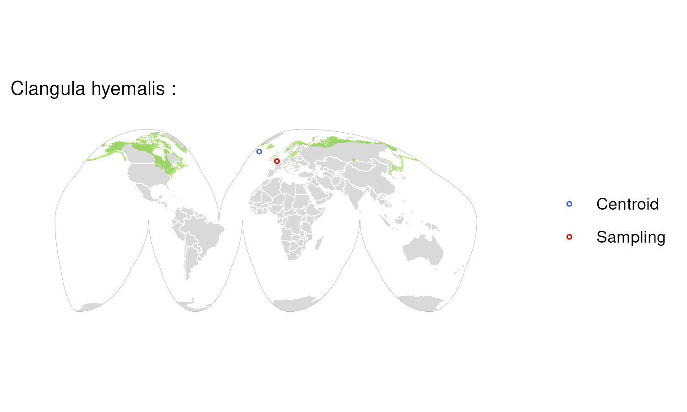

Species: Clarias gariepinus; Taxon: Fishes; Flags: Outside Range;

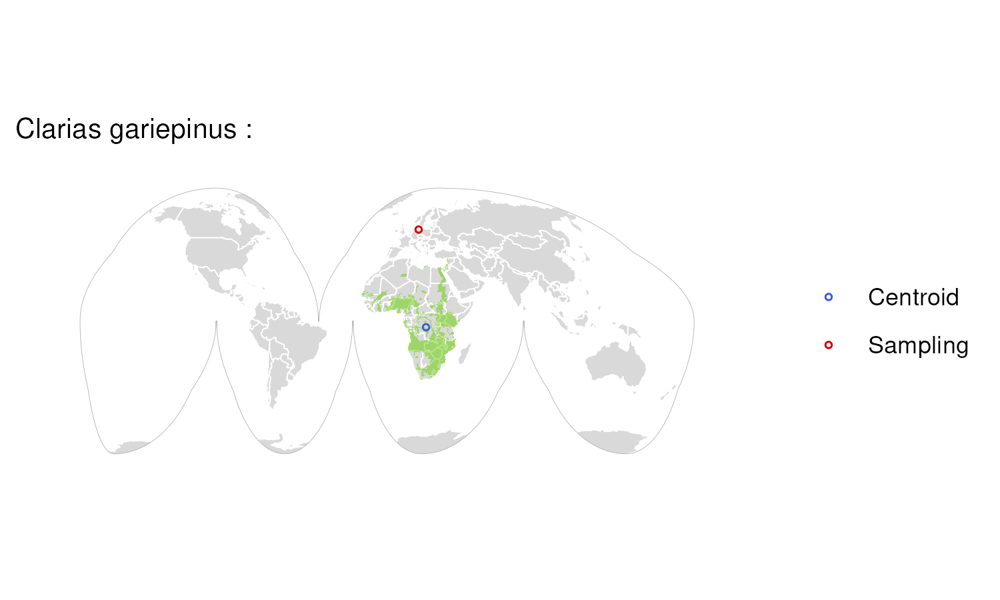

Species: Colius striatus; Taxon: Birds; Flags: Zoo Sample;

Species: Coloeus monedula; Taxon: Birds; Flags: Vague Location;

Species: Columba livia; Taxon: Birds; Flags: Outside Range;

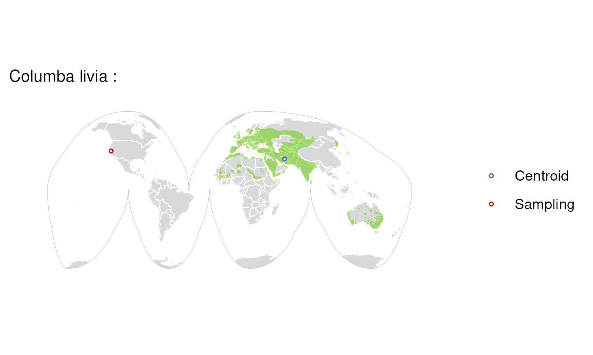

Species: Conger conger; Taxon: Fishes; Flags: Vague Location;

Species: Coregonus lavaretus; Taxon: Fishes; Flags: Vague Location;

Species: Corvus hawaiiensis; Taxon: Birds; Flags: Outside Range;

Species: Cristiceps australis; Taxon: Fishes; Flags: Outside Range;

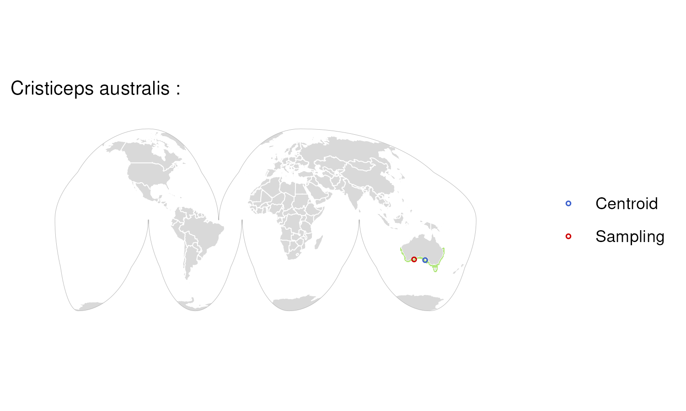

Species: Cyclopterus lumpus; Taxon: Fishes; Flags: Missing Range;

Species: Cyclura pinguis; Taxon: Reptiles; Flags: Zoo Sample;

Species: Cygnus columbianus; Taxon: Birds; Flags: Vague Location;

Species: Dama dama; Taxon: Mammals; Flags: Vague Location;

Species: Dasyurus maculatus; Taxon: Mammals; Flags: Outside Range;

Species: Delphinus delphis; Taxon: Mammals; Flags: Vague Location;

Species: Dendropsophus ebraccatus; Taxon: Amphibians; Flags: Outside
Range;

Species: Dibamus smithi; Taxon: Reptiles; Flags: Outside Range;

Species: Dromaius novaehollandiae; Taxon: Birds; Flags: Zoo Sample;

Species: Electrona antarctica; Taxon: Fishes; Flags: Vague Location;

Species: Elephas maximus indicus; Taxon: Mammals; Flags: Zoo Sample;

Species: Emys orbicularis; Taxon: Reptiles; Flags: Missing Range;

Species: Engystomops pustulosus; Taxon: Amphibians; Flags: Outside
Range;

Species: Enoplosus armatus; Taxon: Fishes; Flags: Outside Range;

Species: Epinephelus rankini; Taxon: Fishes; Flags: Outside Range;

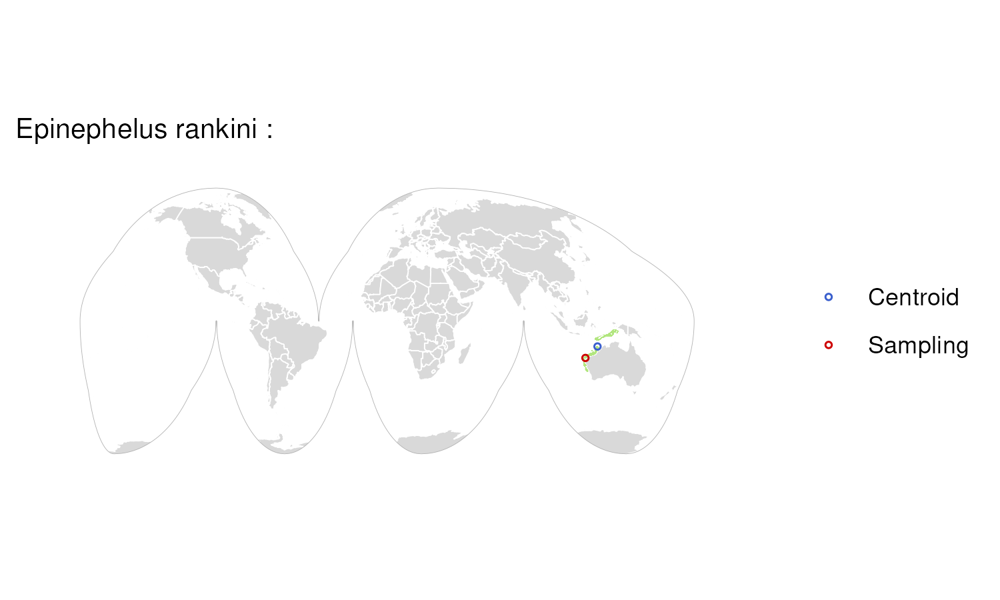

Species: Eptesicus nilssonii; Taxon: Mammals; Flags: Vague Location;

Species: Erinaceus europaeus; Taxon: Mammals; Flags: Vague Location;

Species: Eudromia elegans; Taxon: Birds; Flags: Zoo Sample;

Species: Falco biarmicus; Taxon: Birds; Flags: Outside Range;

Species: Falco punctatus; Taxon: Birds; Flags: Vague Location;

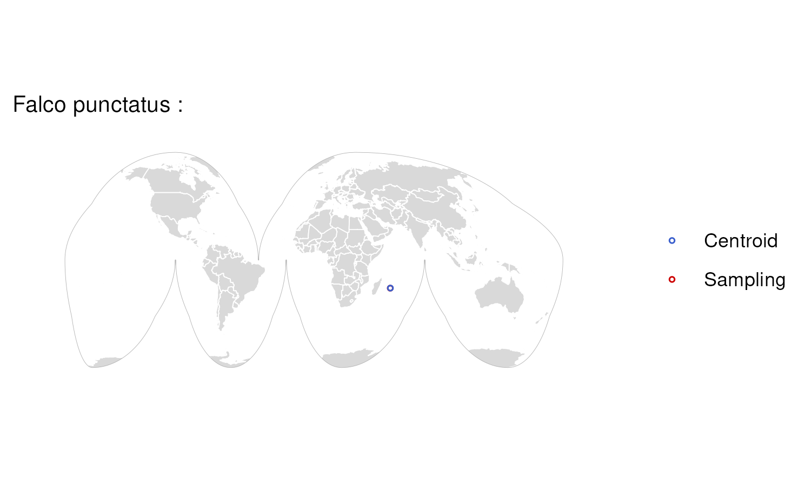

Species: Falco rusticolus; Taxon: Birds; Flags: Outside Range;

Species: Fringilla coelebs; Taxon: Birds; Flags: Vague Location;

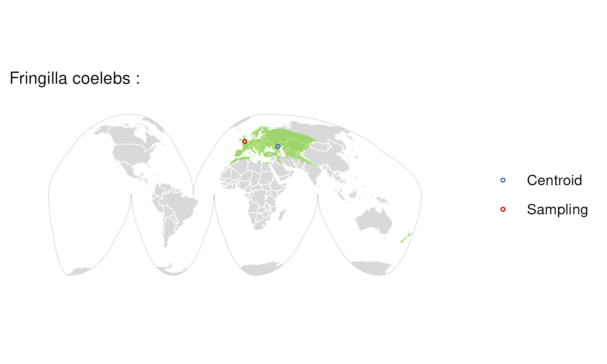

Species: Fundulus diaphanus; Taxon: Fishes; Flags: Missing Range;

Species: Furcifer pardalis; Taxon: Reptiles; Flags: Outside Range;

Species: Gadus morhua; Taxon: Fishes; Flags: Missing Range;

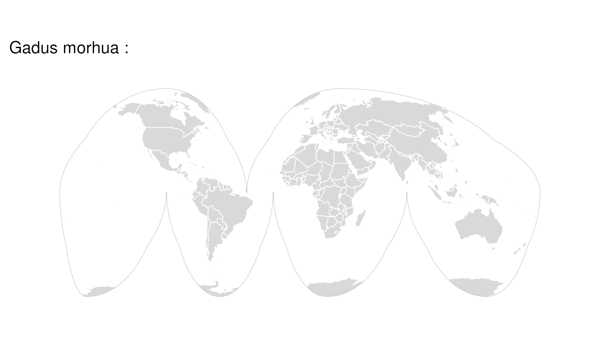

Species: Gallinula chloropus; Taxon: Birds; Flags: Vague Location;

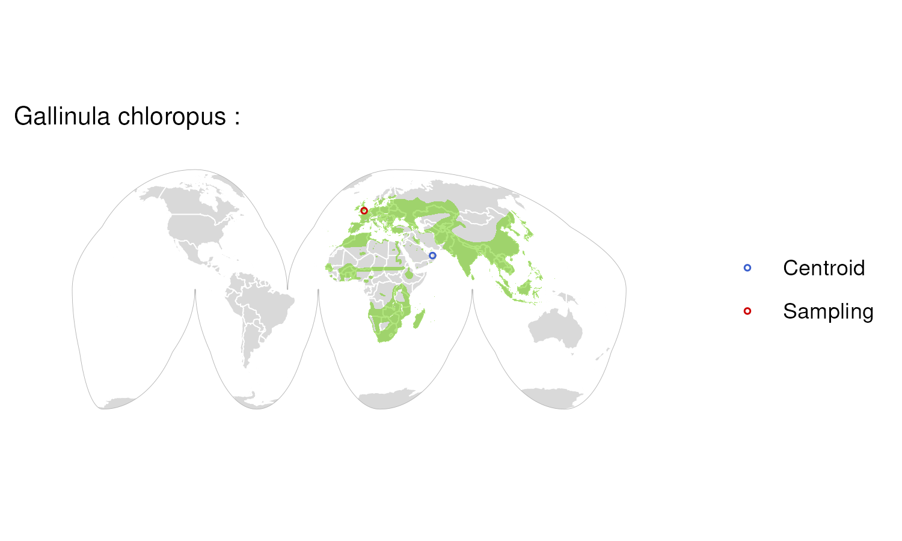

Species: Gasterosteus aculeatus; Taxon: Fishes; Flags: Vague Location;

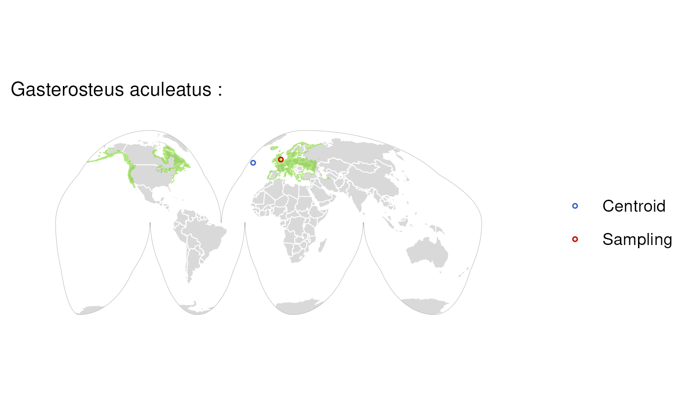

Species: Gavia stellata; Taxon: Birds; Flags: Outside Range;

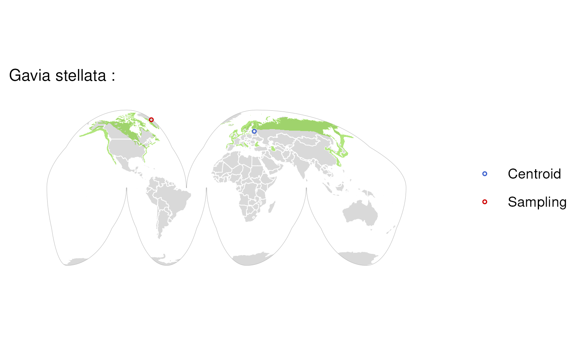

Species: Gavialis gangeticus; Taxon: Reptiles; Flags: Zoo Sample;

Species: Globicephala melas; Taxon: Mammals; Flags: Vague Location;

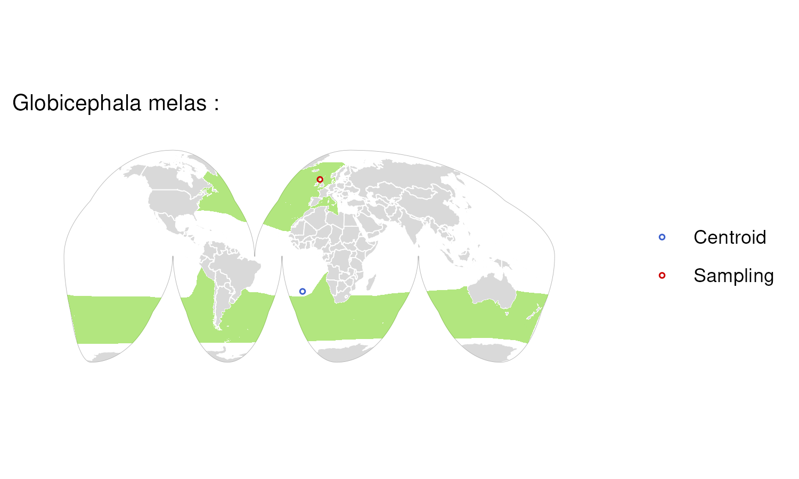

Species: Gobio gobio; Taxon: Fishes; Flags: Vague Location;

Species: Gobius niger; Taxon: Fishes; Flags: Vague Location;

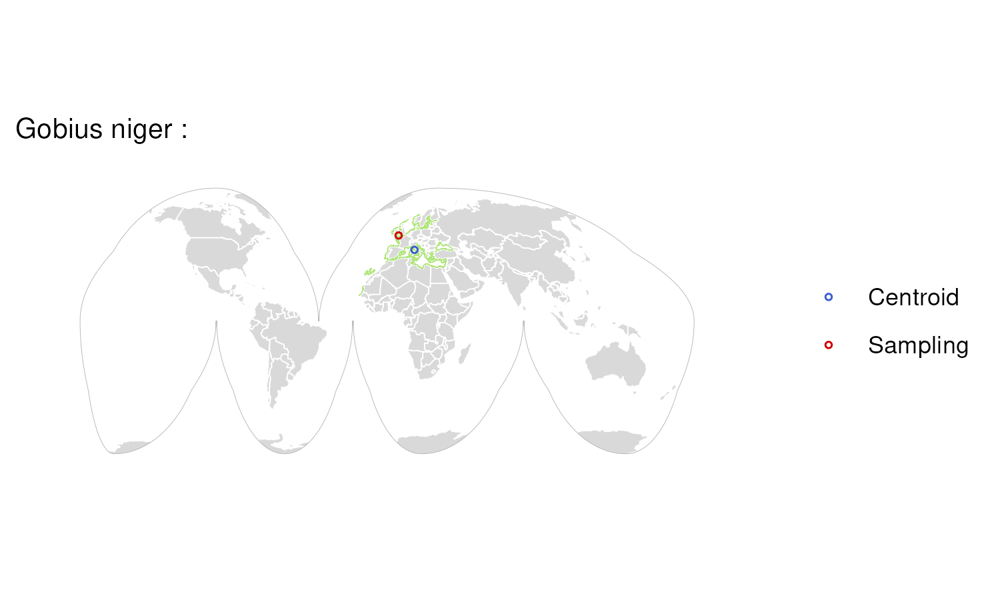

Species: Gopherus evgoodei; Taxon: Reptiles; Flags: Outside Range;

Species: Gopherus flavomarginatus; Taxon: Reptiles; Flags: Outside
Range;

Species: Grampus griseus; Taxon: Mammals; Flags: Vague Location;

Species: Gulosus aristotelis; Taxon: Birds; Flags: Vague Location;

Species: Gymnoscopelus braueri; Taxon: Fishes; Flags: Vague Location;

Species: Halichoerus grypus; Taxon: Mammals; Flags: Vague Location;

Species: Hemiscyllium ocellatum; Taxon: Fishes; Flags: Outside Range;

Species: Heptranchias perlo; Taxon: Fishes; Flags: Outside Range;

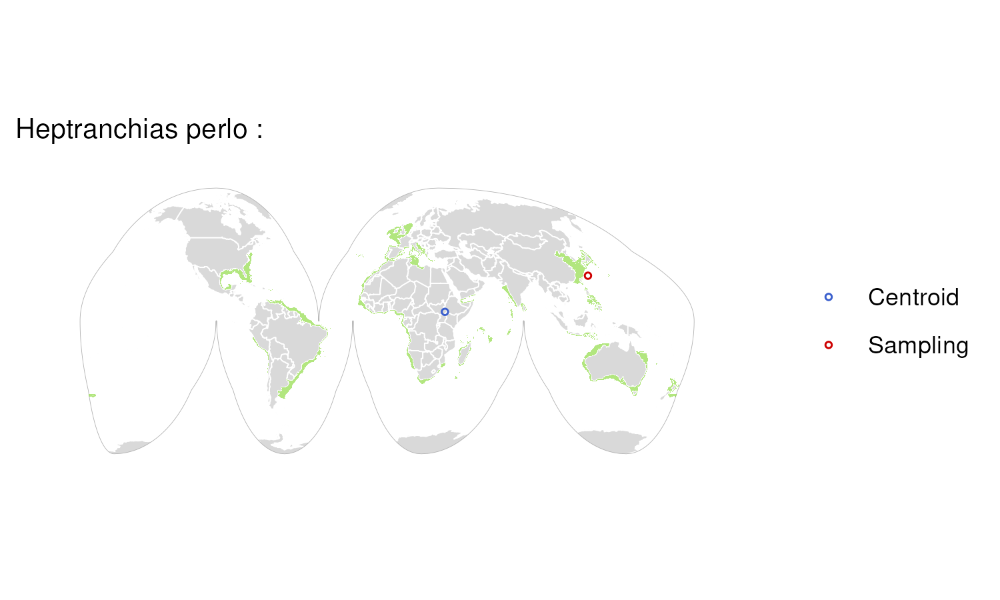

Species: Heterohyrax brucei; Taxon: Mammals; Flags: Zoo Sample;

Species: Hippopotamus amphibius; Taxon: Mammals; Flags: Zoo Sample;

Species: Hirundo rustica; Taxon: Birds; Flags: Vague Location;

Species: Homo sapiens; Taxon: Mammals; Flags: Missing Range;

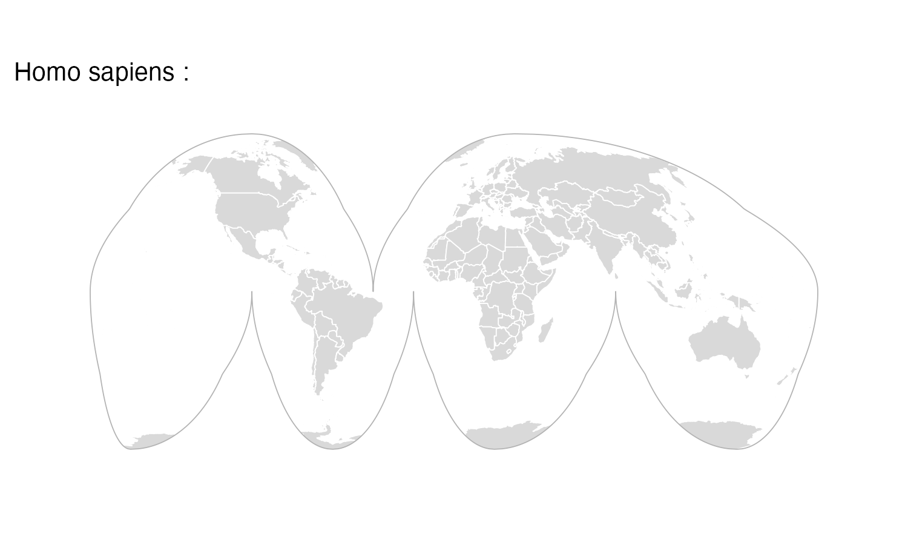

Species: Hyperolius riggenbachi; Taxon: Amphibians; Flags: Outside
Range;

Species: Jaculus jaculus; Taxon: Mammals; Flags: Outside Range;

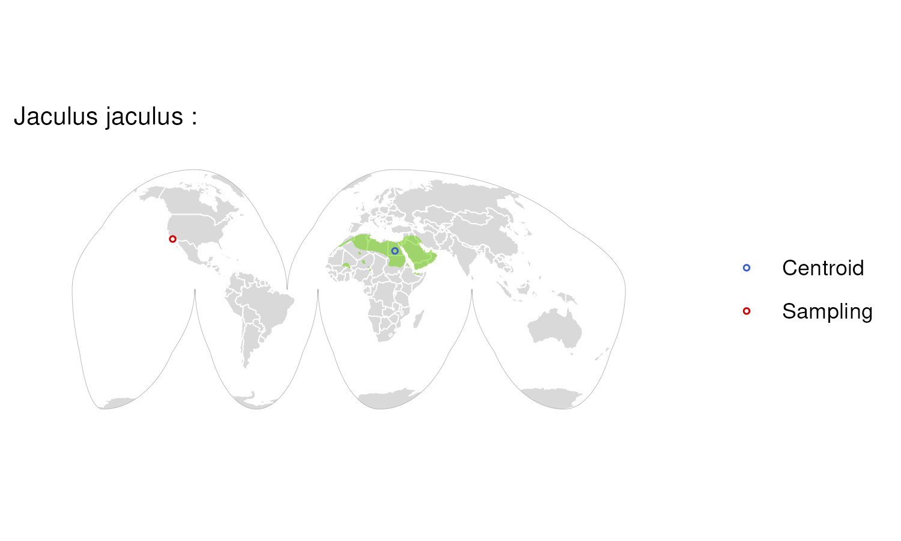

Species: Labrus bergylta; Taxon: Fishes; Flags: Vague Location;

Species: Labrus mixtus; Taxon: Fishes; Flags: Vague Location;

Species: Lagenorhynchus acutus; Taxon: Mammals; Flags: Vague Location;

Species: Lagenorhynchus albirostris; Taxon: Mammals; Flags: Vague
Location;

Species: Lampetra fluviatilis; Taxon: Fishes; Flags: Vague Location;

Species: Lampris incognitus; Taxon: Fishes; Flags: Missing Range;

Species: Larus argentatus; Taxon: Birds; Flags: Vague Location;

Species: Larus fuscus; Taxon: Birds; Flags: Vague Location;

Species: Larus michahellis; Taxon: Birds; Flags: Vague Location;

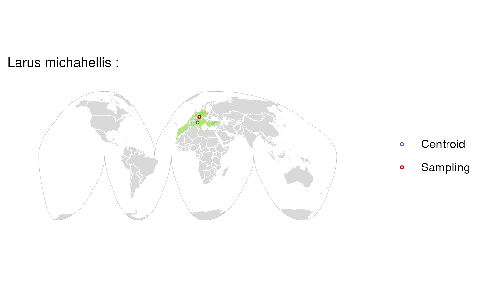

Species: Lateolabrax maculatus; Taxon: Fishes; Flags: Vague Location;

Species: Lathamus discolor; Taxon: Birds; Flags: Outside Range;

Species: Latimeria chalumnae; Taxon: Fishes; Flags: Missing Range;

Species: Lemur catta; Taxon: Mammals; Flags: Zoo Sample;

Species: Lepidogalaxias salamandroides; Taxon: Fishes; Flags: Outside
Range;

Species: Leptosomus discolor; Taxon: Birds; Flags: Outside Range;

Species: Lethrinus nebulosus; Taxon: Fishes; Flags: Outside Range;

Species: Leuciscus leuciscus; Taxon: Fishes; Flags: Vague Location;

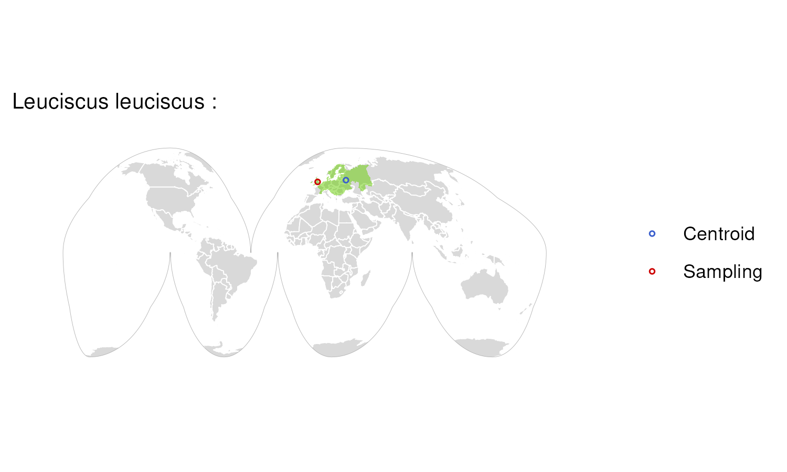

Species: Liasis olivaceus; Taxon: Reptiles; Flags: Zoo Sample;

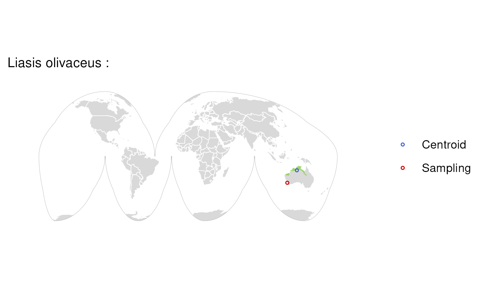

Species: Limanda limanda; Taxon: Fishes; Flags: Vague Location;

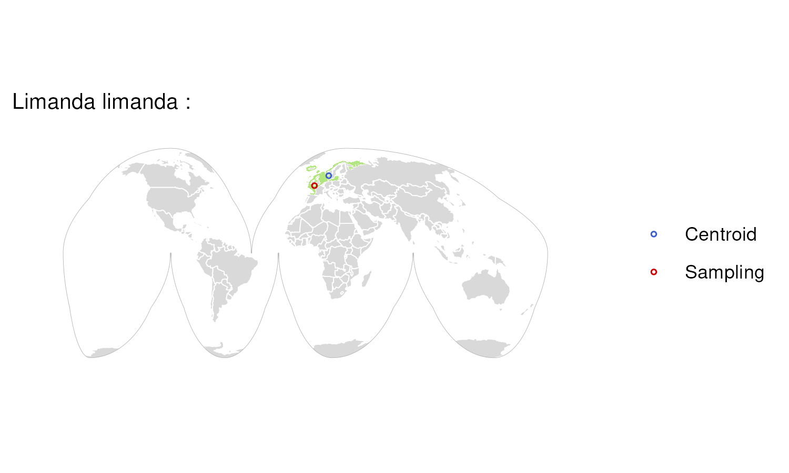

Species: Lipophrys pholis; Taxon: Fishes; Flags: Vague Location;

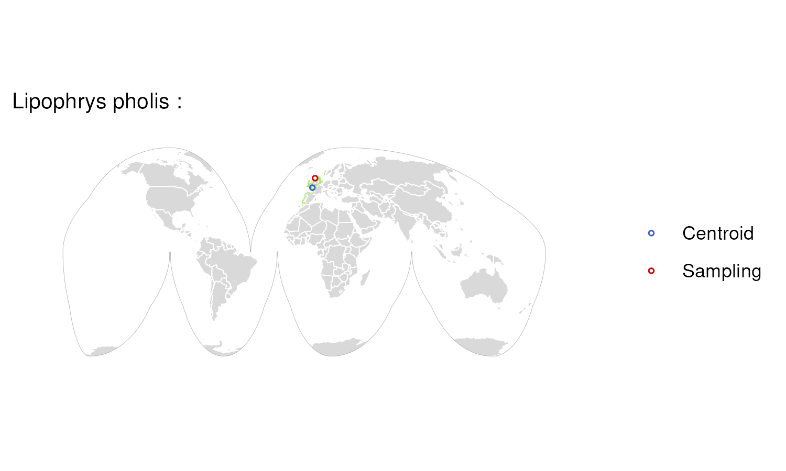

Species: Lissotriton helveticus; Taxon: Amphibians; Flags: Vague
Location;

Species: Lissotriton vulgaris; Taxon: Amphibians; Flags: Vague Location;

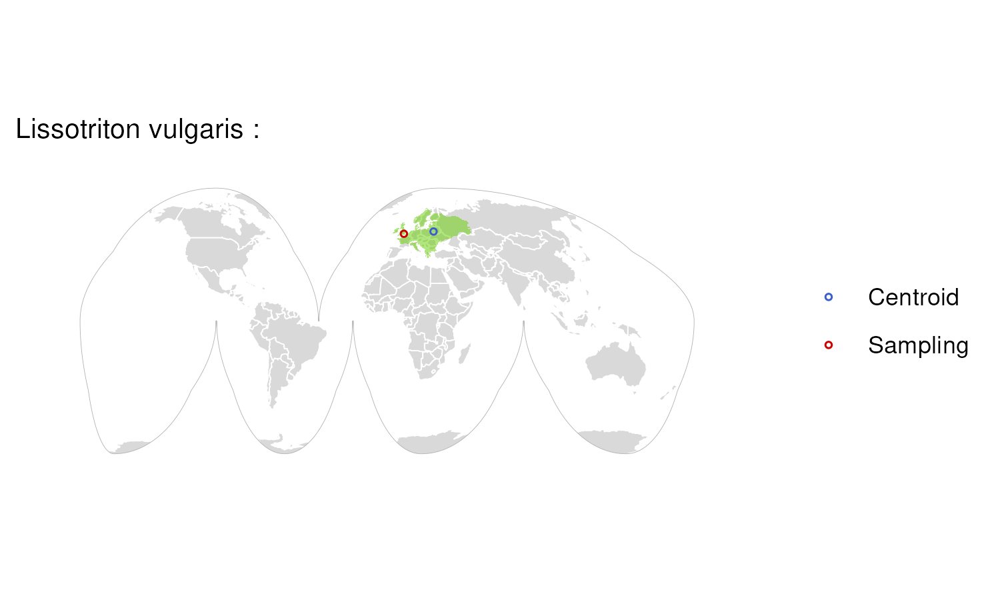

Species: Loxodonta africana; Taxon: Mammals; Flags: Zoo Sample;

Species: Lycaon pictus; Taxon: Mammals; Flags: Outside Range;

Species: Lycodopsis pacificus; Taxon: Fishes; Flags: Missing Range;

Species: Lynx canadensis; Taxon: Mammals; Flags: Outside Range;

Species: Macaca nemestrina; Taxon: Mammals; Flags: Outside Range;

Species: Macrotis lagotis; Taxon: Mammals; Flags: Zoo Sample;

Species: Manis pentadactyla; Taxon: Mammals; Flags: Zoo Sample;

Species: Martes martes; Taxon: Mammals; Flags: Vague Location;

Species: Megaderma spasma; Taxon: Mammals; Flags: Outside Range;

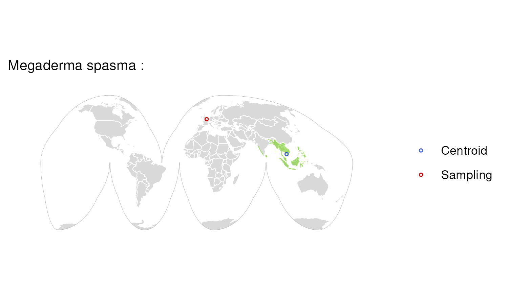

Species: Meles meles; Taxon: Mammals; Flags: Vague Location;

Species: Melopsittacus undulatus; Taxon: Birds; Flags: Outside Range;

Species: Merops nubicus; Taxon: Birds; Flags: Zoo Sample;

Species: Microchirus variegatus; Taxon: Fishes; Flags: Vague Location;

Species: Micromys minutus; Taxon: Mammals; Flags: Vague Location;

Species: Microstomus kitt; Taxon: Fishes; Flags: Vague Location;

Species: Miniopterus schreibersii; Taxon: Mammals; Flags: Vague
Location;

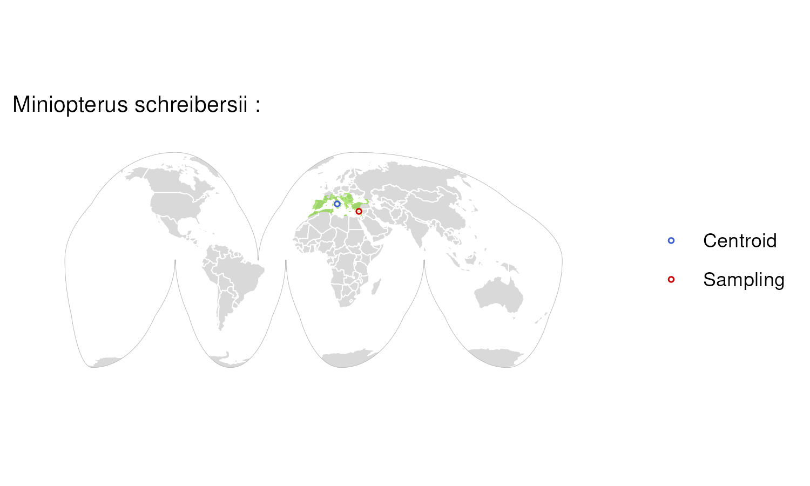

Species: Mixophyes fleayi; Taxon: Amphibians; Flags: Outside Range;

Species: Molossus alvarezi; Taxon: Mammals; Flags: Outside Range;

Species: Monodelphis domestica; Taxon: Mammals; Flags: Outside Range;

Species: Mops condylurus; Taxon: Mammals; Flags: Outside Range;

Species: Morus bassanus; Taxon: Birds; Flags: Zoo Sample;

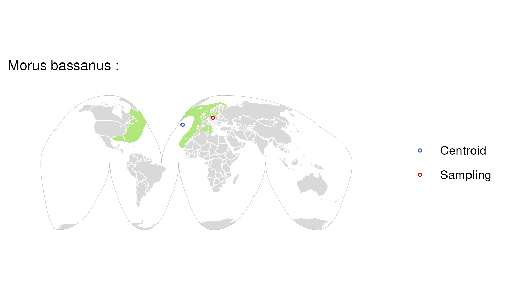

Species: Muntiacus reevesi; Taxon: Mammals; Flags: Vague Location;

Species: Mus musculus; Taxon: Mammals; Flags: Vague Location;

Species: Muscardinus avellanarius; Taxon: Mammals; Flags: Vague
Location;

Species: Mustela nivalis vulgaris; Taxon: Mammals; Flags: Vague
Location;

Species: Mustelus asterias; Taxon: Fishes; Flags: Vague Location;

Species: Myotis daubentonii; Taxon: Mammals; Flags: Vague Location;

Species: Myotis emarginatus; Taxon: Mammals; Flags: Vague Location;

Species: Myotis mystacinus; Taxon: Mammals; Flags: Vague Location;

Species: Myotis nattereri; Taxon: Mammals; Flags: Vague Location;

Species: Myuchelys georgesi; Taxon: Reptiles; Flags: Missing Range;

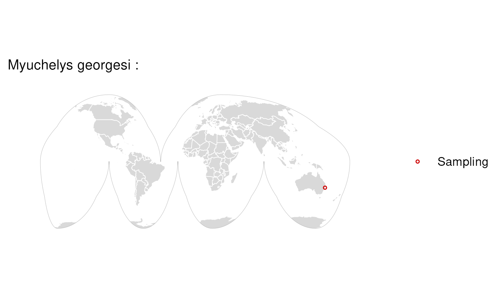

Species: Nannobrachium achirus; Taxon: Fishes; Flags: Vague Location;

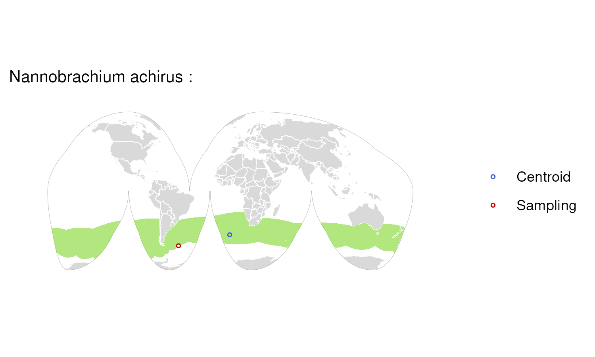

Species: Natator depressus; Taxon: Reptiles; Flags: Missing Range;

Species: Natrix helvetica; Taxon: Reptiles; Flags: Vague Location;

Species: Neofelis nebulosa; Taxon: Mammals; Flags: Zoo Sample;

Species: Neosynchiropus ocellatus; Taxon: Fishes; Flags: Zoo Sample;

Species: Nesoenas mayeri; Taxon: Birds; Flags: Vague Location;

Species: Notoryctes typhlops; Taxon: Mammals; Flags: Vague Location;

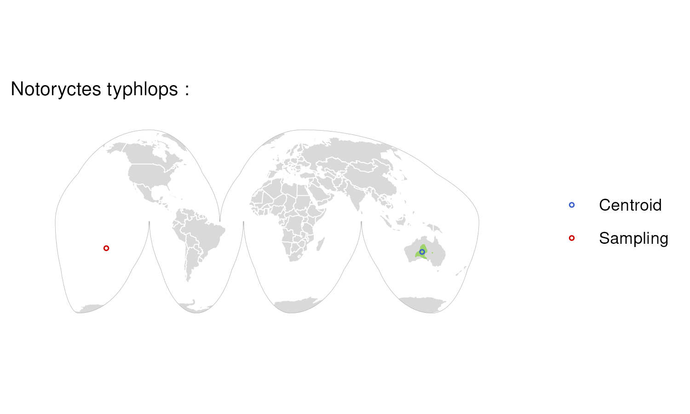

Species: Numenius arquata; Taxon: Birds; Flags: Vague Location;

Species: Nyctalus leisleri; Taxon: Mammals; Flags: Vague Location;

Species: Nycticebus coucang; Taxon: Mammals; Flags: Zoo Sample;

Species: Orcinus orca; Taxon: Mammals; Flags: Vague Location;

Species: Osmerus eperlanus; Taxon: Fishes; Flags: Vague Location;

Species: Pangasianodon hypophthalmus; Taxon: Fishes; Flags: Outside
Range;

Species: Pangshura tecta; Taxon: Reptiles; Flags: Outside Range;

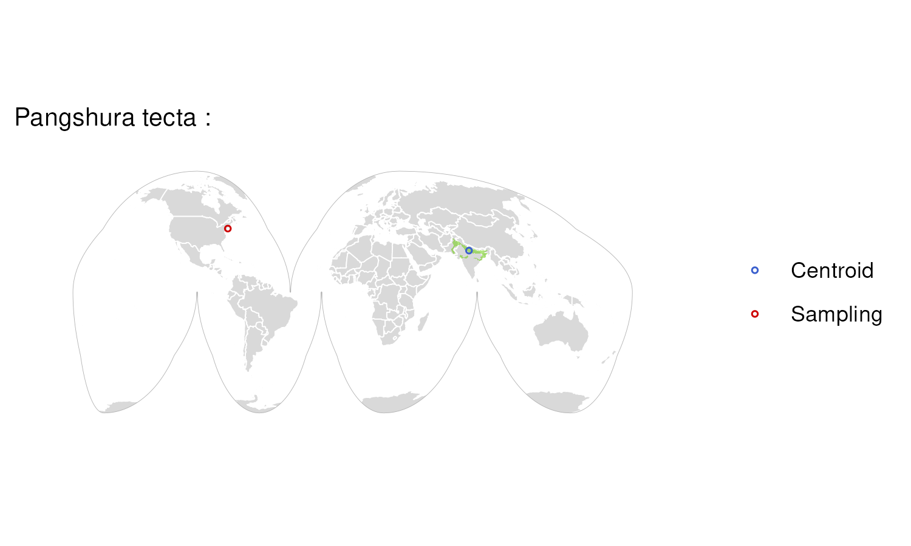

Species: Patagioenas fasciata; Taxon: Birds; Flags: Outside Range;

Species: Pelecanus crispus; Taxon: Birds; Flags: Zoo Sample;

Species: Pempheris klunzingeri; Taxon: Fishes; Flags: Missing Range;

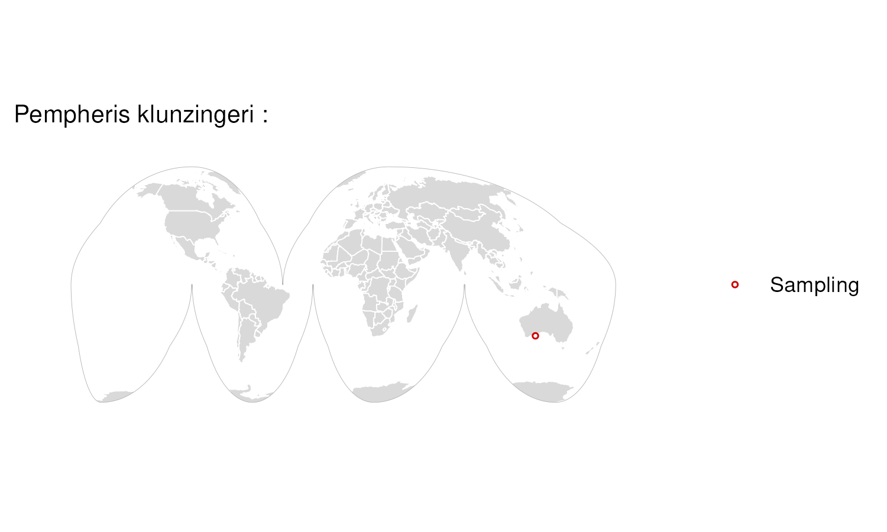

Species: Periophthalmus magnuspinnatus; Taxon: Fishes; Flags: Outside
Range;

Species: Phocoena phocoena; Taxon: Mammals; Flags: Vague Location;

Species: Phocoena sinus; Taxon: Mammals; Flags: Outside Range;

Species: Phoenicopterus ruber; Taxon: Birds; Flags: Zoo Sample;

Species: Pholidichthys leucotaenia; Taxon: Fishes; Flags: Outside Range;

Species: Phoxinus phoxinus; Taxon: Fishes; Flags: Vague Location;

Species: Phyllostomus discolor; Taxon: Mammals; Flags: Outside Range;

Species: Pipistrellus nathusii; Taxon: Mammals; Flags: Vague Location;

Species: Pipistrellus pygmaeus; Taxon: Mammals; Flags: Vague Location;

Species: Platichthys flesus; Taxon: Fishes; Flags: Vague Location;

Species: Plecotus auritus; Taxon: Mammals; Flags: Vague Location;

Species: Pleuronectes platessa; Taxon: Fishes; Flags: Vague Location;

Species: Podarcis erhardii; Taxon: Reptiles; Flags: Vague Location;

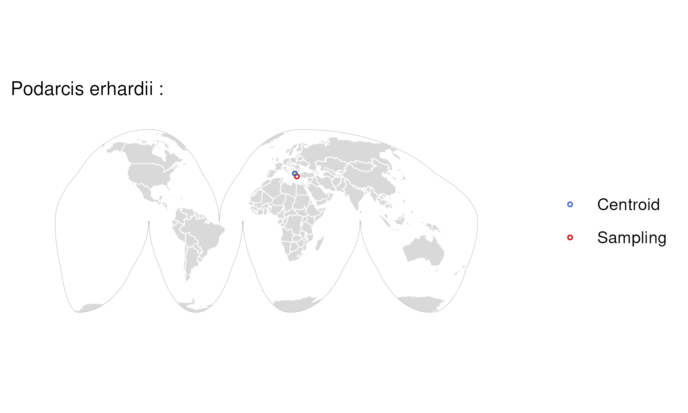

Species: Podarcis gaigeae; Taxon: Reptiles; Flags: Vague Location;

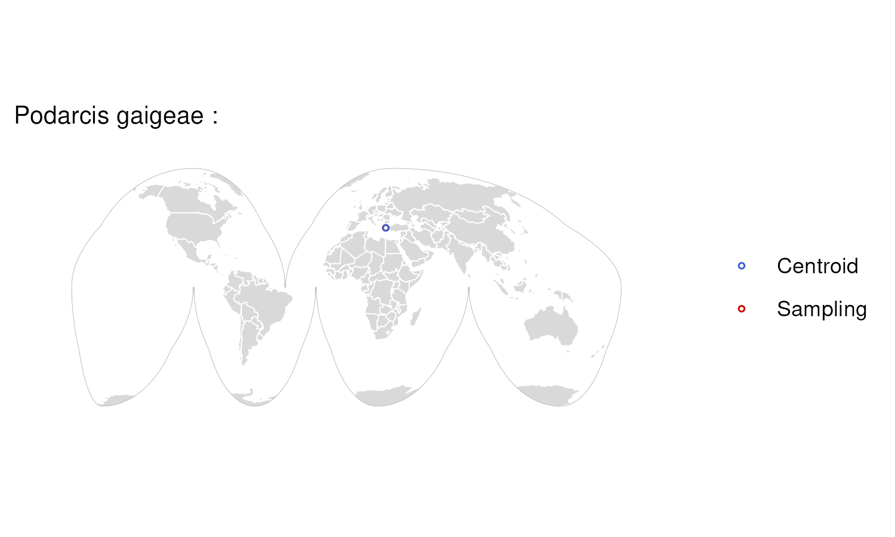

Species: Podarcis melisellensis; Taxon: Reptiles; Flags: Vague Location;

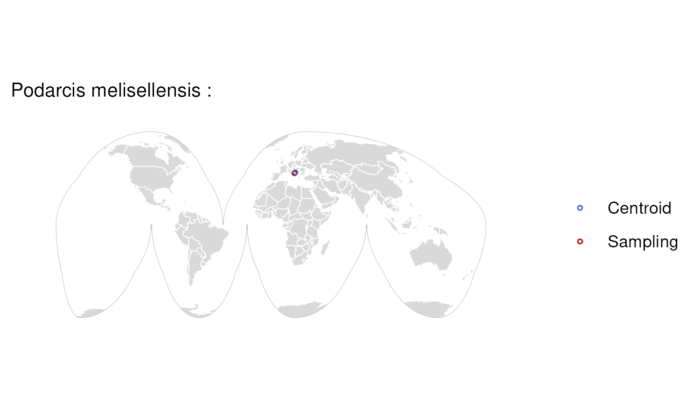

Species: Podarcis muralis; Taxon: Reptiles; Flags: Vague Location;

Species: Podarcis siculus; Taxon: Reptiles; Flags: Vague Location;

Species: Podocnemis expansa; Taxon: Reptiles; Flags: Missing Range;

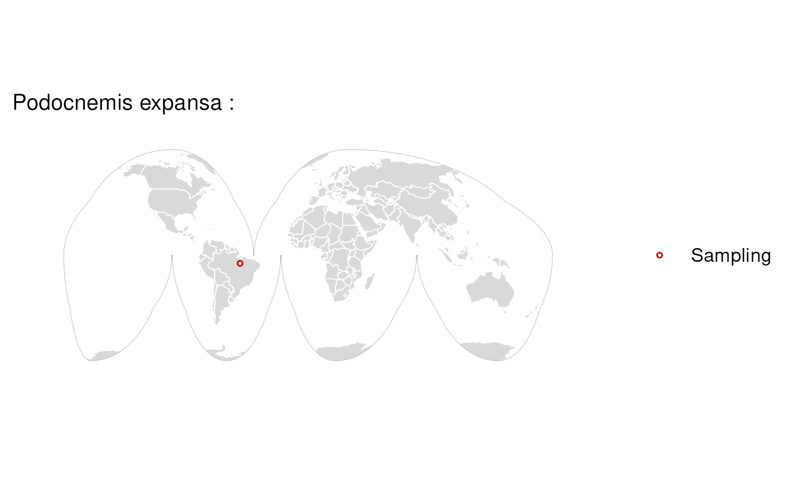

Species: Pollachius pollachius; Taxon: Fishes; Flags: Vague Location;

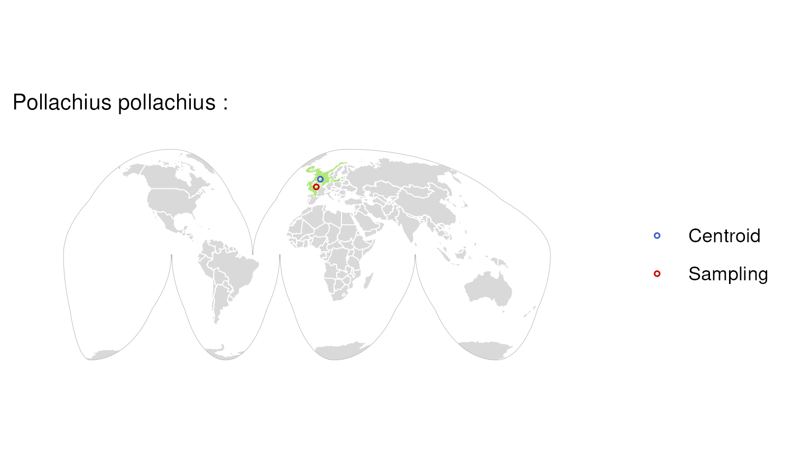

Species: Polymixia lowei; Taxon: Fishes; Flags: Outside Range;

Species: Pristipomoides typus; Taxon: Fishes; Flags: Outside Range;

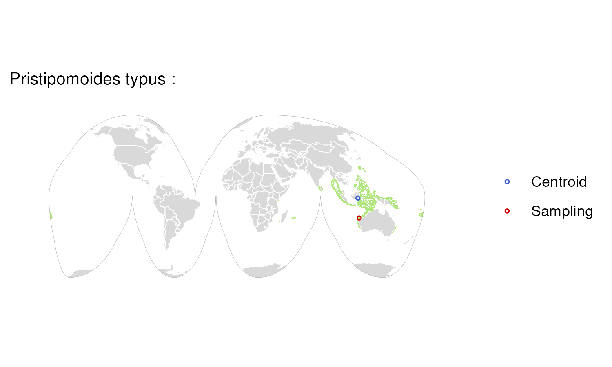

Species: Protomyctophum bolini; Taxon: Fishes; Flags: Vague Location;

Species: Psittacula echo; Taxon: Birds; Flags: Vague Location;

Species: Pungitius pungitius; Taxon: Fishes; Flags: Vague Location;

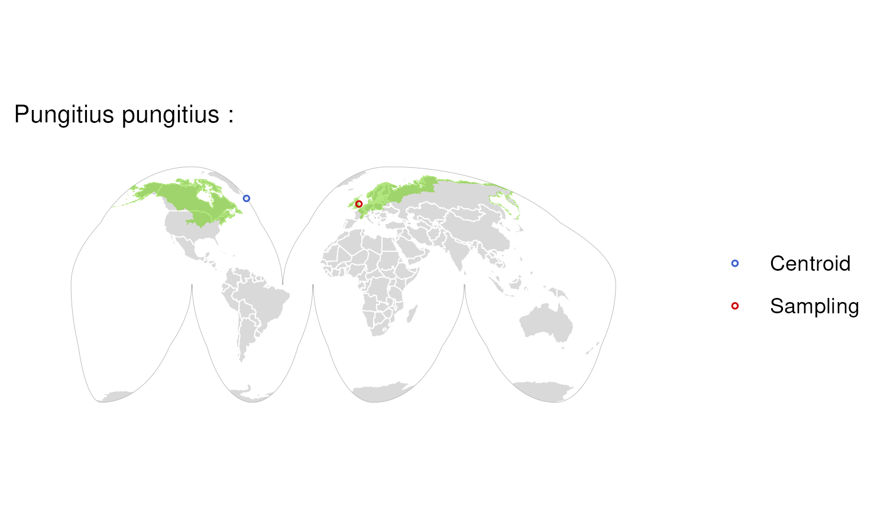

Species: Pygocentrus nattereri; Taxon: Fishes; Flags: Outside Range;

Species: Raja brachyura; Taxon: Fishes; Flags: Vague Location;

Species: Rana temporaria; Taxon: Amphibians; Flags: Vague Location;

Species: Ranitomeya imitator; Taxon: Amphibians; Flags: Outside Range;

Species: Rattus norvegicus; Taxon: Mammals; Flags: Outside Range;

Species: Rhea pennata; Taxon: Birds; Flags: Zoo Sample;

Species: Rhinogobio nasutus; Taxon: Fishes; Flags: Missing Range;

Species: Rhinolophus hipposideros; Taxon: Mammals; Flags: Vague
Location;

Species: Rhinolophus yonghoiseni; Taxon: Mammals; Flags: Missing Range;

Species: Rhinopoma microphyllum; Taxon: Mammals; Flags: Outside Range;

Species: Rhynchocyon petersi; Taxon: Mammals; Flags: Outside Range;

Species: Rhynochetos jubatus; Taxon: Birds; Flags: Zoo Sample;

Species: Rousettus aegyptiacus; Taxon: Mammals; Flags: Outside Range;

Species: Rutilus rutilus; Taxon: Fishes; Flags: Vague Location;

Species: Saimiri boliviensis; Taxon: Mammals; Flags: Outside Range;

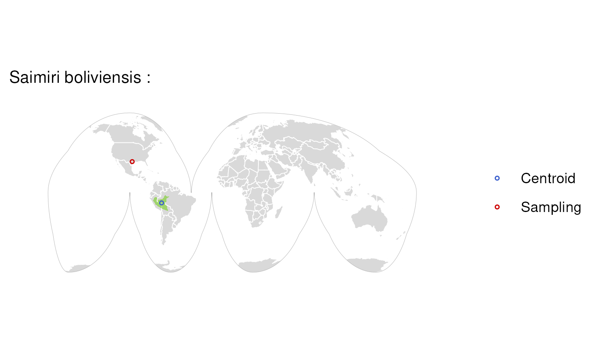

Species: Sarcophilus harrisii; Taxon: Mammals; Flags: Outside Range;

Species: Sardina pilchardus; Taxon: Fishes; Flags: Vague Location;

Species: Scardinius erythrophthalmus; Taxon: Fishes; Flags: Vague
Location;

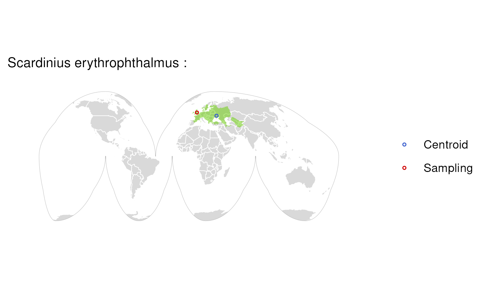

Species: Scomber scombrus; Taxon: Fishes; Flags: Vague Location;

Species: Scophthalmus maximus; Taxon: Fishes; Flags: Vague Location;

Species: Sebastes fasciatus; Taxon: Fishes; Flags: Missing Range;

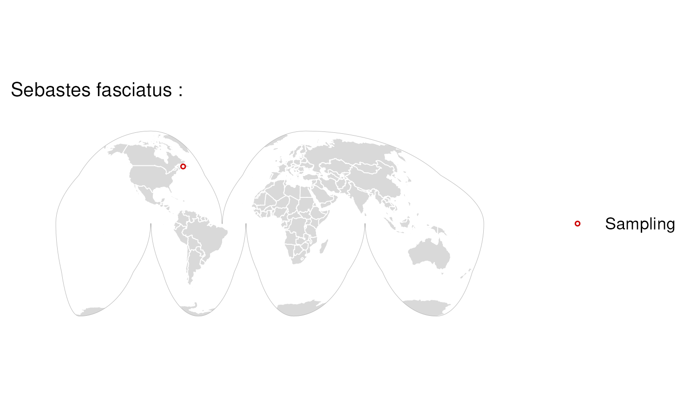

Species: Sebastes umbrosus; Taxon: Fishes; Flags: Missing Range;

Species: Silurus aristotelis; Taxon: Fishes; Flags: Vague Location;

Species: Spheniscus humboldti; Taxon: Birds; Flags: Outside Range;

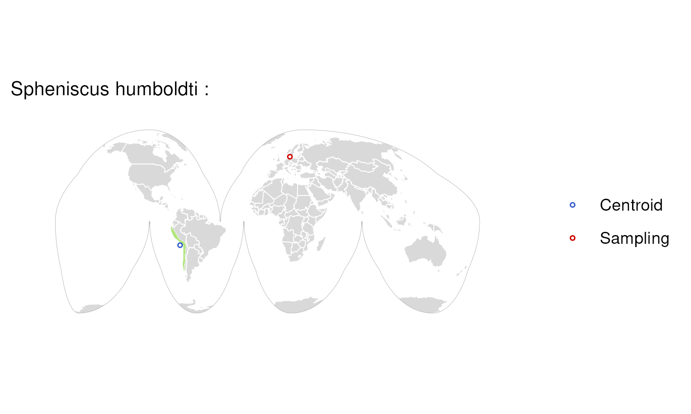

Species: Spinachia spinachia; Taxon: Fishes; Flags: Zoo Sample;

Species: Sprattus sprattus; Taxon: Fishes; Flags: Vague Location;

Species: Squalius cephalus; Taxon: Fishes; Flags: Vague Location;

Species: Streptopelia decaocto; Taxon: Birds; Flags: Vague Location;

Species: Strigops habroptilus; Taxon: Birds; Flags: Outside Range;

Species: Suncus etruscus; Taxon: Mammals; Flags: Outside Range;

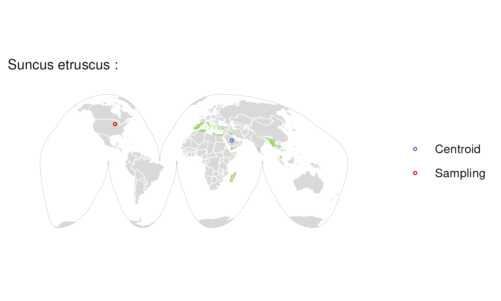

Species: Sus scrofa; Taxon: Mammals; Flags: Domesticated;

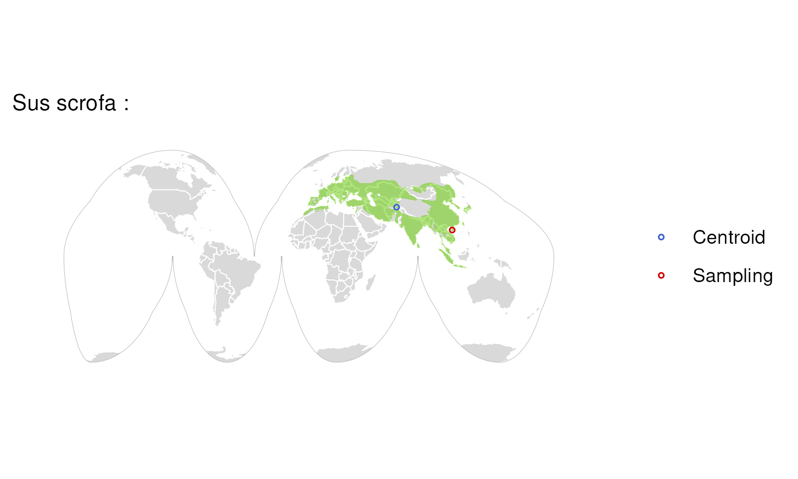

Species: Symphodus melops; Taxon: Fishes; Flags: Vague Location;

Species: Symphorus nematophorus; Taxon: Fishes; Flags: Outside Range;

Species: Synchiropus picturatus; Taxon: Fishes; Flags: Zoo Sample;

Species: Taeniopygia guttata; Taxon: Birds; Flags: Outside Range;

Species: Talpa europaea; Taxon: Mammals; Flags: Vague Location;

Species: Tapirus indicus; Taxon: Mammals; Flags: Zoo Sample;

Species: Tauraco erythrolophus; Taxon: Birds; Flags: Zoo Sample;

Species: Taurulus bubalis; Taxon: Fishes; Flags: Vague Location;

Species: Thamnophis elegans; Taxon: Reptiles; Flags: Outside Range;

Species: Toxotes jaculatrix; Taxon: Fishes; Flags: Outside Range;

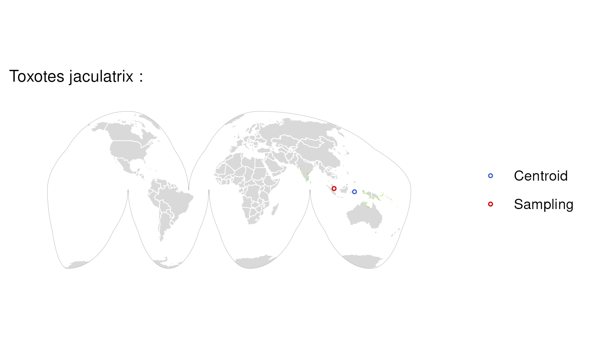

Species: Trachurus trachurus; Taxon: Fishes; Flags: Vague Location;

Species: Trichosurus vulpecula; Taxon: Mammals; Flags: Outside Range;

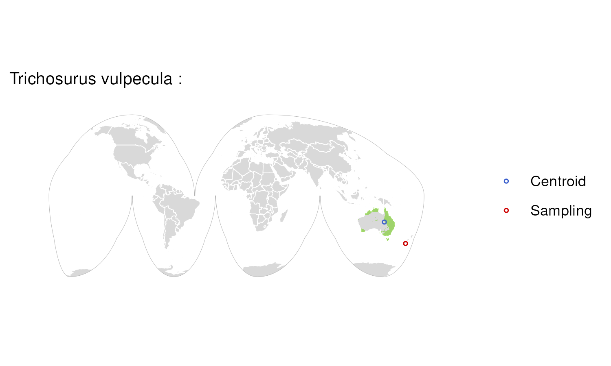

Species: Triturus cristatus; Taxon: Amphibians; Flags: Vague Location;

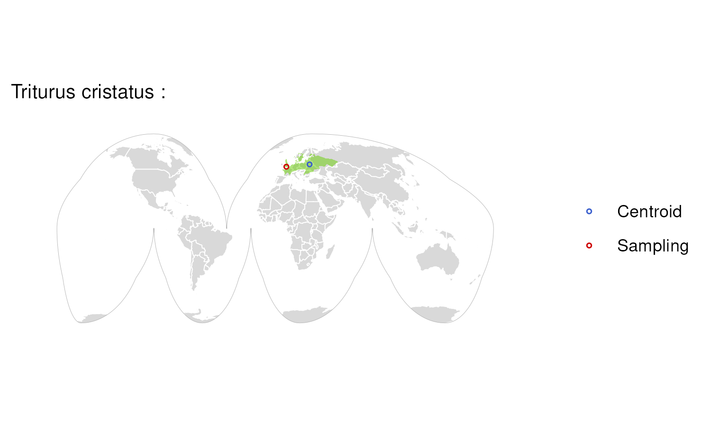

Species: Vanellus vanellus; Taxon: Birds; Flags: Vague Location;

Species: Vespertilio murinus; Taxon: Mammals; Flags: Vague Location;

Species: Vipera berus; Taxon: Reptiles; Flags: Vague Location;

Species: Vipera ursinii; Taxon: Reptiles; Flags: Vague Location;

Species: Vulpes vulpes; Taxon: Mammals; Flags: Vague Location;

Species: Xenentodon cancila; Taxon: Fishes; Flags: Outside Range;

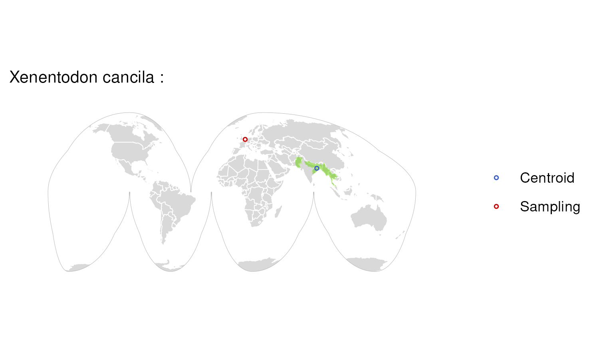

Species: Xenopus petersii; Taxon: Amphibians; Flags: Outside Range;

Species: Zeus faber; Taxon: Fishes; Flags: Vague Location;

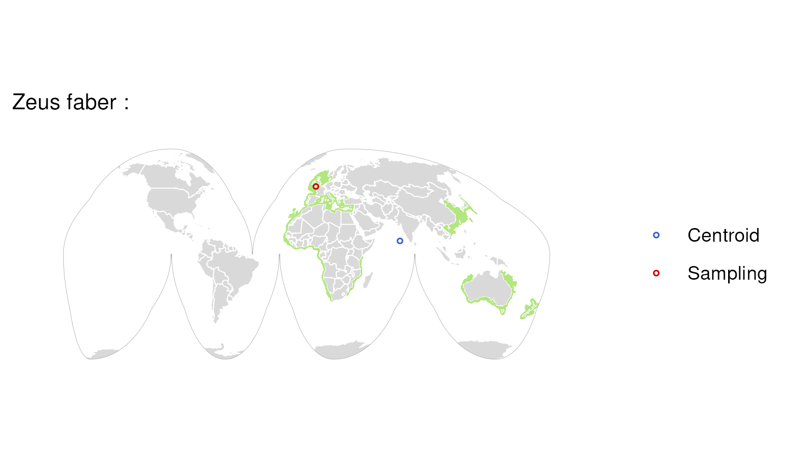

Species: Zootoca vivipara; Taxon: Reptiles; Flags: Vague Location;

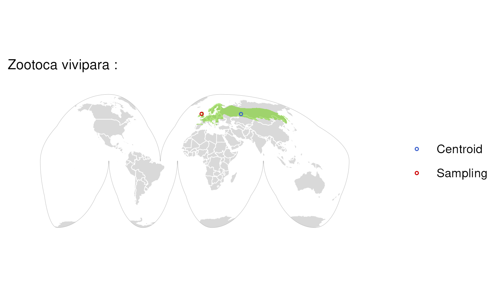

Species: Acanthisitta chloris; Taxon: Birds; Flags:

Species: Acanthopagrus latus; Taxon: Fishes; Flags:

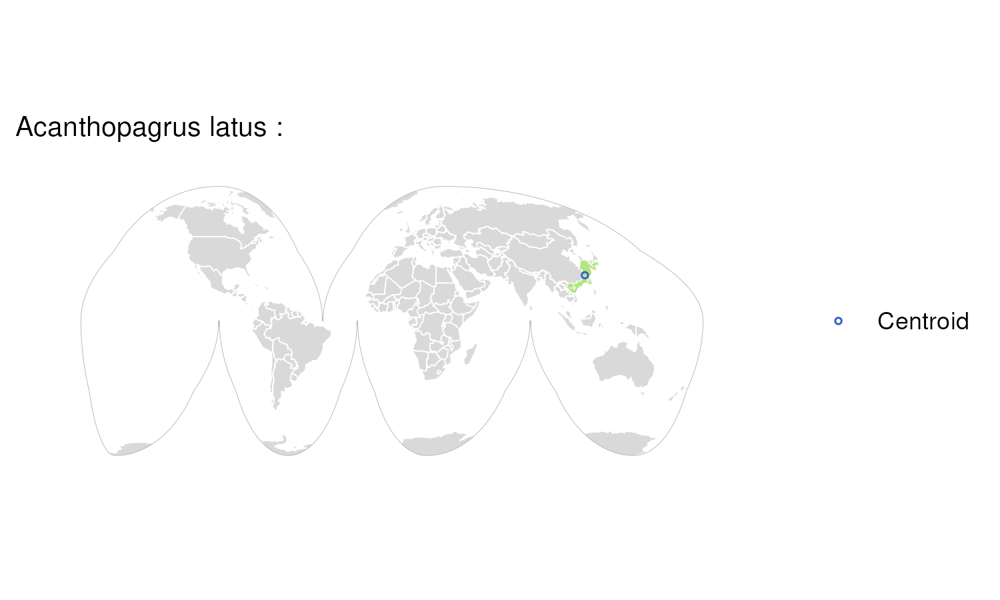

Species: Acanthopagrus schlegelii; Taxon: Fishes; Flags:

Species: Acipenser ruthenus; Taxon: Fishes; Flags:

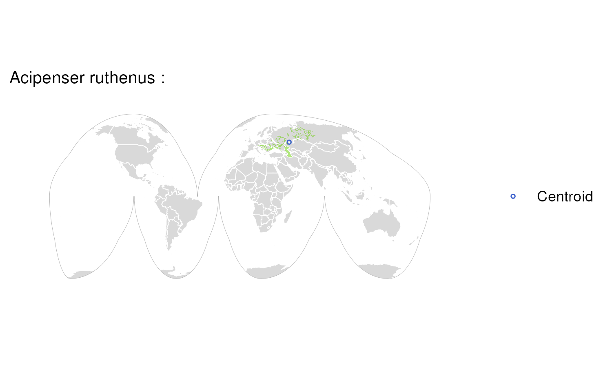

Species: Acomys russatus; Taxon: Mammals; Flags:

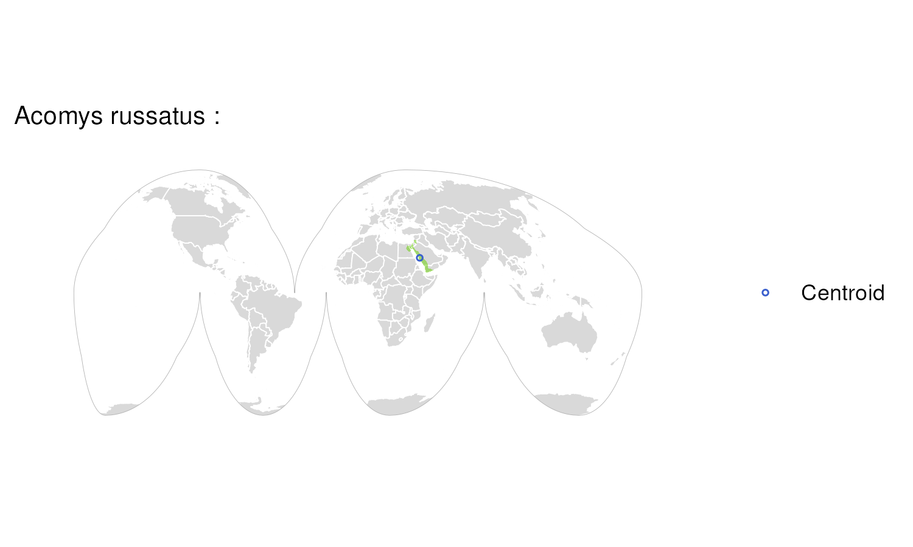

Species: Aegotheles albertisi; Taxon: Birds; Flags:

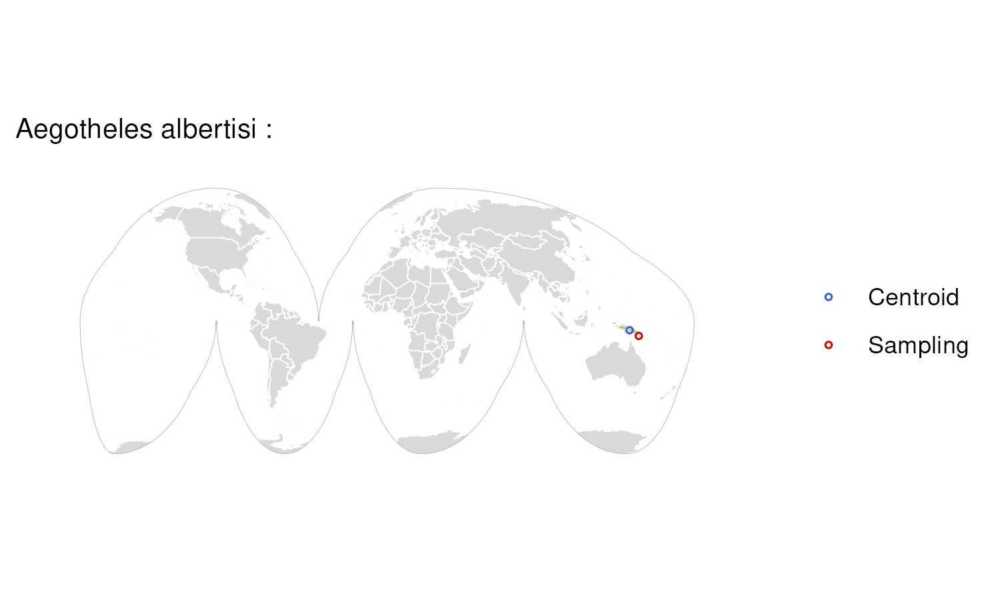

Species: Agelaius phoeniceus; Taxon: Birds; Flags:

Species: Alca Torda; Taxon: Birds; Flags:

Species: Alligator mississippiensis; Taxon: Reptiles; Flags:

Species: Alosa sapidissima; Taxon: Fishes; Flags:

Species: Amazona ochrocephala; Taxon: Birds; Flags:

Species: Amblyopsis spelaea; Taxon: Fishes; Flags:

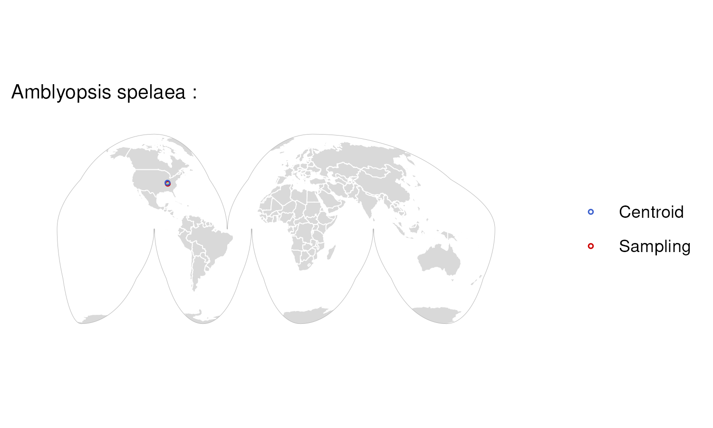

Species: Amblyraja radiata; Taxon: Fishes; Flags:

Species: Ambystoma mexicanum x Ambystoma tigrinum; Taxon: Amphibians;
Flags:

Species: Ammodramus caudacutus; Taxon: Birds; Flags:

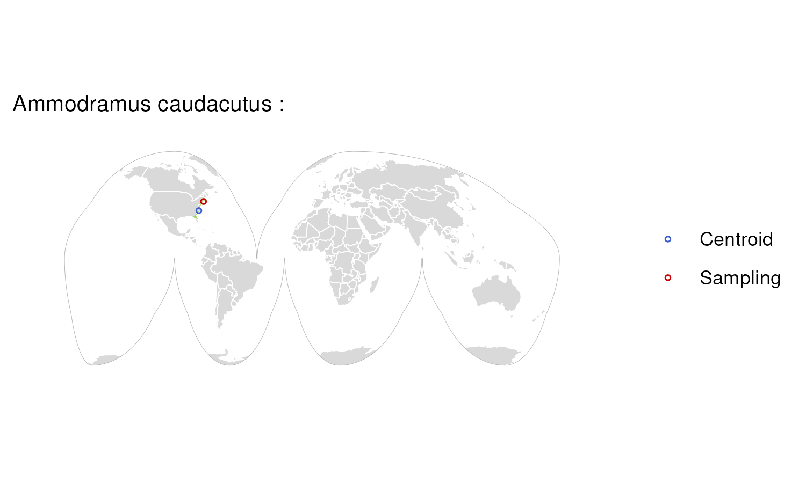

Species: Ammospiza maritima; Taxon: Birds; Flags:

Species: Ammospiza nelsoni; Taxon: Birds; Flags:

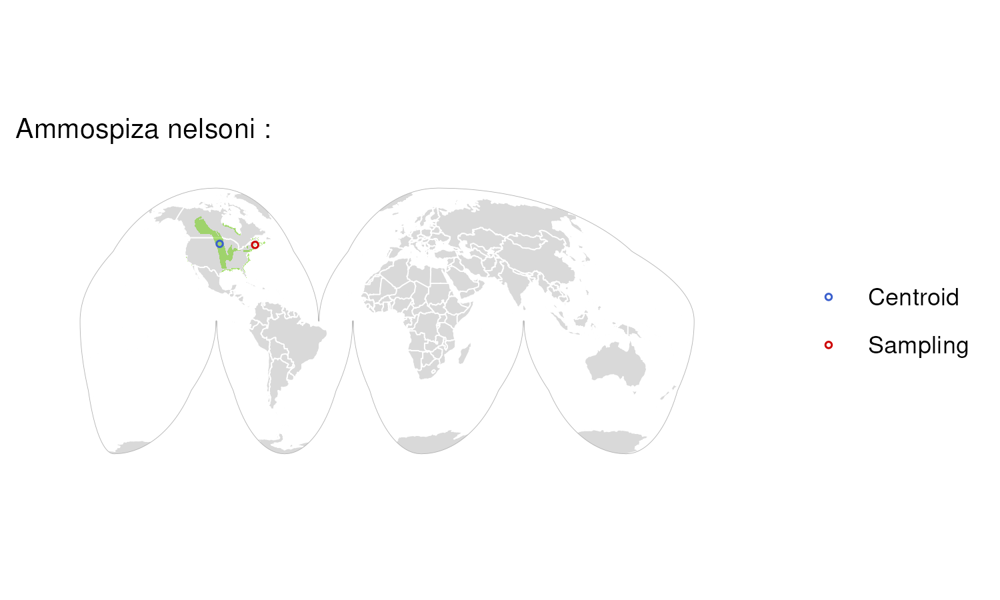

Species: Anabas testudineus; Taxon: Fishes; Flags:

Species: Anguilla anguilla; Taxon: Fishes; Flags:

Species: Anniella stebbinsi; Taxon: Reptiles; Flags:

Species: Anolis sagrei; Taxon: Reptiles; Flags:

Species: Anomaloglossus baeobatrachus; Taxon: Amphibians; Flags:

Species: Anser cygnoides; Taxon: Birds; Flags:

Species: Aplochiton taeniatus; Taxon: Fishes; Flags:

Species: Apus apus; Taxon: Birds; Flags:

Species: Aquila chrysaetos; Taxon: Birds; Flags:

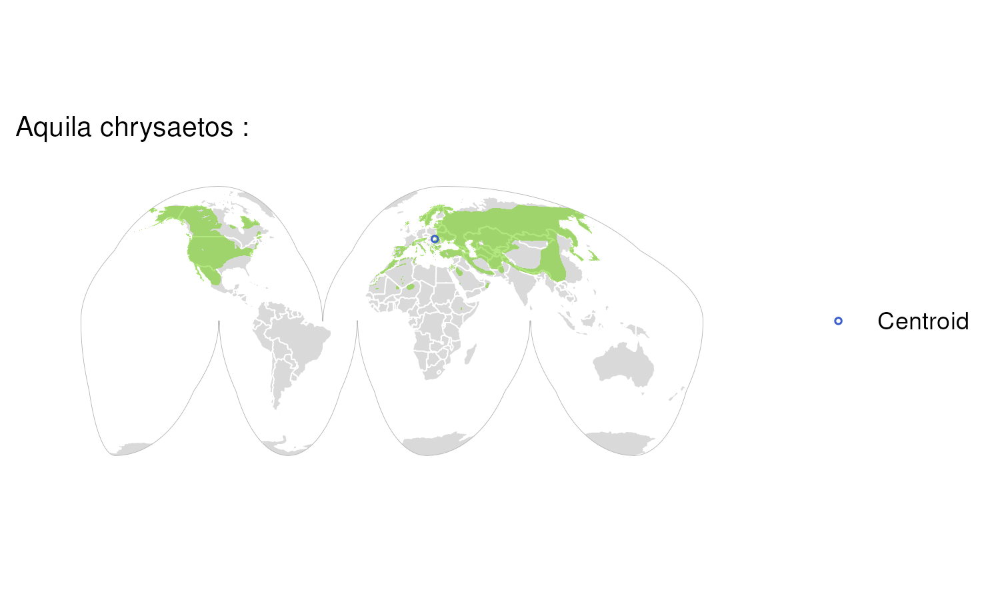

Species: Artibeus intermedius; Taxon: Mammals; Flags:

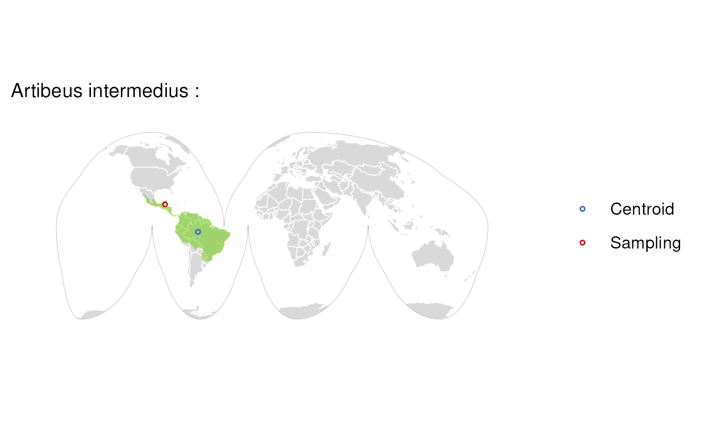

Species: Artibeus lituratus; Taxon: Mammals; Flags:

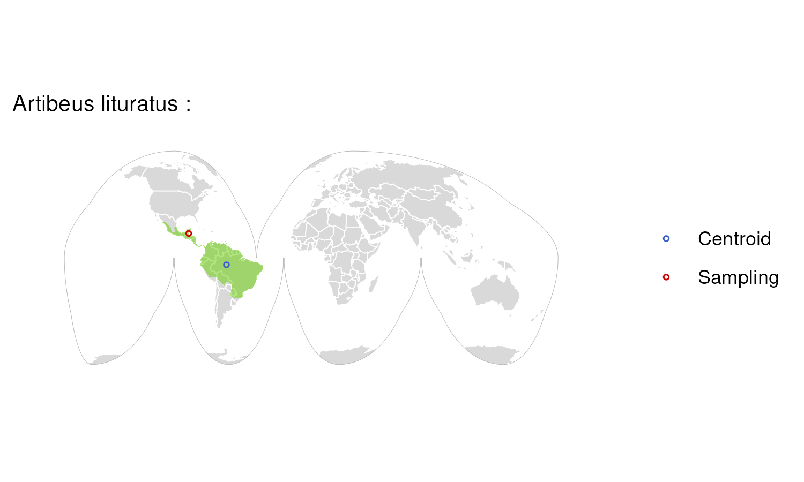

Species: Arvicola amphibius; Taxon: Mammals; Flags:

Species: Ascaphus truei; Taxon: Amphibians; Flags:

Species: Aselliscus stoliczkanus; Taxon: Mammals; Flags:

Species: Aspidoscelis tigris stejnegeri; Taxon: Reptiles; Flags:

Species: Astyanax mexicanus; Taxon: Fishes; Flags:

Species: Aulostomus maculatus; Taxon: Fishes; Flags:

Species: Aythya fuligula; Taxon: Birds; Flags:

Species: Balaenoptera musculus; Taxon: Mammals; Flags:

Species: Betta splendens; Taxon: Fishes; Flags:

Species: Bombina bombina; Taxon: Amphibians; Flags:

Species: Bradypodion pumilum; Taxon: Reptiles; Flags:

Species: Callospermophilus lateralis; Taxon: Mammals; Flags:

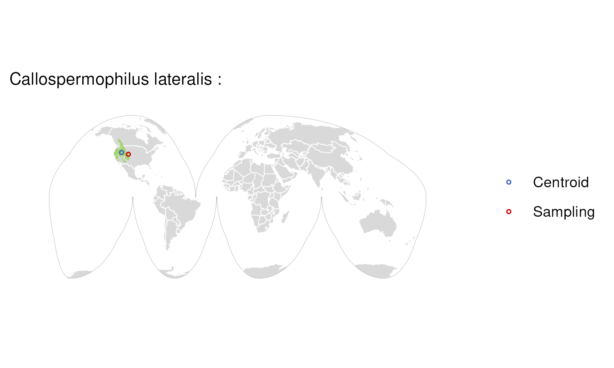

Species: Camelus dromedarius; Taxon: Mammals; Flags:

Species: Carcharodon carcharias; Taxon: Fishes; Flags:

Species: Caretta caretta; Taxon: Reptiles; Flags:

Species: Castor canadensis; Taxon: Mammals; Flags:

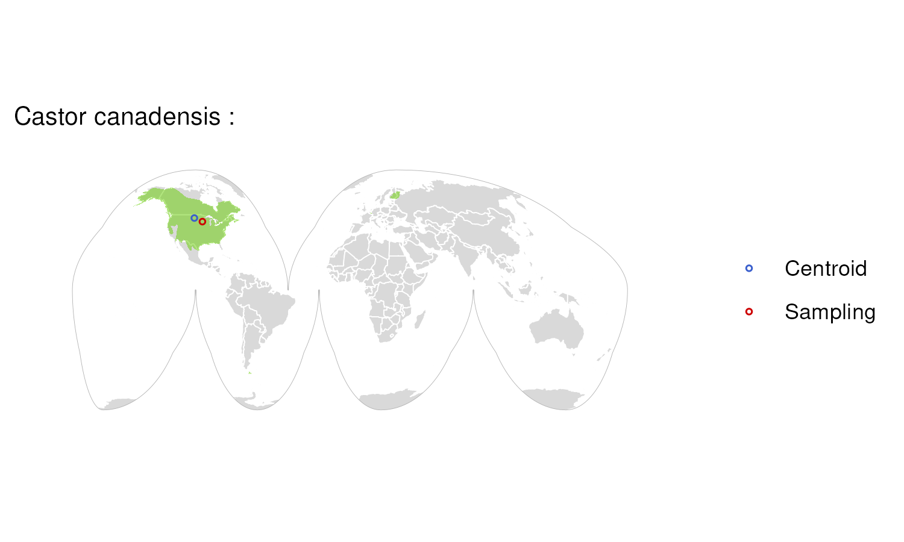

Species: Catharus ustulatus; Taxon: Birds; Flags:

Species: Chaetodon trifascialis; Taxon: Fishes; Flags:

Species: Chanos chanos; Taxon: Fishes; Flags:

Species: Chelmon rostratus; Taxon: Fishes; Flags:

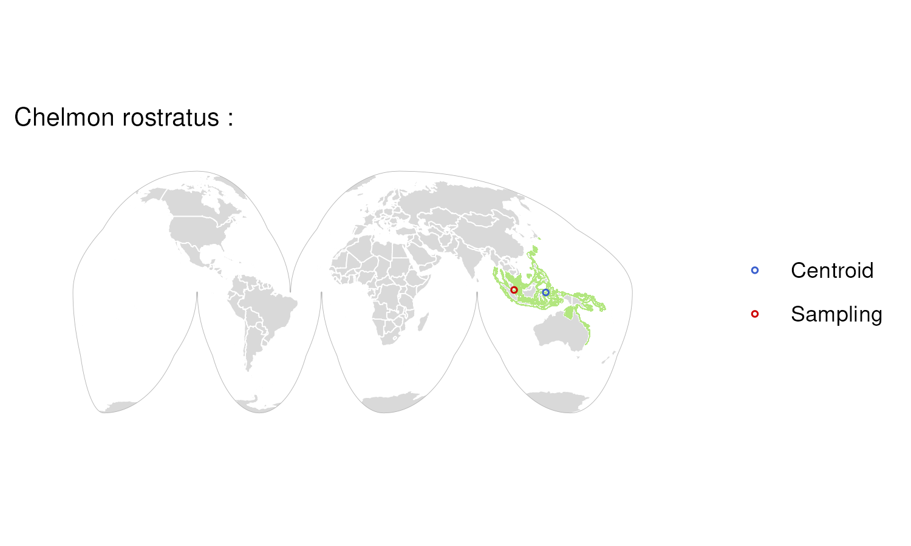

Species: Chelonia mydas; Taxon: Reptiles; Flags:

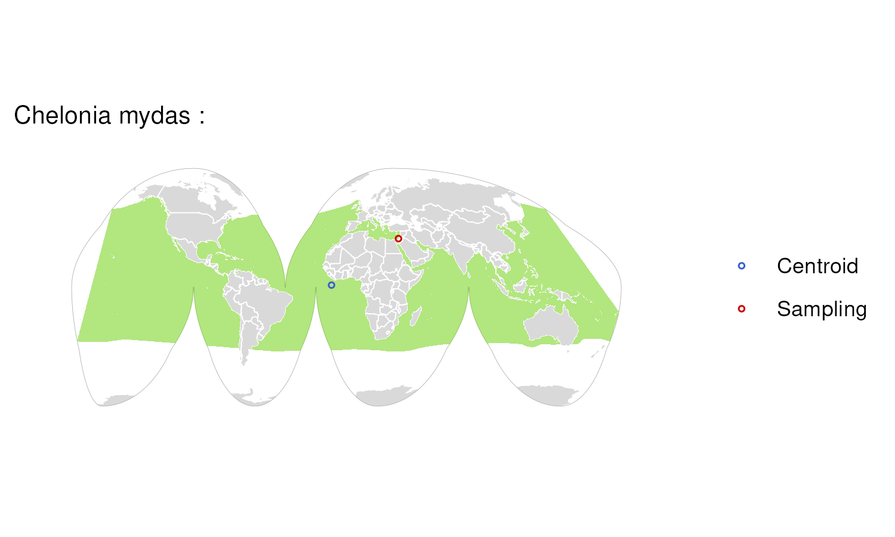

Species: Chiroxiphia lanceolata; Taxon: Birds; Flags:

Species: Chlamydotis macqueenii; Taxon: Birds; Flags:

Species: Ciconia maguari; Taxon: Birds; Flags:

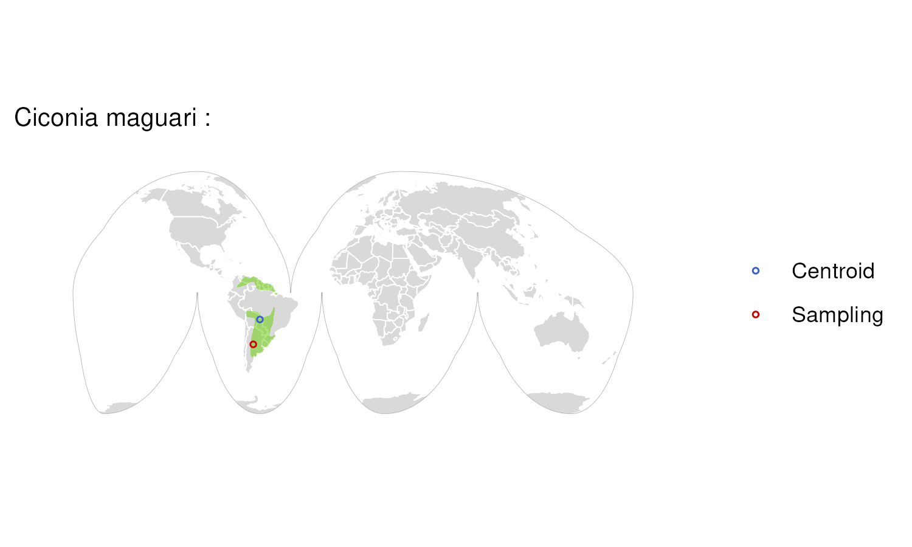

Species: Coilia mystus; Taxon: Fishes; Flags:

Species: Corvus moneduloides; Taxon: Birds; Flags:

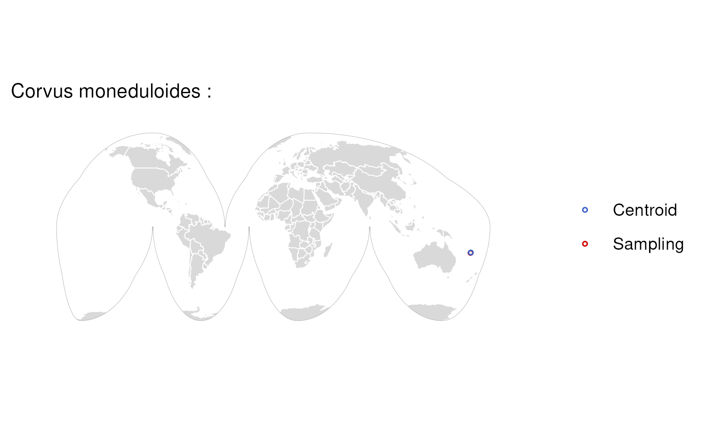

Species: Corynorhinus townsendii; Taxon: Mammals; Flags:

Species: Cottoperca gobio; Taxon: Fishes; Flags:

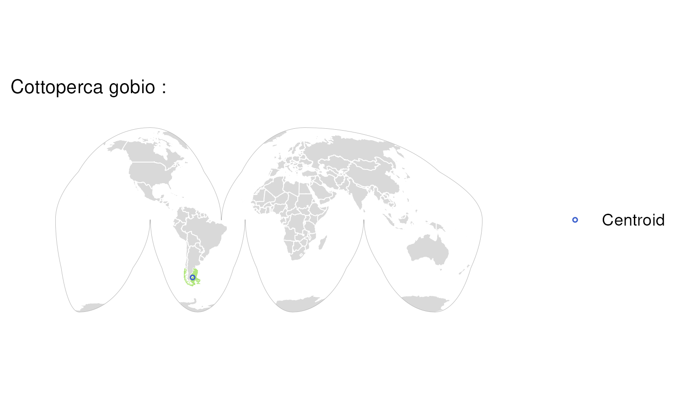

Species: Coturnix chinensis; Taxon: Birds; Flags:

Species: Ctenodactylus gundi; Taxon: Mammals; Flags:

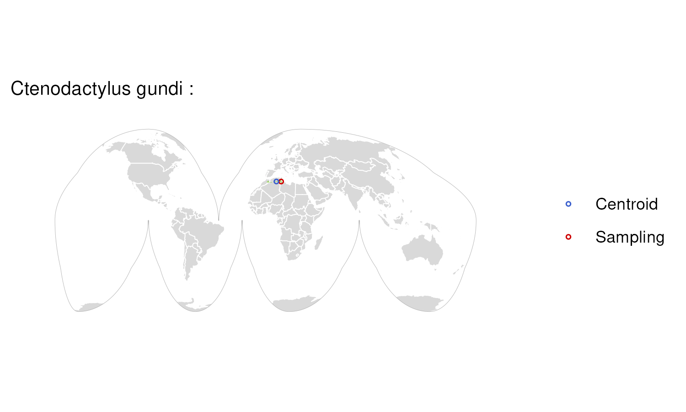

Species: Cuculus canorus; Taxon: Birds; Flags:

Species: Cyanocitta cristata; Taxon: Birds; Flags:

Species: Cygnus olor; Taxon: Birds; Flags:

Species: Cynocephalus volans; Taxon: Mammals; Flags:

Species: Cyprinella venusta; Taxon: Fishes; Flags:

Species: Dasypus novemcinctus; Taxon: Mammals; Flags:

Species: Denticeps clupeoides; Taxon: Fishes; Flags:

Species: Dermochelys coriacea; Taxon: Reptiles; Flags:

Species: Desmodus rotundus; Taxon: Mammals; Flags:

Species: Diceros bicornis minor; Taxon: Mammals; Flags:

Species: Diretmus argenteus; Taxon: Fishes; Flags:

Species: Discoglossus pictus; Taxon: Amphibians; Flags:

Species: Dixiphia pipra; Taxon: Birds; Flags:

Species: Doryrhina cyclops; Taxon: Mammals; Flags:

Species: Dromiciops gliroides; Taxon: Mammals; Flags:

Species: Dryobates pubescens; Taxon: Birds; Flags:

Species: Dugong dugon; Taxon: Mammals; Flags:

Species: Echeneis naucrates; Taxon: Fishes; Flags:

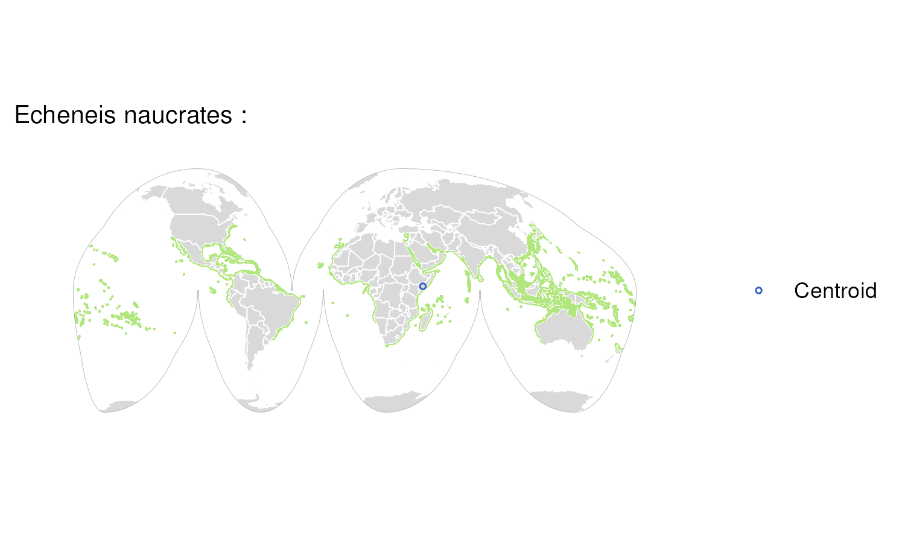

Species: Eleutherodactylus coqui; Taxon: Amphibians; Flags:

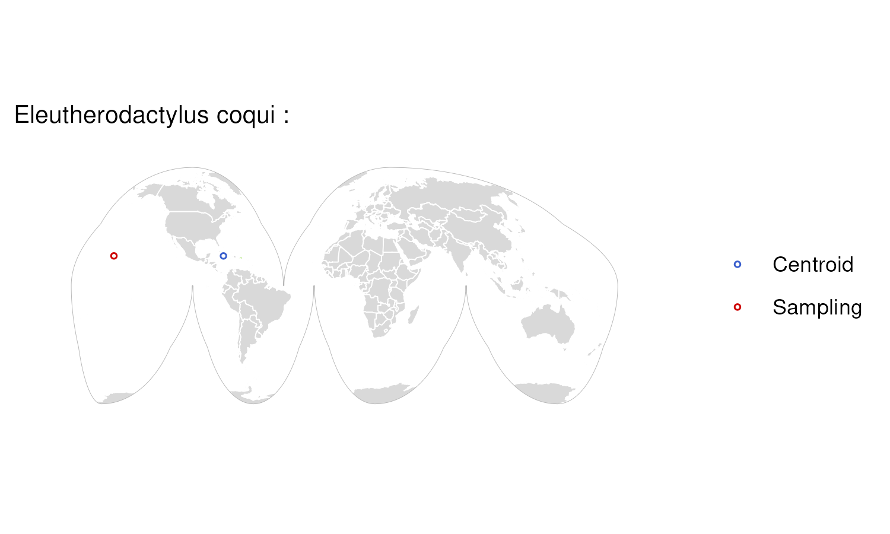

Species: Elgaria multicarinata webbii; Taxon: Reptiles; Flags:

Species: Eptesicus fuscus; Taxon: Mammals; Flags:

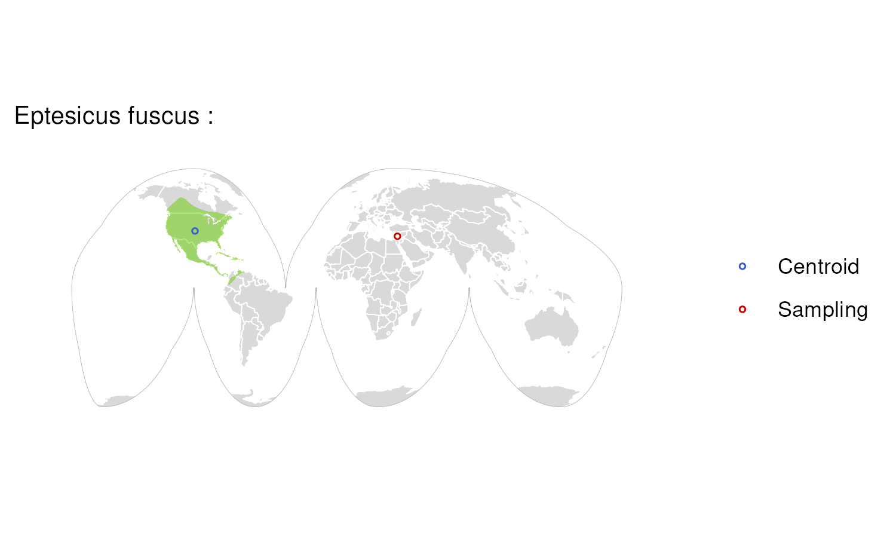

Species: Equus caballus; Taxon: Mammals; Flags:

Species: Erethizon dorsatum; Taxon: Mammals; Flags:

Species: Eretmochelys imbricata; Taxon: Reptiles; Flags:

Species: Erithacus rubecula; Taxon: Birds; Flags:

Species: Erpetoichthys calabaricus; Taxon: Fishes; Flags:

Species: Erythrolamprus reginae; Taxon: Reptiles; Flags:

Species: Eschrichtius robustus; Taxon: Mammals; Flags:

Species: Esox lucius; Taxon: Fishes; Flags:

Species: Eubalaena glacialis; Taxon: Mammals; Flags:

Species: Eublepharis macularius; Taxon: Reptiles; Flags:

Species: Euleptes europaea; Taxon: Reptiles; Flags:

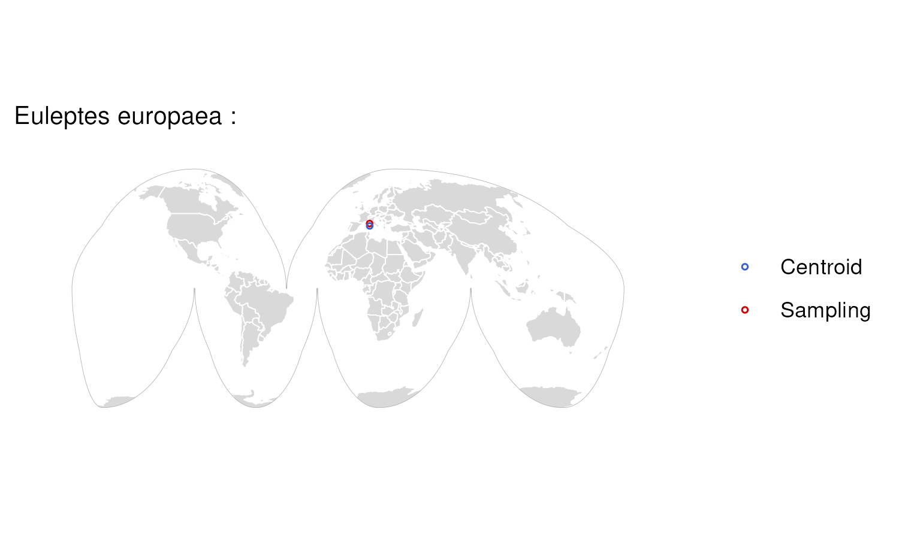

Species: Falco cherrug; Taxon: Birds; Flags:

Species: Falco naumanni; Taxon: Birds; Flags:

Species: Falco peregrinus; Taxon: Birds; Flags:

Species: Gastrophryne carolinensis; Taxon: Amphibians; Flags:

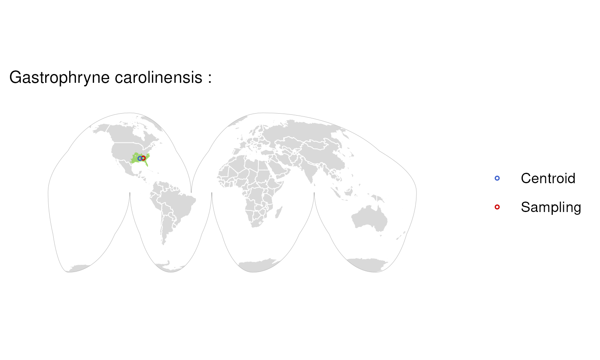

Species: Geothlypis trichas; Taxon: Birds; Flags:

Species: Geotrypetes seraphini; Taxon: Amphibians; Flags:

Species: Girardinichthys multiradiatus; Taxon: Fishes; Flags:

Species: Glossophaga mutica; Taxon: Mammals; Flags:

Species: Gorilla gorilla; Taxon: Mammals; Flags:

Species: Gouania willdenowi; Taxon: Fishes; Flags:

Species: Grus americana; Taxon: Birds; Flags:

Species: Guaruba guaruba; Taxon: Birds; Flags:

Species: Gypaetus barbatus; Taxon: Birds; Flags:

Species: Haemorhous mexicanus; Taxon: Birds; Flags:

Species: Harpia harpyja; Taxon: Birds; Flags:

Species: Heliangelus exortis; Taxon: Birds; Flags:

Species: Hemiprocne comata; Taxon: Birds; Flags:

Species: Heterodontus francisci; Taxon: Fishes; Flags:

Species: Hippoglossus hippoglossus; Taxon: Fishes; Flags:

Species: Hipposideros larvatus; Taxon: Mammals; Flags:

Species: Hoplias malabaricus; Taxon: Fishes; Flags:

Species: Hydrolagus colliei; Taxon: Fishes; Flags:

Species: Hyla sarda; Taxon: Amphibians; Flags:

Species: Hypanus sabinus; Taxon: Fishes; Flags:

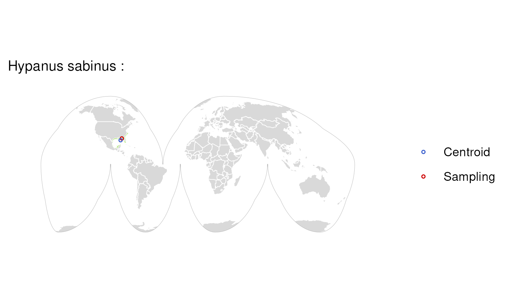

Species: Inia geoffrensis; Taxon: Mammals; Flags:

Species: Kogia breviceps; Taxon: Mammals; Flags:

Species: Lacerta agilis; Taxon: Reptiles; Flags:

Species: Lagopus muta; Taxon: Birds; Flags:

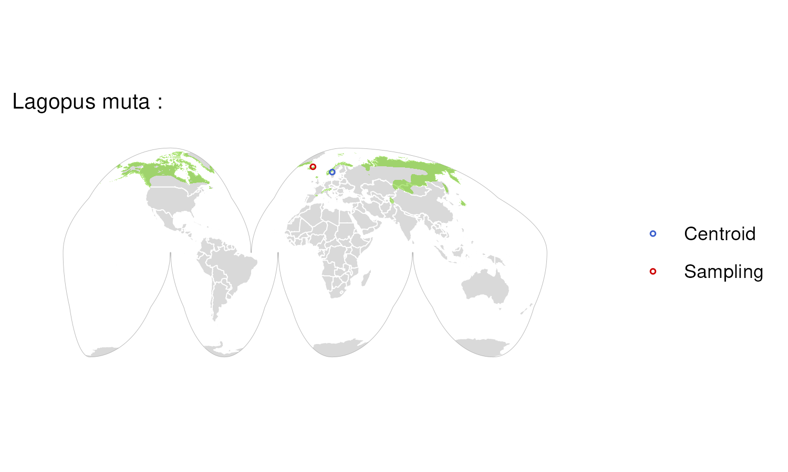

Species: Lepidochelys kempii; Taxon: Reptiles; Flags:

Species: Lepidochelys olivacea; Taxon: Reptiles; Flags:

Species: Lepisosteus oculatus; Taxon: Fishes; Flags:

Species: Leptodactylus fuscus; Taxon: Amphibians; Flags:

Species: Lonchura striata domestica; Taxon: Birds; Flags:

Species: Lutra lutra; Taxon: Mammals; Flags:

Species: Lycocorax pyrrhopterus; Taxon: Birds; Flags:

Species: Macaca fascicularis; Taxon: Mammals; Flags:

Species: Macrochelys suwanniensis; Taxon: Reptiles; Flags:

Species: Macropus eugenii; Taxon: Mammals; Flags:

Species: Malaclemys terrapin; Taxon: Reptiles; Flags:

Species: Mantella aurantiaca; Taxon: Amphibians; Flags:

Species: Marmota flaviventris; Taxon: Mammals; Flags:

Species: Mastacembelus armatus; Taxon: Fishes; Flags:

Species: Megalops cyprinoides; Taxon: Fishes; Flags:

Species: Megaptera novaeangliae; Taxon: Mammals; Flags:

Species: Melanotaenia boesemani; Taxon: Fishes; Flags:

Species: Melospiza georgiana; Taxon: Birds; Flags:

Species: Melospiza melodia; Taxon: Birds; Flags:

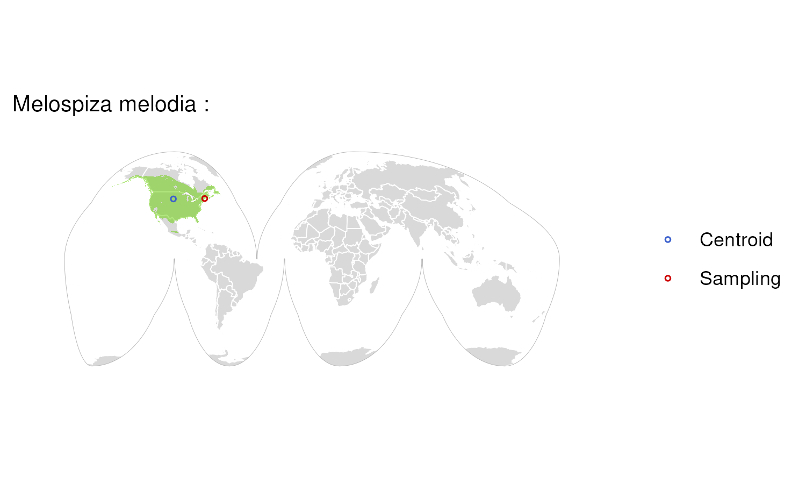

Species: Menidia menidia; Taxon: Fishes; Flags:

Species: Mergus octosetaceus; Taxon: Birds; Flags:

Species: Mesoplodon densirostris; Taxon: Mammals; Flags:

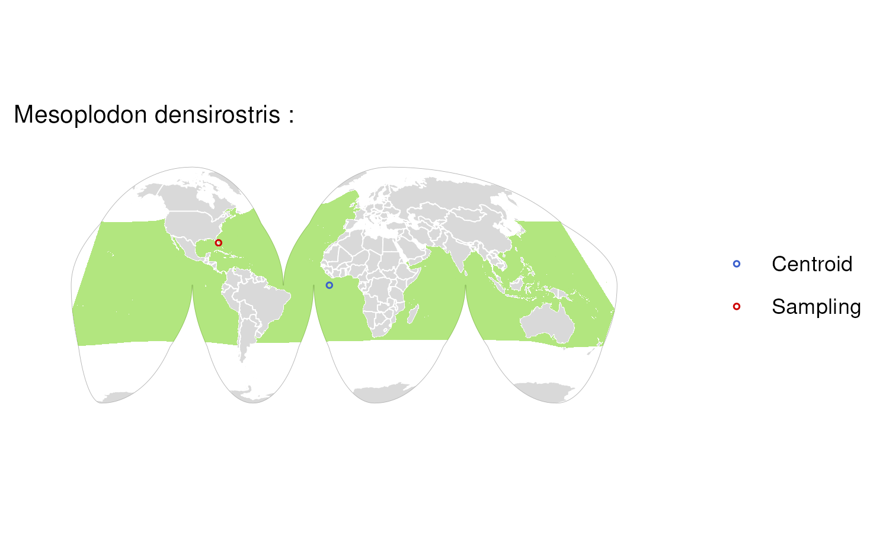

Species: Microcaecilia unicolor; Taxon: Amphibians; Flags:

Species: Micropterus salmoides; Taxon: Fishes; Flags:

Species: Microtus pennsylvanicus; Taxon: Mammals; Flags:

Species: Mobula birostris; Taxon: Fishes; Flags:

Species: Molossus molossus; Taxon: Mammals; Flags:

Species: Molossus nigricans; Taxon: Mammals; Flags:

Species: Monodon monocero; Taxon: Mammals; Flags:

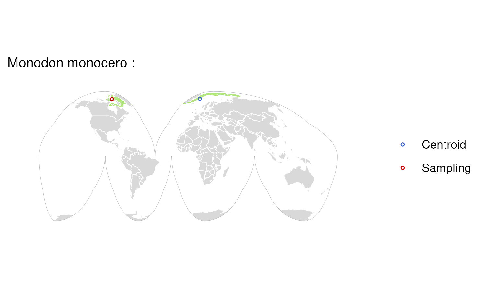

Species: Morphnus guianensis; Taxon: Birds; Flags:

Species: Mustela erminea; Taxon: Mammals; Flags:

Species: Mustela lutreola; Taxon: Mammals; Flags:

Species: Myotis myotis; Taxon: Mammals; Flags:

Species: Myripristis murdjan; Taxon: Fishes; Flags:

Species: Narcine bancroftii; Taxon: Fishes; Flags:

Species: Neoarius graeffei; Taxon: Fishes; Flags:

Species: Notolabrus celidotus; Taxon: Fishes; Flags:

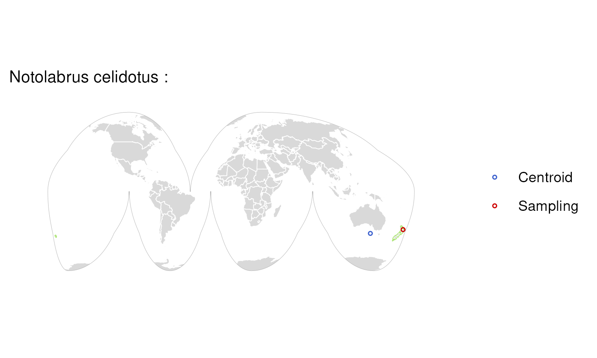

Species: Nyctibius grandis; Taxon: Birds; Flags:

Species: Ochotona princeps; Taxon: Mammals; Flags:

Species: Odontesthes bonariensis; Taxon: Fishes; Flags:

Species: Oenanthe melanoleuca; Taxon: Birds; Flags:

Species: Onychomys torridus; Taxon: Mammals; Flags:

Species: Opisthocomus hoazin; Taxon: Birds; Flags:

Species: Ornithorhynchus anatinus; Taxon: Mammals; Flags:

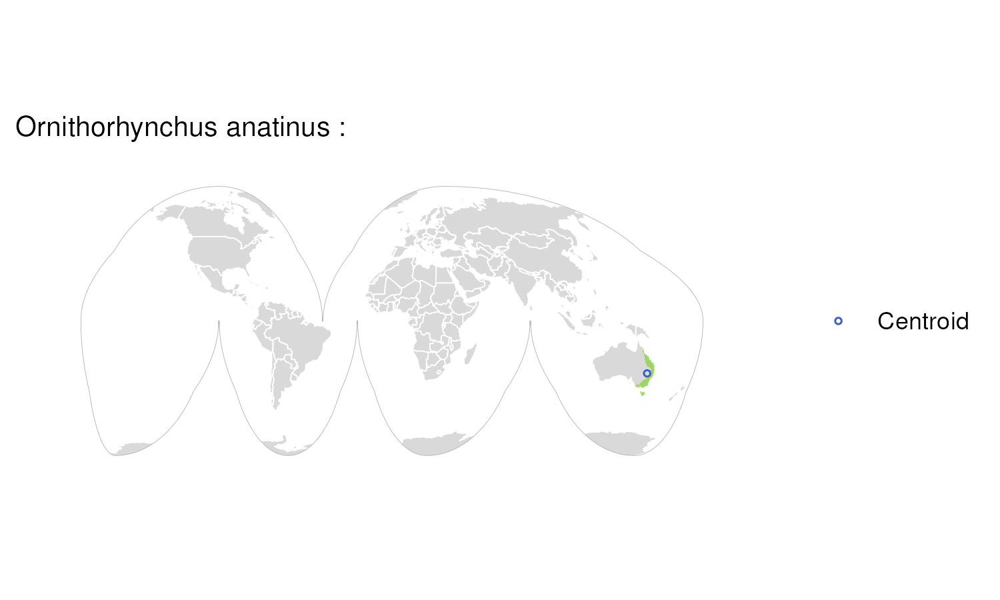

Species: Osmerus mordax; Taxon: Fishes; Flags:

Species: Ovis canadensis; Taxon: Mammals; Flags:

Species: Pan paniscus; Taxon: Mammals; Flags:

Species: Pan troglodytes; Taxon: Mammals; Flags:

Species: Panthera onca; Taxon: Mammals; Flags:

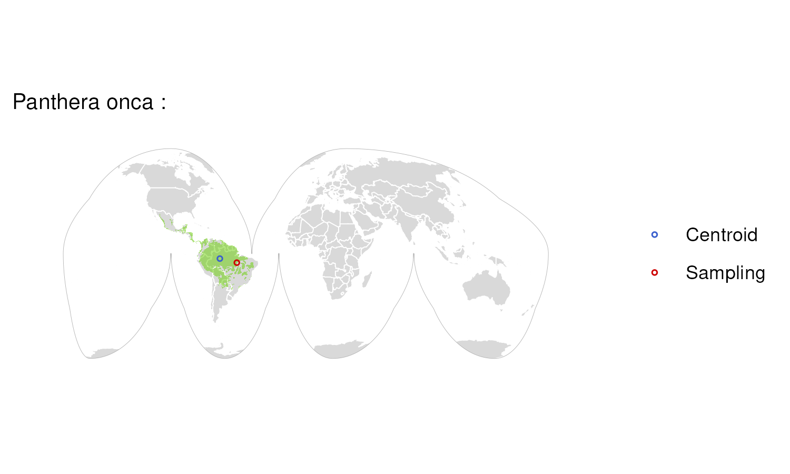

Species: Parambassis ranga; Taxon: Fishes; Flags:

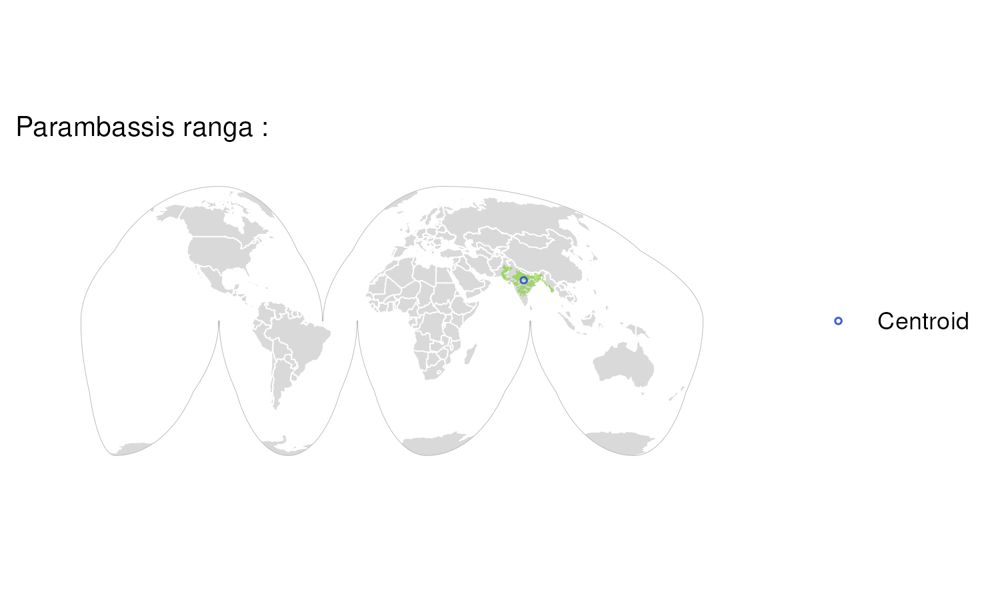

Species: Passer domesticus; Taxon: Birds; Flags:

Species: Passerculus sandwichensis; Taxon: Birds; Flags:

Species: Pelobates fuscus; Taxon: Amphibians; Flags:

Species: Pelodytes ibericus; Taxon: Amphibians; Flags:

Species: Peromyscus maniculatus; Taxon: Mammals; Flags:

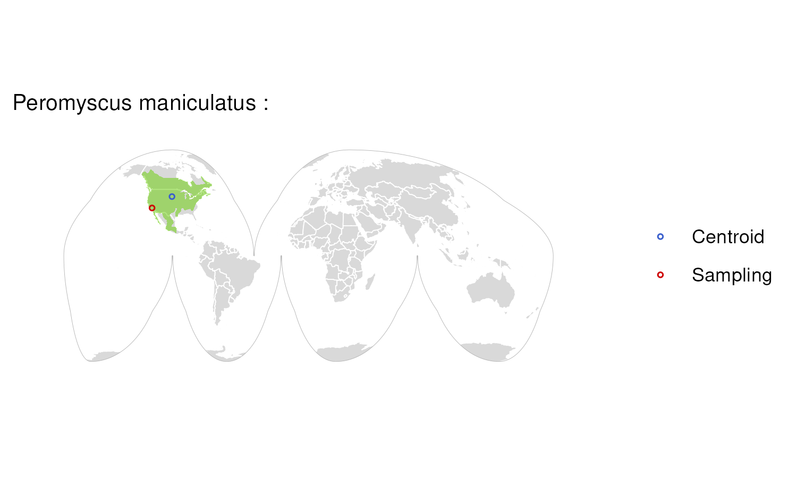

Species: Petromyzon marinus; Taxon: Fishes; Flags:

Species: Phaethon aethereus; Taxon: Birds; Flags:

Species: Phaethornis superciliosus; Taxon: Birds; Flags:

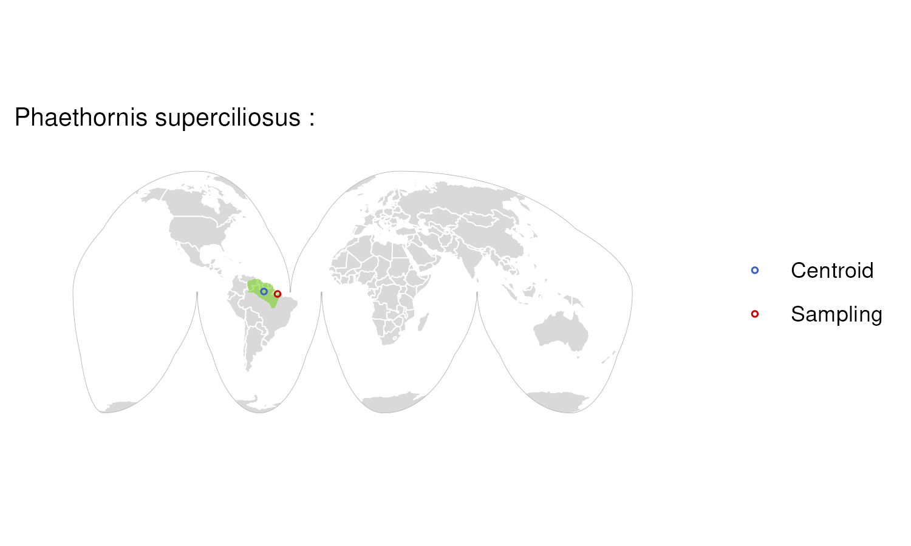

Species: Pipistrellus kuhlii; Taxon: Mammals; Flags:

Species: Pipistrellus pipistrellus; Taxon: Mammals; Flags:

Species: Pleurodeles waltl; Taxon: Amphibians; Flags:

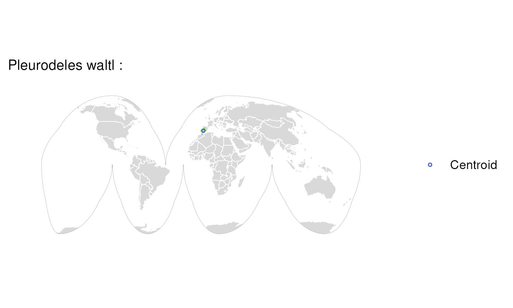

Species: Pluvialis apricaria; Taxon: Birds; Flags:

Species: Podarcis raffonei; Taxon: Reptiles; Flags:

Species: Podargus strigoides; Taxon: Birds; Flags:

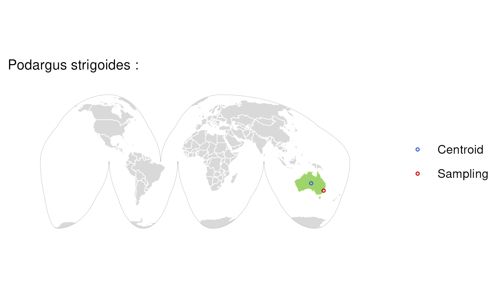

Species: Poecile atricapillus; Taxon: Birds; Flags:

Species: Pogoniulus pusillus; Taxon: Birds; Flags:

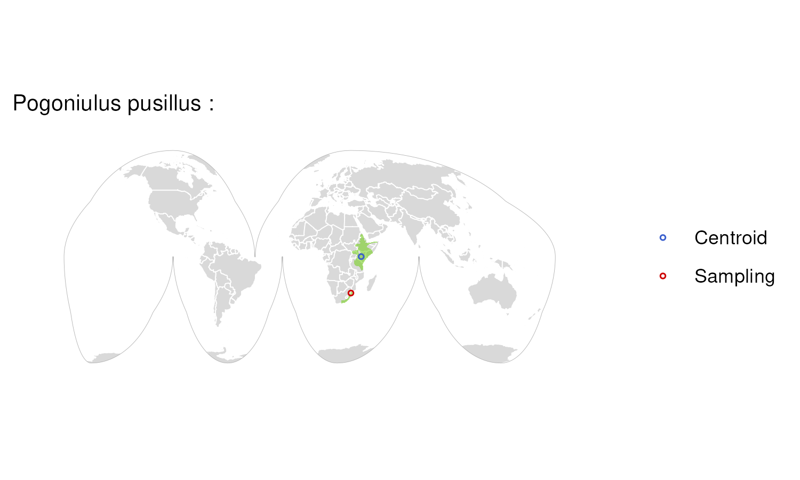

Species: Pongo abelii; Taxon: Mammals; Flags:

Species: Pongo pygmaeus; Taxon: Mammals; Flags:

Species: Porphyrio hochstetteri; Taxon: Birds; Flags:

Species: Pristiophorus japonicus; Taxon: Fishes; Flags:

Species: Pristis pectinata; Taxon: Fishes; Flags:

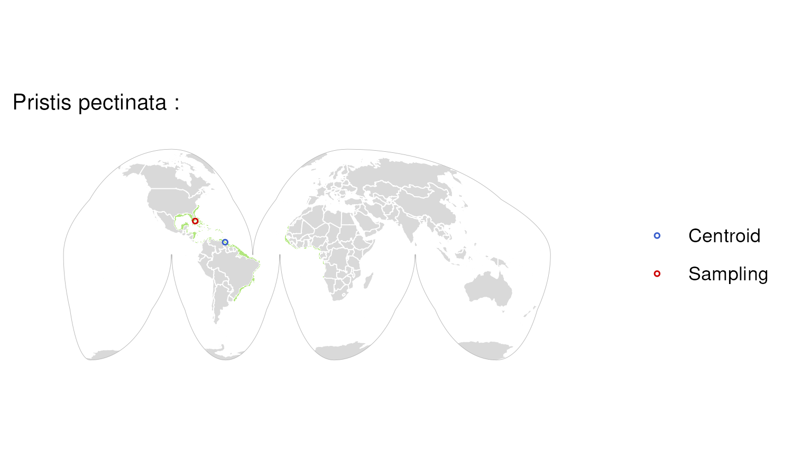

Species: Protopterus annectens; Taxon: Fishes; Flags:

Species: Pseudophryne corroboree; Taxon: Amphibians; Flags:

Species: Pseudorca crassidens; Taxon: Mammals; Flags:

Species: Pterocles gutturalis; Taxon: Birds; Flags:

Species: Rhinatrema bivittatum; Taxon: Amphibians; Flags:

Species: Rhineura floridana; Taxon: Reptiles; Flags:

Species: Rhinolophus affinis; Taxon: Mammals; Flags:

Species: Rhinolophus ferrumequinum; Taxon: Mammals; Flags:

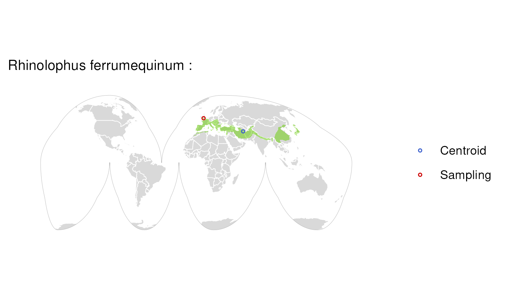

Species: Rhinolophus perniger lanosus; Taxon: Mammals; Flags:

Species: Rhinolophus trifoliatus; Taxon: Mammals; Flags:

Species: Rhinophrynus dorsalis; Taxon: Amphibians; Flags:

Species: Rhynchonycteris naso; Taxon: Mammals; Flags:

Species: Rissa tridactyla; Taxon: Birds; Flags:

Species: Saccopteryx bilineata; Taxon: Mammals; Flags:

Species: Saccopteryx leptura; Taxon: Mammals; Flags:

Species: Salarias fasciatus; Taxon: Fishes; Flags:

Species: Salminus brasiliensis; Taxon: Fishes; Flags:

Species: Salmo trutta; Taxon: Fishes; Flags:

Species: Salvelinus alpinus; Taxon: Fishes; Flags:

Species: Sarcoramphus papa; Taxon: Birds; Flags:

Species: Scatophagus argus; Taxon: Fishes; Flags:

Species: Sciurus carolinensis; Taxon: Mammals; Flags:

Species: Sciurus vulgaris; Taxon: Mammals; Flags:

Species: Scleropages formosus; Taxon: Fishes; Flags:

Species: Scomber japonicus; Taxon: Fishes; Flags:

Species: Scyliorhinus canicula; Taxon: Fishes; Flags:

Species: Shinisaurus crocodilurus; Taxon: Reptiles; Flags:

Species: Sminthopsis crassicaudata; Taxon: Mammals; Flags:

Species: Sorex araneus; Taxon: Mammals; Flags:

Species: Sparus aurata; Taxon: Fishes; Flags:

Species: Spea bombifrons; Taxon: Amphibians; Flags:

Species: Sphaeramia orbicularis; Taxon: Fishes; Flags:

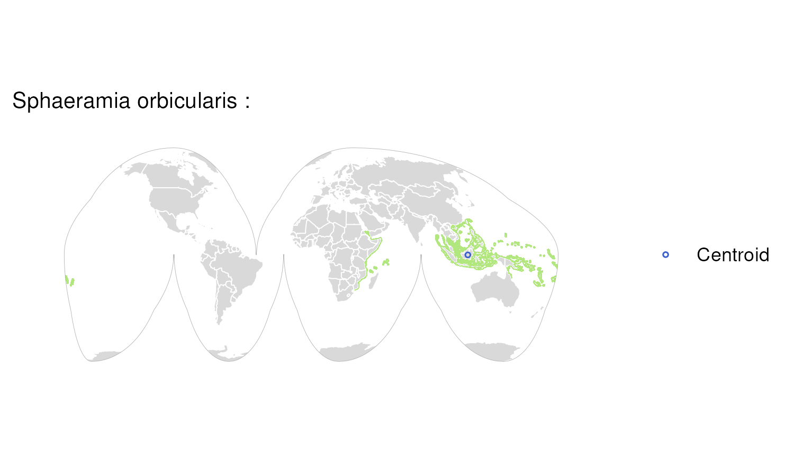

Species: Stegostoma tigrinum; Taxon: Fishes; Flags:

Species: Sterna hirundo; Taxon: Birds; Flags:

Species: Sternotherus odoratus; Taxon: Reptiles; Flags:

Species: Streptopelia turtur; Taxon: Birds; Flags:

Species: Strix aluco; Taxon: Birds; Flags:

Species: Struthio camelus australis; Taxon: Birds; Flags:

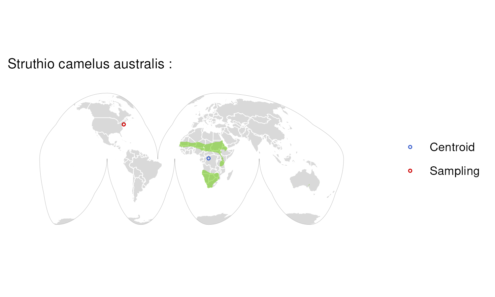

Species: Sylvia atricapilla; Taxon: Birds; Flags:

Species: Sylvia borin; Taxon: Birds; Flags:

Species: Symphalangus syndactylus; Taxon: Mammals; Flags:

Species: Syngnathus acus; Taxon: Fishes; Flags:

Species: Syngnathus typhle; Taxon: Fishes; Flags:

Species: Tachyglossus aculeatus; Taxon: Mammals; Flags:

Species: Tadarida brasiliensis; Taxon: Mammals; Flags:

Species: Takifugu rubripes; Taxon: Fishes; Flags:

Species: Tamandua tetradactyla; Taxon: Mammals; Flags:

Species: Tautogolabrus adspersus; Taxon: Fishes; Flags:

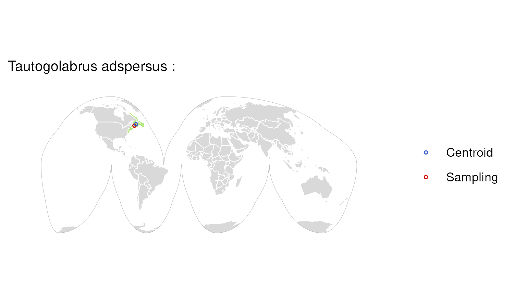

Species: Thalassophryne amazonica; Taxon: Fishes; Flags:

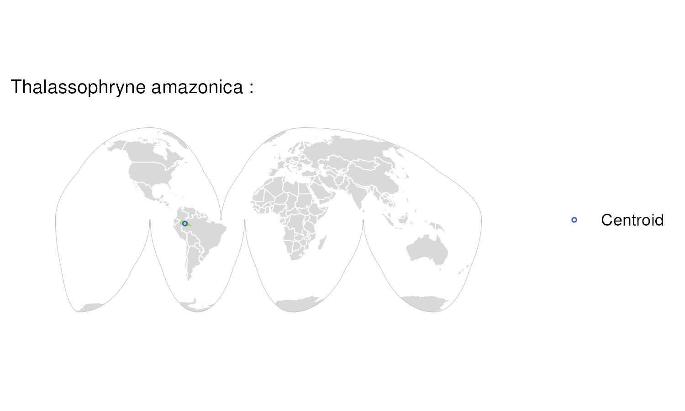

Species: Theristicus caerulescens; Taxon: Birds; Flags:

Species: Thomomys bottae; Taxon: Mammals; Flags:

Species: Tiliqua scincoides; Taxon: Reptiles; Flags:

Species: Trichechus inunguis; Taxon: Mammals; Flags:

Species: Trichomycterus rosablanca; Taxon: Fishes; Flags:

Species: Trogon surrucura; Taxon: Birds; Flags:

Species: Tupaia tana; Taxon: Mammals; Flags:

Species: Tursiops truncatus; Taxon: Mammals; Flags:

Species: Urocitellus parryii; Taxon: Mammals; Flags:

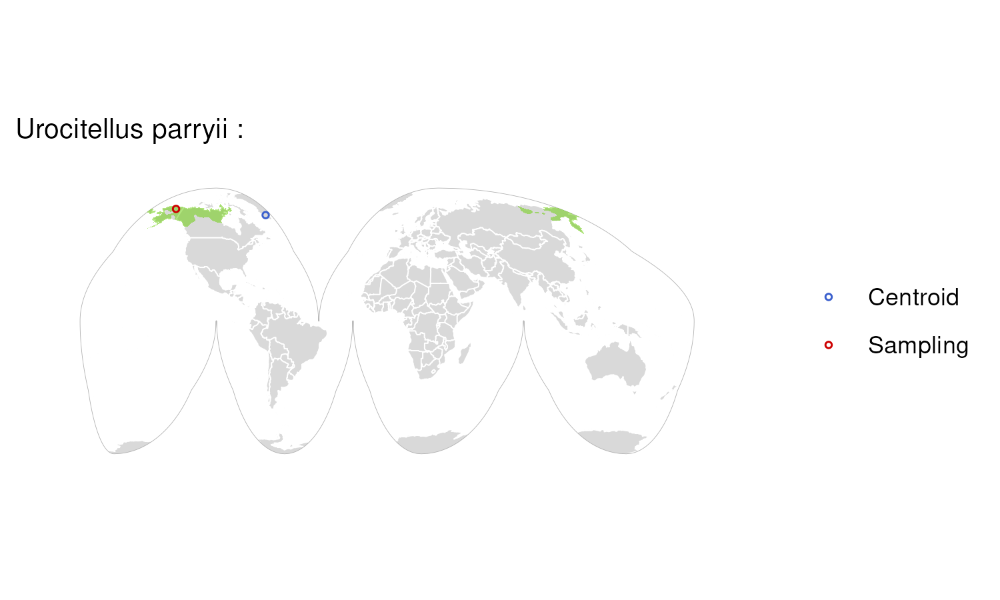

Species: Vidua chalybeata; Taxon: Birds; Flags:

Species: Vipera latastei; Taxon: Reptiles; Flags:

Species: Willisornis vidua; Taxon: Birds; Flags:

Species: Zalophus californianus; Taxon: Mammals; Flags:

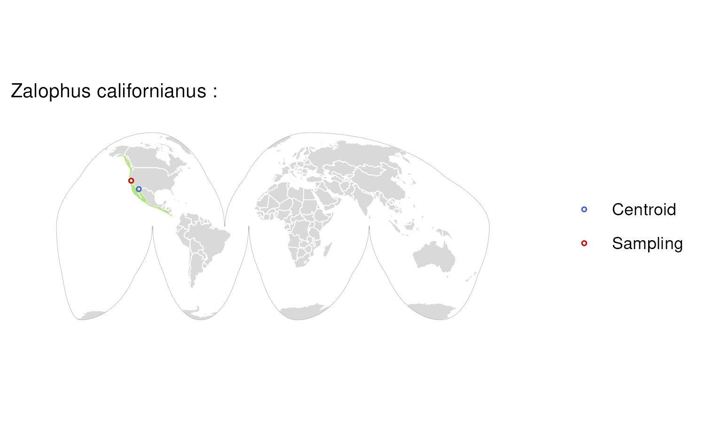

Species: Zonotrichia albicollis; Taxon: Birds; Flags:

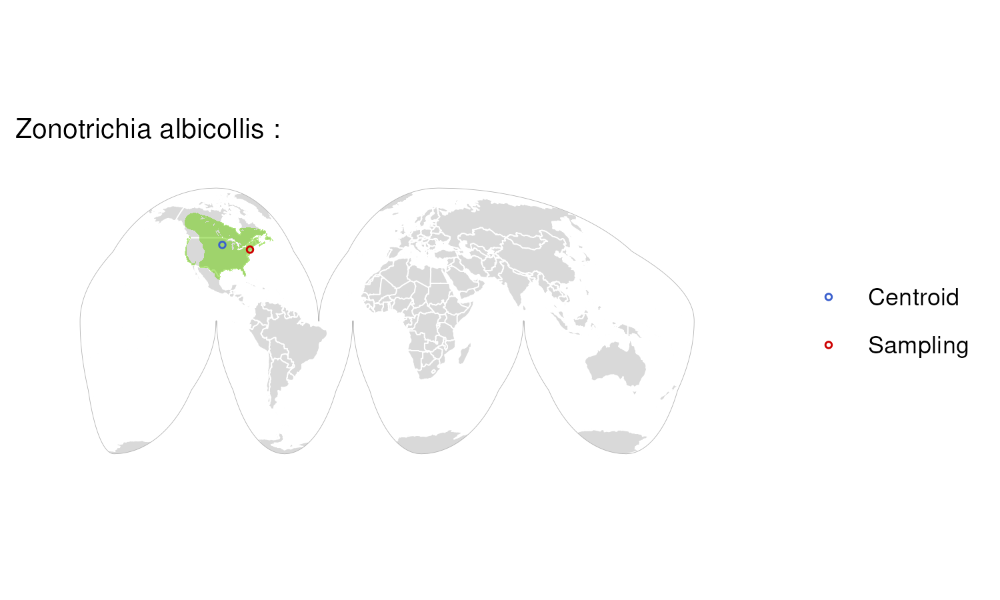
