## Sampling Map

## Range Centroid Map

## Heatmap of Distributions

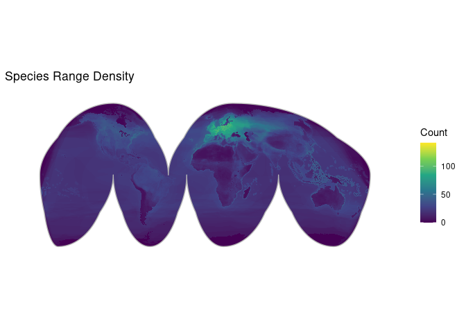

## Individual Species Maps

### Species: Asterias rubens

**Biosample:**  
**Assembly Accession:** GCA\_902459465.3  
**Taxon:** Invertebrates  
**Priority:** 1  
**Flags:** Missing Range; Missing Sampling Location;  

### Species: Branchiostoma belcheri

**Biosample:**  
**Assembly Accession:** GCA\_019207075.1  
**Taxon:** Invertebrates  
**Priority:** 1  
**Flags:** Missing Range; Missing Sampling Location;  

### Species: Branchiostoma floridae

**Biosample:**  
**Assembly Accession:** GCA\_015852565.1  
**Taxon:** Invertebrates  
**Priority:** 1  
**Flags:** Missing Range; Missing Sampling Location;  

### Species: Gadus morhua

**Biosample:**  
**Assembly Accession:** GCA\_902167405.1  
**Taxon:** Fishes  
**Priority:** 1  
**Flags:** Missing Range; Missing Sampling Location;  

### Species: Acanthopagrus latus

**Biosample:**  
**Assembly Accession:** GCA\_904848185.1  
**Taxon:** Fishes  
**Priority:** 2  
**Flags:** Missing Sampling Location;  

### Species: Acipenser ruthenus

**Biosample:**  
**Assembly Accession:** GCA\_902713425.2  
**Taxon:** Fishes  
**Priority:** 2  
**Flags:** Missing Sampling Location;  

### Species: Acomys russatus

**Biosample:**  
**Assembly Accession:** GCA\_903995435.1  
**Taxon:** Mammals  
**Priority:** 2  
**Flags:** Missing Sampling Location;  

### Species: Anabas testudineus

**Biosample:**  
**Assembly Accession:** GCA\_900324465.3  
**Taxon:** Fishes  
**Priority:** 2  
**Flags:** Missing Sampling Location;  

### Species: Aquila chrysaetos

**Biosample:**  
**Assembly Accession:** GCA\_900496995.4  
**Taxon:** Birds  
**Priority:** 2  
**Flags:** Missing Sampling Location;  

### Species: Arvicola amphibius

**Biosample:**  
**Assembly Accession:** GCA\_903992535.2  
**Taxon:** Mammals  
**Priority:** 2  
**Flags:** Missing Sampling Location;  

### Species: Astyanax mexicanus

**Biosample:**  
**Assembly Accession:** GCA\_023375975.1  
**Taxon:** Fishes  
**Priority:** 2  
**Flags:** Missing Sampling Location;  

### Species: Betta splendens

**Biosample:**  
**Assembly Accession:** GCA\_900634795.4  
**Taxon:** Fishes  
**Priority:** 2  
**Flags:** Missing Sampling Location;  

### Species: Chanos chanos

**Biosample:**  
**Assembly Accession:** GCA\_902362185.1  
**Taxon:** Fishes  
**Priority:** 2  
**Flags:** Missing Sampling Location;  

### Species: Cottoperca gobio

**Biosample:**  
**Assembly Accession:** GCA\_900634415.1  
**Taxon:** Fishes  
**Priority:** 2  
**Flags:** Missing Sampling Location;  

### Species: Denticeps clupeoides

**Biosample:**  
**Assembly Accession:** GCA\_900700375.2  
**Taxon:** Fishes  
**Priority:** 2  
**Flags:** Missing Sampling Location;  

### Species: Echeneis naucrates

**Biosample:**  
**Assembly Accession:** GCA\_900963305.2  
**Taxon:** Fishes  
**Priority:** 2  
**Flags:** Missing Sampling Location;  

### Species: Erithacus rubecula

**Biosample:**  
**Assembly Accession:** GCA\_903797595.2  
**Taxon:** Birds  
**Priority:** 2  
**Flags:** Missing Sampling Location;  

### Species: Erpetoichthys calabaricus

**Biosample:**  
**Assembly Accession:** GCA\_900747795.4  
**Taxon:** Fishes  
**Priority:** 2  
**Flags:** Missing Sampling Location;  

### Species: Eubalaena glacialis

**Biosample:**  
**Assembly Accession:** GCA\_028564815.2  
**Taxon:** Mammals  
**Priority:** 2  
**Flags:** Missing Sampling Location;  

### Species: Eublepharis macularius

**Biosample:**  
**Assembly Accession:** GCA\_028583425.1  
**Taxon:** Reptiles  
**Priority:** 2  
**Flags:** Missing Sampling Location;  
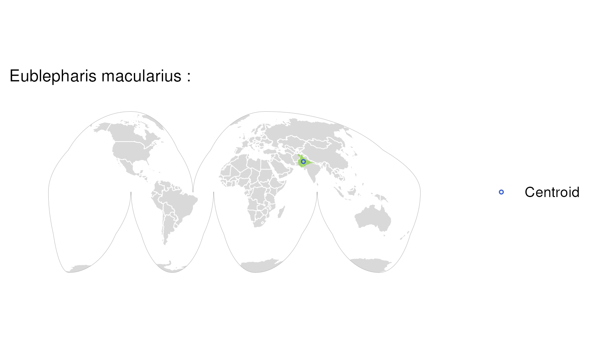

### Species: Geotrypetes seraphini

**Biosample:**  
**Assembly Accession:** GCA\_902459505.2  
**Taxon:** Amphibians  
**Priority:** 2  
**Flags:** Missing Sampling Location;  
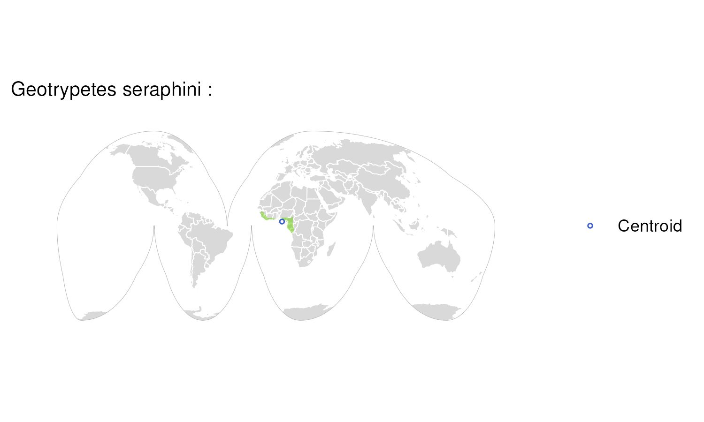

### Species: Girardinichthys multiradiatus

**Biosample:**  
**Assembly Accession:** GCA\_021462225.2  
**Taxon:** Fishes  
**Priority:** 2  
**Flags:** Missing Sampling Location;  

### Species: Gorilla gorilla

**Biosample:**  
**Assembly Accession:** GCA\_029281585.3  
**Taxon:** Mammals  
**Priority:** 2  
**Flags:** Missing Sampling Location;  

### Species: Gouania willdenowi

**Biosample:**  
**Assembly Accession:** GCA\_900634775.2  
**Taxon:** Fishes  
**Priority:** 2  
**Flags:** Missing Sampling Location;  

### Species: Lutra lutra

**Biosample:**  
**Assembly Accession:** GCA\_902655055.2  
**Taxon:** Mammals  
**Priority:** 2  
**Flags:** Missing Sampling Location;  

### Species: Lycocorax pyrrhopterus

**Biosample:**  
**Assembly Accession:** GCA\_014706295.1  
**Taxon:** Birds  
**Priority:** 2  
**Flags:** Missing Sampling Location;  

### Species: Mastacembelus armatus

**Biosample:**  
**Assembly Accession:** GCA\_900324485.3  
**Taxon:** Fishes  
**Priority:** 2  
**Flags:** Missing Sampling Location;  

### Species: Microcaecilia unicolor

**Biosample:**  
**Assembly Accession:** GCA\_901765095.2  
**Taxon:** Amphibians  
**Priority:** 2  
**Flags:** Missing Sampling Location;  

### Species: Micropterus salmoides

**Biosample:**  
**Assembly Accession:** GCA\_019677235.1  
**Taxon:** Fishes  
**Priority:** 2  
**Flags:** Missing Sampling Location;  

### Species: Myripristis murdjan

**Biosample:**  
**Assembly Accession:** GCA\_902150065.1  
**Taxon:** Fishes  
**Priority:** 2  
**Flags:** Missing Sampling Location;  

### Species: Oenanthe melanoleuca

**Biosample:**  
**Assembly Accession:** GCA\_029582105.1  
**Taxon:** Birds  
**Priority:** 2  
**Flags:** Missing Sampling Location;  

### Species: Onychomys torridus

**Biosample:**  
**Assembly Accession:** GCA\_903995425.1  
**Taxon:** Mammals  
**Priority:** 2  
**Flags:** Missing Sampling Location;  

### Species: Ornithorhynchus anatinus

**Biosample:**  
**Assembly Accession:** GCA\_004115215.4  
**Taxon:** Mammals  
**Priority:** 2  
**Flags:** Missing Sampling Location;  

### Species: Ovis canadensis

**Biosample:**  
**Assembly Accession:** GCA\_042477335.2  
**Taxon:** Mammals  
**Priority:** 2  
**Flags:** Missing Sampling Location;  

### Species: Pan paniscus

**Biosample:**  
**Assembly Accession:** GCA\_029289425.3  
**Taxon:** Mammals  
**Priority:** 2  
**Flags:** Missing Sampling Location;  

### Species: Pan troglodytes

**Biosample:**  
**Assembly Accession:** GCA\_028858775.2  
**Taxon:** Mammals  
**Priority:** 2  
**Flags:** Missing Sampling Location;  

### Species: Parambassis ranga

**Biosample:**  
**Assembly Accession:** GCA\_900634625.2  
**Taxon:** Fishes  
**Priority:** 2  
**Flags:** Missing Sampling Location;  

### Species: Patagioenas fasciata

**Biosample:**  
**Assembly Accession:** GCA\_037038585.2  
**Taxon:** Birds  
**Priority:** 2  
**Flags:** Outside Range; Missing Sampling Location;  

### Species: Petromyzon marinus

**Biosample:**  
**Assembly Accession:** GCA\_048934315.1  
**Taxon:** Fishes  
**Priority:** 2  
**Flags:** Missing Sampling Location;  

### Species: Pipistrellus pipistrellus

**Biosample:**  
**Assembly Accession:** GCA\_903992545.1  
**Taxon:** Mammals  
**Priority:** 2  
**Flags:** Missing Sampling Location;  

### Species: Pleurodeles waltl

**Biosample:**  
**Assembly Accession:** GCA\_026652325.1  
**Taxon:** Amphibians  
**Priority:** 2  
**Flags:** Missing Sampling Location;  

### Species: Pongo abelii

**Biosample:**  
**Assembly Accession:** GCA\_028885655.2  
**Taxon:** Mammals  
**Priority:** 2  
**Flags:** Missing Sampling Location;  

### Species: Pongo pygmaeus

**Biosample:**  
**Assembly Accession:** GCA\_028885625.2  
**Taxon:** Mammals  
**Priority:** 2  
**Flags:** Missing Sampling Location;  

### Species: Protopterus annectens

**Biosample:**  
**Assembly Accession:** GCA\_040939525.1  
**Taxon:** Fishes  
**Priority:** 2  
**Flags:** Missing Sampling Location;  

### Species: Rhinatrema bivittatum

**Biosample:**  
**Assembly Accession:** GCA\_901001135.2  
**Taxon:** Amphibians  
**Priority:** 2  
**Flags:** Missing Sampling Location;  

### Species: Salarias fasciatus

**Biosample:**  
**Assembly Accession:** GCA\_902148845.1  
**Taxon:** Fishes  
**Priority:** 2  
**Flags:** Missing Sampling Location;  

### Species: Salmo trutta

**Biosample:**  
**Assembly Accession:** GCA\_901001165.2  
**Taxon:** Fishes  
**Priority:** 2  
**Flags:** Missing Sampling Location;  

### Species: Sciurus carolinensis

**Biosample:**  
**Assembly Accession:** GCA\_902686445.2  
**Taxon:** Mammals  
**Priority:** 2  
**Flags:** Missing Sampling Location;  
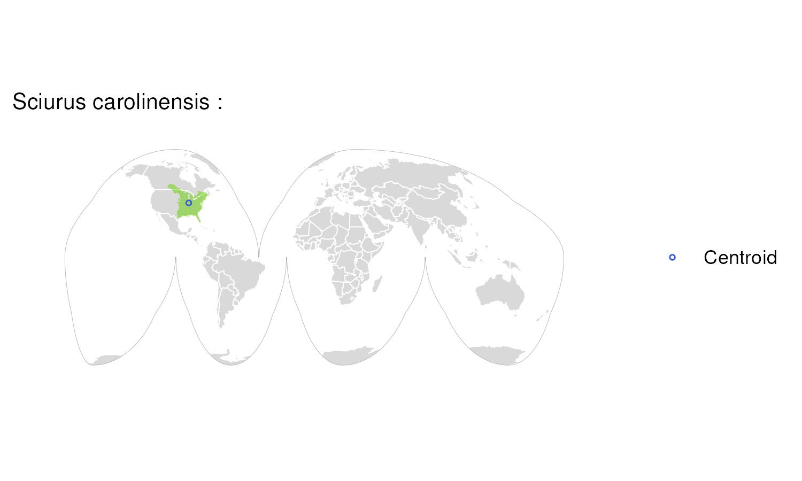

### Species: Sciurus vulgaris

**Biosample:**  
**Assembly Accession:** GCA\_902686455.2  
**Taxon:** Mammals  
**Priority:** 2  
**Flags:** Missing Sampling Location;  

### Species: Scleropages formosus

**Biosample:**  
**Assembly Accession:** GCA\_900964775.1  
**Taxon:** Fishes  
**Priority:** 2  
**Flags:** Missing Sampling Location;  

### Species: Scyliorhinus canicula

**Biosample:**  
**Assembly Accession:** GCA\_902713615.2  
**Taxon:** Fishes  
**Priority:** 2  
**Flags:** Missing Sampling Location;  

### Species: Sparus aurata

**Biosample:**  
**Assembly Accession:** GCA\_900880675.2  
**Taxon:** Fishes  
**Priority:** 2  
**Flags:** Missing Sampling Location;  

### Species: Sphaeramia orbicularis

**Biosample:**  
**Assembly Accession:** GCA\_902148855.1  
**Taxon:** Fishes  
**Priority:** 2  
**Flags:** Missing Sampling Location;  

### Species: Streptopelia turtur

**Biosample:**  
**Assembly Accession:** GCA\_901699155.2  
**Taxon:** Birds  
**Priority:** 2  
**Flags:** Missing Sampling Location;  

### Species: Symphalangus syndactylus

**Biosample:**  
**Assembly Accession:** GCA\_028878055.3  
**Taxon:** Mammals  
**Priority:** 2  
**Flags:** Missing Sampling Location;  

### Species: Syngnathus acus

**Biosample:**  
**Assembly Accession:** GCA\_901709675.2  
**Taxon:** Fishes  
**Priority:** 2  
**Flags:** Missing Sampling Location;  

### Species: Takifugu rubripes

**Biosample:**  
**Assembly Accession:** GCA\_901000725.3  
**Taxon:** Fishes  
**Priority:** 2  
**Flags:** Missing Sampling Location;  

### Species: Thalassophryne amazonica

**Biosample:**  
**Assembly Accession:** GCA\_902500255.1  
**Taxon:** Fishes  
**Priority:** 2  
**Flags:** Missing Sampling Location;  

### Species: Tupaia tana

**Biosample:**  
**Assembly Accession:** GCA\_026018925.1  
**Taxon:** Mammals  
**Priority:** 2  
**Flags:** Missing Sampling Location;  

### Species: Carettochelys insculpta

**Biosample:**  
**Assembly Accession:** GCA\_033958435.1  
**Taxon:** Reptiles  
**Priority:** 3  
**Flags:** Outside Range; Vague Location;  

### Species: Electrophorus electricus

**Biosample:**  
**Assembly Accession:** GCA\_041902795.1  
**Taxon:** Fishes  
**Priority:** 3  
**Flags:** Outside Range; Vague Location;  

### Species: Epinephelus lanceolatus

**Biosample:**  
**Assembly Accession:** GCA\_041903045.1  
**Taxon:** Fishes  
**Priority:** 3  
**Flags:** Outside Range; Vague Location;  

### Species: Phascolarctos cinereus

**Biosample:**  
**Assembly Accession:** GCA\_003287225.2  
**Taxon:** Mammals  
**Priority:** 3  
**Flags:** Outside Range; Vague Location;  

### Species: Polymixia cf. hollisterae

**Biosample:**  
**Assembly Accession:** GCA\_048537225.1  
**Taxon:** Fishes  
**Priority:** 3  
**Flags:** Vague Location; Missing Range;  

### Species: Acomys minous

**Biosample:**  
**Assembly Accession:** GCA\_964271855.1  
**Taxon:** Mammals  
**Priority:** 4  
**Flags:** Outside Range;  

### Species: Acridotheres tristis

**Biosample:**  
**Assembly Accession:** GCA\_027559615.1  
**Taxon:** Birds  
**Priority:** 4  
**Flags:** Outside Range;  

### Species: Antennarius maculatus

**Biosample:**  
**Assembly Accession:** GCA\_013358685.1  
**Taxon:** Fishes  
**Priority:** 4  
**Flags:** Outside Range;  

### Species: Antrozous pallidus

**Biosample:**  
**Assembly Accession:** GCA\_027563665.1  
**Taxon:** Mammals  
**Priority:** 4  
**Flags:** Outside Range;  

### Species: Ara ararauna

**Biosample:**  
**Assembly Accession:** GCA\_028858755.1  
**Taxon:** Birds  
**Priority:** 4  
**Flags:** Outside Range;  

### Species: Archocentrus centrarchus

**Biosample:**  
**Assembly Accession:** GCA\_007364275.2  
**Taxon:** Fishes  
**Priority:** 4  
**Flags:** Outside Range;  

### Species: Arvicanthis niloticus

**Biosample:**  
**Assembly Accession:** GCA\_011762505.3  
**Taxon:** Mammals  
**Priority:** 4  
**Flags:** Outside Range;  

### Species: Astatotilapia calliptera

**Biosample:**  
**Assembly Accession:** GCA\_964374335.1  
**Taxon:** Fishes  
**Priority:** 4  
**Flags:** Outside Range;  

### Species: Aulonocara stuartgranti

**Biosample:**  
**Assembly Accession:** GCA\_965226115.1  
**Taxon:** Fishes  
**Priority:** 4  
**Flags:** Outside Range;  

### Species: Balaenoptera ricei

**Biosample:**  
**Assembly Accession:** GCA\_028023285.1  
**Taxon:** Mammals  
**Priority:** 4  
**Flags:** Outside Range;  

### Species: Blennius ocellaris

**Biosample:**  
**Assembly Accession:** GCA\_963422515.1  
**Taxon:** Fishes  
**Priority:** 4  
**Flags:** Outside Range;  
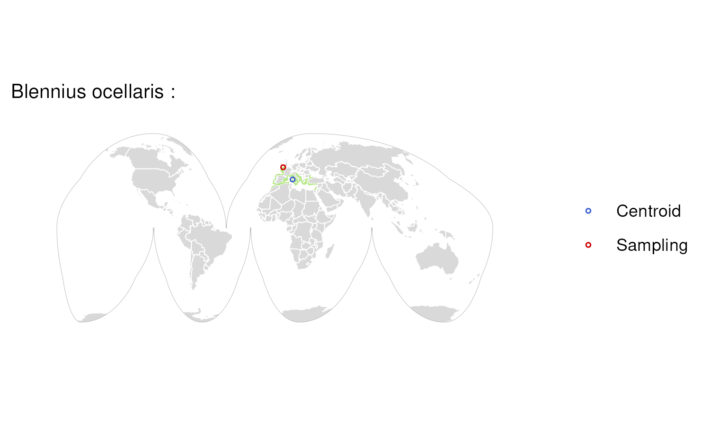

### Species: Bombina variegata

**Biosample:**  
**Assembly Accession:** GCA\_964205295.1  
**Taxon:** Amphibians  
**Priority:** 4  
**Flags:** Outside Range;  

### Species: Borostomias antarcticus

**Biosample:**  
**Assembly Accession:** GCA\_949987555.1  
**Taxon:** Fishes  
**Priority:** 4  
**Flags:** Outside Range;  

### Species: Callithrix jacchus

**Biosample:**  
**Assembly Accession:** GCA\_049354715.1  
**Taxon:** Mammals  
**Priority:** 4  
**Flags:** Outside Range;  

### Species: Calonectris borealis

**Biosample:**  
**Assembly Accession:** GCA\_964195595.2  
**Taxon:** Birds  
**Priority:** 4  
**Flags:** Outside Range;  

### Species: Calypte anna

**Biosample:**  
**Assembly Accession:** GCA\_003957555.2  
**Taxon:** Birds  
**Priority:** 4  
**Flags:** Outside Range;  

### Species: Candoia aspera

**Biosample:**  
**Assembly Accession:** GCA\_035149785.1  
**Taxon:** Reptiles  
**Priority:** 4  
**Flags:** Outside Range;  

### Species: Choloepus didactylus

**Biosample:**  
**Assembly Accession:** GCA\_015220235.1  
**Taxon:** Mammals  
**Priority:** 4  
**Flags:** Outside Range;  

### Species: Clarias gariepinus

**Biosample:**  
**Assembly Accession:** GCA\_024256435.1  
**Taxon:** Fishes  
**Priority:** 4  
**Flags:** Outside Range;  

### Species: Columba livia

**Biosample:**  
**Assembly Accession:** GCA\_036013475.2  
**Taxon:** Birds  
**Priority:** 4  
**Flags:** Outside Range;  

### Species: Corvus hawaiiensis

**Biosample:**  
**Assembly Accession:** GCA\_020740725.1  
**Taxon:** Birds  
**Priority:** 4  
**Flags:** Outside Range;  

### Species: Cristiceps australis

**Biosample:**  
**Assembly Accession:** GCA\_049082185.1  
**Taxon:** Fishes  
**Priority:** 4  
**Flags:** Outside Range;  

### Species: Dasyurus maculatus

**Biosample:**  
**Assembly Accession:** GCA\_048593285.1  
**Taxon:** Mammals  
**Priority:** 4  
**Flags:** Outside Range;  

### Species: Dendropsophus ebraccatus

**Biosample:**  
**Assembly Accession:** GCA\_027789765.1  
**Taxon:** Amphibians  
**Priority:** 4  
**Flags:** Outside Range;  

### Species: Dibamus smithi

**Biosample:**  
**Assembly Accession:** GCA\_046126795.1  
**Taxon:** Reptiles  
**Priority:** 4  
**Flags:** Outside Range;  

### Species: Engystomops pustulosus

**Biosample:**  
**Assembly Accession:** GCA\_040894005.1  
**Taxon:** Amphibians  
**Priority:** 4  
**Flags:** Outside Range;  

### Species: Enoplosus armatus

**Biosample:**  
**Assembly Accession:** GCA\_043641665.1  
**Taxon:** Fishes  
**Priority:** 4  
**Flags:** Outside Range;  

### Species: Epinephelus rankini

**Biosample:**  
**Assembly Accession:** GCA\_048129235.1  
**Taxon:** Fishes  
**Priority:** 4  
**Flags:** Outside Range;  

### Species: Falco biarmicus

**Biosample:**  
**Assembly Accession:** GCA\_023638135.1  
**Taxon:** Birds  
**Priority:** 4  
**Flags:** Outside Range;  

### Species: Falco rusticolus

**Biosample:**  
**Assembly Accession:** GCA\_015220075.1  
**Taxon:** Birds  
**Priority:** 4  
**Flags:** Outside Range;  

### Species: Furcifer pardalis

**Biosample:**  
**Assembly Accession:** GCA\_030440675.1  
**Taxon:** Reptiles  
**Priority:** 4  
**Flags:** Outside Range;  

### Species: Gavia stellata

**Biosample:**  
**Assembly Accession:** GCA\_030936135.1  
**Taxon:** Birds  
**Priority:** 4  
**Flags:** Outside Range;  

### Species: Gopherus evgoodei

**Biosample:**  
**Assembly Accession:** GCA\_007399415.1  
**Taxon:** Reptiles  
**Priority:** 4  
**Flags:** Outside Range;  

### Species: Gopherus flavomarginatus

**Biosample:**  
**Assembly Accession:** GCA\_025201925.1  
**Taxon:** Reptiles  
**Priority:** 4  
**Flags:** Outside Range;  

### Species: Grus grus

**Biosample:**  
**Assembly Accession:** GCA\_964106855.1  
**Taxon:** Birds  
**Priority:** 4  
**Flags:** Outside Range;  

### Species: Gymnoscopelus microlampas

**Biosample:**  
**Assembly Accession:** GCA\_963454915.1  
**Taxon:** Fishes  
**Priority:** 4  
**Flags:** Outside Range;  

### Species: Haliaeetus albicilla

**Biosample:**  
**Assembly Accession:** GCA\_947461875.1  
**Taxon:** Birds  
**Priority:** 4  
**Flags:** Outside Range;  

### Species: Hemiscyllium ocellatum

**Biosample:**  
**Assembly Accession:** GCA\_020745735.1  
**Taxon:** Fishes  
**Priority:** 4  
**Flags:** Outside Range;  

### Species: Heptranchias perlo

**Biosample:**  
**Assembly Accession:** GCA\_035084215.1  
**Taxon:** Fishes  
**Priority:** 4  
**Flags:** Outside Range;  

### Species: Hyperolius riggenbachi

**Biosample:**  
**Assembly Accession:** GCA\_040937935.1  
**Taxon:** Amphibians  
**Priority:** 4  
**Flags:** Outside Range;  

### Species: Hyperoodon ampullatus

**Biosample:**  
**Assembly Accession:** GCA\_949752795.1  
**Taxon:** Mammals  
**Priority:** 4  
**Flags:** Outside Range;  

### Species: Jaculus jaculus

**Biosample:**  
**Assembly Accession:** GCA\_020740685.1  
**Taxon:** Mammals  
**Priority:** 4  
**Flags:** Outside Range;  

### Species: Lathamus discolor

**Biosample:**  
**Assembly Accession:** GCA\_037157495.1  
**Taxon:** Birds  
**Priority:** 4  
**Flags:** Outside Range;  

### Species: Lepidogalaxias salamandroides

**Biosample:**  
**Assembly Accession:** GCA\_049190665.1  
**Taxon:** Fishes  
**Priority:** 4  
**Flags:** Outside Range;  
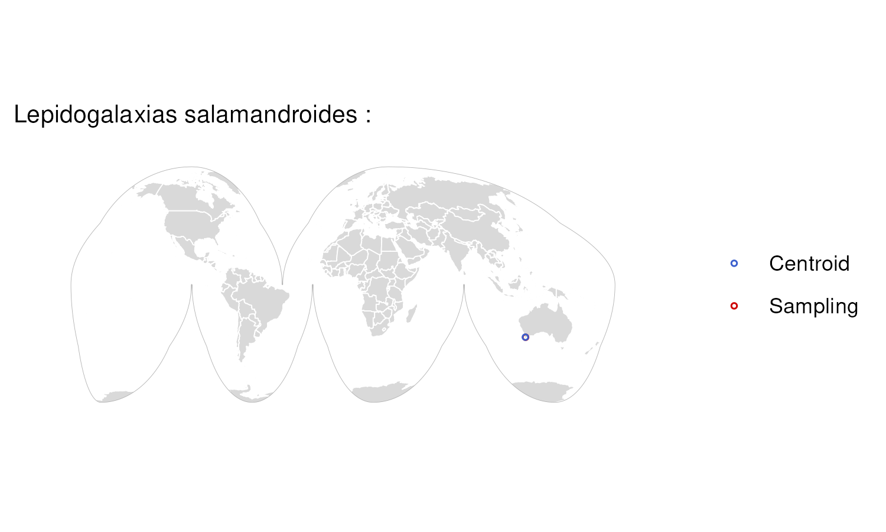

### Species: Leptosomus discolor

**Biosample:**  
**Assembly Accession:** GCA\_034619465.1  
**Taxon:** Birds  
**Priority:** 4  
**Flags:** Outside Range;  

### Species: Lethrinus nebulosus

**Biosample:**  
**Assembly Accession:** GCA\_045362495.1  
**Taxon:** Fishes  
**Priority:** 4  
**Flags:** Outside Range;  

### Species: Lycaon pictus

**Biosample:**  
**Assembly Accession:** GCA\_040955705.1  
**Taxon:** Mammals  
**Priority:** 4  
**Flags:** Outside Range;  

### Species: Lynx canadensis

**Biosample:**  
**Assembly Accession:** GCA\_007474595.2  
**Taxon:** Mammals  
**Priority:** 4  
**Flags:** Outside Range;  

### Species: Macaca nemestrina

**Biosample:**  
**Assembly Accession:** GCA\_043159975.1  
**Taxon:** Mammals  
**Priority:** 4  
**Flags:** Outside Range;  

### Species: Megaderma spasma

**Biosample:**  
**Assembly Accession:** GCA\_043880595.1  
**Taxon:** Mammals  
**Priority:** 4  
**Flags:** Outside Range;  

### Species: Melopsittacus undulatus

**Biosample:**  
**Assembly Accession:** GCA\_012275295.1  
**Taxon:** Birds  
**Priority:** 4  
**Flags:** Outside Range;  

### Species: Mesoplodon bidens

**Biosample:**  
**Assembly Accession:** GCA\_964165515.1  
**Taxon:** Mammals  
**Priority:** 4  
**Flags:** Outside Range;  

### Species: Mesoplodon mirus

**Biosample:**  
**Assembly Accession:** GCA\_964341445.1  
**Taxon:** Mammals  
**Priority:** 4  
**Flags:** Outside Range;  

### Species: Mixophyes fleayi

**Biosample:**  
**Assembly Accession:** GCA\_038048845.1  
**Taxon:** Amphibians  
**Priority:** 4  
**Flags:** Outside Range;  

### Species: Molossus alvarezi

**Biosample:**  
**Assembly Accession:** GCA\_037157525.1  
**Taxon:** Mammals  
**Priority:** 4  
**Flags:** Outside Range;  

### Species: Monodelphis domestica

**Biosample:**  
**Assembly Accession:** GCA\_027887165.1  
**Taxon:** Mammals  
**Priority:** 4  
**Flags:** Outside Range;  

### Species: Mops condylurus

**Biosample:**  
**Assembly Accession:** GCA\_043748645.1  
**Taxon:** Mammals  
**Priority:** 4  
**Flags:** Outside Range;  

### Species: Myxine glutinosa

**Biosample:**  
**Assembly Accession:** GCA\_964187855.1  
**Taxon:** Fishes  
**Priority:** 4  
**Flags:** Outside Range;  

### Species: Neogale vison

**Biosample:**  
**Assembly Accession:** GCA\_964106545.1  
**Taxon:** Mammals  
**Priority:** 4  
**Flags:** Outside Range;  

### Species: Netta rufina

**Biosample:**  
**Assembly Accession:** GCA\_964035555.1  
**Taxon:** Birds  
**Priority:** 4  
**Flags:** Outside Range;  

### Species: Oryctolagus cuniculus

**Biosample:**  
**Assembly Accession:** GCA\_964237555.1  
**Taxon:** Mammals  
**Priority:** 4  
**Flags:** Outside Range;  

### Species: Pagrus pagrus

**Biosample:**  
**Assembly Accession:** GCA\_965226575.1  
**Taxon:** Fishes  
**Priority:** 4  
**Flags:** Outside Range;  

### Species: Pangasianodon hypophthalmus

**Biosample:**  
**Assembly Accession:** GCA\_027358585.1  
**Taxon:** Fishes  
**Priority:** 4  
**Flags:** Outside Range;  

### Species: Pangshura tecta

**Biosample:**  
**Assembly Accession:** GCA\_045781085.1  
**Taxon:** Reptiles  
**Priority:** 4  
**Flags:** Outside Range;  

### Species: Pelophylax lessonae

**Biosample:**  
**Assembly Accession:** GCA\_965119305.1  
**Taxon:** Amphibians  
**Priority:** 4  
**Flags:** Outside Range;  

### Species: Periophthalmus magnuspinnatus

**Biosample:**  
**Assembly Accession:** GCA\_009829125.3  
**Taxon:** Fishes  
**Priority:** 4  
**Flags:** Outside Range;  

### Species: Phalacrocorax carbo

**Biosample:**  
**Assembly Accession:** GCA\_963921805.1  
**Taxon:** Birds  
**Priority:** 4  
**Flags:** Outside Range;  

### Species: Phocoena sinus

**Biosample:**  
**Assembly Accession:** GCA\_008692025.1  
**Taxon:** Mammals  
**Priority:** 4  
**Flags:** Outside Range;  

### Species: Pholidichthys leucotaenia

**Biosample:**  
**Assembly Accession:** GCA\_020510985.1  
**Taxon:** Fishes  
**Priority:** 4  
**Flags:** Outside Range;  

### Species: Phyllostomus discolor

**Biosample:**  
**Assembly Accession:** GCA\_004126475.3  
**Taxon:** Mammals  
**Priority:** 4  
**Flags:** Outside Range;  

### Species: Pipistrellus hanaki

**Biosample:**  
**Assembly Accession:** GCA\_964339955.1  
**Taxon:** Mammals  
**Priority:** 4  
**Flags:** Outside Range;  

### Species: Platalea leucorodia

**Biosample:**  
**Assembly Accession:** GCA\_965183815.1  
**Taxon:** Birds  
**Priority:** 4  
**Flags:** Outside Range;  

### Species: Podarcis bocagei

**Biosample:**  
**Assembly Accession:** GCA\_964188305.1  
**Taxon:** Reptiles  
**Priority:** 4  
**Flags:** Outside Range;  

### Species: Podarcis cretensis

**Biosample:**  
**Assembly Accession:** GCA\_951804945.1  
**Taxon:** Reptiles  
**Priority:** 4  
**Flags:** Outside Range;  

### Species: Podarcis filfolensis

**Biosample:**  
**Assembly Accession:** GCA\_964270895.1  
**Taxon:** Reptiles  
**Priority:** 4  
**Flags:** Outside Range;  

### Species: Podarcis liolepis

**Biosample:**  
**Assembly Accession:** GCA\_965112155.1  
**Taxon:** Reptiles  
**Priority:** 4  
**Flags:** Outside Range;  

### Species: Podarcis pityusensis

**Biosample:**  
**Assembly Accession:** GCA\_964106645.2  
**Taxon:** Reptiles  
**Priority:** 4  
**Flags:** Outside Range;  

### Species: Podarcis tiliguerta

**Biosample:**  
**Assembly Accession:** GCA\_965153285.1  
**Taxon:** Reptiles  
**Priority:** 4  
**Flags:** Outside Range;  

### Species: Podarcis vaucheri

**Biosample:**  
**Assembly Accession:** GCA\_965113315.1  
**Taxon:** Reptiles  
**Priority:** 4  
**Flags:** Outside Range;  

### Species: Polymixia lowei

**Biosample:**  
**Assembly Accession:** GCA\_047511565.1  
**Taxon:** Fishes  
**Priority:** 4  
**Flags:** Outside Range;  

### Species: Poromitra crassiceps

**Biosample:**  
**Assembly Accession:** GCA\_964638095.1  
**Taxon:** Fishes  
**Priority:** 4  
**Flags:** Outside Range;  

### Species: Pristipomoides typus

**Biosample:**  
**Assembly Accession:** GCA\_045363895.1  
**Taxon:** Fishes  
**Priority:** 4  
**Flags:** Outside Range;  

### Species: Protomyctophum parallelum

**Biosample:**  
**Assembly Accession:** GCA\_964188405.1  
**Taxon:** Fishes  
**Priority:** 4  
**Flags:** Outside Range;  

### Species: Pygocentrus nattereri

**Biosample:**  
**Assembly Accession:** GCA\_015220715.1  
**Taxon:** Fishes  
**Priority:** 4  
**Flags:** Outside Range;  

### Species: Ranitomeya imitator

**Biosample:**  
**Assembly Accession:** GCA\_032444005.1  
**Taxon:** Amphibians  
**Priority:** 4  
**Flags:** Outside Range;  

### Species: Rattus norvegicus

**Biosample:**  
**Assembly Accession:** GCA\_015227675.2  
**Taxon:** Mammals  
**Priority:** 4  
**Flags:** Outside Range;  

### Species: Rhinopoma microphyllum

**Biosample:**  
**Assembly Accession:** GCA\_043880545.1  
**Taxon:** Mammals  
**Priority:** 4  
**Flags:** Outside Range;  

### Species: Rhynchocyon petersi

**Biosample:**  
**Assembly Accession:** GCA\_043290085.1  
**Taxon:** Mammals  
**Priority:** 4  
**Flags:** Outside Range;  

### Species: Rousettus aegyptiacus

**Biosample:**  
**Assembly Accession:** GCA\_014176215.1  
**Taxon:** Mammals  
**Priority:** 4  
**Flags:** Outside Range;  

### Species: Saimiri boliviensis

**Biosample:**  
**Assembly Accession:** GCA\_048565385.1  
**Taxon:** Mammals  
**Priority:** 4  
**Flags:** Outside Range;  

### Species: Sarcophilus harrisii

**Biosample:**  
**Assembly Accession:** GCA\_048593225.1  
**Taxon:** Mammals  
**Priority:** 4  
**Flags:** Outside Range;  

### Species: Solea solea

**Biosample:**  
**Assembly Accession:** GCA\_958295425.1  
**Taxon:** Fishes  
**Priority:** 4  
**Flags:** Outside Range;  

### Species: Spermophilus citellus

**Biosample:**  
**Assembly Accession:** GCA\_964194105.1  
**Taxon:** Mammals  
**Priority:** 4  
**Flags:** Outside Range;  
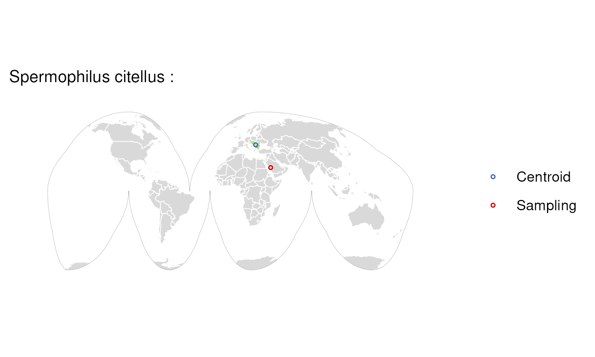

### Species: Spheniscus humboldti

**Biosample:**  
**Assembly Accession:** GCA\_027474245.1  
**Taxon:** Birds  
**Priority:** 4  
**Flags:** Outside Range;  

### Species: Stenella coeruleoalba

**Biosample:**  
**Assembly Accession:** GCA\_951394435.1  
**Taxon:** Mammals  
**Priority:** 4  
**Flags:** Outside Range;  

### Species: Strigops habroptilus

**Biosample:**  
**Assembly Accession:** GCA\_004027225.2  
**Taxon:** Birds  
**Priority:** 4  
**Flags:** Outside Range;  

### Species: Suncus etruscus

**Biosample:**  
**Assembly Accession:** GCA\_024139225.1  
**Taxon:** Mammals  
**Priority:** 4  
**Flags:** Outside Range;  

### Species: Symphorus nematophorus

**Biosample:**  
**Assembly Accession:** GCA\_048128725.1  
**Taxon:** Fishes  
**Priority:** 4  
**Flags:** Outside Range;  

### Species: Taeniopygia guttata

**Biosample:**  
**Assembly Accession:** GCA\_048771995.1  
**Taxon:** Birds  
**Priority:** 4  
**Flags:** Outside Range;  

### Species: Tetrao urogallus

**Biosample:**  
**Assembly Accession:** GCA\_951394365.1  
**Taxon:** Birds  
**Priority:** 4  
**Flags:** Outside Range;  

### Species: Thamnophis elegans

**Biosample:**  
**Assembly Accession:** GCA\_009769535.1  
**Taxon:** Reptiles  
**Priority:** 4  
**Flags:** Outside Range;  
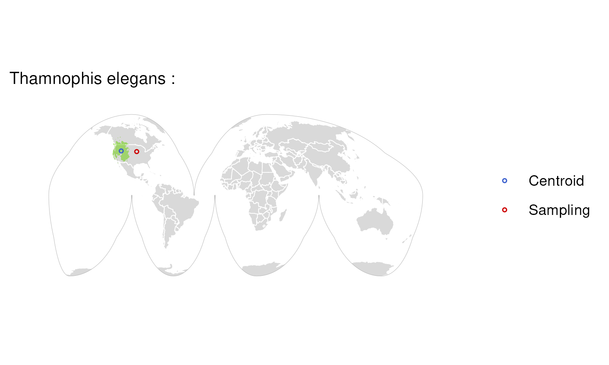

### Species: Thunnus albacares

**Biosample:**  
**Assembly Accession:** GCA\_914725855.1  
**Taxon:** Fishes  
**Priority:** 4  
**Flags:** Outside Range;  

### Species: Thunnus maccoyii

**Biosample:**  
**Assembly Accession:** GCA\_910596095.1  
**Taxon:** Fishes  
**Priority:** 4  
**Flags:** Outside Range;  

### Species: Thunnus thynnus

**Biosample:**  
**Assembly Accession:** GCA\_963924715.1  
**Taxon:** Fishes  
**Priority:** 4  
**Flags:** Outside Range;  

### Species: Toxotes jaculatrix

**Biosample:**  
**Assembly Accession:** GCA\_017976425.1  
**Taxon:** Fishes  
**Priority:** 4  
**Flags:** Outside Range;  

### Species: Trichosurus vulpecula

**Biosample:**  
**Assembly Accession:** GCA\_011100635.1  
**Taxon:** Mammals  
**Priority:** 4  
**Flags:** Outside Range;  

### Species: Xenentodon cancila

**Biosample:**  
**Assembly Accession:** GCA\_014839995.1  
**Taxon:** Fishes  
**Priority:** 4  
**Flags:** Outside Range;  

### Species: Xenopus petersii

**Biosample:**  
**Assembly Accession:** GCA\_038501925.1  
**Taxon:** Amphibians  
**Priority:** 4  
**Flags:** Outside Range;  

### Species: Zosterops lateralis

**Biosample:**  
**Assembly Accession:** GCA\_965231275.1  
**Taxon:** Birds  
**Priority:** 4  
**Flags:** Outside Range;  

### Species: Caesio teres

**Biosample:**  
**Assembly Accession:** GCA\_048129055.1  
**Taxon:** Fishes  
**Priority:** 5  
**Flags:** Vague Location;  

### Species: Dama dama

**Biosample:**  
**Assembly Accession:** GCA\_048126745.1  
**Taxon:** Mammals  
**Priority:** 5  
**Flags:** Vague Location;  

### Species: Hirundo rustica

**Biosample:**  
**Assembly Accession:** GCA\_015227805.3  
**Taxon:** Birds  
**Priority:** 5  
**Flags:** Vague Location;  

### Species: Notoryctes typhlops

**Biosample:**  
**Assembly Accession:** GCA\_048126345.1  
**Taxon:** Mammals  
**Priority:** 5  
**Flags:** Vague Location;  

### Species: Abramis brama

**Biosample:**  
**Assembly Accession:** GCA\_963993115.1  
**Taxon:** Fishes  
**Priority:** 6  
**Flags:**  

### Species: Acanthisitta chloris

**Biosample:**  
**Assembly Accession:** GCA\_016904835.1  
**Taxon:** Birds  
**Priority:** 6  
**Flags:**  

### Species: Acanthopagrus schlegelii

**Biosample:**  
**Assembly Accession:** GCA\_041753875.1  
**Taxon:** Fishes  
**Priority:** 6  
**Flags:**  

### Species: Accipiter gentilis

**Biosample:**  
**Assembly Accession:** GCA\_929443795.1  
**Taxon:** Birds  
**Priority:** 6  
**Flags:**  

### Species: Aegotheles albertisi

**Biosample:**  
**Assembly Accession:** GCA\_039906565.1  
**Taxon:** Birds  
**Priority:** 6  
**Flags:**  

### Species: Agelaius phoeniceus

**Biosample:**  
**Assembly Accession:** GCA\_020745825.3  
**Taxon:** Birds  
**Priority:** 6  
**Flags:**  

### Species: Alligator mississippiensis

**Biosample:**  
**Assembly Accession:** GCA\_030867095.1  
**Taxon:** Reptiles  
**Priority:** 6  
**Flags:**  

### Species: Alosa sapidissima

**Biosample:**  
**Assembly Accession:** GCA\_018492685.1  
**Taxon:** Fishes  
**Priority:** 6  
**Flags:**  

### Species: Amazona ochrocephala

**Biosample:**  
**Assembly Accession:** GCA\_039720435.1  
**Taxon:** Birds  
**Priority:** 6  
**Flags:**  

### Species: Amblyopsis spelaea

**Biosample:**  
**Assembly Accession:** GCA\_046255685.1  
**Taxon:** Fishes  
**Priority:** 6  
**Flags:**  

### Species: Amblyraja radiata

**Biosample:**  
**Assembly Accession:** GCA\_010909765.2  
**Taxon:** Fishes  
**Priority:** 6  
**Flags:**  

### Species: Amia calva

**Biosample:**  
**Assembly Accession:** GCA\_036373705.1  
**Taxon:** Fishes  
**Priority:** 6  
**Flags:** Missing Range;  

### Species: Ammodytes marinus

**Biosample:**  
**Assembly Accession:** GCA\_949987685.1  
**Taxon:** Fishes  
**Priority:** 6  
**Flags:** Missing Range;  

### Species: Ammospiza maritima

**Biosample:**  
**Assembly Accession:** GCA\_036010785.1  
**Taxon:** Birds  
**Priority:** 6  
**Flags:**  

### Species: Ammospiza nelsoni

**Biosample:**  
**Assembly Accession:** GCA\_027579445.1  
**Taxon:** Birds  
**Priority:** 6  
**Flags:**  

### Species: Anableps anableps

**Biosample:**  
**Assembly Accession:** GCA\_014839685.1  
**Taxon:** Fishes  
**Priority:** 6  
**Flags:** Zoo Sample;  

### Species: Anas acuta

**Biosample:**  
**Assembly Accession:** GCA\_963932015.1  
**Taxon:** Birds  
**Priority:** 6  
**Flags:**  

### Species: Anas platyrhynchos

**Biosample:**  
**Assembly Accession:** GCA\_964188345.1  
**Taxon:** Birds  
**Priority:** 6  
**Flags:**  

### Species: Anguilla anguilla

**Biosample:**  
**Assembly Accession:** GCA\_013347855.1  
**Taxon:** Fishes  
**Priority:** 6  
**Flags:**  

### Species: Anolis sagrei

**Biosample:**  
**Assembly Accession:** GCA\_037176765.1  
**Taxon:** Reptiles  
**Priority:** 6  
**Flags:**  

### Species: Anomaloglossus baeobatrachus

**Biosample:**  
**Assembly Accession:** GCA\_048569485.1  
**Taxon:** Amphibians  
**Priority:** 6  
**Flags:**  

### Species: Anser anser

**Biosample:**  
**Assembly Accession:** GCA\_964211835.1  
**Taxon:** Birds  
**Priority:** 6  
**Flags:**  

### Species: Anser brachyrhynchus

**Biosample:**  
**Assembly Accession:** GCA\_964034855.1  
**Taxon:** Birds  
**Priority:** 6  
**Flags:**  

### Species: Aplidium turbinatum

**Biosample:**  
**Assembly Accession:** GCA\_918807975.1  
**Taxon:** Invertebrates  
**Priority:** 6  
**Flags:** Missing Range;  

### Species: Aplochiton taeniatus

**Biosample:**  
**Assembly Accession:** GCA\_017639675.1  
**Taxon:** Fishes  
**Priority:** 6  
**Flags:**  

### Species: Apodemus sylvaticus

**Biosample:**  
**Assembly Accession:** GCA\_947179515.1  
**Taxon:** Mammals  
**Priority:** 6  
**Flags:**  

### Species: Apteryx mantelli

**Biosample:**  
**Assembly Accession:** GCA\_036417845.1  
**Taxon:** Birds  
**Priority:** 6  
**Flags:** Zoo Sample;  

### Species: Apus apus

**Biosample:**  
**Assembly Accession:** GCA\_020740795.1  
**Taxon:** Birds  
**Priority:** 6  
**Flags:**  

### Species: Argentina silus

**Biosample:**  
**Assembly Accession:** GCA\_951799395.1  
**Taxon:** Fishes  
**Priority:** 6  
**Flags:** Missing Range;  

### Species: Arripis georgiana

**Biosample:**  
**Assembly Accession:** GCA\_042242135.1  
**Taxon:** Fishes  
**Priority:** 6  
**Flags:** Missing Range;  

### Species: Artibeus intermedius

**Biosample:**  
**Assembly Accession:** GCA\_038363145.1  
**Taxon:** Mammals  
**Priority:** 6  
**Flags:**  

### Species: Artibeus lituratus

**Biosample:**  
**Assembly Accession:** GCA\_038363095.2  
**Taxon:** Mammals  
**Priority:** 6  
**Flags:**  

### Species: Ascaphus truei

**Biosample:**  
**Assembly Accession:** GCA\_040206685.1  
**Taxon:** Amphibians  
**Priority:** 6  
**Flags:**  

### Species: Ascidia mentula

**Biosample:**  
**Assembly Accession:** GCA\_947561715.1  
**Taxon:** Invertebrates  
**Priority:** 6  
**Flags:** Missing Range;  

### Species: Ascidiella aspersa

**Biosample:**  
**Assembly Accession:** GCA\_963924565.1  
**Taxon:** Invertebrates  
**Priority:** 6  
**Flags:** Missing Range;  

### Species: Aselliscus stoliczkanus

**Biosample:**  
**Assembly Accession:** GCA\_043727835.1  
**Taxon:** Mammals  
**Priority:** 6  
**Flags:**  

### Species: Athene noctua

**Biosample:**  
**Assembly Accession:** GCA\_965140245.1  
**Taxon:** Birds  
**Priority:** 6  
**Flags:**  

### Species: Aulostomus maculatus

**Biosample:**  
**Assembly Accession:** GCA\_048301465.1  
**Taxon:** Fishes  
**Priority:** 6  
**Flags:**  

### Species: Aythya ferina

**Biosample:**  
**Assembly Accession:** GCA\_964211825.1  
**Taxon:** Birds  
**Priority:** 6  
**Flags:**  

### Species: Aythya fuligula

**Biosample:**  
**Assembly Accession:** GCA\_009819795.1  
**Taxon:** Birds  
**Priority:** 6  
**Flags:**  

### Species: Aythya marila

**Biosample:**  
**Assembly Accession:** GCA\_965140915.1  
**Taxon:** Birds  
**Priority:** 6  
**Flags:**  

### Species: Balaenoptera acutorostrata

**Biosample:**  
**Assembly Accession:** GCA\_949987535.1  
**Taxon:** Mammals  
**Priority:** 6  
**Flags:**  

### Species: Balaenoptera borealis

**Biosample:**  
**Assembly Accession:** GCA\_965194805.1  
**Taxon:** Mammals  
**Priority:** 6  
**Flags:**  

### Species: Balaenoptera musculus

**Biosample:**  
**Assembly Accession:** GCA\_009873245.3  
**Taxon:** Mammals  
**Priority:** 6  
**Flags:**  

### Species: Balaenoptera physalus

**Biosample:**  
**Assembly Accession:** GCA\_965194825.1  
**Taxon:** Mammals  
**Priority:** 6  
**Flags:**  

### Species: Balanoglossus misakiensis

**Biosample:**  
**Assembly Accession:** GCA\_040954625.2  
**Taxon:** Invertebrates  
**Priority:** 6  
**Flags:** Missing Range;  

### Species: Balearica regulorum gibbericeps

**Biosample:**  
**Assembly Accession:** GCA\_011004875.1  
**Taxon:** Birds  
**Priority:** 6  
**Flags:** Zoo Sample; Missing Range;  

### Species: Barbatula barbatula

**Biosample:**  
**Assembly Accession:** GCA\_947034865.1  
**Taxon:** Fishes  
**Priority:** 6  
**Flags:**  

### Species: Barbus barbus

**Biosample:**  
**Assembly Accession:** GCA\_936440315.1  
**Taxon:** Fishes  
**Priority:** 6  
**Flags:**  

### Species: Bombina bombina

**Biosample:**  
**Assembly Accession:** GCA\_027579735.1  
**Taxon:** Amphibians  
**Priority:** 6  
**Flags:**  

### Species: Bradypodion pumilum

**Biosample:**  
**Assembly Accession:** GCA\_047715975.1  
**Taxon:** Reptiles  
**Priority:** 6  
**Flags:**  

### Species: Branchiostoma lanceolatum

**Biosample:**  
**Assembly Accession:** GCA\_035083965.1  
**Taxon:** Invertebrates  
**Priority:** 6  
**Flags:** Missing Range;  

### Species: Branta canadensis

**Biosample:**  
**Assembly Accession:** GCA\_965231335.1  
**Taxon:** Birds  
**Priority:** 6  
**Flags:**  

### Species: Bucephala clangula

**Biosample:**  
**Assembly Accession:** GCA\_964059595.1  
**Taxon:** Birds  
**Priority:** 6  
**Flags:**  

### Species: Bucorvus abyssinicus

**Biosample:**  
**Assembly Accession:** GCA\_009769605.1  
**Taxon:** Birds  
**Priority:** 6  
**Flags:** Zoo Sample;  

### Species: Bufo bufo

**Biosample:**  
**Assembly Accession:** GCA\_905171765.1  
**Taxon:** Amphibians  
**Priority:** 6  
**Flags:**  

### Species: Buteo buteo

**Biosample:**  
**Assembly Accession:** GCA\_964188355.1  
**Taxon:** Birds  
**Priority:** 6  
**Flags:**  

### Species: Callospermophilus lateralis

**Biosample:**  
**Assembly Accession:** GCA\_048772815.1  
**Taxon:** Mammals  
**Priority:** 6  
**Flags:**  

### Species: Caloenas nicobarica

**Biosample:**  
**Assembly Accession:** GCA\_036013445.1  
**Taxon:** Birds  
**Priority:** 6  
**Flags:** Zoo Sample;  

### Species: Caprimulgus europaeus

**Biosample:**  
**Assembly Accession:** GCA\_907165065.1  
**Taxon:** Birds  
**Priority:** 6  
**Flags:**  

### Species: Carassius carassius

**Biosample:**  
**Assembly Accession:** GCA\_963082965.1  
**Taxon:** Fishes  
**Priority:** 6  
**Flags:**  

### Species: Carcharodon carcharias

**Biosample:**  
**Assembly Accession:** GCA\_017639515.1  
**Taxon:** Fishes  
**Priority:** 6  
**Flags:**  

### Species: Caretta caretta

**Biosample:**  
**Assembly Accession:** GCA\_965140235.1  
**Taxon:** Reptiles  
**Priority:** 6  
**Flags:**  
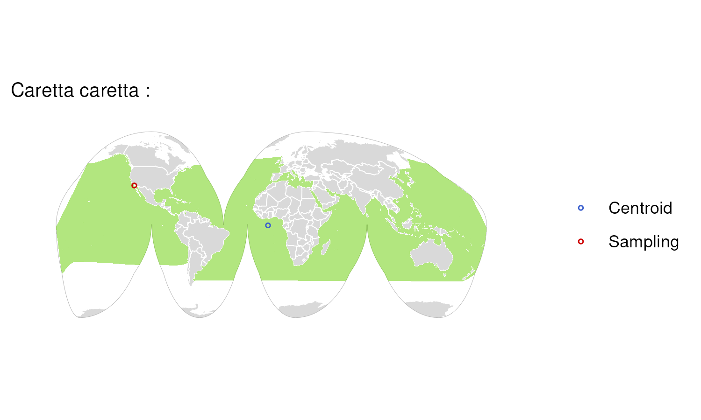

### Species: Cariama cristata

**Biosample:**  
**Assembly Accession:** GCA\_009819825.1  
**Taxon:** Birds  
**Priority:** 6  
**Flags:** Zoo Sample;  

### Species: Castor canadensis

**Biosample:**  
**Assembly Accession:** GCA\_047511655.1  
**Taxon:** Mammals  
**Priority:** 6  
**Flags:**  

### Species: Catharus ustulatus

**Biosample:**  
**Assembly Accession:** GCA\_009819885.2  
**Taxon:** Birds  
**Priority:** 6  
**Flags:**  

### Species: Centroberyx gerrardi

**Biosample:**  
**Assembly Accession:** GCA\_048128805.1  
**Taxon:** Fishes  
**Priority:** 6  
**Flags:** Missing Range;  

### Species: Cervus elaphus

**Biosample:**  
**Assembly Accession:** GCA\_910594005.1  
**Taxon:** Mammals  
**Priority:** 6  
**Flags:**  

### Species: Cetorhinus maximus

**Biosample:**  
**Assembly Accession:** GCA\_964194155.1  
**Taxon:** Fishes  
**Priority:** 6  
**Flags:**  

### Species: Chaetodon trifascialis

**Biosample:**  
**Assembly Accession:** GCA\_039877785.1  
**Taxon:** Fishes  
**Priority:** 6  
**Flags:**  

### Species: Chelmon rostratus

**Biosample:**  
**Assembly Accession:** GCA\_017976325.1  
**Taxon:** Fishes  
**Priority:** 6  
**Flags:**  

### Species: Chelon labrosus

**Biosample:**  
**Assembly Accession:** GCA\_963514085.1  
**Taxon:** Fishes  
**Priority:** 6  
**Flags:**  

### Species: Chelonia mydas

**Biosample:**  
**Assembly Accession:** GCA\_015237465.2  
**Taxon:** Reptiles  
**Priority:** 6  
**Flags:**  

### Species: Chiroxiphia lanceolata

**Biosample:**  
**Assembly Accession:** GCA\_009829145.1  
**Taxon:** Birds  
**Priority:** 6  
**Flags:**  

### Species: Chlamydotis macqueenii

**Biosample:**  
**Assembly Accession:** GCA\_036417535.1  
**Taxon:** Birds  
**Priority:** 6  
**Flags:**  

### Species: Choerodon schoenleinii

**Biosample:**  
**Assembly Accession:** GCA\_047301625.1  
**Taxon:** Fishes  
**Priority:** 6  
**Flags:** Missing Range;  

### Species: Ciconia maguari

**Biosample:**  
**Assembly Accession:** GCA\_017639555.1  
**Taxon:** Birds  
**Priority:** 6  
**Flags:**  

### Species: Cinclus cinclus

**Biosample:**  
**Assembly Accession:** GCA\_963662255.1  
**Taxon:** Birds  
**Priority:** 6  
**Flags:**  

### Species: Clangula hyemalis

**Biosample:**  
**Assembly Accession:** GCA\_963989345.1  
**Taxon:** Birds  
**Priority:** 6  
**Flags:**  

### Species: Clavelina lepadiformis

**Biosample:**  
**Assembly Accession:** GCA\_947623445.1  
**Taxon:** Invertebrates  
**Priority:** 6  
**Flags:** Missing Range;  

### Species: Coilia mystus

**Biosample:**  
**Assembly Accession:** GCA\_048544225.1  
**Taxon:** Fishes  
**Priority:** 6  
**Flags:**  

### Species: Colius striatus

**Biosample:**  
**Assembly Accession:** GCA\_028858725.2  
**Taxon:** Birds  
**Priority:** 6  
**Flags:** Zoo Sample;  

### Species: Conger conger

**Biosample:**  
**Assembly Accession:** GCA\_963514075.1  
**Taxon:** Fishes  
**Priority:** 6  
**Flags:**  

### Species: Corella eumyota

**Biosample:**  
**Assembly Accession:** GCA\_963082875.1  
**Taxon:** Invertebrates  
**Priority:** 6  
**Flags:** Missing Range;  

### Species: Corvus moneduloides

**Biosample:**  
**Assembly Accession:** GCA\_009650955.1  
**Taxon:** Birds  
**Priority:** 6  
**Flags:**  

### Species: Corynorhinus townsendii

**Biosample:**  
**Assembly Accession:** GCA\_026230055.1  
**Taxon:** Mammals  
**Priority:** 6  
**Flags:**  

### Species: Ctenodactylus gundi

**Biosample:**  
**Assembly Accession:** GCA\_048771875.1  
**Taxon:** Mammals  
**Priority:** 6  
**Flags:**  

### Species: Cuculus canorus

**Biosample:**  
**Assembly Accession:** GCA\_017976375.1  
**Taxon:** Birds  
**Priority:** 6  
**Flags:**  

### Species: Cyanocitta cristata

**Biosample:**  
**Assembly Accession:** GCA\_046129655.1  
**Taxon:** Birds  
**Priority:** 6  
**Flags:**  

### Species: Cyclopterus lumpus

**Biosample:**  
**Assembly Accession:** GCA\_009769545.1  
**Taxon:** Fishes  
**Priority:** 6  
**Flags:** Missing Range;  

### Species: Cyclura pinguis

**Biosample:**  
**Assembly Accession:** GCA\_030412105.1  
**Taxon:** Reptiles  
**Priority:** 6  
**Flags:** Zoo Sample;  

### Species: Cygnus columbianus

**Biosample:**  
**Assembly Accession:** GCA\_965151615.1  
**Taxon:** Birds  
**Priority:** 6  
**Flags:**  

### Species: Cygnus olor

**Biosample:**  
**Assembly Accession:** GCA\_009769625.2  
**Taxon:** Birds  
**Priority:** 6  
**Flags:**  

### Species: Cynocephalus volans

**Biosample:**  
**Assembly Accession:** GCA\_027409185.1  
**Taxon:** Mammals  
**Priority:** 6  
**Flags:**  

### Species: Cyprinella venusta

**Biosample:**  
**Assembly Accession:** GCA\_038024135.1  
**Taxon:** Fishes  
**Priority:** 6  
**Flags:**  

### Species: Danio rerio

**Biosample:**  
**Assembly Accession:** GCA\_944039275.1  
**Taxon:** Fishes  
**Priority:** 6  
**Flags:** Missing Range;  

### Species: Dasypus novemcinctus

**Biosample:**  
**Assembly Accession:** GCA\_030445035.2  
**Taxon:** Mammals  
**Priority:** 6  
**Flags:**  

### Species: Delphinus delphis

**Biosample:**  
**Assembly Accession:** GCA\_949987515.2  
**Taxon:** Mammals  
**Priority:** 6  
**Flags:**  

### Species: Dermochelys coriacea

**Biosample:**  
**Assembly Accession:** GCA\_009764565.4  
**Taxon:** Reptiles  
**Priority:** 6  
**Flags:**  

### Species: Desmodus rotundus

**Biosample:**  
**Assembly Accession:** GCA\_022682495.2  
**Taxon:** Mammals  
**Priority:** 6  
**Flags:**  

### Species: Diretmus argenteus

**Biosample:**  
**Assembly Accession:** GCA\_048569125.1  
**Taxon:** Fishes  
**Priority:** 6  
**Flags:**  

### Species: Discoglossus pictus

**Biosample:**  
**Assembly Accession:** GCA\_027410445.1  
**Taxon:** Amphibians  
**Priority:** 6  
**Flags:**  

### Species: Doryrhina cyclops

**Biosample:**  
**Assembly Accession:** GCA\_043880285.1  
**Taxon:** Mammals  
**Priority:** 6  
**Flags:**  

### Species: Dromaius novaehollandiae

**Biosample:**  
**Assembly Accession:** GCA\_036370855.1  
**Taxon:** Birds  
**Priority:** 6  
**Flags:** Zoo Sample;  

### Species: Dromiciops gliroides

**Biosample:**  
**Assembly Accession:** GCA\_019393635.1  
**Taxon:** Mammals  
**Priority:** 6  
**Flags:**  

### Species: Dryobates pubescens

**Biosample:**  
**Assembly Accession:** GCA\_014839835.1  
**Taxon:** Birds  
**Priority:** 6  
**Flags:**  

### Species: Dugong dugon

**Biosample:**  
**Assembly Accession:** GCA\_030035585.1  
**Taxon:** Mammals  
**Priority:** 6  
**Flags:**  

### Species: Echiichthys vipera

**Biosample:**  
**Assembly Accession:** GCA\_963691815.1  
**Taxon:** Fishes  
**Priority:** 6  
**Flags:** Missing Range;  

### Species: Electrona antarctica

**Biosample:**  
**Assembly Accession:** GCA\_951216825.1  
**Taxon:** Fishes  
**Priority:** 6  
**Flags:**  

### Species: Elephas maximus indicus

**Biosample:**  
**Assembly Accession:** GCA\_024166365.1  
**Taxon:** Mammals  
**Priority:** 6  
**Flags:** Zoo Sample;  

### Species: Eleutherodactylus coqui

**Biosample:**  
**Assembly Accession:** GCA\_035609145.1  
**Taxon:** Amphibians  
**Priority:** 6  
**Flags:**  

### Species: Emys orbicularis

**Biosample:**  
**Assembly Accession:** GCA\_028017835.1  
**Taxon:** Reptiles  
**Priority:** 6  
**Flags:** Missing Range;  

### Species: Eptesicus fuscus

**Biosample:**  
**Assembly Accession:** GCA\_027574615.1  
**Taxon:** Mammals  
**Priority:** 6  
**Flags:**  

### Species: Eptesicus nilssonii

**Biosample:**  
**Assembly Accession:** GCA\_951640355.1  
**Taxon:** Mammals  
**Priority:** 6  
**Flags:**  

### Species: Erethizon dorsatum

**Biosample:**  
**Assembly Accession:** GCA\_028451465.1  
**Taxon:** Mammals  
**Priority:** 6  
**Flags:**  

### Species: Eretmochelys imbricata

**Biosample:**  
**Assembly Accession:** GCA\_965152235.1  
**Taxon:** Reptiles  
**Priority:** 6  
**Flags:**  

### Species: Erinaceus europaeus

**Biosample:**  
**Assembly Accession:** GCA\_950295315.1  
**Taxon:** Mammals  
**Priority:** 6  
**Flags:**  

### Species: Erythrolamprus reginae

**Biosample:**  
**Assembly Accession:** GCA\_031021105.1  
**Taxon:** Reptiles  
**Priority:** 6  
**Flags:**  

### Species: Eschrichtius robustus

**Biosample:**  
**Assembly Accession:** GCA\_028021215.1  
**Taxon:** Mammals  
**Priority:** 6  
**Flags:**  

### Species: Esox lucius

**Biosample:**  
**Assembly Accession:** GCA\_011004845.1  
**Taxon:** Fishes  
**Priority:** 6  
**Flags:**  

### Species: Eudromia elegans

**Biosample:**  
**Assembly Accession:** GCA\_047922985.1  
**Taxon:** Birds  
**Priority:** 6  
**Flags:** Zoo Sample;  

### Species: Euleptes europaea

**Biosample:**  
**Assembly Accession:** GCA\_029931775.1  
**Taxon:** Reptiles  
**Priority:** 6  
**Flags:**  

### Species: Eutrigla gurnardus

**Biosample:**  
**Assembly Accession:** GCA\_963514095.1  
**Taxon:** Fishes  
**Priority:** 6  
**Flags:** Missing Range;  

### Species: Falco cherrug

**Biosample:**  
**Assembly Accession:** GCA\_023634085.1  
**Taxon:** Birds  
**Priority:** 6  
**Flags:**  

### Species: Falco naumanni

**Biosample:**  
**Assembly Accession:** GCA\_017639655.1  
**Taxon:** Birds  
**Priority:** 6  
**Flags:**  

### Species: Falco peregrinus

**Biosample:**  
**Assembly Accession:** GCA\_023634155.1  
**Taxon:** Birds  
**Priority:** 6  
**Flags:**  

### Species: Fringilla coelebs

**Biosample:**  
**Assembly Accession:** GCA\_963513975.1  
**Taxon:** Birds  
**Priority:** 6  
**Flags:**  

### Species: Fundulus diaphanus

**Biosample:**  
**Assembly Accession:** GCA\_037039145.1  
**Taxon:** Fishes  
**Priority:** 6  
**Flags:** Missing Range;  

### Species: Gallinula chloropus

**Biosample:**  
**Assembly Accession:** GCA\_964237585.1  
**Taxon:** Birds  
**Priority:** 6  
**Flags:**  

### Species: Gasterosteus aculeatus

**Biosample:**  
**Assembly Accession:** GCA\_964276395.1  
**Taxon:** Fishes  
**Priority:** 6  
**Flags:**  

### Species: Gastrophryne carolinensis

**Biosample:**  
**Assembly Accession:** GCA\_027917425.1  
**Taxon:** Amphibians  
**Priority:** 6  
**Flags:**  

### Species: Gavialis gangeticus

**Biosample:**  
**Assembly Accession:** GCA\_030020295.1  
**Taxon:** Reptiles  
**Priority:** 6  
**Flags:** Zoo Sample;  

### Species: Geothlypis trichas

**Biosample:**  
**Assembly Accession:** GCA\_009764595.1  
**Taxon:** Birds  
**Priority:** 6  
**Flags:**  

### Species: Globicephala melas

**Biosample:**  
**Assembly Accession:** GCA\_963455315.2  
**Taxon:** Mammals  
**Priority:** 6  
**Flags:**  

### Species: Gobio gobio

**Biosample:**  
**Assembly Accession:** GCA\_949357685.1  
**Taxon:** Fishes  
**Priority:** 6  
**Flags:**  

### Species: Gobius niger

**Biosample:**  
**Assembly Accession:** GCA\_951799975.1  
**Taxon:** Fishes  
**Priority:** 6  
**Flags:**  

### Species: Grampus griseus

**Biosample:**  
**Assembly Accession:** GCA\_964374135.1  
**Taxon:** Mammals  
**Priority:** 6  
**Flags:**  

### Species: Grus americana

**Biosample:**  
**Assembly Accession:** GCA\_028858705.1  
**Taxon:** Birds  
**Priority:** 6  
**Flags:**  

### Species: Gulosus aristotelis

**Biosample:**  
**Assembly Accession:** GCA\_949628215.1  
**Taxon:** Birds  
**Priority:** 6  
**Flags:**  

### Species: Gymnoscopelus braueri

**Biosample:**  
**Assembly Accession:** GCA\_963280865.1  
**Taxon:** Fishes  
**Priority:** 6  
**Flags:**  

### Species: Gypaetus barbatus

**Biosample:**  
**Assembly Accession:** GCA\_028022735.1  
**Taxon:** Birds  
**Priority:** 6  
**Flags:**  

### Species: Haemorhous mexicanus

**Biosample:**  
**Assembly Accession:** GCA\_027477595.1  
**Taxon:** Birds  
**Priority:** 6  
**Flags:**  

### Species: Halichoerus grypus

**Biosample:**  
**Assembly Accession:** GCA\_964656455.1  
**Taxon:** Mammals  
**Priority:** 6  
**Flags:**  

### Species: Harpia harpyja

**Biosample:**  
**Assembly Accession:** GCA\_026419915.1  
**Taxon:** Birds  
**Priority:** 6  
**Flags:**  

### Species: Heliangelus exortis

**Biosample:**  
**Assembly Accession:** GCA\_036169615.1  
**Taxon:** Birds  
**Priority:** 6  
**Flags:**  

### Species: Hemiprocne comata

**Biosample:**  
**Assembly Accession:** GCA\_020745705.1  
**Taxon:** Birds  
**Priority:** 6  
**Flags:**  

### Species: Heterodontus francisci

**Biosample:**  
**Assembly Accession:** GCA\_036365525.1  
**Taxon:** Fishes  
**Priority:** 6  
**Flags:**  

### Species: Heterohyrax brucei

**Biosample:**  
**Assembly Accession:** GCA\_028571685.1  
**Taxon:** Mammals  
**Priority:** 6  
**Flags:** Zoo Sample;  

### Species: Hippoglossus hippoglossus

**Biosample:**  
**Assembly Accession:** GCA\_009819705.1  
**Taxon:** Fishes  
**Priority:** 6  
**Flags:**  

### Species: Hippopotamus amphibius

**Biosample:**  
**Assembly Accession:** GCA\_030028045.1  
**Taxon:** Mammals  
**Priority:** 6  
**Flags:** Zoo Sample;  

### Species: Hipposideros larvatus

**Biosample:**  
**Assembly Accession:** GCA\_031876335.1  
**Taxon:** Mammals  
**Priority:** 6  
**Flags:**  

### Species: Hoplias malabaricus

**Biosample:**  
**Assembly Accession:** GCA\_029633855.2  
**Taxon:** Fishes  
**Priority:** 6  
**Flags:**  

### Species: Hydrolagus colliei

**Biosample:**  
**Assembly Accession:** GCA\_035084275.1  
**Taxon:** Fishes  
**Priority:** 6  
**Flags:**  

### Species: Hyla sarda

**Biosample:**  
**Assembly Accession:** GCA\_029499605.1  
**Taxon:** Amphibians  
**Priority:** 6  
**Flags:**  

### Species: Hypanus sabinus

**Biosample:**  
**Assembly Accession:** GCA\_030144855.1  
**Taxon:** Fishes  
**Priority:** 6  
**Flags:**  

### Species: Hyperoplus immaculatus

**Biosample:**  
**Assembly Accession:** GCA\_949357725.1  
**Taxon:** Fishes  
**Priority:** 6  
**Flags:** Missing Range;  

### Species: Inia geoffrensis

**Biosample:**  
**Assembly Accession:** GCA\_036417435.1  
**Taxon:** Mammals  
**Priority:** 6  
**Flags:**  

### Species: Kogia breviceps

**Biosample:**  
**Assembly Accession:** GCA\_026419965.1  
**Taxon:** Mammals  
**Priority:** 6  
**Flags:**  

### Species: Labrus bergylta

**Biosample:**  
**Assembly Accession:** GCA\_963930695.1  
**Taxon:** Fishes  
**Priority:** 6  
**Flags:**  

### Species: Labrus mixtus

**Biosample:**  
**Assembly Accession:** GCA\_963584025.1  
**Taxon:** Fishes  
**Priority:** 6  
**Flags:**  

### Species: Lacerta agilis

**Biosample:**  
**Assembly Accession:** GCA\_009819535.1  
**Taxon:** Reptiles  
**Priority:** 6  
**Flags:**  

### Species: Lagenorhynchus acutus

**Biosample:**  
**Assembly Accession:** GCA\_964270905.1  
**Taxon:** Mammals  
**Priority:** 6  
**Flags:**  

### Species: Lagenorhynchus albirostris

**Biosample:**  
**Assembly Accession:** GCA\_949774975.1  
**Taxon:** Mammals  
**Priority:** 6  
**Flags:**  

### Species: Lagopus muta

**Biosample:**  
**Assembly Accession:** GCA\_023343835.1  
**Taxon:** Birds  
**Priority:** 6  
**Flags:**  

### Species: Lampetra fluviatilis

**Biosample:**  
**Assembly Accession:** GCA\_964198595.1  
**Taxon:** Fishes  
**Priority:** 6  
**Flags:**  

### Species: Lampris incognitus

**Biosample:**  
**Assembly Accession:** GCA\_029633865.1  
**Taxon:** Fishes  
**Priority:** 6  
**Flags:** Missing Range;  

### Species: Larus argentatus

**Biosample:**  
**Assembly Accession:** GCA\_964417175.1  
**Taxon:** Birds  
**Priority:** 6  
**Flags:**  

### Species: Larus fuscus

**Biosample:**  
**Assembly Accession:** GCA\_963932225.1  
**Taxon:** Birds  
**Priority:** 6  
**Flags:**  

### Species: Larus michahellis

**Biosample:**  
**Assembly Accession:** GCA\_964199755.1  
**Taxon:** Birds  
**Priority:** 6  
**Flags:**  

### Species: Latimeria chalumnae

**Biosample:**  
**Assembly Accession:** GCA\_037176945.1  
**Taxon:** Fishes  
**Priority:** 6  
**Flags:** Missing Range;  

### Species: Lemur catta

**Biosample:**  
**Assembly Accession:** GCA\_020740605.1  
**Taxon:** Mammals  
**Priority:** 6  
**Flags:** Zoo Sample;  

### Species: Lepidochelys kempii

**Biosample:**  
**Assembly Accession:** GCA\_965140285.1  
**Taxon:** Reptiles  
**Priority:** 6  
**Flags:**  

### Species: Lepidochelys olivacea

**Biosample:**  
**Assembly Accession:** GCA\_965140295.1  
**Taxon:** Reptiles  
**Priority:** 6  
**Flags:**  

### Species: Lepisosteus oculatus

**Biosample:**  
**Assembly Accession:** GCA\_040954835.1  
**Taxon:** Fishes  
**Priority:** 6  
**Flags:**  

### Species: Leptodactylus fuscus

**Biosample:**  
**Assembly Accession:** GCA\_031893055.1  
**Taxon:** Amphibians  
**Priority:** 6  
**Flags:**  

### Species: Leuciscus leuciscus

**Biosample:**  
**Assembly Accession:** GCA\_965113295.1  
**Taxon:** Fishes  
**Priority:** 6  
**Flags:**  

### Species: Liasis olivaceus

**Biosample:**  
**Assembly Accession:** GCA\_030867105.1  
**Taxon:** Reptiles  
**Priority:** 6  
**Flags:** Zoo Sample;  

### Species: Limanda limanda

**Biosample:**  
**Assembly Accession:** GCA\_963576545.1  
**Taxon:** Fishes  
**Priority:** 6  
**Flags:**  

### Species: Lipophrys pholis

**Biosample:**  
**Assembly Accession:** GCA\_963383615.1  
**Taxon:** Fishes  
**Priority:** 6  
**Flags:**  

### Species: Lissotriton helveticus

**Biosample:**  
**Assembly Accession:** GCA\_964261635.1  
**Taxon:** Amphibians  
**Priority:** 6  
**Flags:**  

### Species: Lissotriton vulgaris

**Biosample:**  
**Assembly Accession:** GCA\_964263255.1  
**Taxon:** Amphibians  
**Priority:** 6  
**Flags:**  

### Species: Loxodonta africana

**Biosample:**  
**Assembly Accession:** GCA\_030014295.1  
**Taxon:** Mammals  
**Priority:** 6  
**Flags:** Zoo Sample;  

### Species: Lycodopsis pacificus

**Biosample:**  
**Assembly Accession:** GCA\_028022725.1  
**Taxon:** Fishes  
**Priority:** 6  
**Flags:** Missing Range;  

### Species: Macrochelys suwanniensis

**Biosample:**  
**Assembly Accession:** GCA\_033349115.1  
**Taxon:** Reptiles  
**Priority:** 6  
**Flags:**  

### Species: Macrotis lagotis

**Biosample:**  
**Assembly Accession:** GCA\_037893015.1  
**Taxon:** Mammals  
**Priority:** 6  
**Flags:** Zoo Sample;  

### Species: Malaclemys terrapin

**Biosample:**  
**Assembly Accession:** GCA\_027887155.1  
**Taxon:** Reptiles  
**Priority:** 6  
**Flags:**  

### Species: Manis pentadactyla

**Biosample:**  
**Assembly Accession:** GCA\_030020395.1  
**Taxon:** Mammals  
**Priority:** 6  
**Flags:** Zoo Sample;  
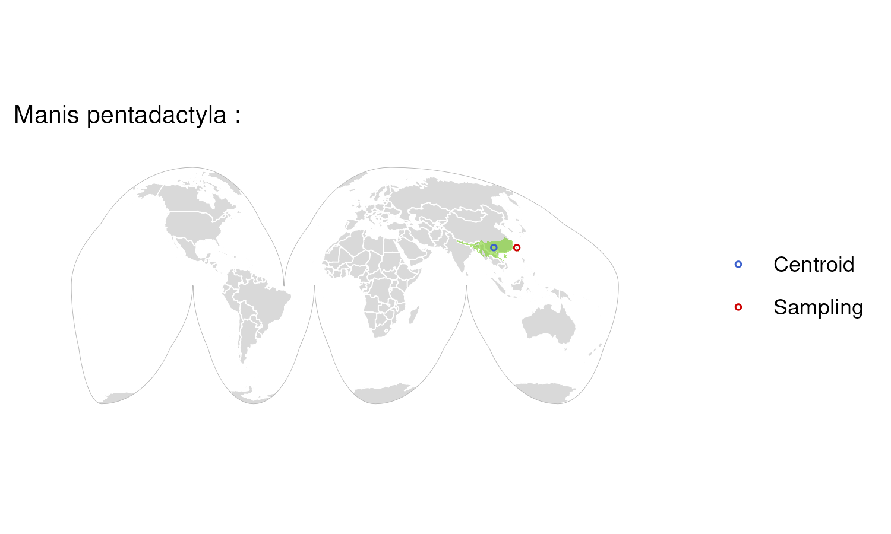

### Species: Marmota flaviventris

**Biosample:**  
**Assembly Accession:** GCA\_047511675.1  
**Taxon:** Mammals  
**Priority:** 6  
**Flags:**  

### Species: Martes martes

**Biosample:**  
**Assembly Accession:** GCA\_963455335.1  
**Taxon:** Mammals  
**Priority:** 6  
**Flags:**  

### Species: Megalops cyprinoides

**Biosample:**  
**Assembly Accession:** GCA\_013368585.1  
**Taxon:** Fishes  
**Priority:** 6  
**Flags:**  

### Species: Megaptera novaeangliae

**Biosample:**  
**Assembly Accession:** GCA\_041834305.1  
**Taxon:** Mammals  
**Priority:** 6  
**Flags:**  

### Species: Melanostigma gelatinosum

**Biosample:**  
**Assembly Accession:** GCA\_949748355.1  
**Taxon:** Fishes  
**Priority:** 6  
**Flags:** Missing Range;  

### Species: Meles meles

**Biosample:**  
**Assembly Accession:** GCA\_922984935.2  
**Taxon:** Mammals  
**Priority:** 6  
**Flags:**  

### Species: Melospiza georgiana

**Biosample:**  
**Assembly Accession:** GCA\_028018845.1  
**Taxon:** Birds  
**Priority:** 6  
**Flags:**  

### Species: Melospiza melodia

**Biosample:**  
**Assembly Accession:** GCA\_035770615.1  
**Taxon:** Birds  
**Priority:** 6  
**Flags:**  

### Species: Menidia menidia

**Biosample:**  
**Assembly Accession:** GCA\_048628825.1  
**Taxon:** Fishes  
**Priority:** 6  
**Flags:**  

### Species: Mergus octosetaceus

**Biosample:**  
**Assembly Accession:** GCA\_036873955.1  
**Taxon:** Birds  
**Priority:** 6  
**Flags:**  

### Species: Merops nubicus

**Biosample:**  
**Assembly Accession:** GCA\_009819595.1  
**Taxon:** Birds  
**Priority:** 6  
**Flags:** Zoo Sample;  

### Species: Mesoplodon densirostris

**Biosample:**  
**Assembly Accession:** GCA\_025265405.1  
**Taxon:** Mammals  
**Priority:** 6  
**Flags:**  

### Species: Microchirus variegatus

**Biosample:**  
**Assembly Accession:** GCA\_963457635.1  
**Taxon:** Fishes  
**Priority:** 6  
**Flags:**  

### Species: Micromesistius poutassou

**Biosample:**  
**Assembly Accession:** GCA\_964030765.1  
**Taxon:** Fishes  
**Priority:** 6  
**Flags:** Missing Range;  

### Species: Micromys minutus

**Biosample:**  
**Assembly Accession:** GCA\_963924665.1  
**Taxon:** Mammals  
**Priority:** 6  
**Flags:**  

### Species: Microstomus kitt

**Biosample:**  
**Assembly Accession:** GCA\_964266715.1  
**Taxon:** Fishes  
**Priority:** 6  
**Flags:**  

### Species: Microtus pennsylvanicus

**Biosample:**  
**Assembly Accession:** GCA\_037038515.1  
**Taxon:** Mammals  
**Priority:** 6  
**Flags:**  
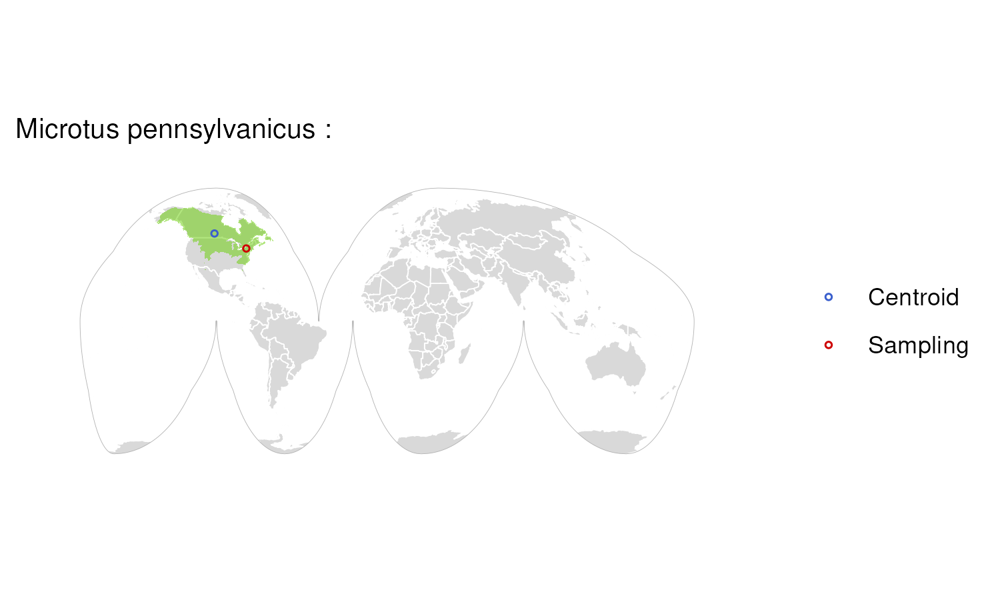

### Species: Miniopterus schreibersii

**Biosample:**  
**Assembly Accession:** GCA\_964146895.2  
**Taxon:** Mammals  
**Priority:** 6  
**Flags:**  

### Species: Mobula birostris

**Biosample:**  
**Assembly Accession:** GCA\_030028105.1  
**Taxon:** Fishes  
**Priority:** 6  
**Flags:**  

### Species: Molossus molossus

**Biosample:**  
**Assembly Accession:** GCA\_014108415.1  
**Taxon:** Mammals  
**Priority:** 6  
**Flags:**  

### Species: Morphnus guianensis

**Biosample:**  
**Assembly Accession:** GCA\_045345515.1  
**Taxon:** Birds  
**Priority:** 6  
**Flags:**  

### Species: Morus bassanus

**Biosample:**  
**Assembly Accession:** GCA\_031468815.1  
**Taxon:** Birds  
**Priority:** 6  
**Flags:** Zoo Sample;  

### Species: Muntiacus reevesi

**Biosample:**  
**Assembly Accession:** GCA\_963930625.1  
**Taxon:** Mammals  
**Priority:** 6  
**Flags:**  

### Species: Mus musculus

**Biosample:**  
**Assembly Accession:** GCA\_949316315.1  
**Taxon:** Mammals  
**Priority:** 6  
**Flags:**  

### Species: Muscardinus avellanarius

**Biosample:**  
**Assembly Accession:** GCA\_963383645.1  
**Taxon:** Mammals  
**Priority:** 6  
**Flags:**  

### Species: Mustela erminea

**Biosample:**  
**Assembly Accession:** GCA\_009829155.1  
**Taxon:** Mammals  
**Priority:** 6  
**Flags:**  

### Species: Mustela lutreola

**Biosample:**  
**Assembly Accession:** GCA\_030435805.1  
**Taxon:** Mammals  
**Priority:** 6  
**Flags:**  

### Species: Mustelus asterias

**Biosample:**  
**Assembly Accession:** GCA\_964213995.1  
**Taxon:** Fishes  
**Priority:** 6  
**Flags:**  

### Species: Myotis daubentonii

**Biosample:**  
**Assembly Accession:** GCA\_963259705.1  
**Taxon:** Mammals  
**Priority:** 6  
**Flags:**  

### Species: Myotis emarginatus

**Biosample:**  
**Assembly Accession:** GCA\_965115925.1  
**Taxon:** Mammals  
**Priority:** 6  
**Flags:** Zoo Sample;  

### Species: Myotis myotis

**Biosample:**  
**Assembly Accession:** GCA\_014108235.1  
**Taxon:** Mammals  
**Priority:** 6  
**Flags:**  

### Species: Myotis mystacinus

**Biosample:**  
**Assembly Accession:** GCA\_964094495.2  
**Taxon:** Mammals  
**Priority:** 6  
**Flags:**  

### Species: Myotis nattereri

**Biosample:**  
**Assembly Accession:** GCA\_964212035.2  
**Taxon:** Mammals  
**Priority:** 6  
**Flags:**  

### Species: Myuchelys georgesi

**Biosample:**  
**Assembly Accession:** GCA\_040894355.2  
**Taxon:** Reptiles  
**Priority:** 6  
**Flags:** Missing Range;  

### Species: Nansenia antarctica

**Biosample:**  
**Assembly Accession:** GCA\_963989245.1  
**Taxon:** Fishes  
**Priority:** 6  
**Flags:** Missing Range;  

### Species: Narcine bancroftii

**Biosample:**  
**Assembly Accession:** GCA\_036971445.1  
**Taxon:** Fishes  
**Priority:** 6  
**Flags:**  

### Species: Natator depressus

**Biosample:**  
**Assembly Accession:** GCA\_965152275.1  
**Taxon:** Reptiles  
**Priority:** 6  
**Flags:** Missing Range;  

### Species: Natrix helvetica

**Biosample:**  
**Assembly Accession:** GCA\_964273705.1  
**Taxon:** Reptiles  
**Priority:** 6  
**Flags:**  

### Species: Neoarius graeffei

**Biosample:**  
**Assembly Accession:** GCA\_027579695.1  
**Taxon:** Fishes  
**Priority:** 6  
**Flags:**  

### Species: Neofelis nebulosa

**Biosample:**  
**Assembly Accession:** GCA\_028018385.1  
**Taxon:** Mammals  
**Priority:** 6  
**Flags:** Zoo Sample;  

### Species: Neosynchiropus ocellatus

**Biosample:**  
**Assembly Accession:** GCA\_044231665.1  
**Taxon:** Fishes  
**Priority:** 6  
**Flags:** Zoo Sample;  

### Species: Notolabrus celidotus

**Biosample:**  
**Assembly Accession:** GCA\_009762535.1  
**Taxon:** Fishes  
**Priority:** 6  
**Flags:**  

### Species: Notolepis coatsi

**Biosample:**  
**Assembly Accession:** GCA\_963971535.1  
**Taxon:** Fishes  
**Priority:** 6  
**Flags:** Missing Range;  
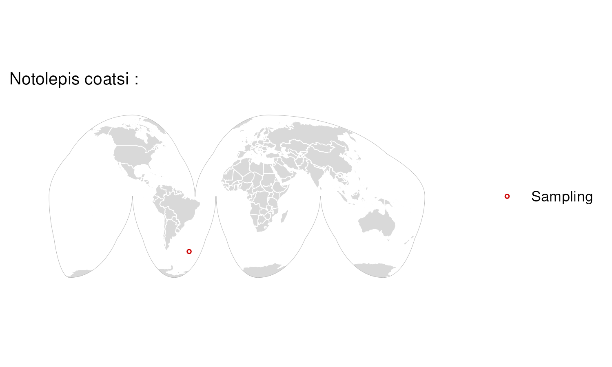

### Species: Notothenia rossii

**Biosample:**  
**Assembly Accession:** GCA\_949606895.1  
**Taxon:** Fishes  
**Priority:** 6  
**Flags:** Missing Range;  

### Species: Numenius arquata

**Biosample:**  
**Assembly Accession:** GCA\_964106895.1  
**Taxon:** Birds  
**Priority:** 6  
**Flags:**  

### Species: Nyctalus leisleri

**Biosample:**  
**Assembly Accession:** GCA\_964264875.2  
**Taxon:** Mammals  
**Priority:** 6  
**Flags:**  

### Species: Nyctibius grandis

**Biosample:**  
**Assembly Accession:** GCA\_013368605.1  
**Taxon:** Birds  
**Priority:** 6  
**Flags:**  

### Species: Nycticebus coucang

**Biosample:**  
**Assembly Accession:** GCA\_027406575.1  
**Taxon:** Mammals  
**Priority:** 6  
**Flags:** Zoo Sample;  

### Species: Ochotona princeps

**Biosample:**  
**Assembly Accession:** GCA\_030435755.1  
**Taxon:** Mammals  
**Priority:** 6  
**Flags:**  

### Species: Odontesthes bonariensis

**Biosample:**  
**Assembly Accession:** GCA\_027942865.1  
**Taxon:** Fishes  
**Priority:** 6  
**Flags:**  

### Species: Opisthocomus hoazin

**Biosample:**  
**Assembly Accession:** GCA\_030867145.1  
**Taxon:** Birds  
**Priority:** 6  
**Flags:**  

### Species: Orcinus orca

**Biosample:**  
**Assembly Accession:** GCA\_937001465.1  
**Taxon:** Mammals  
**Priority:** 6  
**Flags:**  

### Species: Osmerus eperlanus

**Biosample:**  
**Assembly Accession:** GCA\_963692335.1  
**Taxon:** Fishes  
**Priority:** 6  
**Flags:**  

### Species: Osmerus mordax

**Biosample:**  
**Assembly Accession:** GCA\_038355195.1  
**Taxon:** Fishes  
**Priority:** 6  
**Flags:**  

### Species: Panthera onca

**Biosample:**  
**Assembly Accession:** GCA\_046562885.1  
**Taxon:** Mammals  
**Priority:** 6  
**Flags:**  

### Species: Passer domesticus

**Biosample:**  
**Assembly Accession:** GCA\_036417665.1  
**Taxon:** Birds  
**Priority:** 6  
**Flags:**  

### Species: Passerculus sandwichensis

**Biosample:**  
**Assembly Accession:** GCA\_031885435.1  
**Taxon:** Birds  
**Priority:** 6  
**Flags:**  

### Species: Pelecanus crispus

**Biosample:**  
**Assembly Accession:** GCA\_030463565.1  
**Taxon:** Birds  
**Priority:** 6  
**Flags:** Zoo Sample;  

### Species: Pelobates fuscus

**Biosample:**  
**Assembly Accession:** GCA\_036172605.1  
**Taxon:** Amphibians  
**Priority:** 6  
**Flags:**  

### Species: Pelodytes ibericus

**Biosample:**  
**Assembly Accession:** GCA\_036172795.1  
**Taxon:** Amphibians  
**Priority:** 6  
**Flags:**  

### Species: Pempheris klunzingeri

**Biosample:**  
**Assembly Accession:** GCA\_042242105.1  
**Taxon:** Fishes  
**Priority:** 6  
**Flags:** Missing Range;  

### Species: Peromyscus maniculatus

**Biosample:**  
**Assembly Accession:** GCA\_026229955.1  
**Taxon:** Mammals  
**Priority:** 6  
**Flags:**  

### Species: Phaethon aethereus

**Biosample:**  
**Assembly Accession:** GCA\_964289735.1  
**Taxon:** Birds  
**Priority:** 6  
**Flags:**  

### Species: Phaethornis superciliosus

**Biosample:**  
**Assembly Accession:** GCA\_023637945.2  
**Taxon:** Birds  
**Priority:** 6  
**Flags:**  

### Species: Phocoena phocoena

**Biosample:**  
**Assembly Accession:** GCA\_963924675.1  
**Taxon:** Mammals  
**Priority:** 6  
**Flags:**  

### Species: Phoenicopterus ruber

**Biosample:**  
**Assembly Accession:** GCA\_009819775.1  
**Taxon:** Birds  
**Priority:** 6  
**Flags:** Zoo Sample;  

### Species: Pholis gunnellus

**Biosample:**  
**Assembly Accession:** GCA\_910591455.2  
**Taxon:** Fishes  
**Priority:** 6  
**Flags:** Missing Range;  

### Species: Phoxinus phoxinus

**Biosample:**  
**Assembly Accession:** GCA\_949152265.1  
**Taxon:** Fishes  
**Priority:** 6  
**Flags:**  

### Species: Pipistrellus kuhlii

**Biosample:**  
**Assembly Accession:** GCA\_014108245.1  
**Taxon:** Mammals  
**Priority:** 6  
**Flags:**  

### Species: Pipistrellus nathusii

**Biosample:**  
**Assembly Accession:** GCA\_964656225.1  
**Taxon:** Mammals  
**Priority:** 6  
**Flags:** Zoo Sample;  

### Species: Pipistrellus pygmaeus

**Biosample:**  
**Assembly Accession:** GCA\_949987585.1  
**Taxon:** Mammals  
**Priority:** 6  
**Flags:**  

### Species: Platichthys flesus

**Biosample:**  
**Assembly Accession:** GCA\_949316205.1  
**Taxon:** Fishes  
**Priority:** 6  
**Flags:**  

### Species: Plecotus auritus

**Biosample:**  
**Assembly Accession:** GCA\_963455305.1  
**Taxon:** Mammals  
**Priority:** 6  
**Flags:**  

### Species: Pleuronectes platessa

**Biosample:**  
**Assembly Accession:** GCA\_947347685.1  
**Taxon:** Fishes  
**Priority:** 6  
**Flags:**  

### Species: Pluvialis apricaria

**Biosample:**  
**Assembly Accession:** GCA\_017639485.1  
**Taxon:** Birds  
**Priority:** 6  
**Flags:**  

### Species: Podarcis erhardii

**Biosample:**  
**Assembly Accession:** GCA\_964252035.1  
**Taxon:** Reptiles  
**Priority:** 6  
**Flags:**  

### Species: Podarcis melisellensis

**Biosample:**  
**Assembly Accession:** GCA\_964234715.1  
**Taxon:** Reptiles  
**Priority:** 6  
**Flags:**  

### Species: Podarcis muralis

**Biosample:**  
**Assembly Accession:** GCA\_964188315.1  
**Taxon:** Reptiles  
**Priority:** 6  
**Flags:**  

### Species: Podarcis siculus

**Biosample:**  
**Assembly Accession:** GCA\_964188175.1  
**Taxon:** Reptiles  
**Priority:** 6  
**Flags:**  

### Species: Podargus strigoides

**Biosample:**  
**Assembly Accession:** GCA\_028020825.1  
**Taxon:** Birds  
**Priority:** 6  
**Flags:**  

### Species: Podocnemis expansa

**Biosample:**  
**Assembly Accession:** GCA\_045364815.1  
**Taxon:** Reptiles  
**Priority:** 6  
**Flags:** Missing Range;  

### Species: Poecile atricapillus

**Biosample:**  
**Assembly Accession:** GCA\_030490865.1  
**Taxon:** Birds  
**Priority:** 6  
**Flags:**  

### Species: Pogoniulus pusillus

**Biosample:**  
**Assembly Accession:** GCA\_015220805.1  
**Taxon:** Birds  
**Priority:** 6  
**Flags:**  

### Species: Pollachius pollachius

**Biosample:**  
**Assembly Accession:** GCA\_949987615.1  
**Taxon:** Fishes  
**Priority:** 6  
**Flags:**  

### Species: Pristiophorus japonicus

**Biosample:**  
**Assembly Accession:** GCA\_044704955.1  
**Taxon:** Fishes  
**Priority:** 6  
**Flags:**  

### Species: Pristis pectinata

**Biosample:**  
**Assembly Accession:** GCA\_009764475.2  
**Taxon:** Fishes  
**Priority:** 6  
**Flags:**  

### Species: Protomyctophum bolini

**Biosample:**  
**Assembly Accession:** GCA\_963924005.1  
**Taxon:** Fishes  
**Priority:** 6  
**Flags:**  

### Species: Pseudorca crassidens

**Biosample:**  
**Assembly Accession:** GCA\_039906515.1  
**Taxon:** Mammals  
**Priority:** 6  
**Flags:**  

### Species: Pterocles gutturalis

**Biosample:**  
**Assembly Accession:** GCA\_009769525.1  
**Taxon:** Birds  
**Priority:** 6  
**Flags:**  

### Species: Pungitius pungitius

**Biosample:**  
**Assembly Accession:** GCA\_949316345.1  
**Taxon:** Fishes  
**Priority:** 6  
**Flags:**  

### Species: Raja brachyura

**Biosample:**  
**Assembly Accession:** GCA\_963514005.1  
**Taxon:** Fishes  
**Priority:** 6  
**Flags:**  

### Species: Rana temporaria

**Biosample:**  
**Assembly Accession:** GCA\_905171775.1  
**Taxon:** Amphibians  
**Priority:** 6  
**Flags:**  

### Species: Rhamphochromis chilingali

**Biosample:**  
**Assembly Accession:** GCA\_963969265.1  
**Taxon:** Fishes  
**Priority:** 6  
**Flags:** Missing Range;  

### Species: Rhea pennata

**Biosample:**  
**Assembly Accession:** GCA\_028389875.1  
**Taxon:** Birds  
**Priority:** 6  
**Flags:** Zoo Sample;  

### Species: Rhineura floridana

**Biosample:**  
**Assembly Accession:** GCA\_030035675.1  
**Taxon:** Reptiles  
**Priority:** 6  
**Flags:**  

### Species: Rhinogobio nasutus

**Biosample:**  
**Assembly Accession:** GCA\_048301585.1  
**Taxon:** Fishes  
**Priority:** 6  
**Flags:** Missing Range;  

### Species: Rhinolophus affinis

**Biosample:**  
**Assembly Accession:** GCA\_043728065.1  
**Taxon:** Mammals  
**Priority:** 6  
**Flags:**  

### Species: Rhinolophus ferrumequinum

**Biosample:**  
**Assembly Accession:** GCA\_004115265.3  
**Taxon:** Mammals  
**Priority:** 6  
**Flags:**  

### Species: Rhinolophus hipposideros

**Biosample:**  
**Assembly Accession:** GCA\_964194185.1  
**Taxon:** Mammals  
**Priority:** 6  
**Flags:**  

### Species: Rhinolophus trifoliatus

**Biosample:**  
**Assembly Accession:** GCA\_043728145.1  
**Taxon:** Mammals  
**Priority:** 6  
**Flags:**  

### Species: Rhinolophus yonghoiseni

**Biosample:**  
**Assembly Accession:** GCA\_043880425.1  
**Taxon:** Mammals  
**Priority:** 6  
**Flags:** Missing Range;  

### Species: Rhinophrynus dorsalis

**Biosample:**  
**Assembly Accession:** GCA\_037306005.1  
**Taxon:** Amphibians  
**Priority:** 6  
**Flags:**  

### Species: Rhynchonycteris naso

**Biosample:**  
**Assembly Accession:** GCA\_037038545.1  
**Taxon:** Mammals  
**Priority:** 6  
**Flags:**  

### Species: Rhynochetos jubatus

**Biosample:**  
**Assembly Accession:** GCA\_027574665.1  
**Taxon:** Birds  
**Priority:** 6  
**Flags:** Zoo Sample;  

### Species: Rissa tridactyla

**Biosample:**  
**Assembly Accession:** GCA\_028500815.1  
**Taxon:** Birds  
**Priority:** 6  
**Flags:**  
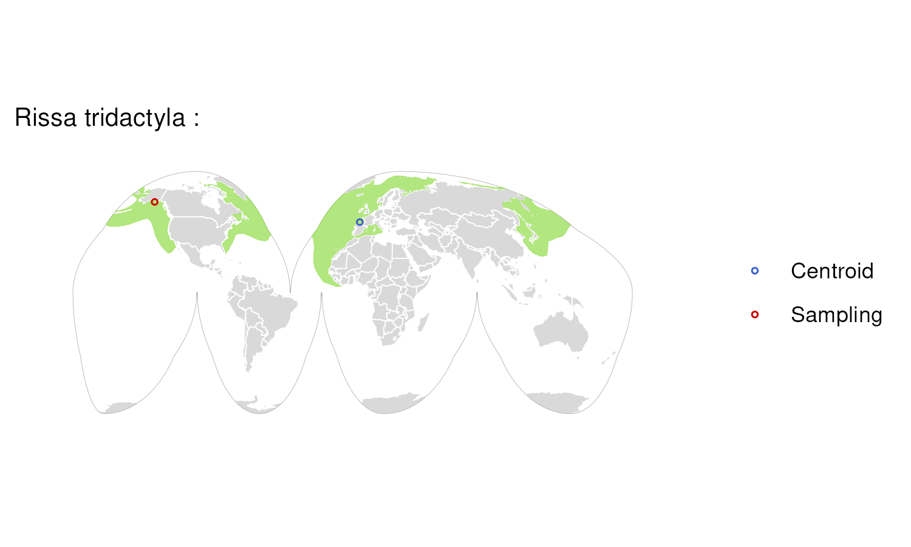

### Species: Rutilus rutilus

**Biosample:**  
**Assembly Accession:** GCA\_951802725.1  
**Taxon:** Fishes  
**Priority:** 6  
**Flags:**  

### Species: Saccopteryx bilineata

**Biosample:**  
**Assembly Accession:** GCA\_036850765.1  
**Taxon:** Mammals  
**Priority:** 6  
**Flags:**  

### Species: Saccopteryx leptura

**Biosample:**  
**Assembly Accession:** GCA\_036850995.1  
**Taxon:** Mammals  
**Priority:** 6  
**Flags:**  

### Species: Salminus brasiliensis

**Biosample:**  
**Assembly Accession:** GCA\_030463535.1  
**Taxon:** Fishes  
**Priority:** 6  
**Flags:**  

### Species: Salvelinus alpinus

**Biosample:**  
**Assembly Accession:** GCA\_036784965.1  
**Taxon:** Fishes  
**Priority:** 6  
**Flags:**  

### Species: Sarcoramphus papa

**Biosample:**  
**Assembly Accession:** GCA\_037962945.1  
**Taxon:** Birds  
**Priority:** 6  
**Flags:**  

### Species: Sardina pilchardus

**Biosample:**  
**Assembly Accession:** GCA\_963854185.1  
**Taxon:** Fishes  
**Priority:** 6  
**Flags:**  

### Species: Scardinius erythrophthalmus

**Biosample:**  
**Assembly Accession:** GCA\_964197995.1  
**Taxon:** Fishes  
**Priority:** 6  
**Flags:**  

### Species: Scatophagus argus

**Biosample:**  
**Assembly Accession:** GCA\_020382885.1  
**Taxon:** Fishes  
**Priority:** 6  
**Flags:**  

### Species: Scomber japonicus

**Biosample:**  
**Assembly Accession:** GCA\_027409825.1  
**Taxon:** Fishes  
**Priority:** 6  
**Flags:**  

### Species: Scomber scombrus

**Biosample:**  
**Assembly Accession:** GCA\_963691925.1  
**Taxon:** Fishes  
**Priority:** 6  
**Flags:**  

### Species: Scophthalmus maximus

**Biosample:**  
**Assembly Accession:** GCA\_963854745.1  
**Taxon:** Fishes  
**Priority:** 6  
**Flags:**  

### Species: Sebastes fasciatus

**Biosample:**  
**Assembly Accession:** GCA\_043250625.1  
**Taxon:** Fishes  
**Priority:** 6  
**Flags:** Missing Range;  

### Species: Sebastes umbrosus

**Biosample:**  
**Assembly Accession:** GCA\_015220745.1  
**Taxon:** Fishes  
**Priority:** 6  
**Flags:** Missing Range;  

### Species: Shinisaurus crocodilurus

**Biosample:**  
**Assembly Accession:** GCA\_021292165.1  
**Taxon:** Reptiles  
**Priority:** 6  
**Flags:**  

### Species: Silurus aristotelis

**Biosample:**  
**Assembly Accession:** GCA\_946808225.1  
**Taxon:** Fishes  
**Priority:** 6  
**Flags:**  

### Species: Sminthopsis crassicaudata

**Biosample:**  
**Assembly Accession:** GCA\_048593235.1  
**Taxon:** Mammals  
**Priority:** 6  
**Flags:**  

### Species: Sorex araneus

**Biosample:**  
**Assembly Accession:** GCA\_027595985.1  
**Taxon:** Mammals  
**Priority:** 6  
**Flags:**  

### Species: Spea bombifrons

**Biosample:**  
**Assembly Accession:** GCA\_027358695.2  
**Taxon:** Amphibians  
**Priority:** 6  
**Flags:**  

### Species: Spinachia spinachia

**Biosample:**  
**Assembly Accession:** GCA\_048126635.1  
**Taxon:** Fishes  
**Priority:** 6  
**Flags:** Zoo Sample;  

### Species: Sprattus sprattus

**Biosample:**  
**Assembly Accession:** GCA\_963457725.1  
**Taxon:** Fishes  
**Priority:** 6  
**Flags:**  

### Species: Squalius cephalus

**Biosample:**  
**Assembly Accession:** GCA\_949319135.1  
**Taxon:** Fishes  
**Priority:** 6  
**Flags:**  

### Species: Stegostoma tigrinum

**Biosample:**  
**Assembly Accession:** GCA\_030684315.1  
**Taxon:** Fishes  
**Priority:** 6  
**Flags:**  

### Species: Sterna hirundo

**Biosample:**  
**Assembly Accession:** GCA\_009819605.1  
**Taxon:** Birds  
**Priority:** 6  
**Flags:**  

### Species: Sternotherus odoratus

**Biosample:**  
**Assembly Accession:** GCA\_032164245.1  
**Taxon:** Reptiles  
**Priority:** 6  
**Flags:**  

### Species: Streptopelia decaocto

**Biosample:**  
**Assembly Accession:** GCA\_964273445.1  
**Taxon:** Birds  
**Priority:** 6  
**Flags:**  

### Species: Strix aluco

**Biosample:**  
**Assembly Accession:** GCA\_031877795.1  
**Taxon:** Birds  
**Priority:** 6  
**Flags:**  

### Species: Styela clava

**Biosample:**  
**Assembly Accession:** GCA\_964204865.1  
**Taxon:** Invertebrates  
**Priority:** 6  
**Flags:** Missing Range;  

### Species: Sylvia atricapilla

**Biosample:**  
**Assembly Accession:** GCA\_009819655.1  
**Taxon:** Birds  
**Priority:** 6  
**Flags:**  

### Species: Sylvia borin

**Biosample:**  
**Assembly Accession:** GCA\_014839755.1  
**Taxon:** Birds  
**Priority:** 6  
**Flags:**  

### Species: Symphodus melops

**Biosample:**  
**Assembly Accession:** GCA\_947650265.1  
**Taxon:** Fishes  
**Priority:** 6  
**Flags:**  

### Species: Synchiropus picturatus

**Biosample:**  
**Assembly Accession:** GCA\_044231675.1  
**Taxon:** Fishes  
**Priority:** 6  
**Flags:** Zoo Sample;  

### Species: Syngnathus typhle

**Biosample:**  
**Assembly Accession:** GCA\_048301445.1  
**Taxon:** Fishes  
**Priority:** 6  
**Flags:**  

### Species: Tachyglossus aculeatus

**Biosample:**  
**Assembly Accession:** GCA\_015852505.1  
**Taxon:** Mammals  
**Priority:** 6  
**Flags:**  

### Species: Tadarida brasiliensis

**Biosample:**  
**Assembly Accession:** GCA\_030848825.1  
**Taxon:** Mammals  
**Priority:** 6  
**Flags:**  

### Species: Talpa europaea

**Biosample:**  
**Assembly Accession:** GCA\_964194135.1  
**Taxon:** Mammals  
**Priority:** 6  
**Flags:**  

### Species: Tamandua tetradactyla

**Biosample:**  
**Assembly Accession:** GCA\_023851605.1  
**Taxon:** Mammals  
**Priority:** 6  
**Flags:**  

### Species: Tapirus indicus

**Biosample:**  
**Assembly Accession:** GCA\_031878705.1  
**Taxon:** Mammals  
**Priority:** 6  
**Flags:** Zoo Sample;  

### Species: Tauraco erythrolophus

**Biosample:**  
**Assembly Accession:** GCA\_009769465.1  
**Taxon:** Birds  
**Priority:** 6  
**Flags:** Zoo Sample;  

### Species: Taurulus bubalis

**Biosample:**  
**Assembly Accession:** GCA\_910589615.1  
**Taxon:** Fishes  
**Priority:** 6  
**Flags:**  

### Species: Tautogolabrus adspersus

**Biosample:**  
**Assembly Accession:** GCA\_020745685.1  
**Taxon:** Fishes  
**Priority:** 6  
**Flags:**  

### Species: Telmatherina bonti

**Biosample:**  
**Assembly Accession:** GCA\_933228915.1  
**Taxon:** Fishes  
**Priority:** 6  
**Flags:** Zoo Sample;  

### Species: Thalia democratica

**Biosample:**  
**Assembly Accession:** GCA\_965202585.1  
**Taxon:** Invertebrates  
**Priority:** 6  
**Flags:** Missing Range;  

### Species: Theristicus caerulescens

**Biosample:**  
**Assembly Accession:** GCA\_020745775.1  
**Taxon:** Birds  
**Priority:** 6  
**Flags:**  

### Species: Thomomys bottae

**Biosample:**  
**Assembly Accession:** GCA\_031878675.1  
**Taxon:** Mammals  
**Priority:** 6  
**Flags:**  

### Species: Tiliqua scincoides

**Biosample:**  
**Assembly Accession:** GCA\_035046505.1  
**Taxon:** Reptiles  
**Priority:** 6  
**Flags:**  

### Species: Trachurus trachurus

**Biosample:**  
**Assembly Accession:** GCA\_905171665.2  
**Taxon:** Fishes  
**Priority:** 6  
**Flags:**  

### Species: Trichechus inunguis

**Biosample:**  
**Assembly Accession:** GCA\_046562895.1  
**Taxon:** Mammals  
**Priority:** 6  
**Flags:**  

### Species: Trididemnum clinides

**Biosample:**  
**Assembly Accession:** GCA\_963675345.1  
**Taxon:** Invertebrates  
**Priority:** 6  
**Flags:** Missing Range;  

### Species: Triturus cristatus

**Biosample:**  
**Assembly Accession:** GCA\_964204655.1  
**Taxon:** Amphibians  
**Priority:** 6  
**Flags:**  

### Species: Trogon surrucura

**Biosample:**  
**Assembly Accession:** GCA\_020746105.1  
**Taxon:** Birds  
**Priority:** 6  
**Flags:**  

### Species: Tursiops truncatus

**Biosample:**  
**Assembly Accession:** GCA\_011762595.2  
**Taxon:** Mammals  
**Priority:** 6  
**Flags:**  

### Species: Urocitellus parryii

**Biosample:**  
**Assembly Accession:** GCA\_045843805.1  
**Taxon:** Mammals  
**Priority:** 6  
**Flags:**  

### Species: Vanellus vanellus

**Biosample:**  
**Assembly Accession:** GCA\_965231255.1  
**Taxon:** Birds  
**Priority:** 6  
**Flags:**  

### Species: Vespertilio murinus

**Biosample:**  
**Assembly Accession:** GCA\_963924515.1  
**Taxon:** Mammals  
**Priority:** 6  
**Flags:**  

### Species: Vidua chalybeata

**Biosample:**  
**Assembly Accession:** GCA\_026979565.1  
**Taxon:** Birds  
**Priority:** 6  
**Flags:**  

### Species: Vipera berus

**Biosample:**  
**Assembly Accession:** GCA\_964194415.1  
**Taxon:** Reptiles  
**Priority:** 6  
**Flags:**  

### Species: Vipera latastei

**Biosample:**  
**Assembly Accession:** GCA\_024294585.1  
**Taxon:** Reptiles  
**Priority:** 6  
**Flags:**  

### Species: Vipera ursinii

**Biosample:**  
**Assembly Accession:** GCA\_947247035.1  
**Taxon:** Reptiles  
**Priority:** 6  
**Flags:** Zoo Sample;  

### Species: Vulpes vulpes

**Biosample:**  
**Assembly Accession:** GCA\_964106825.2  
**Taxon:** Mammals  
**Priority:** 6  
**Flags:**  

### Species: Willisornis vidua

**Biosample:**  
**Assembly Accession:** GCA\_045364795.1  
**Taxon:** Birds  
**Priority:** 6  
**Flags:**  

### Species: Zalophus californianus

**Biosample:**  
**Assembly Accession:** GCA\_009762305.2  
**Taxon:** Mammals  
**Priority:** 6  
**Flags:**  

### Species: Zeus faber

**Biosample:**  
**Assembly Accession:** GCA\_960531495.1  
**Taxon:** Fishes  
**Priority:** 6  
**Flags:**  

### Species: Zonotrichia albicollis

**Biosample:**  
**Assembly Accession:** GCA\_047830755.1  
**Taxon:** Birds  
**Priority:** 6  
**Flags:**  

### Species: Zootoca vivipara

**Biosample:**  
**Assembly Accession:** GCA\_963506605.1  
**Taxon:** Reptiles  
**Priority:** 6  
**Flags:**  

### Species: Alca Torda

**Biosample:**  
**Assembly Accession:** GCA\_008658365.1  
**Taxon:** Birds  
**Priority:** 7  
**Flags:**  

### Species: Ambystoma mexicanum x Ambystoma tigrinum

**Biosample:**  
**Assembly Accession:** GCA\_040938575.1  
**Taxon:** Amphibians  
**Priority:** 7  
**Flags:**  
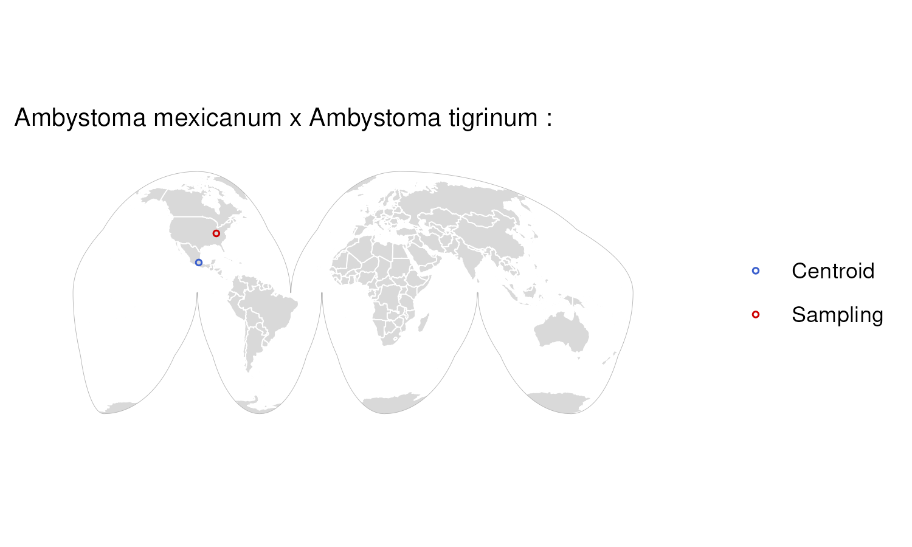

### Species: Ammodramus caudacutus

**Biosample:**  
**Assembly Accession:** GCA\_027887145.1  
**Taxon:** Birds  
**Priority:** 7  
**Flags:**  

### Species: Anniella stebbinsi

**Biosample:**  
**Assembly Accession:** GCA\_029215775.1  
**Taxon:** Reptiles  
**Priority:** 7  
**Flags:**  

### Species: Anser cygnoides

**Biosample:**  
**Assembly Accession:** GCA\_040182565.1  
**Taxon:** Birds  
**Priority:** 7  
**Flags:**  

### Species: Aspidoscelis tigris stejnegeri

**Biosample:**  
**Assembly Accession:** GCA\_023333525.2  
**Taxon:** Reptiles  
**Priority:** 7  
**Flags:**  

### Species: Camelus dromedarius

**Biosample:**  
**Assembly Accession:** GCA\_036321535.1  
**Taxon:** Mammals  
**Priority:** 7  
**Flags:**  

### Species: Chionomys nivalis

**Biosample:**  
**Assembly Accession:** GCA\_950005125.1  
**Taxon:** Mammals  
**Priority:** 7  
**Flags:**  

### Species: Chroicocephalus ridibundus

**Biosample:**  
**Assembly Accession:** GCA\_963924245.1  
**Taxon:** Birds  
**Priority:** 7  
**Flags:**  

### Species: Coloeus monedula

**Biosample:**  
**Assembly Accession:** GCA\_965178545.1  
**Taxon:** Birds  
**Priority:** 7  
**Flags:**  

### Species: Coregonus lavaretus

**Biosample:**  
**Assembly Accession:** GCA\_964263955.1  
**Taxon:** Fishes  
**Priority:** 7  
**Flags:**  

### Species: Coturnix chinensis

**Biosample:**  
**Assembly Accession:** GCA\_039878825.1  
**Taxon:** Birds  
**Priority:** 7  
**Flags:**  

### Species: Diceros bicornis minor

**Biosample:**  
**Assembly Accession:** GCA\_020826845.1  
**Taxon:** Mammals  
**Priority:** 7  
**Flags:**  

### Species: Dixiphia pipra

**Biosample:**  
**Assembly Accession:** GCA\_036250125.1  
**Taxon:** Birds  
**Priority:** 7  
**Flags:**  

### Species: Elgaria multicarinata webbii

**Biosample:**  
**Assembly Accession:** GCA\_023053635.2  
**Taxon:** Reptiles  
**Priority:** 7  
**Flags:**  

### Species: Equus caballus

**Biosample:**  
**Assembly Accession:** GCA\_036426135.1  
**Taxon:** Mammals  
**Priority:** 7  
**Flags:**  

### Species: Falco punctatus

**Biosample:**  
**Assembly Accession:** GCA\_963210335.1  
**Taxon:** Birds  
**Priority:** 7  
**Flags:**  

### Species: Glossophaga mutica

**Biosample:**  
**Assembly Accession:** GCA\_039655065.1  
**Taxon:** Mammals  
**Priority:** 7  
**Flags:**  

### Species: Guaruba guaruba

**Biosample:**  
**Assembly Accession:** GCA\_045345405.1  
**Taxon:** Birds  
**Priority:** 7  
**Flags:**  

### Species: Lateolabrax maculatus

**Biosample:**  
**Assembly Accession:** GCA\_031216445.1  
**Taxon:** Fishes  
**Priority:** 7  
**Flags:** Vague Location;  

### Species: Lonchura striata domestica

**Biosample:**  
**Assembly Accession:** GCA\_046129695.1  
**Taxon:** Birds  
**Priority:** 7  
**Flags:**  

### Species: Macaca fascicularis

**Biosample:**  
**Assembly Accession:** GCA\_037993035.1  
**Taxon:** Mammals  
**Priority:** 7  
**Flags:**  

### Species: Macropus eugenii

**Biosample:**  
**Assembly Accession:** GCA\_028372415.2  
**Taxon:** Mammals  
**Priority:** 7  
**Flags:**  

### Species: Mantella aurantiaca

**Biosample:**  
**Assembly Accession:** GCA\_048565345.1  
**Taxon:** Amphibians  
**Priority:** 7  
**Flags:**  

### Species: Melanotaenia boesemani

**Biosample:**  
**Assembly Accession:** GCA\_017639745.1  
**Taxon:** Fishes  
**Priority:** 7  
**Flags:**  

### Species: Molossus nigricans

**Biosample:**  
**Assembly Accession:** GCA\_039880945.1  
**Taxon:** Mammals  
**Priority:** 7  
**Flags:**  

### Species: Monodon monocero

**Biosample:**  
**Assembly Accession:** GCA\_005190385.3  
**Taxon:** Mammals  
**Priority:** 7  
**Flags:**  

### Species: Mustela nivalis vulgaris

**Biosample:**  
**Assembly Accession:** GCA\_964662115.1  
**Taxon:** Mammals  
**Priority:** 7  
**Flags:**  

### Species: Nannobrachium achirus

**Biosample:**  
**Assembly Accession:** GCA\_963921795.1  
**Taxon:** Fishes  
**Priority:** 7  
**Flags:**  

### Species: Nesoenas mayeri

**Biosample:**  
**Assembly Accession:** GCA\_963082525.1  
**Taxon:** Birds  
**Priority:** 7  
**Flags:**  
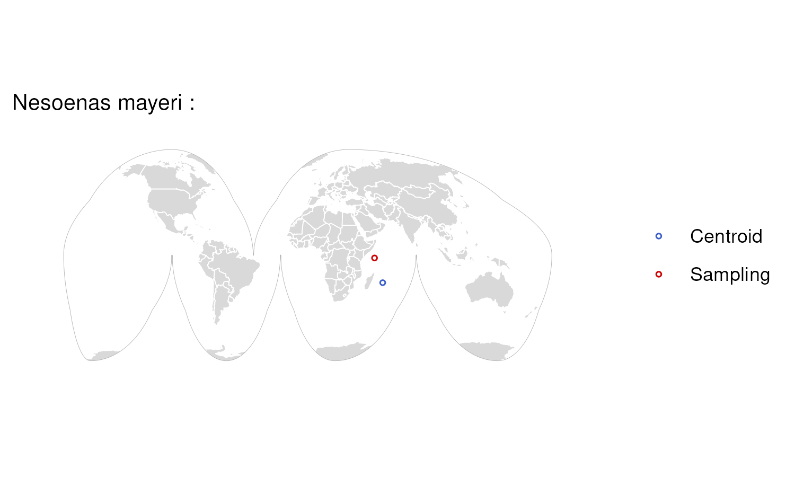

### Species: Podarcis gaigeae

**Biosample:**  
**Assembly Accession:** GCA\_964106915.2  
**Taxon:** Reptiles  
**Priority:** 7  
**Flags:**  

### Species: Podarcis raffonei

**Biosample:**  
**Assembly Accession:** GCA\_027172205.1  
**Taxon:** Reptiles  
**Priority:** 7  
**Flags:**  

### Species: Porphyrio hochstetteri

**Biosample:**  
**Assembly Accession:** GCA\_020800305.1  
**Taxon:** Birds  
**Priority:** 7  
**Flags:**  

### Species: Pseudophryne corroboree

**Biosample:**  
**Assembly Accession:** GCA\_028390025.1  
**Taxon:** Amphibians  
**Priority:** 7  
**Flags:**  

### Species: Psittacula echo

**Biosample:**  
**Assembly Accession:** GCA\_963264785.1  
**Taxon:** Birds  
**Priority:** 7  
**Flags:**  

### Species: Rhinolophus perniger lanosus

**Biosample:**  
**Assembly Accession:** GCA\_043748575.1  
**Taxon:** Mammals  
**Priority:** 7  
**Flags:**  

### Species: Struthio camelus australis

**Biosample:**  
**Assembly Accession:** GCA\_040807025.1  
**Taxon:** Birds  
**Priority:** 7  
**Flags:**  

### Species: Trichomycterus rosablanca

**Biosample:**  
**Assembly Accession:** GCA\_030014385.1  
**Taxon:** Fishes  
**Priority:** 7  
**Flags:**  

1 2 3 4 5 6 7 4 55 5 109 4 357 38 \[1\] “…1” “X.1”  
\[3\] “scientific\_name” “iucn\_name”  
\[5\] “assessment\_id” “category”  
\[7\] “criteria” “pop\_trend”  
\[9\] “locations” “year\_published”  
\[11\] “latest” “gbif\_synonyms”  
\[13\] “iucn\_synonyms” “X”  
\[15\] “lineage” “extended\_lineage”  
\[17\] “english\_name” “accession\_number\_for\_main\_haplotype” \[19\]
“biosample\_accession” “geo\_location”  
\[21\] “latlon” “comments”  
\[23\] “lat” “lon”  
\[25\] “vague\_location\_flag” “missing\_sampling\_location\_flag”  
\[27\] “raster\_path\_ea” “raster\_path\_goode”  
\[29\] “centroid\_lon” “centroid\_lat”  
\[31\] “outside\_range\_flag” “missing\_range\_flag”  
\[33\] “zoo\_flag” “domesticated\_flag”
