## Sampling Map

## Range Centroid Map

## Heatmap of Distributions

## Individual Species Maps

### Species: Asterias rubens

**Common Name:** common starfish\
**Biosample:** SAMEA994741\
**Assembly Accession:** GCA_902459465.3\
**Taxon:** Invertebrates\
**Priority:** 1\
**Flags:** Missing Range; Missing Sampling Location;

**Map Notes:**\
**Comments:** The assembly eAstRub1.3 is based on 103x PacBio data, 150x
Illumina data, and 126x Dovetail Hi-C data generated at the Wellcome
Sanger Institute. The assembly process included the following sequence
of steps: initial PacBio assembly generation with Falcon-unzip, retained
haplotig identification with Purge Haplotigs, Hi-C based scaffolding
with SALSA2, Arrow polishing, and two rounds of FreeBayes polishing.
Finally, the assembly was analysed and manually improved using gEVAL.
Chromosome-scale scaffolds confirmed by the Hi-C data have been named in
order of size.

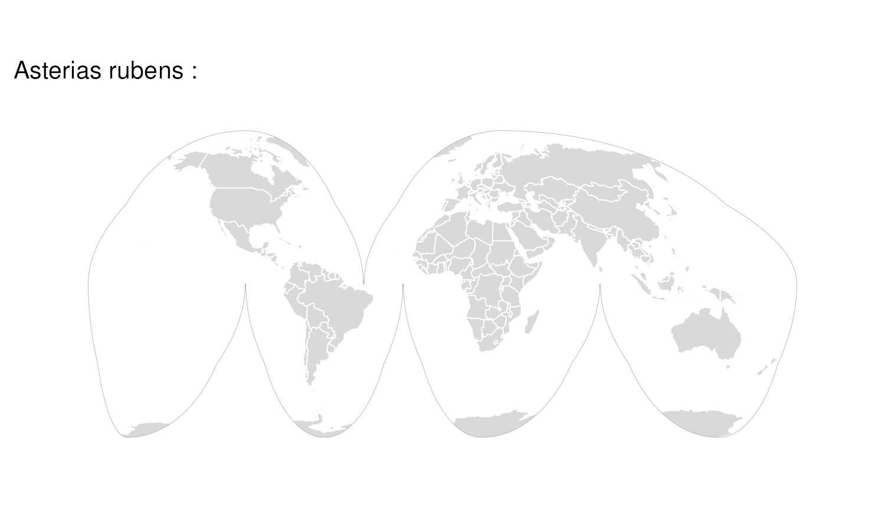

### Species: Branchiostoma belcheri

**Common Name:** belcher’s lancelet\
**Biosample:** SAMN13907882\
**Assembly Accession:** GCA_019207075.1\
**Taxon:** Invertebrates\
**Priority:** 1\
**Flags:** Missing Range; Missing Sampling Location;

**Map Notes:**\
**Comments:** This is a lab-generated F1 cross between Branchiostoma
floridae x Branchiostoma belcheri for which parental haplotypes were
determined. The principal haplotype in JAFMNY000000000 represents the
Branchiostoma belcheri genome which contains 20 chromosomes while the
alternative haplotype in JAFMNZ000000000 represents the Branchiostoma
floridae genome which only contains 19 chromosomes due to a chromosome
pair fusion. Note the chromosomes were named according to chromosome
size, not homology.

### Species: Branchiostoma floridae

**Common Name:** Florida amphioxus\
**Biosample:** SAMN13896449\
**Assembly Accession:** GCA_015852565.1\
**Taxon:** Invertebrates\
**Priority:** 1\
**Flags:** Missing Range; Missing Sampling Location;

**Map Notes:**\
**Comments:** NA

### Species: Gadus morhua

**Common Name:** Atlantic cod\
**Biosample:** SAMEA5574046\
**Assembly Accession:** GCA_902167405.1\
**Taxon:** Fishes\
**Priority:** 1\
**Flags:** Missing Range; Missing Sampling Location;

**Map Notes:**\
**Comments:** The assembly gadMor3.0 of individual fGadMor1
(SAMEA5574046) is based on 83x PacBio data generated at the Wellcome
Sanger Institute and the Jakobsen lab at the University of Olso in
Norway, 59x 10X Genomics Chromium data and BioNano data generated at the
Wellcome Sanger Institute, as well as 76x Arima Hi-C data generated at
the Jakobsen lab. The assembly process included the following sequence
of steps: initial PacBio assembly generation with Falcon-unzip, retained
haplotig identification with purge_dups, 10X based scaffolding with
scaff10x, BioNano hybrid-scaffolding, Hi-C based scaffolding with
SALSA2, Arrow polishing, and two rounds of FreeBayes polishing. Finally,
the assembly was analysed and manually improved using gEVAL.
Chromosome-scale scaffolds were named based on a genetic map provided by
the Jakobsen lab.

### Species: Acanthopagrus latus

**Common Name:** yellowfin sea bream\
**Biosample:** SAMN16236878\
**Assembly Accession:** GCA_904848185.1\
**Taxon:** Fishes\
**Priority:** 2\
**Flags:** Missing Sampling Location;

**Map Notes:**\
**Comments:** The assembly fAcaLat1.1 is based on 60x Illumina genome
survey data, 106x Illumina Hi-C data, 282x PacBio data, and 100x
Illumina transcriptome data generated at Nextomics Biosciences. The
assembly process included the following sequence of steps: initial
PacBio assembly generation with Falcon-unzip, retained haplotig
separation with purge_dups, Hi-C based scaffolding with SALSA2, Arrow
polishing, and two rounds of FreeBayes polishing. Finally, the assembly
was analysed and manually improved using gEVAL. Chromosome-scale
scaffolds are named by synteny to the GCA_900880675.1 assembly of Sparus
aurata.

### Species: Acipenser ruthenus

**Common Name:** sterlet\
**Biosample:** SAMEA5572864\
**Assembly Accession:** GCA_902713425.2\
**Taxon:** Fishes\
**Priority:** 2\
**Flags:** Missing Sampling Location;

**Map Notes:**\
**Comments:** The assembly fAciRut3.2 is based on 61x PacBio data and
Dovetail Hi-C data generated by the Darwin Tree of Life Project
(<https://www.darwintreeoflife.org/>). The assembly process included the
following sequence of steps: HiFi reads were trio-binned using trioCanu
with k-mers from the Illumina-sequenced parents; haplotype-specific HiFi
reads were assembled separately using Hifiasm; segregation of HiC reads
using Canu’s ‘splitHaplotype’ script and k-mers from the
Illumina-sequenced parents; for each haplotype assembly,
haplotype-specific and unclassified HiC reads were combined to construct
scaffolds using pins. The mitochondrial genome was assembled using
MitoHifi. Finally, the assembly was analysed and manually improved using
gEVAL. Chromosome-scale scaffolds confirmed by the Hi-C data have been
named in order of size.

### Species: Acomys russatus

**Common Name:** golden spiny mouse\
**Biosample:** SAMEA104026431\
**Assembly Accession:** GCA_903995435.1\
**Taxon:** Mammals\
**Priority:** 2\
**Flags:** Missing Sampling Location;

**Map Notes:**\
**Comments:** The assembly mAcoRus1.1 is based on 58x PacBio data and
BioNano data generated at the Wellcome Sanger Institute, and 33x
Illumina data generated at the Earlham Institute. The assembly process
included the following sequence of steps: initial PacBio assembly
generation with Falcon-unzip, BioNano hybrid-scaffolding, gap filling
with PBJelly, polishing using Arrow, polishing using Illumina data with
Freebayes, and manual curation. Chromosome-scale scaffolds are built
based on chromosome painting with Mus musculus fosmids, karyotype named
as previously published (Baker et. al, 1979).

### Species: Anabas testudineus

**Common Name:** climbing perch\
**Biosample:** SAMEA104026376\
**Assembly Accession:** GCA_900324465.3\
**Taxon:** Fishes\
**Priority:** 2\
**Flags:** Missing Sampling Location;

**Map Notes:**\
**Comments:** The assembly fAnaTes1.3 is based on 68x PacBio Sequel
data, 114x coverage Illumina HiSeqX data from a 10X Genomics Chromium
library generated at the Wellcome Sanger Institute as well as BioNano
Saphyr DLE data generated at the Rockefeller University Vertebrate
Genome Laboratory and 170x coverage HiSeqX data from a Hi-C library
prepared by Arima Genomics. An initial PacBio assembly was made using
Falcon-unzip. The primary contigs were then scaffolded using the 10X
data with scaff10x and mis-joins broken using break10x. After using the
PacBio data to gap fill with PBJelly and polish with Arrow, the assembly
was polished again using the 10X Illumina data and freebayes. Finally,
the assembly was further manually curated using gEVAL to correct
mis-joins and improve concordance with the BioNano data and Arima Hi-C
data. This was the initial fAnaTes1.1 assembly. An updated fAnaTes1.2
assembly has been further curated to removed duplicate haplotypes using
purge_haplotigs and using the Hi-C data to identify further breaks and
joins and produce chromosomal-level scaffolds. fAnaTes1.3 includes a
mitochondrial assembly produced at The Rockefeller University using
mitoVGP. Chromosomes have been named by synteny to medaka.

### Species: Aquila chrysaetos

**Common Name:** European golden eagle\
**Biosample:** SAMEA994725\
**Assembly Accession:** GCA_900496995.4\
**Taxon:** Birds\
**Priority:** 2\
**Flags:** Missing Sampling Location;

**Map Notes:**\
**Comments:** The assembly bAquChr1.4 is based on 60x PacBio data, 54x
coverage 10X Genomics Chromium data, and 63x coverage Dovetail Hi-C data
generated at the Wellcome Sanger Institute, and BioNano data generated
by the DeepSeq facility at the University of Nottingham. The assembly
process included the following sequence of steps: initial PacBio
assembly generation with Falcon-unzip, retained haplotig identification
with Purge Haplotigs, 10X based scaffolding with scaff10x, BioNano
hybrid-scaffolding, Hi-C based scaffolding with SALSA2, Arrow polishing,
and two rounds of FreeBayes polishing. The mitochondrial assembly was
produced at The Rockefeller University using mitoVGP. Finally, the
assembly was analysed and manually improved using gEVAL.
Chromosome-scale scaffolds confirmed by the Hi-C data have been named in
order of size. As a result of the Hi-C data being sourced from a male
bird it has not been possible to fully construct the W Chromosome for
the female sample bAquChr1. Scaffolds identified as belonging to W have
therefore been submitted as unordered fragments. The largest of these
fragments has been designated as the W chromosome (SUPER_W) and all
other W scaffolds labelled as W_unloc.

### Species: Arvicola amphibius

**Common Name:** European water vole\
**Biosample:** SAMEA994740\
**Assembly Accession:** GCA_903992535.2\
**Taxon:** Mammals\
**Priority:** 2\
**Flags:** Missing Sampling Location;

**Map Notes:**\
**Comments:** The assembly mArvAmp1.2 is based on 45x PacBio data, 52x
10X Genomics Chromium data, BioNano data and 6x Dovetail Hi-C data
generated at the Wellcome Sanger Institute. The assembly process
included the following sequence of steps: initial PacBio assembly
generation with Falcon-unzip, retained haplotig separation with
purge_dups, 10X based scaffolding with scaff10x, BioNano
hybrid-scaffolding with Solve, Hi-C based scaffolding with SALSA2, Arrow
polishing, and two rounds of FreeBayes polishing. Finally, the assembly
was analysed and manually improved using gEVAL. Chromosome-scale
scaffolds confirmed by the Hi-C data have been named in order of size.

### Species: Astyanax mexicanus

**Common Name:** Mexican tetra\
**Biosample:** SAMN25965548\
**Assembly Accession:** GCA_023375975.1\
**Taxon:** Fishes\
**Priority:** 2\
**Flags:** Missing Sampling Location;

**Map Notes:**\
**Comments:** Grants:#NIH Grant 1DP2OD028806-01#NSF EDGE award
1923372#(both to Dr. Nicolas Rohner)

The Astyanax mexicanus DNA sample was obtained from a female fish that
was a reared at the Stowers Institute aquatic facility. High molecular
weight DNA was used as input to generate long-reads using circular
consensus sequence (CCS) base calling output from the Sequel II
instrument (Pacific Biosciences) according to the manufacturer’s
protocols. Total CCS coverage was approx. 38x using a genome size
estimate of 1.4Gb. All quality filtered sequence reads were assembled
with HiFasm using default parameter settings and redundant contigs
removed using purge_haplotigs. Assembled contigs were scaffolded using
HiC sequence data from a sibling individual using Salsa 2 and JuiceBox.
Chromosomes were numbered by synteny to previous assembled chromosomes
of Asytanax mexicanus. This version of the surface fish assembly will
replace the prior version GCA_000372685.2.

It is requested that users of this Astyanax mexicanus 1.0 sequence
assembly acknowledge the Astyanax mexicanus genomes consortium in any
publications that result from use of this sequence assembly prior to the
publication of this resource. Any publications that propose to generate
whole genome analyses using this resource should contact Dr. Nicolas
Rohner ([nro\@stowers.org](mailto:nro@stowers.org){.email}) or Dr. Wes
Warren ([warrenwc\@missouri.edu](mailto:warrenwc@missouri.edu){.email})
for the use of pre-publication data in accord with the Ft. Lauderdale
and Toronto genomic data use agreements.

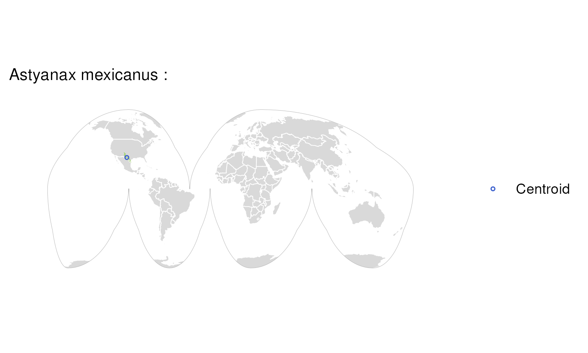

### Species: Betta splendens

**Common Name:** Siamese fighting fish\
**Biosample:** SAMEA104381735\
**Assembly Accession:** GCA_900634795.4\
**Taxon:** Fishes\
**Priority:** 2\
**Flags:** Missing Sampling Location;

**Map Notes:**\
**Comments:** The assembly fBetSpl5.4 is based on 48x PacBio Sequel data
and 83x coverage Illumina HiSeqX data from a single individual
(fBetSpl5, sample SAMEA104381735). Scaffolding and curation also
integrated 183x Illumina HiSeqX data generated from a 10X Genomics
Chromium library and single-enzyme BioNano Irys data, both from a
separate individual (fBetSpl1, sample SAMEA104381745). All data was
generated at the Wellcome Sanger Institute. An initial PacBio assembly
of fBetSpl5 was made using Falcon-unzip, and retained haplotigs were
identified using purge_haplotigs. The primary contigs were then
scaffolded using the 10X data from fBetSpl1 with scaff10x. After using
the PacBio data to gap fill with PBJelly and polish with Arrow, the
assembly was polished again using the fBetSpl5 Illumina data and
freebayes. Finally, the assembly was manually improved using gEVAL to
correct mis-joins and improve concordance with the BioNano data. By
aligning with the existing Betta splendens assembly (GCA_003650155.1)
and medaka, we were able to order and orient our scaffolds and place
onto chromosomes. Chromosomes are named by synteny to medaka.

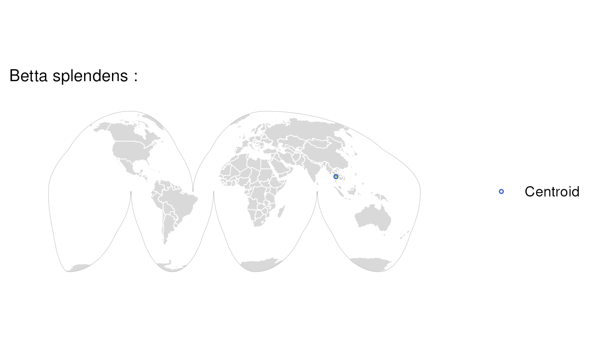

### Species: Chanos chanos

**Common Name:** milkfish\
**Biosample:** SAMEA5159473\
**Assembly Accession:** GCA_902362185.1\
**Taxon:** Fishes\
**Priority:** 2\
**Flags:** Missing Sampling Location;

**Map Notes:**\
**Comments:** The assembly fChaCha1.1 is based on 68x PacBio data, 78x
10X Genomics Chromium data, BioNano data and 93x Dovetail Hi-C data
generated at the Wellcome Sanger Institute. The assembly process
included the following sequence of steps: initial PacBio assembly
generation with Falcon-unzip, retained haplotig identification with
Purge Dups, 10X based scaffolding with scaff10x, BioNano
hybrid-scaffolding, Hi-C based scaffolding with SALSA2, Arrow polishing,
and two rounds of FreeBayes polishing. Finally, the assembly was
analysed and manually improved using gEVAL. Chromosome-scale scaffolds
confirmed by the Hi-C data have been named in order of size.

### Species: Cottoperca gobio

**Common Name:** channel bull blenny\
**Biosample:** SAMEA104242975\
**Assembly Accession:** GCA_900634415.1\
**Taxon:** Fishes\
**Priority:** 2\
**Flags:** Missing Sampling Location;

**Map Notes:**\
**Comments:** NA

### Species: Denticeps clupeoides

**Common Name:** denticle herring\
**Biosample:** SAMEA104129917\
**Assembly Accession:** GCA_900700375.2\
**Taxon:** Fishes\
**Priority:** 2\
**Flags:** Missing Sampling Location;

**Map Notes:**\
**Comments:** The assembly fDenClu1.2 is based on 63x PacBio Sequel data
and 89x coverage Illumina HiSeqX data from a 10X Genomics Chromium
library generated at the Wellcome Sanger Institute, as well as BioNano
Saphyr DLE data generated at the Rockefeller University Vertebrate
Genome Laboratory and 95x coverage HiSeqX data from a Hi-C library
prepared by Arima Genomics. An initial PacBio assembly of fDenClu1 was
made using Falcon-unzip, and retained haplotigs were identified using
purge_haplotigs. The primary contigs were then scaffolded using the 10X
data with scaff10x, then scaffolded further with BioNano hybrid
scaffolding and scaffolded further still using the Hi-C data with
SALSA2. Polishing and gap-filling of both the primary scaffolds and
haplotigs was performed using the PacBio reads and Arrow, followed by
two rounds of Illumina polishing using the 10X data and freebayes. The
mitochondrial assembly was produced at The Rockefeller University using
mitoVGP. Finally, the assembly was manually improved using gEVAL to
correct mis-joins, improve concordance with the BioNano and Hi-C data
and remove retained haplotypic duplication using purge_haplotigs.
Chromosomes identified from the Hi-C data have been named in order of
size.

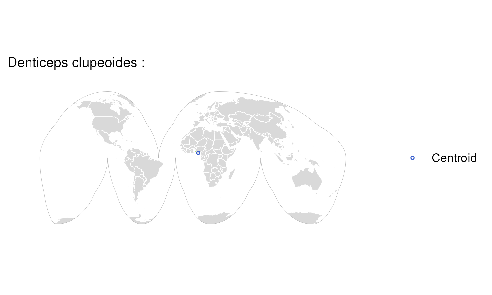

### Species: Echeneis naucrates

**Common Name:** live sharksucker\
**Biosample:** SAMEA4966390\
**Assembly Accession:** GCA_900963305.2\
**Taxon:** Fishes\
**Priority:** 2\
**Flags:** Missing Sampling Location;

**Map Notes:**\
**Comments:** The assembly fEcheNa1.2 is based on 62x PacBio data, 100x
coverage 10X Genomics Chromium data, BioNano data and 112x coverage
Dovetail Hi-C data generated at the Wellcome Sanger Institute. The
assembly process included the following sequence of steps: initial
PacBio assembly generation with Falcon-unzip, retained haplotig
identification with Purge Haplotigs, 10X based scaffolding with
scaff10x, BioNano hybrid-scaffolding, Hi-C based scaffolding with
SALSA2, Arrow polishing, and two rounds of FreeBayes polishing. The
mitochondrial assembly was produced at The Rockefeller University using
mitoVGP. Finally, the assembly was analysed and manually improved using
gEVAL. Chromosome-scale scaffolds are named by synteny to medaka.

### Species: Erithacus rubecula

**Common Name:** European robin\
**Biosample:** SAMEA4760689\
**Assembly Accession:** GCA_903797595.2\
**Taxon:** Birds\
**Priority:** 2\
**Flags:** Missing Sampling Location;

**Map Notes:**\
**Comments:** The assembly bEriRub2.2 is based on 41x PacBio data, 22x
10X Genomics Chromium data, and 42x Dovetail Hi-C data generated at the
Wellcome Sanger Institute. The assembly process included the following
sequence of steps: initial PacBio assembly generation with Falcon-unzip,
retained haplotig separation with purge_dups, 10X based scaffolding with
scaff10x, Hi-C based scaffolding with SALSA2, Arrow polishing, and two
rounds of FreeBayes polishing. Finally, the assembly was analysed and
manually improved using gEVAL. Chromosome-scale scaffolds confirmed by
the Hi-C data have been named in order of size.

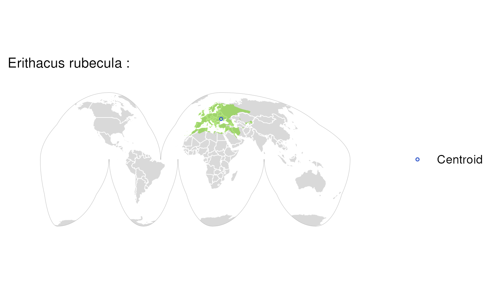

### Species: Erpetoichthys calabaricus

**Common Name:** reedfish\
**Biosample:** SAMEA104026374\
**Assembly Accession:** GCA_900747795.4\
**Taxon:** Fishes\
**Priority:** 2\
**Flags:** Missing Sampling Location;

**Map Notes:**\
**Comments:** The assembly fErpCal1.3 is based on 58x PacBio data, 31x
10X Genomics Chromium data, and 35x Arima Hi-C data generated at the
Wellcome Sanger Institute, as well as BioNano Saphyr DLE data generated
at the Rockefeller University Vertebrate Genome Laboratory. The assembly
process included the following sequence of steps: initial PacBio
assembly generation with Falcon-unzip, retained haplotig separation with
purge_dups, 10X based scaffolding with scaff10x, BioNano
hybrid-scaffolding with Solve, Hi-C based scaffolding with SALSA2, Arrow
polishing using Merfin, and two rounds of FreeBayes polishing. Finally,
the assembly was analysed and manually improved using gEVAL. The
mitochondrial assembly was produced at The Rockefeller University using
mitoVGP. Chromosome-scale scaffolds confirmed by the Hi-C data have been
named in order of size. The GC profile of chromosome 11 is very unusual
when compared with the other chromosomes.

### Species: Eublepharis macularius

**Common Name:** leopard gecko\
**Biosample:** SAMN31016422\
**Assembly Accession:** GCA_028583425.1\
**Taxon:** Reptiles\
**Priority:** 2\
**Flags:** Missing Sampling Location;

**Map Notes:**\
**Comments:** NA

### Species: Geotrypetes seraphini

**Common Name:** Gaboon caecilian\
**Biosample:** SAMEA104387963\
**Assembly Accession:** GCA_902459505.2\
**Taxon:** Amphibians\
**Priority:** 2\
**Flags:** Missing Sampling Location;

**Map Notes:**\
**Comments:** The assembly aGeoSer1.2 is based on 67x PacBio data, 28x
10X Genomics Chromium data, BioNano data and 20x Dovetail Hi-C data
generated at the Wellcome Sanger Institute. The assembly process
included the following sequence of steps: initial PacBio assembly
generation with Falcon-unzip, retained haplotig identification with
Purge Haplotigs, 10X based scaffolding with scaff10x, BioNano
hybrid-scaffolding, Hi-C based scaffolding with SALSA2, Arrow polishing,
and two rounds of FreeBayes polishing. The mitochondrial assembly was
produced at The Rockefeller University using mitoVGP. Finally, the
assembly was analysed and manually improved using gEVAL.
Chromosome-scale scaffolds confirmed by the Hi-C data have been named in
order of size.

### Species: Girardinichthys multiradiatus

**Common Name:** darkedged splitfin\
**Biosample:** SAMN22242658\
**Assembly Accession:** GCA_021462225.2\
**Taxon:** Fishes\
**Priority:** 2\
**Flags:** Missing Sampling Location;

**Map Notes:**\
**Comments:** In the first version of this genome the authors had
assembled the genome into a total of 24 chromosomes which they named by
sorting the final scaffolds by length. This resulted in scaffold_20 of
v01 being named as “chromosome 16”. After deeper analysis the authors
concluded that scaffold_20 was actually the combination of both sex
chromosomes (X and Y). In this version of the assembly (JAJATY020000000)
chromosome 16 is replaced by chromosomes X and Y.

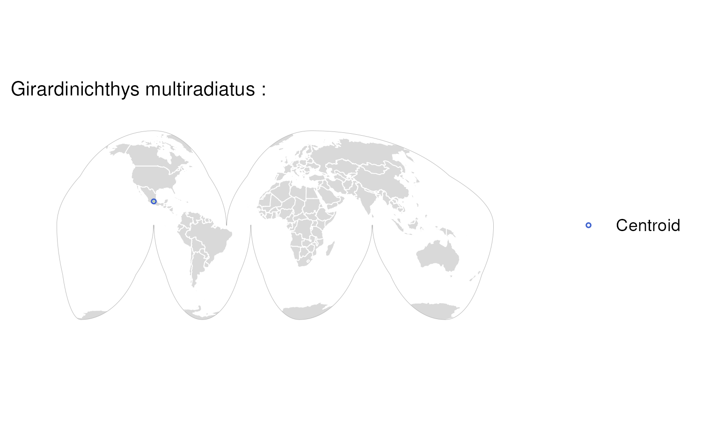

### Species: Gorilla gorilla

**Common Name:** gorilla\
**Biosample:** SAMN04003007\
**Assembly Accession:** GCA_029281585.3\
**Taxon:** Mammals\
**Priority:** 2\
**Flags:** Missing Sampling Location;

**Map Notes:**\
**Comments:** This is the goldenpath principal haplotype containing all
chromosomes. The maternal (JAQQLJ000000000) and paternal
(JAQQLK000000000) haplotypes are also available. The mitochondrial
genome was added to the assembly on May 2024.

### Species: Gouania willdenowi

**Common Name:** blunt-snouted clingfish\
**Biosample:** SAMEA104026382\
**Assembly Accession:** GCA_900634775.2\
**Taxon:** Fishes\
**Priority:** 2\
**Flags:** Missing Sampling Location;

**Map Notes:**\
**Comments:** The assembly fGouWil2.2 is based on 58x PacBio Sequel
data, 67x coverage Illumina HiSeqX data from a 10X Genomics Chromium
library and two-enzyme BioNano Irys data generated at the Wellcome
Sanger Institute as well as 83x coverage HiSeqX data from a Hi-C library
prepared by Arima Genomics. The assembly was made using the Vertebrate
Genomes Project v1.5 assembly pipeline on DNAnexus. An initial PacBio
assembly was made using Falcon-unzip, and retained haplotigs were
identified using purge_haplotigs. The primary contigs were then
scaffolded using the 10X data with scaff10x, then scaffolded further
with BioNano hybrid scaffolding and scaffolded further still using the
Hi-C data with SALSA2. Polishing and gap-filling of both the primary
scaffolds and haplotigs was performed using the PacBio reads and Arrow,
followed by two rounds of Illumina polishing using the 10X data and
freebayes. The mitochondrial assembly was produced at The Rockefeller
University using mitoVGP. Finally, the assembly was manually improved
using gEVAL to correct mis-joins and improve concordance with the
BioNano and Hi-C data. Chromosomes are named by synteny to medaka.

### Species: Lutra lutra

**Common Name:** Eurasian otter\
**Biosample:** SAMEA994731\
**Assembly Accession:** GCA_902655055.2\
**Taxon:** Mammals\
**Priority:** 2\
**Flags:** Missing Sampling Location;

**Map Notes:**\
**Comments:** The assembly mLutLut1.2 is based on 63x PacBio data, 58x
10X Genomics Chromium data, BioNano data and 17x Hi-C data generated at
the Baylor College of Medicine. The assembly process included the
following sequence of steps: initial PacBio assembly generation with
Falcon-unzip, retained haplotig identification with Purge Haplotigs, 10X
based scaffolding with scaff10x, Hi-C based scaffolding and improvement
by the Aiden lab as part of a collaboration with DNA Zoo using 3D-DNA
and Juicebox, Arrow polishing, and two rounds of FreeBayes polishing.
The mitochondrial assembly was produced at The Rockefeller University
using mitoVGP. Finally, the assembly was analysed and manually improved
using gEVAL. Chromosome-scale scaffolds confirmed by the Hi-C data have
been named in order of size.

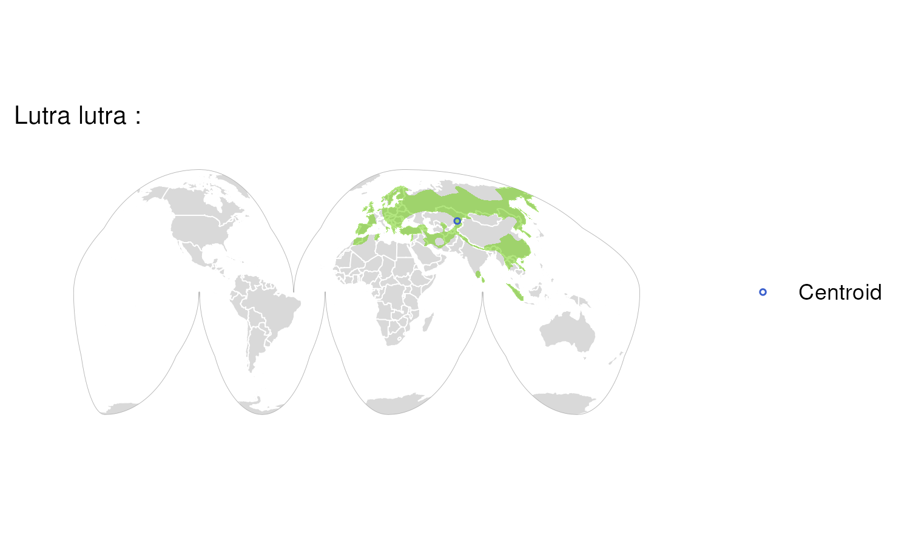

### Species: Lycocorax pyrrhopterus

**Common Name:** paradise crow\
**Biosample:** SAMN15881065\
**Assembly Accession:** GCA_014706295.1\
**Taxon:** Birds\
**Priority:** 2\
**Flags:** Missing Sampling Location;

**Map Notes:**\
**Comments:** NA

### Species: Mastacembelus armatus

**Common Name:** zig-zag eel\
**Biosample:** SAMEA104026378\
**Assembly Accession:** GCA_900324485.3\
**Taxon:** Fishes\
**Priority:** 2\
**Flags:** Missing Sampling Location;

**Map Notes:**\
**Comments:** The assembly fMasArm1.3 is based on 52x PacBio Sequel
data, 99x coverage Illumina HiSeqX data from a 10X Genomics Chromium
library generated at the Wellcome Sanger Institute, as well as
two-enzyme BioNano Saphyr data generated at the Rockefeller University
Vertebrate Genome Laboratory and 245x coverage HiSeqX data from a Hi-C
library prepared by Arima Genomics. An initial PacBio assembly was made
using Falcon-unzip and the primary contigs extended by merging with a
miniasm assembly. The contigs were then scaffolded using the 10X data
with scaff10x, and using synteny with Lates calcarifer (Asian seabass).
After using the PacBio data to gap fill with PBJelly and polish with
Arrow, the assembly was polished again using the 10X Illumina data and
freebayes. Finally, the assembly was further manually curated using
gEVAL to correct mis-joins and improve concordance with the BioNano and
Arima Hi-C data. This was the fMasArm1.1 assembly. A updated fMasArm1.2
assembly has been further curated using the Hi-C data to separate out
haplotigs, identify further breaks and joins and produce
chromosomal-level scaffolds. The further updated fMasArm1.3 assembly
includes a mitochondrial assembly produced at The Rockefeller University
using mitoVGP. Chromosomes have been named by synteny to medaka.

### Species: Microcaecilia unicolor

**Common Name:** tiny cayenne caecilian\
**Biosample:** SAMEA104387962\
**Assembly Accession:** GCA_901765095.2\
**Taxon:** Amphibians\
**Priority:** 2\
**Flags:** Missing Sampling Location;

**Map Notes:**\
**Comments:** The assembly aMicUni1.2 is based on 53x PacBio data, 52x
coverage 10X Genomics Chromium data, BioNano data and 25x coverage Arima
Hi-C data generated at the Wellcome Sanger Institute. The assembly
process included the following sequence of steps: initial PacBio
assembly generation with Falcon-unzip, retained haplotig identification
with Purge Haplotigs, 10X based scaffolding with scaff10x, BioNano
hybrid-scaffolding, Hi-C based scaffolding with SALSA2, Arrow polishing,
and two rounds of FreeBayes polishing. The mitochondrial assembly was
produced at The Rockefeller University using mitoVGP. Finally, the
assembly was analysed and manually improved using gEVAL.
Chromosome-scale scaffolds confirmed by the Hi-C data have been named in
order of size.

### Species: Micropterus salmoides

**Common Name:** large-mouth bass\
**Biosample:** SAMN15783178\
**Assembly Accession:** GCA_019677235.1\
**Taxon:** Fishes\
**Priority:** 2\
**Flags:** Missing Sampling Location;

**Map Notes:**\
**Comments:** NA

### Species: Myripristis murdjan

**Common Name:** pinecone soldierfish\
**Biosample:** SAMEA4872133\
**Assembly Accession:** GCA_902150065.1\
**Taxon:** Fishes\
**Priority:** 2\
**Flags:** Missing Sampling Location;

**Map Notes:**\
**Comments:** The assembly fMyrMur1.1 is based on 45x PacBio data, 89x
coverage 10X Genomics Chromium data, BioNano data and 39x coverage Arima
Hi-C data generated at the Wellcome Sanger Institute. The assembly
process included the following sequence of steps: initial PacBio
assembly generation with Falcon-unzip, retained haplotig identification
with purge_dups, 10X based scaffolding with scaff10x, BioNano
hybrid-scaffolding, Hi-C based scaffolding with SALSA2, Arrow polishing,
and two rounds of FreeBayes polishing. Finally, the assembly was
analysed and manually improved using gEVAL. Chromosome-scale scaffolds
are named by synteny to medaka.

### Species: Oenanthe melanoleuca

**Common Name:** eastern black-eared wheatear\
**Biosample:** SAMN33408179\
**Assembly Accession:** GCA_029582105.1\
**Taxon:** Birds\
**Priority:** 2\
**Flags:** Missing Sampling Location;

**Map Notes:**\
**Comments:** NA

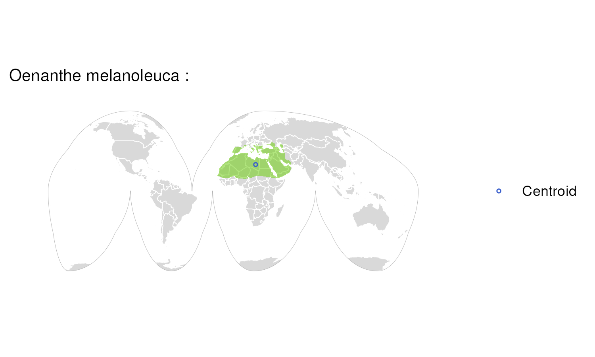

### Species: Onychomys torridus

**Common Name:** Southern grasshopper mouse\
**Biosample:** SAMEA104026389\
**Assembly Accession:** GCA_903995425.1\
**Taxon:** Mammals\
**Priority:** 2\
**Flags:** Missing Sampling Location;

**Map Notes:**\
**Comments:** The assembly mOncTor1.1 is based on 59x PacBio data, 77x
10X Genomics Chromium data, and BioNano data generated at the Wellcome
Sanger Institute. The assembly process included the following sequence
of steps: initial PacBio assembly generation with Falcon and an separate
initial assembly with miniasm, scaffolding of the Falcon contigs using
the miniasm assembly as a guide with cross_genome, scaffolding with
scaff10x, contig breaking with break10x, gap filling with PBJelly,
polishing using Arrow, polishing using Illumina data with Freebayes, and
manual curation, including use of synteny with assembly GCA_003704035.1
of Peromyscus maniculatus bairdii. Chromosome-scale scaffolds are based
on chromosome painting with Mus musculus fosmids. Autosomes are named in
order of longer arm length.

### Species: Ornithorhynchus anatinus

**Common Name:** platypus\
**Biosample:** SAMN08537700\
**Assembly Accession:** GCA_004115215.4\
**Taxon:** Mammals\
**Priority:** 2\
**Flags:** Missing Sampling Location;

**Map Notes:**\
**Comments:** This assembly represents the principal haplotype of the
diploid genome Ornithorhynchus anatinus and includes the chromosomes.
The alternate haplotype sequences are in WGS project RZJU00000000

### Species: Pan paniscus

**Common Name:** bonobo\
**Biosample:** SAMN13935689\
**Assembly Accession:** GCA_029289425.3\
**Taxon:** Mammals\
**Priority:** 2\
**Flags:** Missing Sampling Location;

**Map Notes:**\
**Comments:** This is the goldenpath principal haplotype containing all
chromosomes. The maternal (JAQQLL000000000) and paternal
(JAQQLM000000000) haplotypes are also available. The mitochondrial
genome was added to the assembly on May 2024.

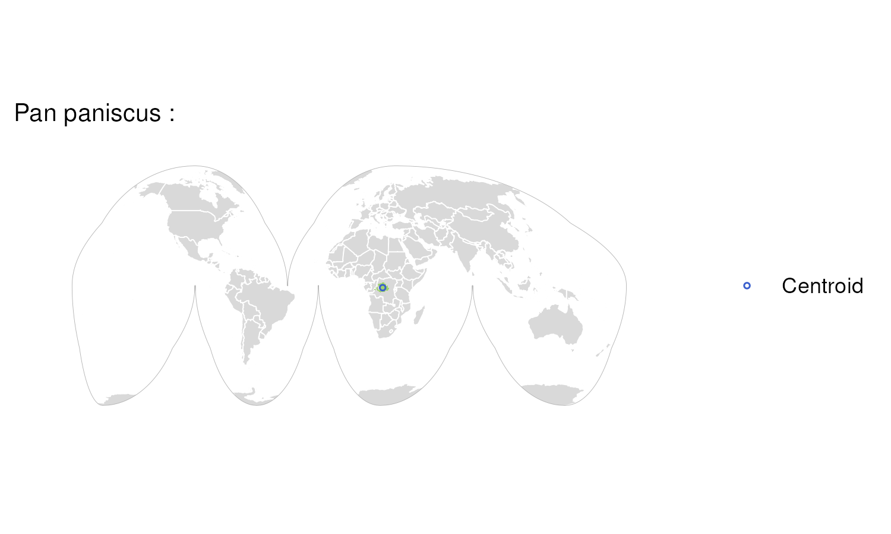

### Species: Pan troglodytes

**Common Name:** chimpanzee\
**Biosample:** SAMN30216104\
**Assembly Accession:** GCA_028858775.2\
**Taxon:** Mammals\
**Priority:** 2\
**Flags:** Missing Sampling Location;

**Map Notes:**\
**Comments:** The mitochondrial genome was added to the assembly on May
2024.

### Species: Parambassis ranga

**Common Name:** Indian glassy fish\
**Biosample:** SAMEA4675621\
**Assembly Accession:** GCA_900634625.2\
**Taxon:** Fishes\
**Priority:** 2\
**Flags:** Missing Sampling Location;

**Map Notes:**\
**Comments:** The assembly fParRan2.2 is based on 101x PacBio Sequel
data, 122x coverage Illumina HiSeqX data from a 10X Genomics Chromium
library generated at the Wellcome Sanger Institute as well as BioNano
Saphyr DLE data generated at the Rockefeller University Vertebrate
Genome Laboratory and 108x coverage HiSeqX data from a Hi-C library
prepared by Arima Genomics. An initial PacBio assembly was made using
Falcon-unzip, and retained haplotigs were identified using
purge_haplotigs. The primary contigs were then scaffolded using the 10X
data with scaff10x, then scaffolded further with BioNano hybrid
scaffolding and scaffolded further still using the Hi-C data with
SALSA2. Polishing and gap-filling of both the primary scaffolds and
haplotigs was performed using the PacBio reads and Arrow, followed by
two rounds of Illumina polishing using the 10X data and freebayes. The
mitochondrial assembly was produced at The Rockefeller University using
mitoVGP. Finally, the assembly was manually improved using gEVAL to
correct mis-joins and improve concordance with the BioNano and Hi-C
data. Chromosomes are named by synteny to medaka.

### Species: Pipistrellus pipistrellus

**Common Name:** common pipistrelle\
**Biosample:** SAMEA994724\
**Assembly Accession:** GCA_903992545.1\
**Taxon:** Mammals\
**Priority:** 2\
**Flags:** Missing Sampling Location;

**Map Notes:**\
**Comments:** The assembly mPipPip1.1 is based on 62x PacBio data, 34x
10X Genomics Chromium data, and 58x Arima Hi-C data generated at the
Wellcome Sanger Institute. The Hi-C data was derived from a separate
sample, mPipPip2. The assembly process included the following sequence
of steps: initial PacBio assembly generation with Falcon-unzip, retained
haplotig separation with purge_dups, 10X based scaffolding with
scaff10x, Hi-C based scaffolding with SALSA2, Arrow polishing, two
rounds of FreeBayes polishing. The mitochondrial assembly was produced
at The Rockefeller University using mitoVGP. Finally, the assembly was
analysed and manually improved using gEVAL. Chromosome-scale scaffolds
confirmed by the Hi-C data have been named in order of size.

### Species: Pleurodeles waltl

**Common Name:** Iberian ribbed newt\
**Biosample:** SAMN28911188\
**Assembly Accession:** GCA_026652325.1\
**Taxon:** Amphibians\
**Priority:** 2\
**Flags:** Missing Sampling Location;

**Map Notes:**\
**Comments:** Chromsomes 1, 2, 3 and 4 have been assembled into a single
sequence each. However, they had to be split into two pieces because the
chromosome length exceed the technical limit of roughly 2.14 billion
base pairs. The chromosomes were separated at the centromere. Sequences
JANPWB010000001.1-JANPWB010000008.1 are the pieces of these split
chromosomes.

### Species: Pongo abelii

**Common Name:** Sumatran orangutan\
**Biosample:** SAMN10521808\
**Assembly Accession:** GCA_028885655.2\
**Taxon:** Mammals\
**Priority:** 2\
**Flags:** Missing Sampling Location;

**Map Notes:**\
**Comments:** The mitochondrial genome was added to the assembly on May
2024.

### Species: Pongo pygmaeus

**Common Name:** Bornean orangutan\
**Biosample:** SAMN10521809\
**Assembly Accession:** GCA_028885625.2\
**Taxon:** Mammals\
**Priority:** 2\
**Flags:** Missing Sampling Location;

**Map Notes:**\
**Comments:** The mitochondrial genome was added to the assembly on May
2024.

### Species: Protopterus annectens

**Common Name:** West African lungfish\
**Biosample:** SAMN26533844\
**Assembly Accession:** GCA_040939525.1\
**Taxon:** Fishes\
**Priority:** 2\
**Flags:** Missing Sampling Location;

**Map Notes:**\
**Comments:** All chromosomes were each assembled into a single
sequence. However chromosomes 1 and 2 had to be split into 3 pieces and
chromosomes 3-8 had to be split into 2 pieces because the chromosome
length exceeds the technical limit of roughly 2.14 billion base pairs.
All of the pieces are treated as chromosomes so the chromosome number in
the assembly is 27.

### Species: Rhinatrema bivittatum

**Common Name:** two-lined caecilian\
**Biosample:** SAMEA104387956\
**Assembly Accession:** GCA_901001135.2\
**Taxon:** Amphibians\
**Priority:** 2\
**Flags:** Missing Sampling Location;

**Map Notes:**\
**Comments:** The assembly aRhiBiv1.2 is based on 43x PacBio data and
41x coverage 10X Genomics Chromium data generated at the Wellcome Sanger
Institute, BioNano data generated by BioNano Genomics, and 39x coverage
Hi-C data generated at the Wellcome Sanger Institute using a library
created by Arima Genomics. The assembly process included the following
sequence of steps: initial PacBio assembly generation with Falcon-unzip,
retained haplotig identification with Purge Haplotigs, 10X based
scaffolding with scaff10x, BioNano hybrid-scaffolding, Hi-C based
scaffolding with SALSA2, Arrow polishing, and two rounds of FreeBayes
polishing. The mitochondrial assembly was produced at The Rockefeller
University using mitoVGP. Finally, the assembly was analysed and
manually improved using gEVAL. Chromosome-scale scaffolds confirmed by
the Hi-C data have been named in order of size.

### Species: Salarias fasciatus

**Common Name:** jewelled blenny\
**Biosample:** SAMEA4966329\
**Assembly Accession:** GCA_902148845.1\
**Taxon:** Fishes\
**Priority:** 2\
**Flags:** Missing Sampling Location;

**Map Notes:**\
**Comments:** The assembly fSalaFa1.1 is based on 96x PacBio data, 61x
coverage 10X Genomics Chromium data, and 89x coverage Dovetail Hi-C data
generated at the Wellcome Sanger Institute, and BioNano data generated
by the DeepSeq facility at the University of Nottingham. The assembly
process included the following sequence of steps: initial PacBio
assembly generation with Falcon-unzip, retained haplotig identification
with Purge Haplotigs, 10X based scaffolding with scaff10x, BioNano
hybrid-scaffolding, Hi-C based scaffolding with SALSA2, Arrow polishing,
and two rounds of FreeBayes polishing. Finally, the assembly was
analysed and manually improved using gEVAL. Chromosome-scale scaffolds
are named by synteny to the GCA_000188235.1 assembly of Nile Tilapia
(Oreochromis niloticus).

### Species: Salmo trutta

**Common Name:** brown trout\
**Biosample:** SAMEA994732\
**Assembly Accession:** GCA_901001165.2\
**Taxon:** Fishes\
**Priority:** 2\
**Flags:** Missing Sampling Location;

**Map Notes:**\
**Comments:** The assembly fSalTru1.2 is based on 68x PacBio data and
70x coverage 10X Genomics Chromium data generated at the Wellcome Sanger
Institute, as well as BioNano data generated at the Rockefeller
University Vertebrate Genome Laboratory and 28x coverage Hi-C data
generated by Arima Genomics. The assembly process included the following
sequence of steps: initial PacBio assembly generation with Falcon-unzip,
retained haplotig identification with Purge Haplotigs, 10X based
scaffolding with scaff10x, BioNano hybrid-scaffolding, Hi-C based
scaffolding with SALSA2, Arrow polishing, and two rounds of FreeBayes
polishing. The mitochondrial assembly was produced at The Rockefeller
University using mitoVGP. Finally, the assembly was analysed and
manually improved using gEVAL. Chromosome-scale scaffolds confirmed by
the Hi-C data have been named on the following basis: first they were
assigned as metacentric versus acrocentric based on a Salmo trutta
linkage map and synteny with the Salmo salar assembly GCA_000233375.4;
numbers 1 to 11 are metacentric, numbers 12 to 40 are acrocentric, and
within each of those two categories they are named in order of size.

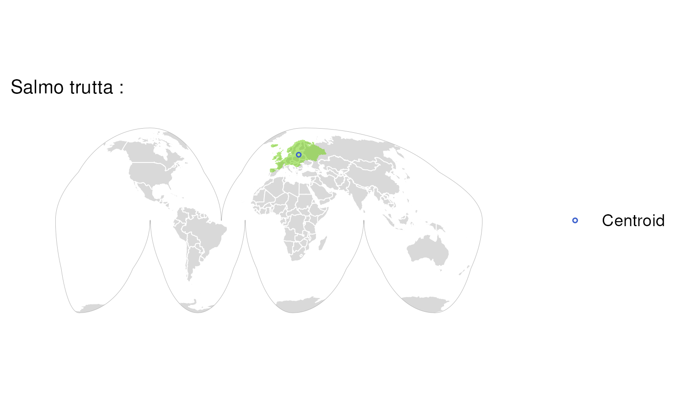

### Species: Sciurus carolinensis

**Common Name:** grey squirrel\
**Biosample:** SAMEA994726\
**Assembly Accession:** GCA_902686445.2\
**Taxon:** Mammals\
**Priority:** 2\
**Flags:** Missing Sampling Location;

**Map Notes:**\
**Comments:** The assembly mSciCar1.2 is based on 74x PacBio data, 40x
10X Genomics Chromium data, and 42x Dovetail Hi-C data generated at the
Wellcome Sanger Institute. The assembly process included the following
sequence of steps: initial PacBio assembly generation with Falcon-unzip,
retained haplotig identification with purge_dups, 10X based scaffolding
with scaff10x, Hi-C based scaffolding with SALSA2, Arrow polishing, and
two rounds of FreeBayes polishing. The mitochondrial assembly was
produced at The Rockefeller University using mitoVGP. Finally, the
assembly was analysed and manually improved using gEVAL. Since Hi-C data
were sparse, curation was aided by synteny with the assembly for Sciurus
vulgaris simultaneously being curated by the Wellcome Sanger Institute.
Chromosome-scale scaffolds confirmed by the Hi-C data and synteny have
been named in order of size.

### Species: Sciurus vulgaris

**Common Name:** Eurasian red squirrel\
**Biosample:** SAMEA994733\
**Assembly Accession:** GCA_902686455.2\
**Taxon:** Mammals\
**Priority:** 2\
**Flags:** Missing Sampling Location;

**Map Notes:**\
**Comments:** The assembly mSciVul1.2 is based on 23x PacBio data and
44x 10X Genomics Chromium data generated at the Wellcome Sanger
Institute, BioNano data generated at the Rockefeller University
Vertebrate Genome Laboratory, and 17x Hi-C data generated at the Baylor
College of Medicine. The assembly process included the following
sequence of steps: initial PacBio assembly generation with Falcon-unzip,
retained haplotig identification with purge_dups, 10X based scaffolding
with scaff10x, BioNano hybrid-scaffolding, Hi-C based scaffolding and
improvement by the Aiden lab as part of a collaboration with DNA Zoo
using 3D-DNA and Juicebox, Arrow polishing, and two rounds of FreeBayes
polishing. The mitochondrial assembly was produced at The Rockefeller
University using mitoVGP. Finally, the assembly was analysed and
manually improved using gEVAL. Chromosome-scale scaffolds confirmed by
the Hi-C data have been named in order of size.

### Species: Scleropages formosus

**Common Name:** golden arowana\
**Biosample:** SAMEA4872123\
**Assembly Accession:** GCA_900964775.1\
**Taxon:** Fishes\
**Priority:** 2\
**Flags:** Missing Sampling Location;

**Map Notes:**\
**Comments:** The assembly fSclFor1.1 is based on 72x PacBio data, 88x
coverage 10X Genomics Chromium data, BioNano data and 67x coverage Arima
Hi-C data generated at the Wellcome Sanger Institute. The assembly
process included the following sequence of steps: initial PacBio
assembly generation with Falcon-unzip, retained haplotig identification
with Purge Haplotigs, 10X based scaffolding with scaff10x, BioNano
hybrid-scaffolding, Hi-C based scaffolding with SALSA2, Arrow polishing,
and two rounds of FreeBayes polishing. Finally, the assembly was
analysed and manually improved using gEVAL. Chromosome-scale scaffolds
confirmed by the Hi-C data have been named in order of size.

### Species: Scyliorhinus canicula

**Common Name:** small-spotted catshark\
**Biosample:** SAMEA994730\
**Assembly Accession:** GCA_902713615.2\
**Taxon:** Fishes\
**Priority:** 2\
**Flags:** Missing Sampling Location;

**Map Notes:**\
**Comments:** The assembly sScyCan1.2 is based on 63x PacBio data, 43x
10X Genomics Chromium data, and BioNano data generated at the Wellcome
Sanger Institute, and 17x Hi-C data generated at the Baylor College of
Medicine. The assembly process included the following sequence of steps:
initial PacBio assembly generation with Falcon-unzip, retained haplotig
identification with purge_dups, 10X based scaffolding with scaff10x,
BioNano hybrid-scaffolding, Hi-C based scaffolding and improvement by
the Aiden lab as part of a collaboration with DNA Zoo using 3D-DNA and
Juicebox, Arrow polishing, and two rounds of FreeBayes polishing.
Finally, the assembly was analysed and manually improved using gEVAL.
Chromosome-scale scaffolds confirmed by the Hi-C data have been named in
order of size.

### Species: Sparus aurata

**Common Name:** gilthead seabream\
**Biosample:** SAMEA104384835\
**Assembly Accession:** GCA_900880675.2\
**Taxon:** Fishes\
**Priority:** 2\
**Flags:** Missing Sampling Location;

**Map Notes:**\
**Comments:** The assembly fSpaAur1.2 is based on 56x PacBio Sequel
data, 62x coverage Illumina HiSeqX data from a 10X Genomics Chromium
library generated at the Wellcome Sanger Institute, as well as 71x
coverage HiSeqX data from a Hi-C library prepared by Arima Genomics. An
initial PacBio assembly was made using Falcon-unzip, and retained
haplotigs were identified using purge_haplotigs. The primary contigs
were then scaffolded using the 10X data with scaff10x, then scaffolded
further using the Hi-C data with SALSA2. Polishing and gap-filling of
both the primary scaffolds and haplotigs was performed using the PacBio
reads and Arrow, followed by two rounds of Illumina polishing using the
10X data and freebayes. The mitochondrial assembly was produced at The
Rockefeller University using mitoVGP. Finally, the assembly was manually
improved using gEVAL to correct mis-joins and improve concordance with
the raw data. Chromosomes are named according to synteny with the
GCA_003309015.1 assembly of Sparus aurata.

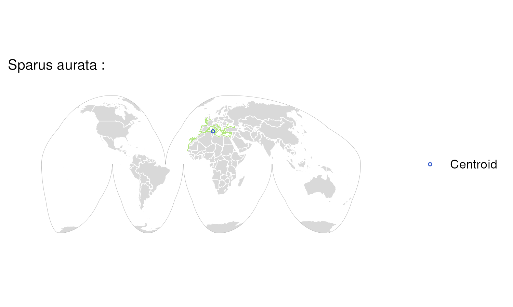

### Species: Sphaeramia orbicularis

**Common Name:** orbiculate cardinalfish\
**Biosample:** SAMEA4966328\
**Assembly Accession:** GCA_902148855.1\
**Taxon:** Fishes\
**Priority:** 2\
**Flags:** Missing Sampling Location;

**Map Notes:**\
**Comments:** The assembly fSphaOr1.1 is based on 53x PacBio data, 40x
coverage 10X Genomics Chromium data, BioNano data and 46x coverage Arima
Hi-C data generated at the Wellcome Sanger Institute. The assembly
process included the following sequence of steps: initial PacBio
assembly generation with Falcon-unzip, retained haplotig identification
with Purge Haplotigs, 10X based scaffolding with scaff10x, BioNano
hybrid-scaffolding, Hi-C based scaffolding with SALSA2, Arrow polishing,
and two rounds of FreeBayes polishing. Finally, the assembly was
analysed and manually improved using gEVAL. Chromosome-scale scaffolds
are named by synteny to medaka.

### Species: Streptopelia turtur

**Common Name:** European turtle dove\
**Biosample:** SAMEA994735\
**Assembly Accession:** GCA_901699155.2\
**Taxon:** Birds\
**Priority:** 2\
**Flags:** Missing Sampling Location;

**Map Notes:**\
**Comments:** The assembly bStrTur1.2 is based on 44x PacBio data, 62x
coverage 10X Genomics Chromium data, and BioNano data generated at the
Wellcome Sanger Institute, and 106x coverage Hi-C data generated by
Arima Genomics. The assembly process included the following sequence of
steps: initial PacBio assembly generation with Falcon-unzip, retained
haplotig identification with Purge Haplotigs, 10X based scaffolding with
scaff10x, BioNano hybrid-scaffolding, Hi-C based scaffolding with
SALSA2, Arrow polishing, and two rounds of FreeBayes polishing. Finally,
the assembly was analysed and manually improved using gEVAL.
Chromosome-scale scaffolds are named by synteny to Gallus gallus.

### Species: Symphalangus syndactylus

**Common Name:** siamang gibbon\
**Biosample:** SAMN30216103\
**Assembly Accession:** GCA_028878055.3\
**Taxon:** Mammals\
**Priority:** 2\
**Flags:** Missing Sampling Location;

**Map Notes:**\
**Comments:** The mitochondrial genome was added to the assembly on May
2024.

### Species: Syngnathus acus

**Common Name:** greater pipefish\
**Biosample:** SAMEA104381750\
**Assembly Accession:** GCA_901709675.2\
**Taxon:** Fishes\
**Priority:** 2\
**Flags:** Missing Sampling Location;

**Map Notes:**\
**Comments:** The assembly fSynAcu1.2 is based on 96x PacBio data, 190x
coverage 10X Genomics Chromium data, and 159x coverage Dovetail Hi-C
data generated at the Wellcome Sanger Institute. The assembly process
included the following sequence of steps: initial PacBio assembly
generation with Falcon-unzip, retained haplotig identification with
Purge Haplotigs, 10X based scaffolding with scaff10x, Hi-C based
scaffolding with SALSA2, Arrow polishing, and two rounds of FreeBayes
polishing. The mitochondrial assembly was produced at The Rockefeller
University using mitoVGP. Finally, the assembly was analysed and
manually improved using gEVAL. Chromosome-scale scaffolds are named by
synteny to medaka.

### Species: Takifugu rubripes

**Common Name:** Japanese puffer (torafugu)\
**Biosample:** SAMEA104384834\
**Assembly Accession:** GCA_901000725.3\
**Taxon:** Fishes\
**Priority:** 2\
**Flags:** Missing Sampling Location;

**Map Notes:**\
**Comments:** The assembly fTakRub1.3 is based on 83x PacBio Sequel
data, 70x coverage Illumina HiSeqX data from a 10X Genomics Chromium
library generated at the Wellcome Sanger Institute as well as BioNano
Saphyr DLE data generated at the Rockefeller University Vertebrate
Genome Laboratory and 51x coverage HiSeqX data from a Hi-C library
prepared by Arima Genomics. An initial PacBio assembly was made using
Falcon-unzip, and retained haplotigs were identified using
purge_haplotigs. The primary contigs were then scaffolded using the 10X
data with scaff10x, then scaffolded further with BioNano hybrid
scaffolding and scaffolded further still using the Hi-C data with
SALSA2. Polishing and gap-filling of both the primary scaffolds and
haplotigs was performed using the PacBio reads and Arrow, followed by
two rounds of Illumina polishing using the 10X data and freebayes. The
mitochondrial assembly was produced at The Rockefeller University using
mitoVGP. Finally, the assembly was manually improved using gEVAL to
correct mis-joins and improve concordance with the BioNano and Hi-C
data. Chromosome-scale scaffolds are named by synteny to the
GCA_000180615.2 assembly of Takifugu rubripes.

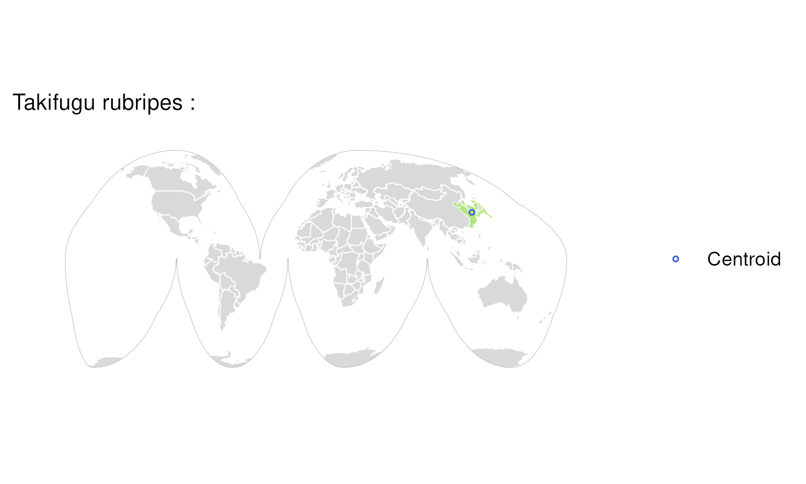

### Species: Thalassophryne amazonica

**Common Name:** prehistoric monster fish\
**Biosample:** SAMEA104129913\
**Assembly Accession:** GCA_902500255.1\
**Taxon:** Fishes\
**Priority:** 2\
**Flags:** Missing Sampling Location;

**Map Notes:**\
**Comments:** The assembly fThaAma1.1 is based on 67x PacBio data, 48x
10X Genomics Chromium data, BioNano data and 13x Arima Hi-C data
generated at the Wellcome Sanger Institute. The assembly process
included the following sequence of steps: initial PacBio assembly
generation with Falcon-unzip, retained haplotig identification with
purge_dups, 10X based scaffolding with scaff10x, BioNano
hybrid-scaffolding, Hi-C based scaffolding with SALSA2, Arrow polishing,
and two rounds of FreeBayes polishing. Finally, the assembly was
analysed and manually improved using gEVAL. Chromosome-scale scaffolds
confirmed by the Hi-C data have been named in order of size.

### Species: Tupaia tana

**Common Name:** large treeshrew\
**Biosample:** SAMN07678117\
**Assembly Accession:** GCA_026018925.1\
**Taxon:** Mammals\
**Priority:** 2\
**Flags:** Missing Sampling Location;

**Map Notes:**\
**Comments:** NA

### Species: Carettochelys insculpta

**Common Name:** pig-nosed turtle\
**Biosample:** SAMN38222597\
**Assembly Accession:** GCA_033958435.1\
**Taxon:** Reptiles\
**Priority:** 3\
**Flags:** Outside Range; Vague Location;

**Map Notes:**\
**Comments:** NA

### Species: Electrophorus electricus

**Common Name:** electric eel\
**Biosample:** SAMN42883346\
**Assembly Accession:** GCA_041902795.1\
**Taxon:** Fishes\
**Priority:** 3\
**Flags:** Outside Range; Vague Location;

**Map Notes:**\
**Comments:** NA

### Species: Epinephelus lanceolatus

**Common Name:** giant grouper\
**Biosample:** SAMN41784231\
**Assembly Accession:** GCA_041903045.1\
**Taxon:** Fishes\
**Priority:** 3\
**Flags:** Outside Range; Vague Location;

**Map Notes:**\
**Comments:** NA

### Species: Lateolabrax maculatus

**Common Name:** Chinese sea bass\
**Biosample:** SAMN36708487\
**Assembly Accession:** GCA_031216445.1\
**Taxon:** Fishes\
**Priority:** 3\
**Flags:** Outside Range; Vague Location;

**Map Notes:**\
**Comments:** NA

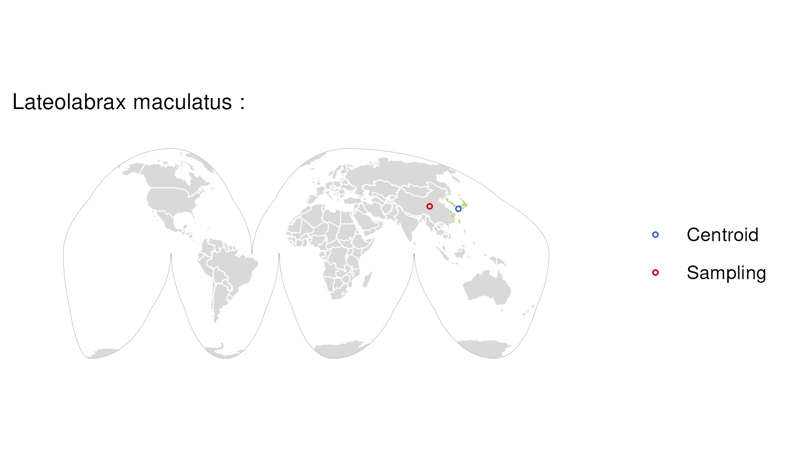

### Species: Notoryctes typhlops

**Common Name:** Southern marsupial mole\
**Biosample:** SAMN45131536\
**Assembly Accession:** GCA_048126345.1\
**Taxon:** Mammals\
**Priority:** 3\
**Flags:** Outside Range; Vague Location;

**Map Notes:**\
**Comments:** NA

### Species: Phascolarctos cinereus

**Common Name:** koala\
**Biosample:** SAMN06198159\
**Assembly Accession:** GCA_003287225.2\
**Taxon:** Mammals\
**Priority:** 3\
**Flags:** Outside Range; Vague Location;

**Map Notes:**\
**Comments:** NA

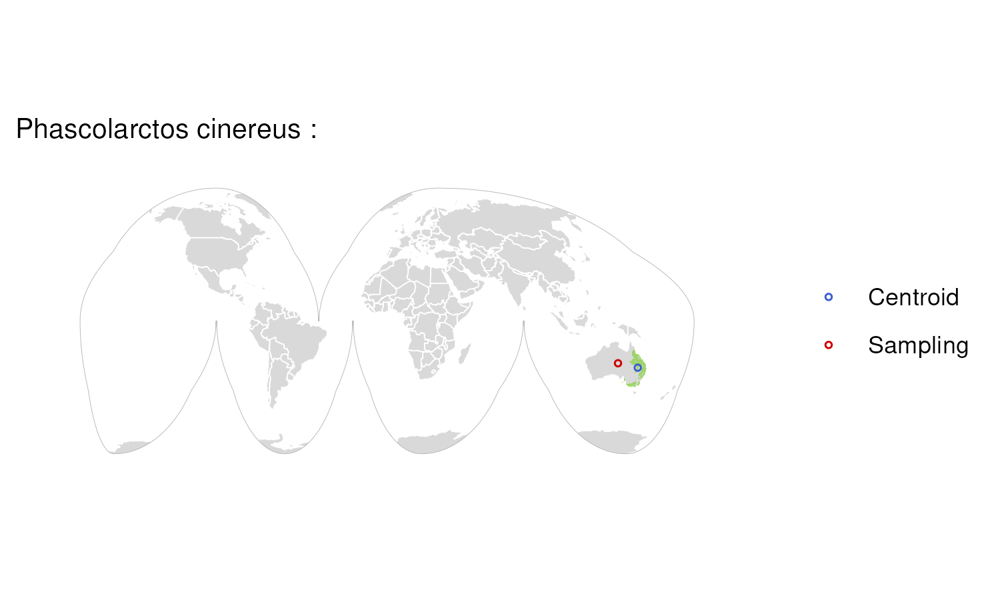

### Species: Polymixia cf. hollisterae

**Common Name:** Bermuda beardfish\
**Biosample:** SAMN42899157\
**Assembly Accession:** GCA_048537225.1\
**Taxon:** Fishes\
**Priority:** 3\
**Flags:** Vague Location; Missing Range;

**Map Notes:**\
**Comments:** NA

### Species: Acomys minous

**Common Name:** Crete spiny mouse\
**Biosample:** SAMEA112751364\
**Assembly Accession:** GCA_964271855.1\
**Taxon:** Mammals\
**Priority:** 4\
**Flags:** Outside Range;

**Map Notes:**\
**Comments:** Genome assembly of Acomys minous. This assembly is
provided by the European Reference Genome Atlas (ERGA,
<https://www.erga-biodiversity.eu/>) via the Biodiversity Genomics
Europe project (BGE, <https://biodiversitygenomics.eu/>).

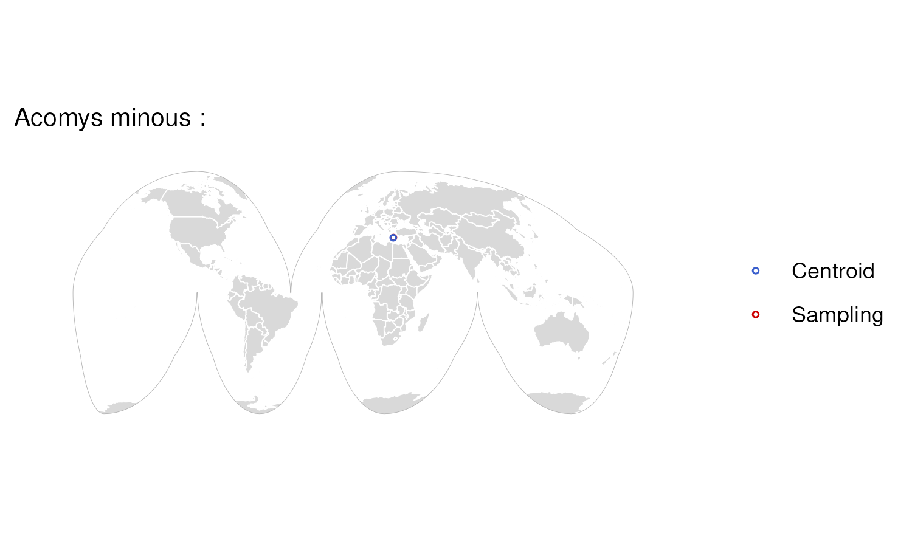

### Species: Acridotheres tristis

**Common Name:** common myna\
**Biosample:** SAMN28454388\
**Assembly Accession:** GCA_027559615.1\
**Taxon:** Birds\
**Priority:** 4\
**Flags:** Outside Range;

**Map Notes:**\
**Comments:** NA

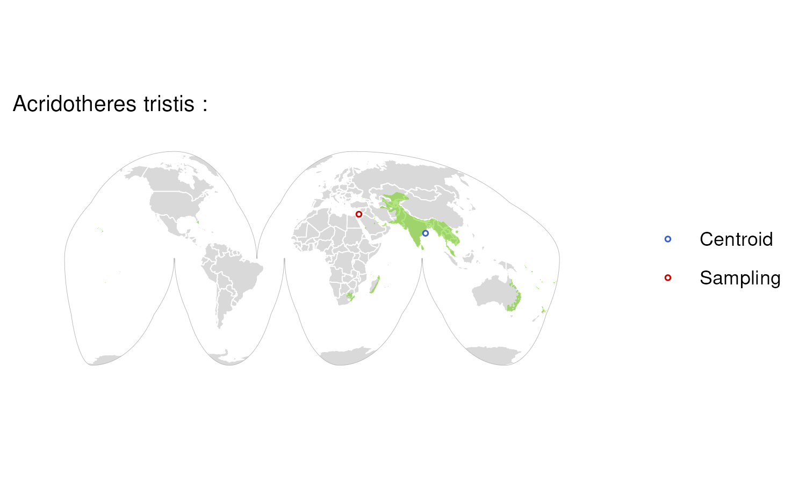

### Species: Ambystoma mexicanum x Ambystoma tigrinum

**Common Name:** axolotl\
**Biosample:** SAMN43142723\
**Assembly Accession:** GCA_040938575.1\
**Taxon:** Amphibians\
**Priority:** 4\
**Flags:** Outside Range;

**Map Notes:**\
**Comments:** Chromosomes 1, 2, 3, 4, 5, 6, and 7 have been assembled
into a single sequence each. However, they had to be split into two
pieces because the chromosome length exceeds the technical limit of
roughly 2.14 billion base pairs. The chromosomes are separated at the
centromere.

This is the maternal pseudohaplotype assembly created from the genome
sequence of the F1 female progeny (isolate Amex_F1_6; BioSample
SAMN41071122) of a cross between a female Ambystoma mexicanum (isolate
Mex_15411; BioSample SAMN43142723) and male Ambystoma tigrinum (isolate
Tig_M23; BioSample SAMN43142724).

### Species: Anser brachyrhynchus

**Common Name:** pink-footed goose\
**Biosample:** SAMEA112468040\
**Assembly Accession:** GCA_964034855.1\
**Taxon:** Birds\
**Priority:** 4\
**Flags:** Outside Range;

**Map Notes:**\
**Comments:** The assembly bAnsBra1.1 is based on 38x PacBio data and
Arima2 Hi-C data generated by the Darwin Tree of Life Project
(<https://www.darwintreeoflife.org/>). The assembly process included the
following sequence of steps: initial PacBio assembly generation with
Hifiasm, retained haplotig separation with purge_dups, and Hi-C based
scaffolding with YaHS. The mitochondrial genome was assembled using
MitoHiFi. Finally, the primary assembly was analysed and manually
improved using TreeVal. Chromosome-scale scaffolds confirmed by the Hi-C
data have been named in order of size. Note that the PAR region is
collapsed and represented on Chromosome W only.

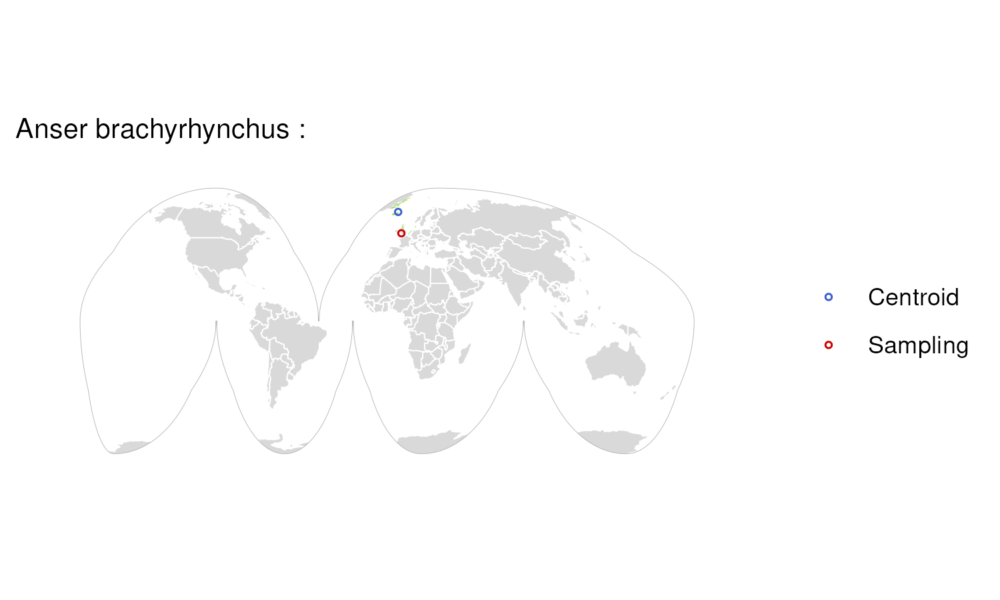

### Species: Antennarius maculatus

**Common Name:** warty frogfish\
**Biosample:** SAMN12623626\
**Assembly Accession:** GCA_013358685.1\
**Taxon:** Fishes\
**Priority:** 4\
**Flags:** Outside Range;

**Map Notes:**\
**Comments:** This assembly represents the principal haplotype of the
diploid genome Antennarius maculatus and includes the chromosomes. The
alternate haplotype sequences are in WGS project JABVMD000000000

### Species: Ara ararauna

**Common Name:** blue-and-gold macaw\
**Biosample:** SAMN33059336\
**Assembly Accession:** GCA_028858755.1\
**Taxon:** Birds\
**Priority:** 4\
**Flags:** Outside Range;

**Map Notes:**\
**Comments:** Both haplotypes were curated, but haplotype 1 is more
complete

### Species: Archocentrus centrarchus

**Common Name:** flier cichlid\
**Biosample:** SAMN09948522\
**Assembly Accession:** GCA_007364275.2\
**Taxon:** Fishes\
**Priority:** 4\
**Flags:** Outside Range;

**Map Notes:**\
**Comments:** This assembly represents the principal haplotype of the
diploid genome Archocentrus centrarchus and includes the chromosomes.
The alternate haplotype sequences are in WGS project STFW00000000.

### Species: Arvicanthis niloticus

**Common Name:** Nile rat\
**Biosample:** SAMN12611849\
**Assembly Accession:** GCA_011762505.3\
**Taxon:** Mammals\
**Priority:** 4\
**Flags:** Outside Range;

**Map Notes:**\
**Comments:** This is the trio assembly merged haplotype data. The
maternal and paternal haplotype sequences are in WGS projects
JAAOME000000000 and JAAOMF000000000 respectively.

Chromosome assignments were updated on this assembly on January 2025.

### Species: Astatotilapia calliptera

**Common Name:** Eastern happy\
**Biosample:** SAMEA112818850\
**Assembly Accession:** GCA_964374335.1\
**Taxon:** Fishes\
**Priority:** 4\
**Flags:** Outside Range;

**Map Notes:**\
**Comments:** The assembly fAstCal68 is based on 65x ONT simplex data
generated at the University of Cambridge and Arima2 Hi-C data generated
by the Wellcome Sanger Institute Tree of Life Programme
(<https://www.sanger.ac.uk/programme/tree-of-life/>). The assembly
process included the following sequence of steps: initial ONT error
correction with herro, then assembly generation with Hifiasm, retained
haplotig separation with purge_dups, and Hi-C based scaffolding with
YaHS. The mitochondrial genome was assembled using MitoHiFi. Finally,
the primary assembly was analysed and manually improved using TreeVal.
Chromosome-scale scaffolds confirmed by the Hi-C data have been named
according to standard Malawi cichlid nomenclature.

### Species: Aulonocara stuartgranti

**Common Name:** flavescent peacock cichlid\
**Biosample:** SAMEA112818851\
**Assembly Accession:** GCA_965226115.1\
**Taxon:** Fishes\
**Priority:** 4\
**Flags:** Outside Range;

**Map Notes:**\
**Comments:** The assembly fAulStu2.1 is based on 18x ONT duplex data
generated at the University of Cambridge and Arima2 Hi-C data generated
at the University of Bern. The assembly process included the following
sequence of steps: ONT duplex reads assembled with Hifiasm, retained
haplotig separation with purge_dups, and Hi-C based scaffolding with
YaHS. The mitochondrial genome was assembled using MitoHiFi. Finally,
the primary assembly was analysed and manually improved using TreeVal.
Chromosome-scale scaffolds confirmed by the Hi-C data have been named
according to standard Malawi cichlid nomenclature.

### Species: Balaenoptera ricei

**Common Name:** Rice’s whale\
**Biosample:** SAMN32629060\
**Assembly Accession:** GCA_028023285.1\
**Taxon:** Mammals\
**Priority:** 4\
**Flags:** Outside Range;

**Map Notes:**\
**Comments:** the mBalRic1.alt.cur.20221125.fasta file contains one
false haplotype duplication contig removed from Haplotype 2 assembly

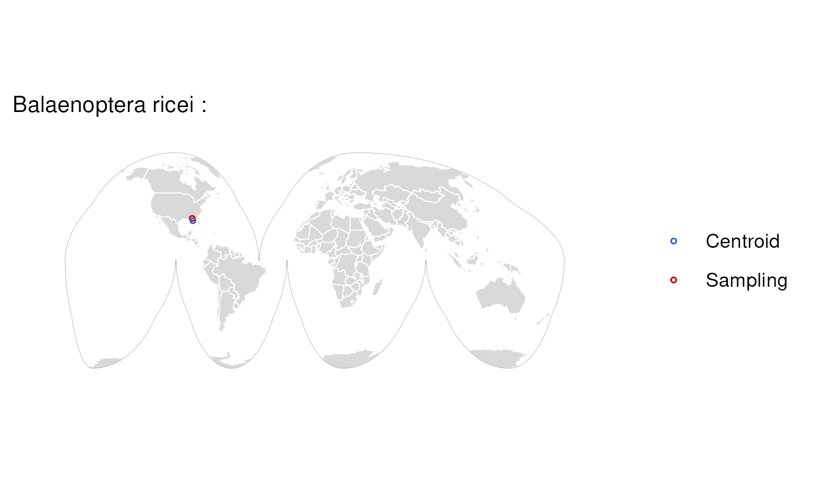

### Species: Callithrix jacchus

**Common Name:** common marmoset\
**Biosample:** SAMN47004743\
**Assembly Accession:** GCA_049354715.1\
**Taxon:** Mammals\
**Priority:** 4\
**Flags:** Outside Range;

**Map Notes:**\
**Comments:** NA

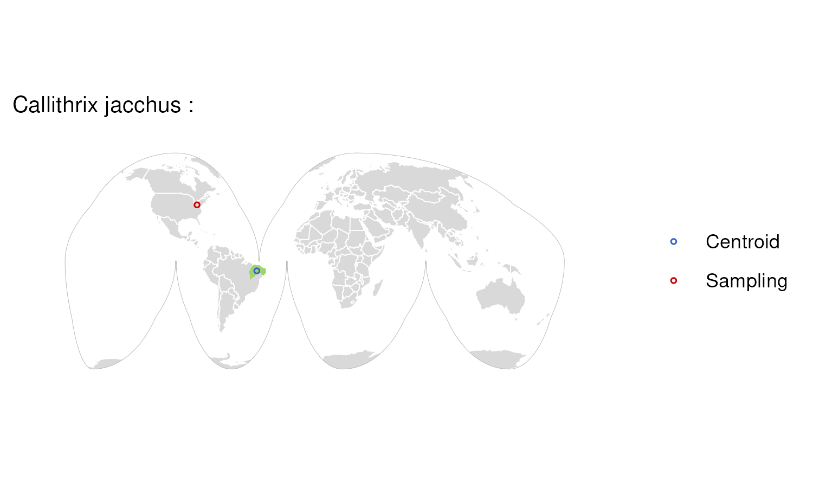

### Species: Calypte anna

**Common Name:** Anna’s hummingbird\
**Biosample:** SAMN02265252\
**Assembly Accession:** GCA_003957555.2\
**Taxon:** Birds\
**Priority:** 4\
**Flags:** Outside Range;

**Map Notes:**\
**Comments:** In May 2019 the mitochondrial sequence (RRCD01000160) was
added to this 01 version of RRCD00000000. This assembly represents the
primary haplotype of the diploid genome Calypte anna and includes the
chromosomes. The alternate haplotype sequences are in WGS project
RRCE00000000.

### Species: Camelus dromedarius

**Common Name:** Dromedary camel\
**Biosample:** SAMN39296380\
**Assembly Accession:** GCA_036321535.1\
**Taxon:** Mammals\
**Priority:** 4\
**Flags:** Outside Range;

**Map Notes:**\
**Comments:** NA

### Species: Candoia aspera

**Common Name:** viper boa\
**Biosample:** SAMN37159891\
**Assembly Accession:** GCA_035149785.1\
**Taxon:** Reptiles\
**Priority:** 4\
**Flags:** Outside Range;

**Map Notes:**\
**Comments:** NA

### Species: Choloepus didactylus

**Common Name:** Linnaeus’s two-toed sloth\
**Biosample:** SAMN12612024\
**Assembly Accession:** GCA_015220235.1\
**Taxon:** Mammals\
**Priority:** 4\
**Flags:** Outside Range;

**Map Notes:**\
**Comments:** NA

### Species: Clarias gariepinus

**Common Name:** North African catfish\
**Biosample:** SAMN27021044\
**Assembly Accession:** GCA_024256435.1\
**Taxon:** Fishes\
**Priority:** 4\
**Flags:** Outside Range;

**Map Notes:**\
**Comments:** NA

### Species: Columba livia

**Common Name:** rock dove\
**Biosample:** SAMN38891892\
**Assembly Accession:** GCA_036013475.2\
**Taxon:** Birds\
**Priority:** 4\
**Flags:** Outside Range;

**Map Notes:**\
**Comments:** The order and orientation of scaffolds is uncertain in the
W chromosome due to contiguity dropouts

### Species: Corvus hawaiiensis

**Common Name:** Hawaiian crow\
**Biosample:** SAMN22550278\
**Assembly Accession:** GCA_020740725.1\
**Taxon:** Birds\
**Priority:** 4\
**Flags:** Outside Range;

**Map Notes:**\
**Comments:** NA

### Species: Coturnix chinensis

**Common Name:** king quail\
**Biosample:** SAMN41253798\
**Assembly Accession:** GCA_039878825.1\
**Taxon:** Birds\
**Priority:** 4\
**Flags:** Outside Range;

**Map Notes:**\
**Comments:** NA

### Species: Dasyurus maculatus

**Common Name:** tiger quoll\
**Biosample:** SAMN47326980\
**Assembly Accession:** GCA_048593285.1\
**Taxon:** Mammals\
**Priority:** 4\
**Flags:** Outside Range;

**Map Notes:**\
**Comments:** NA

### Species: Dendropsophus ebraccatus

**Common Name:** hourglass treefrog\
**Biosample:** SAMN32145295\
**Assembly Accession:** GCA_027789765.1\
**Taxon:** Amphibians\
**Priority:** 4\
**Flags:** Outside Range;

**Map Notes:**\
**Comments:** NA

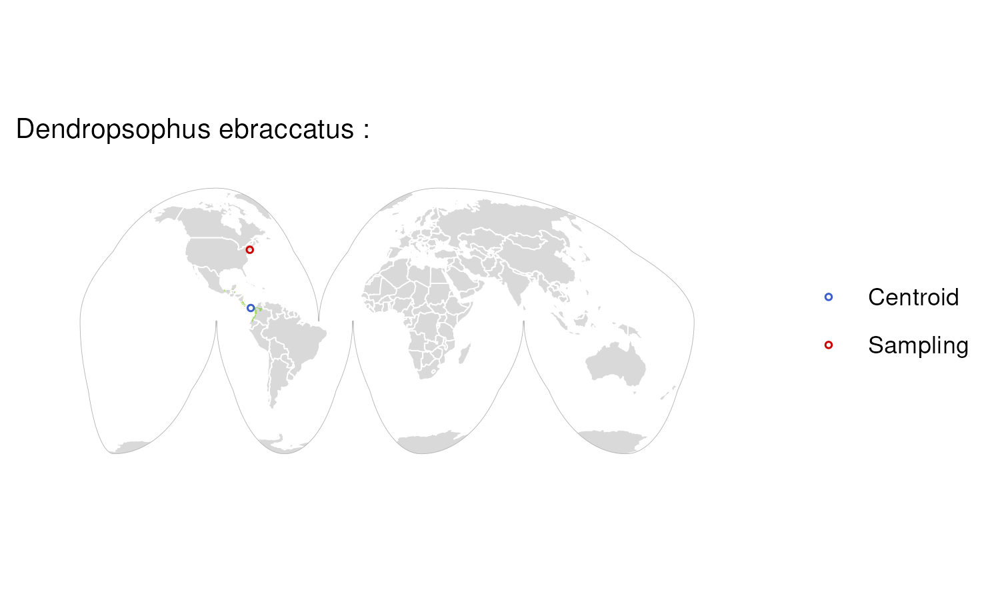

### Species: Dibamus smithi

**Common Name:** Smith’s blind skink\
**Biosample:** SAMN44704469\
**Assembly Accession:** GCA_046126795.1\
**Taxon:** Reptiles\
**Priority:** 4\
**Flags:** Outside Range;

**Map Notes:**\
**Comments:** NA

### Species: Diceros bicornis minor

**Common Name:** Southern black rhinoceros\
**Biosample:** SAMN22047685\
**Assembly Accession:** GCA_020826845.1\
**Taxon:** Mammals\
**Priority:** 4\
**Flags:** Outside Range;

**Map Notes:**\
**Comments:** NA

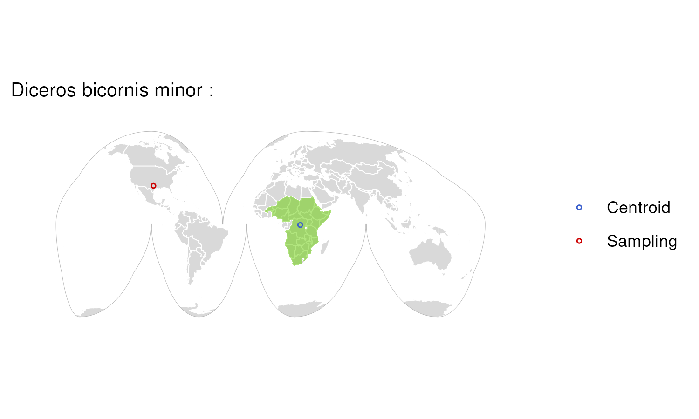

### Species: Engystomops pustulosus

**Common Name:** tungara frog\
**Biosample:** SAMN42463661\
**Assembly Accession:** GCA_040894005.1\
**Taxon:** Amphibians\
**Priority:** 4\
**Flags:** Outside Range;

**Map Notes:**\
**Comments:** NA

### Species: Eptesicus fuscus

**Common Name:** big brown bat\
**Biosample:** SAMN30608903\
**Assembly Accession:** GCA_027574615.1\
**Taxon:** Mammals\
**Priority:** 4\
**Flags:** Outside Range;

**Map Notes:**\
**Comments:** NA

### Species: Equus caballus

**Common Name:** Arabian horse\
**Biosample:** SAMN39296386\
**Assembly Accession:** GCA_036426135.1\
**Taxon:** Mammals\
**Priority:** 4\
**Flags:** Outside Range;

**Map Notes:**\
**Comments:** NA

### Species: Falco biarmicus

**Common Name:** Lanner falcon\
**Biosample:** SAMN28688289\
**Assembly Accession:** GCA_023638135.1\
**Taxon:** Birds\
**Priority:** 4\
**Flags:** Outside Range;

**Map Notes:**\
**Comments:** NA

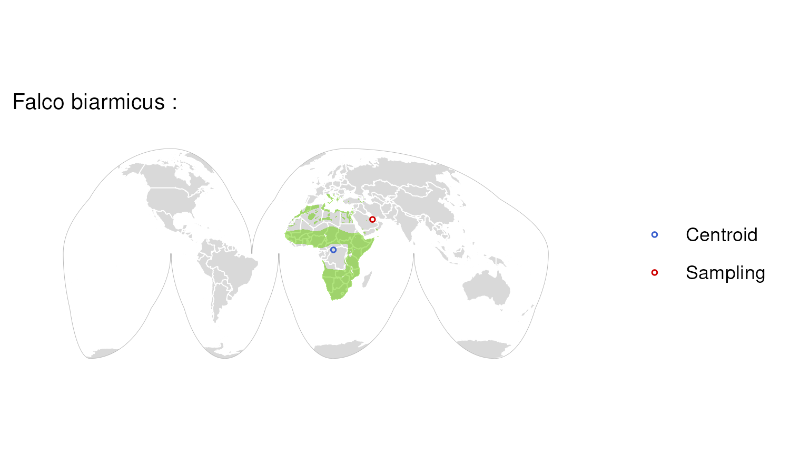

### Species: Falco punctatus

**Common Name:** Mauritius kestrel\
**Biosample:** SAMEA14356472\
**Assembly Accession:** GCA_963210335.1\
**Taxon:** Birds\
**Priority:** 4\
**Flags:** Outside Range;

**Map Notes:**\
**Comments:** The assembly bFalPun1.1 is based on 39x PacBio data and
Arima2 Hi-C data generated by the Darwin Tree of Life Project
(<https://www.darwintreeoflife.org/>). The assembly process included the
following sequence of steps: initial PacBio assembly generation with
Hifiasm, retained haplotig separation with purge_dups, and Hi-C based
scaffolding with YaHS. The mitochondrial genome was assembled using
MitoHiFi. Finally, the primary assembly was analysed and manually
improved using rapid curation. Chromosome-scale scaffolds confirmed by
the Hi-C data have been named in order of size. Chromosome Z was
assigned by synteny to Falco biarmicus (GCF_023638135.1)

### Species: Falco rusticolus

**Common Name:** gyrfalcon\
**Biosample:** SAMN12629496\
**Assembly Accession:** GCA_015220075.1\
**Taxon:** Birds\
**Priority:** 4\
**Flags:** Outside Range;

**Map Notes:**\
**Comments:** NA

### Species: Furcifer pardalis

**Common Name:** panther chameleon\
**Biosample:** SAMN35298317\
**Assembly Accession:** GCA_030440675.1\
**Taxon:** Reptiles\
**Priority:** 4\
**Flags:** Outside Range;

**Map Notes:**\
**Comments:** NA

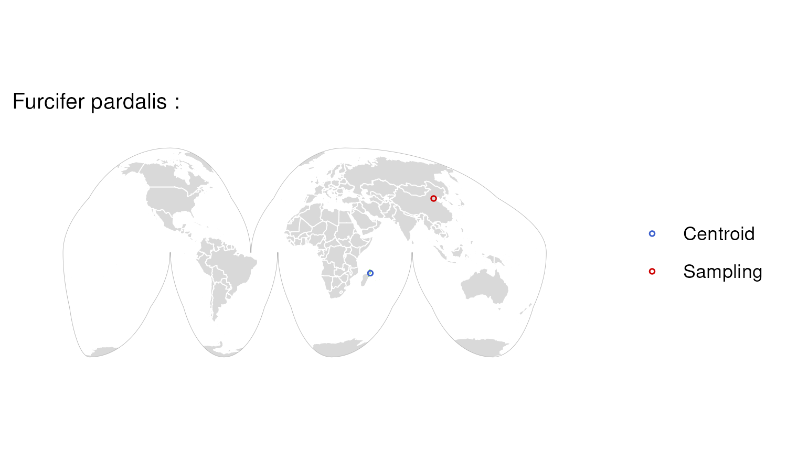

### Species: Gavia stellata

**Common Name:** red-throated Loon\
**Biosample:** SAMN37096312\
**Assembly Accession:** GCA_030936135.1\
**Taxon:** Birds\
**Priority:** 4\
**Flags:** Outside Range;

**Map Notes:**\
**Comments:** NA

### Species: Gopherus evgoodei

**Common Name:** Goode’s Thornscrub Tortoise\
**Biosample:** SAMN03496275\
**Assembly Accession:** GCA_007399415.1\
**Taxon:** Reptiles\
**Priority:** 4\
**Flags:** Outside Range;

**Map Notes:**\
**Comments:** This assembly represents the principal haplotype of the
diploid genome Gopherus evgoodei and includes the chromosomes. The
alternate haplotype sequences are in WGS project VHHO00000000.

### Species: Gopherus flavomarginatus

**Common Name:** Mexican gopher tortoise\
**Biosample:** SAMN24199108\
**Assembly Accession:** GCA_025201925.1\
**Taxon:** Reptiles\
**Priority:** 4\
**Flags:** Outside Range;

**Map Notes:**\
**Comments:** NA

### Species: Grus grus

**Common Name:** Eurasian crane\
**Biosample:** SAMEA113398837\
**Assembly Accession:** GCA_964106855.1\
**Taxon:** Birds\
**Priority:** 4\
**Flags:** Outside Range;

**Map Notes:**\
**Comments:** The assembly bGruGru1.hap1.1 is based on 48x PacBio data
and Arima2 Hi-C data generated by the Darwin Tree of Life Project
(<https://www.darwintreeoflife.org/>). The assembly process included the
following sequence of steps: initial PacBio assembly generation with
Hifiasm in Hi-C integrated assembly mode, and Hi-C based scaffolding
with YaHS. The mitochondrial genome was assembled using MitoHiFi.
Finally, each haplotype assembly was analysed and manually improved
using TreeVal. Chromosome-scale scaffolds confirmed by the Hi-C data
have been named in order of size. Z chromosome identified based on
synteny with Grus americana (GCF_028858705.1)

### Species: Hemiscyllium ocellatum

**Common Name:** epaulette shark\
**Biosample:** SAMN22550098\
**Assembly Accession:** GCA_020745735.1\
**Taxon:** Fishes\
**Priority:** 4\
**Flags:** Outside Range;

**Map Notes:**\
**Comments:** NA

### Species: Heptranchias perlo

**Common Name:** sharpnose sevengill shark\
**Biosample:** SAMN38891902\
**Assembly Accession:** GCA_035084215.1\
**Taxon:** Fishes\
**Priority:** 4\
**Flags:** Outside Range;

**Map Notes:**\
**Comments:** NA

### Species: Hyperolius riggenbachi

**Common Name:** Riggenbach’s reed frog\
**Biosample:** SAMN42123895\
**Assembly Accession:** GCA_040937935.1\
**Taxon:** Amphibians\
**Priority:** 4\
**Flags:** Outside Range;

**Map Notes:**\
**Comments:** NA

### Species: Jaculus jaculus

**Common Name:** Lesser Egyptian jerboa\
**Biosample:** SAMN20391724\
**Assembly Accession:** GCA_020740685.1\
**Taxon:** Mammals\
**Priority:** 4\
**Flags:** Outside Range;

**Map Notes:**\
**Comments:** NA

### Species: Lathamus discolor

**Common Name:** swift parrot\
**Biosample:** SAMN40289871\
**Assembly Accession:** GCA_037157495.1\
**Taxon:** Birds\
**Priority:** 4\
**Flags:** Outside Range;

**Map Notes:**\
**Comments:** NA

### Species: Lepidogalaxias salamandroides

**Common Name:** salamanderfish\
**Biosample:** SAMN47481373\
**Assembly Accession:** GCA_049190665.1\
**Taxon:** Fishes\
**Priority:** 4\
**Flags:** Outside Range;

**Map Notes:**\
**Comments:** NA

### Species: Leptosomus discolor

**Common Name:** cuckoo-roller\
**Biosample:** SAMN37284216\
**Assembly Accession:** GCA_034619465.1\
**Taxon:** Birds\
**Priority:** 4\
**Flags:** Outside Range;

**Map Notes:**\
**Comments:** NA

### Species: Lethrinus nebulosus

**Common Name:** spangled emperor\
**Biosample:** SAMN40589648\
**Assembly Accession:** GCA_045362495.1\
**Taxon:** Fishes\
**Priority:** 4\
**Flags:** Outside Range;

**Map Notes:**\
**Comments:** NA

### Species: Lonchura striata domestica

**Common Name:** Bengalese finch\
**Biosample:** SAMN44779081\
**Assembly Accession:** GCA_046129695.1\
**Taxon:** Birds\
**Priority:** 4\
**Flags:** Outside Range;

**Map Notes:**\
**Comments:** NA

### Species: Lycaon pictus

**Common Name:** African hunting dog\
**Biosample:** SAMN36939365\
**Assembly Accession:** GCA_040955705.1\
**Taxon:** Mammals\
**Priority:** 4\
**Flags:** Outside Range;

**Map Notes:**\
**Comments:** NA

### Species: Lynx canadensis

**Common Name:** Canada lynx\
**Biosample:** SAMN09948483\
**Assembly Accession:** GCA_007474595.2\
**Taxon:** Mammals\
**Priority:** 4\
**Flags:** Outside Range;

**Map Notes:**\
**Comments:** This assembly represents the principal haplotype of the
diploid genome Lynx canadensis and includes the chromosomes. The
alternate haplotype sequences are in WGS project VHLF00000000

### Species: Macaca nemestrina

**Common Name:** pig-tailed macaque\
**Biosample:** SAMN41827875\
**Assembly Accession:** GCA_043159975.1\
**Taxon:** Mammals\
**Priority:** 4\
**Flags:** Outside Range;

**Map Notes:**\
**Comments:** NA

### Species: Macropus eugenii

**Common Name:** Tammar wallaby\
**Biosample:** SAMN28408687\
**Assembly Accession:** GCA_028372415.2\
**Taxon:** Mammals\
**Priority:** 4\
**Flags:** Outside Range;

**Map Notes:**\
**Comments:** In March 2025 42 sequences were suppressed because they
were found to be contaminants. Order and orientation uncertain
chromosome 4 301.08-310.96mb, chromosome 6 168.10-171.94mb

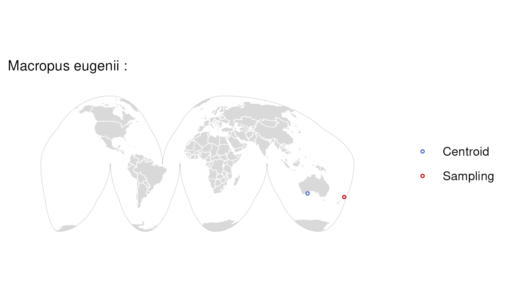

### Species: Mantella aurantiaca

**Common Name:** golden mantella\
**Biosample:** SAMN46714743\
**Assembly Accession:** GCA_048565345.1\
**Taxon:** Amphibians\
**Priority:** 4\
**Flags:** Outside Range;

**Map Notes:**\
**Comments:** NA

### Species: Megaderma spasma

**Common Name:** Lesser false vampire bat\
**Biosample:** SAMN33550865\
**Assembly Accession:** GCA_043880595.1\
**Taxon:** Mammals\
**Priority:** 4\
**Flags:** Outside Range;

**Map Notes:**\
**Comments:** NA

### Species: Melanotaenia boesemani

**Common Name:** Boeseman’s rainbowfish\
**Biosample:** SAMN12623618\
**Assembly Accession:** GCA_017639745.1\
**Taxon:** Fishes\
**Priority:** 4\
**Flags:** Outside Range;

**Map Notes:**\
**Comments:** NA

### Species: Melopsittacus undulatus

**Common Name:** budgerigar\
**Biosample:** SAMN12623090\
**Assembly Accession:** GCA_012275295.1\
**Taxon:** Birds\
**Priority:** 4\
**Flags:** Outside Range;

**Map Notes:**\
**Comments:** This assembly represents the principal haplotype of the
diploid genome Melopsittacus undulatus. This is the VGP trio assembly
merged haplotype data and includes the chromosomes from the female as
well as the Z chromosome and the mitochondrion. The #alternate maternal
and paternal haplotype sequences are in WGS projects JAAVWI000000000 and
JAAVWH000000000 respectively.

### Species: Mesoplodon bidens

**Common Name:** Sowerby’s beaked whale\
**Biosample:** SAMEA112165298\
**Assembly Accession:** GCA_964165515.1\
**Taxon:** Mammals\
**Priority:** 4\
**Flags:** Outside Range;

**Map Notes:**\
**Comments:** The assembly mMesBid2.hap1.1 is based on 57x PacBio data
and Arima2 Hi-C data generated by the Wellcome Sanger Institute Tree of
Life Programme (<https://www.sanger.ac.uk/programme/tree-of-life/>) as
part of the European Reference Genome Atlas pilot project
(<https://www.erga-biodiversity.eu/pilot-project>). The assembly process
included the following sequence of steps: initial PacBio assembly
generation with Hifiasm in Hi-C integrated assembly mode, and Hi-C based
scaffolding with YaHS. The mitochondrial genome was assembled using
MitoHiFi. Finally, each haplotype assembly was analysed and manually
improved using TreeVal. This alternate haplotype assembly combines the
haplotigs separated by purge_dups with haplotigs separated from the
primary assembly during curation. the sex chromosomes were identified by
read coverage and homology to Mesoplodon densirostris / mMesDen1.

### Species: Mesoplodon mirus

**Common Name:** True’s beaked whale\
**Biosample:** SAMEA115358965\
**Assembly Accession:** GCA_964341445.1\
**Taxon:** Mammals\
**Priority:** 4\
**Flags:** Outside Range;

**Map Notes:**\
**Comments:** The assembly mMesMir1.hap1.1 is based on 53x PacBio data
and Arima2 Hi-C data generated by the Darwin Tree of Life Project
(<https://www.darwintreeoflife.org/>). The assembly process included the
following sequence of steps: initial PacBio assembly generation with
Hifiasm in Hi-C integrated assembly mode, and Hi-C based scaffolding
with YaHS. The mitochondrial genome was assembled using MitoHiFi.
Finally, each haplotype assembly was analysed and manually improved
using TreeVal. Chromosome-scale scaffolds confirmed by the Hi-C data
have been named in order of size. The X chromosome was identified
through synteny analysis with Globicephala melas (GCA_963455315.2) The
exact order and orientation of the contigs on chromosome 1 (91,500 -
208,500 Kbp) are unknown.The exact order and orientation of the contigs
on chromosome 3 (135,300 - 141,000 Kbp) are unknown.The exact order and
orientation of the contigs on chromosome 4 (83,400 - 91,000 Kbp) are
unknown.The exact order and orientation of the contigs on chromosome 7
(74,500 - 104,500 Kbp) are unknown.The exact order and orientation of
the contigs on chromosome 10 (98,900 - 111,400 Kbp) are unknown.The
exact order and orientation of the contigs on chromosome 18 (28,000 -
37,500 Kbp) are unknown.

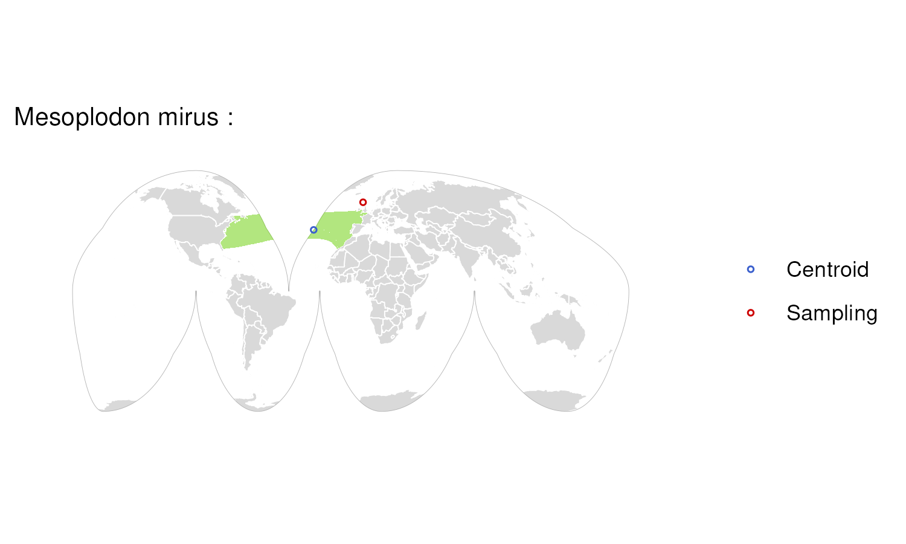

### Species: Mixophyes fleayi

**Common Name:** Fleay’s barred frog\
**Biosample:** SAMN39657083\
**Assembly Accession:** GCA_038048845.1\
**Taxon:** Amphibians\
**Priority:** 4\
**Flags:** Outside Range;

**Map Notes:**\
**Comments:** NA

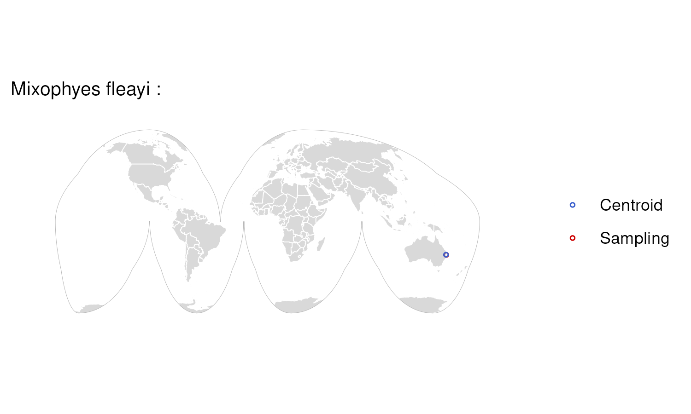

### Species: Molossus alvarezi

**Common Name:** Alvarez’s mastiff bat\
**Biosample:** SAMN40002245\
**Assembly Accession:** GCA_037157525.1\
**Taxon:** Mammals\
**Priority:** 4\
**Flags:** Outside Range;

**Map Notes:**\
**Comments:** NA

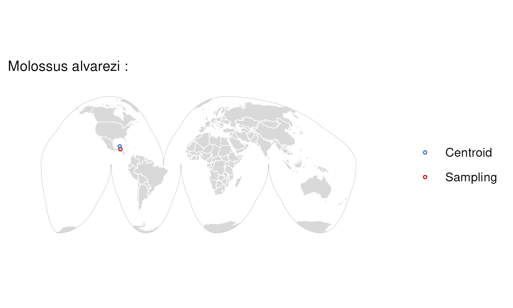

### Species: Monodelphis domestica

**Common Name:** gray short-tailed opossum\
**Biosample:** SAMN31801966\
**Assembly Accession:** GCA_027887165.1\
**Taxon:** Mammals\
**Priority:** 4\
**Flags:** Outside Range;

**Map Notes:**\
**Comments:** NA

### Species: Mops condylurus

**Common Name:** Angolan free-tailed bat\
**Biosample:** SAMN33550911\
**Assembly Accession:** GCA_043748645.1\
**Taxon:** Mammals\
**Priority:** 4\
**Flags:** Outside Range;

**Map Notes:**\
**Comments:** NA

### Species: Myotis mystacinus

**Common Name:** whiskered bat\
**Biosample:** SAMEA114250307\
**Assembly Accession:** GCA_964094495.2\
**Taxon:** Mammals\
**Priority:** 4\
**Flags:** Outside Range;

**Map Notes:**\
**Comments:** The assembly mMyoMys1.hap1.1 is based on 46x PacBio data
and Arima2 Hi-C data generated by the Darwin Tree of Life Project
(<https://www.darwintreeoflife.org/>). The assembly process included the
following sequence of steps: initial PacBio assembly generation with
Hifiasm in Hi-C integrated assembly mode, and Hi-C based scaffolding
with YaHS. The mitochondrial genome was assembled using MitoHiFi.
Finally, each haplotype assembly was analysed and manually improved
using TreeVal. Chromosome-scale scaffolds confirmed by the Hi-C data
have been named in order of size. Chromosomes X and Y were assigned
based on read coverage and HIC data.

### Species: Neogale vison

**Common Name:** American mink\
**Biosample:** SAMEA112468126\
**Assembly Accession:** GCA_964106545.1\
**Taxon:** Mammals\
**Priority:** 4\
**Flags:** Outside Range;

**Map Notes:**\
**Comments:** The assembly mNeoVis2.hap1.1 is based on 44x PacBio data
and Arima2 Hi-C data generated by the Darwin Tree of Life Project
(<https://www.darwintreeoflife.org/>). The assembly process included the
following sequence of steps: initial PacBio assembly generation with
Hifiasm in Hi-C integrated assembly mode, and Hi-C based scaffolding
with YaHS. The mitochondrial genome was assembled using MitoHiFi.
Finally, each haplotype assembly was analysed and manually improved
using TreeVal. Chromosome-scale scaffolds confirmed by the Hi-C data
have been named in order of size. This genome has been assembled using
PacBio and HiC data and phased. The result is two curated haplotypes.
Chromosome X was identified by synteny to GCF_020171115.1.

### Species: Nesoenas mayeri

**Common Name:** pink pigeon\
**Biosample:** SAMEA12922160\
**Assembly Accession:** GCA_963082525.1\
**Taxon:** Birds\
**Priority:** 4\
**Flags:** Outside Range;

**Map Notes:**\
**Comments:** The assembly bNesMay2.1 is based on 32x PacBio data and
Arima2 Hi-C data generated by the Darwin Tree of Life Project
(<https://www.darwintreeoflife.org/>). The assembly process included the
following sequence of steps: initial PacBio assembly generation with
Hifiasm, retained haplotig separation with purge_dups, and Hi-C based
scaffolding with YaHS. The mitochondrial genome was assembled using
MitoHiFi. Finally, the primary assembly was analysed and manually
improved using rapid curation. Chromosome-scale scaffolds confirmed by
the Hi-C data have been named in order of size.

### Species: Netta rufina

**Common Name:** red-crested pochard\
**Biosample:** SAMEA112468124\
**Assembly Accession:** GCA_964035555.1\
**Taxon:** Birds\
**Priority:** 4\
**Flags:** Outside Range;

**Map Notes:**\
**Comments:** The assembly bNetRuf1.1 is based on 30x PacBio data and
Arima2 Hi-C data generated by the Darwin Tree of Life Project
(<https://www.darwintreeoflife.org/>). The assembly process included the
following sequence of steps: initial PacBio assembly generation with
Hifiasm, retained haplotig separation with purge_dups, and Hi-C based
scaffolding with YaHS. The mitochondrial genome was assembled using
MitoHiFi. Finally, the primary assembly was analysed and manually
improved using TreeVal. Chromosome-scale scaffolds confirmed by the Hi-C
data have been named in order of size.

### Species: Oryctolagus cuniculus

**Common Name:** European rabbit\
**Biosample:** SAMEA112468037\
**Assembly Accession:** GCA_964237555.1\
**Taxon:** Mammals\
**Priority:** 4\
**Flags:** Outside Range;

**Map Notes:**\
**Comments:** The assembly mOryCun1.1 is based on 31x PacBio data and
Arima2 Hi-C data generated by the Darwin Tree of Life Project
(<https://www.darwintreeoflife.org/>). The assembly process included the
following sequence of steps: initial PacBio assembly generation with
Hifiasm, retained haplotig separation with purge_dups, and Hi-C based
scaffolding with YaHS. The mitochondrial genome was assembled using
MitoHiFi. Finally, the primary assembly was analysed and manually
improved using TreeVal. Chromosome-scale scaffolds confirmed by the Hi-C
data have been named in order of size. X chromosome identified based on
synteny with Oryctolagus cuniculus cuniculus (GCA_013371645.1).

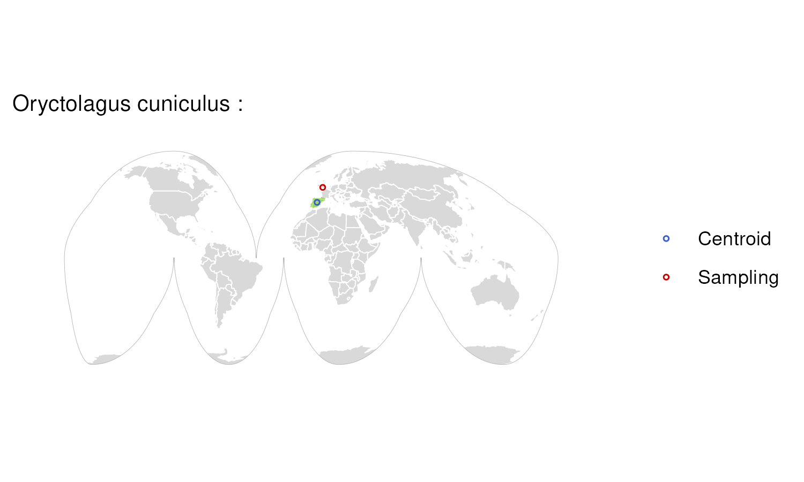

### Species: Pagrus pagrus

**Common Name:** common seabream\
**Biosample:** SAMEA110450108\
**Assembly Accession:** GCA_965226575.1\
**Taxon:** Fishes\
**Priority:** 4\
**Flags:** Outside Range;

**Map Notes:**\
**Comments:** The assembly fPagPag1.hap1.1 is based on 37x PacBio data
and Arima2 Hi-C data generated by the Darwin Tree of Life Project
(<https://www.darwintreeoflife.org/>). The assembly process included the
following sequence of steps: initial PacBio assembly generation with
Hifiasm in Hi-C integrated assembly mode, and Hi-C based scaffolding
with YaHS. The mitochondrial genome was assembled using MitoHiFi.
Finally, each haplotype assembly was analysed and manually improved
using TreeVal. Chromosome-scale scaffolds confirmed by the Hi-C data
have been named in order of size.

### Species: Pangasianodon hypophthalmus

**Common Name:** striped catfish\
**Biosample:** SAMN32348883\
**Assembly Accession:** GCA_027358585.1\
**Taxon:** Fishes\
**Priority:** 4\
**Flags:** Outside Range;

**Map Notes:**\
**Comments:** NA

### Species: Pangshura tecta

**Common Name:** Indian roofed turtle\
**Biosample:** SAMN43277916\
**Assembly Accession:** GCA_045781085.1\
**Taxon:** Reptiles\
**Priority:** 4\
**Flags:** Outside Range;

**Map Notes:**\
**Comments:** NA

### Species: Patagioenas fasciata

**Common Name:** band-tailed pigeon\
**Biosample:** SAMN40018840\
**Assembly Accession:** GCA_037038585.2\
**Taxon:** Birds\
**Priority:** 4\
**Flags:** Outside Range;

**Map Notes:**\
**Comments:** The Band-tailed Pigeon (Patagioenas fasciata) is a member
of the bird family Columbidae (doves and pigeons). It is a medium-sized
species native to the Americas, with a breeding range extending from the
west coast of the United States down to Mexico and Peru. The band-tailed
pigeon is the closest living relative to the extinct passenger pigeon.
This sample is from an individual of the subspecies P. f. monilis bred
in captivity. It was sampled in Massapequa (NY) by Marine Reynaldo,
coordinated by Ben Novak and Erich D. Jarvis, and supported by Revive &
Restore to generate a high-quality reference genome for the Vertebrate
Genomes Project (VGP). Sequencing and genome assembly were conducted at
the Vertebrate Genomes Lab (VGL) at the Rockefeller University, led by
Erich D. Jarvis, Jennifer Balacco, and Giulio Formenti. Assembly and
curation were performed by Simona Secomandi.

### Species: Pelophylax lessonae

**Common Name:** pool frog\
**Biosample:** SAMEA112468029\
**Assembly Accession:** GCA_965119305.1\
**Taxon:** Amphibians\
**Priority:** 4\
**Flags:** Outside Range;

**Map Notes:**\
**Comments:** The assembly aPelLes1.hap1.1 is based on 35x PacBio data
and Arima2 Hi-C data generated by the Darwin Tree of Life Project
(<https://www.darwintreeoflife.org/>). The assembly process included the
following sequence of steps: initial PacBio assembly generation with
Hifiasm in Hi-C integrated assembly mode, and Hi-C based scaffolding
with YaHS. The mitochondrial genome was assembled using MitoHiFi.
Finally, each haplotype assembly was analysed and manually improved
using TreeVal. Chromosome-scale scaffolds confirmed by the Hi-C data
have been named in order of size. There is a heterozygous inversion in
Chromosome 10 from 11 Mbp to 36 Mbp.

### Species: Periophthalmus magnuspinnatus

**Common Name:** Korean giant-fin mudskipper\
**Biosample:** SAMN12629500\
**Assembly Accession:** GCA_009829125.3\
**Taxon:** Fishes\
**Priority:** 4\
**Flags:** Outside Range;

**Map Notes:**\
**Comments:** This assembly represents the principal haplotype of the
diploid genome Periophthalmus magnuspinnatus and includes the
chromosomes. The alternate haplotype sequences are in WGS project
WNMB00000000

This genome was updated in March 2023. Improved Hi-C mapping shows that
this assembly has only 24 chromosomes. Chromosome 25 and its associated
contig (CM020615, WNMA01000025) were removed from the assembly. This
sequence was found to be a part of chromosome 11, so the chromosome 11
sequence and its associated contig sequence (CM020601, WNMA01000013)
were also updated.

### Species: Phocoena sinus

**Common Name:** vaquita\
**Biosample:** SAMN12325353\
**Assembly Accession:** GCA_008692025.1\
**Taxon:** Mammals\
**Priority:** 4\
**Flags:** Outside Range;

**Map Notes:**\
**Comments:** This assembly represents the principal haplotype of the
diploid genome Phocoena sinus and includes the chromosomes. The
alternate haplotype sequences are in WGS project VOSV00000000.

### Species: Pholidichthys leucotaenia

**Common Name:** convict blenny\
**Biosample:** SAMN12623617\
**Assembly Accession:** GCA_020510985.1\
**Taxon:** Fishes\
**Priority:** 4\
**Flags:** Outside Range;

**Map Notes:**\
**Comments:** NA

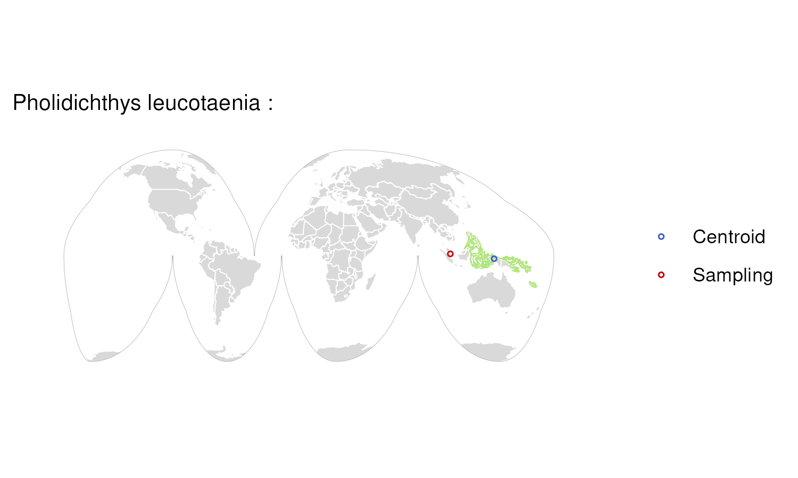

### Species: Phyllostomus discolor

**Common Name:** pale spear-nosed bat\
**Biosample:** SAMN09948786\
**Assembly Accession:** GCA_004126475.3\
**Taxon:** Mammals\
**Priority:** 4\
**Flags:** Outside Range;

**Map Notes:**\
**Comments:** This assembly represents the principal haplotype of the
diploid genome Phyllostomus discolor and includes the chromosomes. The
alternate haplotype sequences are in WGS project RXPB00000000

### Species: Pipistrellus hanaki

**Common Name:** Hanaki’s dwarf bat\
**Biosample:** SAMEA115799862\
**Assembly Accession:** GCA_964339955.1\
**Taxon:** Mammals\
**Priority:** 4\
**Flags:** Outside Range;

**Map Notes:**\
**Comments:** Genome assembly of Acomys minous. This assembly is
provided by the European Reference Genome Atlas (ERGA,
<https://www.erga-biodiversity.eu/>) via the Biodiversity Genomics
Europe project (BGE, <https://biodiversitygenomics.eu/>).

### Species: Platalea leucorodia

**Common Name:** Eurasian spoonbill\
**Biosample:** SAMEA112468120\
**Assembly Accession:** GCA_965183815.1\
**Taxon:** Birds\
**Priority:** 4\
**Flags:** Outside Range;

**Map Notes:**\
**Comments:** The assembly bPlaLeu2.hap1.1 is based on 33x PacBio data
and Arima2 Hi-C data generated by the Darwin Tree of Life Project
(<https://www.darwintreeoflife.org/>). The assembly process included the
following sequence of steps: initial PacBio assembly generation with
Hifiasm in Hi-C integrated assembly mode, and Hi-C based scaffolding
with YaHS. The mitochondrial genome was assembled using MitoHiFi.
Finally, each haplotype assembly was analysed and manually improved
using TreeVal. Chromosome-scale scaffolds confirmed by the Hi-C data
have been named in order of size. Curation of this assembly resulted in
35 autosomes, plus Z and W. The published karyotype (Takagi N and Sasaki
M. A phylogenetic study of bird karyotypes. Chromosoma, 46: 91-120,
1974. <https://doi.org/10.1007/BF00332341>) is ? 70.

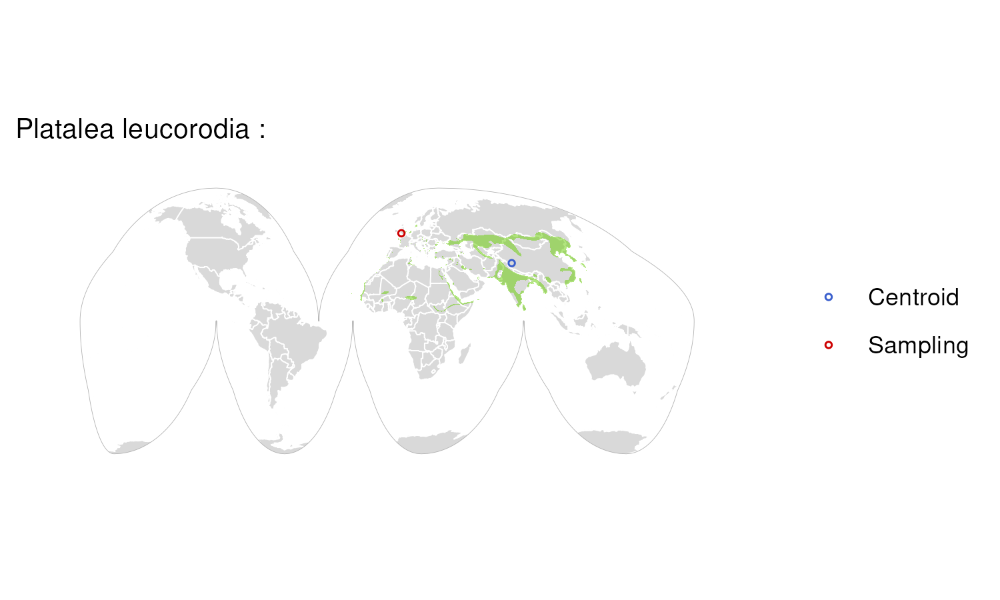

### Species: Podarcis bocagei

**Common Name:** Bocage’s wall lizard\
**Biosample:** SAMEA115336769\
**Assembly Accession:** GCA_964188305.1\
**Taxon:** Reptiles\
**Priority:** 4\
**Flags:** Outside Range;

**Map Notes:**\
**Comments:** The assembly rPodBoc1.hap1.1 is based on 30x PacBio data
and Arima2 Hi-C data generated by the Wellcome Sanger Institute Tree of
Life Programme (<https://www.sanger.ac.uk/programme/tree-of-life/>). The
assembly process included the following sequence of steps: initial
PacBio assembly generation with Hifiasm in Hi-C integrated assembly
mode, and Hi-C based scaffolding with YaHS. The mitochondrial genome was
assembled using MitoHiFi. Finally, each haplotype assembly was analysed
and manually improved using TreeVal. Chromosome-scale scaffolds
confirmed by the Hi-C data have been named in order of size. Chromosomes
Z and W were assigned based on HiC data and read coverage statistics.
The order and orientation of the contigs making up Chromosome W are
uncertain and some may remain in the unplaced scaffolds.

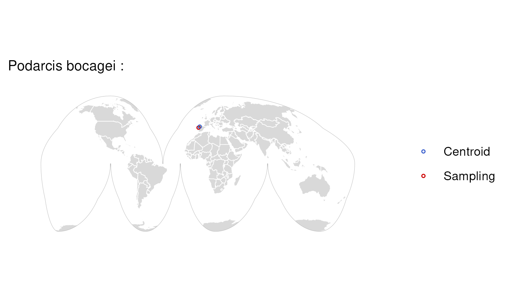

### Species: Podarcis filfolensis

**Common Name:** Filfola wall lizard\
**Biosample:** SAMEA113403362\
**Assembly Accession:** GCA_964270895.1\
**Taxon:** Reptiles\
**Priority:** 4\
**Flags:** Outside Range;

**Map Notes:**\
**Comments:** The assembly rPodFil1.hap1.1 is based on 33x PacBio data
and Arima2 Hi-C data generated by the Wellcome Sanger Institute Tree of
Life Programme (<https://www.sanger.ac.uk/programme/tree-of-life/>). The
assembly process included the following sequence of steps: initial
PacBio assembly generation with Hifiasm in Hi-C integrated assembly
mode, and Hi-C based scaffolding with YaHS. The mitochondrial genome was
assembled using MitoHiFi. Finally, each haplotype assembly was analysed
and manually improved using TreeVal. Chromosome-scale scaffolds
confirmed by the Hi-C data have been named in order of size.

### Species: Polymixia lowei

**Common Name:** beardfish\
**Biosample:** SAMN45134564\
**Assembly Accession:** GCA_047511565.1\
**Taxon:** Fishes\
**Priority:** 4\
**Flags:** Outside Range;

**Map Notes:**\
**Comments:** NA

### Species: Poromitra crassiceps

**Common Name:** crested bigscale\
**Biosample:** SAMEA8748810\
**Assembly Accession:** GCA_964638095.1\
**Taxon:** Fishes\
**Priority:** 4\
**Flags:** Outside Range;

**Map Notes:**\
**Comments:** The assembly fPorCra3.hap1.1 is based on 48x PacBio data
and Arima2 Hi-C data generated by the Darwin Tree of Life Project
(<https://www.darwintreeoflife.org/>). The assembly process included the
following sequence of steps: initial PacBio assembly generation with
Hifiasm in Hi-C integrated assembly mode, and Hi-C based scaffolding
with YaHS. The mitochondrial genome was assembled using MitoHiFi.
Finally, each haplotype assembly was analysed and manually improved
using TreeVal. Chromosome-scale scaffolds confirmed by the Hi-C data
have been named in order of size. Due to a fission in chromosome 8, the
haplotypes 1 and 2 have 30 and 31 chromosomes respectively. The
chromosome 8 is named as 8A and 8B in hap2. A translocation between
chromosomes 6 and 8 was also detected.

### Species: Porphyrio hochstetteri

**Common Name:** takahe\
**Biosample:** SAMN22550412\
**Assembly Accession:** GCA_020800305.1\
**Taxon:** Birds\
**Priority:** 4\
**Flags:** Outside Range;

**Map Notes:**\
**Comments:** NA

### Species: Pseudophryne corroboree

**Common Name:** Southern corroboree frog\
**Biosample:** SAMN32631236\
**Assembly Accession:** GCA_028390025.1\
**Taxon:** Amphibians\
**Priority:** 4\
**Flags:** Outside Range;

**Map Notes:**\
**Comments:** The aPseCor3.alt.Hap2.FalseDups.cur.20221217.fasta file
contains false haplotype duplications removed from the haplotype 2
assembly

### Species: Psittacula echo

**Common Name:** Mauritius parakeet\
**Biosample:** SAMEA12361725\
**Assembly Accession:** GCA_963264785.1\
**Taxon:** Birds\
**Priority:** 4\
**Flags:** Outside Range;

**Map Notes:**\
**Comments:** The assembly bPsiEch3.1 is based on 79x PacBio data and
Arima2 Hi-C data generated by the Darwin Tree of Life Project
(<https://www.darwintreeoflife.org/>). The assembly process included the
following sequence of steps: initial PacBio assembly generation with
Hifiasm, retained haplotig separation with purge_dups, and Hi-C based
scaffolding with YaHS. The mitochondrial genome was assembled using
MitoHiFi. Finally, the primary assembly was analysed and manually
improved using rapid curation. Chromosome-scale scaffolds confirmed by
the Hi-C data have been named in order of size. Z chromosome identified
based on HiC signal from female sample (Pacbio hifi data used for de
novo assembly was derived from a male).

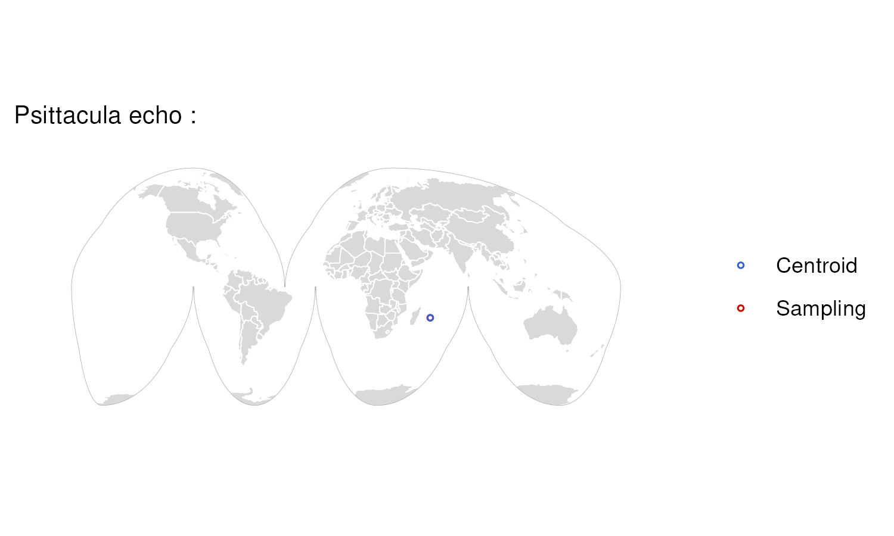

### Species: Pygocentrus nattereri

**Common Name:** red-bellied piranha\
**Biosample:** SAMN12623623\
**Assembly Accession:** GCA_015220715.1\
**Taxon:** Fishes\
**Priority:** 4\
**Flags:** Outside Range;

**Map Notes:**\
**Comments:** NA

### Species: Ranitomeya imitator

**Common Name:** mimic poison frog\
**Biosample:** SAMN32907850\
**Assembly Accession:** GCA_032444005.1\
**Taxon:** Amphibians\
**Priority:** 4\
**Flags:** Outside Range;

**Map Notes:**\
**Comments:** NA

### Species: Rhinolophus perniger lanosus

**Common Name:** Northern woolly horseshoe bat\
**Biosample:** SAMN33438666\
**Assembly Accession:** GCA_043748575.1\
**Taxon:** Mammals\
**Priority:** 4\
**Flags:** Outside Range;

**Map Notes:**\
**Comments:** NA

### Species: Rhynchocyon petersi

**Common Name:** black and rufous elephant shrew\
**Biosample:** SAMN43274963\
**Assembly Accession:** GCA_043290085.1\
**Taxon:** Mammals\
**Priority:** 4\
**Flags:** Outside Range;

**Map Notes:**\
**Comments:** NA

### Species: Rousettus aegyptiacus

**Common Name:** Egyptian fruit bat\
**Biosample:** SAMN14734550\
**Assembly Accession:** GCA_014176215.1\
**Taxon:** Mammals\
**Priority:** 4\
**Flags:** Outside Range;

**Map Notes:**\
**Comments:** NA

### Species: Saimiri boliviensis

**Common Name:** Bolivian squirrel monkey\
**Biosample:** SAMN46760316\
**Assembly Accession:** GCA_048565385.1\
**Taxon:** Mammals\
**Priority:** 4\
**Flags:** Outside Range;

**Map Notes:**\
**Comments:** NA

### Species: Sarcophilus harrisii

**Common Name:** Tasmanian devil\
**Biosample:** SAMN47327921\
**Assembly Accession:** GCA_048593225.1\
**Taxon:** Mammals\
**Priority:** 4\
**Flags:** Outside Range;

**Map Notes:**\
**Comments:** NA

### Species: Silurus aristotelis

**Common Name:** Aristotle’s catfish\
**Biosample:** SAMEA12595289\
**Assembly Accession:** GCA_946808225.1\
**Taxon:** Fishes\
**Priority:** 4\
**Flags:** Outside Range;

**Map Notes:**\
**Comments:** The assembly fSilAri3.1 is based on 26x PacBio data and
Arima2 Hi-C data generated by the Wellcome Sanger Institute Tree of Life
Programme (<https://www.sanger.ac.uk/programme/tree-of-life/>) as part
of the European Reference Genome Atlas pilot project
(<https://www.erga-biodiversity.eu/pilot-project>). The assembly process
included the following sequence of steps: initial PacBio assembly
generation with Hifiasm, retained haplotig separation with purge_dups,
and Hi-C based scaffolding with YaHS. The mitochondrial genome was
assembled using MitoHiFi. Finally, the primary assembly was analysed and
manually improved using rapid curation. This alternate haplotype
assembly combines the haplotigs separated by purge_dups with haplotigs
separated from the primary assembly during curation.

### Species: Spermophilus citellus

**Common Name:** European ground squirrel\
**Biosample:** SAMEA10332752\
**Assembly Accession:** GCA_964194105.1\
**Taxon:** Mammals\
**Priority:** 4\
**Flags:** Outside Range;

**Map Notes:**\
**Comments:** The assembly mSpeCit3.1 is based on 30x PacBio data and
Arima2 Hi-C data generated by the Wellcome Sanger Institute Tree of Life
Programme (<https://www.sanger.ac.uk/programme/tree-of-life/>) as part
of the European Reference Genome Atlas pilot project
(<https://www.erga-biodiversity.eu/pilot-project>). The assembly process
included the following sequence of steps: initial PacBio assembly
generation with Hifiasm, and Hi-C based scaffolding with YaHS. The
mitochondrial genome was assembled using MitoHiFi. Finally, the primary
assembly was analysed and manually improved using TreeVal. This
alternate haplotype assembly combines the haplotigs separated by
purge_dups with haplotigs separated from the primary assembly during
curation. The order and orientation of contigs in Chromosome 12 between
approximately 23.6-68.8Mb is unsure.Chromosome X identified by alignment
to GCA_902686455.2 and GCA_902686445.2

### Species: Spheniscus humboldti

**Common Name:** Humboldt penguin\
**Biosample:** SAMN28408465\
**Assembly Accession:** GCA_027474245.1\
**Taxon:** Birds\
**Priority:** 4\
**Flags:** Outside Range;

**Map Notes:**\
**Comments:** NA

### Species: Strigops habroptilus

**Common Name:** kakapo\
**Biosample:** SAMN09948751\
**Assembly Accession:** GCA_004027225.2\
**Taxon:** Birds\
**Priority:** 4\
**Flags:** Outside Range;

**Map Notes:**\
**Comments:** The chromosome names were updated in August 2019 when the
sex chromosomes were identified. Former chromosome 3 is chromosome Z,
former chromosome 13 is chromosome W, and the remaining former
chromosomes 3-26 were renamed sequentially to chromosomes 4-24 (4-12 are
now 3-11, and 14-26 are now 12-24, respectively).

This is an updated assembly of GCA_004027225.1. New Hi-C mapping tools
(HiGlass) and experience of the VGP with bird genomes were used to
re-curate the assembly (using gEVAL), where nearly all previously
unlocalized scaffolds are now assembled into their respective
chromosomes

This assembly represents the principal haplotype of the diploid genome
Strigops habroptila and includes the chromosomes. The alternate
haplotype sequences are in WGS project RXXF00000000.

### Species: Struthio camelus australis

**Common Name:** common ostrich\
**Biosample:** SAMN42123890\
**Assembly Accession:** GCA_040807025.1\
**Taxon:** Birds\
**Priority:** 4\
**Flags:** Outside Range;

**Map Notes:**\
**Comments:** NA

### Species: Suncus etruscus

**Common Name:** Etruscan shrew\
**Biosample:** SAMN28420931\
**Assembly Accession:** GCA_024139225.1\
**Taxon:** Mammals\
**Priority:** 4\
**Flags:** Outside Range;

**Map Notes:**\
**Comments:** NA

### Species: Symphorus nematophorus

**Common Name:** chinamanfish\
**Biosample:** SAMN41179601\
**Assembly Accession:** GCA_048128725.1\
**Taxon:** Fishes\
**Priority:** 4\
**Flags:** Outside Range;

**Map Notes:**\
**Comments:** NA

### Species: Syngnathus typhle

**Common Name:** broad-nosed pipefish\
**Biosample:** SAMN36735486\
**Assembly Accession:** GCA_048301445.1\
**Taxon:** Fishes\
**Priority:** 4\
**Flags:** Outside Range;

**Map Notes:**\
**Comments:** NA

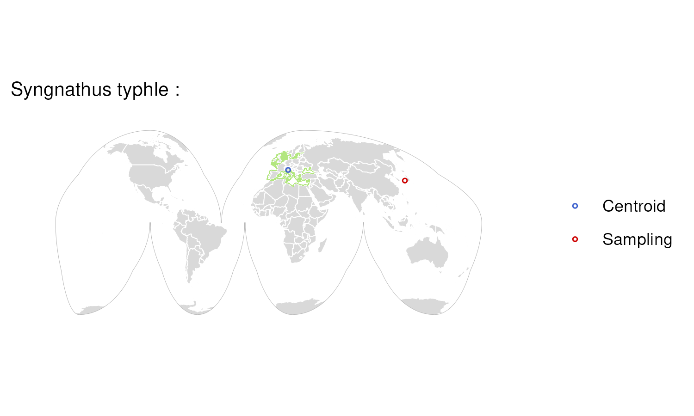

### Species: Taeniopygia guttata

**Common Name:** zebra finch\
**Biosample:** SAMN47142318\
**Assembly Accession:** GCA_048771995.1\
**Taxon:** Birds\
**Priority:** 4\
**Flags:** Outside Range;

**Map Notes:**\
**Comments:** NA

### Species: Thamnophis elegans

**Common Name:** Western terrestrial garter snake\
**Biosample:** SAMN12629499\
**Assembly Accession:** GCA_009769535.1\
**Taxon:** Reptiles\
**Priority:** 4\
**Flags:** Outside Range;

**Map Notes:**\
**Comments:** This assembly represents the principal haplotype of the
diploid genome Thamnophis elegans and includes the chromosomes. The
alternate haplotype sequences are in WGS project WNNB00000000

### Species: Toxotes jaculatrix

**Common Name:** banded archerfish\
**Biosample:** SAMN18445299\
**Assembly Accession:** GCA_017976425.1\
**Taxon:** Fishes\
**Priority:** 4\
**Flags:** Outside Range;

**Map Notes:**\
**Comments:** NA

### Species: Trichosurus vulpecula

**Common Name:** common brushtail possum\
**Biosample:** SAMN12629507\
**Assembly Accession:** GCA_011100635.1\
**Taxon:** Mammals\
**Priority:** 4\
**Flags:** Outside Range;

**Map Notes:**\
**Comments:** This assembly represents the principal haplotype of the
diploid genome Trichosurus vulpecula and includes the chromosomes. The
alternate haplotype sequences are in WGS project JAANDF000000000

### Species: Xenentodon cancila

**Common Name:** needlefish\
**Biosample:** SAMN12623622\
**Assembly Accession:** GCA_014839995.1\
**Taxon:** Fishes\
**Priority:** 4\
**Flags:** Outside Range;

**Map Notes:**\
**Comments:** This assembly represents the principal haplotype of the
diploid genome Xenentodon cancila and includes the chromosomes. The
alternate haplotype sequences are in WGS project JABWDR000000000

### Species: Xenopus petersii

**Common Name:** Peter’s clawed frog\
**Biosample:** SAMN39187339\
**Assembly Accession:** GCA_038501925.1\
**Taxon:** Amphibians\
**Priority:** 4\
**Flags:** Outside Range;

**Map Notes:**\
**Comments:** NA

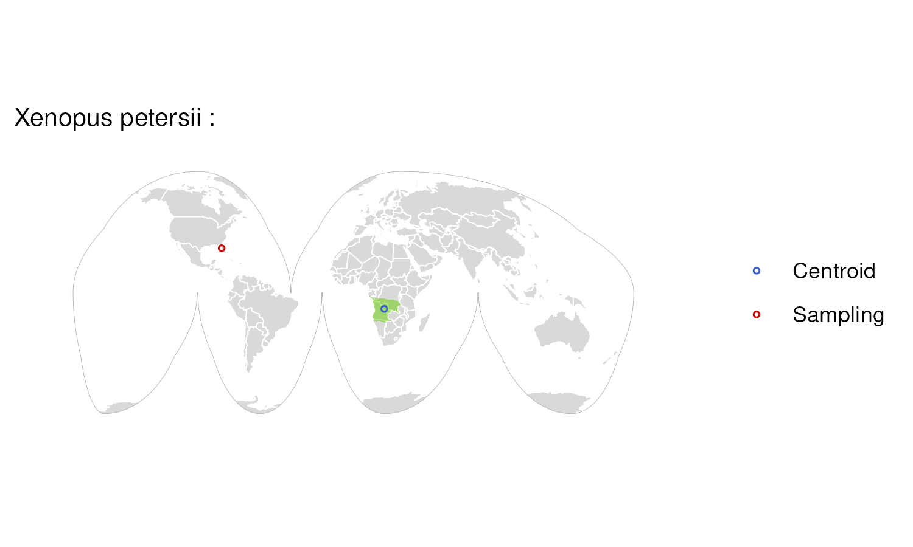

### Species: Caesio teres

**Common Name:** yellow and blueback fusilier\
**Biosample:** SAMN41769331\
**Assembly Accession:** GCA_048129055.1\
**Taxon:** Fishes\
**Priority:** 5\
**Flags:** Vague Location;

**Map Notes:**\
**Comments:** NA

### Species: Dama dama

**Common Name:** fallow deer\
**Biosample:** SAMN36735489\
**Assembly Accession:** GCA_048126745.1\
**Taxon:** Mammals\
**Priority:** 5\
**Flags:** Vague Location;

**Map Notes:**\
**Comments:** NA

### Species: Hirundo rustica

**Common Name:** barn swallow\
**Biosample:** SAMN14675488\
**Assembly Accession:** GCA_015227805.3\
**Taxon:** Birds\
**Priority:** 5\
**Flags:** Vague Location;

**Map Notes:**\
**Comments:** NA

### Species: Ovis canadensis

**Common Name:** bighorn sheep\
**Biosample:** SAMN42787568\
**Assembly Accession:** GCA_042477335.2\
**Taxon:** Mammals\
**Priority:** 5\
**Flags:** Vague Location;

**Map Notes:**\
**Comments:** NA

### Species: Abramis brama

**Common Name:** common bream\
**Biosample:** SAMEA11296536\
**Assembly Accession:** GCA_963993115.1\
**Taxon:** Fishes\
**Priority:** 6\
**Flags:**

**Map Notes:**\
**Comments:** The assembly fAbrBra2.1 is based on 44x PacBio data and
Arima2 Hi-C data generated by the Darwin Tree of Life Project
(<https://www.darwintreeoflife.org/>). The assembly process included the
following sequence of steps: initial PacBio assembly generation with
Hifiasm, retained haplotig separation with purge_dups, and Hi-C based
scaffolding with YaHS. The mitochondrial genome was assembled using
MitoHiFi. Finally, the primary assembly was analysed and manually
improved using TreeVal. Chromosome-scale scaffolds confirmed by the Hi-C
data have been named in order of size.

### Species: Acanthisitta chloris

**Common Name:** rifleman\
**Biosample:** SAMN16442762\
**Assembly Accession:** GCA_016904835.1\
**Taxon:** Birds\
**Priority:** 6\
**Flags:**

**Map Notes:**\
**Comments:** NA

### Species: Acanthopagrus schlegelii

**Common Name:** black porgy\
**Biosample:** SAMN43087228\
**Assembly Accession:** GCA_041753875.1\
**Taxon:** Fishes\
**Priority:** 6\
**Flags:**

**Map Notes:**\
**Comments:** NA

### Species: Accipiter gentilis

**Common Name:** Northern goshawk\
**Biosample:** SAMEA8235650\
**Assembly Accession:** GCA_929443795.1\
**Taxon:** Birds\
**Priority:** 6\
**Flags:**

**Map Notes:**\
**Comments:** The assembly bAccGen1.1 is based on 34x PacBio data, 10X
Genomics Chromium data, and Arima2 Hi-C data generated by the Darwin
Tree of Life Project (<https://www.darwintreeoflife.org/>). The assembly
process included the following sequence of steps: initial PacBio
assembly generation with Hifiasm, retained haplotig separation with
purge_dups, short-read polishing using FreeBayes-called variants from
10X Genomics Chromium reads aligned with LongRanger, and Hi-C based
scaffolding with YaHS. The mitochondrial genome was assembled using
MitoHifi. Finally, the assembly was analysed and manually improved using
rapid curation. Chromosome-scale scaffolds confirmed by the Hi-C data
have been named in order of size. Microchromosomes SUPER_35, SUPER_36,
SUPER_37, and SUPER_38 were curated based on homology to
microchromosomes found in Gallus gallus, Taeniopygia guttata, and
Cuculus canorus.

### Species: Aegotheles albertisi

**Common Name:** mountain owlet-nightjar\
**Biosample:** SAMN41085506\
**Assembly Accession:** GCA_039906565.1\
**Taxon:** Birds\
**Priority:** 6\
**Flags:**

**Map Notes:**\
**Comments:** NA

### Species: Agelaius phoeniceus

**Common Name:** red-winged blackbird\
**Biosample:** SAMN19590559\
**Assembly Accession:** GCA_020745825.3\
**Taxon:** Birds\
**Priority:** 6\
**Flags:**

**Map Notes:**\
**Comments:** Agelaius phoeniceus (red-winged blackbird) Sequence
Assembly Release Notes Background: The red-winged blackbird (family
Icteridae), one of the most common songbirds in North America and an
icterid with typical nesting behavior, was chosen for this study to
serve as an outgroup to the obligate brood parasitic brown-headed
cowbird (Molothrus ater). Red-winged blackbird DNA isolated for whole
genome sequencing is derived from an adult female located in the state
of Texas. High molecular weight DNA was used as input to generate
long-reads using circular consensus sequence (CCS) base calling output
from the Sequel II instrument (Pacific Biosciences) according to the
manufacturer’s protocols. Total CCS coverage was approx. 38x using a
genome size estimate of 1.1Gb. All quality filtered sequence reads were
assembled with HiFasm using default parameter settings and redundant
contigs removed using purge_haplotigs. Assembled contigs were scaffolded
with Hi-C data from the same individual using SALSA2, and then manually
curated with JuiceBox. Chromosomes were numbered by size with the
exception of 16 which was numbered based on alignment with chicken.

This work was supported by NSF grants DBI 1754311, 1754397, 1754406,
1754643, 1940624.

Agelaius phoeniceus 1.1 Sequence and Assembly Credits: DNA source -
Hidalgo County, Texas (BioBank/Freezerworks ID: 100140; Name: 224;
Unique Aliquot ID 101355; Developmental stage: Adult; Tissue type:
brain; Date collected: 3/30/2018; Received from: Kathleen Lynch, Hofstra
University, NY; Specimen ID: MCZ Ornithology 364415, collector Scott
Edwards, link: <https://mczbase.mcz.harvard.edu/guid/MCZ:Orn:364415>).
Genome Sequence - Hudson Alpha Institute, Hunstville, AL. Sequence and
Assembly - University of Missouri, Columbia, MO.

Citation upon use of this assembly in a manuscript: It is requested that
users of this Agelaius phoeniceus 1.1 sequence assembly acknowledge the
brood parasitic bird genomes consortium in any publications that result
from use of this sequence assembly prior to the publication of this
resource. Any publications that propose to generate whole genome
analyses using this resource should contact Dr. Michael Sorenson
([msoren\@bu.edu](mailto:msoren@bu.edu){.email}) or Chris Balakrishnan
([balakrishnanc\@ecu.edu](mailto:balakrishnanc@ecu.edu){.email}) for the
use of pre-publication data in accord with the Ft. Lauderdale and
Toronto genomic data use agreements.

The scaffolds and chromosomes for this genome were updated on October
2022. There was no change to the contigs.

### Species: Alca Torda

**Common Name:** razorbill\
**Biosample:** SAMN12292087\
**Assembly Accession:** GCA_008658365.1\
**Taxon:** Birds\
**Priority:** 6\
**Flags:**

**Map Notes:**\
**Comments:** This assembly represents the principal pseudohaplotype of
the diploid genome Alca torda and includes the chromosomes. The
alternate pseudohaplotype sequences are in WGS project VMEC00000000.

### Species: Alligator mississippiensis

**Common Name:** American alligator\
**Biosample:** SAMN37045233\
**Assembly Accession:** GCA_030867095.1\
**Taxon:** Reptiles\
**Priority:** 6\
**Flags:**

**Map Notes:**\
**Comments:** NA

### Species: Alosa sapidissima

**Common Name:** American shad\
**Biosample:** SAMN18857608\
**Assembly Accession:** GCA_018492685.1\
**Taxon:** Fishes\
**Priority:** 6\
**Flags:**

**Map Notes:**\
**Comments:** NA

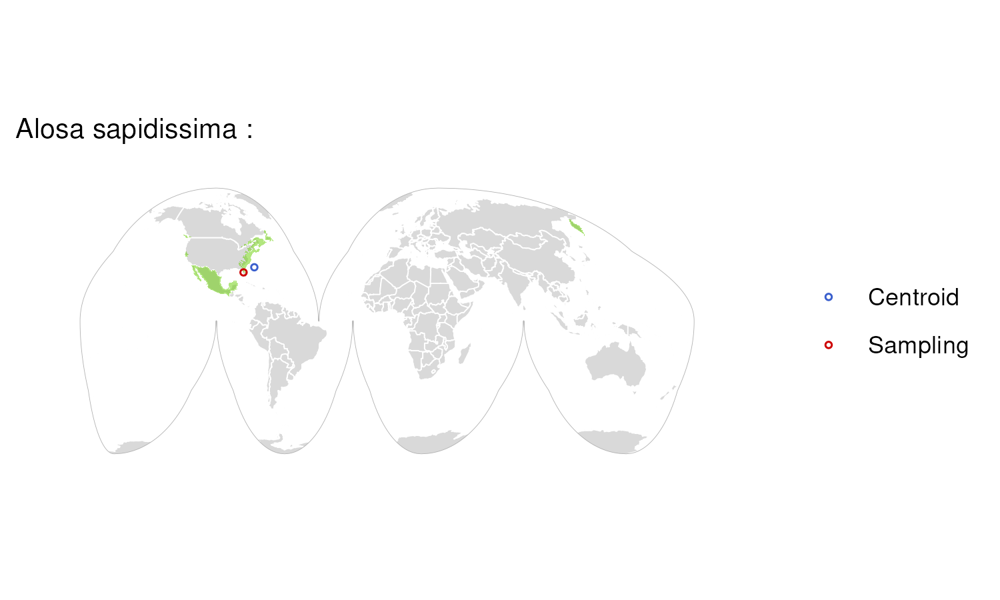

### Species: Amazona ochrocephala

**Common Name:** yellow-crowned amazon\
**Biosample:** SAMN41018448\
**Assembly Accession:** GCA_039720435.1\
**Taxon:** Birds\
**Priority:** 6\
**Flags:**

**Map Notes:**\
**Comments:** NA

### Species: Amblyopsis spelaea

**Common Name:** Northern cavefish\
**Biosample:** SAMN45063415\
**Assembly Accession:** GCA_046255685.1\
**Taxon:** Fishes\
**Priority:** 6\
**Flags:**

**Map Notes:**\
**Comments:** NA

### Species: Amblyraja radiata

**Common Name:** thorny skate\
**Biosample:** SAMN09948523\
**Assembly Accession:** GCA_010909765.2\
**Taxon:** Fishes\
**Priority:** 6\
**Flags:**

**Map Notes:**\
**Comments:** This assembly represents the principal haplotype of the
diploid genome Amblyraja radiata and includes the chromosomes. The
alternate haplotype sequences are in WGS project JAAGWS000000000
Chromosome 44 in assembly sAmbRad1.pri was reidentified as chromosome X
in assembly sAmbRad1.1.pri in March 2021.

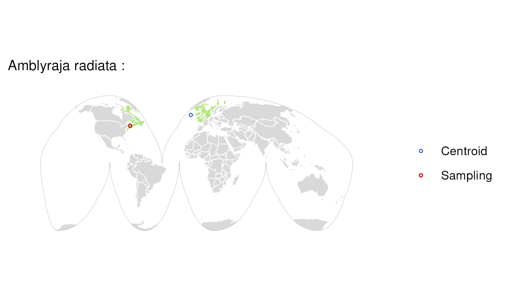

### Species: Amia calva

**Common Name:** bowfin\
**Biosample:** SAMN39643085\
**Assembly Accession:** GCA_036373705.1\
**Taxon:** Fishes\
**Priority:** 6\
**Flags:** Missing Range;

**Map Notes:**\
**Comments:** NA

### Species: Ammodramus caudacutus

**Common Name:** saltmarsh sparrow\
**Biosample:** SAMN28421630\
**Assembly Accession:** GCA_027887145.1\
**Taxon:** Birds\
**Priority:** 6\
**Flags:**

**Map Notes:**\
**Comments:** Orientation is uncertain for chromosome 7 0-6.79mb

### Species: Ammodytes marinus

**Common Name:** lesseer sand eel\
**Biosample:** SAMEA110137622\
**Assembly Accession:** GCA_949987685.1\
**Taxon:** Fishes\
**Priority:** 6\
**Flags:** Missing Range;

**Map Notes:**\
**Comments:** The assembly fAmmMar1.1 is based on 58x PacBio data and
Arima2 Hi-C data generated by the Wellcome Sanger Institute Tree of Life
Programme (<https://www.sanger.ac.uk/programme/tree-of-life/>) as part
of the European Reference Genome Atlas pilot project
(<https://www.erga-biodiversity.eu/pilot-project>). The assembly process
included the following sequence of steps: initial PacBio assembly
generation with Hifiasm, retained haplotig separation with purge_dups,
and Hi-C based scaffolding with YaHS. The mitochondrial genome was
assembled using MitoHiFi. Finally, the primary assembly was analysed and
manually improved using rapid curation. This alternate haplotype
assembly combines the haplotigs separated by purge_dups with haplotigs
separated from the primary assembly during curation.

### Species: Ammospiza maritima

**Common Name:** seaside sparrow\
**Biosample:** SAMN39181024\
**Assembly Accession:** GCA_036010785.1\
**Taxon:** Birds\
**Priority:** 6\
**Flags:**

**Map Notes:**\
**Comments:** NA

### Species: Ammospiza nelsoni

**Common Name:** Nelson’s sparrow\
**Biosample:** SAMN28421656\
**Assembly Accession:** GCA_027579445.1\
**Taxon:** Birds\
**Priority:** 6\
**Flags:**

**Map Notes:**\
**Comments:** NA

### Species: Anableps anableps

**Common Name:** largescale four-eyes\
**Biosample:** SAMN12623628\
**Assembly Accession:** GCA_014839685.1\
**Taxon:** Fishes\
**Priority:** 6\
**Flags:** Zoo Sample;

**Map Notes:**\
**Comments:** This assembly represents the principal haplotype of the
diploid genome Anableps anableps and includes the chromosomes. The
alternate haplotype sequences are in WGS project JABWDT000000000

### Species: Anas acuta

**Common Name:** northern pintail\
**Biosample:** SAMEA112468036\
**Assembly Accession:** GCA_963932015.1\
**Taxon:** Birds\
**Priority:** 6\
**Flags:**

**Map Notes:**\
**Comments:** The assembly bAnaAcu1.1 is based on 28x PacBio data and
Arima2 Hi-C data generated by the Darwin Tree of Life Project
(<https://www.darwintreeoflife.org/>). The assembly process included the
following sequence of steps: initial PacBio assembly generation with
Hifiasm, retained haplotig separation with purge_dups, and Hi-C based
scaffolding with YaHS. The mitochondrial genome was assembled using
MitoHiFi. Finally, the primary assembly was analysed and manually
improved using TreeVal. Chromosome-scale scaffolds confirmed by the Hi-C
data have been named in order of size. The reported karyotype for this
species is n=40. Only 37 autosomes could be confidently assigned during
curation.

### Species: Anas platyrhynchos

**Common Name:** mallard\
**Biosample:** SAMEA113398833\
**Assembly Accession:** GCA_964188345.1\
**Taxon:** Birds\
**Priority:** 6\
**Flags:**

**Map Notes:**\
**Comments:** The assembly bAnaPla2.hap1.1 is based on 65x PacBio data
and Arima2 Hi-C data generated by the Darwin Tree of Life Project
(<https://www.darwintreeoflife.org/>). The assembly process included the
following sequence of steps: initial PacBio assembly generation with
Hifiasm in Hi-C integrated assembly mode, and Hi-C based scaffolding
with YaHS. The mitochondrial genome was assembled using MitoHiFi.
Finally, each haplotype assembly was analysed and manually improved
using TreeVal. Chromosome-scale scaffolds confirmed by the Hi-C data
have been named in order of size.

### Species: Anguilla anguilla

**Common Name:** European eel\
**Biosample:** SAMN12623627\
**Assembly Accession:** GCA_013347855.1\
**Taxon:** Fishes\
**Priority:** 6\
**Flags:**

**Map Notes:**\
**Comments:** This assembly represents the principal haplotype of the
diploid genome Anguilla anguilla and includes the chromosomes. The
alternate haplotype sequences are in WGS project JABVMH000000000

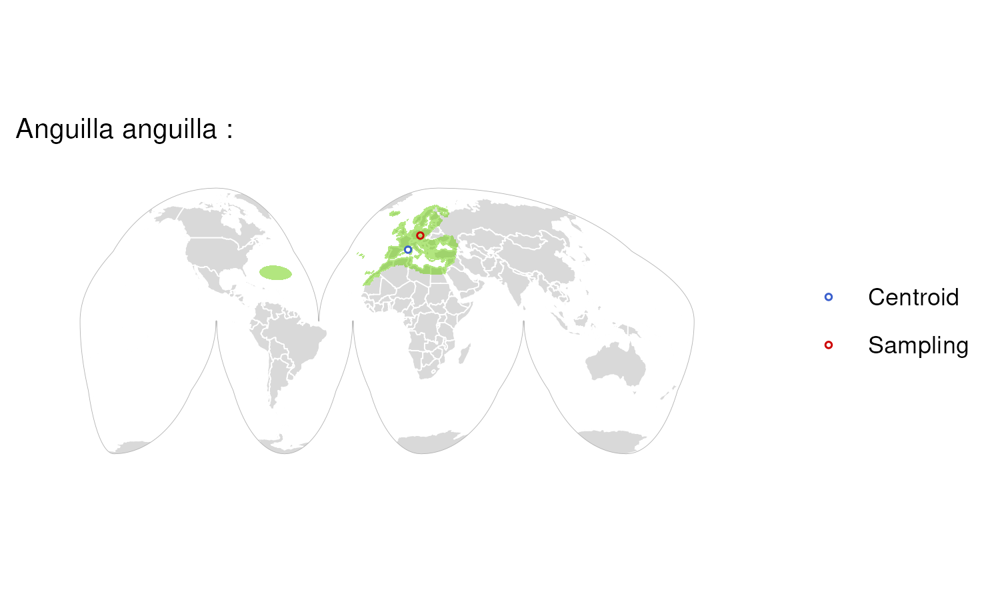

### Species: Anniella stebbinsi

**Common Name:** Southern California legless lizard\
**Biosample:** SAMN33386066\
**Assembly Accession:** GCA_029215775.1\
**Taxon:** Reptiles\
**Priority:** 6\
**Flags:**

**Map Notes:**\
**Comments:** The mitochondrial sequence JARDYG010000134.1 was generated
with MitoHiFi (V2.2) using the existing Dopasia sokolovi mitochondrial
sequence (NC_071253.1) as a reference

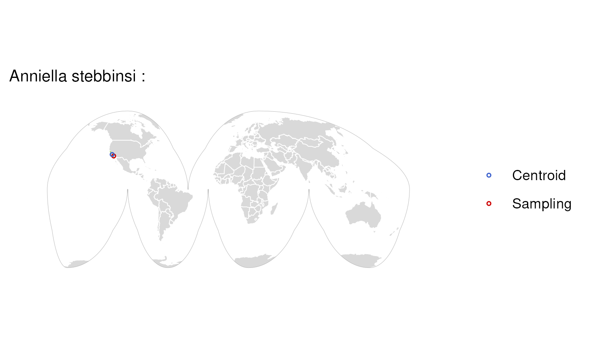

### Species: Anolis sagrei

**Common Name:** brown anole\
**Biosample:** SAMN40144551\
**Assembly Accession:** GCA_037176765.1\
**Taxon:** Reptiles\
**Priority:** 6\
**Flags:**

**Map Notes:**\
**Comments:** NA

### Species: Anomaloglossus baeobatrachus

**Common Name:** Edward’s Rocket Frog\
**Biosample:** SAMN46966667\
**Assembly Accession:** GCA_048569485.1\
**Taxon:** Amphibians\
**Priority:** 6\
**Flags:**

**Map Notes:**\
**Comments:** NA

### Species: Anser anser

**Common Name:** domestic goose\
**Biosample:** SAMEA113398854\
**Assembly Accession:** GCA_964211835.1\
**Taxon:** Birds\
**Priority:** 6\
**Flags:**

**Map Notes:**\
**Comments:** The assembly bAnsAns1.hap1.1 is based on 56x PacBio data
and Arima2 Hi-C data generated by the Darwin Tree of Life Project
(<https://www.darwintreeoflife.org/>). The assembly process included the
following sequence of steps: initial PacBio assembly generation with
Hifiasm in Hi-C integrated assembly mode, and Hi-C based scaffolding
with YaHS. The mitochondrial genome was assembled using MitoHiFi.
Finally, each haplotype assembly was analysed and manually improved
using TreeVal. Chromosome-scale scaffolds confirmed by the Hi-C data
have been named in order of size. Chromosomes Z and W were identified by
read coverage.

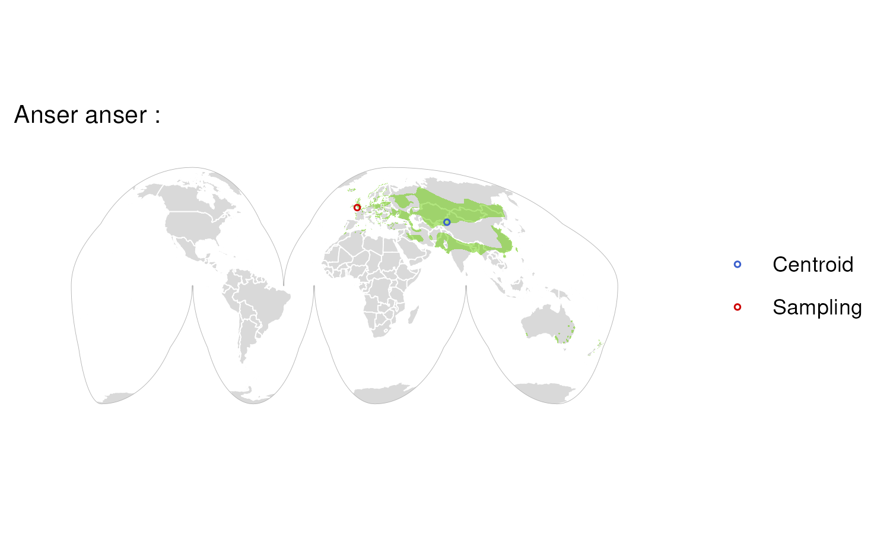

### Species: Anser cygnoides

**Common Name:** swan goose\
**Biosample:** SAMN41386743\
**Assembly Accession:** GCA_040182565.1\
**Taxon:** Birds\
**Priority:** 6\
**Flags:**

**Map Notes:**\
**Comments:** NA

### Species: Antrozous pallidus

**Common Name:** pallid bat\
**Biosample:** SAMN30225125\
**Assembly Accession:** GCA_027563665.1\
**Taxon:** Mammals\
**Priority:** 6\
**Flags:**

**Map Notes:**\
**Comments:** NA

### Species: Aplidium turbinatum

**Common Name:** clonial sea squirt\
**Biosample:** SAMEA7536566\
**Assembly Accession:** GCA_918807975.1\
**Taxon:** Invertebrates\
**Priority:** 6\
**Flags:** Missing Range;

**Map Notes:**\
**Comments:** The assembly kaAplTurb1.1 is based on 65x PacBio data, 10X
Genomics Chromium data, and Arima Hi-C data generated by the Darwin Tree
of Life Project (<https://www.darwintreeoflife.org/>). The assembly
process included the following sequence of steps: initial PacBio
assembly generation with Hifiasm, retained haplotig separation with
purge_dups, short-read polishing using FreeBayes-called variants from
10X Genomics Chromium reads aligned with LongRanger, and Hi-C based
scaffolding with SALSA2. The mitochondrial genome was assembled using
MitoHifi. Finally, the assembly was analysed and manually improved using
gEVAL. Chromosome-scale scaffolds confirmed by the Hi-C data have been
named in order of size.

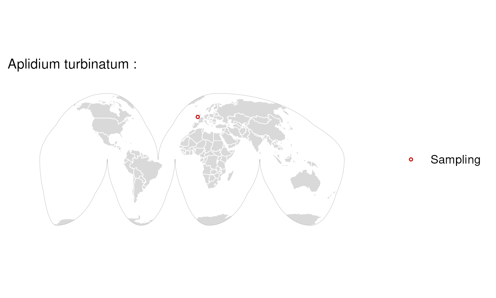

### Species: Aplochiton taeniatus

**Common Name:** peladilla\
**Biosample:** SAMN12623621\
**Assembly Accession:** GCA_017639675.1\
**Taxon:** Fishes\
**Priority:** 6\
**Flags:**

**Map Notes:**\
**Comments:** NA

### Species: Apodemus sylvaticus

**Common Name:** European woodmouse\
**Biosample:** SAMEA7702024\
**Assembly Accession:** GCA_947179515.1\
**Taxon:** Mammals\
**Priority:** 6\
**Flags:**

**Map Notes:**\
**Comments:** The assembly mApoSyl1.1 is based on 25x PacBio data, 10X
Genomics Chromium data, and Arima2 Hi-C data generated by the Darwin
Tree of Life Project (<https://www.darwintreeoflife.org/>). The assembly
process included the following sequence of steps: initial PacBio
assembly generation with Hifiasm, retained haplotig separation with
purge_dups, and Hi-C based scaffolding with YaHS. The mitochondrial
genome was assembled using MitoHiFi. Finally, the primary assembly was
analysed and manually improved using gEVAL. Chromosome-scale scaffolds
confirmed by the Hi-C data have been named in order of size.

### Species: Apteryx mantelli

**Common Name:** North Island brown kiwi\
**Biosample:** SAMN39257886\
**Assembly Accession:** GCA_036417845.1\
**Taxon:** Birds\
**Priority:** 6\
**Flags:** Zoo Sample;

**Map Notes:**\
**Comments:** NA

### Species: Apus apus

**Common Name:** common swift\
**Biosample:** SAMN22785356\
**Assembly Accession:** GCA_020740795.1\
**Taxon:** Birds\
**Priority:** 6\
**Flags:**

**Map Notes:**\
**Comments:** NA

### Species: Argentina silus

**Common Name:** greater argentine\
**Biosample:** SAMEA110137623\
**Assembly Accession:** GCA_951799395.1\
**Taxon:** Fishes\
**Priority:** 6\
**Flags:** Missing Range;

**Map Notes:**\
**Comments:** The assembly fArgSil1.1 is based on 84x PacBio data and
Arima2 Hi-C data generated by the Wellcome Sanger Institute Tree of Life
Programme (<https://www.sanger.ac.uk/programme/tree-of-life/>) as part
of the European Reference Genome Atlas pilot project
(<https://www.erga-biodiversity.eu/pilot-project>). The assembly process
included the following sequence of steps: initial PacBio assembly
generation with Hifiasm, retained haplotig separation with purge_dups,
and Hi-C based scaffolding with YaHS. The mitochondrial genome was
assembled using MitoHiFi. Finally, the primary assembly was analysed and
manually improved using rapid curation. This alternate haplotype
assembly combines the haplotigs separated by purge_dups with haplotigs
separated from the primary assembly during curation. Sex chromosomes
were annotated based on coverage statistics as well as synteny to
GCF_016920845.1

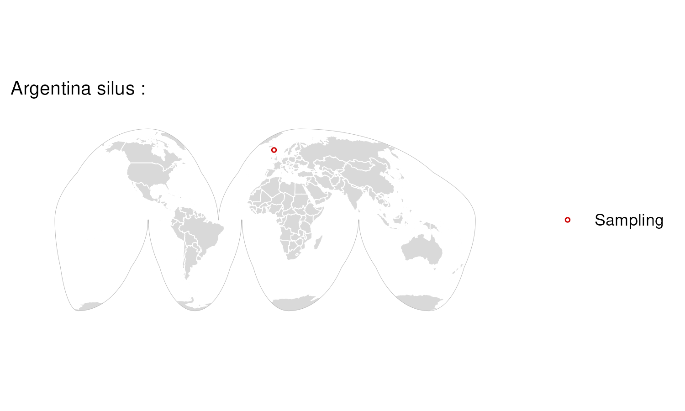

### Species: Arripis georgiana

**Common Name:** Australian herring\
**Biosample:** SAMN40589644\
**Assembly Accession:** GCA_042242135.1\
**Taxon:** Fishes\
**Priority:** 6\
**Flags:** Missing Range;

**Map Notes:**\
**Comments:** NA

### Species: Artibeus intermedius

**Common Name:** intermediate fruit-eating bat\
**Biosample:** SAMN40002248\
**Assembly Accession:** GCA_038363145.1\
**Taxon:** Mammals\
**Priority:** 6\
**Flags:**

**Map Notes:**\
**Comments:** NA

### Species: Ascaphus truei

**Common Name:** coastal tailed frog\
**Biosample:** SAMN41155128\
**Assembly Accession:** GCA_040206685.1\
**Taxon:** Amphibians\
**Priority:** 6\
**Flags:**

**Map Notes:**\
**Comments:** The following regions are of uncertain order and
orientation: Haplotype 1 Chromosome 1 - approx. 267.5-307 Mbp; Haplotype
1 Chromosome 3 - approx. 132-186 Mbp; Haplotype 1 Chromosome 4 - approx.
144-184 Mbp.

### Species: Ascidia mentula

**Common Name:** pink sea squirt\
**Biosample:** SAMEA8724667\
**Assembly Accession:** GCA_947561715.1\
**Taxon:** Invertebrates\
**Priority:** 6\
**Flags:** Missing Range;

**Map Notes:**\
**Comments:** The assembly kaAscMent1.1 is based on 74x PacBio data and
Arima2 Hi-C data generated by the Darwin Tree of Life Project
(<https://www.darwintreeoflife.org/>). The assembly process included the
following sequence of steps: initial PacBio assembly generation with
Hifiasm, retained haplotig separation with purge_dups, and Hi-C based
scaffolding with YaHS. The mitochondrial genome was assembled using
MitoHiFi. Finally, the primary assembly was analysed and manually
improved using rapid curation. Chromosome-scale scaffolds confirmed by
the Hi-C data have been named in order of size. The following regions of
this assembly are of undetermined order and orientation: Chromosome 7
region 13 - 14 Mbp.

### Species: Ascidiella aspersa

**Common Name:** European sea squirt\
**Biosample:** SAMEA110449820\
**Assembly Accession:** GCA_963924565.1\
**Taxon:** Invertebrates\
**Priority:** 6\
**Flags:** Missing Range;

**Map Notes:**\
**Comments:** The assembly kaAscAspe10.1 is based on 61x PacBio data and
Arima2 Hi-C data generated by the Darwin Tree of Life Project
(<https://www.darwintreeoflife.org/>). The assembly process included the
following sequence of steps: initial PacBio assembly generation with
Hifiasm, retained haplotig separation with purge_dups, and Hi-C based
scaffolding with YaHS. The mitochondrial genome was assembled using
OATK. Finally, the primary assembly was analysed and manually improved
using TreeVal. Chromosome-scale scaffolds confirmed by the Hi-C data
have been named in order of size. The order and orientation of contigs
along chromosome 5 is uncertain between 8.4 Mb and 15 Mb.

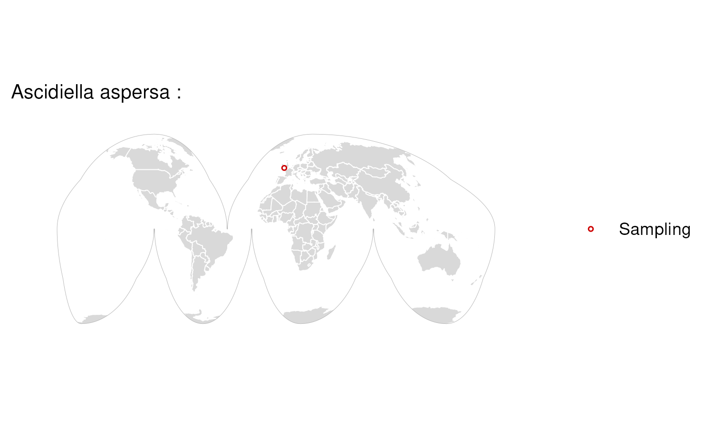

### Species: Aselliscus stoliczkanus

**Common Name:** Stoliczka’s trident bat\
**Biosample:** SAMN33370315\
**Assembly Accession:** GCA_043727835.1\
**Taxon:** Mammals\
**Priority:** 6\
**Flags:**

**Map Notes:**\
**Comments:** NA

### Species: Aspidoscelis tigris stejnegeri

**Common Name:** Western whiptail stejnegeri\
**Biosample:** SAMN25872408\
**Assembly Accession:** GCA_023333525.2\
**Taxon:** Reptiles\
**Priority:** 6\
**Flags:**

**Map Notes:**\
**Comments:** NA

### Species: Athene noctua

**Common Name:** little owl\
**Biosample:** SAMEA114594456\
**Assembly Accession:** GCA_965140245.1\
**Taxon:** Birds\
**Priority:** 6\
**Flags:**

**Map Notes:**\
**Comments:** The assembly bAthNoc1.hap1.1 is based on 55x PacBio data
and Arima2 Hi-C data generated by the Darwin Tree of Life Project
(<https://www.darwintreeoflife.org/>). The assembly process included the
following sequence of steps: initial PacBio assembly generation with
Hifiasm in Hi-C integrated assembly mode, and Hi-C based scaffolding
with YaHS. The mitochondrial genome was assembled using MitoHiFi.
Finally, each haplotype assembly was analysed and manually improved
using TreeVal. Chromosome-scale scaffolds confirmed by the Hi-C data
have been named in order of size. Z chromosome identified based on
alignment with GCA_024206055.2 (Gallus gallus GGswu).

### Species: Aulostomus maculatus

**Common Name:** West Atlantic trumpetfish\
**Biosample:** SAMN43082348\
**Assembly Accession:** GCA_048301465.1\
**Taxon:** Fishes\
**Priority:** 6\
**Flags:**

**Map Notes:**\
**Comments:** NA

### Species: Aythya ferina

**Common Name:** common pochard\
**Biosample:** SAMEA112468034\
**Assembly Accession:** GCA_964211825.1\
**Taxon:** Birds\
**Priority:** 6\
**Flags:**

**Map Notes:**\
**Comments:** The assembly bAytFer1.hap1.1 is based on 122x PacBio data
and Arima2 Hi-C data generated by the Darwin Tree of Life Project
(<https://www.darwintreeoflife.org/>). The assembly process included the
following sequence of steps: initial PacBio assembly generation with
Hifiasm in Hi-C integrated assembly mode, and Hi-C based scaffolding
with YaHS. The mitochondrial genome was assembled using MitoHiFi.
Finally, each haplotype assembly was analysed and manually improved
using TreeVal. Chromosome-scale scaffolds confirmed by the Hi-C data
have been named in order of size. Chromosomes Z and W were assigned by
read coverage

### Species: Aythya fuligula

**Common Name:** tufted duck\
**Biosample:** SAMN12621346\
**Assembly Accession:** GCA_009819795.1\
**Taxon:** Birds\
**Priority:** 6\
**Flags:**

**Map Notes:**\
**Comments:** This assembly represents the principal haplotype of the
diploid genome Aythya fuligula and includes the chromosomes. The
alternate haplotype sequences are in WGS project WNMN00000000

### Species: Aythya marila

**Common Name:** greater scaup\
**Biosample:** SAMEA115433010\
**Assembly Accession:** GCA_965140915.1\
**Taxon:** Birds\
**Priority:** 6\
**Flags:**

**Map Notes:**\
**Comments:** The assembly bAytMar2.hap1.1 is based on 63x PacBio data
and Arima2 Hi-C data generated by the Darwin Tree of Life Project
(<https://www.darwintreeoflife.org/>). The assembly process included the
following sequence of steps: initial PacBio assembly generation with
Hifiasm in Hi-C integrated assembly mode, and Hi-C based scaffolding
with YaHS. The mitochondrial genome was assembled using MitoHiFi.
Finally, each haplotype assembly was analysed and manually improved
using TreeVal. Chromosome-scale scaffolds confirmed by the Hi-C data
have been named in order of size.

### Species: Balaenoptera acutorostrata

**Common Name:** common minke whale\
**Biosample:** SAMEA111380540\
**Assembly Accession:** GCA_949987535.1\
**Taxon:** Mammals\
**Priority:** 6\
**Flags:**

**Map Notes:**\
**Comments:** The assembly mBalAcu1.1 is based on 30x PacBio data and
Arima2 Hi-C data generated by the Darwin Tree of Life Project
(<https://www.darwintreeoflife.org/>). The assembly process included the
following sequence of steps: initial PacBio assembly generation with
Hifiasm, retained haplotig separation with purge_dups, and Hi-C based
scaffolding with YaHS. The mitochondrial genome was assembled using
MitoHiFi. Finally, the primary assembly was analysed and manually
improved using rapid curation. Chromosome-scale scaffolds confirmed by
the Hi-C data have been named in order of size. The X chromosome was
identified based on synteny with Balaenoptera ricei (GCA_028023285.1).

### Species: Balaenoptera borealis

**Common Name:** sei whale\
**Biosample:** SAMEA114493134\
**Assembly Accession:** GCA_965194805.1\
**Taxon:** Mammals\
**Priority:** 6\
**Flags:**

**Map Notes:**\
**Comments:** The assembly mBalBor1.hap1.1 is based on 48x PacBio data
and Arima2 Hi-C data generated by the Darwin Tree of Life Project
(<https://www.darwintreeoflife.org/>). The assembly process included the
following sequence of steps: initial PacBio assembly generation with
Hifiasm in Hi-C integrated assembly mode, and Hi-C based scaffolding
with YaHS. The mitochondrial genome was assembled using MitoHiFi.
Finally, each haplotype assembly was analysed and manually improved
using TreeVal. Chromosome-scale scaffolds confirmed by the Hi-C data
have been named in order of size. Chromosome X was assigned based on
alignment to GCF_949987535.1

### Species: Balaenoptera musculus

**Common Name:** blue whale\
**Biosample:** SAMN12287136\
**Assembly Accession:** GCA_009873245.3\
**Taxon:** Mammals\
**Priority:** 6\
**Flags:**

**Map Notes:**\
**Comments:** This assembly represents the principal haplotype of the
diploid genome Balaenoptera musculus and includes the chromosomes. The
alternate haplotype sequences are in WGS project VNFD00000000

### Species: Balaenoptera physalus

**Common Name:** finback whale\
**Biosample:** SAMEA114493136\
**Assembly Accession:** GCA_965194825.1\
**Taxon:** Mammals\
**Priority:** 6\
**Flags:**

**Map Notes:**\
**Comments:** The assembly mBalPhy2.hap1.1 is based on 25x PacBio data
and Arima2 Hi-C data generated by the Darwin Tree of Life Project
(<https://www.darwintreeoflife.org/>). The assembly process included the
following sequence of steps: initial PacBio assembly generation with
Hifiasm in Hi-C integrated assembly mode, and Hi-C based scaffolding
with YaHS. The mitochondrial genome was assembled using MitoHiFi.
Finally, each haplotype assembly was analysed and manually improved
using TreeVal. Chromosome-scale scaffolds confirmed by the Hi-C data
have been named in order of size. The regions 20 to 22.5 Mbp in
Chromosome 4, 22.4 to 32.3 and 108.1 to 119.4 Mbp in Chromosome 6, 26 to
42.3 Mbp in Chromosome 7, 73 to 88.4 Mbp in Chromosome 10, 88.1 to 97.2
Mbp in Chromosome 13, 34.5 to 39.1 Mbp in Chromosome 17, 23.7 to 29.6
Mbp in Chromosome 19, 1.2 to 7.7 Mbp in Chromosome 21 and 18 to 24.3 Mbp
in Chromosome Y are highly repetitive and the order and orientation may
be uncertain.The sex chromosomes were identified by PacBio reads
coverage.

### Species: Balanoglossus misakiensis

**Common Name:** acorn worm\
**Biosample:** SAMN40579982\
**Assembly Accession:** GCA_040954625.2\
**Taxon:** Invertebrates\
**Priority:** 6\
**Flags:** Missing Range;

**Map Notes:**\
**Comments:** NA

### Species: Balearica regulorum gibbericeps

**Common Name:** grey crowned-crane\
**Biosample:** SAMN12615749\
**Assembly Accession:** GCA_011004875.1\
**Taxon:** Birds\
**Priority:** 6\
**Flags:** Zoo Sample; Missing Range;

**Map Notes:**\
**Comments:** This assembly represents the principal haplotype of the
diploid genome Balearica regulorum gibbericeps and includes the
chromosomes. The alternate haplotype sequences are in WGS project
JAAIYD000000000

### Species: Barbatula barbatula

**Common Name:** stone loach\
**Biosample:** SAMEA11296540\
**Assembly Accession:** GCA_947034865.1\
**Taxon:** Fishes\
**Priority:** 6\
**Flags:**

**Map Notes:**\
**Comments:** The assembly fBarBar1.1 is based on 30x PacBio data and
Arima2 Hi-C data generated by the Darwin Tree of Life Project
(<https://www.darwintreeoflife.org/>). The assembly process included the
following sequence of steps: initial PacBio assembly generation with
Hifiasm, retained haplotig separation with purge_dups, and Hi-C based
scaffolding with YaHS. The mitochondrial genome was assembled using
MitoHiFi. Finally, the primary assembly was analysed and manually
improved using rapid curation. Chromosome-scale scaffolds confirmed by
the Hi-C data have been named in order of size. Region of undetermined
order and orientation in Chromosome 4 12,000 Kbp - 23,500 Kbp.

### Species: Barbus barbus

**Common Name:** barbel\
**Biosample:** SAMEA13335783\
**Assembly Accession:** GCA_936440315.1\
**Taxon:** Fishes\
**Priority:** 6\
**Flags:**

**Map Notes:**\
**Comments:** The assembly fBarBab1.1 is based on 47x PacBio data and
Arima2 Hi-C data generated by the Darwin Tree of Life Project
(<https://www.darwintreeoflife.org/>). The assembly process included the
following sequence of steps: initial PacBio assembly generation with
Hifiasm, retained haplotig separation with purge_dups, and Hi-C based
scaffolding with YaHS. The mitochondrial genome was assembled using
MitoHiFi. Finally, the assembly was analysed and manually improved using
rapid curation. Chromosome-scale scaffolds confirmed by the Hi-C data
have been named in order of size.

### Species: Blennius ocellaris

**Common Name:** butterfly blenny\
**Biosample:** SAMEA112788961\
**Assembly Accession:** GCA_963422515.1\
**Taxon:** Fishes\
**Priority:** 6\
**Flags:**

**Map Notes:**\
**Comments:** The assembly fBleOce1.1 is based on 30x PacBio data and
Arima2 Hi-C data generated by the Darwin Tree of Life Project
(<https://www.darwintreeoflife.org/>). The assembly process included the
following sequence of steps: initial PacBio assembly generation with
Hifiasm, retained haplotig separation with purge_dups, and Hi-C based
scaffolding with YaHS. The mitochondrial genome was assembled using
MitoHiFi. Finally, the primary assembly was analysed and manually
improved using rapid curation. Chromosome-scale scaffolds confirmed by
the Hi-C data have been named in order of size.

### Species: Bombina bombina

**Common Name:** European fire-bellied toad\
**Biosample:** SAMN32378350\
**Assembly Accession:** GCA_027579735.1\
**Taxon:** Amphibians\
**Priority:** 6\
**Flags:**

**Map Notes:**\
**Comments:** NA

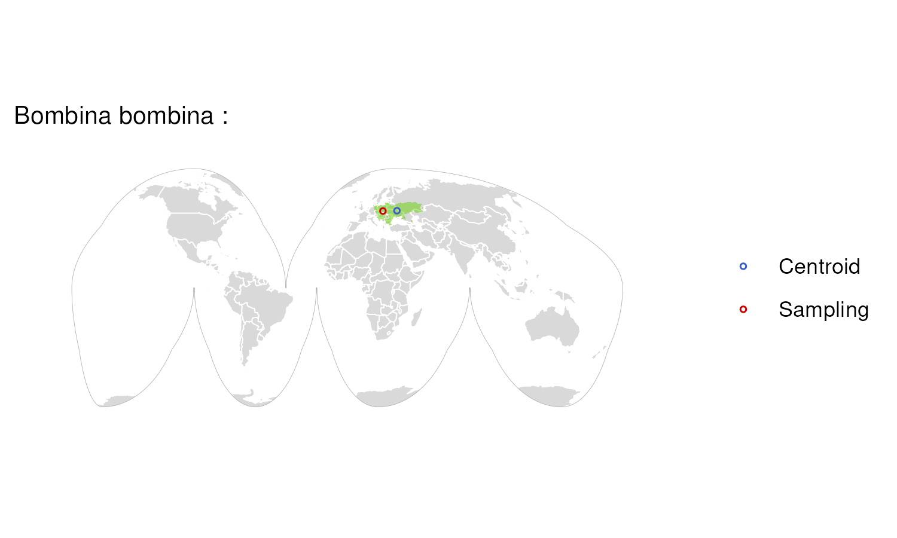

### Species: Bombina variegata

**Common Name:** yellow-bellied toad\
**Biosample:** SAMEA112651403\
**Assembly Accession:** GCA_964205295.1\
**Taxon:** Amphibians\
**Priority:** 6\
**Flags:**

**Map Notes:**\
**Comments:** The assembly aBomVar4.paternal.1 is based on 26x PacBio
data and Arima2 Hi-C data generated by the Wellcome Sanger Institute
Tree of Life Programme
(<https://www.sanger.ac.uk/programme/tree-of-life/>). The assembly
process included the following sequence of steps: initial PacBio
assembly generation with Hifiasm in ‘trio’ mode using k-mers from the
Illumina-sequenced parents, and Hi-C based scaffolding of each haplotype
separately with YaHS. The mitochondrial genome was assembled using
MitoHiFi. Finally, each haplotype assembly was analysed and manually
improved using TreeVal. Chromosome-scale scaffolds confirmed by the Hi-C
data have been named in order of size.

### Species: Borostomias antarcticus

**Common Name:** large-eye snaggletooth\
**Biosample:** SAMEA8748812\
**Assembly Accession:** GCA_949987555.1\
**Taxon:** Fishes\
**Priority:** 6\
**Flags:**

**Map Notes:**\
**Comments:** The assembly fBorAnt1.1 is based on 68x PacBio data and
Arima2 Hi-C data generated by the Darwin Tree of Life Project
(<https://www.darwintreeoflife.org/>). The assembly process included the
following sequence of steps: initial PacBio assembly generation with
Hifiasm, retained haplotig separation with purge_dups, and Hi-C based
scaffolding with YaHS. The mitochondrial genome was assembled using
MitoHiFi. Finally, the primary assembly was analysed and manually
improved using rapid curation. Chromosome-scale scaffolds confirmed by
the Hi-C data have been named in order of size.

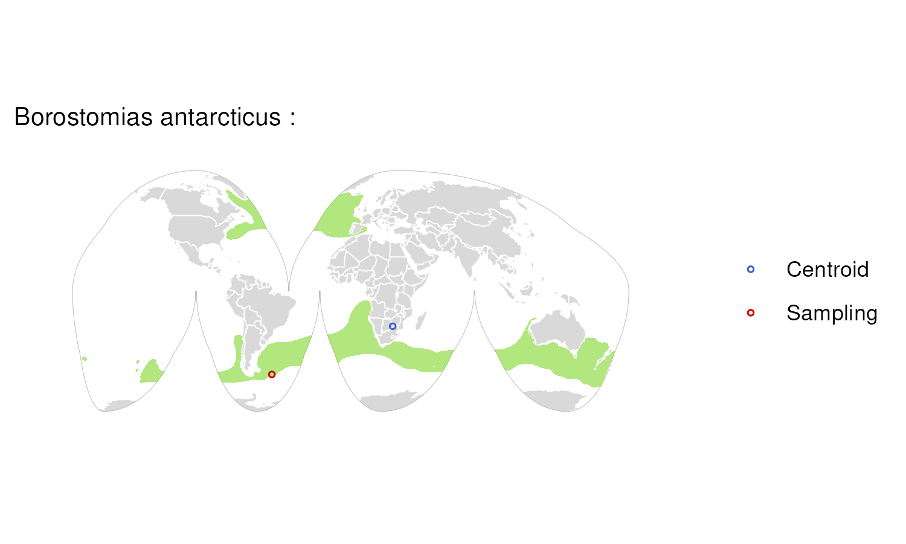

### Species: Bradypodion pumilum

**Common Name:** Cape dwarf chameleon\
**Biosample:** SAMN35825189\
**Assembly Accession:** GCA_047715975.1\
**Taxon:** Reptiles\
**Priority:** 6\
**Flags:**

**Map Notes:**\
**Comments:** NA

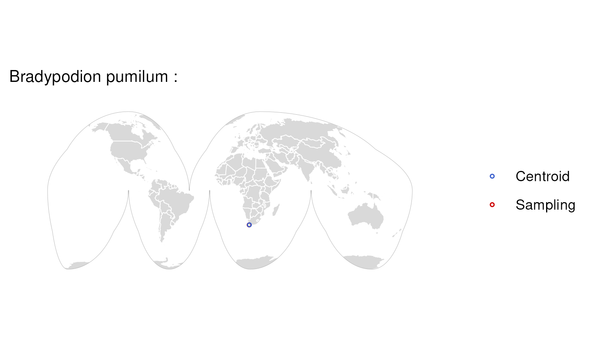

### Species: Branchiostoma lanceolatum

**Common Name:** European lancelet\
**Biosample:** SAMN38372375\
**Assembly Accession:** GCA_035083965.1\
**Taxon:** Invertebrates\
**Priority:** 6\
**Flags:** Missing Range;

**Map Notes:**\
**Comments:** NA

### Species: Branta canadensis

**Common Name:** Canada goose\
**Biosample:** SAMEA113398965\
**Assembly Accession:** GCA_965231335.1\
**Taxon:** Birds\
**Priority:** 6\
**Flags:**

**Map Notes:**\
**Comments:** The assembly bBraCan1.1 is based on 42x PacBio data and
Arima2 Hi-C data generated by the Darwin Tree of Life Project
(<https://www.darwintreeoflife.org/>). The assembly process included the
following sequence of steps: initial PacBio assembly generation with
Hifiasm, retained haplotig separation with purge_dups, and Hi-C based
scaffolding with YaHS. The mitochondrial genome was assembled using
MitoHiFi. Finally, the primary assembly was analysed and manually
improved using TreeVal. Chromosome-scale scaffolds confirmed by the Hi-C
data have been named in order of size. Z chromosome assigned based on
synteny to Anser anser (GCA_964211835.1).

### Species: Bucephala clangula

**Common Name:** common goldeneye\
**Biosample:** SAMEA112468123\
**Assembly Accession:** GCA_964059595.1\
**Taxon:** Birds\
**Priority:** 6\
**Flags:**

**Map Notes:**\
**Comments:** The assembly bBucCla1.1 is based on 45x PacBio data and
Arima2 Hi-C data generated by the Darwin Tree of Life Project
(<https://www.darwintreeoflife.org/>). The assembly process included the
following sequence of steps: initial PacBio assembly generation with
Hifiasm, retained haplotig separation with purge_dups, and Hi-C based
scaffolding with YaHS. The mitochondrial genome was assembled using
MitoHiFi. Finally, the primary assembly was analysed and manually
improved using TreeVal. Chromosome-scale scaffolds confirmed by the Hi-C
data have been named in order of size.

### Species: Bucorvus abyssinicus

**Common Name:** Abyssinian ground hornbill\
**Biosample:** SAMN12614799\
**Assembly Accession:** GCA_009769605.1\
**Taxon:** Birds\
**Priority:** 6\
**Flags:** Zoo Sample;

**Map Notes:**\
**Comments:** This assembly represents the principal haplotype of the
diploid genome Bucorvus abyssinicus and includes the chromosomes. The
alternate haplotype sequences are in WGS project WNMH00000000

### Species: Bufo bufo

**Common Name:** European toad\
**Biosample:** SAMEA7521636\
**Assembly Accession:** GCA_905171765.1\
**Taxon:** Amphibians\
**Priority:** 6\
**Flags:**

**Map Notes:**\
**Comments:** The assembly aBufBuf1.1 is based on 64x PacBio data, 10X
Genomics Chromium data, BioNano data, and Arima Hi-C data generated by
the Darwin Tree of Life Project (<https://www.darwintreeoflife.org/>).
The assembly process included the following sequence of steps: initial
PacBio assembly generation with Falcon-unzip, retained haplotig
separation with purge_dups, 10X based scaffolding with scaff10x, BioNano
hybrid-scaffolding, Hi-C based scaffolding with 3D-DNA, Arrow polishing,
and two rounds of FreeBayes polishing. The mitochondrial assembly was
produced at The Rockefeller University using mitoVGP. Finally, the
assembly was analysed and manually improved using gEVAL.
Chromosome-scale scaffolds confirmed by the Hi-C data have been named in
order of size.

### Species: Buteo buteo

**Common Name:** common buzzard\
**Biosample:** SAMEA114594453\
**Assembly Accession:** GCA_964188355.1\
**Taxon:** Birds\
**Priority:** 6\
**Flags:**

**Map Notes:**\
**Comments:** The assembly bButBut1.hap1.1 is based on 56x PacBio data
and Arima2 Hi-C data generated by the Darwin Tree of Life Project
(<https://www.darwintreeoflife.org/>). The assembly process included the
following sequence of steps: initial PacBio assembly generation with
Hifiasm in Hi-C integrated assembly mode, and Hi-C based scaffolding
with YaHS. The mitochondrial genome was assembled using MitoHiFi.
Finally, each haplotype assembly was analysed and manually improved
using TreeVal. Chromosome-scale scaffolds confirmed by the Hi-C data
have been named in order of size. Homogametic sex, ZZ. Chromosome Z was
identified and assigned by synteny to GCA_028022735.1.

### Species: Callospermophilus lateralis

**Common Name:** golden-mantled ground squirrel\
**Biosample:** SAMN47326584\
**Assembly Accession:** GCA_048772815.1\
**Taxon:** Mammals\
**Priority:** 6\
**Flags:**

**Map Notes:**\
**Comments:** NA

### Species: Caloenas nicobarica

**Common Name:** Nicobar pigeon\
**Biosample:** SAMN39256628\
**Assembly Accession:** GCA_036013445.1\
**Taxon:** Birds\
**Priority:** 6\
**Flags:** Zoo Sample;

**Map Notes:**\
**Comments:** NA

### Species: Calonectris borealis

**Common Name:** Cory’s shearwater\
**Biosample:** SAMEA114294356\
**Assembly Accession:** GCA_964195595.2\
**Taxon:** Birds\
**Priority:** 6\
**Flags:**

**Map Notes:**\
**Comments:** The assembly bCalBor7.hap1.2 is based on 66x PacBio data
and Arima2 Hi-C data generated by the Darwin Tree of Life Project
(<https://www.darwintreeoflife.org/>). The assembly process included the
following sequence of steps: initial PacBio assembly generation with
Hifiasm in Hi-C integrated assembly mode, and Hi-C based scaffolding
with YaHS. The mitochondrial genome was assembled using MitoHiFi.
Finally, each haplotype assembly was analysed and manually improved
using TreeVal. Chromosome-scale scaffolds confirmed by the Hi-C data
have been named in order of size.

### Species: Caprimulgus europaeus

**Common Name:** Eurasian nightjar\
**Biosample:** SAMEA7524394\
**Assembly Accession:** GCA_907165065.1\
**Taxon:** Birds\
**Priority:** 6\
**Flags:**

**Map Notes:**\
**Comments:** The assembly bCapEur3.1 is based on 87x PacBio data, 10X
Genomics Chromium data, and Arima2 Hi-C data generated by the Darwin
Tree of Life Project (<https://www.darwintreeoflife.org/>). The assembly
process included the following sequence of steps: initial PacBio
assembly generation with Falcon-unzip, retained haplotig separation with
purge_dups, 10X based scaffolding with scaff10x, Arrow polishing
assisted by Merfin, short-read polishing using FreeBayes-called variants
from 10X Genomics Chromium reads aligned with LongRanger, and Hi-C based
scaffolding with SALSA2. Finally, the assembly was analysed and manually
improved using gEVAL. Chromosome-scale scaffolds confirmed by the Hi-C
data have been named in order of size.

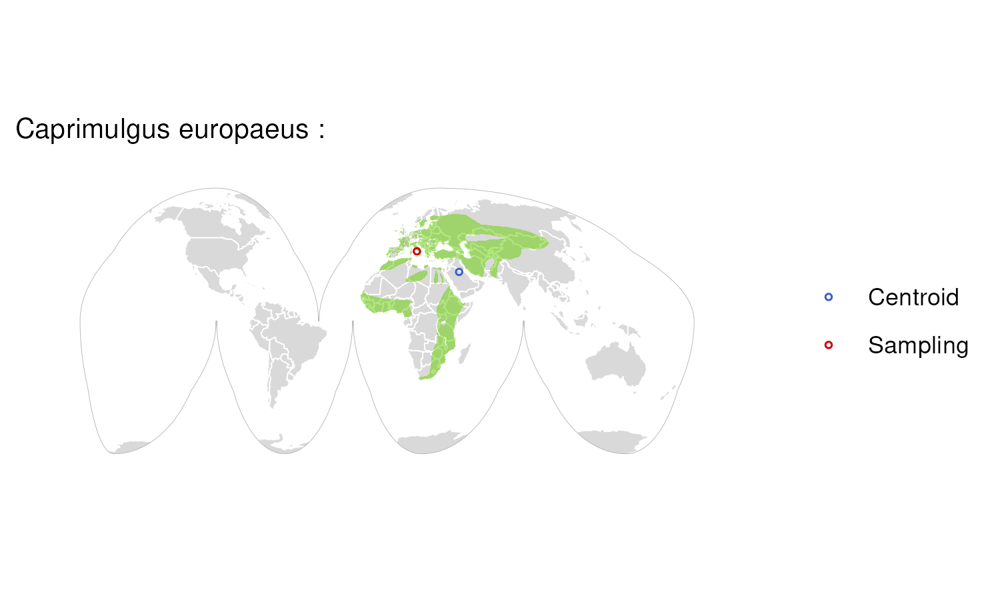

### Species: Carassius carassius

**Common Name:** common carp\
**Biosample:** SAMEA11296534\
**Assembly Accession:** GCA_963082965.1\
**Taxon:** Fishes\
**Priority:** 6\
**Flags:**

**Map Notes:**\
**Comments:** The assembly fCarCar2.1 is based on 43x PacBio data and
Arima2 Hi-C data generated by the Darwin Tree of Life Project
(<https://www.darwintreeoflife.org/>). The assembly process included the
following sequence of steps: initial PacBio assembly generation with
Hifiasm, retained haplotig separation with purge_dups, and Hi-C based
scaffolding with YaHS. The mitochondrial genome was assembled using
MitoHiFi. Finally, the primary assembly was analysed and manually
improved using rapid curation. Chromosome-scale scaffolds confirmed by
the Hi-C data have been named in order of size.

### Species: Carcharodon carcharias

**Common Name:** great white shark\
**Biosample:** SAMN12629504\
**Assembly Accession:** GCA_017639515.1\
**Taxon:** Fishes\
**Priority:** 6\
**Flags:**

**Map Notes:**\
**Comments:** NA

### Species: Caretta caretta

**Common Name:** loggerhead sea turtle\
**Biosample:** SAMN46282778\
**Assembly Accession:** GCA_965140235.1\
**Taxon:** Reptiles\
**Priority:** 6\
**Flags:**

**Map Notes:**\
**Comments:** NA

### Species: Cariama cristata

**Common Name:** red-legged seriema\
**Biosample:** SAMN12614807\
**Assembly Accession:** GCA_009819825.1\
**Taxon:** Birds\
**Priority:** 6\
**Flags:** Zoo Sample;

**Map Notes:**\
**Comments:** This assembly represents the principal haplotype of the
diploid genome Cariama cristata and includes the chromosomes. The
alternate haplotype sequences are in WGS project WNMP00000000

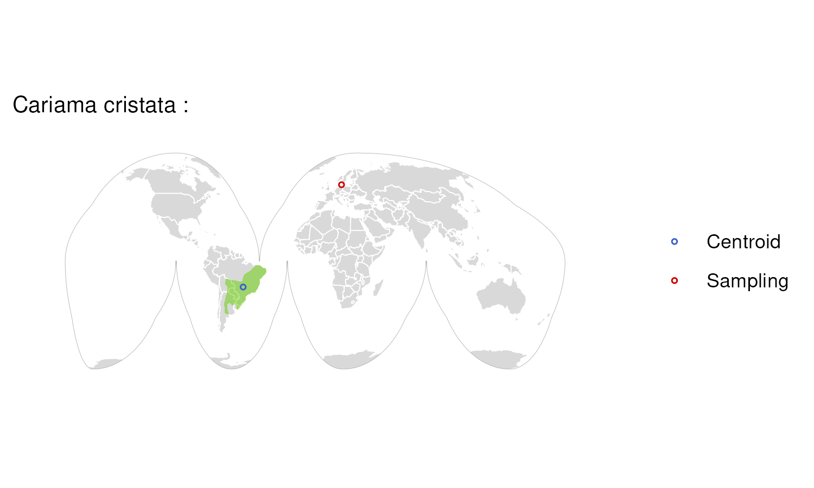

### Species: Castor canadensis

**Common Name:** North American beaver\
**Biosample:** SAMN45812786\
**Assembly Accession:** GCA_047511655.1\
**Taxon:** Mammals\
**Priority:** 6\
**Flags:**

**Map Notes:**\
**Comments:** In April 2025 320 sequences were suppressed because they
were found to be contaminants.

### Species: Catharus ustulatus

**Common Name:** Swainson’s thrush\
**Biosample:** SAMN12618602\
**Assembly Accession:** GCA_009819885.2\
**Taxon:** Birds\
**Priority:** 6\
**Flags:**

**Map Notes:**\
**Comments:** NA

### Species: Centroberyx gerrardi

**Common Name:** bight redfish\
**Biosample:** SAMN41769328\
**Assembly Accession:** GCA_048128805.1\
**Taxon:** Fishes\
**Priority:** 6\
**Flags:** Missing Range;

**Map Notes:**\
**Comments:** NA

### Species: Cervus elaphus

**Common Name:** red deer\
**Biosample:** SAMEA7523520\
**Assembly Accession:** GCA_910594005.1\
**Taxon:** Mammals\
**Priority:** 6\
**Flags:**

**Map Notes:**\
**Comments:** The assembly mCerEla1.1 is based on 30x PacBio data, 10X
Genomics Chromium data, and Arima2 Hi-C data generated by the Darwin
Tree of Life Project (<https://www.darwintreeoflife.org/>). The assembly
process included the following sequence of steps: initial PacBio
assembly generation with Hifiasm, retained haplotig separation with
purge_dups, short-read polishing using FreeBayes-called variants from
10X Genomics Chromium reads aligned with LongRanger, and Hi-C based
scaffolding with SALSA2. The mitochondrial genome was assembled using
MitoHifi. Finally, the assembly was analysed and manually improved using
gEVAL. Chromosome-scale scaffolds are named by synteny based on Cervus
elaphus (Red deer) GCA_002197005.1.

### Species: Cetorhinus maximus

**Common Name:** basking shark\
**Biosample:** SAMEA113902670\
**Assembly Accession:** GCA_964194155.1\
**Taxon:** Fishes\
**Priority:** 6\
**Flags:**

**Map Notes:**\
**Comments:** The assembly sCetMax3.hap1.1 is based on 34x PacBio data
and Arima2 Hi-C data generated by the Darwin Tree of Life Project
(<https://www.darwintreeoflife.org/>). The assembly process included the
following sequence of steps: initial PacBio assembly generation with
Hifiasm in Hi-C integrated assembly mode, and Hi-C based scaffolding
with YaHS. The mitochondrial genome was assembled using MitoHiFi.
Finally, each haplotype assembly was analysed and manually improved
using TreeVal. Chromosome-scale scaffolds confirmed by the Hi-C data
have been named in order of size. Chromosome X was assigned by synteny
to Carcharodon carcharias

### Species: Chaetodon trifascialis

**Common Name:** chevron butterflyfish\
**Biosample:** SAMN41253346\
**Assembly Accession:** GCA_039877785.1\
**Taxon:** Fishes\
**Priority:** 6\
**Flags:**

**Map Notes:**\
**Comments:** NA

### Species: Chelmon rostratus

**Common Name:** copperband butterflyfish\
**Biosample:** SAMN12623620\
**Assembly Accession:** GCA_017976325.1\
**Taxon:** Fishes\
**Priority:** 6\
**Flags:**

**Map Notes:**\
**Comments:** NA

### Species: Chelon labrosus

**Common Name:** thicklip grey mullet\
**Biosample:** SAMEA111562027\
**Assembly Accession:** GCA_963514085.1\
**Taxon:** Fishes\
**Priority:** 6\
**Flags:**

**Map Notes:**\
**Comments:** The assembly fCheLab1.1 is based on 27x PacBio data and
Arima2 Hi-C data generated by the Darwin Tree of Life Project
(<https://www.darwintreeoflife.org/>). The assembly process included the
following sequence of steps: initial PacBio assembly generation with
Hifiasm, retained haplotig separation with purge_dups, and Hi-C based
scaffolding with YaHS. The mitochondrial genome was assembled using
MitoHiFi. Finally, the primary assembly was analysed and manually
improved using rapid curation. Chromosome-scale scaffolds confirmed by
the Hi-C data have been named in order of size.

### Species: Chelonia mydas

**Common Name:** green sea turtle\
**Biosample:** SAMN12612360\
**Assembly Accession:** GCA_015237465.2\
**Taxon:** Reptiles\
**Priority:** 6\
**Flags:**

**Map Notes:**\
**Comments:** NA

### Species: Chionomys nivalis

**Common Name:** European snow vole\
**Biosample:** SAMEA13217622\
**Assembly Accession:** GCA_950005125.1\
**Taxon:** Mammals\
**Priority:** 6\
**Flags:**

**Map Notes:**\
**Comments:** The assembly mChiNiv1.1 is based on 26x PacBio data and
Arima2 Hi-C data generated by the Wellcome Sanger Institute Tree of Life
Programme (<https://www.sanger.ac.uk/programme/tree-of-life/>) as part
of the European Reference Genome Atlas pilot project
(<https://www.erga-biodiversity.eu/pilot-project>). The assembly process
included the following sequence of steps: initial PacBio assembly
generation with Hifiasm, retained haplotig separation with purge_dups,
and Hi-C based scaffolding with YaHS. The mitochondrial genome was
assembled using MitoHiFi. Finally, the primary assembly was analysed and
manually improved using rapid curation. This alternate haplotype
assembly combines the haplotigs separated by purge_dups with haplotigs
separated from the primary assembly during curation.

### Species: Chiroxiphia lanceolata

**Common Name:** lanced-tailed manakin\
**Biosample:** SAMN12620979\
**Assembly Accession:** GCA_009829145.1\
**Taxon:** Birds\
**Priority:** 6\
**Flags:**

**Map Notes:**\
**Comments:** This assembly represents the principal haplotype of the
diploid genome Chiroxiphia lanceolata and includes the chromosomes. The
alternate haplotype sequences are in WGS project WNMD00000000

### Species: Chlamydotis macqueenii

**Common Name:** MacQueen’s bustard\
**Biosample:** SAMN39296383\
**Assembly Accession:** GCA_036417535.1\
**Taxon:** Birds\
**Priority:** 6\
**Flags:**

**Map Notes:**\
**Comments:** NA

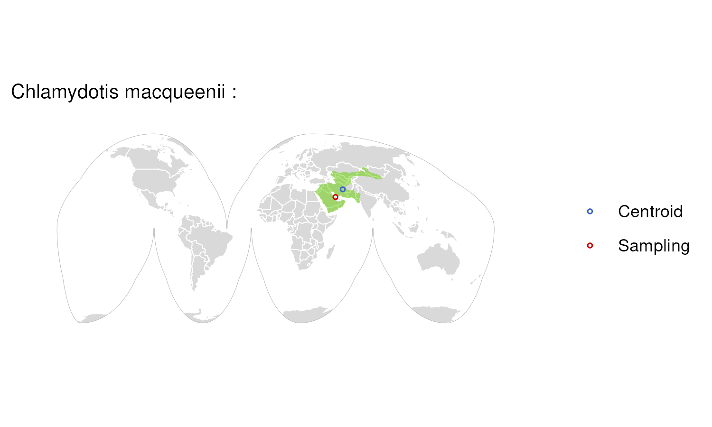

### Species: Choerodon schoenleinii

**Common Name:** blackspot tuskfish\
**Biosample:** SAMN46014618\
**Assembly Accession:** GCA_047301625.1\
**Taxon:** Fishes\
**Priority:** 6\
**Flags:** Missing Range;

**Map Notes:**\
**Comments:** NA

### Species: Chroicocephalus ridibundus

**Common Name:** black-headed gull\
**Biosample:** SAMEA112468038\
**Assembly Accession:** GCA_963924245.1\
**Taxon:** Birds\
**Priority:** 6\
**Flags:**

**Map Notes:**\
**Comments:** The assembly bChrRid1.1 is based on 37x PacBio data and
Arima2 Hi-C data generated by the Darwin Tree of Life Project
(<https://www.darwintreeoflife.org/>). The assembly process included the
following sequence of steps: initial PacBio assembly generation with
Hifiasm, retained haplotig separation with purge_dups, and Hi-C based
scaffolding with YaHS. The mitochondrial genome was assembled using
MitoHiFi. Finally, the primary assembly was analysed and manually
improved using TreeVal. Chromosome-scale scaffolds confirmed by the Hi-C
data have been named in order of size. Z chromosome identified based on
alignment with chicken (GCF_016699485.2).

### Species: Ciconia maguari

**Common Name:** Maguari stork\
**Biosample:** SAMN18353822\
**Assembly Accession:** GCA_017639555.1\
**Taxon:** Birds\
**Priority:** 6\
**Flags:**

**Map Notes:**\
**Comments:** NA

### Species: Cinclus cinclus

**Common Name:** white-throated dipper\
**Biosample:** SAMEA9679959\
**Assembly Accession:** GCA_963662255.1\
**Taxon:** Birds\
**Priority:** 6\
**Flags:**

**Map Notes:**\
**Comments:** The assembly bCinCin1.1 is based on 41x PacBio data and
Arima2 Hi-C data generated by the Darwin Tree of Life Project
(<https://www.darwintreeoflife.org/>). The assembly process included the
following sequence of steps: initial PacBio assembly generation with
Hifiasm, retained haplotig separation with purge_dups, and Hi-C based
scaffolding with YaHS. The mitochondrial genome was assembled using
MitoHiFi. Finally, the primary assembly was analysed and manually
improved using gEVAL. Chromosome-scale scaffolds confirmed by the Hi-C
data have been named in order of size. Z chromosome identifed based on
synteny with Taeniopygia guttata (GCA_003957565.4).

### Species: Clangula hyemalis

**Common Name:** long-tailed duck\
**Biosample:** SAMEA112468035\
**Assembly Accession:** GCA_963989345.1\
**Taxon:** Birds\
**Priority:** 6\
**Flags:**

**Map Notes:**\
**Comments:** The assembly bClaHye2.1 is based on 43x PacBio data and
Arima2 Hi-C data generated by the Darwin Tree of Life Project
(<https://www.darwintreeoflife.org/>). The assembly process included the
following sequence of steps: initial PacBio assembly generation with
Hifiasm, retained haplotig separation with purge_dups, and Hi-C based
scaffolding with YaHS. The mitochondrial genome was assembled using
MitoHiFi. Finally, the primary assembly was analysed and manually
improved using TreeVal. Chromosome-scale scaffolds confirmed by the Hi-C
data have been named in order of size.

### Species: Clavelina lepadiformis

**Common Name:** light-bulb sea squirt\
**Biosample:** SAMEA7536527\
**Assembly Accession:** GCA_947623445.1\
**Taxon:** Invertebrates\
**Priority:** 6\
**Flags:** Missing Range;

**Map Notes:**\
**Comments:** The assembly kaClaLepa1.1 is based on 117x PacBio data,
10X Genomics Chromium data, and Arima2 Hi-C data generated by the Darwin
Tree of Life Project (<https://www.darwintreeoflife.org/>). The assembly
process included the following sequence of steps: initial PacBio
assembly generation with Hifiasm, retained haplotig separation with
purge_dups, and Hi-C based scaffolding with YaHS. The mitochondrial
genome was assembled using MitoHiFi. Finally, the primary assembly was
analysed and manually improved using gEVAL. Chromosome-scale scaffolds
confirmed by the Hi-C data have been named in order of size. Karyotype
info used from
<https://www.tandfonline.com/doi/abs/10.1080/00087114.1971.10796413>.

### Species: Coilia mystus

**Common Name:** Osbeck’s grenadier anchovy\
**Biosample:** SAMN46980313\
**Assembly Accession:** GCA_048544225.1\
**Taxon:** Fishes\
**Priority:** 6\
**Flags:**

**Map Notes:**\
**Comments:** NA

### Species: Colius striatus

**Common Name:** speckled mousebird\
**Biosample:** SAMN33339572\
**Assembly Accession:** GCA_028858725.2\
**Taxon:** Birds\
**Priority:** 6\
**Flags:** Zoo Sample;

**Map Notes:**\
**Comments:** Some microchromosomes remain fragmented and unidentified
due to high repeat content

### Species: Coloeus monedula

**Common Name:** Western jackdaw\
**Biosample:** SAMEA115433023\
**Assembly Accession:** GCA_965178545.1\
**Taxon:** Birds\
**Priority:** 6\
**Flags:**

**Map Notes:**\
**Comments:** The assembly bColMon1.hap1.1 is based on 77x PacBio data
and Arima2 Hi-C data generated by the Darwin Tree of Life Project
(<https://www.darwintreeoflife.org/>). The assembly process included the
following sequence of steps: initial PacBio assembly generation with
Hifiasm in Hi-C integrated assembly mode, and Hi-C based scaffolding
with YaHS. The mitochondrial genome was assembled using MitoHiFi.
Finally, each haplotype assembly was analysed and manually improved
using TreeVal. Chromosome-scale scaffolds confirmed by the Hi-C data
have been named in order of size. The exact order and orientation of the
contigs on chromosome 1 (55.5 - 59 Mbp), chromosome 8 (12 - 14 Mbp) are
unknown. The microchromosomes were identified through second-shot
curation of scaffolds smaller than 20 Mbp, combined with homology-based
identification using known microchromosome genes via MicroFinder.
Chromosomes Z and W were identified by copy number in the diploid
assembly. A large number of centromeric repeats is in the unlocalised
sequences.

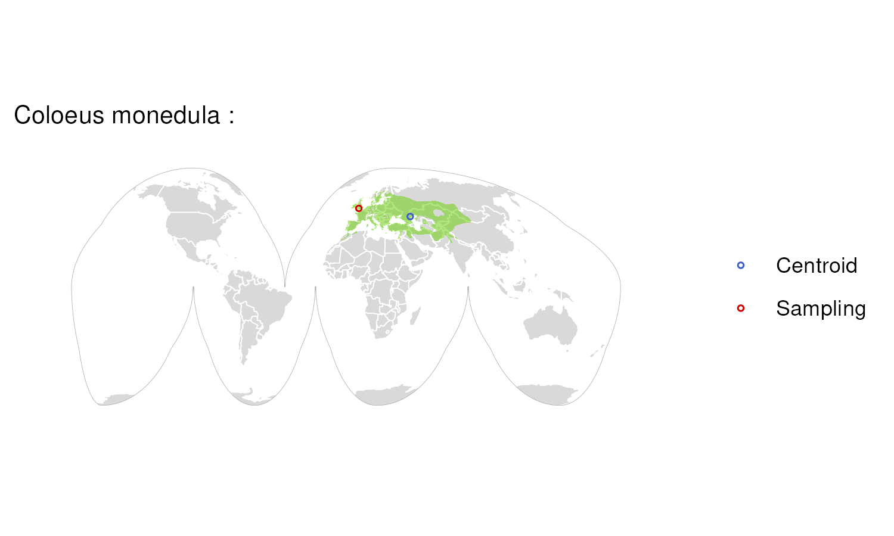

### Species: Conger conger

**Common Name:** European conger\
**Biosample:** SAMEA12219431\
**Assembly Accession:** GCA_963514075.1\
**Taxon:** Fishes\
**Priority:** 6\
**Flags:**

**Map Notes:**\
**Comments:** The assembly fConCon1.1 is based on 36x PacBio data and
Arima2 Hi-C data generated by the Darwin Tree of Life Project
(<https://www.darwintreeoflife.org/>). The assembly process included the
following sequence of steps: initial PacBio assembly generation with
Hifiasm, retained haplotig separation with purge_dups, and Hi-C based
scaffolding with YaHS. The mitochondrial genome was assembled using
MitoHiFi. Finally, the primary assembly was analysed and manually
improved using rapid curation. Chromosome-scale scaffolds confirmed by
the Hi-C data have been named in order of size.

### Species: Corella eumyota

**Common Name:** Orange-tipped sea squirt\
**Biosample:** SAMEA7536466\
**Assembly Accession:** GCA_963082875.1\
**Taxon:** Invertebrates\
**Priority:** 6\
**Flags:** Missing Range;

**Map Notes:**\
**Comments:** The assembly kaCorEumy4.1 is based on 156x PacBio data and
Arima2 Hi-C data generated by the Darwin Tree of Life Project
(<https://www.darwintreeoflife.org/>). The assembly process included the
following sequence of steps: initial PacBio assembly generation with
Hifiasm, retained haplotig separation with purge_dups, and Hi-C based
scaffolding with YaHS. The mitochondrial genome was assembled using
MitoHiFi. Finally, the primary assembly was analysed and manually
improved using TreeVal. Chromosome-scale scaffolds confirmed by the Hi-C
data have been named in order of size. The order and orientation of
contigs along SUPER_3 is uncertain between 10 Mb and 16.5 Mb.

### Species: Corvus moneduloides

**Common Name:** New Caledonian crow\
**Biosample:** SAMN12368441\
**Assembly Accession:** GCA_009650955.1\
**Taxon:** Birds\
**Priority:** 6\
**Flags:**

**Map Notes:**\
**Comments:** The bCorMon1 primary assembly is based on the VGP 1.6
individual pipeline. Primary haplotype: Initial PacBio contig assembly
with Falcon-unzip, Arrow polishing, retained haplotig identification
with Purge Haplotigs, Arrow polishing and gap filling, and two rounds of
FreeBayes polishing with Illumina short reads. Finally, the assembly was
curated and chromosomes annotated using gEVAL #This assembly represents
the principal haplotype of the diploid genome orvus moneduloides and
includes the chromosomes. The alternate haplotype sequences are in WGS
project WHPP00000000

### Species: Corynorhinus townsendii

**Common Name:** Townsend’s big-eared bat\
**Biosample:** SAMN31536067\
**Assembly Accession:** GCA_026230055.1\
**Taxon:** Mammals\
**Priority:** 6\
**Flags:**

**Map Notes:**\
**Comments:** NA

### Species: Cristiceps australis

**Common Name:** crested weedfish\
**Biosample:** SAMN40589650\
**Assembly Accession:** GCA_049082185.1\
**Taxon:** Fishes\
**Priority:** 6\
**Flags:**

**Map Notes:**\
**Comments:** NA

### Species: Ctenodactylus gundi

**Common Name:** common gundi\
**Biosample:** SAMN47326412\
**Assembly Accession:** GCA_048771875.1\
**Taxon:** Mammals\
**Priority:** 6\
**Flags:**

**Map Notes:**\
**Comments:** NA

### Species: Cuculus canorus

**Common Name:** common cuckoo\
**Biosample:** SAMN12629508\
**Assembly Accession:** GCA_017976375.1\
**Taxon:** Birds\
**Priority:** 6\
**Flags:**

**Map Notes:**\
**Comments:** NA

### Species: Cyanocitta cristata

**Common Name:** blue jay\
**Biosample:** SAMN44574712\
**Assembly Accession:** GCA_046129655.1\
**Taxon:** Birds\
**Priority:** 6\
**Flags:**

**Map Notes:**\
**Comments:** NA

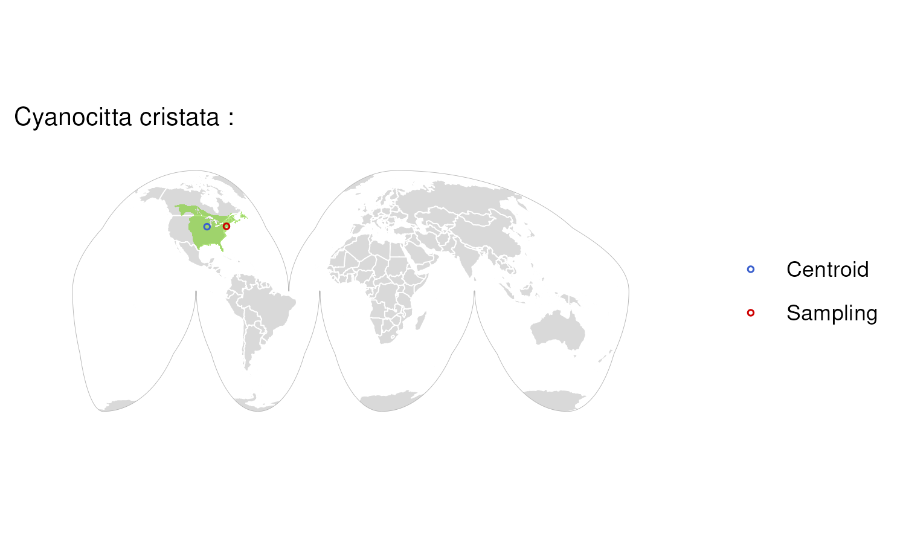

### Species: Cyclopterus lumpus

**Common Name:** lumpfish\
**Biosample:** SAMN12629502\
**Assembly Accession:** GCA_009769545.1\
**Taxon:** Fishes\
**Priority:** 6\
**Flags:** Missing Range;

**Map Notes:**\
**Comments:** This assembly represents the principal haplotype of the
diploid genome Cyclopterus lumpus and includes the chromosomes. The
alternate haplotype sequences are in WGS project WNND00000000

### Species: Cyclura pinguis

**Common Name:** stout iguana\
**Biosample:** SAMN35151422\
**Assembly Accession:** GCA_030412105.1\
**Taxon:** Reptiles\
**Priority:** 6\
**Flags:** Zoo Sample;

**Map Notes:**\
**Comments:** NA

### Species: Cygnus columbianus

**Common Name:** tundra swan\
**Biosample:** SAMEA112468031\
**Assembly Accession:** GCA_965151615.1\
**Taxon:** Birds\
**Priority:** 6\
**Flags:**

**Map Notes:**\
**Comments:** The assembly bCygCol1.1 is based on 52x PacBio data and
Arima2 Hi-C data generated by the Darwin Tree of Life Project
(<https://www.darwintreeoflife.org/>). The assembly process included the
following sequence of steps: initial PacBio assembly generation with
Hifiasm, and Hi-C based scaffolding with YaHS. The mitochondrial genome
was assembled using MitoHiFi. A manually phased assembly (based on HiC
signal) was generated from a jointly curated primary and alt assembly.
Finally, the primary assembly was analysed and manually improved using
TreeVal. Chromosome-scale scaffolds confirmed by the Hi-C data have been
named in order of size.

### Species: Cygnus olor

**Common Name:** mute swan\
**Biosample:** SAMN12621369\
**Assembly Accession:** GCA_009769625.2\
**Taxon:** Birds\
**Priority:** 6\
**Flags:**

**Map Notes:**\
**Comments:** NA

### Species: Cynocephalus volans

**Common Name:** Philippine flying lemur\
**Biosample:** SAMN32206947\
**Assembly Accession:** GCA_027409185.1\
**Taxon:** Mammals\
**Priority:** 6\
**Flags:**

**Map Notes:**\
**Comments:** NA

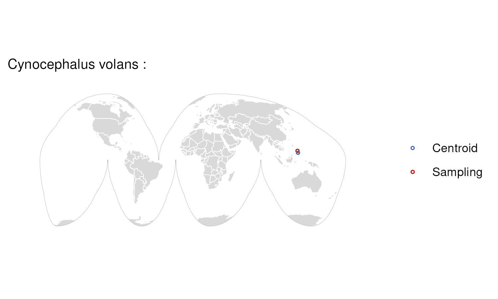

### Species: Cyprinella venusta

**Common Name:** blacktail shiner\
**Biosample:** SAMN40647018\
**Assembly Accession:** GCA_038024135.1\
**Taxon:** Fishes\
**Priority:** 6\
**Flags:**

**Map Notes:**\
**Comments:** NA

### Species: Danio rerio

**Common Name:** zebrafish\
**Biosample:** SAMEA14088276\
**Assembly Accession:** GCA_944039275.1\
**Taxon:** Fishes\
**Priority:** 6\
**Flags:** Missing Range;

**Map Notes:**\
**Comments:** The assembly fDanRer4.1 is based on 31x PacBio data and
10X Genomics Chromium data generated by the Wellcome Sanger Institute
Tree of Life Programme
(<https://www.sanger.ac.uk/science/programmes/tree-of-life>). The
assembly process included the following sequence of steps: initial
PacBio assembly generation with Hifiasm, retained haplotig separation
with purge_dups, short-read polishing using FreeBayes-called variants
from 10X Genomics Chromium reads aligned with LongRanger, and Hi-C based
scaffolding with SALSA2. The mitochondrial genome was assembled using
MitoHiFi. Finally, the primary assembly was analysed and manually
improved using rapid curation. Chromosome-scale scaffolds are named by
synteny based on Danio rerio (zebrafish) GCA_020184715.1. Uncertain
order and orientation of scaffolds in repetitive regions on chromosome 4
38.2-55.2, chromosome 8 36.6-40.0mb.

### Species: Dasypus novemcinctus

**Common Name:** nine-banded armadillo\
**Biosample:** SAMN32738980\
**Assembly Accession:** GCA_030445035.2\
**Taxon:** Mammals\
**Priority:** 6\
**Flags:**

**Map Notes:**\
**Comments:** NA

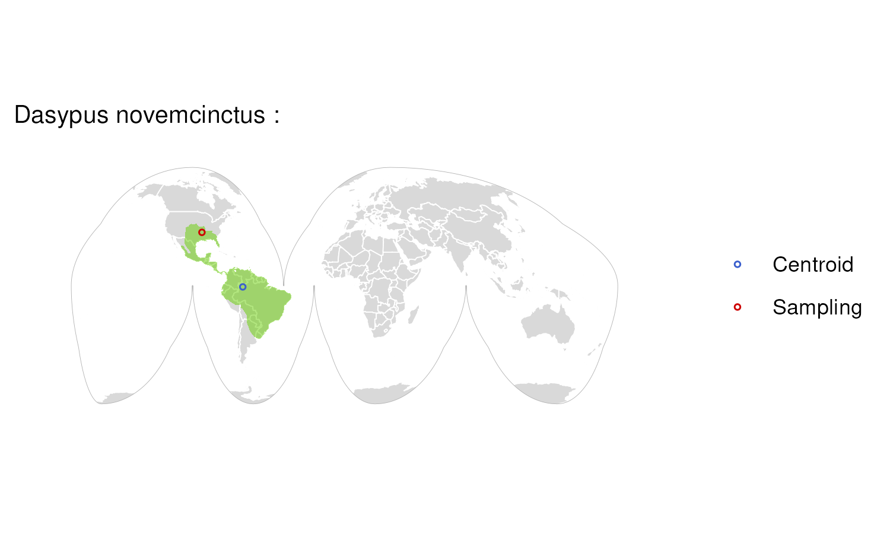

### Species: Delphinus delphis

**Common Name:** saddleback dolphin\
**Biosample:** SAMEA111380534\
**Assembly Accession:** GCA_949987515.2\
**Taxon:** Mammals\
**Priority:** 6\
**Flags:**

**Map Notes:**\
**Comments:** The assembly mDelDel1.2 is based on 29x PacBio data and
Arima2 Hi-C data generated by the Darwin Tree of Life Project
(<https://www.darwintreeoflife.org/>). The assembly process included the
following sequence of steps: initial PacBio assembly generation with
Hifiasm, retained haplotig separation with purge_dups, and Hi-C based
scaffolding with YaHS. The mitochondrial genome was assembled using
MitoHiFi. Finally, the primary assembly was analysed and manually
improved using TreeVal. Chromosome-scale scaffolds confirmed by the Hi-C
data have been named in order of size.

### Species: Dermochelys coriacea

**Common Name:** leatherback sea turtle\
**Biosample:** SAMN12629498\
**Assembly Accession:** GCA_009764565.4\
**Taxon:** Reptiles\
**Priority:** 6\
**Flags:**

**Map Notes:**\
**Comments:** NA

### Species: Desmodus rotundus

**Common Name:** common vampire bat\
**Biosample:** SAMN24116476\
**Assembly Accession:** GCA_022682495.2\
**Taxon:** Mammals\
**Priority:** 6\
**Flags:**

**Map Notes:**\
**Comments:** NA

### Species: Diretmus argenteus

**Common Name:** silver spinyfin\
**Biosample:** SAMN47248252\
**Assembly Accession:** GCA_048569125.1\
**Taxon:** Fishes\
**Priority:** 6\
**Flags:**

**Map Notes:**\
**Comments:** NA

### Species: Discoglossus pictus

**Common Name:** painted frog\
**Biosample:** SAMN32227109\
**Assembly Accession:** GCA_027410445.1\
**Taxon:** Amphibians\
**Priority:** 6\
**Flags:**

**Map Notes:**\
**Comments:** NA

### Species: Dixiphia pipra

**Common Name:** white-crowned manakin\
**Biosample:** SAMN32739894\
**Assembly Accession:** GCA_036250125.1\
**Taxon:** Birds\
**Priority:** 6\
**Flags:**

**Map Notes:**\
**Comments:** NA

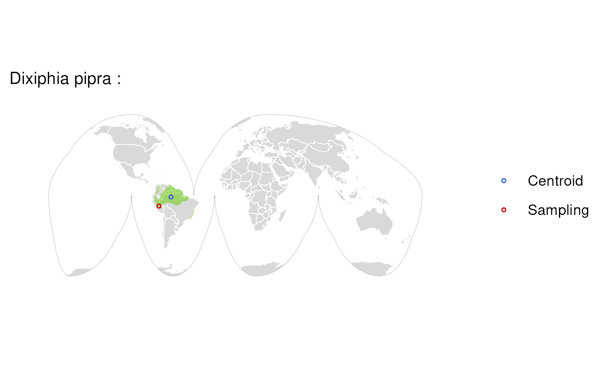

### Species: Doryrhina cyclops

**Common Name:** Cyclops roundleaf bat\
**Biosample:** SAMN33372470\
**Assembly Accession:** GCA_043880285.1\
**Taxon:** Mammals\
**Priority:** 6\
**Flags:**

**Map Notes:**\
**Comments:** NA

### Species: Dromaius novaehollandiae

**Common Name:** emu\
**Biosample:** SAMN39262816\
**Assembly Accession:** GCA_036370855.1\
**Taxon:** Birds\
**Priority:** 6\
**Flags:** Zoo Sample;

**Map Notes:**\
**Comments:** NA

### Species: Dromiciops gliroides

**Common Name:** monito del montes\
**Biosample:** SAMN18857598\
**Assembly Accession:** GCA_019393635.1\
**Taxon:** Mammals\
**Priority:** 6\
**Flags:**

**Map Notes:**\
**Comments:** NA

### Species: Dryobates pubescens

**Common Name:** downy woodpecker\
**Biosample:** SAMN12629497\
**Assembly Accession:** GCA_014839835.1\
**Taxon:** Birds\
**Priority:** 6\
**Flags:**

**Map Notes:**\
**Comments:** This assembly represents the principal haplotype of the
diploid genome Picoides pubescens and includes the chromosomes. The
alternate haplotype sequences are in WGS project JACNMW000000000

### Species: Dugong dugon

**Common Name:** dugong\
**Biosample:** SAMN33212336\
**Assembly Accession:** GCA_030035585.1\
**Taxon:** Mammals\
**Priority:** 6\
**Flags:**

**Map Notes:**\
**Comments:** NA

### Species: Echiichthys vipera

**Common Name:** lesser weever\
**Biosample:** SAMEA112765695\
**Assembly Accession:** GCA_963691815.1\
**Taxon:** Fishes\
**Priority:** 6\
**Flags:** Missing Range;

**Map Notes:**\
**Comments:** The assembly fEchVip8.1 is based on 34x PacBio data and
Arima2 Hi-C data generated by the Darwin Tree of Life Project
(<https://www.darwintreeoflife.org/>). The assembly process included the
following sequence of steps: initial PacBio assembly generation with
Hifiasm, retained haplotig separation with purge_dups, and Hi-C based
scaffolding with YaHS. The mitochondrial genome was assembled using
MitoHiFi. Finally, the primary assembly was analysed and manually
improved using rapid curation. Chromosome-scale scaffolds confirmed by
the Hi-C data have been named in order of size. Two half coverage
putative sex chromosomes chromosomes were observed and provisionally
named X and Y. However, the sample used for genome assembly was of
unknown sex and so the sex determination system could be ZW instead of
XY. A literature search did not recover information on the sex
determination system for this species. It should also be noted that a
previous cytological study (<https://doi.org/10.1159/000076302>) did not
identify heteromorphic sex chromosomes in this species.

### Species: Electrona antarctica

**Common Name:** Antarctic lanternfish\
**Biosample:** SAMEA8748807\
**Assembly Accession:** GCA_951216825.1\
**Taxon:** Fishes\
**Priority:** 6\
**Flags:**

**Map Notes:**\
**Comments:** The assembly fEleAnt2.1 is based on 43x PacBio data and
Arima2 Hi-C data generated by the Darwin Tree of Life Project
(<https://www.darwintreeoflife.org/>). The assembly process included the
following sequence of steps: initial PacBio assembly generation with
Hifiasm, retained haplotig separation with purge_dups, and Hi-C based
scaffolding with YaHS. The mitochondrial genome was assembled using
MitoHiFi. Finally, the primary assembly was analysed and manually
improved using rapid curation. Chromosome-scale scaffolds confirmed by
the Hi-C data have been named in order of size.

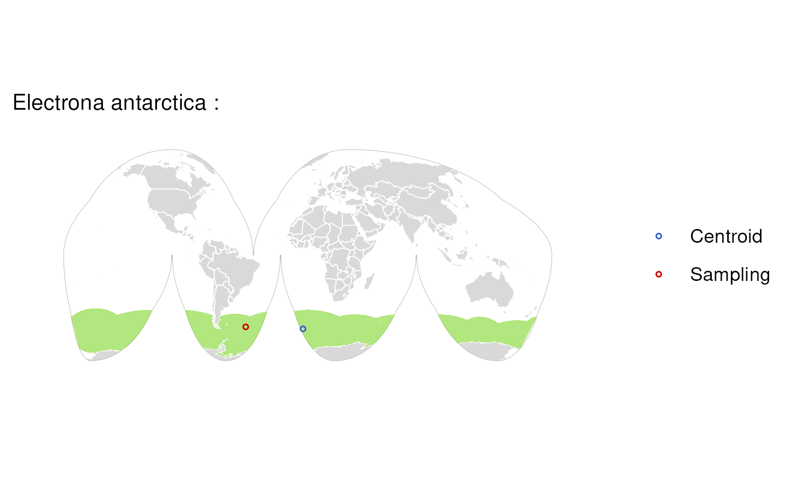

### Species: Elephas maximus indicus

**Common Name:** Asian elephant\
**Biosample:** SAMN29174328\
**Assembly Accession:** GCA_024166365.1\
**Taxon:** Mammals\
**Priority:** 6\
**Flags:** Zoo Sample;

**Map Notes:**\
**Comments:** NA

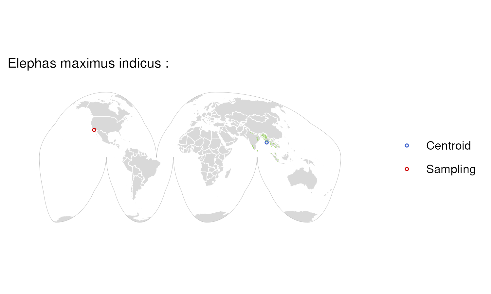

### Species: Eleutherodactylus coqui

**Common Name:** coqui\
**Biosample:** SAMN39150572\
**Assembly Accession:** GCA_035609145.1\
**Taxon:** Amphibians\
**Priority:** 6\
**Flags:**

**Map Notes:**\
**Comments:** NA

### Species: Elgaria multicarinata webbii

**Common Name:** Southern alligator lizard\
**Biosample:** SAMN25872353\
**Assembly Accession:** GCA_023053635.2\
**Taxon:** Reptiles\
**Priority:** 6\
**Flags:**

**Map Notes:**\
**Comments:** NA

### Species: Emys orbicularis

**Common Name:** European pond turtle\
**Biosample:** SAMN31805221\
**Assembly Accession:** GCA_028017835.1\
**Taxon:** Reptiles\
**Priority:** 6\
**Flags:** Missing Range;

**Map Notes:**\
**Comments:** NA

### Species: Enoplosus armatus

**Common Name:** old wife\
**Biosample:** SAMN40589647\
**Assembly Accession:** GCA_043641665.1\
**Taxon:** Fishes\
**Priority:** 6\
**Flags:**

**Map Notes:**\
**Comments:** NA

### Species: Epinephelus rankini

**Common Name:** rankin cod\
**Biosample:** SAMN41769322\
**Assembly Accession:** GCA_048129235.1\
**Taxon:** Fishes\
**Priority:** 6\
**Flags:**

**Map Notes:**\
**Comments:** NA

### Species: Eptesicus nilssonii

**Common Name:** northern bat\
**Biosample:** SAMEA14098186\
**Assembly Accession:** GCA_951640355.1\
**Taxon:** Mammals\
**Priority:** 6\
**Flags:**

**Map Notes:**\
**Comments:** The assembly mEptNil1.1 is based on 33x PacBio data and
Arima2 Hi-C data generated by the Darwin Tree of Life Project
(<https://www.darwintreeoflife.org/>). The assembly process included the
following sequence of steps: initial PacBio assembly generation with
Hifiasm, retained haplotig separation with purge_dups, and Hi-C based
scaffolding with YaHS. The mitochondrial genome was assembled using
MitoHiFi. Finally, the primary assembly was analysed and manually
improved using rapid curation. Chromosome-scale scaffolds confirmed by
the Hi-C data have been named in order of size.

### Species: Erethizon dorsatum

**Common Name:** North American porcupine\
**Biosample:** SAMN32359106\
**Assembly Accession:** GCA_028451465.1\
**Taxon:** Mammals\
**Priority:** 6\
**Flags:**

**Map Notes:**\
**Comments:** In some mammalian (e.g. human and pale spear-nosed bat)
the mEreDor Y chromosome of this assembly aligns to the Y chromosome,
whereas in other species (e.g. ring-tailed lemur, grey squirrel) this
region aligns to the X chromosome. As coverage of the X chromosome is
haploid for this individual, we conclude that this sequence represents
the Y chromosome in mEreDor

### Species: Eretmochelys imbricata

**Common Name:** Hawksbill sea turtle\
**Biosample:** SAMN46283036\
**Assembly Accession:** GCA_965152235.1\
**Taxon:** Reptiles\
**Priority:** 6\
**Flags:**

**Map Notes:**\
**Comments:** NA

### Species: Erinaceus europaeus

**Common Name:** European hedgehog\
**Biosample:** SAMEA13207416\
**Assembly Accession:** GCA_950295315.1\
**Taxon:** Mammals\
**Priority:** 6\
**Flags:**

**Map Notes:**\
**Comments:** The assembly mEriEur2.1 is based on 31x PacBio data and
Arima2 Hi-C data generated by the Darwin Tree of Life Project
(<https://www.darwintreeoflife.org/>). The assembly process included the
following sequence of steps: initial PacBio assembly generation with
Hifiasm, retained haplotig separation with purge_dups, and Hi-C based
scaffolding with YaHS. The mitochondrial genome was assembled using
MitoHiFi. Finally, the primary assembly was analysed and manually
improved using TreeVal. Chromosome-scale scaffolds confirmed by the Hi-C
data have been named in order of size. X chromosome identified based on
alignment with Iberian mole (GCA_014898055.3;
<https://www.science.org/doi/10.1126/science.aaz2582>) and reduced HiC
background signal (HiC from male sample, PacBio used for de novo
assembly from female sample). The order and orientation of the contigs
in the following regions are uncertain: SUPER_2, 164.5 Mb to 176.5 Mb;
SUPER_9, 67.5 Mb to 72.5 Mb; SUPER_15, 88.5 Mb to 93.5 Mb; SUPER_17, 42
Mb to 53.5 Mb.

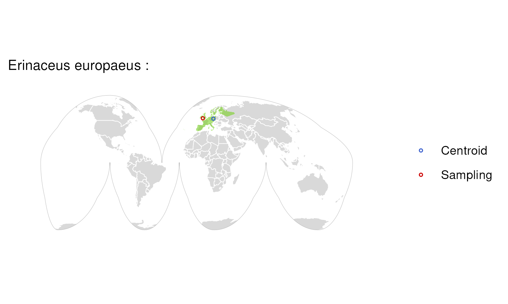

### Species: Erythrolamprus reginae

**Common Name:** royal ground snake\
**Biosample:** SAMN32631248\
**Assembly Accession:** GCA_031021105.1\
**Taxon:** Reptiles\
**Priority:** 6\
**Flags:**

**Map Notes:**\
**Comments:** GenomeScope analyses indicates this individual is a
triploid (model fits p=3); smudgeplot results in a proposed triploid,
with a strong AAB signal. The Hifiasm + Hi-C process resulted in hap1
and hap2+3 assemblies, with hap2+3 having two copies of the genome based
on QC metrics, while hap1 having one un-duplicated copy of the genome.
This is supported by largely unduplicated BUSCO results, a largely 1
copy kmer-cn spectrum, and the length of the assembly being near to the
expected genome size based on the triploid genomescope model. The hap1
assembly was scaffolded with Hi-C data using YAHS, and is what we are
submitting for annotation. The hap2+3 assembly was purged with
purge_dups, resulting in a purged hap2 only assembly and a remaining
hap3 assembly, but were difficult to scaffold. Thus, hap2 and hap3
assembled are submitted as contigs only

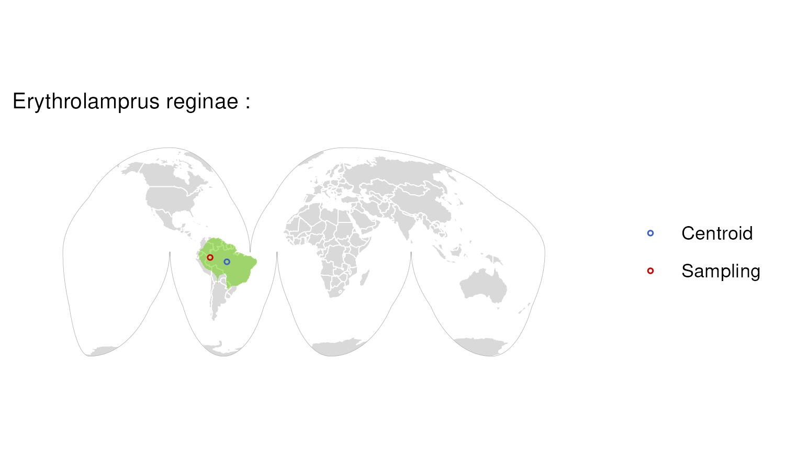

### Species: Eschrichtius robustus

**Common Name:** gray whale\
**Biosample:** SAMN32629250\
**Assembly Accession:** GCA_028021215.1\
**Taxon:** Mammals\
**Priority:** 6\
**Flags:**

**Map Notes:**\
**Comments:** Hi-C data is from a different individual than that used to
generate the Pacbio HiFi contigs. The following regions of the assembly
are of undetermined order and orientation: Chromosome 1 region 77-81 Mb
and 98-112.6 Mb: Chromosome 4 region 19.5-28.4 Mb; Chromosome 5 region
93-123 Mb; Chromosome 7 region 16.6-70 Mb; Chromosome 8 region 26.5-48
Mb; Chromosome 9 region 72.5-108 Mb; Chromosome 14 region 49.5-70 Mb;
Chromosome 17 34-40 Mb

### Species: Esox lucius

**Common Name:** Northern pike\
**Biosample:** SAMN12623624\
**Assembly Accession:** GCA_011004845.1\
**Taxon:** Fishes\
**Priority:** 6\
**Flags:**

**Map Notes:**\
**Comments:** This assembly represents the principal haplotype of the
diploid genome Esox lucius and includes the chromosomes. The alternate
haplotype sequences are in WGS project JAAIYS000000000

### Species: Eubalaena glacialis

**Common Name:** North Atlantic right whale\
**Biosample:** SAMN32746534\
**Assembly Accession:** GCA_028564815.2\
**Taxon:** Mammals\
**Priority:** 6\
**Flags:**

**Map Notes:**\
**Comments:** The following regions of this assembly are of undetermined
order and orientation: Chromosome 1 - 70-75.4 Mb, 91.6-109 Mb and
128-146.5 Mb; Chromosome 2 - 84-99 Mb; Chromosome 3 - 36-38.5 Mb and
67.5-72 Mb; Chromosome 4 - 135.5-141 Mb and 159-167 Mb; Chromosome 5 -
96.4-100 Mb; Chromosome 7 - 113 Mb to end; Chromosome 8 - 26.7-46 Mb;
Chromosome 9 - 90.7-97 Mb; Chromosome 10 - 26-36 Mb; Chromosome 11 -
76.5-88 Mb; Chromosome 12 - 73-87 Mb; Chromosome 13 - 32-38 Mb;
Chromosome 16 - 43.5-54 Mb; Chromosome 17 - 35-42 Mb; Chromosome 18 -
41-47.5 Mb; Chromosome 19 - 33-36 Mb; Chromosome 20 - 37 Mb to end

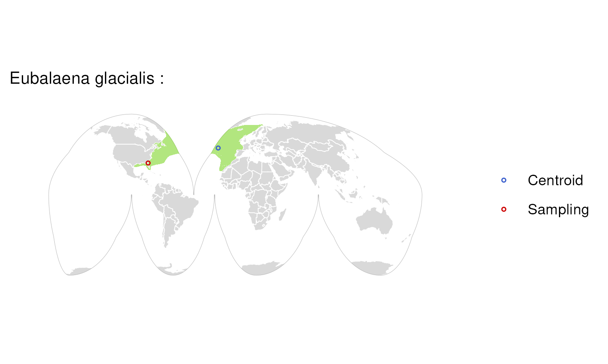

### Species: Eudromia elegans

**Common Name:** elegant crested tinamou\
**Biosample:** SAMN46865137\
**Assembly Accession:** GCA_047922985.1\
**Taxon:** Birds\
**Priority:** 6\
**Flags:** Zoo Sample;

**Map Notes:**\
**Comments:** NA

### Species: Euleptes europaea

**Common Name:** European leaf-toed gecko\
**Biosample:** SAMN32622440\
**Assembly Accession:** GCA_029931775.1\
**Taxon:** Reptiles\
**Priority:** 6\
**Flags:**

**Map Notes:**\
**Comments:** NA

### Species: Eutrigla gurnardus

**Common Name:** grey gurnard\
**Biosample:** SAMEA111562159\
**Assembly Accession:** GCA_963514095.1\
**Taxon:** Fishes\
**Priority:** 6\
**Flags:** Missing Range;

**Map Notes:**\
**Comments:** The assembly fEutGur1.1 is based on 34x PacBio data and
Arima2 Hi-C data generated by the Darwin Tree of Life Project
(<https://www.darwintreeoflife.org/>). The assembly process included the
following sequence of steps: initial PacBio assembly generation with
Hifiasm, retained haplotig separation with purge_dups, and Hi-C based
scaffolding with YaHS. The mitochondrial genome was assembled using
MitoHiFi. Finally, the primary assembly was analysed and manually
improved using rapid curation. Chromosome-scale scaffolds confirmed by
the Hi-C data have been named in order of size.

### Species: Falco cherrug

**Common Name:** saker falcon\
**Biosample:** SAMN28688204\
**Assembly Accession:** GCA_023634085.1\
**Taxon:** Birds\
**Priority:** 6\
**Flags:**

**Map Notes:**\
**Comments:** NA

### Species: Falco naumanni

**Common Name:** lesser kestrel\
**Biosample:** SAMN16870685\
**Assembly Accession:** GCA_017639655.1\
**Taxon:** Birds\
**Priority:** 6\
**Flags:**

**Map Notes:**\
**Comments:** NA

### Species: Falco peregrinus

**Common Name:** peregrine falcon\
**Biosample:** SAMN28688290\
**Assembly Accession:** GCA_023634155.1\
**Taxon:** Birds\
**Priority:** 6\
**Flags:**

**Map Notes:**\
**Comments:** NA

### Species: Fringilla coelebs

**Common Name:** common chaffinch\
**Biosample:** SAMEA9359753\
**Assembly Accession:** GCA_963513975.1\
**Taxon:** Birds\
**Priority:** 6\
**Flags:**

**Map Notes:**\
**Comments:** The assembly bFriCoe1.1 is based on 42x PacBio data and
Arima2 Hi-C data generated by the Darwin Tree of Life Project
(<https://www.darwintreeoflife.org/>). The assembly process included the
following sequence of steps: initial PacBio assembly generation with
Hifiasm, retained haplotig separation with purge_dups, and Hi-C based
scaffolding with YaHS. The mitochondrial genome was assembled using
MitoHiFi. Finally, the primary assembly was analysed and manually
improved using gEVAL. Chromosome-scale scaffolds confirmed by the Hi-C
data have been named in order of size. Z chromosome identified based on
alignment with Gallus gallus (GCA_016700215.1).

### Species: Fundulus diaphanus

**Common Name:** banded killifish\
**Biosample:** SAMN39736529\
**Assembly Accession:** GCA_037039145.1\
**Taxon:** Fishes\
**Priority:** 6\
**Flags:** Missing Range;

**Map Notes:**\
**Comments:** NA

### Species: Gallinula chloropus

**Common Name:** common moorhen\
**Biosample:** SAMEA113398958\
**Assembly Accession:** GCA_964237585.1\
**Taxon:** Birds\
**Priority:** 6\
**Flags:**

**Map Notes:**\
**Comments:** The assembly bGalChl1.hap1.1 is based on 44x PacBio data
and Arima2 Hi-C data generated by the Darwin Tree of Life Project
(<https://www.darwintreeoflife.org/>). The assembly process included the
following sequence of steps: initial PacBio assembly generation with
Hifiasm in Hi-C integrated assembly mode, and Hi-C based scaffolding
with YaHS. The mitochondrial genome was assembled using MitoHiFi.
Finally, each haplotype assembly was analysed and manually improved
using TreeVal. Chromosome-scale scaffolds confirmed by the Hi-C data
have been named in order of size.

### Species: Gasterosteus aculeatus

**Common Name:** three-spined stickleback\
**Biosample:** SAMEA11296546\
**Assembly Accession:** GCA_964276395.1\
**Taxon:** Fishes\
**Priority:** 6\
**Flags:**

**Map Notes:**\
**Comments:** The assembly fGasAcu3.hap1.1 is based on 56x PacBio data
and Arima2 Hi-C data generated by the Darwin Tree of Life Project
(<https://www.darwintreeoflife.org/>). The assembly process included the
following sequence of steps: initial PacBio assembly generation with
Hifiasm in Hi-C integrated assembly mode, and Hi-C based scaffolding
with YaHS. The mitochondrial genome was assembled using MitoHiFi.
Finally, each haplotype assembly was analysed and manually improved
using TreeVal. Chromosome-scale scaffolds are named by synteny based on
Gasterosteus aculeatus aculeatus (three-spined stickleback)
GCF_016920845.1. Chromosomes are named and orientated according to
GCF_016920845.1. Chromosomes X and Y were assigned by HiC signal and
alignment to GCF_016920845.1.

### Species: Gastrophryne carolinensis

**Common Name:** Eastern narrow-mouthed toad\
**Biosample:** SAMN31805274\
**Assembly Accession:** GCA_027917425.1\
**Taxon:** Amphibians\
**Priority:** 6\
**Flags:**

**Map Notes:**\
**Comments:** Both haplotypes were manually curated for chromosomes, but
haplotype 1 received more extensive curation. In haplotype 1, scaffold
order and orientation is uncertain on chromosome 4 (between
278.43-283.90 Mb), chromosome 6 (between 143.10-170.11 Mb), and
chromosome 11 (between 4.30-6.60 Mb)

### Species: Gavialis gangeticus

**Common Name:** Indian gharial\
**Biosample:** SAMN34116453\
**Assembly Accession:** GCA_030020295.1\
**Taxon:** Reptiles\
**Priority:** 6\
**Flags:** Zoo Sample;

**Map Notes:**\
**Comments:** There is some uncertainty in structural organization of
Chromosome 8 due to highly dense repeat content

### Species: Geothlypis trichas

**Common Name:** common yellowthroat\
**Biosample:** SAMN12631222\
**Assembly Accession:** GCA_009764595.1\
**Taxon:** Birds\
**Priority:** 6\
**Flags:**

**Map Notes:**\
**Comments:** This assembly represents the principal haplotype of the
diploid genome Geothlypis trichas and includes the chromosomes. The
alternate haplotype sequences are in WGS project WSPK00000000.

### Species: Globicephala melas

**Common Name:** long-finned pilot whale\
**Biosample:** SAMEA111380538\
**Assembly Accession:** GCA_963455315.2\
**Taxon:** Mammals\
**Priority:** 6\
**Flags:**

**Map Notes:**\
**Comments:** The assembly mGloMel1.2 is based on 29x PacBio data and
Arima2 Hi-C data generated by the Darwin Tree of Life Project
(<https://www.darwintreeoflife.org/>). The assembly process included the
following sequence of steps: initial PacBio assembly generation with
Hifiasm, retained haplotig separation with purge_dups, and Hi-C based
scaffolding with YaHS. The mitochondrial genome was assembled using
MitoHiFi. Finally, the primary assembly was analysed and manually
improved using TreeVal. Chromosome-scale scaffolds confirmed by the Hi-C
data have been named in order of size. Chromosomes X and Y were assigned
by read coverage statistics and synteny to GCA_949987515.1

### Species: Glossophaga mutica

**Common Name:** Merriam’s long-tongued bat\
**Biosample:** SAMN40946060\
**Assembly Accession:** GCA_039655065.1\
**Taxon:** Mammals\
**Priority:** 6\
**Flags:**

**Map Notes:**\
**Comments:** NA

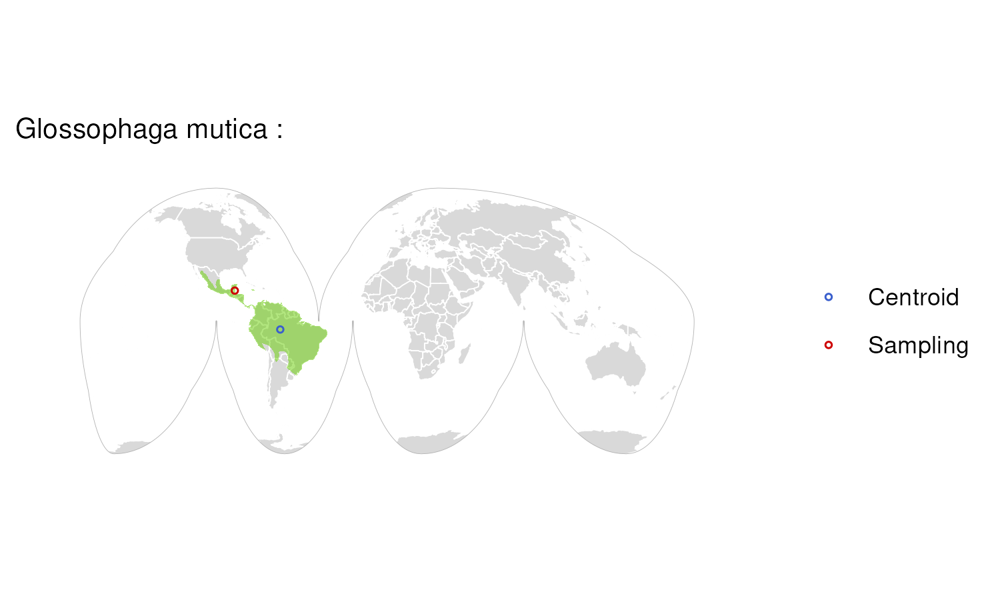

### Species: Gobio gobio

**Common Name:** gudgeon\
**Biosample:** SAMEA11296538\
**Assembly Accession:** GCA_949357685.1\
**Taxon:** Fishes\
**Priority:** 6\
**Flags:**

**Map Notes:**\
**Comments:** The assembly fGobGob1.1 is based on 34x PacBio data and
Arima2 Hi-C data generated by the Darwin Tree of Life Project
(<https://www.darwintreeoflife.org/>). The assembly process included the
following sequence of steps: initial PacBio assembly generation with
Hifiasm, retained haplotig separation with purge_dups, and Hi-C based
scaffolding with YaHS. The mitochondrial genome was assembled using
MitoHiFi. Finally, the primary assembly was analysed and manually
improved using rapid curation. Chromosome-scale scaffolds confirmed by
the Hi-C data have been named in order of size.

### Species: Gobius niger

**Common Name:** black goby\
**Biosample:** SAMEA13854149\
**Assembly Accession:** GCA_951799975.1\
**Taxon:** Fishes\
**Priority:** 6\
**Flags:**

**Map Notes:**\
**Comments:** The assembly fGobNig1.1 is based on 30x PacBio data and
Arima2 Hi-C data generated by the Darwin Tree of Life Project
(<https://www.darwintreeoflife.org/>). The assembly process included the
following sequence of steps: initial PacBio assembly generation with
Hifiasm, retained haplotig separation with purge_dups, and Hi-C based
scaffolding with YaHS. The mitochondrial genome was assembled using
MitoHiFi. Finally, the primary assembly was analysed and manually
improved using rapid curation. Chromosome-scale scaffolds confirmed by
the Hi-C data have been named in order of size.

### Species: Grampus griseus

**Common Name:** Risso’s dolphin\
**Biosample:** SAMEA111380541\
**Assembly Accession:** GCA_964374135.1\
**Taxon:** Mammals\
**Priority:** 6\
**Flags:**

**Map Notes:**\
**Comments:** The assembly mGraGri1.hap1.1 is based on 30x PacBio data
and Arima2 Hi-C data generated by the Darwin Tree of Life Project
(<https://www.darwintreeoflife.org/>). The assembly process included the
following sequence of steps: initial PacBio assembly generation with
Hifiasm in Hi-C integrated assembly mode, and Hi-C based scaffolding
with YaHS. The mitochondrial genome was assembled using MitoHiFi.
Finally, each haplotype assembly was analysed and manually improved
using TreeVal. Chromosome-scale scaffolds confirmed by the Hi-C data
have been named in order of size. The X and Y chromosomes were
identified by read coverage. The exact order and orientation of the
contigs on chromosome Y (7.8 - 18 Mbp) are unknown.

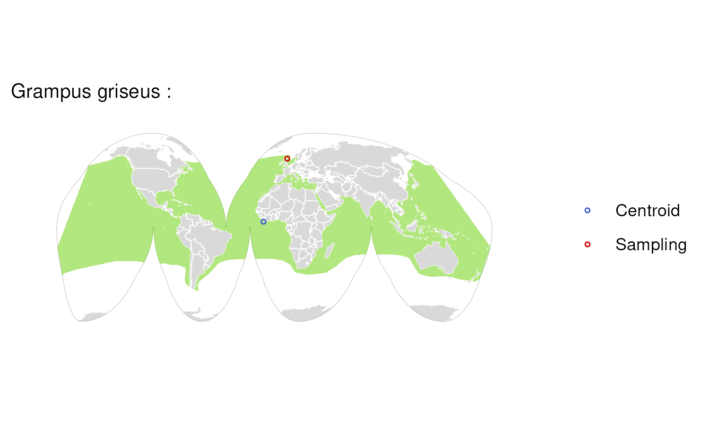

### Species: Grus americana

**Common Name:** whooping crane\
**Biosample:** SAMN32775697\
**Assembly Accession:** GCA_028858705.1\
**Taxon:** Birds\
**Priority:** 6\
**Flags:**

**Map Notes:**\
**Comments:** NA

### Species: Guaruba guaruba

**Common Name:** golden parakeet\
**Biosample:** SAMN44514542\
**Assembly Accession:** GCA_045345405.1\
**Taxon:** Birds\
**Priority:** 6\
**Flags:**

**Map Notes:**\
**Comments:** NA

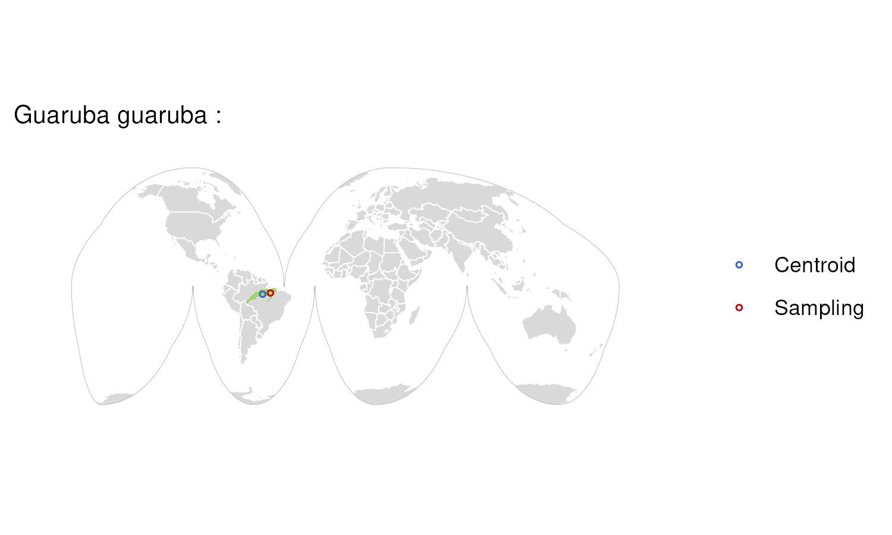

### Species: Gulosus aristotelis

**Common Name:** European shag\
**Biosample:** SAMEA10059652\
**Assembly Accession:** GCA_949628215.1\
**Taxon:** Birds\
**Priority:** 6\
**Flags:**

**Map Notes:**\
**Comments:** The assembly bGulAri2.1 is based on 42x PacBio data and
Arima2 Hi-C data generated by the Darwin Tree of Life Project
(<https://www.darwintreeoflife.org/>). The assembly process included the
following sequence of steps: initial PacBio assembly generation with
Hifiasm, retained haplotig separation with purge_dups, and Hi-C based
scaffolding with YaHS. The mitochondrial genome was assembled using
MitoHiFi. Finally, the primary assembly was analysed and manually
improved using gEVAL. Chromosome-scale scaffolds confirmed by the Hi-C
data have been named in order of size.

### Species: Gymnoscopelus braueri

**Common Name:** Brauer’s lanternfish\
**Biosample:** SAMEA12815494\
**Assembly Accession:** GCA_963280865.1\
**Taxon:** Fishes\
**Priority:** 6\
**Flags:**

**Map Notes:**\
**Comments:** The assembly fGymBra2.1 is based on 34x PacBio data and
Arima2 Hi-C data generated by the Darwin Tree of Life Project
(<https://www.darwintreeoflife.org/>). The assembly process included the
following sequence of steps: initial PacBio assembly generation with
Hifiasm, retained haplotig separation with purge_dups, and Hi-C based
scaffolding with YaHS. The mitochondrial genome was assembled using
MitoHiFi. Finally, the primary assembly was analysed and manually
improved using rapid curation. Chromosome-scale scaffolds confirmed by
the Hi-C data have been named in order of size.

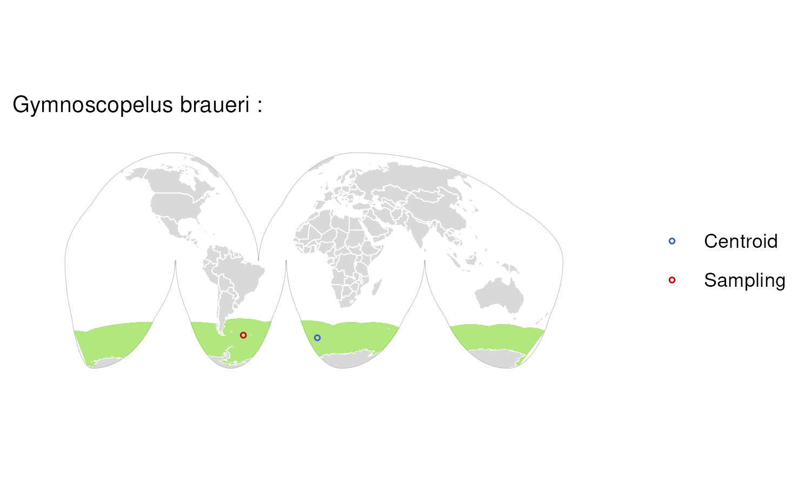

### Species: Gymnoscopelus microlampas

**Common Name:** minispotted lanternfish\
**Biosample:** SAMEA12815435\
**Assembly Accession:** GCA_963454915.1\
**Taxon:** Fishes\
**Priority:** 6\
**Flags:**

**Map Notes:**\
**Comments:** The assembly fGymMic1.1 is based on 62x PacBio data and
Arima2 Hi-C data generated by the Darwin Tree of Life Project
(<https://www.darwintreeoflife.org/>). The assembly process included the
following sequence of steps: initial PacBio assembly generation with
Hifiasm, retained haplotig separation with purge_dups, and Hi-C based
scaffolding with YaHS. The mitochondrial genome was assembled using
MitoHiFi. Finally, the primary assembly was analysed and manually
improved using rapid curation. Chromosome-scale scaffolds confirmed by
the Hi-C data have been named in order of size.

### Species: Gypaetus barbatus

**Common Name:** bearded vulture\
**Biosample:** SAMN32256411\
**Assembly Accession:** GCA_028022735.1\
**Taxon:** Birds\
**Priority:** 6\
**Flags:**

**Map Notes:**\
**Comments:** Order and orientation of contigs in the following
centromeric repeats is uncertain: chromosome 1 20.6-23.9mb, chromosome 2
19.1-22.2mb, chromosome 3 24.1-25.5mb, chromosome 4 37.9-39.1mb,
chromosome 9, 17.3-22.8mb, chromosome 12 16.6-20.9mb, chromosome 14
20.6-23.5mb, chromosome 16 4.8-8.8mb, chromosome 19 0.7-3.6mb,
chromosome 24 1-3.7mb, chromosome W 17.6-19.4mb chromosome 18 9.1-11.8mb

### Species: Haemorhous mexicanus

**Common Name:** house finch\
**Biosample:** SAMN28453576\
**Assembly Accession:** GCA_027477595.1\
**Taxon:** Birds\
**Priority:** 6\
**Flags:**

**Map Notes:**\
**Comments:** NA

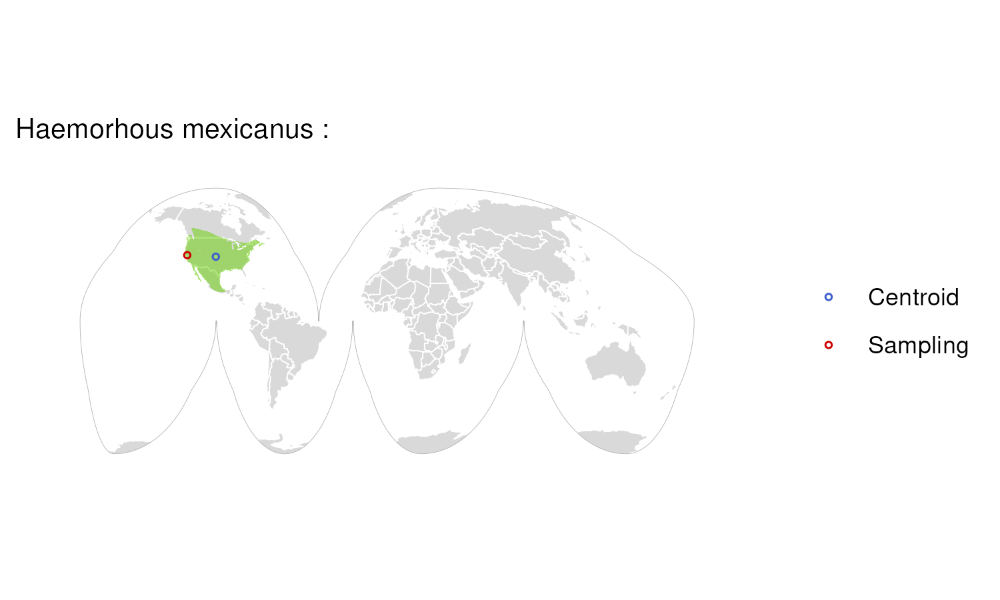

### Species: Haliaeetus albicilla

**Common Name:** white-tailed eagle\
**Biosample:** SAMEA12857288\
**Assembly Accession:** GCA_947461875.1\
**Taxon:** Birds\
**Priority:** 6\
**Flags:**

**Map Notes:**\
**Comments:** The assembly bHalAlb1.1 is based on 49x PacBio data and
Arima2 Hi-C data generated by the Wellcome Sanger Institute Tree of Life
Programme (<https://www.sanger.ac.uk/programme/tree-of-life/>) as part
of the European Reference Genome Atlas pilot project
(<https://www.erga-biodiversity.eu/pilot-project>). The assembly process
included the following sequence of steps: initial PacBio assembly
generation with Hifiasm, retained haplotig separation with purge_dups,
and Hi-C based scaffolding with YaHS. The \${ORGANELLE_TYPE_CLAUSE}
assembled using MitoHiFi. Finally, the primary assembly was analysed and
manually improved using rapid curation. This alternate haplotype
assembly combines the haplotigs separated by purge_dups with haplotigs
separated from the primary assembly during curation.

### Species: Halichoerus grypus

**Common Name:** grey seal\
**Biosample:** SAMEA115427674\
**Assembly Accession:** GCA_964656455.1\
**Taxon:** Mammals\
**Priority:** 6\
**Flags:**

**Map Notes:**\
**Comments:** The assembly mHalGry1.hap1.1 is based on 58x PacBio data
and Arima2 Hi-C data generated by the Darwin Tree of Life Project
(<https://www.darwintreeoflife.org/>). The assembly process included the
following sequence of steps: initial PacBio assembly generation with
Hifiasm in Hi-C integrated assembly mode, and Hi-C based scaffolding
with YaHS. The mitochondrial genome was assembled using MitoHiFi.
Finally, each haplotype assembly was analysed and manually improved
using TreeVal. Chromosome-scale scaffolds confirmed by the Hi-C data
have been named in order of size. The exact order and orientation of the
contigs on chromosome 8 (13.0 - 20.0) are unknown. The sex chromosome X
was assigned by synteny to GCA_028975605.1 / Pusa sibirica.

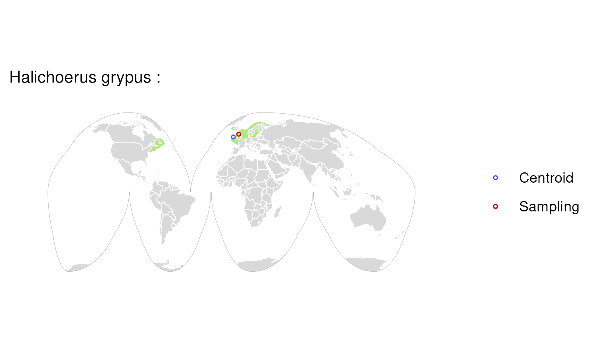

### Species: Harpia harpyja

**Common Name:** harpy eagle\
**Biosample:** SAMN31530492\
**Assembly Accession:** GCA_026419915.1\
**Taxon:** Birds\
**Priority:** 6\
**Flags:**

**Map Notes:**\
**Comments:** NA

### Species: Heliangelus exortis

**Common Name:** tourmaline sunangel\
**Biosample:** SAMN37253778\
**Assembly Accession:** GCA_036169615.1\
**Taxon:** Birds\
**Priority:** 6\
**Flags:**

**Map Notes:**\
**Comments:** NA

### Species: Hemiprocne comata

**Common Name:** whiskered treeswift\
**Biosample:** SAMN22588383\
**Assembly Accession:** GCA_020745705.1\
**Taxon:** Birds\
**Priority:** 6\
**Flags:**

**Map Notes:**\
**Comments:** NA

### Species: Heterodontus francisci

**Common Name:** horn shark\
**Biosample:** SAMN39432692\
**Assembly Accession:** GCA_036365525.1\
**Taxon:** Fishes\
**Priority:** 6\
**Flags:**

**Map Notes:**\
**Comments:** NA

### Species: Heterohyrax brucei

**Common Name:** yellow-spotted rock hyrax\
**Biosample:** SAMN33092455\
**Assembly Accession:** GCA_028571685.1\
**Taxon:** Mammals\
**Priority:** 6\
**Flags:** Zoo Sample;

**Map Notes:**\
**Comments:** The mHetBru1 assembly is characterized by telocentric
repeats. As such, several centromeres were difficult to resolve and the
order/orientation of scaffolds in these regions is uncertain

### Species: Hippoglossus hippoglossus

**Common Name:** Atlantic halibut\
**Biosample:** SAMN12629501\
**Assembly Accession:** GCA_009819705.1\
**Taxon:** Fishes\
**Priority:** 6\
**Flags:**

**Map Notes:**\
**Comments:** This assembly represents the principal haplotype of the
diploid genome Hippoglossus hippoglossus and includes the chromosomes.
The alternate haplotype sequences are in WGS project WOYC00000000

### Species: Hippopotamus amphibius

**Common Name:** common hippopotamus\
**Biosample:** SAMN33342074\
**Assembly Accession:** GCA_030028045.1\
**Taxon:** Mammals\
**Priority:** 6\
**Flags:** Zoo Sample;

**Map Notes:**\
**Comments:** NA

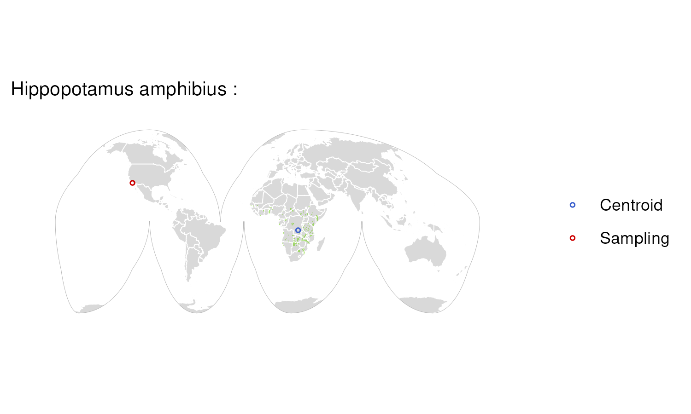

### Species: Hipposideros larvatus

**Common Name:** intermediate roundleaf bat\
**Biosample:** SAMN36277597\
**Assembly Accession:** GCA_031876335.1\
**Taxon:** Mammals\
**Priority:** 6\
**Flags:**

**Map Notes:**\
**Comments:** NA

### Species: Hoplias malabaricus

**Common Name:** trahira\
**Biosample:** SAMN32740525\
**Assembly Accession:** GCA_029633855.2\
**Taxon:** Fishes\
**Priority:** 6\
**Flags:**

**Map Notes:**\
**Comments:** NA

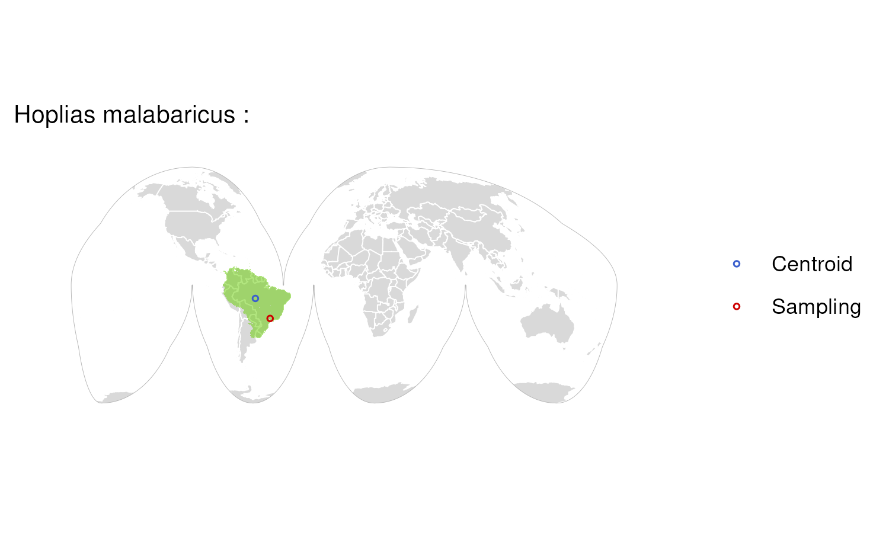

### Species: Hydrolagus colliei

**Common Name:** spotted ratfish\
**Biosample:** SAMN39156054\
**Assembly Accession:** GCA_035084275.1\
**Taxon:** Fishes\
**Priority:** 6\
**Flags:**

**Map Notes:**\
**Comments:** NA

### Species: Hyla sarda

**Common Name:** Sardinian treefrog\
**Biosample:** SAMN32629340\
**Assembly Accession:** GCA_029499605.1\
**Taxon:** Amphibians\
**Priority:** 6\
**Flags:**

**Map Notes:**\
**Comments:** NA

### Species: Hypanus sabinus

**Common Name:** Atlantic stingray\
**Biosample:** SAMN32745077\
**Assembly Accession:** GCA_030144855.1\
**Taxon:** Fishes\
**Priority:** 6\
**Flags:**

**Map Notes:**\
**Comments:** Chromosomes X1, X2 and Y were found based on coverage
data. Chromosome Y was moved from hap2 into hap1 to have sex chromosomes
in the same haplotype. Chromosome 32 is likely much larger, made up of
many small scaffolds that could not be joined manually.

### Species: Hyperoodon ampullatus

**Common Name:** North Atlantic bottlenose whale\
**Biosample:** SAMEA10839125\
**Assembly Accession:** GCA_949752795.1\
**Taxon:** Mammals\
**Priority:** 6\
**Flags:**

**Map Notes:**\
**Comments:** The assembly mHypAmp2.1 is based on 28x PacBio data and
Arima2 Hi-C data generated by the Darwin Tree of Life Project
(<https://www.darwintreeoflife.org/>). The assembly process included the
following sequence of steps: initial PacBio assembly generation with
Hifiasm, retained haplotig separation with purge_dups, and Hi-C based
scaffolding with YaHS. The mitochondrial genome was assembled using
MitoHiFi. Finally, the primary assembly was analysed and manually
improved using rapid curation. Chromosome-scale scaffolds confirmed by
the Hi-C data have been named in order of size. The X chromosome was
identified based on alignment with Mesoplodon densirostris
(GCA_025265405.1). The order and orientation of contigs in the following
regions is uncertain: SUPER_2, 131 Mb to 140 Mb; SUPER_6, 91 Mb to 102
Mb and SUPER_7, 76 Mb to 81 Mb.

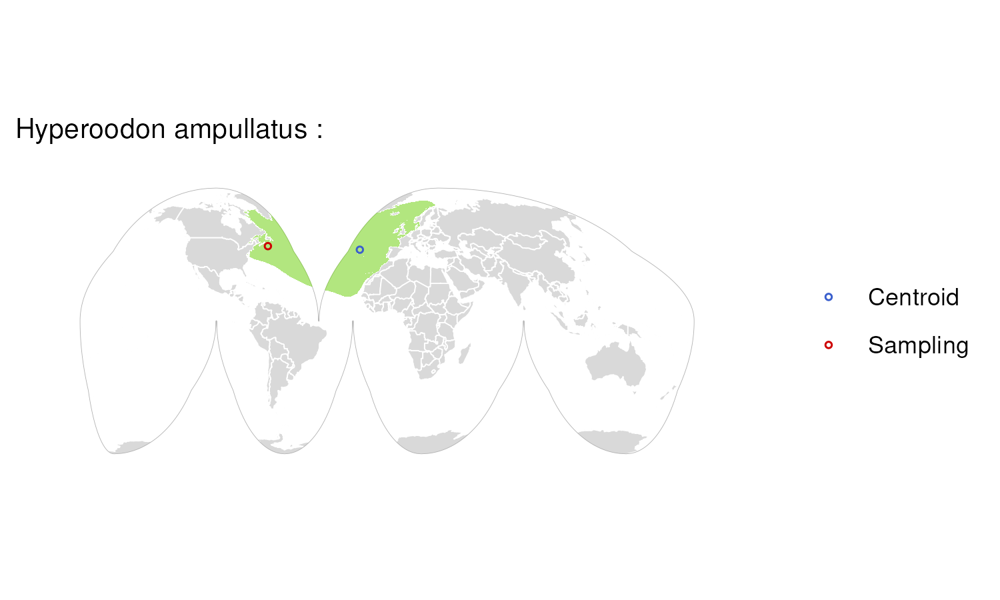

### Species: Hyperoplus immaculatus

**Common Name:** greater sand eel\
**Biosample:** SAMEA13854416\
**Assembly Accession:** GCA_949357725.1\
**Taxon:** Fishes\
**Priority:** 6\
**Flags:** Missing Range;

**Map Notes:**\
**Comments:** The assembly fHypImm3.1 is based on 31x PacBio data and
Arima2 Hi-C data generated by the Darwin Tree of Life Project
(<https://www.darwintreeoflife.org/>). The assembly process included the
following sequence of steps: initial PacBio assembly generation with
Hifiasm, retained haplotig separation with purge_dups, and Hi-C based
scaffolding with YaHS. The mitochondrial genome was assembled using
MitoHiFi. Finally, the primary assembly was analysed and manually
improved using rapid curation. Chromosome-scale scaffolds confirmed by
the Hi-C data have been named in order of size.

### Species: Inia geoffrensis

**Common Name:** Amazon river dolphin\
**Biosample:** SAMN32797734\
**Assembly Accession:** GCA_036417435.1\
**Taxon:** Mammals\
**Priority:** 6\
**Flags:**

**Map Notes:**\
**Comments:** NA

### Species: Kogia breviceps

**Common Name:** pygmy sperm whale\
**Biosample:** SAMN31719513\
**Assembly Accession:** GCA_026419965.1\
**Taxon:** Mammals\
**Priority:** 6\
**Flags:**

**Map Notes:**\
**Comments:** NA

### Species: Labrus bergylta

**Common Name:** ballan wrasse\
**Biosample:** SAMEA111562158\
**Assembly Accession:** GCA_963930695.1\
**Taxon:** Fishes\
**Priority:** 6\
**Flags:**

**Map Notes:**\
**Comments:** The assembly fLabBer1.1 is based on 34x PacBio data and
Arima2 Hi-C data generated by the Darwin Tree of Life Project
(<https://www.darwintreeoflife.org/>). The assembly process included the
following sequence of steps: initial PacBio assembly generation with
Hifiasm, retained haplotig separation with purge_dups, and Hi-C based
scaffolding with YaHS. The mitochondrial genome was assembled using
MitoHiFi. Finally, the primary assembly was analysed and manually
improved using TreeVal. Chromosome-scale scaffolds confirmed by the Hi-C
data have been named in order of size. the exact order and orientation
of the contigs in the telomeric repeat regions is unknown.

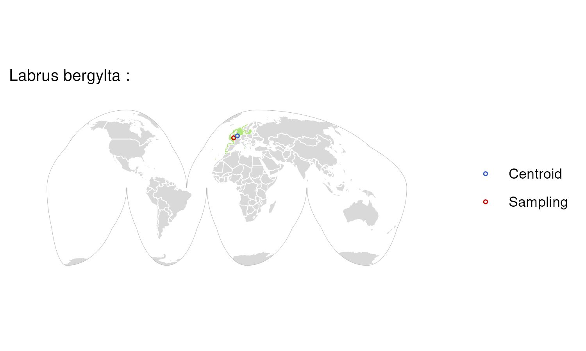

### Species: Labrus mixtus

**Common Name:** cuckoo wrasse\
**Biosample:** SAMEA111562155\
**Assembly Accession:** GCA_963584025.1\
**Taxon:** Fishes\
**Priority:** 6\
**Flags:**

**Map Notes:**\
**Comments:** The assembly fLabMix1.1 is based on 35x PacBio data and
Arima2 Hi-C data generated by the Darwin Tree of Life Project
(<https://www.darwintreeoflife.org/>). The assembly process included the
following sequence of steps: initial PacBio assembly generation with
Hifiasm, retained haplotig separation with purge_dups, and Hi-C based
scaffolding with YaHS. The mitochondrial genome was assembled using
MitoHiFi. Finally, the primary assembly was analysed and manually
improved using rapid curation. Chromosome-scale scaffolds confirmed by
the Hi-C data have been named in order of size.

### Species: Lacerta agilis

**Common Name:** sand lizard\
**Biosample:** SAMN12629509\
**Assembly Accession:** GCA_009819535.1\
**Taxon:** Reptiles\
**Priority:** 6\
**Flags:**

**Map Notes:**\
**Comments:** This assembly represents the principal haplotype of the
diploid genome Lacerta agilis and includes the chromosomes. The
alternate haplotype sequences are in WGS project WNMT00000000

### Species: Lagenorhynchus acutus

**Common Name:** Atlantic white-sided dolphin\
**Biosample:** SAMEA114493133\
**Assembly Accession:** GCA_964270905.1\
**Taxon:** Mammals\
**Priority:** 6\
**Flags:**

**Map Notes:**\
**Comments:** The assembly mLagAcu1.hap1.1 is based on 59x PacBio data
and Arima2 Hi-C data generated by the Darwin Tree of Life Project
(<https://www.darwintreeoflife.org/>). The assembly process included the
following sequence of steps: initial PacBio assembly generation with
Hifiasm in Hi-C integrated assembly mode, and Hi-C based scaffolding
with YaHS. The mitochondrial genome was assembled using MitoHiFi.
Finally, each haplotype assembly was analysed and manually improved
using TreeVal. Chromosome-scale scaffolds confirmed by the Hi-C data
have been named in order of size. Chromosomes X and Y were identified
based on PacBio read coverage and HiC signal.

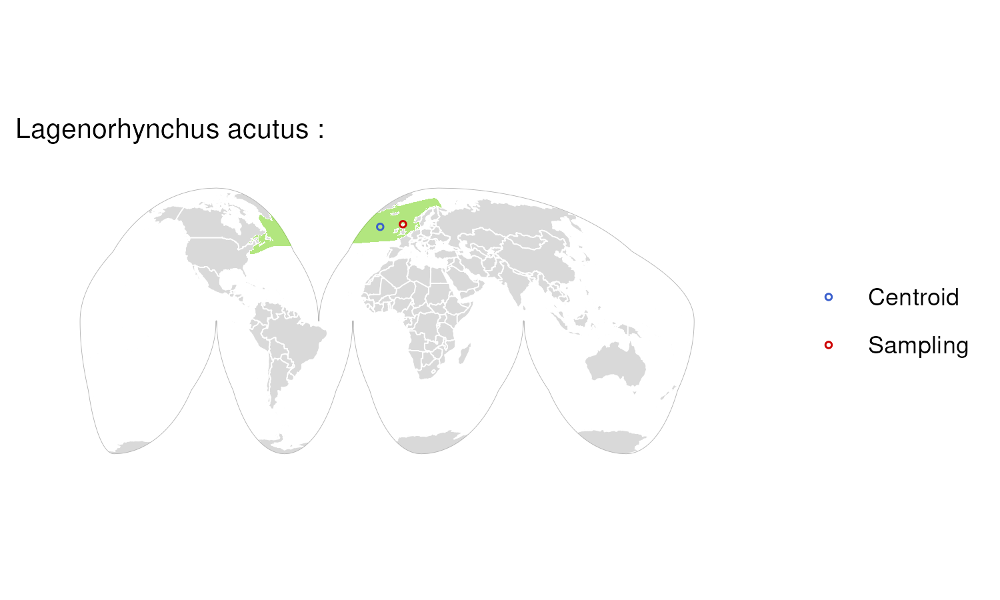

### Species: Lagenorhynchus albirostris

**Common Name:** white-beaked dolphin\
**Biosample:** SAMEA111380537\
**Assembly Accession:** GCA_949774975.1\
**Taxon:** Mammals\
**Priority:** 6\
**Flags:**

**Map Notes:**\
**Comments:** The assembly mLagAlb1.1 is based on 33x PacBio data and
Arima2 Hi-C data generated by the Darwin Tree of Life Project
(<https://www.darwintreeoflife.org/>). The assembly process included the
following sequence of steps: initial PacBio assembly generation with
Hifiasm, retained haplotig separation with purge_dups, and Hi-C based
scaffolding with YaHS. The mitochondrial genome was assembled using
MitoHiFi. Finally, the primary assembly was analysed and manually
improved using rapid curation. Chromosome-scale scaffolds confirmed by
the Hi-C data have been named in order of size. The X chromosome was
identified based on synteny with Tursiops truncatus (GCF_011762595.1).
The order and orientation of contigs in the following regions is
uncertain: SUPER_1 94.5 Mb to 110 Mb, SUPER_6 95 Mb to 100.5 Mb, SUPER_8
105.5 Mb to end, SUPER_12 88.5 Mb to 91.5 Mb.

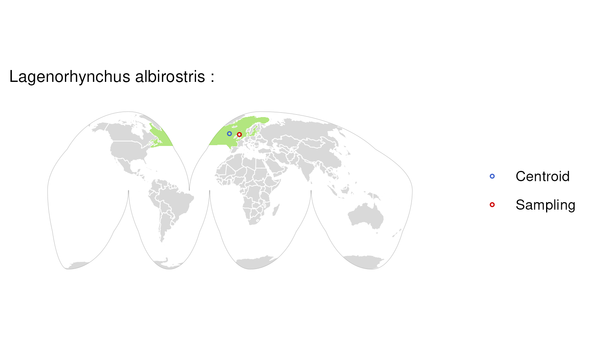

### Species: Lagopus muta

**Common Name:** rock ptarmigan\
**Biosample:** SAMN25144835\
**Assembly Accession:** GCA_023343835.1\
**Taxon:** Birds\
**Priority:** 6\
**Flags:**

**Map Notes:**\
**Comments:** NA

### Species: Lampetra fluviatilis

**Common Name:** European river lamprey\
**Biosample:** SAMEA111528664\
**Assembly Accession:** GCA_964198595.1\
**Taxon:** Fishes\
**Priority:** 6\
**Flags:**

**Map Notes:**\
**Comments:** The assembly kcLamFluv1.1 is based on 36x PacBio data and
Arima2 Hi-C data generated by the Darwin Tree of Life Project
(<https://www.darwintreeoflife.org/>). The assembly process included the
following sequence of steps: initial PacBio assembly generation with
Hifiasm, retained haplotig separation with purge_dups, and Hi-C based
scaffolding with YaHS. The mitochondrial genome was assembled using
MitoHiFi. Finally, the primary assembly was analysed and manually
improved using TreeVal. Chromosome-scale scaffolds confirmed by the Hi-C
data have been named in order of size.

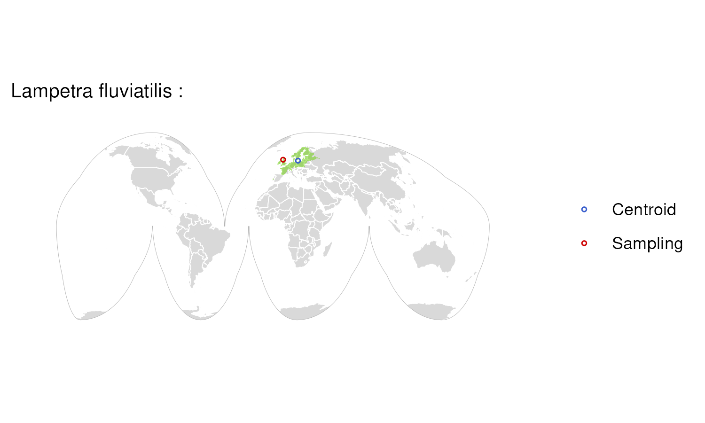

### Species: Lampris incognitus

**Common Name:** smalleye Pacific opah\
**Biosample:** SAMN34060140\
**Assembly Accession:** GCA_029633865.1\
**Taxon:** Fishes\
**Priority:** 6\
**Flags:** Missing Range;

**Map Notes:**\
**Comments:** NA

### Species: Larus argentatus

**Common Name:** herring gull\
**Biosample:** SAMEA115168456\
**Assembly Accession:** GCA_964417175.1\
**Taxon:** Birds\
**Priority:** 6\
**Flags:**

**Map Notes:**\
**Comments:** The assembly bLarArg3.hap1.1 is based on 75x PacBio data
and Arima2 Hi-C data generated by the Darwin Tree of Life Project
(<https://www.darwintreeoflife.org/>). The assembly process included the
following sequence of steps: initial PacBio assembly generation with
Hifiasm in Hi-C integrated assembly mode, and Hi-C based scaffolding
with YaHS. The mitochondrial genome was assembled using MitoHiFi.
Finally, each haplotype assembly was analysed and manually improved
using TreeVal. Chromosome-scale scaffolds confirmed by the Hi-C data
have been named in order of size. The Z and W sex chromosomes were
identified by read coverage. The found karyotype is 33+ZW, as one known
microchromosome couldn’t be found.

### Species: Larus fuscus

**Common Name:** lesser black-backed gull\
**Biosample:** SAMEA112468039\
**Assembly Accession:** GCA_963932225.1\
**Taxon:** Birds\
**Priority:** 6\
**Flags:**

**Map Notes:**\
**Comments:** The assembly bLarFus1.1 is based on 30x PacBio data and
Arima2 Hi-C data generated by the Darwin Tree of Life Project
(<https://www.darwintreeoflife.org/>). The assembly process included the
following sequence of steps: initial PacBio assembly generation with
Hifiasm, retained haplotig separation with purge_dups, and Hi-C based
scaffolding with YaHS. The mitochondrial genome was assembled using
MitoHiFi. Finally, the primary assembly was analysed and manually
improved using TreeVal. Chromosome-scale scaffolds confirmed by the Hi-C
data have been named in order of size. Z chromosome identified based on
alignment with chicken (GCF_016699485.2).

### Species: Larus michahellis

**Common Name:** yellow-legged gull\
**Biosample:** SAMEA114211328\
**Assembly Accession:** GCA_964199755.1\
**Taxon:** Birds\
**Priority:** 6\
**Flags:**

**Map Notes:**\
**Comments:** The assembly bLarMic1.1 is based on 68x PacBio data and
Arima2 Hi-C data generated by the Darwin Tree of Life Project
(<https://www.darwintreeoflife.org/>). The assembly process included the
following sequence of steps: initial PacBio assembly generation with
Hifiasm, retained haplotig separation with purge_dups, and Hi-C based
scaffolding with YaHS. The mitochondrial genome was assembled using
MitoHiFi. Finally, the primary assembly was analysed and manually
improved using TreeVal. Chromosome-scale scaffolds confirmed by the Hi-C
data have been named in order of size. Chromosomes Z and W were
identified using read coverage.

### Species: Latimeria chalumnae

**Common Name:** African coelacanth\
**Biosample:** SAMN39710040\
**Assembly Accession:** GCA_037176945.1\
**Taxon:** Fishes\
**Priority:** 6\
**Flags:** Missing Range;

**Map Notes:**\
**Comments:** Hi-C data was from different individual, fLatCha2, used to
generate the Pacbio HiFi long read data, fLatCha1. Thus we used Hi-C for
scaffolding the primary haplotype, but could not use it for phasing each
haplotype equally

### Species: Lemur catta

**Common Name:** ring-tailed lemur\
**Biosample:** SAMN12621102\
**Assembly Accession:** GCA_020740605.1\
**Taxon:** Mammals\
**Priority:** 6\
**Flags:** Zoo Sample;

**Map Notes:**\
**Comments:** NA

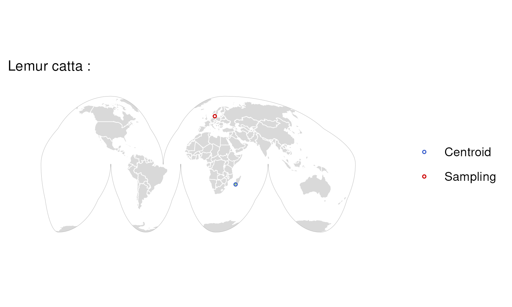

### Species: Lepidochelys kempii

**Common Name:** Kemp’s ridley sea turtle\
**Biosample:** SAMN46282779\
**Assembly Accession:** GCA_965140285.1\
**Taxon:** Reptiles\
**Priority:** 6\
**Flags:**

**Map Notes:**\
**Comments:** NA

### Species: Lepidochelys olivacea

**Common Name:** Pacific ridley\
**Biosample:** SAMN46283035\
**Assembly Accession:** GCA_965140295.1\
**Taxon:** Reptiles\
**Priority:** 6\
**Flags:**

**Map Notes:**\
**Comments:** NA

### Species: Lepisosteus oculatus

**Common Name:** spotted gar\
**Biosample:** SAMN41155427\
**Assembly Accession:** GCA_040954835.1\
**Taxon:** Fishes\
**Priority:** 6\
**Flags:**

**Map Notes:**\
**Comments:** NA

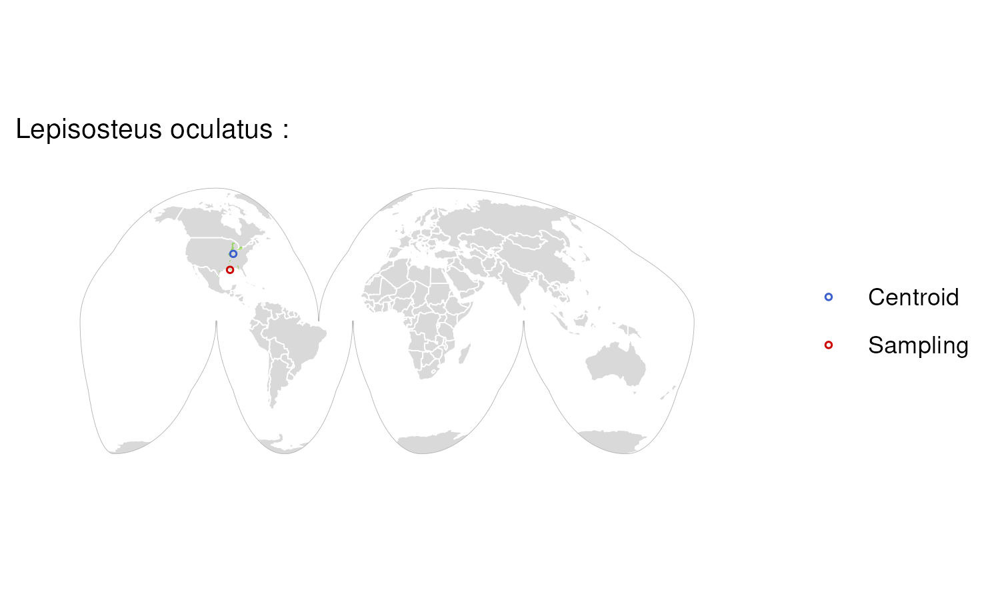

### Species: Leptodactylus fuscus

**Common Name:** rufous frog\
**Biosample:** SAMN37055805\
**Assembly Accession:** GCA_031893055.1\
**Taxon:** Amphibians\
**Priority:** 6\
**Flags:**

**Map Notes:**\
**Comments:** NA

### Species: Leuciscus leuciscus

**Common Name:** common dace\
**Biosample:** SAMEA11296544\
**Assembly Accession:** GCA_965113295.1\
**Taxon:** Fishes\
**Priority:** 6\
**Flags:**

**Map Notes:**\
**Comments:** The assembly fLeuLeu2.hap1.1 is based on 40x PacBio data
and Arima2 Hi-C data generated by the Darwin Tree of Life Project
(<https://www.darwintreeoflife.org/>). The assembly process included the
following sequence of steps: initial PacBio assembly generation with
Hifiasm in Hi-C integrated assembly mode, and Hi-C based scaffolding
with YaHS. The mitochondrial genome was assembled using MitoHiFi.
Finally, each haplotype assembly was analysed and manually improved
using TreeVal. Chromosome-scale scaffolds confirmed by the Hi-C data
have been named in order of size. The exact order and orientation of the
contigs on chromosome 3 (22,100 - 28,900 Kbp) are unknown.The exact
order and orientation of the contigs on chromosome 4 (36,700 - 38,100
Kbp) are unknown.The exact order and orientation of the contigs on
chromosome 8 (31,500 - 35,200 Kbp) are unknown.The exact order and
orientation of the contigs on chromosome 17 (34,100 - 36,900 Kbp) are
unknown.The exact order and orientation of the contigs on chromosome 18
(31,500 - 33,700 Kbp) are unknown.The exact order and orientation of the
contigs on chromosome 23 (25,300 - 25,900 & 27,900 - 29,000 Kbp) are
unknown.The exact order and orientation of the contigs on chromosome 24
(0- 2,300 & 27,900 - 29,000 Kbp) are unknown.

### Species: Liasis olivaceus

**Common Name:** olive python\
**Biosample:** SAMN32739907\
**Assembly Accession:** GCA_030867105.1\
**Taxon:** Reptiles\
**Priority:** 6\
**Flags:** Zoo Sample;

**Map Notes:**\
**Comments:** NA

### Species: Limanda limanda

**Common Name:** common dab\
**Biosample:** SAMEA112765706\
**Assembly Accession:** GCA_963576545.1\
**Taxon:** Fishes\
**Priority:** 6\
**Flags:**

**Map Notes:**\
**Comments:** The assembly fLimLim1.1 is based on 114x PacBio data and
Arima2 Hi-C data generated by the Darwin Tree of Life Project
(<https://www.darwintreeoflife.org/>). The assembly process included the
following sequence of steps: initial PacBio assembly generation with
Hifiasm, retained haplotig separation with purge_dups, and Hi-C based
scaffolding with YaHS. The mitochondrial genome was assembled using
MitoHiFi. Finally, the primary assembly was analysed and manually
improved using rapid curation. Chromosome-scale scaffolds confirmed by
the Hi-C data have been named in order of size.

### Species: Lipophrys pholis

**Common Name:** shanny\
**Biosample:** SAMEA7522844\
**Assembly Accession:** GCA_963383615.1\
**Taxon:** Fishes\
**Priority:** 6\
**Flags:**

**Map Notes:**\
**Comments:** The assembly fLipPho2.1 is based on 41x PacBio data and
Arima2 Hi-C data generated by the Darwin Tree of Life Project
(<https://www.darwintreeoflife.org/>). The assembly process included the
following sequence of steps: initial PacBio assembly generation with
Hifiasm, retained haplotig separation with purge_dups, and Hi-C based
scaffolding with YaHS. The mitochondrial genome was assembled using
MitoHiFi. Finally, the primary assembly was analysed and manually
improved using rapid curation. Chromosome-scale scaffolds confirmed by
the Hi-C data have been named in order of size.

### Species: Lissotriton helveticus

**Common Name:** palmate newt\
**Biosample:** SAMEA110240860\
**Assembly Accession:** GCA_964261635.1\
**Taxon:** Amphibians\
**Priority:** 6\
**Flags:**

**Map Notes:**\
**Comments:** The assembly aLisHel1.1 is based on 27x PacBio data and
Arima2 Hi-C data generated by the Darwin Tree of Life Project
(<https://www.darwintreeoflife.org/>). The assembly process included the
following sequence of steps: initial PacBio assembly generation with
Hifiasm, retained haplotig separation with purge_dups, and Hi-C based
scaffolding with YaHS. The mitochondrial genome was assembled using
MitoHiFi. Finally, the primary assembly was analysed and manually
improved using TreeVal. Chromosome-scale scaffolds confirmed by the Hi-C
data have been named in order of size. Chromosome 5 has a large
heterozygous inversion between 184-341 Mbp.

### Species: Lissotriton vulgaris

**Common Name:** common newt\
**Biosample:** SAMEA110240861\
**Assembly Accession:** GCA_964263255.1\
**Taxon:** Amphibians\
**Priority:** 6\
**Flags:**

**Map Notes:**\
**Comments:** The assembly aLisVul1.1 is based on 34x PacBio data and
Arima2 Hi-C data generated by the Darwin Tree of Life Project
(<https://www.darwintreeoflife.org/>). The assembly process included the
following sequence of steps: initial PacBio assembly generation with
Hifiasm, retained haplotig separation with purge_dups, and Hi-C based
scaffolding with YaHS. The mitochondrial genome was assembled using
MitoHiFi. Finally, the primary assembly was analysed and manually
improved using TreeVal. Chromosome-scale scaffolds confirmed by the Hi-C
data have been named in order of size.

### Species: Loxodonta africana

**Common Name:** African elephant\
**Biosample:** SAMN32756554\
**Assembly Accession:** GCA_030014295.1\
**Taxon:** Mammals\
**Priority:** 6\
**Flags:** Zoo Sample;

**Map Notes:**\
**Comments:** NA

### Species: Lycodopsis pacificus

**Common Name:** blackbelly eelpout\
**Biosample:** SAMN32629383\
**Assembly Accession:** GCA_028022725.1\
**Taxon:** Fishes\
**Priority:** 6\
**Flags:** Missing Range;

**Map Notes:**\
**Comments:** NA

### Species: Macrochelys suwanniensis

**Common Name:** Suwannee snapping turtle\
**Biosample:** SAMN37052244\
**Assembly Accession:** GCA_033349115.1\
**Taxon:** Reptiles\
**Priority:** 6\
**Flags:**

**Map Notes:**\
**Comments:** NA

### Species: Macrotis lagotis

**Common Name:** greater bilby\
**Biosample:** SAMN39300766\
**Assembly Accession:** GCA_037893015.1\
**Taxon:** Mammals\
**Priority:** 6\
**Flags:** Zoo Sample;

**Map Notes:**\
**Comments:** NA

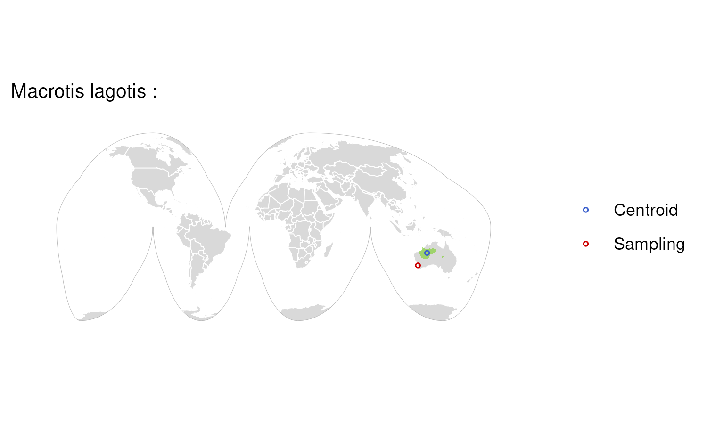

### Species: Malaclemys terrapin

**Common Name:** diamondback terrapin\
**Biosample:** SAMN31394215\
**Assembly Accession:** GCA_027887155.1\
**Taxon:** Reptiles\
**Priority:** 6\
**Flags:**

**Map Notes:**\
**Comments:** NA

### Species: Manis pentadactyla

**Common Name:** Chinese pangolin\
**Biosample:** SAMN32757332\
**Assembly Accession:** GCA_030020395.1\
**Taxon:** Mammals\
**Priority:** 6\
**Flags:** Zoo Sample;

**Map Notes:**\
**Comments:** NA

### Species: Marmota flaviventris

**Common Name:** yellow bellied marmot\
**Biosample:** SAMN45932315\
**Assembly Accession:** GCA_047511675.1\
**Taxon:** Mammals\
**Priority:** 6\
**Flags:**

**Map Notes:**\
**Comments:** NA

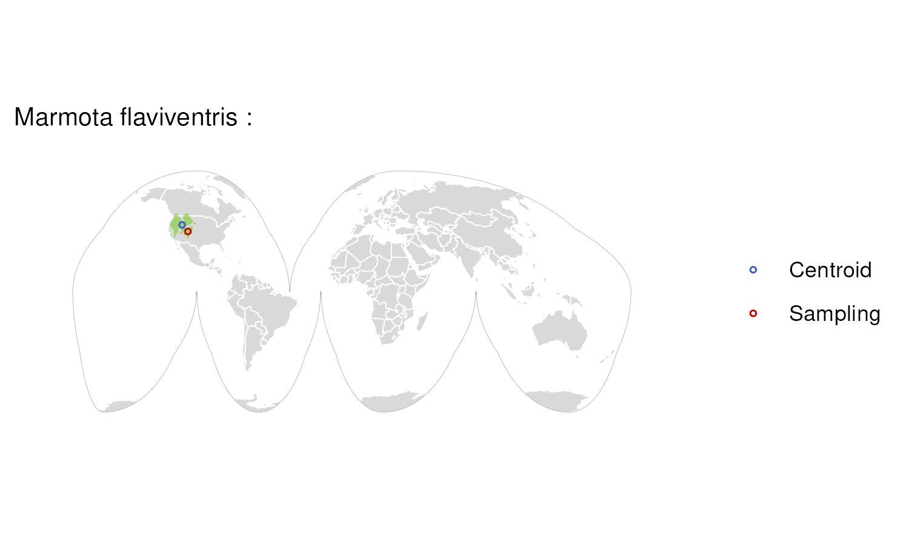

### Species: Martes martes

**Common Name:** European pine marten\
**Biosample:** SAMEA14268932\
**Assembly Accession:** GCA_963455335.1\
**Taxon:** Mammals\
**Priority:** 6\
**Flags:**

**Map Notes:**\
**Comments:** The assembly mMarMar1.1 is based on 35x PacBio data and
Arima2 Hi-C data generated by the Darwin Tree of Life Project
(<https://www.darwintreeoflife.org/>). The assembly process included the
following sequence of steps: initial PacBio assembly generation with
Hifiasm, retained haplotig separation with purge_dups, and Hi-C based
scaffolding with YaHS. The mitochondrial genome was assembled using
MitoHiFi. Finally, the primary assembly was analysed and manually
improved using rapid curation. Chromosome-scale scaffolds confirmed by
the Hi-C data have been named in order of size. Chromosomes X and Y were
assigned by read coverage statistics and synteny to GCA_029410595.1

### Species: Megalops cyprinoides

**Common Name:** Indo-pacific tarpon\
**Biosample:** SAMN12623619\
**Assembly Accession:** GCA_013368585.1\
**Taxon:** Fishes\
**Priority:** 6\
**Flags:**

**Map Notes:**\
**Comments:** This assembly represents the principal haplotype of the
diploid genome Megalops cyprinoides and includes the chromosomes. The
alternate haplotype sequences are in WGS project JABWDN000000000

### Species: Megaptera novaeangliae

**Common Name:** humpback whale\
**Biosample:** SAMN41059645\
**Assembly Accession:** GCA_041834305.1\
**Taxon:** Mammals\
**Priority:** 6\
**Flags:**

**Map Notes:**\
**Comments:** NA

### Species: Melanostigma gelatinosum

**Common Name:** limp eelpout\
**Biosample:** SAMEA12815492\
**Assembly Accession:** GCA_949748355.1\
**Taxon:** Fishes\
**Priority:** 6\
**Flags:** Missing Range;

**Map Notes:**\
**Comments:** The assembly fMelGel1.1 is based on 39x PacBio data and
Arima2 Hi-C data generated by the Darwin Tree of Life Project
(<https://www.darwintreeoflife.org/>). The assembly process included the
following sequence of steps: initial PacBio assembly generation with
Hifiasm, retained haplotig separation with purge_dups, and Hi-C based
scaffolding with YaHS. The mitochondrial genome was assembled using
MitoHiFi. Finally, the primary assembly was analysed and manually
improved using rapid curation. Chromosome-scale scaffolds confirmed by
the Hi-C data have been named in order of size.

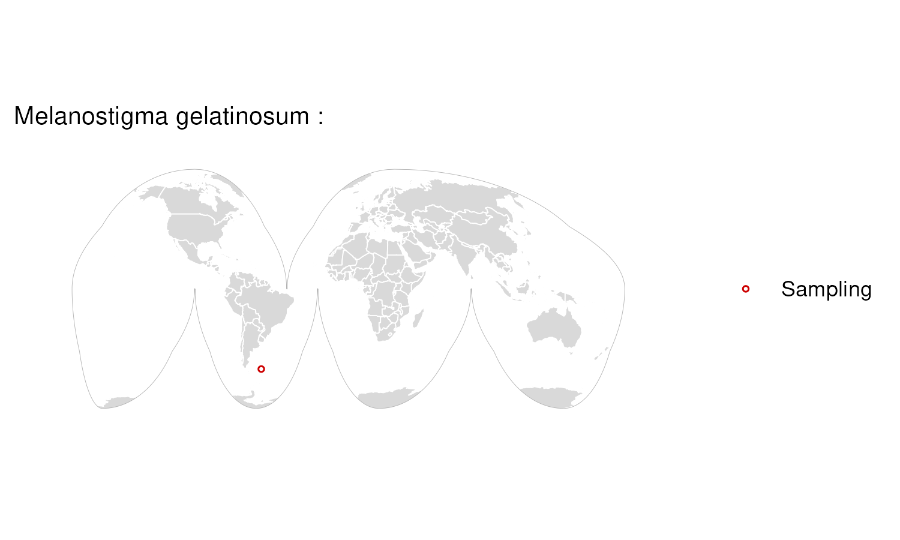

### Species: Meles meles

**Common Name:** European badger\
**Biosample:** SAMEA7524400\
**Assembly Accession:** GCA_922984935.2\
**Taxon:** Mammals\
**Priority:** 6\
**Flags:**

**Map Notes:**\
**Comments:** The assembly mMelMel3.2 is based on 85x PacBio data, and
Arima Hi-C data generated by the Darwin Tree of Life Project
(<https://www.darwintreeoflife.org/>). The assembly process included the
following sequence of steps: HiFi reads were assembled using Hifiasm and
k-mers from the Illumina-sequenced parents in ‘trio’ mode; segregation
of HiC reads using Canu’s ‘splitHaplotype’ script and k-mers from the
Illumina-sequenced parents; for each haplotype assembly,
haplotype-specific and unclassified HiC reads were combined to construct
scaffolds using SALSA2. The mitochondrial genome was assembled using
MitoHifi. Finally, the assembly was analysed and manually improved using
gEVAL, combining the paternal haplotype with the X chromosome from the
maternal haplotype. Chromosome-scale scaffolds confirmed by the Hi-C
data have been named in order of size.

### Species: Melospiza georgiana

**Common Name:** swamp sparrow\
**Biosample:** SAMN22787412\
**Assembly Accession:** GCA_028018845.1\
**Taxon:** Birds\
**Priority:** 6\
**Flags:**

**Map Notes:**\
**Comments:** NA

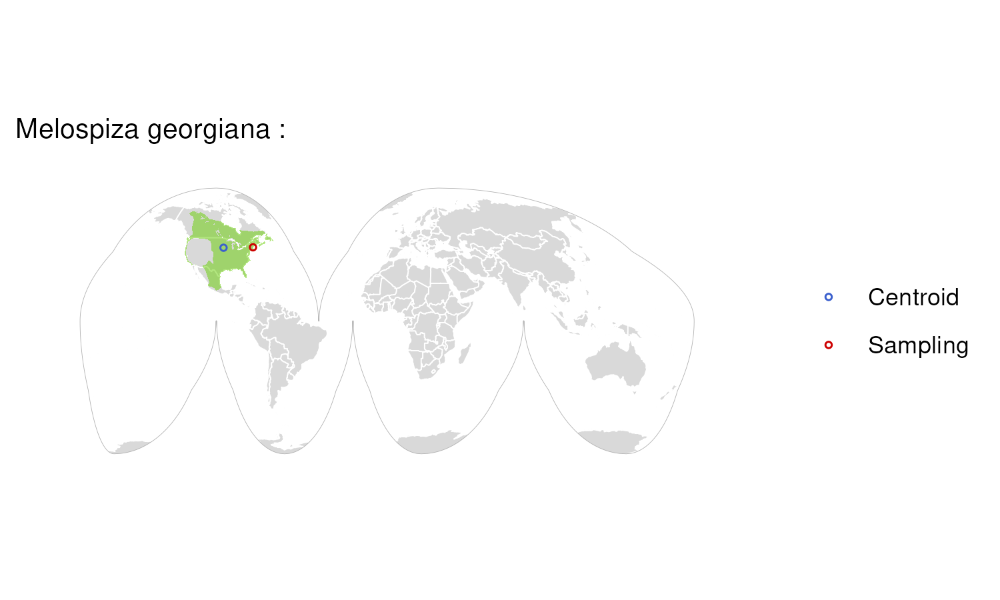

### Species: Melospiza melodia

**Common Name:** song sparrow\
**Biosample:** SAMN35847297\
**Assembly Accession:** GCA_035770615.1\
**Taxon:** Birds\
**Priority:** 6\
**Flags:**

**Map Notes:**\
**Comments:** We were unable to identify the 3 smallest microchromosomes

### Species: Menidia menidia

**Common Name:** Atlantic silverside\
**Biosample:** SAMN46987722\
**Assembly Accession:** GCA_048628825.1\
**Taxon:** Fishes\
**Priority:** 6\
**Flags:**

**Map Notes:**\
**Comments:** NA

### Species: Mergus octosetaceus

**Common Name:** Brazilian merganser\
**Biosample:** SAMN39710078\
**Assembly Accession:** GCA_036873955.1\
**Taxon:** Birds\
**Priority:** 6\
**Flags:**

**Map Notes:**\
**Comments:** NA

### Species: Merops nubicus

**Common Name:** carmine bee-eater\
**Biosample:** SAMN12621035\
**Assembly Accession:** GCA_009819595.1\
**Taxon:** Birds\
**Priority:** 6\
**Flags:** Zoo Sample;

**Map Notes:**\
**Comments:** This assembly represents the principal haplotype of the
diploid genome Merops nubicus and includes the chromosomes. The
alternate haplotype sequences are in WGS project WNMV00000000

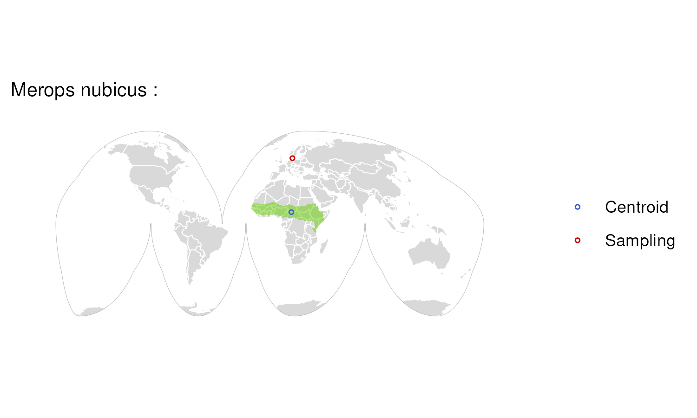

### Species: Mesoplodon densirostris

**Common Name:** Blainville’s beaked whale\
**Biosample:** SAMN29828597\
**Assembly Accession:** GCA_025265405.1\
**Taxon:** Mammals\
**Priority:** 6\
**Flags:**

**Map Notes:**\
**Comments:** NA

### Species: Microchirus variegatus

**Common Name:** thickback sole\
**Biosample:** SAMEA12219470\
**Assembly Accession:** GCA_963457635.1\
**Taxon:** Fishes\
**Priority:** 6\
**Flags:**

**Map Notes:**\
**Comments:** The assembly fMicVar1.1 is based on 36x PacBio data and
Arima2 Hi-C data generated by the Darwin Tree of Life Project
(<https://www.darwintreeoflife.org/>). The assembly process included the
following sequence of steps: initial PacBio assembly generation with
Hifiasm, retained haplotig separation with purge_dups, and Hi-C based
scaffolding with YaHS. The mitochondrial genome was assembled using
MitoHiFi. Finally, the primary assembly was analysed and manually
improved using rapid curation. Chromosome-scale scaffolds confirmed by
the Hi-C data have been named in order of size.

### Species: Micromesistius poutassou

**Common Name:** blue whiting\
**Biosample:** SAMEA111457552\
**Assembly Accession:** GCA_964030765.1\
**Taxon:** Fishes\
**Priority:** 6\
**Flags:** Missing Range;

**Map Notes:**\
**Comments:** The assembly fMicPou1.1 is based on 41x PacBio data and
Arima2 Hi-C data generated by the Darwin Tree of Life Project
(<https://www.darwintreeoflife.org/>). The assembly process included the
following sequence of steps: initial PacBio assembly generation with
Hifiasm, retained haplotig separation with purge_dups, and Hi-C based
scaffolding with YaHS. The mitochondrial genome was assembled using
MitoHiFi. Finally, the primary assembly was analysed and manually
improved using TreeVal. Chromosome-scale scaffolds confirmed by the Hi-C
data have been named in order of size.

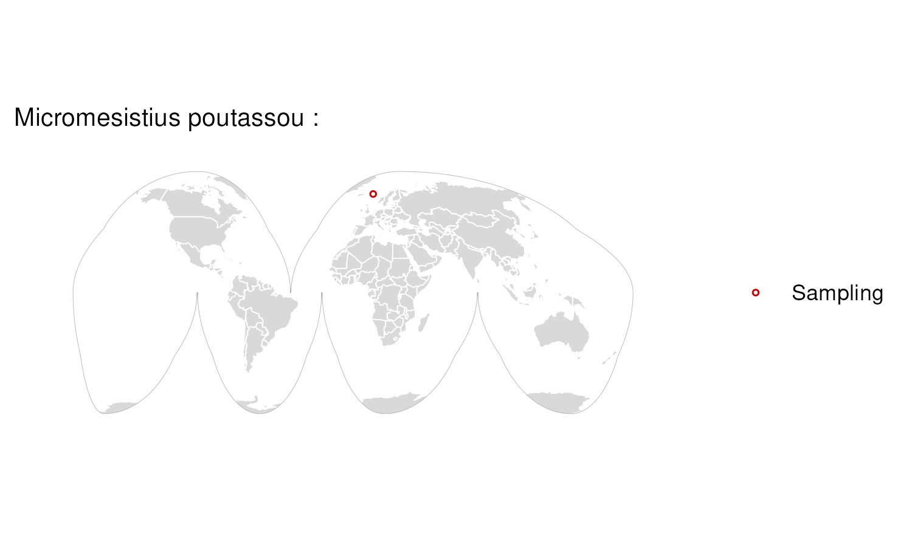

### Species: Micromys minutus

**Common Name:** European harvest mouse\
**Biosample:** SAMEA112468042\
**Assembly Accession:** GCA_963924665.1\
**Taxon:** Mammals\
**Priority:** 6\
**Flags:**

**Map Notes:**\
**Comments:** The assembly mMicMin1.1 is based on 28x PacBio data and
Arima2 Hi-C data generated by the Darwin Tree of Life Project
(<https://www.darwintreeoflife.org/>). The assembly process included the
following sequence of steps: initial PacBio assembly generation with
Hifiasm, retained haplotig separation with purge_dups, and Hi-C based
scaffolding with YaHS. The mitochondrial genome was assembled using
MitoHiFi. Finally, the primary assembly was analysed and manually
improved using TreeVal. Chromosome-scale scaffolds confirmed by the Hi-C
data have been named in order of size. X chromosome identified based on
synteny with to Mus musculus.

### Species: Microstomus kitt

**Common Name:** lemon sole\
**Biosample:** SAMEA114298639\
**Assembly Accession:** GCA_964266715.1\
**Taxon:** Fishes\
**Priority:** 6\
**Flags:**

**Map Notes:**\
**Comments:** The assembly fMicKit1.1 is based on 60x PacBio data and
Arima2 Hi-C data generated by the Darwin Tree of Life Project
(<https://www.darwintreeoflife.org/>). The assembly process included the
following sequence of steps: initial PacBio assembly generation with
Hifiasm, retained haplotig separation with purge_dups, and Hi-C based
scaffolding with YaHS. The mitochondrial genome was assembled using
MitoHiFi. Finally, the primary assembly was analysed and manually
improved using TreeVal. Chromosome-scale scaffolds confirmed by the Hi-C
data have been named in order of size.

### Species: Microtus pennsylvanicus

**Common Name:** Eastern meadow vole\
**Biosample:** SAMN39894136\
**Assembly Accession:** GCA_037038515.1\
**Taxon:** Mammals\
**Priority:** 6\
**Flags:**

**Map Notes:**\
**Comments:** NA

### Species: Miniopterus schreibersii

**Common Name:** Schreibers’ long-fingered bat\
**Biosample:** SAMEA113980738\
**Assembly Accession:** GCA_964146895.2\
**Taxon:** Mammals\
**Priority:** 6\
**Flags:**

**Map Notes:**\
**Comments:** The assembly mMinSch1.hap1.2 is based on 37x PacBio data
and Arima2 Hi-C data generated by the Darwin Tree of Life Project
(<https://www.darwintreeoflife.org/>). The assembly process included the
following sequence of steps: initial PacBio assembly generation with
Hifiasm in Hi-C integrated assembly mode, and Hi-C based scaffolding
with YaHS. The mitochondrial genome was assembled using MitoHiFi.
Finally, each haplotype assembly was analysed and manually improved
using TreeVal. Chromosome-scale scaffolds are named by synteny based on
Miniopterus schreibersii (Schreibers’ long-fingered bat)
GCA_964145185.1. The order and orientation of contigs along the Y
chromosome is uncertain between 6.6 Mb and 15.5 Mb.

### Species: Mobula birostris

**Common Name:** Atlantic manta ray\
**Biosample:** SAMN32746370\
**Assembly Accession:** GCA_030028105.1\
**Taxon:** Fishes\
**Priority:** 6\
**Flags:**

**Map Notes:**\
**Comments:** The order and orientation of Chromosome 13 and Chromosome
28 for both haplotypes is undetermined; on haplotype 1 this is the
region between 13.5 Mbp - 40 Mbp. Haplotype 1 assembly is 380 Mb bigger
than the haplotype 2 assembly, but haplotype 2 has 3x fewer gaps

### Species: Molossus molossus

**Common Name:** Pallas’s mastiff bat\
**Biosample:** SAMN14734448\
**Assembly Accession:** GCA_014108415.1\
**Taxon:** Mammals\
**Priority:** 6\
**Flags:**

**Map Notes:**\
**Comments:** NA

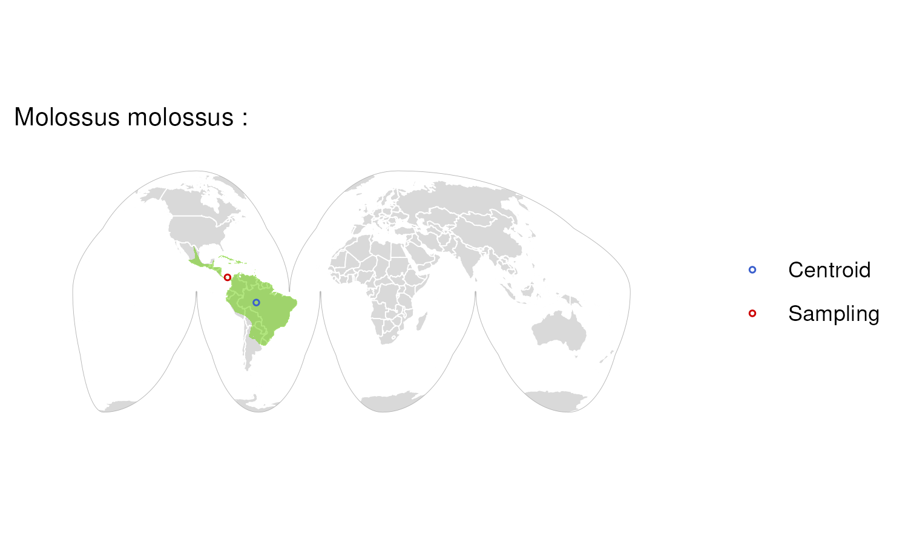

### Species: Molossus nigricans

**Common Name:** Ebon mastiff bat\
**Biosample:** SAMN40002246\
**Assembly Accession:** GCA_039880945.1\
**Taxon:** Mammals\
**Priority:** 6\
**Flags:**

**Map Notes:**\
**Comments:** NA

### Species: Monodon monocero

**Common Name:** narwhal\
**Biosample:** SAMN10872456\
**Assembly Accession:** GCA_005190385.3\
**Taxon:** Mammals\
**Priority:** 6\
**Flags:**

**Map Notes:**\
**Comments:** NA

### Species: Morphnus guianensis

**Common Name:** crested eagle\
**Biosample:** SAMN44513986\
**Assembly Accession:** GCA_045345515.1\
**Taxon:** Birds\
**Priority:** 6\
**Flags:**

**Map Notes:**\
**Comments:** NA

### Species: Morus bassanus

**Common Name:** Northern gannet\
**Biosample:** SAMN37096299\
**Assembly Accession:** GCA_031468815.1\
**Taxon:** Birds\
**Priority:** 6\
**Flags:** Zoo Sample;

**Map Notes:**\
**Comments:** NA

### Species: Muntiacus reevesi

**Common Name:** Reeves’ muntjac\
**Biosample:** SAMEA110690972\
**Assembly Accession:** GCA_963930625.1\
**Taxon:** Mammals\
**Priority:** 6\
**Flags:**

**Map Notes:**\
**Comments:** The assembly mMunRee1.1 is based on 42x PacBio data and
Arima2 Hi-C data generated by the Darwin Tree of Life Project
(<https://www.darwintreeoflife.org/>). The assembly process included the
following sequence of steps: initial PacBio assembly generation with
Hifiasm, retained haplotig separation with purge_dups, and Hi-C based
scaffolding with YaHS. The mitochondrial genome was assembled using
MitoHiFi. Finally, the primary assembly was analysed and manually
improved using TreeVal. Chromosome-scale scaffolds confirmed by the Hi-C
data have been named in order of size. X chromosome identified based on
synteny with Muntiacus reevesi (GCA_020226045.1).

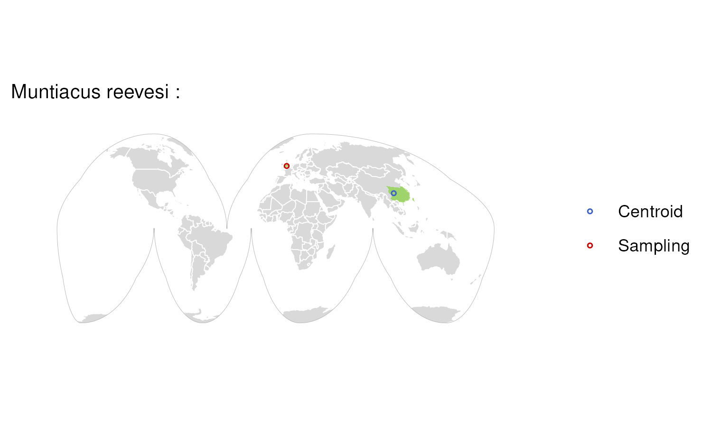

### Species: Mus musculus

**Common Name:** house mouse\
**Biosample:** SAMEA112251260\
**Assembly Accession:** GCA_949316315.1\
**Taxon:** Mammals\
**Priority:** 6\
**Flags:**

**Map Notes:**\
**Comments:** The assembly mMusMuc1.1 is based on 34x PacBio data and
OmniC Hi-C data generated by the Darwin Tree of Life Project
(<https://www.darwintreeoflife.org/>). The assembly process included the
following sequence of steps: initial PacBio assembly generation with
Hifiasm, retained haplotig separation with purge_dups, and Hi-C based
scaffolding with YaHS. The mitochondrial genome was assembled using
MitoHiFi. Finally, the primary assembly was analysed and manually
improved using rapid curation. Chromosome-scale scaffolds are named by
synteny based on Mus musculus (house mouse) GCA_001632555.1.

### Species: Muscardinus avellanarius

**Common Name:** common dormouse\
**Biosample:** SAMEA110180654\
**Assembly Accession:** GCA_963383645.1\
**Taxon:** Mammals\
**Priority:** 6\
**Flags:**

**Map Notes:**\
**Comments:** The assembly mMusAve1.1 is based on 58x PacBio data and
Arima2 Hi-C data generated by the Darwin Tree of Life Project
(<https://www.darwintreeoflife.org/>). The assembly process included the
following sequence of steps: initial PacBio assembly generation with
Hifiasm, retained haplotig separation with purge_dups, and Hi-C based
scaffolding with YaHS. The mitochondrial genome was assembled using
MitoHiFi. Finally, the primary assembly was analysed and manually
improved using gEVAL. Chromosome-scale scaffolds confirmed by the Hi-C
data have been named in order of size.

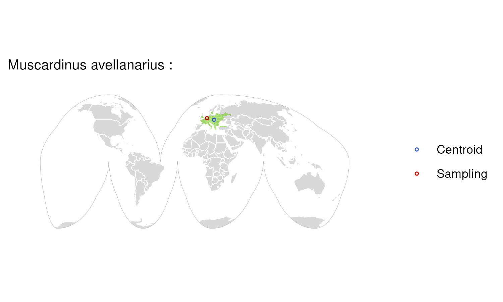

### Species: Mustela erminea

**Common Name:** stout\
**Biosample:** SAMN12611999\
**Assembly Accession:** GCA_009829155.1\
**Taxon:** Mammals\
**Priority:** 6\
**Flags:**

**Map Notes:**\
**Comments:** This assembly represents the principal haplotype of the
diploid genome Mustela erminea and includes the chromosomes. The
alternate haplotype sequences are in WGS project WNLZ00000000

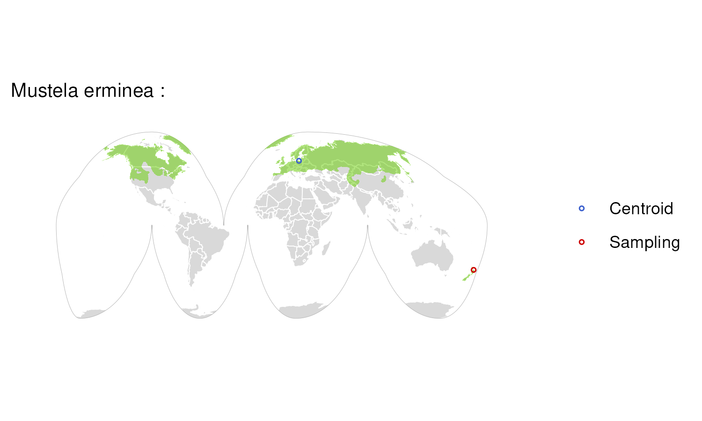

### Species: Mustela lutreola

**Common Name:** European mink\
**Biosample:** SAMN35784236\
**Assembly Accession:** GCA_030435805.1\
**Taxon:** Mammals\
**Priority:** 6\
**Flags:**

**Map Notes:**\
**Comments:** NA

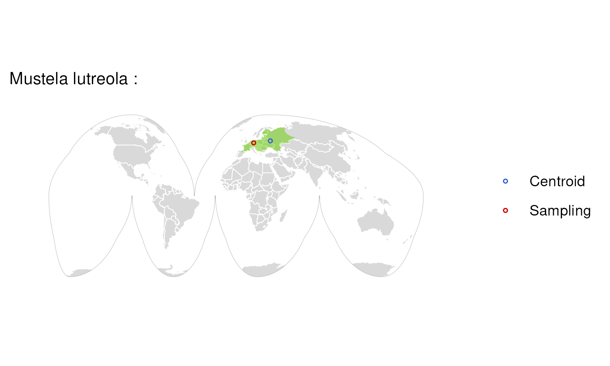

### Species: Mustela nivalis vulgaris

**Common Name:** least weasel\
**Biosample:** SAMEA113398841\
**Assembly Accession:** GCA_964662115.1\
**Taxon:** Mammals\
**Priority:** 6\
**Flags:**

**Map Notes:**\
**Comments:** The assembly mMusNiv2.hap1.1 is based on 33x PacBio data
and Arima2 Hi-C data generated by the Darwin Tree of Life Project
(<https://www.darwintreeoflife.org/>). The assembly process included the
following sequence of steps: initial PacBio assembly generation with
Hifiasm in Hi-C integrated assembly mode, and Hi-C based scaffolding
with YaHS. The mitochondrial genome was assembled using MitoHiFi.
Finally, each haplotype assembly was analysed and manually improved
using TreeVal. Chromosome-scale scaffolds confirmed by the Hi-C data
have been named in order of size. Chromosomes X and Y were identified by
copy number in the diploid assembly.

### Species: Mustelus asterias

**Common Name:** starry smooth-hound shark\
**Biosample:** SAMEA114298637\
**Assembly Accession:** GCA_964213995.1\
**Taxon:** Fishes\
**Priority:** 6\
**Flags:**

**Map Notes:**\
**Comments:** The assembly sMusAst1.hap1.1 is based on 35x PacBio data
and Arima2 Hi-C data generated by the Darwin Tree of Life Project
(<https://www.darwintreeoflife.org/>). The assembly process included the
following sequence of steps: initial PacBio assembly generation with
Hifiasm in Hi-C integrated assembly mode, and Hi-C based scaffolding
with YaHS. The mitochondrial genome was assembled using MitoHiFi.
Finally, each haplotype assembly was analysed and manually improved
using TreeVal. Chromosome-scale scaffolds confirmed by the Hi-C data
have been named in order of size. Chromosome X was identified by HiC and
read coverage statistics. No Y chromosome could be confidently
identified and likely remains in the unplaced scaffolds. Chromosome 30
is likely much larger but shattered, many contigs that likely belong in
Chromosome 30 were left in the unplaced scaffolds as they could not be
accurately placed.

### Species: Myotis daubentonii

**Common Name:** Daubenton’s bat\
**Biosample:** SAMEA9921455\
**Assembly Accession:** GCA_963259705.1\
**Taxon:** Mammals\
**Priority:** 6\
**Flags:**

**Map Notes:**\
**Comments:** The assembly mMyoDau2.1 is based on 40x PacBio data and
Arima2 Hi-C data generated by the Darwin Tree of Life Project
(<https://www.darwintreeoflife.org/>). The assembly process included the
following sequence of steps: initial PacBio assembly generation with
Hifiasm, retained haplotig separation with purge_dups, and Hi-C based
scaffolding with YaHS. The mitochondrial genome was assembled using
MitoHiFi. Finally, the primary assembly was analysed and manually
improved using rapid curation. Chromosome-scale scaffolds confirmed by
the Hi-C data have been named in order of size.

### Species: Myotis emarginatus

**Common Name:** Geoffroy’s bat\
**Biosample:** SAMEA115534660\
**Assembly Accession:** GCA_965115925.1\
**Taxon:** Mammals\
**Priority:** 6\
**Flags:** Zoo Sample;

**Map Notes:**\
**Comments:** The assembly mMyoEma1.hap1.1 is based on 42x PacBio data
and Arima2 Hi-C data generated by the Darwin Tree of Life Project
(<https://www.darwintreeoflife.org/>). The assembly process included the
following sequence of steps: initial PacBio assembly generation with
Hifiasm in Hi-C integrated assembly mode, and Hi-C based scaffolding
with YaHS. The mitochondrial genome was assembled using MitoHiFi.
Finally, each haplotype assembly was analysed and manually improved
using TreeVal. Chromosome-scale scaffolds confirmed by the Hi-C data
have been named in order of size. X chromosome identified based on
synteny with Myotis nattereri (GCA_964212035.1).

### Species: Myotis myotis

**Common Name:** greater mouse-eared bat\
**Biosample:** SAMN14734277\
**Assembly Accession:** GCA_014108235.1\
**Taxon:** Mammals\
**Priority:** 6\
**Flags:**

**Map Notes:**\
**Comments:** NA

### Species: Myotis nattereri

**Common Name:** Natterer’s bat\
**Biosample:** SAMEA114614248\
**Assembly Accession:** GCA_964212035.2\
**Taxon:** Mammals\
**Priority:** 6\
**Flags:**

**Map Notes:**\
**Comments:** The assembly mMyoNat1.hap1.2 is based on 59x PacBio data
and Arima2 Hi-C data generated by the Darwin Tree of Life Project
(<https://www.darwintreeoflife.org/>). The assembly process included the
following sequence of steps: initial PacBio assembly generation with
Hifiasm in Hi-C integrated assembly mode, and Hi-C based scaffolding
with YaHS. The mitochondrial genome was assembled using MitoHiFi.
Finally, each haplotype assembly was analysed and manually improved
using TreeVal. Chromosome-scale scaffolds are named by synteny based on
Myotis nattereri (Natterer’s bat) GCA_964212035.1. The X and Y
chromosomes were identified by read coverage. The exact order and
orientation of the contigs on chromosome Y are unknown.

### Species: Myuchelys georgesi

**Common Name:** Bellinger river turtle\
**Biosample:** SAMN36918804\
**Assembly Accession:** GCA_040894355.2\
**Taxon:** Reptiles\
**Priority:** 6\
**Flags:** Missing Range;

**Map Notes:**\
**Comments:** NA

### Species: Myxine glutinosa

**Common Name:** Atlantic hagfish\
**Biosample:** SAMEA12790223\
**Assembly Accession:** GCA_964187855.1\
**Taxon:** Fishes\
**Priority:** 6\
**Flags:**

**Map Notes:**\
**Comments:** The assembly kmMyxGlut1.1 is based on 30x PacBio data and
Arima2 Hi-C data generated by the Darwin Tree of Life Project
(<https://www.darwintreeoflife.org/>). The assembly process included the
following sequence of steps: initial PacBio assembly generation with
Hifiasm, retained haplotig separation with purge_dups, and Hi-C based
scaffolding with YaHS. The mitochondrial genome was assembled using
MitoHiFi. Finally, the primary assembly was analysed and manually
improved using TreeVal. Chromosome-scale scaffolds confirmed by the Hi-C
data have been named in order of size.

### Species: Nannobrachium achirus

**Common Name:** Lantern fish\
**Biosample:** SAMEA12815432\
**Assembly Accession:** GCA_963921795.1\
**Taxon:** Fishes\
**Priority:** 6\
**Flags:**

**Map Notes:**\
**Comments:** The assembly fNanAch1.1 is based on 31x PacBio data and
Arima2 Hi-C data generated by the Darwin Tree of Life Project
(<https://www.darwintreeoflife.org/>). The assembly process included the
following sequence of steps: initial PacBio assembly generation with
Hifiasm, retained haplotig separation with purge_dups, and Hi-C based
scaffolding with YaHS. The mitochondrial genome was assembled using
MitoHiFi. Finally, the primary assembly was analysed and manually
improved using rapid curation. Chromosome-scale scaffolds confirmed by
the Hi-C data have been named in order of size.

### Species: Nansenia antarctica

**Common Name:** pencil smelt\
**Biosample:** SAMEA8748805\
**Assembly Accession:** GCA_963989245.1\
**Taxon:** Fishes\
**Priority:** 6\
**Flags:** Missing Range;

**Map Notes:**\
**Comments:** The assembly fNanAnt1.1 is based on 39x PacBio data and
Arima2 Hi-C data generated by the Darwin Tree of Life Project
(<https://www.darwintreeoflife.org/>). The assembly process included the
following sequence of steps: initial PacBio assembly generation with
Hifiasm, retained haplotig separation with purge_dups, and Hi-C based
scaffolding with YaHS. The mitochondrial genome was assembled using
MitoHiFi. Finally, the primary assembly was analysed and manually
improved using TreeVal. Chromosome-scale scaffolds confirmed by the Hi-C
data have been named in order of size. Chromosome 5 contains a
heterozygous inversion between approximately 17.4-24.3Mb

### Species: Narcine bancroftii

**Common Name:** lesser electric ray\
**Biosample:** SAMN39325148\
**Assembly Accession:** GCA_036971445.1\
**Taxon:** Fishes\
**Priority:** 6\
**Flags:**

**Map Notes:**\
**Comments:** NA

### Species: Natator depressus

**Common Name:** Australian flatback sea turtle\
**Biosample:** SAMN46282745\
**Assembly Accession:** GCA_965152275.1\
**Taxon:** Reptiles\
**Priority:** 6\
**Flags:** Missing Range;

**Map Notes:**\
**Comments:** NA

### Species: Natrix helvetica

**Common Name:** barred grass snake\
**Biosample:** SAMEA114598156\
**Assembly Accession:** GCA_964273705.1\
**Taxon:** Reptiles\
**Priority:** 6\
**Flags:**

**Map Notes:**\
**Comments:** The assembly rNatHel1.hap1.1 is based on 42x PacBio data
and Arima2 Hi-C data generated by the Darwin Tree of Life Project
(<https://www.darwintreeoflife.org/>). The assembly process included the
following sequence of steps: initial PacBio assembly generation with
Hifiasm in Hi-C integrated assembly mode, and Hi-C based scaffolding
with YaHS. The mitochondrial genome was assembled using MitoHiFi.
Finally, each haplotype assembly was analysed and manually improved
using TreeVal. Chromosome-scale scaffolds confirmed by the Hi-C data
have been named in order of size.

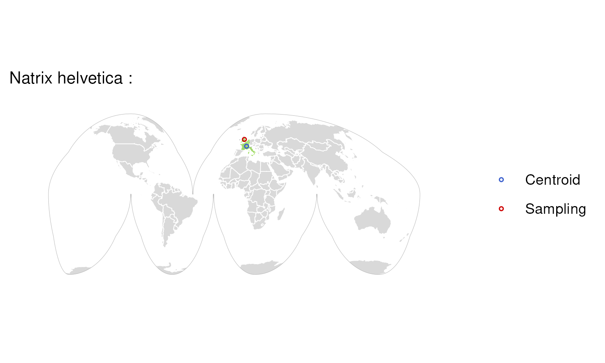

### Species: Neoarius graeffei

**Common Name:** blue salmon catfish\
**Biosample:** SAMN28453209\
**Assembly Accession:** GCA_027579695.1\
**Taxon:** Fishes\
**Priority:** 6\
**Flags:**

**Map Notes:**\
**Comments:** NA

### Species: Neofelis nebulosa

**Common Name:** clouded leopard\
**Biosample:** SAMN31801981\
**Assembly Accession:** GCA_028018385.1\
**Taxon:** Mammals\
**Priority:** 6\
**Flags:** Zoo Sample;

**Map Notes:**\
**Comments:** PacBio and Bionano data were generated from a male
individual, HiC data was generated from a female individual.
Consequentially, Y chromosome shows no HiC signal

### Species: Neosynchiropus ocellatus

**Common Name:** ocellated dragonet\
**Biosample:** SAMN43082349\
**Assembly Accession:** GCA_044231665.1\
**Taxon:** Fishes\
**Priority:** 6\
**Flags:** Zoo Sample;

**Map Notes:**\
**Comments:** NA

### Species: Notolabrus celidotus

**Common Name:** New Zealand spotty wrasse\
**Biosample:** SAMN12623201\
**Assembly Accession:** GCA_009762535.1\
**Taxon:** Fishes\
**Priority:** 6\
**Flags:**

**Map Notes:**\
**Comments:** Due to size limit cut off, this submission does not
include a 137 bp scaffold_651_arrow_ctg1, which does not match any
sequence in the current NCBI database, but was assembled in this
species. The assembly with that scaffold included can be found in Genome
Ark as of the time of this submission:
<https://vgp.github.io/genomeark/Notolabrus_celidotus/>

This assembly represents the principal haplotype of the diploid genome
Notolabrus celidotus and includes the chromosomes. The alternate
haplotype sequences are in WGS project WOTM00000000

### Species: Notolepis coatsi

**Common Name:** Antarctic jonasfish\
**Biosample:** SAMEA8748806\
**Assembly Accession:** GCA_963971535.1\
**Taxon:** Fishes\
**Priority:** 6\
**Flags:** Missing Range;

**Map Notes:**\
**Comments:** The assembly fNotCoa1.1 is based on 48x PacBio data and
Arima2 Hi-C data generated by the Darwin Tree of Life Project
(<https://www.darwintreeoflife.org/>). The assembly process included the
following sequence of steps: initial PacBio assembly generation with
Hifiasm, retained haplotig separation with purge_dups, and Hi-C based
scaffolding with YaHS. The mitochondrial genome was assembled using
MitoHiFi. Finally, the primary assembly was analysed and manually
improved using rapid curation. Chromosome-scale scaffolds confirmed by
the Hi-C data have been named in order of size.

### Species: Notothenia rossii

**Common Name:** marbled rockcod\
**Biosample:** SAMEA12815441\
**Assembly Accession:** GCA_949606895.1\
**Taxon:** Fishes\
**Priority:** 6\
**Flags:** Missing Range;

**Map Notes:**\
**Comments:** The assembly fNotRos5.1 is based on 24x PacBio data and
Arima2 Hi-C data generated by the Darwin Tree of Life Project
(<https://www.darwintreeoflife.org/>). The assembly process included the
following sequence of steps: initial PacBio assembly generation with
Hifiasm, retained haplotig separation with purge_dups, and Hi-C based
scaffolding with YaHS. The mitochondrial genome was assembled using
MitoHiFi. Finally, the primary assembly was analysed and manually
improved using rapid curation. Chromosome-scale scaffolds confirmed by
the Hi-C data have been named in order of size.

### Species: Numenius arquata

**Common Name:** Eurasian curlew\
**Biosample:** SAMEA112693994\
**Assembly Accession:** GCA_964106895.1\
**Taxon:** Birds\
**Priority:** 6\
**Flags:**

**Map Notes:**\
**Comments:** The assembly bNumArq3.hap1.1 is based on 45x PacBio data
and Arima2 Hi-C data generated by the Darwin Tree of Life Project
(<https://www.darwintreeoflife.org/>). The assembly process included the
following sequence of steps: initial PacBio assembly generation with
Hifiasm in Hi-C integrated assembly mode, and Hi-C based scaffolding
with YaHS. The mitochondrial genome was assembled using MitoHiFi.
Finally, each haplotype assembly was analysed and manually improved
using TreeVal. Chromosome-scale scaffolds confirmed by the Hi-C data
have been named in order of size.

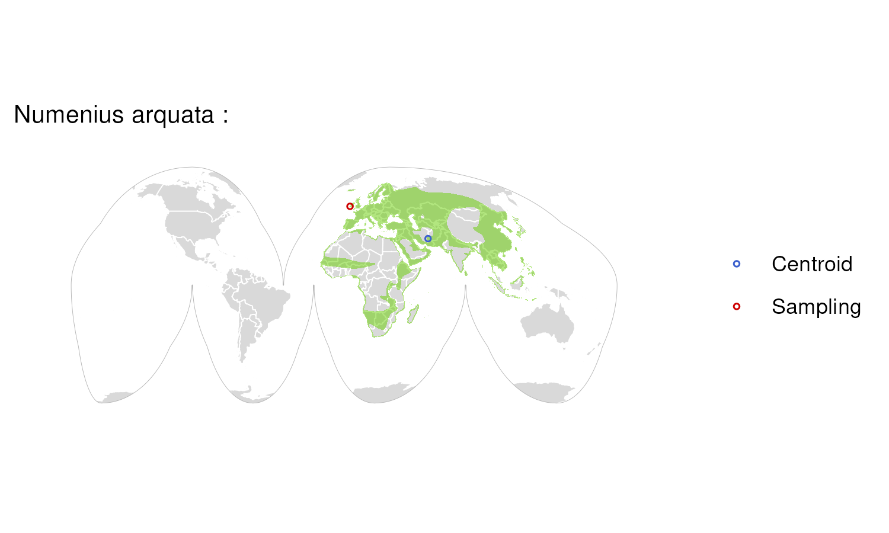

### Species: Nyctalus leisleri

**Common Name:** lesser noctule\
**Biosample:** SAMEA114250308\
**Assembly Accession:** GCA_964264875.2\
**Taxon:** Mammals\
**Priority:** 6\
**Flags:**

**Map Notes:**\
**Comments:** The assembly mNycLei1.hap1.2 is based on 46x PacBio data
and Arima2 Hi-C data generated by the Darwin Tree of Life Project
(<https://www.darwintreeoflife.org/>). The assembly process included the
following sequence of steps: initial PacBio assembly generation with
Hifiasm in Hi-C integrated assembly mode, and Hi-C based scaffolding
with YaHS. The mitochondrial genome was assembled using MitoHiFi.
Finally, each haplotype assembly was analysed and manually improved
using TreeVal. Chromosome-scale scaffolds are named by synteny based on
Nyctalus leisleri (lesser noctule) GCA_964264875.1. The order and
orientation of contigs along chromosome Y is uncertain between 2.7 Mb
and 24 Mb.

### Species: Nyctibius grandis

**Common Name:** great potoo\
**Biosample:** SAMN12622411\
**Assembly Accession:** GCA_013368605.1\
**Taxon:** Birds\
**Priority:** 6\
**Flags:**

**Map Notes:**\
**Comments:** This assembly represents the principal haplotype of the
diploid genome Nyctibius grandis and includes the chromosomes. The
alternate haplotype sequences are in WGS project JABXNW000000000

### Species: Nycticebus coucang

**Common Name:** sunda slow loris\
**Biosample:** SAMN28408555\
**Assembly Accession:** GCA_027406575.1\
**Taxon:** Mammals\
**Priority:** 6\
**Flags:** Zoo Sample;

**Map Notes:**\
**Comments:** NA

### Species: Ochotona princeps

**Common Name:** American pika\
**Biosample:** SAMN35822658\
**Assembly Accession:** GCA_030435755.1\
**Taxon:** Mammals\
**Priority:** 6\
**Flags:**

**Map Notes:**\
**Comments:** NA

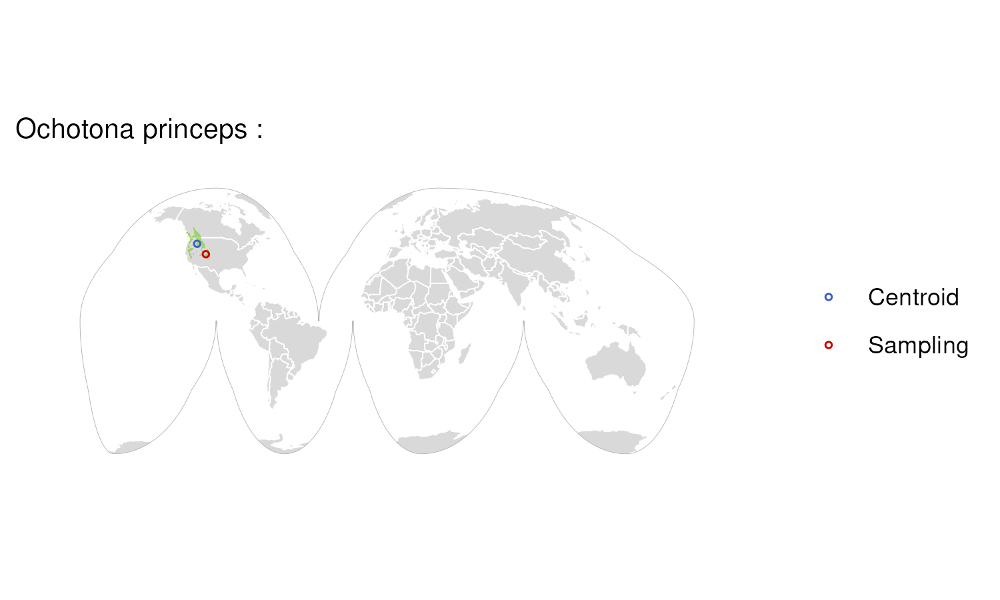

### Species: Odontesthes bonariensis

**Common Name:** pejerrey\
**Biosample:** SAMN31802211\
**Assembly Accession:** GCA_027942865.1\
**Taxon:** Fishes\
**Priority:** 6\
**Flags:**

**Map Notes:**\
**Comments:** Order and orientation of scaffolds are uncertain on
chromosome 3 (between 33.20-35.12 Mb), chromosome 11 (between 2.16-4.15
Mb), and chromosome 22 (between 0-0.52 Mb)\#

### Species: Opisthocomus hoazin

**Common Name:** hoatzin\
**Biosample:** SAMN37055462\
**Assembly Accession:** GCA_030867145.1\
**Taxon:** Birds\
**Priority:** 6\
**Flags:**

**Map Notes:**\
**Comments:** NA

### Species: Orcinus orca

**Common Name:** killer whale\
**Biosample:** SAMEA8800229\
**Assembly Accession:** GCA_937001465.1\
**Taxon:** Mammals\
**Priority:** 6\
**Flags:**

**Map Notes:**\
**Comments:** The assembly mOrcOrc1.1 is based on 34x PacBio data
generated by the Darwin Tree of Life Project
(<https://www.darwintreeoflife.org/>) and Hi-C data made publicly
available by DNA Zoo (<https://dnazoo.org>); <PMID:28336562>. The
assembly process included the following sequence of steps: initial
PacBio assembly generation with Hifiasm, retained haplotig separation
with purge_dups, and Hi-C based scaffolding with YaHS. The mitochondrial
genome was assembled using MitoHiFi. Finally, the assembly was analysed
and manually improved using rapid curation. Chromosome-scale scaffolds
confirmed by the Hi-C data have been named in order of size. Order and
orientation of scaffolds in a repetitive region of chromosome 17 (
33.6Mb) is uncertain.

### Species: Osmerus eperlanus

**Common Name:** European smelt\
**Biosample:** SAMEA14448128\
**Assembly Accession:** GCA_963692335.1\
**Taxon:** Fishes\
**Priority:** 6\
**Flags:**

**Map Notes:**\
**Comments:** The assembly fOsmEpe2.1 is based on 46x PacBio data and
Arima2 Hi-C data generated by the Darwin Tree of Life Project
(<https://www.darwintreeoflife.org/>). The assembly process included the
following sequence of steps: initial PacBio assembly generation with
Hifiasm, retained haplotig separation with purge_dups, and Hi-C based
scaffolding with YaHS. The mitochondrial genome was assembled using
MitoHiFi. Finally, the primary assembly was analysed and manually
improved using rapid curation. Chromosome-scale scaffolds confirmed by
the Hi-C data have been named in order of size. the exact order an
orientation of scaffolds in the repetitive region on chromosome 4
(0-1.8M bp) is unknown.

### Species: Osmerus mordax

**Common Name:** rainbow smelt\
**Biosample:** SAMN40867348\
**Assembly Accession:** GCA_038355195.1\
**Taxon:** Fishes\
**Priority:** 6\
**Flags:**

**Map Notes:**\
**Comments:** NA

### Species: Panthera onca

**Common Name:** jaguar\
**Biosample:** SAMN44524170\
**Assembly Accession:** GCA_046562885.1\
**Taxon:** Mammals\
**Priority:** 6\
**Flags:**

**Map Notes:**\
**Comments:** NA

### Species: Passer domesticus

**Common Name:** house sparrow\
**Biosample:** SAMN39255856\
**Assembly Accession:** GCA_036417665.1\
**Taxon:** Birds\
**Priority:** 6\
**Flags:**

**Map Notes:**\
**Comments:** NA

### Species: Passerculus sandwichensis

**Common Name:** Savannah sparrow\
**Biosample:** SAMN35784765\
**Assembly Accession:** GCA_031885435.1\
**Taxon:** Birds\
**Priority:** 6\
**Flags:**

**Map Notes:**\
**Comments:** NA

### Species: Pelecanus crispus

**Common Name:** dalmatian pelican\
**Biosample:** SAMN35784560\
**Assembly Accession:** GCA_030463565.1\
**Taxon:** Birds\
**Priority:** 6\
**Flags:** Zoo Sample;

**Map Notes:**\
**Comments:** NA

### Species: Pelobates fuscus

**Common Name:** common spadefoot toad\
**Biosample:** SAMN39244120\
**Assembly Accession:** GCA_036172605.1\
**Taxon:** Amphibians\
**Priority:** 6\
**Flags:**

**Map Notes:**\
**Comments:** This assembly is different than others from the VGP, in
that we are including a more complete primary haplotype that has the
original assembly before more complete phasing of haplotypes 1 and 2.
Only the primary haplotype was curated for structural errors and naming
of chromosomes

### Species: Pelodytes ibericus

**Common Name:** Iberian parsley frog\
**Biosample:** SAMN37110875\
**Assembly Accession:** GCA_036172795.1\
**Taxon:** Amphibians\
**Priority:** 6\
**Flags:**

**Map Notes:**\
**Comments:** This assembly is different than others from the VGP, in
that we are including a more complete primary haplotype that has the
original assembly before more complete phasing of haplotypes 1 and 2.
Only the primary haplotype was curated for structural errors and naming
of chromosomes

### Species: Pempheris klunzingeri

**Common Name:** rough bullseye\
**Biosample:** SAMN40589649\
**Assembly Accession:** GCA_042242105.1\
**Taxon:** Fishes\
**Priority:** 6\
**Flags:** Missing Range;

**Map Notes:**\
**Comments:** NA

### Species: Peromyscus maniculatus

**Common Name:** deer mouse\
**Biosample:** SAMN29044276\
**Assembly Accession:** GCA_026229955.1\
**Taxon:** Mammals\
**Priority:** 6\
**Flags:**

**Map Notes:**\
**Comments:** NA

### Species: Petromyzon marinus

**Common Name:** sea lamprey\
**Biosample:** SAMN46926778\
**Assembly Accession:** GCA_048934315.1\
**Taxon:** Fishes\
**Priority:** 6\
**Flags:**

**Map Notes:**\
**Comments:** NA

### Species: Phaethon aethereus

**Common Name:** red-billed tropicbird\
**Biosample:** SAMEA8228673\
**Assembly Accession:** GCA_964289735.1\
**Taxon:** Birds\
**Priority:** 6\
**Flags:**

**Map Notes:**\
**Comments:** The assembly bPhaAeh10.maternal.1 is based on 29x PacBio
data and Arima2 Hi-C data generated by the Darwin Tree of Life Project
(<https://www.darwintreeoflife.org/>). The assembly process included the
following sequence of steps: initial PacBio assembly generation with
Hifiasm in Hi-C integrated assembly mode, and Hi-C based scaffolding
with YaHS. The mitochondrial genome was assembled using MitoHiFi.
Finally, each haplotype assembly was analysed and manually improved
using TreeVal. Chromosome-scale scaffolds confirmed by the Hi-C data
have been named in order of size.

### Species: Phaethornis superciliosus

**Common Name:** long-tailed hermit\
**Biosample:** SAMN23532249\
**Assembly Accession:** GCA_023637945.2\
**Taxon:** Birds\
**Priority:** 6\
**Flags:**

**Map Notes:**\
**Comments:** NA

### Species: Phalacrocorax carbo

**Common Name:** great cormorant\
**Biosample:** SAMEA8228692\
**Assembly Accession:** GCA_963921805.1\
**Taxon:** Birds\
**Priority:** 6\
**Flags:**

**Map Notes:**\
**Comments:** The assembly bPhaCar2.1 is based on 40x PacBio data and
Arima2 Hi-C data generated by the Darwin Tree of Life Project
(<https://www.darwintreeoflife.org/>). The assembly process included the
following sequence of steps: initial PacBio assembly generation with
Hifiasm, retained haplotig separation with purge_dups, and Hi-C based
scaffolding with YaHS. The mitochondrial genome was assembled using
MitoHiFi. Finally, the primary assembly was analysed and manually
improved using gEVAL. Chromosome-scale scaffolds confirmed by the Hi-C
data have been named in order of size. It was not possible to assemble
the W chromosome in this assembly as although the sequence data is from
a female the HiC data was from a male.

### Species: Phocoena phocoena

**Common Name:** harbor porpoise\
**Biosample:** SAMEA111380536\
**Assembly Accession:** GCA_963924675.1\
**Taxon:** Mammals\
**Priority:** 6\
**Flags:**

**Map Notes:**\
**Comments:** The assembly mPhoPho1.1 is based on 24x PacBio data and
Arima2 Hi-C data generated by the Darwin Tree of Life Project
(<https://www.darwintreeoflife.org/>). The assembly process included the
following sequence of steps: initial PacBio assembly generation with
Hifiasm, retained haplotig separation with purge_dups, and Hi-C based
scaffolding with YaHS. The mitochondrial genome was assembled using
MitoHiFi. Finally, the primary assembly was analysed and manually
improved using TreeVal. Chromosome-scale scaffolds confirmed by the Hi-C
data have been named in order of size. Chromosome X was assigned based
on synteny to GCA_008692025.1

### Species: Phoenicopterus ruber

**Common Name:** American flamingo\
**Biosample:** SAMN12614931\
**Assembly Accession:** GCA_009819775.1\
**Taxon:** Birds\
**Priority:** 6\
**Flags:** Zoo Sample;

**Map Notes:**\
**Comments:** This assembly represents the principal haplotype of the
diploid genome Phoenicopterus ruber ruber and includes the chromosomes.
The alternate haplotype sequences are in WGS project WNML00000000

### Species: Pholis gunnellus

**Common Name:** rock gunnel\
**Biosample:** SAMEA7522838\
**Assembly Accession:** GCA_910591455.2\
**Taxon:** Fishes\
**Priority:** 6\
**Flags:** Missing Range;

**Map Notes:**\
**Comments:** The assembly fPhoGun1.2 is based on 45x PacBio data, 10X
Genomics Chromium data, and Arima Hi-C data generated by the Darwin Tree
of Life Project (<https://www.darwintreeoflife.org/>). The assembly
process included the following sequence of steps: initial PacBio
assembly generation with Hifiasm, retained haplotig separation with
purge_dups, short-read polishing using FreeBayes-called variants from
10X Genomics Chromium reads aligned with LongRanger, and Hi-C based
scaffolding with SALSA2. The mitochondrial genome was assembled using
MitoHifi. Finally, the assembly was analysed and manually improved using
gEVAL. Chromosome-scale scaffolds confirmed by the Hi-C data have been
named in order of size.

### Species: Phoxinus phoxinus

**Common Name:** Eurasian minnow\
**Biosample:** SAMEA11296539\
**Assembly Accession:** GCA_949152265.1\
**Taxon:** Fishes\
**Priority:** 6\
**Flags:**

**Map Notes:**\
**Comments:** The assembly fPhoPho1.1 is based on 30x PacBio data and
Arima2 Hi-C data generated by the Darwin Tree of Life Project
(<https://www.darwintreeoflife.org/>). The assembly process included the
following sequence of steps: initial PacBio assembly generation with
Hifiasm, retained haplotig separation with purge_dups, and Hi-C based
scaffolding with YaHS. The mitochondrial genome was assembled using
MitoHiFi. Finally, the primary assembly was analysed and manually
improved using rapid curation. Chromosome-scale scaffolds confirmed by
the Hi-C data have been named in order of size.

### Species: Pipistrellus kuhlii

**Common Name:** Kuhl’s pipistrelle\
**Biosample:** SAMN14734388\
**Assembly Accession:** GCA_014108245.1\
**Taxon:** Mammals\
**Priority:** 6\
**Flags:**

**Map Notes:**\
**Comments:** NA

### Species: Pipistrellus nathusii

**Common Name:** Nathusius’s pipistrelle\
**Biosample:** SAMEA115534661\
**Assembly Accession:** GCA_964656225.1\
**Taxon:** Mammals\
**Priority:** 6\
**Flags:** Zoo Sample;

**Map Notes:**\
**Comments:** The assembly mPipNat1.hap1.1 is based on 51x PacBio data
and Arima2 Hi-C data generated by the Darwin Tree of Life Project
(<https://www.darwintreeoflife.org/>). The assembly process included the
following sequence of steps: initial PacBio assembly generation with
Hifiasm in Hi-C integrated assembly mode, and Hi-C based scaffolding
with YaHS. The mitochondrial genome was assembled using MitoHiFi.
Finally, each haplotype assembly was analysed and manually improved
using TreeVal. Chromosome-scale scaffolds confirmed by the Hi-C data
have been named in order of size. X chromosome identified based on
synteny with Myotis nattereri (GCA_964212035.1).

### Species: Pipistrellus pygmaeus

**Common Name:** soprano pipistrelle\
**Biosample:** SAMEA9921456\
**Assembly Accession:** GCA_949987585.1\
**Taxon:** Mammals\
**Priority:** 6\
**Flags:**

**Map Notes:**\
**Comments:** The assembly mPipPyg2.1 is based on 36x PacBio data and
Arima2 Hi-C data generated by the Darwin Tree of Life Project
(<https://www.darwintreeoflife.org/>). The assembly process included the
following sequence of steps: initial PacBio assembly generation with
Hifiasm, retained haplotig separation with purge_dups, and Hi-C based
scaffolding with YaHS. The mitochondrial genome was assembled using
MitoHiFi. Finally, the primary assembly was analysed and manually
improved using rapid curation. Chromosome-scale scaffolds confirmed by
the Hi-C data have been named in order of size. Sex chromosomes assigned
by coverage statistics.

### Species: Platichthys flesus

**Common Name:** European flounder\
**Biosample:** SAMEA110026475\
**Assembly Accession:** GCA_949316205.1\
**Taxon:** Fishes\
**Priority:** 6\
**Flags:**

**Map Notes:**\
**Comments:** The assembly fPlaFle2.1 is based on 49x PacBio data and
Arima2 Hi-C data generated by the Darwin Tree of Life Project
(<https://www.darwintreeoflife.org/>). The assembly process included the
following sequence of steps: initial PacBio assembly generation with
Hifiasm, retained haplotig separation with purge_dups, and Hi-C based
scaffolding with YaHS. The mitochondrial genome was assembled using
MitoHiFi. Finally, the primary assembly was analysed and manually
improved using rapid curation. Chromosome-scale scaffolds confirmed by
the Hi-C data have been named in order of size.

### Species: Plecotus auritus

**Common Name:** brown big-eared bat\
**Biosample:** SAMEA110056142\
**Assembly Accession:** GCA_963455305.1\
**Taxon:** Mammals\
**Priority:** 6\
**Flags:**

**Map Notes:**\
**Comments:** The assembly mPleAur1.1 is based on 34x PacBio data and
Arima2 Hi-C data generated by the Darwin Tree of Life Project
(<https://www.darwintreeoflife.org/>). The assembly process included the
following sequence of steps: initial PacBio assembly generation with
Hifiasm, retained haplotig separation with purge_dups, and Hi-C based
scaffolding with YaHS. The mitochondrial genome was assembled using
MitoHiFi. Finally, the primary assembly was analysed and manually
improved using rapid curation. Chromosome-scale scaffolds confirmed by
the Hi-C data have been named in order of size. Chromosome X was
assigned based on synteny to GCA_949987585.1

### Species: Pleuronectes platessa

**Common Name:** European plaice\
**Biosample:** SAMEA13853390\
**Assembly Accession:** GCA_947347685.1\
**Taxon:** Fishes\
**Priority:** 6\
**Flags:**

**Map Notes:**\
**Comments:** The assembly fPlePla1.1 is based on 35x PacBio data and
Arima2 Hi-C data generated by the Darwin Tree of Life Project
(<https://www.darwintreeoflife.org/>). The assembly process included the
following sequence of steps: initial PacBio assembly generation with
Hifiasm, retained haplotig separation with purge_dups, and Hi-C based
scaffolding with YaHS. The mitochondrial genome was assembled using
MitoHiFi. Finally, the primary assembly was analysed and manually
improved using rapid curation. Chromosome-scale scaffolds confirmed by
the Hi-C data have been named in order of size.

### Species: Pluvialis apricaria

**Common Name:** European golden plover\
**Biosample:** SAMN18353970\
**Assembly Accession:** GCA_017639485.1\
**Taxon:** Birds\
**Priority:** 6\
**Flags:**

**Map Notes:**\
**Comments:** NA

### Species: Podarcis cretensis

**Common Name:** Cretan wall lizard\
**Biosample:** SAMEA12110019\
**Assembly Accession:** GCA_951804945.1\
**Taxon:** Reptiles\
**Priority:** 6\
**Flags:**

**Map Notes:**\
**Comments:** The assembly rPodCre2.1 is based on 27x PacBio data and
Arima2 Hi-C data generated by the Wellcome Sanger Institute Tree of Life
Programme (<https://www.sanger.ac.uk/programme/tree-of-life/>) as part
of the European Reference Genome Atlas pilot project
(<https://www.erga-biodiversity.eu/pilot-project>). The assembly process
included the following sequence of steps: initial PacBio assembly
generation with Hifiasm, retained haplotig separation with purge_dups,
and Hi-C based scaffolding with YaHS. The mitochondrial genome was
assembled using MitoHiFi. Finally, the primary assembly was analysed and
manually improved using rapid curation. This alternate haplotype
assembly combines the haplotigs separated by purge_dups with haplotigs
separated from the primary assembly during curation. Chromosome Z was
assigned based on synteny to GCA_014706415.1

### Species: Podarcis erhardii

**Common Name:** Aegean wall lizard\
**Biosample:** SAMEA115336771\
**Assembly Accession:** GCA_964252035.1\
**Taxon:** Reptiles\
**Priority:** 6\
**Flags:**

**Map Notes:**\
**Comments:** The assembly rPodErh1.hap1.1 is based on 34x PacBio data
and Arima2 Hi-C data generated by the Wellcome Sanger Institute Tree of
Life Programme (<https://www.sanger.ac.uk/programme/tree-of-life/>). The
assembly process included the following sequence of steps: initial
PacBio assembly generation with Hifiasm in Hi-C integrated assembly
mode, and Hi-C based scaffolding with YaHS. The mitochondrial genome was
assembled using MitoHiFi. Finally, each haplotype assembly was analysed
and manually improved using TreeVal. Chromosome-scale scaffolds
confirmed by the Hi-C data have been named in order of size. sex
chromosomes ZW were identified by ploidy and read coverage

### Species: Podarcis gaigeae

**Common Name:** Skyros wall lizard\
**Biosample:** SAMEA114217796\
**Assembly Accession:** GCA_964106915.2\
**Taxon:** Reptiles\
**Priority:** 6\
**Flags:**

**Map Notes:**\
**Comments:** The assembly rPodGai1.hap1.2 is based on 44x PacBio data
and Arima2 Hi-C data generated by the Wellcome Sanger Institute Tree of
Life Programme (<https://www.sanger.ac.uk/programme/tree-of-life/>). The
assembly process included the following sequence of steps: initial
PacBio assembly generation with Hifiasm in Hi-C integrated assembly
mode, and Hi-C based scaffolding with YaHS. The mitochondrial genome was
assembled using MitoHiFi. Finally, each haplotype assembly was analysed
and manually improved using TreeVal. Chromosome-scale scaffolds
confirmed by the Hi-C data have been named in order of size.

### Species: Podarcis liolepis

**Common Name:** Columbretes wall lizard\
**Biosample:** SAMEA114217798\
**Assembly Accession:** GCA_965112155.1\
**Taxon:** Reptiles\
**Priority:** 6\
**Flags:**

**Map Notes:**\
**Comments:** The assembly rPodLio1.hap1.1 is based on 36x PacBio data
and Arima2 Hi-C data generated by the Wellcome Sanger Institute Tree of
Life Programme (<https://www.sanger.ac.uk/programme/tree-of-life/>). The
assembly process included the following sequence of steps: initial
PacBio assembly generation with Hifiasm in Hi-C integrated assembly
mode, and Hi-C based scaffolding with YaHS. The mitochondrial genome was
assembled using MitoHiFi. Finally, each haplotype assembly was analysed
and manually improved using TreeVal. Chromosome-scale scaffolds
confirmed by the Hi-C data have been named in order of size.

### Species: Podarcis melisellensis

**Common Name:** Dalmatian wall lizard\
**Biosample:** SAMEA115336775\
**Assembly Accession:** GCA_964234715.1\
**Taxon:** Reptiles\
**Priority:** 6\
**Flags:**

**Map Notes:**\
**Comments:** The assembly rPodMel1.hap1.1 is based on 41x PacBio data
and Arima2 Hi-C data generated by the Wellcome Sanger Institute Tree of
Life Programme (<https://www.sanger.ac.uk/programme/tree-of-life/>). The
assembly process included the following sequence of steps: initial
PacBio assembly generation with Hifiasm in Hi-C integrated assembly
mode, and Hi-C based scaffolding with YaHS. The mitochondrial genome was
assembled using MitoHiFi. Finally, each haplotype assembly was analysed
and manually improved using TreeVal. Chromosome-scale scaffolds
confirmed by the Hi-C data have been named in order of size.

### Species: Podarcis muralis

**Common Name:** common wall lizard\
**Biosample:** SAMEA115336776\
**Assembly Accession:** GCA_964188315.1\
**Taxon:** Reptiles\
**Priority:** 6\
**Flags:**

**Map Notes:**\
**Comments:** The assembly rPodMur119.hap1.1 is based on 46x PacBio data
and Arima2 Hi-C data generated by the Wellcome Sanger Institute Tree of
Life Programme (<https://www.sanger.ac.uk/programme/tree-of-life/>). The
assembly process included the following sequence of steps: initial
PacBio assembly generation with Hifiasm in Hi-C integrated assembly
mode, and Hi-C based scaffolding with YaHS. The mitochondrial genome was
assembled using MitoHiFi. Finally, each haplotype assembly was analysed
and manually improved using TreeVal. Chromosome-scale scaffolds
confirmed by the Hi-C data have been named in order of size. Chromosomes
Z and W were assigned by read coverage statistics

### Species: Podarcis pityusensis

**Common Name:** Ibiza wall lizard\
**Biosample:** SAMEA114217797\
**Assembly Accession:** GCA_964106645.2\
**Taxon:** Reptiles\
**Priority:** 6\
**Flags:**

**Map Notes:**\
**Comments:** The assembly rPodPit1.hap1.2 is based on 23x PacBio data
and Arima2 Hi-C data generated by the Wellcome Sanger Institute Tree of
Life Programme (<https://www.sanger.ac.uk/programme/tree-of-life/>). The
assembly process included the following sequence of steps: initial
PacBio assembly generation with Hifiasm in Hi-C integrated assembly
mode, and Hi-C based scaffolding with YaHS. The mitochondrial genome was
assembled using MitoHiFi. Finally, each haplotype assembly was analysed
and manually improved using TreeVal. Chromosome-scale scaffolds
confirmed by the Hi-C data have been named in order of size. Sex
chromosomes were assigned by synteny to Podarcis raffonei
(GCA_027172205.1) and by PacBio reads coverage observed in the HiC map.

### Species: Podarcis siculus

**Common Name:** Italian wall lizard\
**Biosample:** SAMEA115336774\
**Assembly Accession:** GCA_964188175.1\
**Taxon:** Reptiles\
**Priority:** 6\
**Flags:**

**Map Notes:**\
**Comments:** The assembly rPodSic1.hap1.1 is based on 45x PacBio data
and Arima2 Hi-C data generated by the Wellcome Sanger Institute Tree of
Life Programme (<https://www.sanger.ac.uk/programme/tree-of-life/>). The
assembly process included the following sequence of steps: initial
PacBio assembly generation with Hifiasm in Hi-C integrated assembly
mode, and Hi-C based scaffolding with YaHS. The mitochondrial genome was
assembled using MitoHiFi. Finally, each haplotype assembly was analysed
and manually improved using TreeVal. Chromosome-scale scaffolds
confirmed by the Hi-C data have been named in order of size. Chromosomes
Z and W were assigned based on read coverage and HiC signal.

### Species: Podarcis tiliguerta

**Common Name:** Tyrrhenian wall lizard\
**Biosample:** SAMEA114217799\
**Assembly Accession:** GCA_965153285.1\
**Taxon:** Reptiles\
**Priority:** 6\
**Flags:**

**Map Notes:**\
**Comments:** The assembly rPodTil1.hap1.1 is based on 15x PacBio data
and Arima2 Hi-C data generated by the Wellcome Sanger Institute Tree of
Life Programme (<https://www.sanger.ac.uk/programme/tree-of-life/>). The
assembly process included the following sequence of steps: initial
PacBio assembly generation with Hifiasm in Hi-C integrated assembly
mode, and Hi-C based scaffolding with YaHS. The mitochondrial genome was
assembled using MitoHiFi. Finally, each haplotype assembly was analysed
and manually improved using TreeVal. Chromosome-scale scaffolds
confirmed by the Hi-C data have been named in order of size. The Z and W
chromosomes were identified based on its single-copy status within a
diploid assembly and synteny analysis with Podarcis siculus
(GCA_964188175.1)The exact order and orientation of the contigs on
chromosome 6 (85,700 - 89,500 Kbp) are unknown. The exact order and
orientation of the contigs on chromosome 7 (75,200 - 81,200 Kbp) are
unknown. The exact order and orientation of the contigs on chromosome 12
(8,200 - 11,700 Kbp) are unknown. The exact order and orientation of the
contigs on chromosome 14 (9,500 - 12,400 Kbp) are unknown. Chromosome 18
is notably small, measuring only 12,718 Kbp in the assembled genome.

### Species: Podarcis vaucheri

**Common Name:** Andalusian wall lizard\
**Biosample:** SAMEA115336770\
**Assembly Accession:** GCA_965113315.1\
**Taxon:** Reptiles\
**Priority:** 6\
**Flags:**

**Map Notes:**\
**Comments:** The assembly rPodVau1.hap1.1 is based on 33x PacBio data
and Arima2 Hi-C data generated by the Wellcome Sanger Institute Tree of
Life Programme (<https://www.sanger.ac.uk/programme/tree-of-life/>). The
assembly process included the following sequence of steps: initial
PacBio assembly generation with Hifiasm in Hi-C integrated assembly
mode, and Hi-C based scaffolding with YaHS. The mitochondrial genome was
assembled using MitoHiFi. Finally, each haplotype assembly was analysed
and manually improved using TreeVal. Chromosome-scale scaffolds
confirmed by the Hi-C data have been named in order of size. The Z and W
chromosomes were identified based on their single-copy status within a
diploid assembly and synteny analysis with Podarcis raffonei
(GCA_027172205.1)The exact order and orientation of the contigs on
chromosome 2 (120,743 - 128,000 Kbp) are unknown.The exact order and
orientation of the contigs on chromosome 6 (7,500 - 15,000 Kbp) are
unknown.The exact order and orientation of the contigs on chromosome 7
(97,300 - 99,157 Kbp) are unknown.The exact order and orientation of the
contigs on chromosome 9 (68,400 - 71,000s Kbp) are unknown.The exact
order and orientation of the contigs on chromosome 13 (39,800 - 41,300
Kbp) are unknown.The exact order and orientation of the contigs on
chromosome W (37,350 - 41,200 Kbp) are unknown.

### Species: Podargus strigoides

**Common Name:** tawny frogmouth\
**Biosample:** SAMN31801959\
**Assembly Accession:** GCA_028020825.1\
**Taxon:** Birds\
**Priority:** 6\
**Flags:**

**Map Notes:**\
**Comments:** NA

### Species: Podocnemis expansa

**Common Name:** arrau turtle\
**Biosample:** SAMN44516642\
**Assembly Accession:** GCA_045364815.1\
**Taxon:** Reptiles\
**Priority:** 6\
**Flags:** Missing Range;

**Map Notes:**\
**Comments:** NA

### Species: Poecile atricapillus

**Common Name:** black-capped chickadee\
**Biosample:** SAMN35074507\
**Assembly Accession:** GCA_030490865.1\
**Taxon:** Birds\
**Priority:** 6\
**Flags:**

**Map Notes:**\
**Comments:** NA

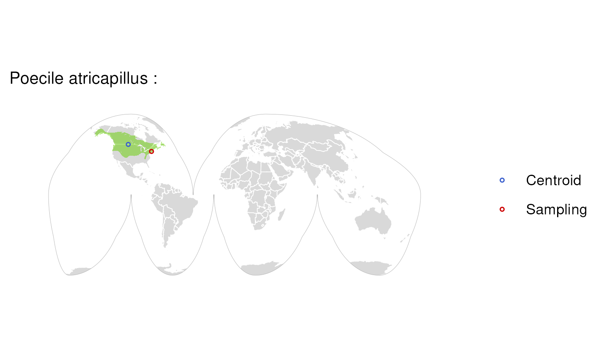

### Species: Pogoniulus pusillus

**Common Name:** red-fronted tinkerbird\
**Biosample:** SAMN15098508\
**Assembly Accession:** GCA_015220805.1\
**Taxon:** Birds\
**Priority:** 6\
**Flags:**

**Map Notes:**\
**Comments:** NA

### Species: Pollachius pollachius

**Common Name:** European pollock\
**Biosample:** SAMEA111562038\
**Assembly Accession:** GCA_949987615.1\
**Taxon:** Fishes\
**Priority:** 6\
**Flags:**

**Map Notes:**\
**Comments:** The assembly fPolPol2.1 is based on 88x PacBio data and
Arima2 Hi-C data generated by the Darwin Tree of Life Project
(<https://www.darwintreeoflife.org/>). The assembly process included the
following sequence of steps: initial PacBio assembly generation with
Hifiasm, retained haplotig separation with purge_dups, and Hi-C based
scaffolding with YaHS. The mitochondrial genome was assembled using
MitoHiFi. Finally, the primary assembly was analysed and manually
improved using rapid curation. Chromosome-scale scaffolds confirmed by
the Hi-C data have been named in order of size.

### Species: Pristiophorus japonicus

**Common Name:** Japanese sawshark\
**Biosample:** SAMN44116980\
**Assembly Accession:** GCA_044704955.1\
**Taxon:** Fishes\
**Priority:** 6\
**Flags:**

**Map Notes:**\
**Comments:** NA

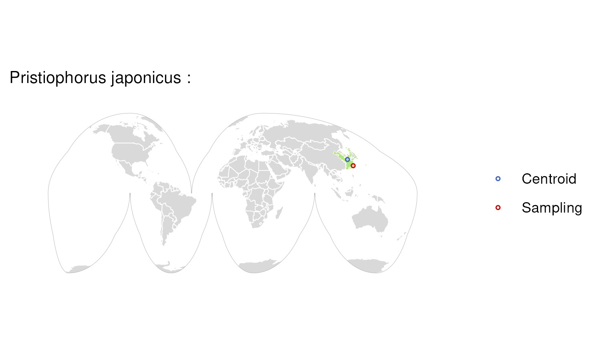

### Species: Pristipomoides typus

**Common Name:** sharptooth jobfish\
**Biosample:** SAMN40589651\
**Assembly Accession:** GCA_045363895.1\
**Taxon:** Fishes\
**Priority:** 6\
**Flags:**

**Map Notes:**\
**Comments:** NA

### Species: Pristis pectinata

**Common Name:** smalltooth sawfish\
**Biosample:** SAMN12629505\
**Assembly Accession:** GCA_009764475.2\
**Taxon:** Fishes\
**Priority:** 6\
**Flags:**

**Map Notes:**\
**Comments:** This assembly represents the principal haplotype of the
diploid genome Pristis pectinata and includes the chromosomes. The
alternate haplotype sequences are in WGS project WOXV00000000.
Chromosome 36 in assembly sPriPec2.pri was reidentified as chromosome X
in assembly sPriPec2.1.pri in March 2021.

### Species: Protomyctophum bolini

**Common Name:** Bolin’s lanternfish\
**Biosample:** SAMEA12815434\
**Assembly Accession:** GCA_963924005.1\
**Taxon:** Fishes\
**Priority:** 6\
**Flags:**

**Map Notes:**\
**Comments:** The assembly fProBol1.1 is based on 40x PacBio data and
Arima2 Hi-C data generated by the Darwin Tree of Life Project
(<https://www.darwintreeoflife.org/>). The assembly process included the
following sequence of steps: initial PacBio assembly generation with
Hifiasm, retained haplotig separation with purge_dups, and Hi-C based
scaffolding with YaHS. The mitochondrial genome was assembled using
MitoHiFi. Finally, the primary assembly was analysed and manually
improved using TreeVal. Chromosome-scale scaffolds confirmed by the Hi-C
data have been named in order of size. sex chromosomes could not be
identified

### Species: Protomyctophum parallelum

**Common Name:** parallel lanternfish\
**Biosample:** SAMEA12815440\
**Assembly Accession:** GCA_964188405.1\
**Taxon:** Fishes\
**Priority:** 6\
**Flags:**

**Map Notes:**\
**Comments:** The assembly fProPar1.1 is based on 35x PacBio data and
Arima2 Hi-C data generated by the Darwin Tree of Life Project
(<https://www.darwintreeoflife.org/>). The assembly process included the
following sequence of steps: initial PacBio assembly generation with
Hifiasm, retained haplotig separation with purge_dups, and Hi-C based
scaffolding with YaHS. The mitochondrial genome was assembled using
MitoHiFi. A manually phased assembly (based on HiC signal) was generated
from a jointly curated primary and alt assembly. Both haplotypes are
assembled to chromosome scale. Finally, the primary assembly was
analysed and manually improved using TreeVal. Chromosome-scale scaffolds
confirmed by the Hi-C data have been named in order of size.

### Species: Pseudorca crassidens

**Common Name:** false killer whale\
**Biosample:** SAMN41253811\
**Assembly Accession:** GCA_039906515.1\
**Taxon:** Mammals\
**Priority:** 6\
**Flags:**

**Map Notes:**\
**Comments:** NA

### Species: Pterocles gutturalis

**Common Name:** yellow-throated sandgrouse\
**Biosample:** SAMN12623217\
**Assembly Accession:** GCA_009769525.1\
**Taxon:** Birds\
**Priority:** 6\
**Flags:**

**Map Notes:**\
**Comments:** This assembly represents the principal haplotype of the
diploid genome Pterocles gutturalis and includes the chromosomes. The
alternate haplotype sequences are in WGS project WNNF00000000

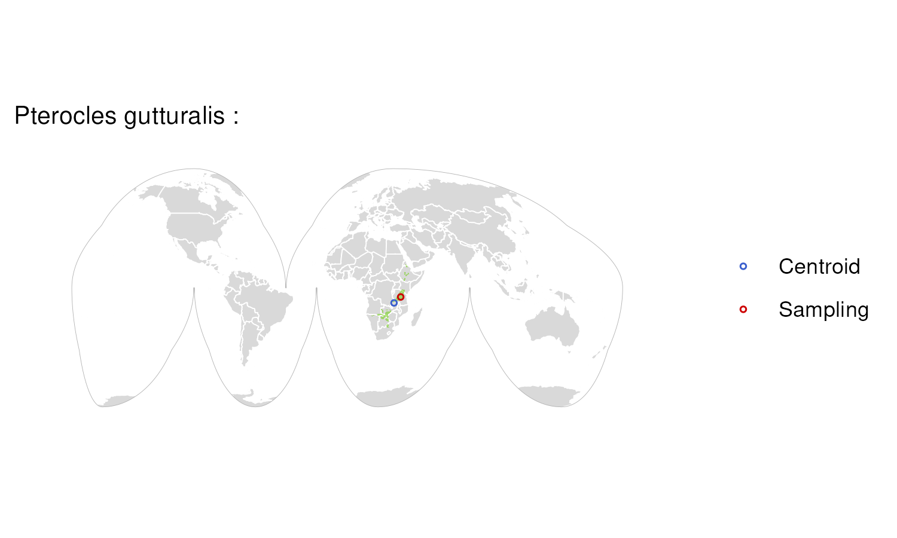

### Species: Pungitius pungitius

**Common Name:** ninespine stickleback\
**Biosample:** SAMEA11296545\
**Assembly Accession:** GCA_949316345.1\
**Taxon:** Fishes\
**Priority:** 6\
**Flags:**

**Map Notes:**\
**Comments:** The assembly fPunPun2.1 is based on 61x PacBio data and
Arima2 Hi-C data generated by the Darwin Tree of Life Project
(<https://www.darwintreeoflife.org/>). The assembly process included the
following sequence of steps: initial PacBio assembly generation with
Hifiasm, retained haplotig separation with purge_dups, and Hi-C based
scaffolding with YaHS. The mitochondrial genome was assembled using
MitoHiFi. Finally, the primary assembly was analysed and manually
improved using rapid curation. Chromosome-scale scaffolds confirmed by
the Hi-C data have been named in order of size.

### Species: Raja brachyura

**Common Name:** blonde ray\
**Biosample:** SAMEA110450105\
**Assembly Accession:** GCA_963514005.1\
**Taxon:** Fishes\
**Priority:** 6\
**Flags:**

**Map Notes:**\
**Comments:** The assembly sRajBra1.1 is based on 33x PacBio data and
Arima2 Hi-C data generated by the Darwin Tree of Life Project
(<https://www.darwintreeoflife.org/>). The assembly process included the
following sequence of steps: initial PacBio assembly generation with
Hifiasm, retained haplotig separation with purge_dups, and Hi-C based
scaffolding with YaHS. The mitochondrial genome was assembled using
MitoHiFi. Finally, the primary assembly was analysed and manually
improved using TreeVal. Chromosome-scale scaffolds confirmed by the Hi-C
data have been named in order of size. X chromosome identified based on
synteny with Carcharodon carcharias (GCA_017639515.1) and Hypanus
sabinus (GCA_030144855.1).

### Species: Rana temporaria

**Common Name:** European common frog\
**Biosample:** SAMEA7521635\
**Assembly Accession:** GCA_905171775.1\
**Taxon:** Amphibians\
**Priority:** 6\
**Flags:**

**Map Notes:**\
**Comments:** The assembly aRanTem1.1 is based on 63x PacBio data, 10X
Genomics Chromium data, BioNano data, and Arima Hi-C data generated by
the Darwin Tree of Life Project (<https://www.darwintreeoflife.org/>).
The assembly process included the following sequence of steps: initial
PacBio assembly generation with Falcon-unzip, retained haplotig
separation with purge_dups, 10X based scaffolding with scaff10x, BioNano
hybrid-scaffolding, Hi-C based scaffolding with SALSA2, Arrow polishing,
and two rounds of FreeBayes polishing. The mitochondrial assembly was
produced at The Rockefeller University using mitoVGP. Finally, the
assembly was analysed and manually improved using gEVAL.
Chromosome-scale scaffolds confirmed by the Hi-C data have been named
using a genetic map provided by Dan Jeffries.

### Species: Rattus norvegicus

**Common Name:** Norway rat\
**Biosample:** SAMN16261960\
**Assembly Accession:** GCA_015227675.2\
**Taxon:** Mammals\
**Priority:** 6\
**Flags:**

**Map Notes:**\
**Comments:** NA

### Species: Rhamphochromis chilingali

**Common Name:** Chilingali cichlid\
**Biosample:** SAMEA112818853\
**Assembly Accession:** GCA_963969265.1\
**Taxon:** Fishes\
**Priority:** 6\
**Flags:** Missing Range;

**Map Notes:**\
**Comments:** The assembly fRhaChi2.1 is based on 64x PacBio data and
Arima2 Hi-C data generated by the Darwin Tree of Life Project
(<https://www.darwintreeoflife.org/>). The assembly process included the
following sequence of steps: initial PacBio assembly generation with
Hifiasm, retained haplotig separation with purge_dups, and Hi-C based
scaffolding with YaHS. The mitochondrial genome was assembled using
MitoHiFi. Finally, the primary assembly was analysed and manually
improved using TreeVal. Chromosome-scale scaffolds confirmed by the Hi-C
data have been named in order of size.

### Species: Rhea pennata

**Common Name:** lesser rhea\
**Biosample:** SAMN32606345\
**Assembly Accession:** GCA_028389875.1\
**Taxon:** Birds\
**Priority:** 6\
**Flags:** Zoo Sample;

**Map Notes:**\
**Comments:** NA

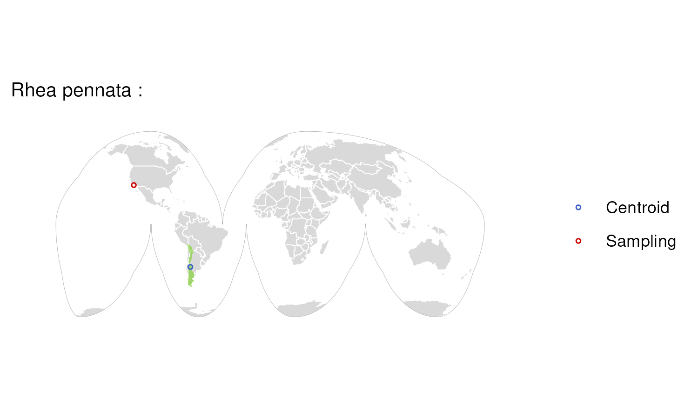

### Species: Rhineura floridana

**Common Name:** Florida worm lizard\
**Biosample:** SAMN34105704\
**Assembly Accession:** GCA_030035675.1\
**Taxon:** Reptiles\
**Priority:** 6\
**Flags:**

**Map Notes:**\
**Comments:** NA

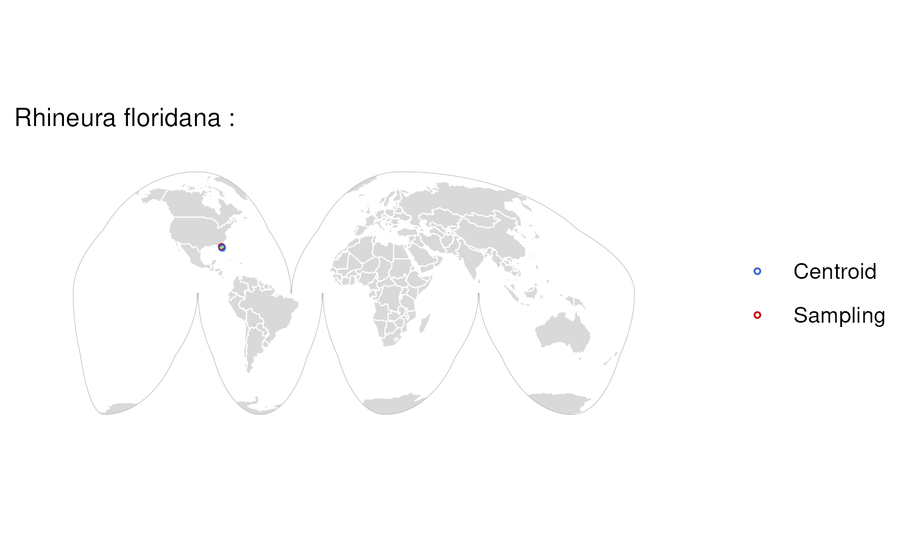

### Species: Rhinogobio nasutus

**Common Name:** Rhinogobio nasutus\
**Biosample:** SAMN45903276\
**Assembly Accession:** GCA_048301585.1\
**Taxon:** Fishes\
**Priority:** 6\
**Flags:** Missing Range;

**Map Notes:**\
**Comments:** NA

### Species: Rhinolophus affinis

**Common Name:** intermediate horseshoe bat\
**Biosample:** SAMN33388345\
**Assembly Accession:** GCA_043728065.1\
**Taxon:** Mammals\
**Priority:** 6\
**Flags:**

**Map Notes:**\
**Comments:** NA

### Species: Rhinolophus ferrumequinum

**Common Name:** greater horseshoe bat\
**Biosample:** SAMN09948510\
**Assembly Accession:** GCA_004115265.3\
**Taxon:** Mammals\
**Priority:** 6\
**Flags:**

**Map Notes:**\
**Comments:** In May 2019 the mitochondrial sequence (RXPC01000135) was
added to this 01 version of RXPC00000000. In November 2020 chromosome 1
was changed to chromosome X based on read mapping and homology evidence
with other species, and the animal’s gender was corrected to female This
assembly represents the primary haplotype of the diploid genome
Rhinolophus ferrumequinum and includes the chromosomes. The alternate
haplotype sequences are in WGS project RXPD00000000.

### Species: Rhinolophus hipposideros

**Common Name:** lesser horseshoe bat\
**Biosample:** SAMEA113980802\
**Assembly Accession:** GCA_964194185.1\
**Taxon:** Mammals\
**Priority:** 6\
**Flags:**

**Map Notes:**\
**Comments:** The assembly mRhiHip2.hap1.1 is based on 39x PacBio data
and Arima2 Hi-C data generated by the Darwin Tree of Life Project
(<https://www.darwintreeoflife.org/>). The assembly process included the
following sequence of steps: initial PacBio assembly generation with
Hifiasm in Hi-C integrated assembly mode, and Hi-C based scaffolding
with YaHS. The mitochondrial genome was assembled using MitoHiFi.
Finally, each haplotype assembly was analysed and manually improved
using TreeVal. Chromosome-scale scaffolds confirmed by the Hi-C data
have been named in order of size. X chromosome identified based on
synteny with Eptesicus nilssonii (GCA_951640355.1).

### Species: Rhinolophus trifoliatus

**Common Name:** trefoil horseshoe bat\
**Biosample:** SAMN33421007\
**Assembly Accession:** GCA_043728145.1\
**Taxon:** Mammals\
**Priority:** 6\
**Flags:**

**Map Notes:**\
**Comments:** NA

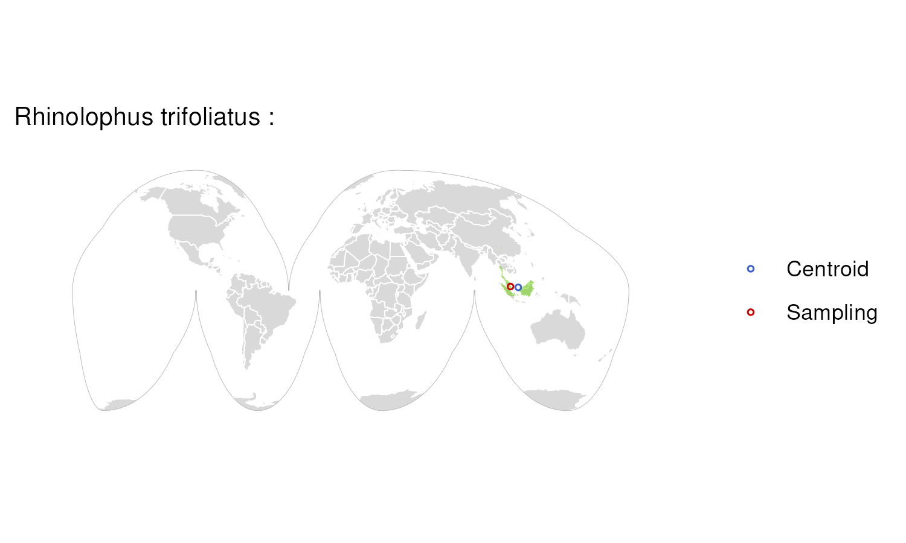

### Species: Rhinolophus yonghoiseni

**Common Name:** Yong hoi sen’s woolly horseshoe bat\
**Biosample:** SAMN33413875\
**Assembly Accession:** GCA_043880425.1\
**Taxon:** Mammals\
**Priority:** 6\
**Flags:** Missing Range;

**Map Notes:**\
**Comments:** NA

### Species: Rhinophrynus dorsalis

**Common Name:** Mexican burrowing toad\
**Biosample:** SAMN40302865\
**Assembly Accession:** GCA_037306005.1\
**Taxon:** Amphibians\
**Priority:** 6\
**Flags:**

**Map Notes:**\
**Comments:** NA

### Species: Rhinopoma microphyllum

**Common Name:** Greater mouse-tailed bat\
**Biosample:** SAMN33421188\
**Assembly Accession:** GCA_043880545.1\
**Taxon:** Mammals\
**Priority:** 6\
**Flags:**

**Map Notes:**\
**Comments:** NA

### Species: Rhynchonycteris naso

**Common Name:** proboscis bat\
**Biosample:** SAMN39947078\
**Assembly Accession:** GCA_037038545.1\
**Taxon:** Mammals\
**Priority:** 6\
**Flags:**

**Map Notes:**\
**Comments:** NA

### Species: Rhynochetos jubatus

**Common Name:** Kagu\
**Biosample:** SAMN31802033\
**Assembly Accession:** GCA_027574665.1\
**Taxon:** Birds\
**Priority:** 6\
**Flags:** Zoo Sample;

**Map Notes:**\
**Comments:** NA

### Species: Rissa tridactyla

**Common Name:** black-legged kittiwake\
**Biosample:** SAMN32104255\
**Assembly Accession:** GCA_028500815.1\
**Taxon:** Birds\
**Priority:** 6\
**Flags:**

**Map Notes:**\
**Comments:** This assemby has the curated paternal haplotype, plus the
W chromosome from the curated maternal haplotype

### Species: Rutilus rutilus

**Common Name:** roach minnow\
**Biosample:** SAMEA11296543\
**Assembly Accession:** GCA_951802725.1\
**Taxon:** Fishes\
**Priority:** 6\
**Flags:**

**Map Notes:**\
**Comments:** The assembly fRutRut2.1 is based on 45x PacBio data and
Arima2 Hi-C data generated by the Darwin Tree of Life Project
(<https://www.darwintreeoflife.org/>). The assembly process included the
following sequence of steps: initial PacBio assembly generation with
Hifiasm, retained haplotig separation with purge_dups, and Hi-C based
scaffolding with YaHS. The mitochondrial genome was assembled using
MitoHiFi. Finally, the primary assembly was analysed and manually
improved using rapid curation. Chromosome-scale scaffolds confirmed by
the Hi-C data have been named in order of size. Large heterozygous
inversion on SUPER_9 between 4.9 Mb and 15.9 Mb.

### Species: Saccopteryx bilineata

**Common Name:** greater sac-winged bat\
**Biosample:** SAMN37288508\
**Assembly Accession:** GCA_036850765.1\
**Taxon:** Mammals\
**Priority:** 6\
**Flags:**

**Map Notes:**\
**Comments:** NA

### Species: Saccopteryx leptura

**Common Name:** lesser sac-winged bat\
**Biosample:** SAMN37390139\
**Assembly Accession:** GCA_036850995.1\
**Taxon:** Mammals\
**Priority:** 6\
**Flags:**

**Map Notes:**\
**Comments:** NA

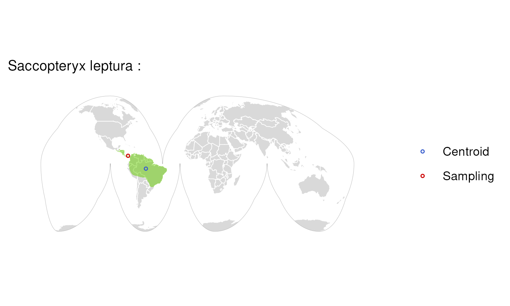

### Species: Salminus brasiliensis

**Common Name:** golden dorado\
**Biosample:** SAMN35075251\
**Assembly Accession:** GCA_030463535.1\
**Taxon:** Fishes\
**Priority:** 6\
**Flags:**

**Map Notes:**\
**Comments:** NA

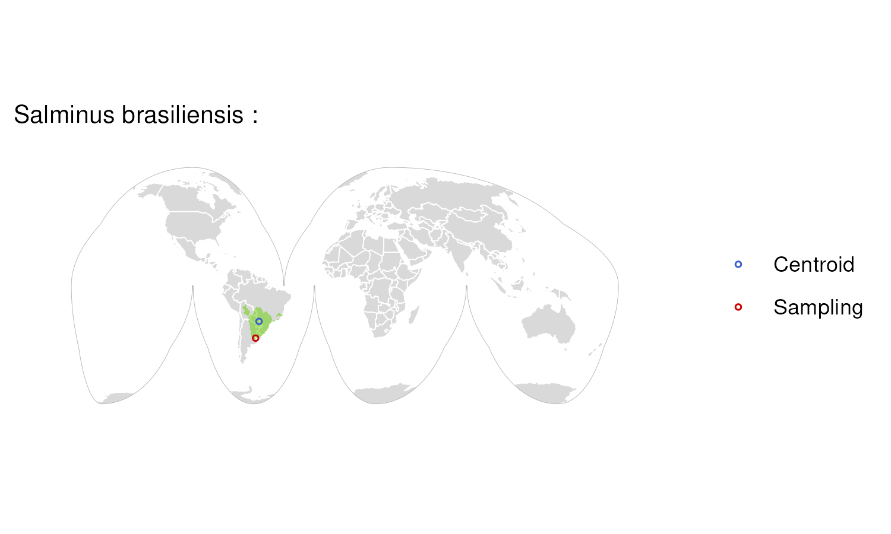

### Species: Salvelinus alpinus

**Common Name:** Arctic char\
**Biosample:** SAMN36900063\
**Assembly Accession:** GCA_036784965.1\
**Taxon:** Fishes\
**Priority:** 6\
**Flags:**

**Map Notes:**\
**Comments:** NA

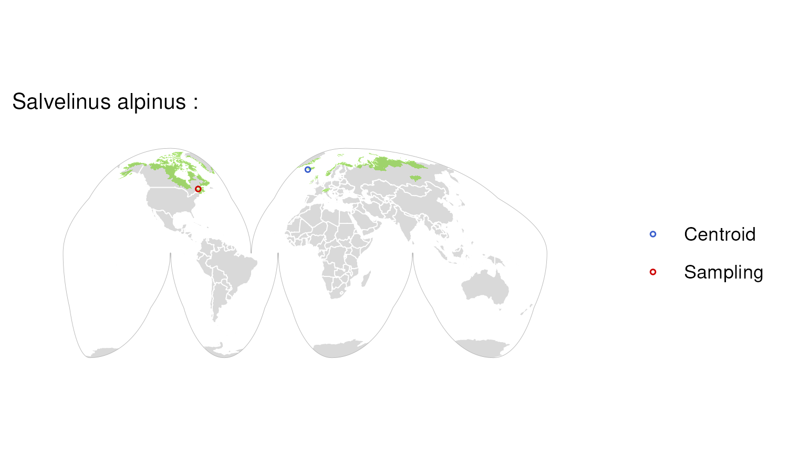

### Species: Sarcoramphus papa

**Common Name:** king vulture\
**Biosample:** SAMN40647026\
**Assembly Accession:** GCA_037962945.1\
**Taxon:** Birds\
**Priority:** 6\
**Flags:**

**Map Notes:**\
**Comments:** NA

### Species: Sardina pilchardus

**Common Name:** sardine\
**Biosample:** SAMEA111562172\
**Assembly Accession:** GCA_963854185.1\
**Taxon:** Fishes\
**Priority:** 6\
**Flags:**

**Map Notes:**\
**Comments:** The assembly fSarPil1.1 is based on 33x PacBio data and
Arima2 Hi-C data generated by the Darwin Tree of Life Project
(<https://www.darwintreeoflife.org/>). The assembly process included the
following sequence of steps: initial PacBio assembly generation with
Hifiasm, retained haplotig separation with purge_dups, and Hi-C based
scaffolding with YaHS. The mitochondrial genome was assembled using
MitoHiFi. Finally, the primary assembly was analysed and manually
improved using rapid curation. Chromosome-scale scaffolds confirmed by
the Hi-C data have been named in order of size. There are large
haplotype inversions on the following chromosomes: Chromosome 5 from
4.03-31.1Mb, Chromosome 8 from 6.87-30.93Mb, Chromosome 9 from
4.98-33.85Mb, Chromosome 15 from 3.26-29.76, Chromosome 17 - a double
inversion from 17.96-30.93. ALT assembly has been assembled into
chromosomes as a merged assembly of both haplotypes was used for
curation.

### Species: Scardinius erythrophthalmus

**Common Name:** common rudd\
**Biosample:** SAMEA11296541\
**Assembly Accession:** GCA_964197995.1\
**Taxon:** Fishes\
**Priority:** 6\
**Flags:**

**Map Notes:**\
**Comments:** The assembly fScaEry2.hap1.1 is based on 69x PacBio data
and Arima2 Hi-C data generated by the Darwin Tree of Life Project
(<https://www.darwintreeoflife.org/>). The assembly process included the
following sequence of steps: initial PacBio assembly generation with
Hifiasm in Hi-C integrated assembly mode, and Hi-C based scaffolding
with YaHS. The mitochondrial genome was assembled using MitoHiFi.
Finally, each haplotype assembly was analysed and manually improved
using TreeVal. Chromosome-scale scaffolds confirmed by the Hi-C data
have been named in order of size.

### Species: Scatophagus argus

**Common Name:** spotted scat\
**Biosample:** SAMN12623616\
**Assembly Accession:** GCA_020382885.1\
**Taxon:** Fishes\
**Priority:** 6\
**Flags:**

**Map Notes:**\
**Comments:** NA

### Species: Scomber japonicus

**Common Name:** Pacific chub mackerel\
**Biosample:** SAMN32224830\
**Assembly Accession:** GCA_027409825.1\
**Taxon:** Fishes\
**Priority:** 6\
**Flags:**

**Map Notes:**\
**Comments:** NA

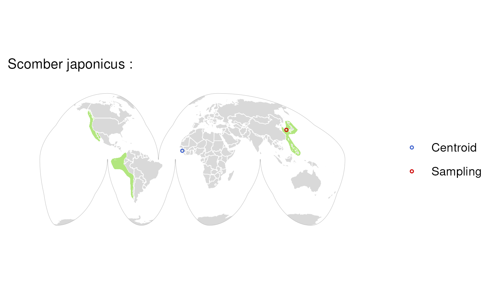

### Species: Scomber scombrus

**Common Name:** Atlantic mackerel\
**Biosample:** SAMEA110450232\
**Assembly Accession:** GCA_963691925.1\
**Taxon:** Fishes\
**Priority:** 6\
**Flags:**

**Map Notes:**\
**Comments:** The assembly fScoSco1.1 is based on 29x PacBio data and
Arima2 Hi-C data generated by the Darwin Tree of Life Project
(<https://www.darwintreeoflife.org/>). The assembly process included the
following sequence of steps: initial PacBio assembly generation with
Hifiasm, retained haplotig separation with purge_dups, and Hi-C based
scaffolding with YaHS. The mitochondrial genome was assembled using
MitoHiFi. Finally, the primary assembly was analysed and manually
improved using rapid curation. Chromosome-scale scaffolds confirmed by
the Hi-C data have been named in order of size.

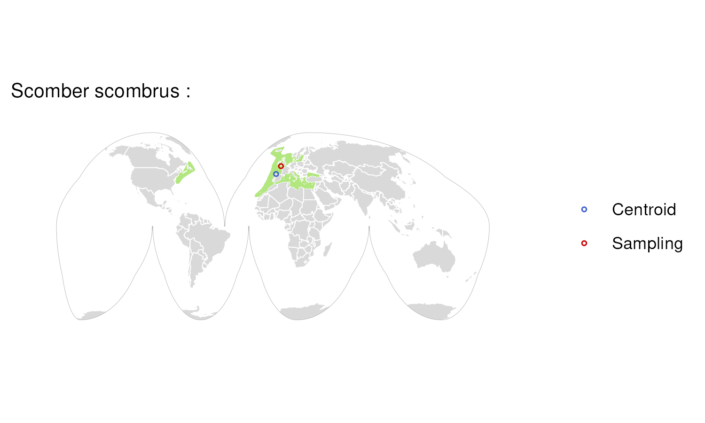

### Species: Scophthalmus maximus

**Common Name:** turbot\
**Biosample:** SAMEA110450106\
**Assembly Accession:** GCA_963854745.1\
**Taxon:** Fishes\
**Priority:** 6\
**Flags:**

**Map Notes:**\
**Comments:** The assembly fScoMax1.1 is based on 41x PacBio data and
Arima2 Hi-C data generated by the Darwin Tree of Life Project
(<https://www.darwintreeoflife.org/>). The assembly process included the
following sequence of steps: initial PacBio assembly generation with
Hifiasm, retained haplotig separation with purge_dups, and Hi-C based
scaffolding with YaHS. The mitochondrial genome was assembled using
MitoHiFi. Finally, the primary assembly was analysed and manually
improved using rapid curation. Chromosome-scale scaffolds confirmed by
the Hi-C data have been named in order of size.

### Species: Sebastes fasciatus

**Common Name:** Acadian redfish\
**Biosample:** SAMN43039489\
**Assembly Accession:** GCA_043250625.1\
**Taxon:** Fishes\
**Priority:** 6\
**Flags:** Missing Range;

**Map Notes:**\
**Comments:** NA

### Species: Sebastes umbrosus

**Common Name:** honeycomb rockfish\
**Biosample:** SAMN12629503\
**Assembly Accession:** GCA_015220745.1\
**Taxon:** Fishes\
**Priority:** 6\
**Flags:** Missing Range;

**Map Notes:**\
**Comments:** NA

### Species: Shinisaurus crocodilurus

**Common Name:** Chinese crocodile lizard\
**Biosample:** SAMN19072228\
**Assembly Accession:** GCA_021292165.1\
**Taxon:** Reptiles\
**Priority:** 6\
**Flags:**

**Map Notes:**\
**Comments:** NA

### Species: Sminthopsis crassicaudata

**Common Name:** fat-tailed dunnart\
**Biosample:** SAMN47327922\
**Assembly Accession:** GCA_048593235.1\
**Taxon:** Mammals\
**Priority:** 6\
**Flags:**

**Map Notes:**\
**Comments:** NA

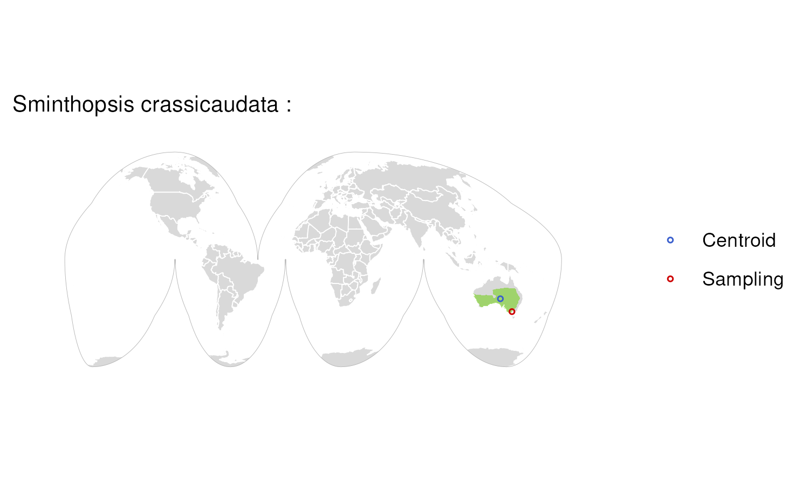

### Species: Solea solea

**Common Name:** common sole\
**Biosample:** SAMEA10984647\
**Assembly Accession:** GCA_958295425.1\
**Taxon:** Fishes\
**Priority:** 6\
**Flags:**

**Map Notes:**\
**Comments:** The assembly fSolSol10.1 is based on 32x PacBio data and
Arima2 Hi-C data generated by the Wellcome Sanger Institute Tree of Life
Programme (<https://www.sanger.ac.uk/programme/tree-of-life/>) as part
of the European Reference Genome Atlas pilot project
(<https://www.erga-biodiversity.eu/pilot-project>). The assembly process
included the following sequence of steps: initial PacBio assembly
generation with Hifiasm, retained haplotig separation with purge_dups,
and Hi-C based scaffolding with YaHS. The mitochondrial genome was
assembled using MitoHiFi. Finally, the primary assembly was analysed and
manually improved using rapid curation. This alternate haplotype
assembly combines the haplotigs separated by purge_dups with haplotigs
separated from the primary assembly during curation.

### Species: Sorex araneus

**Common Name:** European shrew\
**Biosample:** SAMN32477717\
**Assembly Accession:** GCA_027595985.1\
**Taxon:** Mammals\
**Priority:** 6\
**Flags:**

**Map Notes:**\
**Comments:** NA

### Species: Spea bombifrons

**Common Name:** plain spadefoot toad\
**Biosample:** SAMN28408467\
**Assembly Accession:** GCA_027358695.2\
**Taxon:** Amphibians\
**Priority:** 6\
**Flags:**

**Map Notes:**\
**Comments:** In January 2023 56 sequences were suppressed because they
were found to be contaminants.

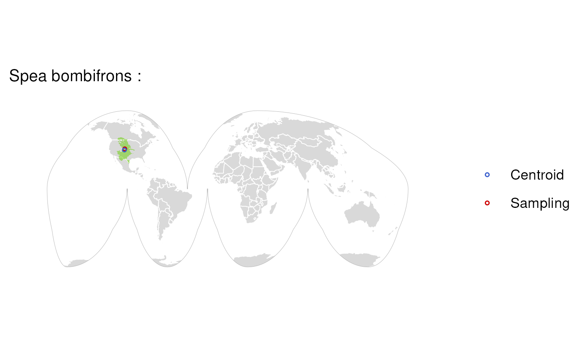

### Species: Spinachia spinachia

**Common Name:** sea stickleback\
**Biosample:** SAMN36735485\
**Assembly Accession:** GCA_048126635.1\
**Taxon:** Fishes\
**Priority:** 6\
**Flags:** Zoo Sample;

**Map Notes:**\
**Comments:** NA

### Species: Sprattus sprattus

**Common Name:** European sprat\
**Biosample:** SAMEA111562173\
**Assembly Accession:** GCA_963457725.1\
**Taxon:** Fishes\
**Priority:** 6\
**Flags:**

**Map Notes:**\
**Comments:** The assembly fSprSpr1.1 is based on 62x PacBio data and
Arima2 Hi-C data generated by the Darwin Tree of Life Project
(<https://www.darwintreeoflife.org/>). The assembly process included the
following sequence of steps: initial PacBio assembly generation with
Hifiasm, retained haplotig separation with purge_dups, and Hi-C based
scaffolding with YaHS. The mitochondrial genome was assembled using
MitoHiFi. Finally, the primary assembly was analysed and manually
improved using rapid curation. Chromosome-scale scaffolds confirmed by
the Hi-C data have been named in order of size.

### Species: Squalius cephalus

**Common Name:** European chub\
**Biosample:** SAMEA11296547\
**Assembly Accession:** GCA_949319135.1\
**Taxon:** Fishes\
**Priority:** 6\
**Flags:**

**Map Notes:**\
**Comments:** The assembly fSquCep2.1 is based on 46x PacBio data and
Arima2 Hi-C data generated by the Darwin Tree of Life Project
(<https://www.darwintreeoflife.org/>). The assembly process included the
following sequence of steps: initial PacBio assembly generation with
Hifiasm, retained haplotig separation with purge_dups, and Hi-C based
scaffolding with YaHS. The mitochondrial genome was assembled using
MitoHiFi. Finally, the primary assembly was analysed and manually
improved using rapid curation. Chromosome-scale scaffolds confirmed by
the Hi-C data have been named in order of size.

### Species: Stegostoma tigrinum

**Common Name:** zebra shark\
**Biosample:** SAMN35823397\
**Assembly Accession:** GCA_030684315.1\
**Taxon:** Fishes\
**Priority:** 6\
**Flags:**

**Map Notes:**\
**Comments:** NA

### Species: Stenella coeruleoalba

**Common Name:** striped dolphin\
**Biosample:** SAMEA111380539\
**Assembly Accession:** GCA_951394435.1\
**Taxon:** Mammals\
**Priority:** 6\
**Flags:**

**Map Notes:**\
**Comments:** The assembly mSteCoe1.1 is based on 35x PacBio data and
Arima2 Hi-C data generated by the Darwin Tree of Life Project
(<https://www.darwintreeoflife.org/>). The assembly process included the
following sequence of steps: initial PacBio assembly generation with
Hifiasm, retained haplotig separation with purge_dups, and Hi-C based
scaffolding with YaHS. The mitochondrial genome was assembled using
MitoHiFi. Finally, the primary assembly was analysed and manually
improved using rapid curation. Chromosome-scale scaffolds confirmed by
the Hi-C data have been named in order of size. The order and
orientation of contigs in the following regions is uncertain: SUPER_6,
20 Mb to 33 Mb and SUPER_4, 87 Mb to 99 Mb.

### Species: Sterna hirundo

**Common Name:** common tern\
**Biosample:** SAMN12369541\
**Assembly Accession:** GCA_009819605.1\
**Taxon:** Birds\
**Priority:** 6\
**Flags:**

**Map Notes:**\
**Comments:** This assembly represents the principal haplotype of the
diploid genome Sterna hirundo and includes the chromosomes. The
alternate haplotype sequences are in WGS project WNMX00000000

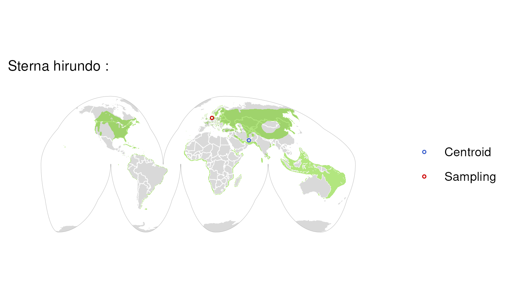

### Species: Sternotherus odoratus

**Common Name:** Eastern musk turtle\
**Biosample:** SAMN36942441\
**Assembly Accession:** GCA_032164245.1\
**Taxon:** Reptiles\
**Priority:** 6\
**Flags:**

**Map Notes:**\
**Comments:** NA

### Species: Streptopelia decaocto

**Common Name:** Eurasian collared-dove\
**Biosample:** SAMEA113398962\
**Assembly Accession:** GCA_964273445.1\
**Taxon:** Birds\
**Priority:** 6\
**Flags:**

**Map Notes:**\
**Comments:** The assembly bStrDea1.hap1.1 is based on 52x PacBio data
and Arima2 Hi-C data generated by the Darwin Tree of Life Project
(<https://www.darwintreeoflife.org/>). The assembly process included the
following sequence of steps: initial PacBio assembly generation with
Hifiasm in Hi-C integrated assembly mode, and Hi-C based scaffolding
with YaHS. The mitochondrial genome was assembled using MitoHiFi.
Finally, each haplotype assembly was analysed and manually improved
using TreeVal. Chromosome-scale scaffolds confirmed by the Hi-C data
have been named in order of size. Z chromosome identified based on
synteny with Nesoenas mayeri (GCA_963082525.1). Karyotyping suggests n =
38 (<https://doi.org/10.1080/00087114.1956.10797566>) but only
identified 32 autosomes + Z in HAP1 and 31 autosomes + Z in HAP2.

### Species: Strix aluco

**Common Name:** tawny owl\
**Biosample:** SAMN37055808\
**Assembly Accession:** GCA_031877795.1\
**Taxon:** Birds\
**Priority:** 6\
**Flags:**

**Map Notes:**\
**Comments:** NA

### Species: Styela clava

**Common Name:** leathery sea squirt\
**Biosample:** SAMEA7536473\
**Assembly Accession:** GCA_964204865.1\
**Taxon:** Invertebrates\
**Priority:** 6\
**Flags:** Missing Range;

**Map Notes:**\
**Comments:** The assembly kaStyClav1.hap1.1 is based on 75x PacBio data
and Arima2 Hi-C data generated by the Darwin Tree of Life Project
(<https://www.darwintreeoflife.org/>). The assembly process included the
following sequence of steps: initial PacBio assembly generation with
Hifiasm in Hi-C integrated assembly mode, and Hi-C based scaffolding
with YaHS. The mitochondrial genome was assembled using MitoHiFi.
Finally, each haplotype assembly was analysed and manually improved
using TreeVal. Chromosome-scale scaffolds confirmed by the Hi-C data
have been named in order of size.

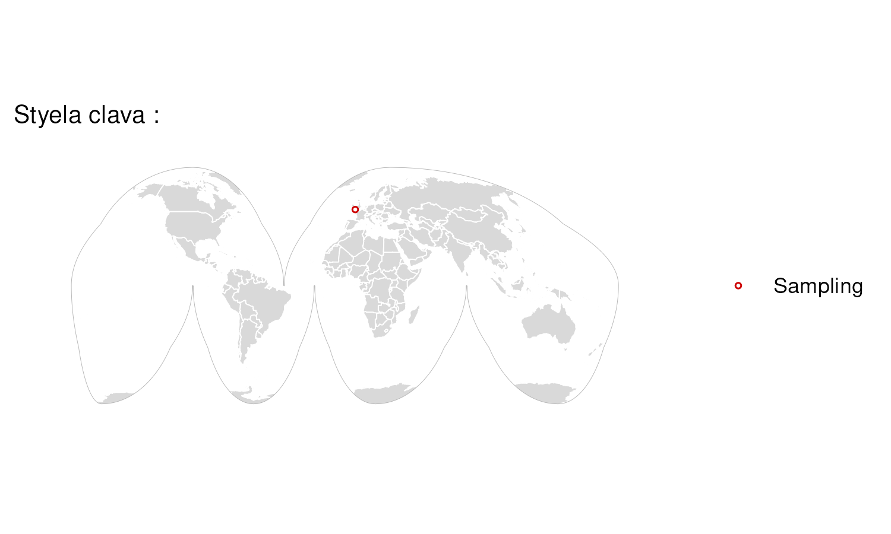

### Species: Sylvia atricapilla

**Common Name:** European blackcap\
**Biosample:** SAMN12369542\
**Assembly Accession:** GCA_009819655.1\
**Taxon:** Birds\
**Priority:** 6\
**Flags:**

**Map Notes:**\
**Comments:** This assembly represents the principal haplotype of the
diploid genome Sylvia atricapilla and includes the chromosomes. The
alternate haplotype sequences are in WGS project WNMZ00000000

### Species: Sylvia borin

**Common Name:** garden warbler\
**Biosample:** SAMN12618613\
**Assembly Accession:** GCA_014839755.1\
**Taxon:** Birds\
**Priority:** 6\
**Flags:**

**Map Notes:**\
**Comments:** This assembly represents the principal haplotype of the
diploid genome Sylvia borin and includes the chromosomes. The alternate
haplotype sequences are in WGS project JACEWF000000000

### Species: Symphodus melops

**Common Name:** corkwing wrasse\
**Biosample:** SAMEA12219485\
**Assembly Accession:** GCA_947650265.1\
**Taxon:** Fishes\
**Priority:** 6\
**Flags:**

**Map Notes:**\
**Comments:** The assembly fSymMel2.1 is based on 32x PacBio data and
Arima2 Hi-C data generated by the Darwin Tree of Life Project
(<https://www.darwintreeoflife.org/>). The assembly process included the
following sequence of steps: initial PacBio assembly generation with
Hifiasm, retained haplotig separation with purge_dups, and Hi-C based
scaffolding with YaHS. The mitochondrial genome was assembled using
MitoHiFi. Finally, the primary assembly was analysed and manually
improved using rapid curation. Chromosome-scale scaffolds confirmed by
the Hi-C data have been named in order of size. GOAT synteny (n=24)
incorrect. Observed karyotype (n=23) matches cytometry results here:
<https://www.researchgate.net/profile/Guillermo-Thode/publication/237187799_>
Karyotype_divergence_in_Symphodus_melops_and_Symphodus_roissali_Labridae_Pe
rciforms_C-banded_and_Ag-NOR_karyotypes/links/0c96051f2307708a8e000000/Kary
otype-divergence-in-Symphodus-melops-and-Symphodus-roissali-Labridae-Percif
orms-C-banded-and-Ag-NOR-karyotypes.pdf

### Species: Synchiropus picturatus

**Common Name:** picturesque dragonet\
**Biosample:** SAMN43082350\
**Assembly Accession:** GCA_044231675.1\
**Taxon:** Fishes\
**Priority:** 6\
**Flags:** Zoo Sample;

**Map Notes:**\
**Comments:** NA

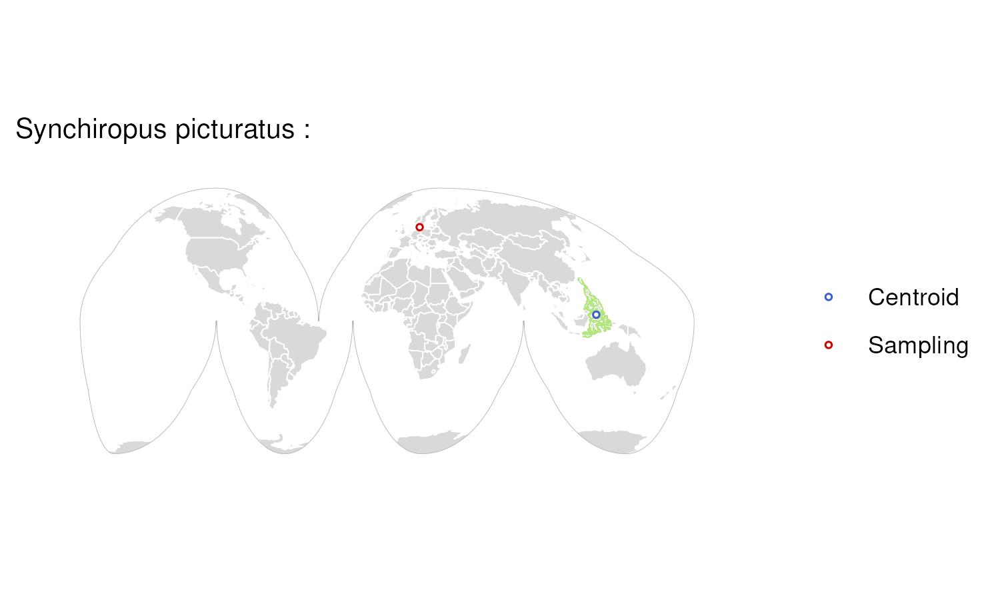

### Species: Tachyglossus aculeatus

**Common Name:** short-beaked echidna\
**Biosample:** SAMN12634963\
**Assembly Accession:** GCA_015852505.1\
**Taxon:** Mammals\
**Priority:** 6\
**Flags:**

**Map Notes:**\
**Comments:** NA

### Species: Tadarida brasiliensis

**Common Name:** Brazilian free-tailed bat\
**Biosample:** SAMN35075070\
**Assembly Accession:** GCA_030848825.1\
**Taxon:** Mammals\
**Priority:** 6\
**Flags:**

**Map Notes:**\
**Comments:** NA

### Species: Talpa europaea

**Common Name:** European mole\
**Biosample:** SAMEA112468127\
**Assembly Accession:** GCA_964194135.1\
**Taxon:** Mammals\
**Priority:** 6\
**Flags:**

**Map Notes:**\
**Comments:** The assembly mTalEur1.hap1.1 is based on 30x PacBio data
and Arima2 Hi-C data generated by the Darwin Tree of Life Project
(<https://www.darwintreeoflife.org/>). The assembly process included the
following sequence of steps: initial PacBio assembly generation with
Hifiasm in Hi-C integrated assembly mode, and Hi-C based scaffolding
with YaHS. The mitochondrial genome was assembled using MitoHiFi.
Finally, each haplotype assembly was analysed and manually improved
using TreeVal. Chromosome-scale scaffolds confirmed by the Hi-C data
have been named in order of size. Chromosome X was assigned based on
synteny to GCA_950295315.1

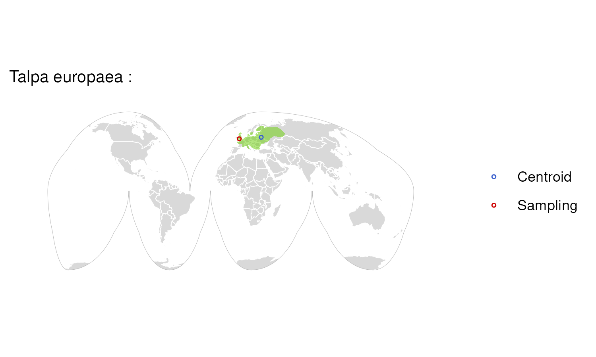

### Species: Tamandua tetradactyla

**Common Name:** Southern tamandua\
**Biosample:** SAMN12612337\
**Assembly Accession:** GCA_023851605.1\
**Taxon:** Mammals\
**Priority:** 6\
**Flags:**

**Map Notes:**\
**Comments:** Order and orientation of scaffolds uncertain for
chromosome 3 from 71.33-78.83 Mb and chromosome 12 from 15.17-21.29 Mb.

### Species: Tapirus indicus

**Common Name:** Malayan tapir\
**Biosample:** SAMN37096863\
**Assembly Accession:** GCA_031878705.1\
**Taxon:** Mammals\
**Priority:** 6\
**Flags:** Zoo Sample;

**Map Notes:**\
**Comments:** NA

### Species: Tauraco erythrolophus

**Common Name:** red-crested turaco\
**Biosample:** SAMN12621036\
**Assembly Accession:** GCA_009769465.1\
**Taxon:** Birds\
**Priority:** 6\
**Flags:** Zoo Sample;

**Map Notes:**\
**Comments:** This assembly represents the principal haplotype of the
diploid genome Tauraco erythrolophus and includes the chromosomes. The
alternate haplotype sequences are in WGS project WOXX00000000

### Species: Taurulus bubalis

**Common Name:** long-spined sea scorpion\
**Biosample:** SAMEA7522994\
**Assembly Accession:** GCA_910589615.1\
**Taxon:** Fishes\
**Priority:** 6\
**Flags:**

**Map Notes:**\
**Comments:** The assembly fTauBub2.1 is based on 38x PacBio data, 10X
Genomics Chromium data, and Arima Hi-C data generated by the Darwin Tree
of Life Project (<https://www.darwintreeoflife.org/>). The assembly
process included the following sequence of steps: initial PacBio
assembly generation with Hifiasm, retained haplotig separation with
purge_dups, short-read polishing using FreeBayes-called variants from
10X Genomics Chromium reads aligned with LongRanger, and Hi-C based
scaffolding with SALSA2. The mitochondrial genome was assembled using
MitoHifi. Finally, the assembly was analysed and manually improved using
gEVAL. Chromosome-scale scaffolds confirmed by the Hi-C data have been
named in order of size.

### Species: Tautogolabrus adspersus

**Common Name:** cunner\
**Biosample:** SAMN22589422\
**Assembly Accession:** GCA_020745685.1\
**Taxon:** Fishes\
**Priority:** 6\
**Flags:**

**Map Notes:**\
**Comments:** NA

### Species: Telmatherina bonti

**Common Name:** telmatherina bonti\
**Biosample:** SAMEA8592627\
**Assembly Accession:** GCA_933228915.1\
**Taxon:** Fishes\
**Priority:** 6\
**Flags:** Zoo Sample;

**Map Notes:**\
**Comments:** The assembly fTelBon1.1 is based on 36x PacBio data and
Arima2 Hi-C data generated by the Darwin Tree of Life Project
(<https://www.darwintreeoflife.org/>). The assembly process included the
following sequence of steps: initial PacBio assembly generation with
Hifiasm, retained haplotig separation with purge_dups, and Hi-C based
scaffolding with YaHS. The mitochondrial genome was assembled using
MitoHifi. Finally, the assembly was analysed and manually improved using
rapid curation. Chromosome-scale scaffolds confirmed by the Hi-C data
have been named in order of size.

### Species: Tetrao urogallus

**Common Name:** Western capercaillie\
**Biosample:** SAMEA9654429\
**Assembly Accession:** GCA_951394365.1\
**Taxon:** Birds\
**Priority:** 6\
**Flags:**

**Map Notes:**\
**Comments:** The assembly bTetUro1.1 is based on 23x PacBio data and
Arima2 Hi-C data generated by the Darwin Tree of Life Project
(<https://www.darwintreeoflife.org/>). The assembly process included the
following sequence of steps: initial PacBio assembly generation with
Hifiasm, retained haplotig separation with purge_dups, and Hi-C based
scaffolding with YaHS. The mitochondrial genome was assembled using
MitoHiFi. Finally, the primary assembly was analysed and manually
improved using rapid curation. Chromosome-scale scaffolds confirmed by
the Hi-C data have been named in order of size. Chromosome Z identified
by alignment to GCA_016699485.1

### Species: Thalia democratica

**Common Name:** Thalia democratica\
**Biosample:** SAMEA111439782\
**Assembly Accession:** GCA_965202585.1\
**Taxon:** Invertebrates\
**Priority:** 6\
**Flags:** Missing Range;

**Map Notes:**\
**Comments:** The assembly ktThaDemo2.hap1.1 is based on 80x PacBio data
and Arima2 Hi-C data generated by the Aquatic Symbiosis Genomics Project
(<https://www.aquaticsymbiosisgenomics.org/>). The assembly process
included the following sequence of steps: initial PacBio assembly
generation with Hifiasm in Hi-C integrated assembly mode, and Hi-C based
scaffolding with YaHS. The mitochondrial genome was assembled using
MitoHiFi. Finally, each haplotype assembly was analysed and manually
improved using TreeVal. Chromosome-scale scaffolds confirmed by the Hi-C
data have been named in order of size. A haplotypic inversion was
observed in the region on chromosome 6 ( 7.3-49.3 Mbp).

### Species: Theristicus caerulescens

**Common Name:** plumbeous ibis\
**Biosample:** SAMN22550094\
**Assembly Accession:** GCA_020745775.1\
**Taxon:** Birds\
**Priority:** 6\
**Flags:**

**Map Notes:**\
**Comments:** NA

### Species: Thomomys bottae

**Common Name:** Botta’s pocket gopher\
**Biosample:** SAMN37300244\
**Assembly Accession:** GCA_031878675.1\
**Taxon:** Mammals\
**Priority:** 6\
**Flags:**

**Map Notes:**\
**Comments:** NA

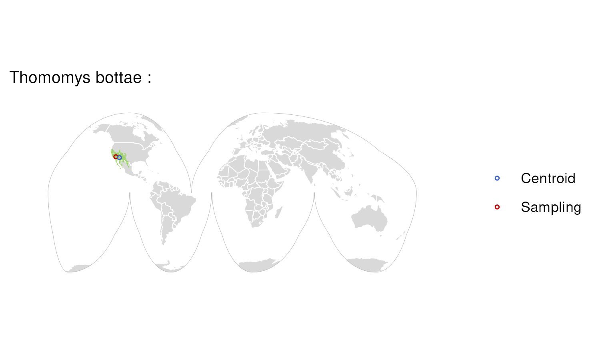

### Species: Thunnus albacares

**Common Name:** yellowfin tuna\
**Biosample:** SAMEA8654749\
**Assembly Accession:** GCA_914725855.1\
**Taxon:** Fishes\
**Priority:** 6\
**Flags:**

**Map Notes:**\
**Comments:** The assembly fThuAlb1.1 is based on 45x PacBio data, 42x
10X Genomics Chromium data, and Arima Hi-C data generated at the
Wellcome Sanger Institute. The assembly process included the following
sequence of steps: initial PacBio assembly generation with Hifiasm,
retained haplotig separation with purge_dups, short-read polishing using
FreeBayes-called variants from 10X Genomics Chromium reads aligned with
LongRanger, and Hi-C based scaffolding with SALSA2. The mitochondrial
genome was assembled using MitoHifi. Finally, the assembly was analysed
and manually improved using gEVAL. Chromosome-scale scaffolds confirmed
by the Hi-C data have been named in order of size.

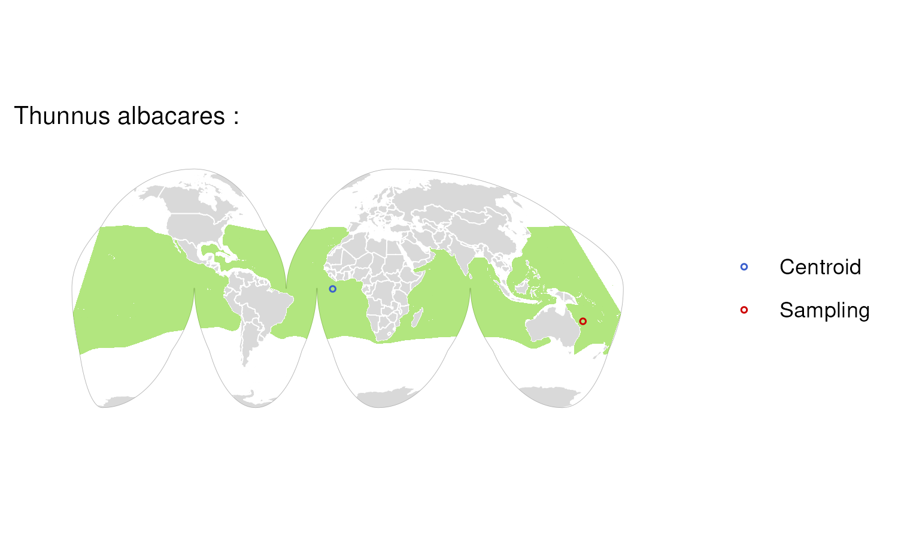

### Species: Thunnus maccoyii

**Common Name:** southern bluefin tuna\
**Biosample:** SAMEA8654747\
**Assembly Accession:** GCA_910596095.1\
**Taxon:** Fishes\
**Priority:** 6\
**Flags:**

**Map Notes:**\
**Comments:** The assembly fThuMac1.1 is based on 46x PacBio data, 46x
10X Genomics Chromium data, BioNano data and Arima Hi-C data generated
at the Wellcome Sanger Institute. The assembly process included the
following sequence of steps: initial PacBio assembly generation with
Hifiasm, retained haplotig separation with purge_dups, short-read
polishing using FreeBayes-called variants from 10X Genomics Chromium
reads aligned with LongRanger, and Hi-C based scaffolding with SALSA2.
The mitochondrial genome was assembled using MitoHifi. Finally, the
assembly was analysed and manually improved using gEVAL. Finally, the
assembly was analysed and manually improved using gEVAL.
Chromosome-scale scaffolds confirmed by the Hi-C data have been named in
order of size. Chromosome 1 contains a large inversion between sister
chromatids at approximately 2.7-9.5Mb.

### Species: Tiliqua scincoides

**Common Name:** blue-tongue skink\
**Biosample:** SAMN37319749\
**Assembly Accession:** GCA_035046505.1\
**Taxon:** Reptiles\
**Priority:** 6\
**Flags:**

**Map Notes:**\
**Comments:** NA

### Species: Trachurus trachurus

**Common Name:** Atlantic horse mackerel\
**Biosample:** SAMEA7524396\
**Assembly Accession:** GCA_905171665.2\
**Taxon:** Fishes\
**Priority:** 6\
**Flags:**

**Map Notes:**\
**Comments:** The assembly fTraTra1.2 is based on 105x PacBio data, 10X
Genomics Chromium data, and Arima Hi-C data generated by the Darwin Tree
of Life Project (<https://www.darwintreeoflife.org/>). The assembly
process included the following sequence of steps: initial PacBio
assembly generation with Falcon-unzip, retained haplotig identification
with purge_dups, 10X based scaffolding with scaff10x, Hi-C based
scaffolding with SALSA2, Arrow polishing, and two rounds of FreeBayes
polishing. The mitochondrial assembly was produced at The Rockefeller
University using mitoVGP. Finally, the assembly was analysed and
manually improved using gEVAL. Chromosome-scale scaffolds are named by
synteny with medaka.

### Species: Trichechus inunguis

**Common Name:** Amazon manatee\
**Biosample:** SAMN44524440\
**Assembly Accession:** GCA_046562895.1\
**Taxon:** Mammals\
**Priority:** 6\
**Flags:**

**Map Notes:**\
**Comments:** NA

### Species: Trididemnum clinides

**Common Name:** Trididemnum clinides\
**Biosample:** SAMEA9873882\
**Assembly Accession:** GCA_963675345.1\
**Taxon:** Invertebrates\
**Priority:** 6\
**Flags:** Missing Range;

**Map Notes:**\
**Comments:** The assembly kaTriClin1.1 is based on 27x PacBio data and
Arima2 Hi-C data generated by the Aquatic Symbiosis Genomics Project
(<https://www.aquaticsymbiosisgenomics.org/>). The assembly process
included the following sequence of steps: initial PacBio assembly
generation with Hifiasm, retained haplotig separation with purge_dups,
and Hi-C based scaffolding with YaHS. The mitochondrial genome was
assembled using MitoHiFi. Finally, the primary assembly was analysed and
manually improved using rapid curation. Chromosome-scale scaffolds
confirmed by the Hi-C data have been named in order of size.

### Species: Triturus cristatus

**Common Name:** warty newt\
**Biosample:** SAMEA112468129\
**Assembly Accession:** GCA_964204655.1\
**Taxon:** Amphibians\
**Priority:** 6\
**Flags:**

**Map Notes:**\
**Comments:** The assembly aTriCri1.1 is based on 36x PacBio data and
Arima2 Hi-C data generated by the Darwin Tree of Life Project
(<https://www.darwintreeoflife.org/>). The assembly process included the
following sequence of steps: initial PacBio assembly generation with
Hifiasm, and Hi-C based scaffolding with YaHS. The mitochondrial genome
was assembled using MitoHiFi. Finally, the primary assembly was analysed
and manually improved using TreeVal. Chromosome-scale scaffolds
confirmed by the Hi-C data have been named in order of size. one arm of
chromosome 1 ( chromosome 1_1) has half-coverage, which might be a very
heterozygous region.

### Species: Trogon surrucura

**Common Name:** surucua trogon\
**Biosample:** SAMN22550082\
**Assembly Accession:** GCA_020746105.1\
**Taxon:** Birds\
**Priority:** 6\
**Flags:**

**Map Notes:**\
**Comments:** NA

### Species: Tursiops truncatus

**Common Name:** bottlenose dolphin\
**Biosample:** SAMN12326775\
**Assembly Accession:** GCA_011762595.2\
**Taxon:** Mammals\
**Priority:** 6\
**Flags:**

**Map Notes:**\
**Comments:** This is the trio assembly merged haplotype data. The
maternal and paternal haplotype sequences are in WGS projects
JAAOMB000000000 and JAAOMC000000000 respectively.

### Species: Urocitellus parryii

**Common Name:** Arctic ground squirrel\
**Biosample:** SAMN44461866\
**Assembly Accession:** GCA_045843805.1\
**Taxon:** Mammals\
**Priority:** 6\
**Flags:**

**Map Notes:**\
**Comments:** NA

### Species: Vanellus vanellus

**Common Name:** Northern Lapwing\
**Biosample:** SAMEA113398832\
**Assembly Accession:** GCA_965231255.1\
**Taxon:** Birds\
**Priority:** 6\
**Flags:**

**Map Notes:**\
**Comments:** The assembly bVanVan1.hap1.1 is based on 48x PacBio data
and Arima2 Hi-C data generated by the Darwin Tree of Life Project
(<https://www.darwintreeoflife.org/>). The assembly process included the
following sequence of steps: initial PacBio assembly generation with
Hifiasm in Hi-C integrated assembly mode, and Hi-C based scaffolding
with YaHS. The mitochondrial genome was assembled using MitoHiFi.
Finally, each haplotype assembly was analysed and manually improved
using TreeVal. Chromosome-scale scaffolds confirmed by the Hi-C data
have been named in order of size. Chromosome Z identified by alignment
to GCA_017639485.1

### Species: Vespertilio murinus

**Common Name:** particolored bat\
**Biosample:** SAMEA112247422\
**Assembly Accession:** GCA_963924515.1\
**Taxon:** Mammals\
**Priority:** 6\
**Flags:**

**Map Notes:**\
**Comments:** The assembly mVesMur1.1 is based on 44x PacBio data and
Arima2 Hi-C data generated by the Darwin Tree of Life Project
(<https://www.darwintreeoflife.org/>). The assembly process included the
following sequence of steps: initial PacBio assembly generation with
Hifiasm, retained haplotig separation with purge_dups, and Hi-C based
scaffolding with YaHS. The mitochondrial genome was assembled using
MitoHiFi. Finally, the primary assembly was analysed and manually
improved using TreeVal. Chromosome-scale scaffolds confirmed by the Hi-C
data have been named in order of size.

### Species: Vidua chalybeata

**Common Name:** village indigobird\
**Biosample:** SAMN12254000\
**Assembly Accession:** GCA_026979565.1\
**Taxon:** Birds\
**Priority:** 6\
**Flags:**

**Map Notes:**\
**Comments:** NA

### Species: Vipera berus

**Common Name:** adder\
**Biosample:** SAMEA114293681\
**Assembly Accession:** GCA_964194415.1\
**Taxon:** Reptiles\
**Priority:** 6\
**Flags:**

**Map Notes:**\
**Comments:** The assembly rVipBer3.hap1.1 is based on 61x PacBio data
and Arima2 Hi-C data generated by the Darwin Tree of Life Project
(<https://www.darwintreeoflife.org/>). The assembly process included the
following sequence of steps: initial PacBio assembly generation with
Hifiasm in Hi-C integrated assembly mode, and Hi-C based scaffolding
with YaHS. The mitochondrial genome was assembled using MitoHiFi.
Finally, each haplotype assembly was analysed and manually improved
using TreeVal. Chromosome-scale scaffolds confirmed by the Hi-C data
have been named in order of size. Chromosomes Z and W were assigned by
read coverage statistics and HiC signal

### Species: Vipera latastei

**Common Name:** snub-nosed viber\
**Biosample:** SAMN28408464\
**Assembly Accession:** GCA_024294585.1\
**Taxon:** Reptiles\
**Priority:** 6\
**Flags:**

**Map Notes:**\
**Comments:** NA

### Species: Vipera ursinii

**Common Name:** Hungarian meadow viper\
**Biosample:** SAMEA12832258\
**Assembly Accession:** GCA_947247035.1\
**Taxon:** Reptiles\
**Priority:** 6\
**Flags:** Zoo Sample;

**Map Notes:**\
**Comments:** The assembly rVipUrs1.1 is based on 28x PacBio data and
Arima2 Hi-C data generated by the Wellcome Sanger Institute Tree of Life
Programme (<https://www.sanger.ac.uk/programme/tree-of-life/>) as part
of the European Reference Genome Atlas pilot project
(<https://www.erga-biodiversity.eu/pilot-project>). The assembly process
included the following sequence of steps: initial PacBio assembly
generation with Hifiasm, retained haplotig separation with purge_dups,
and Hi-C based scaffolding with YaHS. The mitochondrial genome was
assembled using MitoHiFi. Finally, the primary assembly was analysed and
manually improved using rapid curation. This alternate haplotype
assembly combines the haplotigs separated by purge_dups with haplotigs
separated from the primary assembly during curation. The order and
orientation of chromosome W is not determined with full certainty

### Species: Vulpes vulpes

**Common Name:** red fox\
**Biosample:** SAMEA113398840\
**Assembly Accession:** GCA_964106825.2\
**Taxon:** Mammals\
**Priority:** 6\
**Flags:**

**Map Notes:**\
**Comments:** The assembly mVulVul1.hap1.2 is based on 28x PacBio data
and Arima2 Hi-C data generated by the Darwin Tree of Life Project
(<https://www.darwintreeoflife.org/>). The assembly process included the
following sequence of steps: initial PacBio assembly generation with
Hifiasm in Hi-C integrated assembly mode, and Hi-C based scaffolding
with YaHS. The mitochondrial genome was assembled using MitoHiFi.
Finally, each haplotype assembly was analysed and manually improved
using TreeVal. Chromosome-scale scaffolds confirmed by the Hi-C data
have been named in order of size. This genome has been assembled using
PacBio and HiC data and phased. The result is two curated haplotypes.
Chromosome X was assigned by HiC signal.

### Species: Willisornis vidua

**Common Name:** Xingu scale-backed antbird\
**Biosample:** SAMN44516465\
**Assembly Accession:** GCA_045364795.1\
**Taxon:** Birds\
**Priority:** 6\
**Flags:**

**Map Notes:**\
**Comments:** NA

### Species: Zalophus californianus

**Common Name:** California sea lion\
**Biosample:** SAMN12368149\
**Assembly Accession:** GCA_009762305.2\
**Taxon:** Mammals\
**Priority:** 6\
**Flags:**

**Map Notes:**\
**Comments:** This assembly represents the principal haplotype of the
diploid genome Zalophus californianus and includes the chromosomes. The
alternate haplotype sequences are in WGS project WPOB00000000

### Species: Zeus faber

**Common Name:** John dory\
**Biosample:** SAMEA111562156\
**Assembly Accession:** GCA_960531495.1\
**Taxon:** Fishes\
**Priority:** 6\
**Flags:**

**Map Notes:**\
**Comments:** The assembly fZeuFab8.1 is based on 43x PacBio data and
Arima2 Hi-C data generated by the Darwin Tree of Life Project
(<https://www.darwintreeoflife.org/>). The assembly process included the
following sequence of steps: initial PacBio assembly generation with
Hifiasm, retained haplotig separation with purge_dups, and Hi-C based
scaffolding with YaHS. The mitochondrial genome was assembled using
MitoHiFi. Finally, the primary assembly was analysed and manually
improved using rapid curation. Chromosome-scale scaffolds confirmed by
the Hi-C data have been named in order of size.

### Species: Zonotrichia albicollis

**Common Name:** white-throated sparrow\
**Biosample:** SAMN46390924\
**Assembly Accession:** GCA_047830755.1\
**Taxon:** Birds\
**Priority:** 6\
**Flags:**

**Map Notes:**\
**Comments:** NA

### Species: Zootoca vivipara

**Common Name:** European common lizard\
**Biosample:** SAMEA111528662\
**Assembly Accession:** GCA_963506605.1\
**Taxon:** Reptiles\
**Priority:** 6\
**Flags:**

**Map Notes:**\
**Comments:** The assembly rZooViv1.1 is based on 34x PacBio data and
Arima2 Hi-C data generated by the Darwin Tree of Life Project
(<https://www.darwintreeoflife.org/>). The assembly process included the
following sequence of steps: initial PacBio assembly generation with
Hifiasm, retained haplotig separation with purge_dups, and Hi-C based
scaffolding with YaHS. The mitochondrial genome was assembled using
MitoHiFi. Finally, the primary assembly was analysed and manually
improved using gEVAL. Chromosome-scale scaffolds confirmed by the Hi-C
data have been named in order of size.

### Species: Zosterops lateralis

**Common Name:** silver-eye\
**Biosample:** SAMEA112953925\
**Assembly Accession:** GCA_965231275.1\
**Taxon:** Birds\
**Priority:** 6\
**Flags:**

**Map Notes:**\
**Comments:** The assembly bZosLat1.hap1.1 is based on 48x PacBio data
and Arima2 Hi-C data generated by the Wellcome Sanger Institute Tree of
Life Programme (<https://www.sanger.ac.uk/programme/tree-of-life/>). The
assembly process included the following sequence of steps: initial
PacBio assembly generation with Hifiasm in Hi-C integrated assembly
mode, and Hi-C based scaffolding with YaHS. The mitochondrial genome was
assembled using MitoHiFi. Finally, each haplotype assembly was analysed
and manually improved using TreeVal. Chromosome-scale scaffolds
confirmed by the Hi-C data have been named in order of size. Les
Christidis’ 1990 research on the karyotype of Zosterops lateralis
reports a diploid chromosome number of 78. This research is detailed in
the book Animal Cytogenetics: Chordata 3B: Aves, published by Gebruder
Borntraeger, which examines avian cytogenetics.In our genome assembly,
we identified a haploid chromosome count of 39 autosomes plus the Z and
W sex chromosomes. It is possible that some chromosome joins are not
highlighted by the Hi-C signal or that data for certain joins may be
missing, but this cannot be concluded from our assembly.The
microchromosomes were identified through second-shot curation of
scaffolds smaller than 20 Mbp, combined with homology-based
identification using known microchromosome genes via
Microfinder.Chromosomes Z and W were identified by copy number in the
diploid assembly.Chromosomes Z was identified through synteny analysis
with Taeniopygia guttata (GCA_003957565.4).The exact order and
orientation of the contigs on chromosome 23 (1,400 - 7,712 Kbp) are
unknown.The exact order and orientation of the contigs on chromosome 31
(1,100 - 5,932 Kbp) are unknown.

### Species: Coregonus lavaretus

**Common Name:** common whitefish\
**Biosample:** SAMEA111528661\
**Assembly Accession:** GCA_964263955.1\
**Taxon:** Fishes\
**Priority:** 7\
**Flags:**

**Map Notes:**\
**Comments:** The assembly fCorLav1.hap1.1 is based on 45x PacBio data
and Arima2 Hi-C data generated by the Darwin Tree of Life Project
(<https://www.darwintreeoflife.org/>). The assembly process included the
following sequence of steps: initial PacBio assembly generation with
Hifiasm in Hi-C integrated assembly mode, and Hi-C based scaffolding
with YaHS. The mitochondrial genome was assembled using MitoHiFi.
Finally, each haplotype assembly was analysed and manually improved
using TreeVal. Chromosome-scale scaffolds confirmed by the Hi-C data
have been named in order of size. The order and orientation of scaffolds
on Chromosome 2 from approximately 75.4Mb to the end is unsureChromosome
35 and Chromosome 38 are very similar, however, evidence from the hic
maps suggests that they are shattered, collapsed versions of each other.

### Species: Macaca fascicularis

**Common Name:** crab-eating macaque\
**Biosample:** SAMN38317298\
**Assembly Accession:** GCA_037993035.1\
**Taxon:** Mammals\
**Priority:** 7\
**Flags:**

**Map Notes:**\
**Comments:** NA

### Species: Podarcis raffonei

**Common Name:** Aeolian wall lizard\
**Biosample:** SAMN28455423\
**Assembly Accession:** GCA_027172205.1\
**Taxon:** Reptiles\
**Priority:** 7\
**Flags:**

**Map Notes:**\
**Comments:** NA

### Species: Thunnus thynnus

**Common Name:** northern bluefin tuna\
**Biosample:** SAMEA111406335\
**Assembly Accession:** GCA_963924715.1\
**Taxon:** Fishes\
**Priority:** 7\
**Flags:**

**Map Notes:**\
**Comments:** The assembly fThuThy2.1 is based on 37x PacBio data and
Arima2 Hi-C data generated by the Wellcome Sanger Institute Tree of Life
Programme (<https://www.sanger.ac.uk/programme/tree-of-life/>) as part
of the European Reference Genome Atlas pilot project
(<https://www.erga-biodiversity.eu/pilot-project>). The assembly process
included the following sequence of steps: initial PacBio assembly
generation with Hifiasm, retained haplotig separation with purge_dups,
and Hi-C based scaffolding with YaHS. The mitochondrial genome was
assembled using MitoHiFi. Finally, the primary assembly was analysed and
manually improved using TreeVal. This alternate haplotype assembly
combines the haplotigs separated by purge_dups with haplotigs separated
from the primary assembly during curation.

### Species: Trichomycterus rosablanca

**Common Name:** Rosablanca cavefish\
**Biosample:** SAMN32755940\
**Assembly Accession:** GCA_030014385.1\
**Taxon:** Fishes\
**Priority:** 7\
**Flags:**

**Map Notes:**\
**Comments:** The following regions are of undetermined order and
orientation: Chromosome 4 - 9.5-17.5 Mb, Chromosome 9 - 1-4 Mb,
Chromosome 10 - 6-10 Mb, Chromosome 14 - 17-35 Mb.

